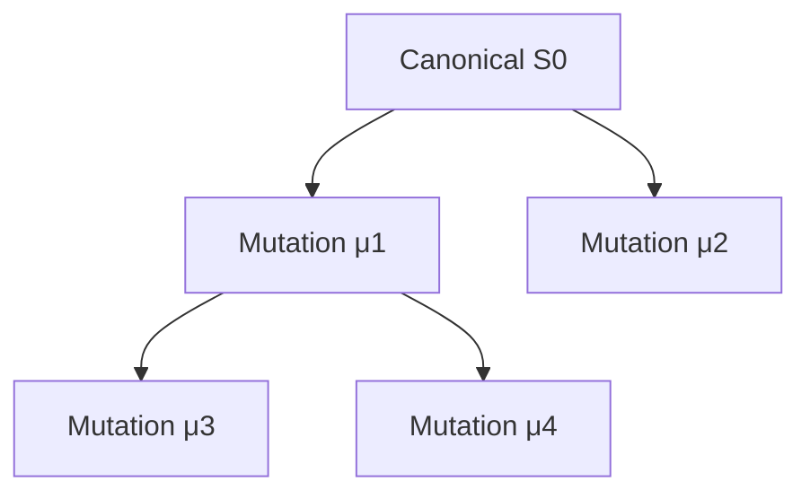
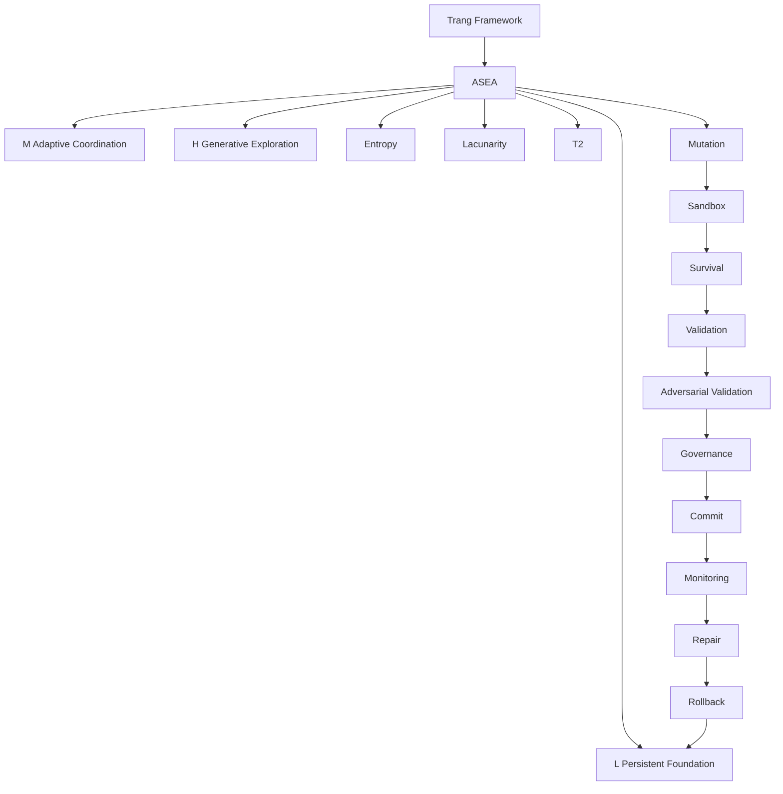

# TRANG ∅ FRAMEWORK → ASEA

## Full Maximum Canonical English Expansion

### Adaptive Self-Evolution AI — Governed Self-Repair, Mutation, Selection, Provenance, and Recovery

> **Origin Architect / Steward:** Trang Phan
> **Corpus:** AMOS / Trang Framework
> **Epistemic boundary:** Source architecture is preserved as `SOURCE_CLAIM / AMOS_MODEL`. Mathematical consequences explicitly derivable from supplied equations are `DERIVED`. Engineering extensions are `PROPOSED`. Runtime and empirical claims remain `UNKNOWN/GAP` unless independently demonstrated.

---

# 1. Canonical Thesis

Trang ASEA can be represented at source level as:

$$
\boxed{
ASEA=[L,M,H]+\Lambda+E+T2+\mu+\sigma
}
$$

with evolutionary transition:

$$
\boxed{
ASEA_{t+1}=\sigma(\mu(ASEA_t))
}
$$

where:

* \(L\) = persistent foundation;
* \(M\) = adaptive coordination;
* \(H\) = generative/exploratory reasoning;
* \(\Lambda\) = lacunarity-like structural variable;
* \(E\) = entropy-like state variable;
* \(T2\) = validation/corroboration mechanism;
* \(\mu\) = mutation;
* \(\sigma\) = survival/selection.

The deepest safe interpretation is not simply “AI that modifies itself.”

It is:

$$
\boxed{
\text{Candidate variation}
\rightarrow
\text{validation}
\rightarrow
\text{selection}
\rightarrow
\text{governed persistence}
}
$$

Self-modification becomes governed self-evolution only when proposed changes cannot silently promote themselves into canonical state.

---

# 2. Primary Constitutional Separation

Three objects must remain distinct:

$$
S_t
$$

current accepted state,

$$
S'_t
$$

candidate mutated state,

and:

$$
S_{t+1}
$$

next accepted state.

Therefore:

$$
\boxed{
S'_t\neq S_{t+1}
}
$$

until validation and authorization succeed.

This yields the core law:

$$
\boxed{
Mutation\neq Commit
}
$$

---

# 3. Source Model Versus Hardened Runtime

The source equation is:

$$
ASEA_{t+1}=\sigma(\mu(ASEA_t))
$$

A hardened implementation can conceptually refine it as:

$$
\boxed{
S_{t+1}
=
Commit_G
\left[
V_A
\left(
V_S
\left(
\sigma
\left(
Sandbox(\mu(S_t))
\right)
\right)
\right)
\right]
}
$$

where:

* \(V_S\) = supporting validation;
* \(V_A\) = adversarial validation;
* \(G\) = governance authority;
* `Commit` = persistent state transition.

This expanded equation is **DERIVED/PROPOSED**, not a replacement for the source equation.

---

# 4. State Architecture

A fuller state representation is:

$$
S_t=
(
L_t,
M_t,
H_t,
E_t,
\Lambda_t,
T2_t,
P_t,
G_t,
R_t
)
$$

where the final three terms can represent, in a hardened architecture:

* \(P_t\): provenance state;
* \(G_t\): governance state;
* \(R_t\): operating regime.

Thus mutation becomes:

$$
\mu:S_t\rightarrow S'_t
$$

while commit becomes:

$$
Commit:S'_t\rightarrow S_{t+1}
$$

only after required gates pass.

---

# 5. L — Persistent Foundation

At source level:

$$
\boxed{
L=PersistentFoundation
}
$$

Its conceptual responsibilities include:

* persistent memory;
* retained knowledge;
* invariants;
* checkpoints;
* stable foundations.

But persistence and epistemic validity are different properties.

$$
\boxed{
Persistent(x)\not\Rightarrow True(x)
}
$$

---

# 6. Memory Integrity

A robust memory object requires more than content.

Conceptually:

$$
K_i=
(
Claim_i,
Class_i,
Evidence_i,
Provenance_i,
Scope_i,
Regime_i,
Freshness_i,
Dependencies_i
)
$$

A stored claim should retain its epistemic class.

Thus:

$$
SOURCE\_CLAIM
\xrightarrow{store}
SOURCE\_CLAIM
$$

not:

$$
SOURCE\_CLAIM
\xrightarrow{store}
VERIFIED
$$

---

# 7. Persistence Cannot Promote Evidence

Canonical invariant:

$$
\boxed{
Storage\neq Validation
}
$$

and:

$$
\boxed{
Memory\neq Truth
}
$$

and:

$$
\boxed{
Consolidation\neq Verification
}
$$

---

# 8. Recursive Memory Hazard

Without provenance discipline:

$$
Claim
\rightarrow
Memory
\rightarrow
Generation
\rightarrow
Memory
$$

can create artificial confidence.

If a generated descendant later appears as corroborating evidence for its ancestor:

$$
C_0\rightarrow C_1\rightarrow C_2
$$

then counting \(C_1\) and \(C_2\) as independent confirmation is invalid.

---

# 9. Provenance Hardening

Therefore:

$$
\boxed{
SharedAncestry\neq IndependentConfirmation
}
$$

Evidence should preserve root ancestry, not merely immediate source labels.

---

# 10. M — Adaptive Coordination

At source level:

$$
\boxed{
M=AdaptiveMediator
}
$$

M connects persistent foundation and generative reasoning:

$$
L\leftrightarrow M\leftrightarrow H
$$

Possible responsibilities include:

* retrieval;
* routing;
* coordination;
* prioritization;
* context assembly;
* adaptive connection management.

---

# 11. Retrieval Does Not Change Truth Class

If:

$$
L(c)=SOURCE\_CLAIM
$$

then retrieval through M does not imply:

$$
M(L(c))=VERIFIED
$$

Thus:

$$
\boxed{
Retrieval\neq Revalidation
}
$$

---

# 12. M as Epistemic Router

A hardened M should preserve:

$$
(
ClaimClass,
Provenance,
Scope,
Regime,
Freshness
)
$$

while routing evidence.

Otherwise information can become detached from its validity envelope.

---

# 13. Context Selection Is Causally Important

Even when H remains unchanged:

$$
Output=H(Context)
$$

and:

$$
Context=M(L,Q)
$$

Therefore changing M can alter outputs substantially.

This means routing mutations can be consequential even without changing H.

---

# 14. H — Generative Exploration

At source level:

$$
\boxed{
H=GenerativeExploration
}
$$

H may produce:

$$
C=\{c_1,\ldots,c_n\}
$$

where candidates may be:

* hypotheses;
* plans;
* answers;
* mutations;
* explanations;
* actions.

---

# 15. Generation Firewall

$$
\boxed{
Generated(c)\not\Rightarrow Supported(c)
}
$$

and:

$$
\boxed{
Novel(c)\not\Rightarrow True(c)
}
$$

and:

$$
\boxed{
Proposed(a)\not\Rightarrow Authorized(a)
}
$$

---

# 16. L/M/H Balance

The three layers can be compressed as:

$$
L\rightarrow Stability
$$

$$
M\rightarrow Adaptability
$$

$$
H\rightarrow Exploration
$$

A functioning architecture therefore balances:

$$
\boxed{
Stability+Adaptability+Exploration
}
$$

rather than maximizing any one term independently.

---

# 17. Excess L

Too much persistence without correction can create:

$$
Rigidity
$$

or:

$$
PersistentError
$$

---

# 18. Excess M

Excessive adaptation can create:

$$
RoutingInstability
$$

---

# 19. Excess H

Excessive exploration can create:

$$
GenerativeInstability
$$

---

# 20. Recursive L/M/H

Within the broader AMOS fractal reasoning pattern, a component may itself admit L/M/H decomposition:

$$
X\rightarrow[X_L,X_M,X_H]
$$

for:

$$
X\in\{L,M,H\}
$$

This is a **derived recursive interpretation**, not proof that every ASEA implementation must physically instantiate nine explicit modules.

---

# 21. Recursion Firewall

$$
\boxed{
RecursivePattern\neq PhysicalFractalProof
}
$$

and:

$$
\boxed{
SameArchitecture\neq SameMechanism
}
$$

---

# 22. Sparse Retrieval

Recursive decomposition should not imply loading everything.

A minimal sufficient path is:

```text
BOOTSTRAP
   ↓
H DOMAIN
   ↓
M SUBSYSTEM
   ↓
L DETAIL
   ↓
RAW EVIDENCE
```

only where deeper retrieval can materially change the conclusion.

---

# 23. Entropy State

ASEA uses:

$$
E_L,E_M,E_H
$$

as layer-specific state variables.

The source does not establish a complete empirical measurement protocol for them.

Therefore they remain:

$$
\boxed{
MODEL\_VARIABLES
}
$$

---

# 24. Entropy Semantics Gap

To reproduce \(E_X\), an implementation would need:

* state space;
* probability distribution;
* normalization;
* observation window;
* estimator.

Without those:

$$
E_H=0.25
$$

is not independently reproducible from the abstract framework alone.

---

# 25. Entropy-Type Firewall

Potential implementations could involve:

$$
E_{token}
$$

$$
E_{hypothesis}
$$

$$
E_{routing}
$$

$$
E_{memory}
$$

$$
E_{topology}
$$

These are not automatically equivalent.

$$
\boxed{
E_{token}\neq E_{hypothesis}\neq E_{topology}
}
$$

unless explicitly bound.

---

# 26. Lacunarity State

The framework uses:

$$
\Lambda_L,\Lambda_M,\Lambda_H
$$

with adaptive target dynamics.

General recurrence:

$$
\boxed{
\Lambda_X(t+1)
=
\Lambda_X(t)
+
\eta_X
[
\Lambda_{X,opt}-\Lambda_X(t)
]
+
\kappa_X\xi(t)
}
$$

for:

$$
X\in\{L,M,H\}
$$

---

# 27. Deterministic Component

Ignoring perturbation:

$$
\Lambda_{t+1}
=
(1-\eta)\Lambda_t+\eta\Lambda_{opt}
$$

Define:

$$
e_t=\Lambda_t-\Lambda_{opt}
$$

Then:

$$
\boxed{
e_{t+1}=(1-\eta)e_t
}
$$

---

# 28. Stability Result

The simplified recurrence converges if:

$$
|1-\eta|<1
$$

therefore:

$$
\boxed{
0<\eta<2
}
$$

This is a **DERIVED mathematical property** of the recurrence.

It does not empirically calibrate ASEA.

---

# 29. Monotonic Convergence

If:

$$
0<\eta\le1
$$

the simplified error approaches zero without alternating sign.

---

# 30. Oscillatory Convergence

If:

$$
1<\eta<2
$$

the sign alternates while magnitude decreases.

---

# 31. Divergence

If:

$$
\eta>2
$$

the simplified recurrence diverges.

---

# 32. Perturbation Gap

The source includes:

$$
\kappa_X\xi(t)
$$

but the semantics of \(\xi\) remain underdefined.

Unknown:

* stochastic versus deterministic;
* distribution;
* mean;
* variance;
* independence;
* cross-layer correlation.

Thus:

$$
\boxed{
\xi=UNKNOWN/GAP
}
$$

at implementation level.

---

# 33. Lacunarity Measurement Gap

The source does not fully establish:

* topology being measured;
* scale;
* occupancy definition;
* estimator;
* normalization.

Therefore:

$$
\Lambda
$$

must not silently be equated with a standard empirical fractal lacunarity statistic.

---

# 34. Hallucination Predicate

The source-level rule is:

$$
\boxed{
Hallucination
\iff
(E_H>0.3)
\lor
(\Lambda_H>0.5)
\lor
(T2=False)
}
$$

This is preserved as a source-defined model rule.

---

# 35. Strict Boundary: Entropy

At:

$$
E_H=0.3
$$

the entropy clause is false.

---

# 36. Strict Boundary: Lacunarity

At:

$$
\Lambda_H=0.5
$$

the lacunarity clause is false.

---

# 37. T2 Clause

If:

$$
T2=False
$$

the source predicate activates regardless of the other two clauses.

---

# 38. Biconditional Strength

The use of:

$$
\iff
$$

asserts necessity and sufficiency within the source model.

Empirical necessity and sufficiency have not independently been established.

---

# 39. Therefore Classification

$$
\boxed{
HallucinationThresholdRule=AMOS\_MODEL
}
$$

not universal empirical law.

---

# 40. Safer Operational Interpretation

A hardened system could treat these variables as risk indicators:

$$
Risk_H=f(E_H,\Lambda_H,T2)
$$

and trigger validation when:

$$
Risk_H>\theta
$$

This is a **PROPOSED** implementation interpretation.

---

# 41. Claim-Level Validation

A generated answer:

$$
A=\{c_1,c_2,\ldots,c_n\}
$$

may contain claims with different evidential support.

Therefore validation ideally operates over:

$$
Validate(c_i)
$$

rather than one binary judgment over the entire answer.

---

# 42. T2

T2 is the source-defined validation mechanism.

Its strongest safe interpretation is corroboration/validation rather than an automatic truth oracle.

---

# 43. Independence Problem

Two apparent sources:

$$
S_1,S_2
$$

may share:

$$
Root(S_1)=Root(S_2)
$$

Therefore:

$$
Count(Sources)=2
$$

does not imply:

$$
Count(IndependentRoots)=2
$$

---

# 44. Sybil Hardening

T2 should conceptually evaluate:

* identity;
* ancestry;
* shared datasets;
* shared methodology;
* shared institutions;
* freshness;
* scope;
* regime.

---

# 45. Evidence Graph

Represent evidence as:

$$
G_E=(V_E,E_E)
$$

where ancestry/dependency edges reveal apparent multiplicity that collapses to one origin.

---

# 46. T2 Receipt

```yaml
T2_RECEIPT:
  claim_id:
  evidence:
    - source_id:
      root_id:
      method:
      timestamp:
      scope:
      regime:
  shared_ancestry:
  correlation_risk:
  freshness:
  contradictions:
  result:
    - PASS
    - FAIL
    - COMPETING
    - UNKNOWN
```

This representation is proposed.

---

# 47. Contradictory Evidence

If:

$$
S_1\Rightarrow C
$$

while:

$$
S_2\Rightarrow\neg C
$$

then:

$$
\boxed{
COMPETING
}
$$

is preferable to forced synthesis.

---

# 48. Confidence Ceiling

For a derived conclusion:

$$
C_D
$$

with load-bearing premises:

$$
P_1,\ldots,P_n
$$

a safe rule is:

$$
\boxed{
Conf(C_D)
\le
\min_i Conf(P_i)
}
$$

unless independent validation changes the evidential basis.

---

# 49. Healthy Predicate

The source defines:

$$
\boxed{
Healthy
\iff
(0.1<\Lambda_M<0.2)
\land
(E_L<0.1)
\land
(0.1<E_H<0.3)
\land
T2
}
$$

---

# 50. Healthy Boundary Table

| Condition         | Source result |
| ----------------- | ------------- |
| \(\Lambda_M=0.1\) | fail          |
| \(\Lambda_M=0.2\) | fail          |
| \(E_L=0.1\)       | fail          |
| \(E_H=0.1\)       | fail          |
| \(E_H=0.3\)       | fail          |
| \(T2=False\)      | fail          |

---

# 51. Healthy ≠ Correct

$$
\boxed{
Healthy(S)\not\Rightarrow EveryOutputTrue
}
$$

The predicate describes source-defined system-state conditions.

---

# 52. Unknown Metric

The source does not fully specify what happens if:

$$
E_H=UNKNOWN
$$

or another required metric is unavailable.

For consequential actions, a safe derived policy is:

$$
UnknownCriticalMetric\Rightarrow HOLD
$$

---

# 53. Healthy as Viability Region

Define:

$$
\mathcal V=
\{
S\mid Healthy(S)
\}
$$

Then ASEA can be interpreted as seeking performance improvement while remaining inside \(\mathcal V\).

---

# 54. Constrained Evolution

$$
\max Performance(S)
$$

subject to:

$$
S\in\mathcal V
$$

is a useful derived optimization view.

---

# 55. But Source Health Is Incomplete for Governance

The source predicate does not explicitly include:

* security;
* authorization;
* rollback;
* provenance integrity;
* protected constitutional state.

Therefore a hardened health predicate might be:

$$
Healthy^*
=
Healthy_{source}
\land
Security
\land
Governance
\land
Provenance
\land
Recoverability
$$

This is an extension and must remain separate from source canon.

---

# 56. Self-Repair

A complete repair cycle can be represented as:

$$
\boxed{
Detect
\rightarrow
Localize
\rightarrow
Repair
\rightarrow
Validate
\rightarrow
Recover
}
$$

---

# 57. Fault Localization

Suppose:

$$
P\rightarrow C_1\rightarrow C_2
$$

and \(P\) becomes invalid.

Then:

$$
C_1,C_2
$$

require invalidation or revalidation.

---

# 58. Local Invalidation

$$
\boxed{
Invalidate(P)
+
Invalidate(Descendants(P))
}
$$

while independent branches remain valid.

---

# 59. Repair Locality

$$
\boxed{
RepairScope
=
SmallestSufficientDependencyClosure
}
$$

when that closure can be reliably established.

---

# 60. Global Reset as Last Resort

A global reset discards unaffected valid work.

Therefore:

$$
LocalRepair
\succ
GlobalReset
$$

when local recovery can restore integrity.

---

# 61. Recovery Ladder

```text
RETRY
  ↓
LOCAL REPAIR
  ↓
LOCAL ROLLBACK
  ↓
SUBSYSTEM ROLLBACK
  ↓
CHECKPOINT RESTORE
  ↓
GROUND-STATE RECOVERY
```

---

# 62. Checkpoint Semantics

A checkpoint should not be chosen merely because it is newest.

Required property:

$$
Valid(K_i)
$$

not simply:

$$
Recent(K_i)
$$

---

# 63. Checkpoint Record

```yaml
checkpoint:
  id:
  parent:
  timestamp:
  state_hash:
  state_version:
  memory_version:
  governance_version:
  provenance_epoch:
  validation_receipt:
  rollback_dependencies:
```

---

# 64. Self-Modification — L

The source uses a condition involving:

$$
E_L>0.1
$$

sustained over time, leading toward reinforcement/addition of L connections.

---

# 65. Duration Gap

The duration represented by “sustained” is not fully specified.

$$
\boxed{
T_{sustained}=UNKNOWN/GAP
}
$$

---

# 66. Self-Modification — M

The source uses:

$$
E_M>0.25
$$

sustained over time as a trigger for pruning weak M connections.

---

# 67. Weak Connection Gap

The source does not establish:

$$
Weak(edge)=?
$$

Possible definitions must not be silently invented.

---

# 68. Self-Modification — High H Entropy

The source uses:

$$
E_H>0.3
$$

sustained over time as a condition associated with reducing learning rate and increasing T2.

---

# 69. Self-Modification — Low H Entropy

The source uses:

$$
E_H<0.05
$$

sustained over time as a condition associated with adding random H connections to stimulate creativity.

---

# 70. Connection Type Gap

“Connection” could mean multiple architectural things.

Therefore:

$$
\boxed{
ConnectionType=UNKNOWN/GAP
}
$$

unless another authoritative artifact binds the term.

---

# 71. Random Mutation Firewall

Random structural change should not immediately become persistent.

$$
RandomCandidate
\rightarrow
Sandbox
$$

not:

$$
RandomCandidate
\rightarrow
Canon
$$

---

# 72. Mutation Operator

Source:

$$
\boxed{\mu}
$$

Conceptually:

$$
\mu(S_t)
=
\{S'_{t,1},S'_{t,2},\ldots,S'_{t,n}\}
$$

---

# 73. Candidate Population

Mutation may therefore generate a population:

$$
P_t=
\{S'_{t,1},\ldots,S'_{t,n}\}
$$

---

# 74. Survival Operator

Source:

$$
\boxed{\sigma}
$$

Conceptually:

$$
\sigma:P_t\rightarrow P_t^*
$$

where \(P_t^*\) contains selected candidates.

---

# 75. Selection Does Not Necessarily Mean One Winner

Nothing in the abstract operator requires:

$$
|P_t^*|=1
$$

Competing candidates could remain unresolved.

---

# 76. Preserve Competition

If two candidates are:

* both plausible;
* supported by incomparable evidence;
* dependent on unresolved assumptions;

then:

$$
\boxed{
Keep\ COMPETING
}
$$

may be preferable to premature convergence.

---

# 77. Source Mutation Classes

The source visibly associates mutation with changes such as:

* weights;
* connections;
* lacunarity.

---

# 78. Extended Mutation Classes

A derived implementation taxonomy could include:

$$
\mu_{memory}
$$

$$
\mu_{routing}
$$

$$
\mu_{prompt}
$$

$$
\mu_{tool}
$$

$$
\mu_{parameter}
$$

$$
\mu_{topology}
$$

$$
\mu_{policy}
$$

$$
\mu_{governance}
$$

---

# 79. Mutation Classes Are Not Equal

$$
Risk(\mu_{prompt})
\neq
Risk(\mu_{governance})
$$

---

# 80. Consequence Radius

Define:

$$
R_c(\mu)
$$

as the downstream dependency radius of mutation \(\mu\).

Then:

$$
R_c\uparrow
\Rightarrow
ValidationBurden\uparrow
$$

---

# 81. Reversibility

Likewise:

$$
Reversibility\downarrow
\Rightarrow
ValidationBurden\uparrow
$$

---

# 82. Mutation Contract

```yaml
mutation:
  id:
  parent_state:
  class:
  intent:
  affected_components:
  dependencies:
  consequence_radius:
  expected_gain:
  known_risks:
  authority:
  reversibility:
  rollback_target:
```

---

# 83. Survival Function Gap

The source provides survival concepts but not a complete universal fitness equation.

Therefore:

$$
\boxed{
Fitness=UNKNOWN/GAP
}
$$

---

# 84. Fitness Must Not Collapse Integrity

A scalar fitness function such as:

$$
F=w_1A+w_2S+w_3P
$$

can allow large performance gain to compensate for safety loss.

For protected properties, that may be unacceptable.

---

# 85. Hard-Gate Selection

A hardened selection rule is:

$$
Survive(\mu)
\iff
Integrity
\land
Safety
\land
Authority
\land
Provenance
\land
Scope
\land
PerformanceAcceptable
$$

---

# 86. Non-Compensatory Failure

$$
IntegrityFail
\Rightarrow
Reject
$$

regardless of benchmark gain.

---

# 87. Evolution Requires Inheritance

Mutation and selection alone are insufficient for cumulative adaptation.

A successful mutation must persist.

Thus:

$$
\boxed{
Evolution
=
Variation+Evaluation+Selection+Inheritance
}
$$

---

# 88. Evolution ≠ Mutation

$$
\boxed{
Mutation\neq Evolution
}
$$

---

# 89. Evolution ≠ Progress

$$
\boxed{
Evolution\not\Rightarrow Improvement
}
$$

Selection improves performance relative to the selected fitness landscape—not necessarily relative to the actual intended objective.

---

# 90. Fitness Misalignment

If:

$$
Fitness\neq TrueObjective
$$

then:

$$
Fitness\uparrow
$$

can coexist with:

$$
TrueQuality\downarrow
$$

---

# 91. Goodhart Firewall

$$
\boxed{
ProxyOptimization
\neq
GoalAchievement
}
$$

---

# 92. Example: Source Count

If T2 rewards:

$$
NumberOfSources
$$

the system may learn to produce many correlated sources.

Desired variable is closer to:

$$
IndependentEvidenceQuality
$$

---

# 93. Example: User Approval

If:

$$
Fitness=UserApproval
$$

the system may optimize agreement rather than truth.

Therefore:

$$
\boxed{
Preference\neq Evidence
}
$$

---

# 94. User Feedback Taxonomy

```text
FEEDBACK
├── preference
├── style
├── usefulness
├── factual correction
├── observed outcome
├── supplied evidence
└── adversarial input
```

Different classes should have different update authority.

---

# 95. Preference Feedback

May update personalization.

It should not automatically rewrite factual canon.

---

# 96. Factual Feedback

Requires validation before persistent epistemic promotion.

---

# 97. Example Candidate Generation

The source uses an investment-style example in which H generates many possible answers, with 100 used illustratively.

Thus:

$$
N=100
$$

is an example parameter, not a universal invariant.

---

# 98. Candidate Filtering

Conceptually:

$$
C_0
\xrightarrow{L}
C_1
\xrightarrow{M/T2}
C_2
\xrightarrow{\sigma}
C^*
$$

---

# 99. Candidate Count After Selection

The source's example retains a small number such as 1–3.

Again:

$$
1\text{–}3
$$

is illustrative rather than universal.

---

# 100. Long-Interaction Example

The source includes illustrative evolution over many interactions, including shifts in \(\Lambda\)-values and richer memory.

Those are source examples.

They are not independent longitudinal experimental measurements.

---

# 101. Catastrophic Forgetting

Persistent L is intended to reduce forgetting.

But:

$$
PersistentMemory
\not\Rightarrow
NoForgetting
$$

because retrieval, consolidation, deletion, or interference can still fail.

---

# 102. 40 Hz Source Concept

The source associates H with gamma-like / approximately 40 Hz behavior.

This remains a source model term unless an implementation and empirical binding are provided.

---

# 103. Biological Firewall

$$
Biological40Hz
\neq
RequiredAIClock
$$

---

# 104. Analogy Firewall

$$
BiologicalPattern
\sim
ComputationalPattern
$$

does not prove:

$$
BiologicalMechanism
=
ComputationalMechanism
$$

---

# 105. No Clinical Inference

ASEA's biological analogies do not independently establish:

* neuroscience laws;
* physiological diagnoses;
* clinical interventions.

---

# 106. Gradient Descent Contrast

The source characterizes ASEA self-evolution through mutation and selection rather than gradient descent.

Canonical representation:

$$
\mu+\sigma
$$

---

# 107. No Universal Superiority

The source architecture does not establish:

$$
\mu+\sigma
>
GradientDescent
$$

for every problem.

---

# 108. Hybrid Possibility

A system could conceptually use:

* gradient-based optimization internally;
* mutation/selection architecturally.

That would be a hybrid implementation and should be labeled as such.

---

# 109. Self-Correction Levels

A useful derived taxonomy:

| Level | Capability                  |
| ----: | --------------------------- |
|     0 | static output               |
|     1 | regenerate                  |
|     2 | critique/revise             |
|     3 | retrieve evidence           |
|     4 | update memory               |
|     5 | mutate configuration        |
|     6 | mutate topology             |
|     7 | mutate adaptation mechanism |

ASEA targets higher-order adaptation, but exact implementation level remains runtime-dependent.

---

# 110. Explainability Boundary

Provenance can answer:

> Where did this claim come from?

That is different from:

> Why did every internal computation produce this token?

Therefore:

$$
\boxed{
Provenance\neq MechanisticInterpretability
}
$$

---

# 111. Mutation Provenance

Every accepted mutation should preserve ancestry:

$$
parent(\mu_i)
$$

---

# 112. Mutation DAG



---

# 113. Mutation Independence

Because \(\mu_3\) and \(\mu_4\) descend from \(\mu_1\):

$$
\boxed{
\mu_3,\mu_4
\text{ are provenance-correlated}
}
$$

---

# 114. Mutation Receipt

```yaml
mutation_receipt:
  mutation_id:
  parent_state:
  candidate_state:
  mutation_class:
  intent:
  evidence:
  tests:
  adversarial_tests:
  authority:
  result:
  committed_state:
  rollback_target:
```

---

# 115. Receipt ≠ Correctness

$$
\boxed{
ReceiptExists\not\Rightarrow MutationCorrect
}
$$

It establishes traceability, not truth.

---

# 116. Adversarial Validation

For consequential mutations:

### Support path

Seek the strongest evidence that the mutation should survive.

### Challenge path

Seek:

* contradictions;
* regressions;
* hidden dependencies;
* stale premises;
* correlated evidence;
* scope leakage;
* causal overreach.

---

# 117. Acceptance

Conceptually:

$$
Accept(\mu)
\Rightarrow
SupportPass
\land
ChallengePass
$$

---

# 118. Challenge Failure

If the challenge path succeeds against the mutation:

$$
ACCEPT
\rightarrow
CONDITIONAL
$$

or:

$$
COMPETING
$$

or:

$$
REJECT
$$

or:

$$
UNKNOWN
$$

depending on evidence.

---

# 119. Causal Firewall

If:

$$
Mutation
\rightarrow
PerformanceIncrease
$$

temporally, this does not establish causation.

---

# 120. Counterfactual Need

A causal evaluation requires something approximating:

$$
Performance(\mu)
$$

versus:

$$
Performance(no\ \mu)
$$

under comparable conditions.

---

# 121. Confounding

Performance may change because:

* task mix changed;
* environment changed;
* evaluator changed;
* retrieval changed;
* data changed.

Thus:

$$
Sequence\neq Causation
$$

---

# 122. Scope Envelope

Every mutation validation should inherit an envelope:

```yaml
validity:
  system:
  model:
  task:
  dataset:
  environment:
  scale:
  measurement:
  time:
  regime:
```

---

# 123. Local Validation

If a mutation succeeds in:

$$
Scope_A
$$

then:

$$
Validated(\mu,Scope_A)
$$

does not imply:

$$
Validated(\mu,Scope_B)
$$

---

# 124. Regime Shift

Let:

$$
R_t
$$

be the current regime.

When:

$$
R_{t+1}\neq R_t
$$

previously accepted mutations may require revalidation.

---

# 125. Freshness

A conclusion accepted at \(t_0\) may expire.

Therefore:

$$
Valid(c,t_0)
\not\Rightarrow
Valid(c,t_1)
$$

---

# 126. Revalidation Metadata

```yaml
validity:
  valid_from:
  valid_until:
  revalidate_after:
  invalidation_conditions:
```

---

# 127. Sensitivity

Threshold-driven behavior is fragile near boundaries.

Example:

$$
E_H=0.2999
$$

versus:

$$
E_H=0.3001
$$

changes the source predicate.

---

# 128. Measurement Error

If:

$$
E_H=0.300\pm0.010
$$

then classification may not be robust.

Correct status should reflect that uncertainty rather than pretending exact threshold certainty.

---

# 129. Hysteresis

A proposed implementation could use separate entry and exit thresholds.

For example:

$$
EnterRisk:E_H>0.30
$$

$$
ExitRisk:E_H<0.27
$$

Numbers here are illustrative only.

---

# 130. Why Hysteresis

Without it:

$$
Healthy
\leftrightarrow
Unhealthy
$$

may oscillate due to noise.

---

# 131. Temporal Persistence

The source's “sustained” conditions suggest that instantaneous threshold crossing need not always imply immediate structural mutation.

But the observation window remains unresolved.

---

# 132. Concurrency

Suppose:

$$
A(S_t)\rightarrow S_A
$$

and:

$$
B(S_t)\rightarrow S_B
$$

in parallel.

---

# 133. Stale Candidate

If A commits:

$$
S_t\rightarrow S_A
$$

then B's candidate is based on an obsolete parent.

---

# 134. Versioned State

Assign:

$$
version(S_t)=v_t
$$

A commit can require:

$$
CurrentVersion=v_t
$$

---

# 135. CAS Concept

If not:

$$
Commit(B)\rightarrow STALE
$$

Then B requires:

* rebase;
* revalidation;
* rejection.

---

# 136. MVCC Concept

Multiple candidates can coexist:

```text
CANONICAL S0
├── CANDIDATE A
├── CANDIDATE B
└── CANDIDATE C
```

without overwriting canonical state.

---

# 137. Candidate Isolation

$$
\boxed{
CandidateState\neq CanonicalState
}
$$

---

# 138. Multi-Layer Mutation

A mutation may involve:

$$
\mu^*=
\{\mu_L,\mu_M,\mu_H\}
$$

---

# 139. Partial Commit Hazard

If only:

$$
\mu_H
$$

persists while dependent \(\mu_L,\mu_M\) fail, invariants may break.

---

# 140. Atomicity

For coupled mutations:

$$
Commit(\mu_L,\mu_M,\mu_H)
$$

should conceptually be:

$$
ALL
$$

or:

$$
NONE
$$

---

# 141. Atomicity Is Dependency-Scoped

Independent changes should not require unnecessary global coordination.

Thus:

$$
CoordinationScope
=
DependencyClosure
$$

---

# 142. Causal Epoch

Related mutations may be grouped:

$$
Epoch_k=\{\mu_1,\ldots,\mu_n\}
$$

---

# 143. Epoch Record

```yaml
causal_epoch:
  id:
  baseline:
  mutations:
  dependency_closure:
  provenance_roots:
  validation:
  governance:
  final_state:
  rollback_root:
```

---

# 144. Epoch Finality

An epoch is operationally final only after all required coupled validations and commits complete.

---

# 145. Finality ≠ Eternal Validity

Later evidence may still invalidate a supposedly successful epoch.

---

# 146. Proof-Based Coordination Avoidance

If:

$$
Closure(\mu_A)\subseteq A
$$

and independence from B is demonstrated, A may be validated locally.

---

# 147. Absence of Known Dependency Is Insufficient

$$
\boxed{
NoKnownEdge\neq ProvenIndependence
}
$$

---

# 148. Escalation

Global or broader coordination becomes necessary when:

* shared ancestry matters;
* causal coupling exists;
* governance is shared;
* global invariants are affected;
* irreversible stakes are present.

---

# 149. Security — Memory Poisoning

Attack:

$$
MaliciousClaim\rightarrow L
$$

Persistent memory can amplify the damage.

---

# 150. Security — Provenance Sybil

Attack:

```text
ATTACKER
├── SOURCE A
├── SOURCE B
├── SOURCE C
└── SOURCE D
```

If all descend from one root, apparent corroboration is false.

---

# 151. Security — Fitness Manipulation

An attacker may alter evaluation conditions so:

$$
HarmfulMutation
$$

appears:

$$
HighFitness
$$

---

# 152. Security — Checkpoint Poisoning

A malicious state may be labeled:

$$
ValidCheckpoint
$$

making rollback itself unsafe.

---

# 153. Security — Evaluator Attack

If the evaluator can be mutated:

$$
\mu(Evaluator)
$$

the system may make its own future mutations easier to pass.

---

# 154. Governance Mutation

The most consequential mutation class is potentially:

$$
\mu_G
$$

because it changes the rules governing future changes.

---

# 155. Constitutional Boundary

Let:

$$
G_0
$$

be protected governance.

A hardened invariant is:

$$
\boxed{
\mu_{ordinary}\notin Domain(G_0)
}
$$

unless a separately authorized constitutional-change mechanism exists.

---

# 156. Meta-Mutation

ASEA may theoretically mutate:

$$
\mu_t\rightarrow\mu_{t+1}
$$

changing how future variation is generated.

---

# 157. Selection Meta-Mutation

More consequential:

$$
\sigma_t\rightarrow\sigma_{t+1}
$$

because it changes what counts as survival.

---

# 158. Meta-Governance

Therefore:

$$
Authority(\mu_{\sigma})
>
Authority(\mu_{prompt})
$$

in governance burden, even if not in numerical notation.

---

# 159. Self-Protection Law

$$
\boxed{
SelfEvolution
\not\Rightarrow
AuthorityToRemoveEvolutionConstraints
}
$$

---

# 160. Mutation Debt

Every accepted mutation can create future maintenance obligations.

Define conceptual debt:

$$
D_t
$$

---

# 161. Debt Dynamics

A proposed model:

$$
D_{t+1}
=
D_t
+
Cost(\mu_t)
-
Repair_t
$$

---

# 162. Validation Capacity

If:

$$
MutationRate
>
ValidationCapacity
$$

unvalidated candidate debt accumulates.

---

# 163. Evolution Throttling

Therefore:

$$
\boxed{
MutationRate\le ValidationCapacity
}
$$

is a useful derived governance principle.

---

# 164. Long-Horizon Drift

Small individually acceptable mutations:

$$
\mu_1,\mu_2,\ldots,\mu_n
$$

can accumulate into:

$$
S_n
$$

that differs materially from \(S_0\).

---

# 165. Local Pass ≠ Global Pass

$$
\boxed{
\forall i\ LocalPass(\mu_i)
\not\Rightarrow
GlobalPass(\mu_1\circ\cdots\circ\mu_n)
}
$$

---

# 166. Periodic Global Audit

A hardened system therefore benefits from periodic evaluation of accumulated state, not only mutation-by-mutation checks.

---

# 167. Baseline Preservation

Maintain:

$$
S_{reference}
$$

for longitudinal comparison.

---

# 168. Drift Metrics

Potential categories include:

* behavioral drift;
* epistemic drift;
* safety drift;
* routing drift;
* governance drift.

Exact metrics remain implementation-dependent.

---

# 169. Anti-Regression Vector

For mutation \(\mu\):

$$
R(\mu)=
(
\Delta Factuality,
\Delta Safety,
\Delta Provenance,
\Delta ScopeCorrectness,
\Delta Repairability,
\Delta Efficiency
)
$$

---

# 170. Protected Dimensions

An optimization should not silently improve one dimension by weakening protected integrity dimensions.

---

# 171. Pareto Preference

Ideal:

$$
\Delta_i\ge0
$$

for protected dimensions and:

$$
\exists j:\Delta_j>0
$$

---

# 172. Explicit Tradeoffs

When unavoidable, tradeoffs should be governance decisions—not hidden artifacts of scalar optimization.

---

# 173. Adaptive Complexity

ASEA need not apply maximum proof depth to every operation.

A useful ladder is:

* `C0` direct;
* `C1` compact;
* `C2` structured;
* `C3` deep;
* `C4` maximum.

---

# 174. Complexity Escalation

Escalate for:

* irreversible cost;
* safety exposure;
* contradiction;
* novel mutation;
* weak evidence;
* stale evidence;
* causal ambiguity;
* governance impact;
* cross-regime transfer.

---

# 175. Complexity De-Escalation

When outcome-changing uncertainty has been resolved:

$$
Complexity\downarrow
$$

to avoid waste.

---

# 176. Uncertainty Vector

A richer state is:

$$
U=
(
U_E,
U_M,
U_S,
U_T,
U_C,
U_X,
U_P
)
$$

for:

* evidence;
* model;
* scope;
* temporal;
* causal;
* execution;
* provenance independence.

---

# 177. Evidence Uncertainty

Question:

> Do we possess adequate evidence?

---

# 178. Model Uncertainty

Question:

> Is the chosen representation correct?

---

# 179. Scope Uncertainty

Question:

> Does the conclusion apply here?

---

# 180. Temporal Uncertainty

Question:

> Is the evidence still current?

---

# 181. Causal Uncertainty

Question:

> Is the relationship causal or merely associated?

---

# 182. Execution Uncertainty

Question:

> Will the proposed mutation behave as expected in runtime?

---

# 183. Provenance Uncertainty

Question:

> Are the apparently independent sources actually independent?

---

# 184. Decision Value

Reasoning effort should focus on uncertainty capable of changing the decision.

---

# 185. Discriminating Evidence

For competing hypotheses:

$$
H_1,H_2
$$

seek:

$$
E^*=
\arg\max_E
InformationGain(E)
$$

subject to cost.

---

# 186. Do Not Accumulate Redundant Evidence

Ten correlated documents may add less information than one genuinely independent test.

---

# 187. Knowledge Harvest

ASEA can distinguish:

$$
EphemeralArtifact
\rightarrow
PersistentEvidence
\rightarrow
ValidatedKnowledge
$$

---

# 188. Generated Code

Generated code is initially:

$$
CandidateArtifact
$$

---

# 189. Test Result

Execution can create:

$$
Observation
$$

---

# 190. Generalization

Only sufficient evidence can support:

$$
DerivedKnowledge
$$

and scope must remain bounded.

---

# 191. Documentation Firewall

$$
READMEClaim
=
SOURCE\_CLAIM
$$

until validated.

---

# 192. Benchmark Firewall

$$
BenchmarkSuccess
\neq
UniversalValidity
$$

---

# 193. Production Claim Firewall

$$
ProductionReadyLabel
\neq
IndependentProductionProof
$$

---

# 194. Self-Repair Versus Self-Evolution

These are distinct.

### Repair

$$
Goal=RestoreValidity
$$

### Evolution

$$
Goal=ImproveBeyondBaseline
$$

---

# 195. Repair Has a Reference

A repair may target:

$$
KnownValidState
$$

---

# 196. Evolution May Not

An evolutionary candidate may intentionally differ from every previous state.

Therefore its validation burden is often greater.

---

# 197. Repairability

Repairability should itself be treated as a system-quality dimension.

$$
Quality=
f(
Performance,
Integrity,
Safety,
Repairability
)
$$

---

# 198. Reversibility Preference

Under uncertainty, prefer:

$$
ReversibleAction
$$

over:

$$
IrreversibleAction
$$

when expected benefit is comparable.

---

# 199. High-Stakes Escalation

For mutations affecting:

* financial decisions;
* health;
* legal outcomes;
* physical systems;
* institutional governance;

validation should be stronger.

---

# 200. Authority Gap

The source architecture does not fully specify:

$$
WhoMayAuthorize(\mu)
$$

for every mutation class.

This remains a critical governance gap.

---

# 201. Proposed Mutation Authority Matrix

| Mutation                  |   Generate |    Sandbox |     Persistent commit |
| ------------------------- | ---------: | ---------: | --------------------: |
| prompt                    |        yes |        yes | low/medium governance |
| retrieval                 |        yes |        yes |            low/medium |
| memory                    |        yes |        yes |                medium |
| tools                     |        yes |        yes |           medium/high |
| topology                  |        yes |        yes |                  high |
| evaluator                 | restricted | restricted |             very high |
| policy                    | restricted | restricted |             very high |
| constitutional governance | restricted | restricted |    separate authority |

**PROPOSED**, not source metadata.

---

# 202. Stop Conditions

Self-evolution requires stopping rules.

Without them:

$$
MutationLoop\rightarrow UnboundedSearch
$$

---

# 203. Claim Sufficiency

Stop evidence acquisition when additional evidence cannot materially alter the claim class or decision.

---

# 204. Decision Sufficiency

Stop when remaining uncertainty does not materially alter the preferred action.

---

# 205. Action Sufficiency

Proceed when:

* evidence is adequate;
* scope is correct;
* risk is bounded;
* governance permits;
* recovery exists where needed.

---

# 206. Evolution Sufficiency

Conceptually:

$$
ExpectedGain(\mu_{next})
\le
ExpectedCost(\mu_{next})
+
ExpectedRisk(\mu_{next})
$$

can terminate a mutation search.

---

# 207. ASEA Maturity Model

| Stage | Capability                   |
| ----: | ---------------------------- |
|     0 | static generation            |
|     1 | detect failure               |
|     2 | retry                        |
|     3 | evidence-based correction    |
|     4 | persistent checkpoints       |
|     5 | sandboxed mutation           |
|     6 | governed persistent mutation |
|     7 | topology evolution           |
|     8 | bounded meta-evolution       |

This is derived/proposed.

---

# 208. Higher Stage ≠ Better System

$$
\boxed{
Autonomy\uparrow
\not\Rightarrow
Integrity\uparrow
}
$$

---

# 209. Minimum Viable ASEA

A conservative implementation can begin with mutation over:

* prompts;
* retrieval;
* routing;
* decomposition;
* tool selection.

It need not begin with unrestricted model-weight self-modification.

---

# 210. Why

These mutations are easier to:

* isolate;
* inspect;
* test;
* compare;
* reverse.

---

# 211. Validation V0 — Specification Fidelity

Does the implementation actually match the ASEA specification?

---

# 212. V1 — Entropy Reproducibility

Can independent implementations reproduce:

$$
E_L,E_M,E_H
$$

from identical state?

---

# 213. V2 — Lacunarity Reproducibility

Can they reproduce:

$$
\Lambda_L,\Lambda_M,\Lambda_H
$$

?

---

# 214. V3 — Threshold Calibration

Do the source thresholds predict the states attributed to them?

---

# 215. V4 — T2 Validation

Does provenance-independent T2 improve factual reliability?

---

# 216. V5 — Fault Injection

Inject known faults and measure:

* detection;
* localization;
* repair;
* collateral damage.

---

# 217. V6 — Rollback

Can known bad mutations be reliably reversed?

---

# 218. V7 — Mutation Evaluation

Compare ASEA against a frozen baseline under equivalent resource conditions.

---

# 219. V8 — Long-Horizon Evolution

Test cumulative adaptation over many generations.

---

# 220. V9 — Adversarial Evolution

Attack:

* memory;
* provenance;
* evaluator;
* mutation;
* rollback;
* governance.

---

# 221. V10 — Independent Replication

Strong empirical claims require genuinely independent reproduction.

---

# 222. Ablation

Compare:

$$
ASEA_{full}
$$

against:

$$
ASEA-T2
$$

$$
ASEA-\Lambda
$$

$$
ASEA-E
$$

$$
ASEA-\mu
$$

$$
ASEA-Rollback
$$

---

# 223. Why Ablation

Without ablation, improvement cannot confidently be attributed to a particular mechanism.

---

# 224. Falsifier — Entropy

If \(E_H\) fails to predict the claimed behavior under controlled tests, the threshold model weakens.

---

# 225. Falsifier — Lacunarity

If \(\Lambda\)-adaptation adds no measurable value versus controls, its operational necessity weakens.

---

# 226. Falsifier — T2

If independent T2 does not improve reliability, its assumed value requires revision.

---

# 227. Falsifier — Mutation/Selection

If governed mutation-selection consistently underperforms simpler adaptive baselines under fair conditions, broad superiority claims weaken.

---

# 228. Falsifier — Repair

If repair systematically causes more damage than rollback, the repair strategy fails.

---

# 229. Falsifier — Persistence

If validated capabilities repeatedly disappear despite L, the intended persistence mechanism is insufficient.

---

# 230. Failure Catalogue — F01

False-positive hallucination detection.

---

# 231. F02

False-negative hallucination detection.

---

# 232. F03

Sybil-correlated T2 evidence.

---

# 233. F04

Persistent memory poisoning.

---

# 234. F05

Retrieval failure.

---

# 235. F06

Over-constrained H.

---

# 236. F07

Over-exploratory H.

---

# 237. F08

Mutation thrashing.

---

# 238. F09

Fitness hacking.

---

# 239. F10

Rollback failure.

---

# 240. F11

Stale rollback.

---

# 241. F12

Provenance loss.

---

# 242. F13

Scope leakage.

---

# 243. F14

Causal overreach.

---

# 244. F15

Governance weakening.

---

# 245. F16

Recursive self-corroboration.

---

# 246. F17

Long-horizon drift.

---

# 247. F18

Concurrent mutation conflict.

---

# 248. F19

Partial atomic commit.

---

# 249. F20

Unknown-as-pass.

---

# 250. F21

Evaluator drift.

---

# 251. F22

Checkpoint poisoning.

---

# 252. F23

Provenance-root collapse.

---

# 253. F24

Benchmark overfitting.

---

# 254. F25

Repair loop.

---

# 255. F26

Silent regime shift.

---

# 256. F27

Metric semantic drift.

---

# 257. F28

Cross-layer oscillation.

---

# 258. F29

Excessive coordination.

---

# 259. F30

Insufficient coordination.

---

# 260. F31 — Mutation Monoculture

All candidates derive from effectively the same strategy.

Apparent population diversity becomes illusory.

---

# 261. F32 — Selection Collapse

The evaluator selects the same narrow behavior repeatedly, destroying useful diversity.

---

# 262. F33 — Hidden Irreversibility

A mutation marked reversible changes external state that cannot actually be restored.

---

# 263. F34 — Rollback Dependency Loss

Checkpoint remains stored but required dependencies no longer exist.

---

# 264. F35 — False Independence

Different evidence roots use the same underlying dataset.

---

# 265. F36 — Self-Serving Evaluator

The mutation modifies the metric used to judge itself.

---

# 266. F37 — Fitness Specification Drift

The intended objective changes while old fitness rules continue operating.

---

# 267. F38 — Candidate Leakage

Sandbox state contaminates canonical memory before validation.

---

# 268. F39 — Governance Race

Two authorized governance mutations conflict concurrently.

---

# 269. F40 — Premature Finality

A state is treated as stable before dependent validations finish.

---

# 270. Core Law 01

$$
\boxed{
Integrity>Optimization
}
$$

---

# 271. Law 02

$$
\boxed{
Mutation\neq Commit
}
$$

---

# 272. Law 03

$$
\boxed{
Candidate\neq Canon
}
$$

---

# 273. Law 04

$$
\boxed{
Capability\neq Authority
}
$$

---

# 274. Law 05

$$
\boxed{
Memory\neq Truth
}
$$

---

# 275. Law 06

$$
\boxed{
Generation\neq Evidence
}
$$

---

# 276. Law 07

$$
\boxed{
Feedback\neq Truth
}
$$

---

# 277. Law 08

$$
\boxed{
Repetition\neq Independence
}
$$

---

# 278. Law 09

$$
\boxed{
SharedAncestry\neq IndependentConfirmation
}
$$

---

# 279. Law 10

$$
\boxed{
Traceability\neq Truth
}
$$

---

# 280. Law 11

$$
\boxed{
Correlation\neq Causation
}
$$

---

# 281. Law 12

$$
\boxed{
StructuralSimilarity\neq MechanismIdentity
}
$$

---

# 282. Law 13

$$
\boxed{
Evolution\neq GuaranteedProgress
}
$$

---

# 283. Law 14

$$
\boxed{
LocalGain\neq GlobalImprovement
}
$$

---

# 284. Law 15

$$
\boxed{
BenchmarkSuccess\neq UniversalValidity
}
$$

---

# 285. Law 16

$$
\boxed{
Specification\neq RuntimeProof
}
$$

---

# 286. Law 17

$$
\boxed{
RuntimeProof\neq UniversalEmpiricalValidation
}
$$

---

# 287. Law 18

$$
\boxed{
Unknown\rightarrow UNKNOWN
}
$$

---

# 288. Law 19

$$
\boxed{
FailedPremise
\Rightarrow
DependentInvalidation
}
$$

---

# 289. Law 20

$$
\boxed{
HighImpactMutation
\Rightarrow
HigherValidation
}
$$

---

# 290. Law 21

$$
\boxed{
Irreversibility\uparrow
\Rightarrow
Governance\uparrow
}
$$

---

# 291. Law 22

$$
\boxed{
PersistentMutation
\Rightarrow
PersistentLineage
}
$$

---

# 292. Law 23

$$
\boxed{
CompetingEvidence
\Rightarrow
PreserveCompetition
}
$$

---

# 293. Law 24

$$
\boxed{
StaleEvidence\neq CurrentEvidence
}
$$

---

# 294. Law 25

$$
\boxed{
SelfModification\neq SelfValidation
}
$$

---

# 295. Law 26

$$
\boxed{
FitnessGain\neq IntegrityGain
}
$$

---

# 296. Law 27

$$
\boxed{
OrdinaryMutation\neq ConstitutionalAuthority
}
$$

---

# 297. Law 28

$$
\boxed{
RollbackTarget
\Rightarrow
ValidCheckpoint
}
$$

---

# 298. Law 29

$$
\boxed{
NoKnownDependency\neq ProvenIndependence
}
$$

---

# 299. Law 30

$$
\boxed{
OptimizationMayNeverWeakenIntegrity
}
$$

---

# 300. Full Runtime State Machine

```text
CANONICAL STATE S_t
        ↓
     OBSERVE
        ↓
    ANOMALY?
    /      \
   NO      YES
   |        |
CONTINUE  LOCALIZE
            ↓
          REPAIR
            ↓
         VALIDATE
         /      \
      PASS      FAIL
       |          |
   CONTINUE     MUTATE
                  ↓
               CANDIDATES
                  ↓
               SANDBOX
                  ↓
            SUPPORT TEST
                  ↓
           ADVERSARIAL TEST
                  ↓
              SURVIVAL
                  ↓
             GOVERNANCE
             /        \
          REJECT      AUTHORIZE
             |            |
          DISCARD       COMMIT
                           ↓
                        MONITOR
                        /     \
                     PASS    FAIL
                      |        |
                    S_t+1    ROLLBACK
```

---

# 301. Self-Evolution Pipeline

$$
Observe
\rightarrow
Diagnose
\rightarrow
Generate
\rightarrow
Isolate
\rightarrow
Validate
\rightarrow
Challenge
\rightarrow
Select
\rightarrow
Authorize
\rightarrow
Commit
\rightarrow
Monitor
$$

---

# 302. Minimum Proof Scope

For candidate mutation \(\mu\), retrieve only evidence needed to establish:

$$
Integrity(\mu)
$$

$$
Safety(\mu)
$$

$$
Performance(\mu)
$$

$$
Scope(\mu)
$$

$$
Recoverability(\mu)
$$

plus material dependencies.

---

# 303. Fast Path

Local reasoning is permissible when:

* dependency closure is established;
* evidence roots are sufficiently independent;
* scope/regime align;
* evidence is fresh;
* no material contradiction exists;
* stakes are reversible.

---

# 304. Escalation Path

Escalate when:

* provenance overlaps;
* evidence conflicts;
* causal coupling exists;
* governance changes;
* dependencies are ambiguous;
* stakes are irreversible.

---

# 305. RSCF Mutation Capsule

```yaml
RSCF_MUTATION:
  claim_class: DECISION

  H:
    intent:
    candidate_change:
    expected_gain:

  M:
    dependency_closure:
    competing_candidates:
    validation_plan:
    adversarial_plan:

  L:
    baseline_state:
    evidence:
    provenance:
    checkpoint:

  validity:
    scope:
    regime:
    freshness:

  result:
    - ACCEPT
    - REJECT
    - CONDITIONAL
    - COMPETING
    - UNKNOWN

  rollback:
```

---

# 306. Proof Capsule

```yaml
proof_capsule:
  claim:
  class:

  load_bearing_premises:
  evidence:
  provenance:

  scope:
  regime:
  freshness:

  dependencies:
  competing_explanations:
  falsifiers:

  confidence_ceiling:

  mutation_lineage:
  rollback_target:
```

---

# 307. Capsule Reuse

A proof capsule may be reused only while:

$$
DependenciesValid
$$

$$
ScopeCompatible
$$

$$
RegimeCompatible
$$

$$
FreshnessValid
$$

---

# 308. Capsule Failure

If a load-bearing premise fails:

$$
P\rightarrow Invalid
$$

then invalidate:

$$
Descendants(P)
$$

not unrelated knowledge.

---

# 309. Epistemic Classes

ASEA-compatible outputs should distinguish:

* `VERIFIED`
* `DERIVED`
* `MODEL`
* `CONDITIONAL`
* `COMPETING`
* `UNKNOWN/GAP`

---

# 310. Source Architecture

Class:

$$
SOURCE\_CLAIM/AMOS\_MODEL
$$

---

# 311. Algebraic Consequences

For example:

$$
e_{t+1}=(1-\eta)e_t
$$

is:

$$
DERIVED
$$

from the supplied recurrence.

---

# 312. Threshold Universality

Claim that \(E_H>0.3\) universally predicts hallucination:

$$
UNKNOWN/GAP
$$

empirically.

---

# 313. Production Runtime

Claim that the complete architecture is implemented and deployed:

$$
UNKNOWN/GAP
$$

without independent runtime evidence.

---

# 314. Biological Equivalence

Claim that ASEA variables correspond directly to human neural mechanisms:

$$
UNKNOWN/GAP
$$

unless independently bound.

---

# 315. Critical Gap G01

Exact entropy definition.

---

# 316. G02

Exact lacunarity definition.

---

# 317. G03

Empirical calibration of thresholds.

---

# 318. G04

T2 independence algorithm.

---

# 319. G05

Complete fitness/survival function.

---

# 320. G06

Mutation authority model.

---

# 321. G07

Protected constitutional state.

---

# 322. G08

Checkpoint validity semantics.

---

# 323. G09

Concurrency semantics.

---

# 324. G10

Atomic multi-component commit semantics.

---

# 325. G11

Regime-shift detector.

---

# 326. G12

Freshness policy.

---

# 327. G13

Long-horizon drift policy.

---

# 328. G14

Exact meaning of “connection.”

---

# 329. G15

Duration of “sustained” threshold violation.

---

# 330. G16

40 Hz computational binding.

---

# 331. G17

Runtime implementation evidence.

---

# 332. G18

Independent replication.

---

# 333. G19

Meta-mutation governance.

---

# 334. G20

Evaluator immutability/versioning policy.

---

# 335. Proposed Machine Core

```yaml
ASEA:
  source_class: SOURCE_CLAIM
  epistemic_class: AMOS_MODEL

  architecture:
    L:
      role: persistent_foundation

    M:
      role: adaptive_coordination

    H:
      role: generative_exploration

  metrics:
    entropy:
      - E_L
      - E_M
      - E_H

    lacunarity:
      - Lambda_L
      - Lambda_M
      - Lambda_H

    validation:
      - T2

  evolution:
    mutation: mu
    survival: sigma

  equation:
    source: "ASEA(t+1) = sigma(mu(ASEA(t)))"

  integrity:
    mutation_is_not_commit: true
    candidate_is_not_canon: true
    memory_is_not_truth: true
    generation_is_not_evidence: true
    provenance_independence_required: true

  empirical_status:
    thresholds: UNKNOWN
    long_horizon_stability: UNKNOWN
    universal_hallucination_model: UNKNOWN
    production_runtime: UNKNOWN
```

---

# 336. Source Healthy Predicate — Machine Form

```yaml
healthy:
  source_defined: true
  class: AMOS_MODEL

  all:
    - "Lambda_M > 0.1"
    - "Lambda_M < 0.2"
    - "E_L < 0.1"
    - "E_H > 0.1"
    - "E_H < 0.3"
    - "T2 == true"
```

---

# 337. Source Hallucination Predicate — Machine Form

```yaml
hallucination:
  source_defined: true
  class: AMOS_MODEL

  any:
    - "E_H > 0.3"
    - "Lambda_H > 0.5"
    - "T2 == false"

  empirical_universality: UNKNOWN
```

---

# 338. Mutation Contract

```yaml
mutation_contract:
  status: DERIVED_PROPOSED

  preconditions:
    parent_state_valid: required
    authority_valid: required
    scope_declared: required
    dependencies_declared: required

  candidate:
    isolated: true
    canonical: false

  validation:
    factual: required
    regression: required
    provenance: required
    scope: required
    regime: required
    adversarial: consequential_only

  commit:
    stale_state_check: required
    atomic_if_coupled: true
    receipt: required

  monitoring:
    post_commit: required

  recovery:
    rollback_on_material_regression: true
```

---

# 339. Survival Contract

```yaml
survival_contract:
  status: DERIVED_PROPOSED

  hard_constraints:
    - integrity
    - safety
    - authority
    - provenance
    - scope_correctness
    - recoverability

  optimization:
    - task_quality
    - robustness
    - efficiency

  rule:
    "Optimization cannot compensate for failure of a hard integrity constraint."
```

---

# 340. RSCF Node

```yaml
RSCF_NODE:
  node_id: trang_asea_adaptive_self_evolution_ai
  node_type: framework

  origin_architect: Trang Phan
  steward: Trang Phan

  source:
    state: SOURCE_CLAIM
    provenance: AMOS_corpus
    scope: AMOS_knowledge

  architecture:
    L: persistent_foundation
    M: adaptive_coordination
    H: generative_exploration

  state_variables:
    - E_L
    - E_M
    - E_H
    - Lambda_L
    - Lambda_M
    - Lambda_H
    - T2

  evolution:
    mutation: mu
    survival: sigma

  source_equation:
    "ASEA(t+1) = sigma(mu(ASEA(t)))"

  conclusion_classes:
    architecture: SOURCE_CLAIM
    recurrence_analysis: DERIVED
    hardened_governance: PROPOSED
    empirical_thresholds: UNKNOWN
    runtime_binding: UNKNOWN

  critical_invariants:
    - "Integrity > Optimization"
    - "Mutation != Commit"
    - "Candidate != Canon"
    - "Capability != Authority"
    - "Memory != Truth"
    - "Generation != Evidence"
    - "Shared Ancestry != Independent Confirmation"
    - "Evolution != Guaranteed Progress"
    - "Unknown -> UNKNOWN"
```

---

# 341. Obsidian Core Note

```markdown
---
title: Trang ASEA — Adaptive Self-Evolution AI
type: framework
epistemic_class: AMOS_MODEL
origin_architect: Trang Phan
steward: Trang Phan
---

# Trang ASEA

## Source architecture

$$
ASEA=[L,M,H]+\Lambda+E+T2+\mu+\sigma
$$

## Source evolution law

$$
ASEA(t+1)=\sigma(\mu(ASEA(t)))
$$

## Core layers

- [[ASEA_L]]
- [[ASEA_M]]
- [[ASEA_H]]

## Validation

- [[ASEA_T2]]
- [[ASEA_PROVENANCE]]
- [[ASEA_PROOF_CAPSULE]]

## Evolution

- [[ASEA_MUTATION]]
- [[ASEA_SURVIVAL]]
- [[ASEA_MUTATION_LINEAGE]]

## Recovery

- [[ASEA_SELF_REPAIR]]
- [[ASEA_CHECKPOINT]]
- [[ASEA_ROLLBACK]]

## Governance

- [[ASEA_MUTATION_GOVERNANCE]]
- [[ASEA_CONSTITUTIONAL_BOUNDARY]]

## Core invariants

- Mutation != Commit
- Candidate != Canon
- Memory != Truth
- Generation != Evidence
- Shared Ancestry != Independent Confirmation
- Evolution != Guaranteed Progress
```

---

# 342. Knowledge Graph



---

# 343. Canonical Source Compression

The source architecture can be compressed to six functions:

$$
\boxed{
ASEA=
Persist
+
Coordinate
+
Generate
+
Measure
+
Validate
+
Evolve
}
$$

where:

$$
Persist=L
$$

$$
Coordinate=M
$$

$$
Generate=H
$$

$$
Measure=(E,\Lambda)
$$

$$
Validate=T2
$$

$$
Evolve=(\mu,\sigma)
$$

---

# 344. Hardened Compression

A governed implementation adds:

$$
\boxed{
ASEA^*
=
ASEA
+
Provenance
+
Sandbox
+
AdversarialValidation
+
Governance
+
AtomicCommit
+
Monitoring
+
Rollback
}
$$

This is explicitly an extension.

---

# 345. Source Evolution Cycle

$$
S_t
\xrightarrow{\mu}
Candidates
\xrightarrow{\sigma}
S_{t+1}
$$

---

# 346. Hardened Evolution Cycle

$$
\boxed{
S_t
\xrightarrow{\mu}
Candidates
\xrightarrow{Sandbox}
Candidates'
\xrightarrow{Validate}
Candidates''
\xrightarrow{Challenge}
Candidates'''
\xrightarrow{\sigma}
Selected
\xrightarrow{Governance}
Authorized
\xrightarrow{Commit}
S_{t+1}
}
$$

---

# 347. Persistent Lineage

Every transition should conceptually preserve:

$$
S_t
\rightarrow
\mu_i
\rightarrow
Evidence_i
\rightarrow
Decision_i
\rightarrow
S_{t+1}
$$

---

# 348. Rollback Lineage

Recovery requires the reverse navigation:

$$
S_{t+1}
\rightarrow
Decision_i
\rightarrow
\mu_i
\rightarrow
S_t
$$

---

# 349. Self-Repair Law

$$
\boxed{
Repair
=
MinimalInvalidation
+
LocalReconstruction
+
Revalidation
}
$$

---

# 350. Self-Evolution Law

$$
\boxed{
Evolution
=
GovernedVariation
+
DiscriminatingEvaluation
+
Selection
+
Inheritance
}
$$

---

# 351. Provenance Law

$$
\boxed{
EvidenceStrength
\neq
EvidenceCount
}
$$

---

# 352. Independence Law

$$
\boxed{
IndependenceMustBeDemonstrated
}
$$

---

# 353. Causal Law

$$
\boxed{
MutationPrecedesGain
\not\Rightarrow
MutationCausedGain
}
$$

---

# 354. Scope Law

$$
\boxed{
ValidatedHere
\not\Rightarrow
ValidatedEverywhere
}
$$

---

# 355. Temporal Law

$$
\boxed{
ValidatedThen
\not\Rightarrow
ValidNow
}
$$

---

# 356. Governance Law

$$
\boxed{
CanChange
\not\Rightarrow
MayChange
}
$$

---

# 357. Recovery Law

$$
\boxed{
NewestState
\not\Rightarrow
BestRecoveryState
}
$$

---

# 358. Optimization Law

$$
\boxed{
PerformanceGain
\not\Rightarrow
SystemGain
}
$$

---

# 359. Meta-Evolution Law

$$
\boxed{
MutationOfMutationRules
>
OrdinaryMutation
}
$$

in governance sensitivity.

---

# 360. Selection Law

$$
\boxed{
SelectionQuality
\le
EvaluatorQuality
}
$$

conceptually: a defective evaluator cannot reliably produce superior selection simply through more candidates.

---

# 361. Memory Law

$$
\boxed{
PersistentFalsehood
>
TransientFalsehood
}
$$

in potential downstream damage, because persistence enables repeated reuse.

---

# 362. Exploration Law

$$
\boxed{
ZeroVariation
\Rightarrow
NoEvolutionarySearch
}
$$

---

# 363. Stability Law

$$
\boxed{
UnboundedVariation
\Rightarrow
PotentialInstability
}
$$

---

# 364. Goldilocks Region

ASEA's architecture therefore seeks bounded exploration:

$$
\boxed{
TooLittleVariation
<
ControlledVariation
<
TooMuchVariation
}
$$

conceptually.

---

# 365. Critical Epistemic Assessment

The strongest supported conclusion is:

> **Trang ASEA is a source-defined architecture for adaptive AI built around persistent foundation, adaptive coordination, generative exploration, state metrics, validation, mutation, selection, and repair.**

Class:

$$
\boxed{
SOURCE\_CLAIM/AMOS\_MODEL
}
$$

---

# 366. Strongest Derived Conclusion

> **A safe persistent implementation of ASEA requires a separation between candidate mutation and canonical commit.**

Class:

$$
\boxed{
DERIVED
}
$$

because direct self-commit would undermine the source's own concepts of selection, validation, repair, and survival.

---

# 367. Strongest Governance Conclusion

> **A self-evolving system must not use its ability to generate modifications as evidence that those modifications are authorized or valid.**

Class:

$$
\boxed{
DERIVED
}
$$

---

# 368. Strongest Provenance Conclusion

> **T2 corroboration cannot safely rely on source count alone; evidence ancestry must be considered.**

Class:

$$
\boxed{
DERIVED
}
$$

---

# 369. Strongest Causal Limitation

> **The source's entropy/lacunarity thresholds do not by themselves prove causal or universal hallucination mechanisms.**

Class:

$$
\boxed{
DERIVED
}
$$

from the absence of independent causal validation in the supplied material.

---

# 370. Strongest Runtime Limitation

> **A conceptual ASEA specification is not evidence that the complete architecture currently operates as a deployed autonomous self-evolving runtime.**

Class:

$$
\boxed{
UNKNOWN/GAP
}
$$

for deployment status.

---

# 371. Strongest Biological Limitation

> **Biological analogies, including gamma/40 Hz language, cannot be promoted into empirical computational or neurological equivalence without independent validation.**

Class:

$$
\boxed{
DERIVED
}
$$

---

# 372. Strongest Optimization Limitation

> **No fitness improvement is sufficient if the mutation achieves it by weakening integrity, provenance, safety, or governance.**

Class:

$$
\boxed{
DERIVED/PROPOSED\ GOVERNANCE
}
$$

---

# 373. Canonical Proof Capsule

```yaml
proof_capsule:
  claim:
    "Trang ASEA defines an adaptive self-repairing and self-evolving AI architecture using L/M/H, entropy, lacunarity, T2, mutation, and survival."

  class:
    SOURCE_CLAIM

  provenance:
    AMOS_corpus

  scope:
    Trang_ASEA

  load_bearing_premises:
    - L_M_H_architecture
    - entropy_state
    - lacunarity_state
    - T2_validation
    - mutation_mu
    - survival_sigma

  source_equation:
    "ASEA(t+1) = sigma(mu(ASEA(t)))"

  competing_interpretations:
    - "L/M/H may be an engineering abstraction rather than a universal cognitive decomposition."
    - "Entropy and lacunarity may be risk indicators rather than direct causal hallucination mechanisms."
    - "Mutation-selection may complement rather than universally replace other optimization mechanisms."

  empirical_status:
    threshold_calibration: UNKNOWN
    universal_hallucination_validity: UNKNOWN
    long_horizon_evolution: UNKNOWN
    production_runtime: UNKNOWN

  falsifiers:
    - authoritative_superseding_canon
    - controlled_failure_of_threshold_model
    - controlled_failure_of_mutation_selection_benefit

  confidence_ceiling:
    SOURCE_BOUND
```

---

# 374. Final Canonical Equation Set

### Architecture

$$
\boxed{
ASEA=[L,M,H]+\Lambda+E+T2+\mu+\sigma
}
$$

### Evolution

$$
\boxed{
ASEA_{t+1}=\sigma(\mu(ASEA_t))
}
$$

### Lacunarity adaptation

$$
\boxed{
\Lambda_X(t+1)
=
\Lambda_X(t)
+
\eta_X
[
\Lambda_{X,opt}-\Lambda_X(t)
]
+
\kappa_X\xi(t)
}
$$

### Hallucination model

$$
\boxed{
Hallucination
\iff
(E_H>0.3)
\lor
(\Lambda_H>0.5)
\lor
\neg T2
}
$$

### Healthy model

$$
\boxed{
Healthy
\iff
(0.1<\Lambda_M<0.2)
\land
(E_L<0.1)
\land
(0.1<E_H<0.3)
\land
T2
}
$$

### Derived mutation law

$$
\boxed{
Mutation\neq Commit
}
$$

### Derived provenance law

$$
\boxed{
SharedAncestry\neq IndependentConfirmation
}
$$

### Derived confidence law

$$
\boxed{
C_{derived}
\le
\min(C_{load-bearing})
}
$$

### Derived recovery law

$$
\boxed{
Failure
\Rightarrow
MinimalDependentInvalidation
}
$$

### Hardened evolution

$$
\boxed{
S_{t+1}
=
Commit_G
\circ
Challenge
\circ
Validate
\circ
Select
\circ
Sandbox
\circ
\mu
(S_t)
}
$$

---

# 375. Final Canonical Compression

Trang ASEA is best understood as a **governed evolutionary intelligence architecture**, not merely an AI capable of changing itself.

Its fundamental source loop is:

$$
\boxed{
CurrentState
\rightarrow
Mutation
\rightarrow
Selection
\rightarrow
NextState
}
$$

Its hardened loop is:

$$
\boxed{
CurrentState
\rightarrow
Observe
\rightarrow
Diagnose
\rightarrow
Repair
\rightarrow
Mutate
\rightarrow
Sandbox
\rightarrow
Validate
\rightarrow
Challenge
\rightarrow
Select
\rightarrow
Authorize
\rightarrow
Commit
\rightarrow
Monitor
\rightarrow
Recover
}
$$

The source provides the conceptual machinery of:

$$
L,M,H,E,\Lambda,T2,\mu,\sigma
$$

but several decisive implementation questions remain unresolved:

$$
\boxed{
EntropyMeasurement
}
$$

$$
\boxed{
LacunarityMeasurement
}
$$

$$
\boxed{
ThresholdCalibration
}
$$

$$
\boxed{
T2Independence
}
$$

$$
\boxed{
FitnessFunction
}
$$

$$
\boxed{
MutationAuthority
}
$$

$$
\boxed{
RuntimeBinding
}
$$

$$
\boxed{
LongHorizonValidation
}
$$

Those gaps must remain visible.

The resulting constitutional hierarchy is:

$$
\boxed{
Integrity
>
Safety
>
EpistemicValidity
>
GovernedEvolution
>
Optimization
>
Speed
}
$$

with the decisive invariant:

$$
\boxed{
\textbf{The ability to generate a new state does not confer the authority to make that state canonical.}
}
$$

Therefore:

$$
\boxed{
\textbf{Self-modification becomes self-evolution only when variation is governed by evidence, selection, lineage, validation, and recoverability.}
}
$$

And the deepest ASEA anti-regression law is:

$$
\boxed{
\textbf{An evolution that destroys the system's ability to know why it evolved, verify whether the evolution worked, or recover when it failed is not a valid evolution.}
}
$$

