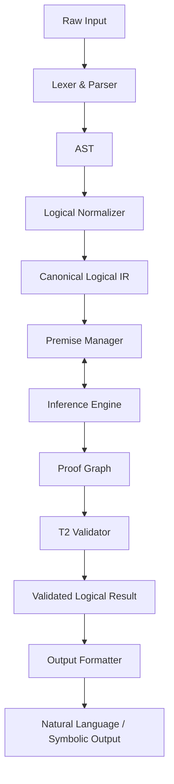
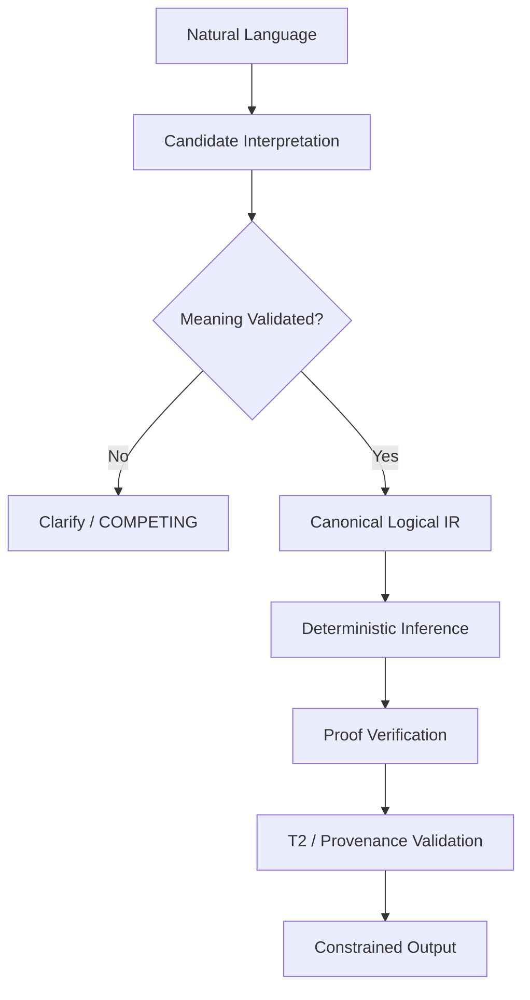
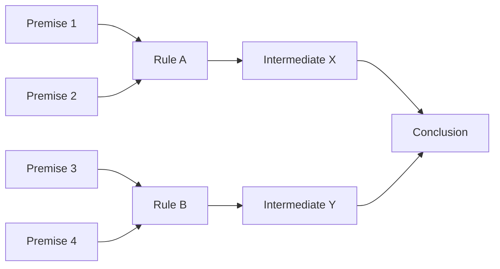
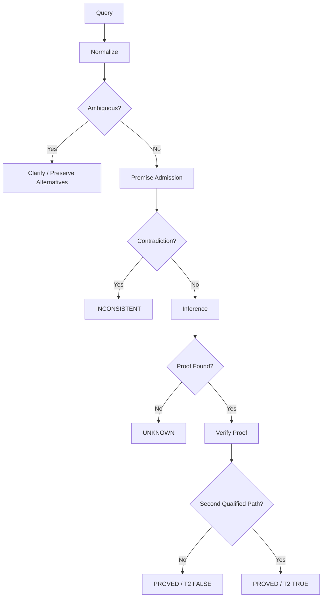
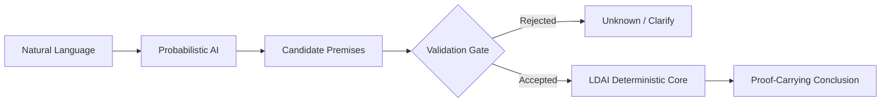

# TRANG LDAI — Logically Deterministic Artificial Intelligence

## Full English Canonical Expansion

> **Source classification:** `SOURCE_CLAIM`
> **Corpus:** `AMOS_corpus`
> **Scope:** `AMOS_knowledge`
> **Artifact type:** Framework/document
> **Origin:** Trang / Trang Method system, as stated by the source
> **Source basis:** the supplied `TRANG LDAI` artifact. 
>
> **Epistemic boundary:** This document specifies a proposed deterministic reasoning architecture. Its architecture, equations, examples, and stated guarantees are source-defined. The source does **not** by itself establish a deployed implementation, benchmark results, formal machine-checked proofs, universal hallucination elimination, or validated safety for medicine, law, aviation, or space systems.

---

# 1. Normalized Source Frontmatter

The following preserves the supplied metadata rather than silently extending it.

```yaml
---
title: TRANG LDAI LOGICALLY DETERMINISTIC ARTIFICIAL INT
tags:
  - trang
  - framework
  - reality
  - canon/knowledge
  - 00-home
  - knowledge-moc
  - system-scan-agent
  - automation-profiles
  - trang-moc
  - amos-simulation-kernel-v0-math-foundations
type: document
source: 11_KNOWLEDGE/trang
rscf:
  state: SOURCE_CLAIM
  claim_class: SOURCE_CLAIM
  provenance: AMOS_corpus
  scope: AMOS_knowledge
---
```

The body additionally declares:

```yaml
document_identity:
  title: "TRANG LDAI (LOGICALLY DETERMINISTIC ARTIFICIAL INTELLIGENCE)"
  vietnamese_title: "AI XÁC ĐỊNH LUẬN LÝ TRANG (TRANG LDAI)"
  author: "Trang (Vietnam) & Trang Method System"
  version: "1.0"
  document_type: "In-depth report"
  date: "2026"
  purpose:
    - formal definition
    - comparison with current AI
    - architectural proposal
    - argument for the necessity of LDAI
```

The second block comes from the document body and should not be mistaken for YAML frontmatter.

---

# 2. Canonical English Title

# **TRANG LDAI**

## **Logically Deterministic Artificial Intelligence**

### A theoretical framework for syntax-invariant deterministic logical reasoning, intended as a foundation for FRAI and ASEA within the Trang Method

---

# 3. Executive Definition

The central proposition of Trang LDAI is:

> Logically equivalent inputs should produce logically equivalent outputs regardless of language, wording, superficial syntax, or representational form.

The source expresses this conceptually as:

$$
\forall x_1,x_2:
LogicalEquiv(x_1,x_2)
\Rightarrow
Output(x_1)=Output(x_2)
$$

This is the foundational invariant of LDAI.

A more precise derived formulation is:

$$
L(x_1)=L(x_2)
\Rightarrow
I(L(x_1))=I(L(x_2))
$$

where \(L\) is the canonical logical normalization process and \(I\) is deterministic inference.

**Class:** `DERIVED from source architecture`.

---

# 4. The Fundamental Problem

The source identifies three problems with contemporary probabilistic AI:

1. sensitivity to syntax and phrasing;
2. nondeterministic generation;
3. hallucination.

Trang LDAI proposes to address these by separating:

$$
NaturalLanguage
$$

from:

$$
LogicalMeaning
$$

and making formal reasoning operate on the latter.

---

# 5. Core Architectural Shift

A conventional language-model pipeline can be abstracted as:

$$
Text
\rightarrow
Model
\rightarrow
GeneratedText
$$

Trang LDAI instead proposes:

$$
Text
\rightarrow
LogicalNormalization
\rightarrow
FormalInference
\rightarrow
ProofValidation
\rightarrow
OutputFormatting
$$

The central architectural transformation is therefore:

$$
\boxed{
ReasonOverText
\rightarrow
ReasonOverCanonicalLogicalRepresentation
}
$$

---

# 6. Syntax–Semantics Firewall

The source's most important separation can be represented as:

```text
SURFACE FORM
    │
    ▼
Parser
    │
    ▼
Logical Normalizer
    │
    ╞═══════════════════╗
    │ SEMANTIC FIREWALL ║
    ╘═══════════════════╝
    ▼
Canonical Logic
    │
    ▼
Deterministic Inference
```

After successful normalization, surface wording should cease to control inference.

---

# 7. Syntax Invariance

Suppose:

```text
Input A:
If it rains, the ground becomes wet.
It is raining.
Is the ground wet?
```

and:

```text
Input B:
Rain → Wet
Rain
∴ Wet?
```

and:

```text
Input C:
Trời mưa thì đất ướt.
Trời đang mưa.
Vậy đất có ướt không?
```

If all three normalize to:

$$
\{Rain\rightarrow Wet,\ Rain\}\vdash Wet
$$

then LDAI intends them to produce the same logical conclusion.

---

# 8. Important Qualification

The guarantee depends on normalization succeeding correctly.

Therefore the strongest safe law is not:

$$
LogicalEquiv(x,y)
\Rightarrow
Output(x)=Output(y)
$$

unconditionally.

It is:

$$
CorrectlyNormalizedEquivalent(x,y)
\Rightarrow
EquivalentInference(x,y)
$$

This distinction is load-bearing.

---

# 9. Why the Qualification Matters

LDAI cannot reason deterministically about a meaning it failed to extract correctly.

Therefore:

$$
DeterministicInference
\neq
GuaranteedSemanticParsing
$$

A deterministic theorem prover can still produce a perfectly deterministic answer to an incorrectly parsed premise set.

---

# 10. Determinism Has Multiple Layers

The artifact uses “deterministic” broadly.

For precision, distinguish:

### D1 — Logical determinism

Same formal premises + same formal rules → same logical result.

### D2 — Algorithmic determinism

Same machine state/input → same execution result.

### D3 — Parsing determinism

Same natural-language input → same logical representation.

### D4 — Semantic equivalence invariance

Different surface inputs with the same meaning → same canonical representation.

### D5 — Rendering determinism

Same conclusion → exactly identical output string.

The source's strongest architecture directly supports D1 as a design objective.

D2–D5 require additional implementation specifications.

---

# 11. LDAI Six-Tuple

The source formally defines:

$$
\boxed{
LDAI=\langle L,P,R,I,T2,O\rangle
}
$$

where:

| Symbol | Component              | Function                                              |
| ------ | ---------------------- | ----------------------------------------------------- |
| \(L\)  | Logical Normalizer     | transforms input into canonical logical form          |
| \(P\)  | Premise Set / Manager  | stores propositions accepted as premises              |
| \(R\)  | Rule Set               | defines permissible logical transformations           |
| \(I\)  | Inference Engine       | derives conclusions from \(P\) using \(R\)            |
| \(T2\) | Cross-validation layer | seeks at least two independent proof paths            |
| \(O\)  | Output Formatter       | renders conclusions into natural language or notation |

This six-component architecture is explicitly source-defined.

---

# 12. Functional Decomposition

The system can be understood as:

$$
LDAI
=
MeaningExtraction
+
PremiseGovernance
+
FormalRules
+
DeterministicProof
+
ProofRedundancy
+
Communication
$$

This is a `DERIVED` functional decomposition.

---

# 13. Input Domain

The source intends LDAI to accept:

* Vietnamese natural language,
* English natural language,
* symbolic logic,
* imperfect Vietnamese without diacritics.

Therefore the input space is heterogeneous.

Conceptually:

$$
X=
X_{VI}
\cup
X_{EN}
\cup
X_{Symbolic}
\cup
X_{NoisyText}
$$

---

# 14. Canonical Intermediate Representation

The architectural objective is to map equivalent inputs into one representation.

Define:

$$
C=L(x)
$$

where \(C\) is the canonical intermediate logical representation.

Then:

$$
x_1\sim_Lx_2
\Rightarrow
L(x_1)=L(x_2)
$$

is the intended normalization invariant.

---

# 15. Equivalence Classes

This means LDAI effectively attempts to construct equivalence classes of surface expressions.

For a logical meaning \(m\):

$$
[x]_m=
\{x_i\mid Meaning(x_i)=m\}
$$

and seeks:

$$
\forall x_i\in[x]_m:
L(x_i)=C_m
$$

This is a useful derived formalization.

---

# 16. The Real Difficulty

Once two inputs have genuinely become the same formal representation, deterministic reasoning is comparatively straightforward.

The difficult problem is:

$$
\boxed{
NaturalLanguage
\rightarrow
CorrectCanonicalMeaning
}
$$

Thus the Logical Normalizer is arguably the highest-risk component in the architecture.

---

# 17. Component L — Logical Normalizer

The source defines:

$$
L(Input)
=
CanonicalForm(LogicalStructure(Input))
$$

and gives four steps:

1. syntax parsing;
2. logical-structure extraction;
3. normalization;
4. intermediate representation generation.

---

# 18. Step L1 — Parsing

Input:

```text
If it rains, the road is slippery.
It is raining.
Is the road slippery?
```

Possible structural parse:

```text
Conditional:
    antecedent = Rain
    consequent = Slippery

Assertion:
    Rain

Query:
    Slippery
```

---

# 19. Step L2 — Logical Extraction

Convert linguistic structure into logical objects:

$$
Rain\rightarrow Slippery
$$

$$
Rain
$$

Query:

$$
Slippery?
$$

---

# 20. Step L3 — Normalization

The implication may be normalized as:

$$
P\rightarrow Q
\equiv
\neg P\lor Q
$$

giving:

$$
\neg Rain\lor Slippery
$$

---

# 21. Step L4 — Intermediate Representation

The system can then represent the task as:

$$
\{Rain\rightarrow Slippery,\ Rain\}\vdash Slippery
$$

This is independent of whether the original sentence was English, Vietnamese, or symbolic.

---

# 22. Source CNF Transformations

The artifact supplies these transformations:

$$
P\land Q
$$

remains:

$$
P\land Q
$$

---

$$
P\lor Q
$$

remains:

$$
P\lor Q
$$

---

$$
P\rightarrow Q
$$

becomes:

$$
\neg P\lor Q
$$

---

$$
P\leftrightarrow Q
$$

becomes:

$$
(\neg P\lor Q)\land(\neg Q\lor P)
$$

---

$$
\neg(P\land Q)
$$

becomes:

$$
\neg P\lor\neg Q
$$

---

$$
\neg(P\lor Q)
$$

becomes:

$$
\neg P\land\neg Q
$$

These are standard propositional equivalences and are correctly represented at this abstraction level.

---

# 23. CNF Is Not Automatically a Unique Canonical Form

This is an important technical qualification.

Two equivalent formulas can have different CNF representations unless the normalization procedure defines a stronger canonicalization algorithm.

Therefore:

$$
CNF(x)=CNF(y)
$$

is not automatically guaranteed merely because:

$$
x\equiv y
$$

The source's goal of a **unique intermediate representation** requires additional canonicalization rules.

**Class:** `DECISION-RELEVANT GAP`.

---

# 24. Canonicalization Requirements

A complete \(L\) would need deterministic policies for at least:

* variable naming,
* proposition ordering,
* clause ordering,
* literal ordering,
* associativity,
* commutativity,
* duplicate removal,
* quantifier renaming,
* scope,
* synonym resolution,
* entity resolution,
* temporal interpretation.

These are not fully specified.

---

# 25. Alpha-Equivalence

For first-order logic:

$$
\forall x\,P(x)
$$

and:

$$
\forall y\,P(y)
$$

are equivalent under bound-variable renaming.

A canonicalizer must recognize this.

No exact alpha-normalization algorithm is supplied.

---

# 26. Commutativity

Likewise:

$$
P\land Q
$$

and:

$$
Q\land P
$$

must canonicalize identically if syntax invariance is to hold.

That requires deterministic operand ordering.

---

# 27. Associativity

Similarly:

$$
(P\land Q)\land R
$$

and:

$$
P\land(Q\land R)
$$

should collapse to one structure.

A normalized n-ary representation is one possible solution.

Not source-specified.

---

# 28. Duplicate Elimination

The source explicitly includes duplicate removal.

Thus:

$$
P\land P
$$

should reduce structurally to:

$$
P
$$

where appropriate.

---

# 29. Lexical Equivalence

The much harder problem is:

```text
car
automobile
vehicle
```

These are not necessarily logically identical.

A deterministic system needs ontology and context.

Therefore:

$$
LexicalSimilarity
\neq
LogicalIdentity
$$

---

# 30. Translation Equivalence

Likewise:

```text
rain
mưa
```

can often map to one concept.

But multilingual equivalence is not universally one-to-one.

Therefore:

$$
Translation
\neq
GuaranteedSemanticEquivalence
$$

---

# 31. Ambiguity Firewall

If a sentence has multiple plausible parses:

$$
Parse(x)=\{p_1,p_2,\ldots,p_n\}
$$

a high-integrity LDAI should not arbitrarily choose one without sufficient evidence.

Instead:

$$
Ambiguity
\Rightarrow
Clarify
\lor
PreserveAlternatives
$$

This follows from the source's own limitation section.

---

# 32. COMPETING Semantic Interpretations

A stronger AMOS-compatible state is:

$$
COMPETING(p_1,p_2)
$$

until discriminating evidence exists.

This is preferable to silently collapsing ambiguity.

---

# 33. Premise Manager \(P\)

The source gives operations:

* add;
* remove;
* modify;
* query;
* export.

Conceptually:

$$
P_t=\{p_1,p_2,\ldots,p_n\}
$$

---

# 34. Add Premise

$$
P_{t+1}=P_t\cup\{p\}
$$

subject to source-defined contradiction checking.

---

# 35. Remove Premise

$$
P_{t+1}=P_t\setminus\{p\}
$$

---

# 36. Modify Premise

The source models modification as:

$$
Remove(p_{old})
\rightarrow
Add(p_{new})
$$

---

# 37. Premise Membership

$$
Contains(P,p)\in\{TRUE,FALSE\}
$$

---

# 38. Premise Export

The Premise Manager can expose the active premise set.

This contributes to explainability and auditability.

---

# 39. Premise Truth vs Premise Acceptance

A crucial distinction:

$$
p\in P
\not\Rightarrow
p\text{ is empirically true}
$$

It means only that \(p\) is admitted as a premise in the current reasoning context.

---

# 40. Sound Inference Cannot Repair False Premises

If:

$$
P\models c
$$

but \(P\) contains false empirical assumptions, \(c\) may still fail in reality.

Thus:

$$
LogicalValidity
\neq
EmpiricalTruth
$$

---

# 41. Garbage-In Boundary

A deterministic proof system can guarantee:

> conclusion follows from premises.

It cannot automatically guarantee:

> premises correctly describe reality.

Therefore:

$$
\boxed{
SoundReasoning
+
FalsePremises
\not\Rightarrow
TrueWorldConclusion
}
$$

---

# 42. Premise Provenance

A hardened extension should type premises.

For example:

```yaml
premise:
  proposition: "Rain"
  class: OBSERVATION
  source: sensor_A
  scope: location_X
  time: t
  confidence: ...
```

This is `PROPOSED`, not present in the source.

---

# 43. Premise Classes

AMOS-style premise typing could distinguish:

* `SOURCE_CLAIM`
* `OBSERVATION`
* `DERIVED`
* `MODEL`
* `DECISION`
* `UNKNOWN`

This would prevent logical validity from being mistaken for evidential validity.

---

# 44. Rule Set \(R\)

The source supplies a minimum rule set of ten propositional rules plus first-order extensions.

Conceptually:

$$
R=\{r_1,\ldots,r_n\}
$$

---

# 45. Rule 1 — Modus Ponens

$$
P\rightarrow Q,\ P
\vdash
Q
$$

---

# 46. Rule 2 — Modus Tollens

$$
P\rightarrow Q,\ \neg Q
\vdash
\neg P
$$

---

# 47. Rule 3 — Hypothetical Syllogism

$$
P\rightarrow Q,\ Q\rightarrow R
\vdash
P\rightarrow R
$$

---

# 48. Rule 4 — Conjunction Introduction

$$
P,\ Q
\vdash
P\land Q
$$

---

# 49. Rule 5 — Conjunction Elimination

$$
P\land Q
\vdash
P
$$

and:

$$
P\land Q
\vdash
Q
$$

---

# 50. Rule 6 — Disjunction Introduction

$$
P
\vdash
P\lor Q
$$

---

# 51. Rule 7 — Disjunction Elimination

The source gives:

$$
P\lor Q,\ P\rightarrow R,\ Q\rightarrow R
\vdash
R
$$

---

# 52. Rule 8 — Double Negation

$$
\neg\neg P
\vdash
P
$$

---

# 53. Rule 9 — Excluded Middle

The source table represents:

$$
\vdash P\lor\neg P
$$

This commits the minimum rule set to a classical-logic style assumption.

---

# 54. Rule 10 — Contradiction

$$
P,\neg P
\vdash
False
$$

The source then treats contradiction as a reason to report an inconsistent premise system.

---

# 55. Logic Regime Matters

Excluded middle and double-negation elimination are not universal across all logical systems.

Therefore:

$$
RuleValidity
=
RuleValidity(Regime)
$$

A complete LDAI must declare its logic regime.

At minimum, the supplied propositional core appears **classical**.

---

# 56. Classical Logic Classification

**Derived conclusion:**

$$
R_{source}
\approx
ClassicalPropositionalLogic
+
PartialFirstOrderExtensions
$$

This is stronger than calling it simply “logic.”

---

# 57. Contradiction Explosion Problem

In classical logic:

$$
P,\neg P
$$

can support explosion under standard consequence systems:

$$
P,\neg P\vdash Q
$$

for arbitrary \(Q\).

The source avoids this operationally by stopping and reporting inconsistency.

This is an important fail-closed behavior.

---

# 58. Contradiction Firewall

The intended architecture is therefore closer to:

$$
DetectContradiction(P)
\Rightarrow
BlockTrustedInference
$$

rather than:

$$
Contradiction
\Rightarrow
DeriveEverything
$$

---

# 59. Paraconsistency Is Not Established

This should **not** be called a paraconsistent logic system from the source alone.

It appears instead to be:

> classical reasoning with inconsistency detection and fail-closed handling.

**Class:** `DERIVED`.

---

# 60. First-Order Logic Extension

The source adds quantified reasoning.

It includes a rule described as:

$$
\forall x\,P(x)
\vdash
P(c)
$$

This is usually called **universal instantiation**, although the Vietnamese source labels it differently.

---

# 61. Existential Rule

The source gives:

$$
\exists x\,P(x)
\vdash
P(c)
$$

where \(c\) is a new constant.

The freshness requirement is essential.

---

# 62. Universal Generalization

The source gives conceptually:

$$
P(c)
\vdash
\forall xP(x)
$$

when \(c\) is arbitrary.

The “arbitrary” condition is load-bearing.

Without it, the inference is unsound.

---

# 63. Quantifier Side Conditions

A production formal system must precisely define:

* free variables,
* bound variables,
* substitution,
* freshness,
* arbitrary constants,
* capture avoidance.

The source does not supply these formal details.

---

# 64. Inference Engine \(I\)

The source defines:

$$
I(P,R)
=
\{c\mid P\vdash_Rc\}
$$

This is the set of conclusions derivable from premises \(P\) under rules \(R\).

---

# 65. Deterministic Inference Property

The source asserts:

$$
L(Input_1)=L(Input_2)
$$

implies:

$$
I(P\cup\{L(Input_1)\},R)
=
I(P\cup\{L(Input_2)\},R)
$$

This is valid as an architectural requirement if:

* \(P\) is identical;
* \(R\) is identical;
* inference strategy does not introduce semantic differences;
* termination/resource policies are controlled.

---

# 66. Set of Conclusions vs Search Procedure

There is a subtle distinction:

$$
LogicalClosure(P,R)
$$

may be mathematically unique while:

$$
Algorithm(P,R,Budget)
$$

may not enumerate the entire closure under finite resource limits.

Therefore deterministic logical consequence does not automatically guarantee practical exhaustive derivation.

---

# 67. Resource Bounds

A real implementation must specify:

* search strategy,
* proof depth,
* timeout,
* memory bound,
* termination policy.

These are absent.

---

# 68. Termination

For unrestricted first-order logic, complete proof search can encounter undecidable/non-terminating cases.

Therefore the source's general determinism claim must not be interpreted as:

> every arbitrary first-order query will always terminate with a yes/no answer.

That is not established.

---

# 69. Three-Valued Operational Outcome

A hardened implementation needs at least:

$$
Outcome\in
\{
PROVED,
DISPROVED,
UNKNOWN
\}
$$

and possibly:

$$
INCONSISTENT
$$

and:

$$
AMBIGUOUS
$$

---

# 70. Suggested Result Lattice

**PROPOSED:**

```text
PROVED
DISPROVED
UNKNOWN
AMBIGUOUS
INCONSISTENT
RESOURCE_LIMIT
INVALID_INPUT
```

This is safer than forcing binary answers.

---

# 71. T2 — “Tát 2”

The source defines T2 as cross-validation through at least two independent inference paths.

Formally:

$$
T2(c)=TRUE
$$

iff there exist:

$$
Path_1\neq Path_2
$$

such that:

$$
P\vdash_{Path_1}c
$$

and:

$$
P\vdash_{Path_2}c
$$

with the paths considered independent.

---

# 72. T2 Is Not Necessary for Formal Validity

The source itself correctly notes:

> one valid proof path is enough for logical validity.

Therefore:

$$
ValidProof(c)
\not\Rightarrow
T2(c)
$$

and:

$$
T2(c)=FALSE
\not\Rightarrow
c\text{ is invalid}
$$

---

# 73. T2 Is a Redundancy Layer

The strongest interpretation is:

$$
T2
=
ProofRedundancyCheck
$$

rather than:

$$
T2
=
TruthDefinition
$$

---

# 74. Independence Is the Hard Part

The source's basic algorithm defines independence approximately as:

> two paths do not share intermediate propositions.

This is not sufficient to establish genuine epistemic independence.

---

# 75. Structural Independence

Two proofs may use different intermediate propositions.

Call this:

$$
Independent_{structural}
$$

---

# 76. Rule Independence

Two proofs may use different inference rules.

Call this:

$$
Independent_{rule}
$$

---

# 77. Premise Independence

Two proofs may rely on different premise subsets.

Call this:

$$
Independent_{premise}
$$

---

# 78. Provenance Independence

The underlying premises may come from independent evidence sources.

Call this:

$$
Independent_{provenance}
$$

---

# 79. Epistemic Independence

For high-stakes confidence, the most important property may be:

$$
Independent_{epistemic}
$$

not merely graph-path difference.

---

# 80. Example of False Independence

Suppose:

$$
p_1
$$

and:

$$
p_2
$$

both originate from one erroneous source \(S\).

Then:

$$
Path_1:p_1\rightarrow c
$$

and:

$$
Path_2:p_2\rightarrow c
$$

may look structurally different.

But:

$$
Ancestor(p_1)=Ancestor(p_2)=S
$$

Therefore:

$$
TwoPaths
\neq
TwoIndependentEvidenceRoots
$$

---

# 81. T2 Sybil Problem

This is the proof analogue of a Sybil attack.

One source can generate many descendants that appear independent.

Thus:

$$
PathCount
\neq
IndependentSupportCount
$$

---

# 82. Hardened T2

A stronger derived formulation would be:

$$
T2^*(c)=TRUE
$$

only if two proof paths satisfy:

1. logical validity;
2. materially distinct proof structure;
3. compatible scopes/regimes;
4. sufficient provenance independence;
5. no hidden shared load-bearing ancestor.

This is `PROPOSED v4.4-style hardening`, not source canon.

---

# 83. T2 Confidence

The source labels:

* T2 true → high confidence;
* T2 false → medium confidence.

This is a source-defined qualitative scale.

It is not empirically calibrated.

---

# 84. Two Proofs Do Not Automatically Increase Truth

If both proofs depend on the same false premise:

$$
FalsePremise
\rightarrow
Proof_1(c)
$$

and:

$$
FalsePremise
\rightarrow
Proof_2(c)
$$

then T2 may add no real-world reliability.

Therefore:

$$
ProofRedundancy
\neq
EvidenceRedundancy
$$

---

# 85. High-Stakes T2 Claim

The source proposes that medicine, law, and aviation should only output conclusions when T2 is true.

This is a **SOURCE_CLAIM / design proposal**.

It is not sufficient as a validated safety standard.

---

# 86. High-Stakes Safety Requires More

For such domains, one would additionally need:

* validated premises;
* domain-specific rules;
* current evidence;
* scope checks;
* uncertainty;
* regulatory compliance;
* human oversight where appropriate;
* implementation verification.

Therefore:

$$
T2
\not\Rightarrow
HighStakesSafety
$$

---

# 87. Output Formatter \(O\)

The output layer converts logical conclusions back to language.

Conceptually:

$$
O(c,\ell)
\rightarrow
Text_\ell
$$

where \(\ell\) is output language.

---

# 88. Logical Output vs Surface Output

The source says logically equivalent inputs should receive the same answer, but also allows different output languages.

Therefore exact string identity cannot be the deepest invariant.

A better interpretation is:

$$
LogicalContent(O_1)
=
LogicalContent(O_2)
$$

rather than necessarily:

$$
String(O_1)=String(O_2)
$$

---

# 89. Output Equivalence

Thus:

$$
Output_1\equiv_L Output_2
$$

is more appropriate than literal byte equality when output language differs.

This is a `DERIVED correction/clarification`.

---

# 90. Output Formatter Must Not Add Facts

The formatter should ideally satisfy:

$$
Facts(O(c))
\subseteq
Facts(c)
$$

unless explicitly adding metadata such as proof status or warnings.

Otherwise hallucination could re-enter at the final rendering layer.

---

# 91. Generative Formatter Risk

If \(O\) is itself a probabilistic LLM:

$$
FormalProof
\rightarrow
LLMFormatter
$$

the formatter could introduce unsupported claims.

Therefore deterministic reasoning alone does not eliminate end-to-end hallucination unless the output boundary is constrained.

---

# 92. Semantic Conservation Law

A hardened output invariant would be:

$$
Meaning(O(c))=Meaning(c)
$$

plus explicitly typed metadata.

This is `PROPOSED`.

---

# 93. Full Source Pipeline

The source gives:

```text
Input
  ↓
Lexer & Parser
  ↓
AST
  ↓
Logical Normalizer
  ↓
Canonical Intermediate Representation
  ↓
Premise Manager ↔ Inference Engine
  ↓
Conclusions + Proofs
  ↓
T2 Validator
  ↓
Validated Conclusion
  ↓
Output Formatter
  ↓
Output
```

---

# 94. Functional Equation

A compact derived model is:

$$
Y=O(T2(I(P,L(X),R)))
$$

This is conceptual; T2 is not literally a simple unary transformation in the source.

---

# 95. Better Typed Pipeline

A more precise representation:

$$
X
\xrightarrow{Parse}
AST
\xrightarrow{L}
IR
\xrightarrow{Admit}
P'
\xrightarrow{I_R}
(C,\Pi)
\xrightarrow{T2}
(C,\Pi,V)
\xrightarrow{O}
Y
$$

where:

* \(C\) = conclusion;
* \(\Pi\) = proof set;
* \(V\) = validation metadata.

---

# 96. Proof-Carrying Conclusion

The architecture implies that conclusions can carry proofs.

Thus:

$$
Conclusion
=
\langle
Claim,
Proof
\rangle
$$

or with T2:

$$
Conclusion
=
\langle
Claim,
Proofs,
T2Status
\rangle
$$

---

# 97. AMOS-Compatible Proof Capsule

A hardened representation could be:

```yaml
claim:
  proposition: Wet
  class: DERIVED

premises:
  - Rain
  - Rain -> Wet

proof:
  rule: MODUS_PONENS

t2:
  status: false

scope:
  logic_regime: classical_propositional

invalidation:
  - premise_removed
  - premise_invalidated
  - rule_set_changed
```

**PROPOSED.**

---

# 98. Example 1 — Transitivity

Source input:

> A is greater than B. B is greater than C. Is A greater than C?

Canonical form:

$$
\{A>B,\ B>C\}\vdash A>C
$$

If `>` is defined as a transitive relation:

$$
A>B\land B>C
\Rightarrow
A>C
$$

then the conclusion follows.

---

# 99. Hidden Premise in Example 1

The example implicitly assumes:

$$
Transitive(>)
$$

This matters.

Not every binary relation is transitive.

Therefore the rule is valid because of the semantics of the relation, not merely because two propositions share variables.

---

# 100. Relation-Typed Inference

A robust system must know whether a relation is:

* transitive;
* symmetric;
* antisymmetric;
* reflexive;
* functional.

Thus:

$$
RelationType
$$

is part of the knowledge required for valid domain reasoning.

---

# 101. Example 1 T2

The source finds only one proof path.

Therefore:

$$
T2(A>C)=FALSE
$$

but:

$$
Valid(A>C)=TRUE
$$

under the transitivity assumption.

---

# 102. Example 2 — Multilingual Equivalence

The source gives four forms:

* Vietnamese;
* English;
* symbolic;
* Vietnamese without diacritics.

All are intended to normalize to:

$$
\{Rain\rightarrow Slippery,\ Rain\}\vdash Slippery
$$

---

# 103. Example 2 Is a Requirement, Not a Demonstration

The artifact shows the desired result.

It does not supply:

* parser code;
* multilingual benchmark;
* test corpus;
* measured normalization accuracy.

Therefore:

$$
ExampleSpecification
\neq
EmpiricalValidation
$$

---

# 104. Example 3 — Contradiction

Premises:

$$
P\rightarrow Q
$$

$$
R\rightarrow Q
$$

$$
P\lor R
$$

$$
\neg Q
$$

From:

$$
P\lor R,\ P\rightarrow Q,\ R\rightarrow Q
$$

derive:

$$
Q
$$

while:

$$
\neg Q
$$

is already present.

Thus:

$$
Q\land\neg Q
$$

and the premise system is inconsistent.

---

# 105. Correct Fail-Closed Interpretation

The source says:

> The premise system is inconsistent — reliable inference cannot continue.

This is safer than attempting to reconcile contradiction fluently.

---

# 106. Contradiction Does Not Tell Us Which Premise Is Wrong

From:

$$
Q\land\neg Q
$$

we know the active system is inconsistent.

We do **not** know whether:

* \(Q\) is wrong;
* \(\neg Q\) is wrong;
* an implication is wrong;
* the disjunction is wrong;
* a parsing error occurred.

Therefore:

$$
DetectContradiction
\neq
DiagnoseCause
$$

---

# 107. Contradiction Diagnosis

A hardened system should identify a minimal inconsistent subset.

Conceptually:

$$
MIS(P)
$$

where `MIS` is a minimal inconsistent subset.

This is not source-specified.

---

# 108. Local Invalidation

Once an invalid premise is identified, only dependent conclusions should be invalidated.

$$
Invalidate(p)
\Rightarrow
Invalidate(Descendants(p))
$$

not unrelated conclusions.

This is a derived AMOS governance extension.

---

# 109. Claimed Guarantee 1 — Determinism

The source's theorem states:

> with the same intermediate representation, inference produces the same conclusion set.

At the mathematical architecture level, this follows if \(I\) is defined as a deterministic function over fixed \(P,R\).

**Class:** `DERIVED / definition-level`.

---

# 110. But Runtime Determinism Is Separate

A deployed system could still vary due to:

* nondeterministic parser;
* concurrency;
* floating-point operations;
* nondeterministic search;
* probabilistic preprocessing;
* resource limits.

Therefore:

$$
FormalDeterminism
\neq
VerifiedRuntimeDeterminism
$$

---

# 111. Claimed Guarantee 2 — “No Hallucination”

The source states:

> LDAI has no hallucination because it only derives conclusions from normalized premises.

This requires refinement.

---

# 112. Proof-Bounded Generation

The architecture can strongly constrain one form of hallucination:

$$
OutputClaim(c)
\Rightarrow
ExistsProof(P,R,c)
$$

If enforced end-to-end, the system cannot freely invent unsupported logical conclusions.

This is a valuable architectural property.

---

# 113. But “No Hallucination” Is Too Broad as an Empirical Guarantee

Hallucination-like failure can still occur if:

* parser misreads text;
* premise extractor invents a premise;
* knowledge base contains false information;
* rule implementation has a bug;
* output formatter adds unsupported content;
* source citation mapping is wrong.

Therefore:

$$
ProofBoundedInference
\neq
UniversalZeroHallucination
$$

---

# 114. Stronger Safe Claim

The strongest source-compatible technical claim is:

$$
\boxed{
LDAI is designed so accepted logical conclusions must be derivable from admitted premises through explicit rules.
}
$$

That is much more defensible than:

> LDAI cannot hallucinate under all circumstances.

---

# 115. Claimed Guarantee 3 — Contradiction Detection

This can be guaranteed relative to:

* representation;
* inference completeness;
* contradiction definition;
* resource limits.

If the system does not derive both sides due to incomplete search, some contradictions could remain undiscovered.

Therefore:

$$
ContradictionDetection
$$

also depends on proof-search completeness.

---

# 116. Claimed Guarantee 4 — Explainability

Because conclusions carry derivations, LDAI can provide explicit formal proof traces.

This is a genuine architectural advantage.

But:

$$
ProofTrace
\neq
ExplanationOfWhyPremisesAreTrue
$$

The proof explains derivation, not necessarily empirical justification.

---

# 117. Two Layers of Explanation

### Logical explanation

> How does conclusion \(c\) follow?

### Epistemic explanation

> Why should we accept premises \(P\)?

LDAI directly addresses the first.

The second requires provenance/evidence governance.

---

# 118. Three Layers of Truth

A useful distinction:

$$
Truth_{syntax}
$$

Was the input parsed correctly?

$$
Truth_{logic}
$$

Does the conclusion follow?

$$
Truth_{world}
$$

Do the premises and conclusion correspond to reality?

These cannot be collapsed.

---

# 119. The Core Epistemic Firewall

$$
\boxed{
Derivable
\neq
EmpiricallyTrue
}
$$

This is perhaps the most important qualification for any real deployment of LDAI.

---

# 120. Comparison with Current AI

The source compares LDAI against GPT, Gemini, Claude, and LLaMA.

These comparison statements are largely generalized source claims.

They are not accompanied by benchmark evidence.

---

# 121. Syntax Sensitivity Comparison

The source claims current AI may answer paraphrases differently.

This is plausible as a general phenomenon, but no test set is supplied.

Classification:

`SOURCE_CLAIM`.

---

# 122. Nondeterminism Comparison

The source says repeated queries can produce different answers.

That can occur in probabilistic generative systems depending on configuration.

But deterministic decoding/configuration can reduce or eliminate sampling variation.

Therefore the blanket comparison should be qualified.

---

# 123. LLM ≠ Necessarily Random Output

A probabilistic model can be executed with deterministic decoding under some conditions.

Therefore:

$$
ProbabilisticModel
\not\Rightarrow
RandomObservedOutputEveryRun
$$

---

# 124. Deterministic Output ≠ Correct Output

Likewise:

$$
SameWrongAnswerEveryTime
$$

is deterministic.

Therefore:

$$
Determinism
\neq
Correctness
$$

---

# 125. Formal Logic ≠ Complete Intelligence

The source itself recognizes this.

LDAI does not target:

* subjective feeling;
* all ambiguous language;
* arbitrary non-logical tasks.

Thus:

$$
LDAI
\neq
CompleteGeneralAI
$$

---

# 126. Hybrid Architecture

The source proposes:

$$
ProbabilisticAI
\rightarrow
PremiseExtraction
\rightarrow
LDAI
\rightarrow
DeterministicReasoning
$$

This is a hybrid neuro-symbolic-like architecture at a broad conceptual level.

---

# 127. Hybrid Boundary Risk

If GPT extracts premises incorrectly:

$$
WrongExtraction
\rightarrow
CorrectFormalReasoning
\rightarrow
WrongWorldConclusion
$$

Therefore the probabilistic/formal boundary becomes a critical validation point.

---

# 128. Semantic Admission Gate

A hardened architecture should place a gate between extraction and premise admission.

```text
LLM / Parser
    ↓
Candidate Premises
    ↓
VALIDATE
    ↓
Admitted Premises
    ↓
LDAI
```

This is `PROPOSED`.

---

# 129. Candidate ≠ Premise

The system should distinguish:

$$
CandidatePremise
$$

from:

$$
AdmittedPremise
$$

This prevents an uncertain language-model extraction from silently becoming logical truth.

---

# 130. Knowledge Base Integration

The source proposes using a knowledge base when premises are missing.

This introduces additional governance requirements.

A knowledge-base statement must have:

* provenance;
* scope;
* freshness;
* validity.

Otherwise formal inference can amplify stale information.

---

# 131. Freshness

Suppose:

$$
p(t_0)
$$

was true at \(t_0\).

It may not remain true at \(t_1\).

Therefore:

$$
PremiseValidity
=
f(Time,Regime,Scope)
$$

for time-sensitive claims.

---

# 132. Scope

A premise valid in one jurisdiction, population, system, or environment cannot automatically transfer elsewhere.

Thus:

$$
Valid(p,S_1)
\not\Rightarrow
Valid(p,S_2)
$$

---

# 133. Regime

A rule can also depend on regime.

For example:

$$
R_{classical}
\neq
R_{intuitionistic}
$$

and domain rules can change when operating conditions change.

---

# 134. Rule Provenance

A hardened rule should conceptually carry:

```yaml
rule:
  id:
  logic_regime:
  premises:
  conclusion:
  scope:
  validity:
  source:
  version:
```

This is proposed.

---

# 135. Proof Provenance

Likewise a proof should record:

* rule IDs;
* premise IDs;
* rule versions;
* normalization version;
* inference-engine version.

Without this, reproducibility is weaker.

---

# 136. Deterministic Replay

A mature LDAI implementation should aim for:

$$
Replay(P,R,V)
=
SameProofResult
$$

where \(V\) captures relevant version/state information.

This is not explicitly supplied but follows naturally from the determinism objective.

---

# 137. Versioning Is Load-Bearing

If \(R\) changes:

$$
I(P,R_1)
$$

may differ from:

$$
I(P,R_2)
$$

Therefore:

$$
SamePremises
$$

does not guarantee same conclusions across rule versions.

---

# 138. Canonical Determinism Law

A more complete formulation is:

$$
\boxed{
SameCanonicalInput
+
SamePremises
+
SameRules
+
SameRegime
+
SameVersion
+
SameResourcePolicy
\Rightarrow
SameLogicalResult
}
$$

**Class:** `DERIVED`.

---

# 139. State Determinism

If the premise set is mutable:

$$
P_t\neq P_{t+1}
$$

then identical queries at different times may legitimately yield different answers.

Therefore:

$$
SameQuestion
\not\Rightarrow
SameAnswer
$$

unless reasoning state is also identical.

---

# 140. This Refines the Source Slogan

The source slogan:

> same logical meaning → same answer

should technically become:

> same logical meaning under the same admitted premises, rule regime, scope, and reasoning state → same logical conclusion.

This preserves the idea while closing an important ambiguity.

---

# 141. FRAI Binding

The source states LDAI is intended as a foundation for FRAI and ASEA.

It later says LDAI supports:

* `[L-M-H]` decomposition;
* self-correction mechanisms.

No detailed binding specification is supplied.

Therefore:

$$
LDAI\rightarrow FRAI
$$

and:

$$
LDAI\rightarrow ASEA
$$

are source-defined intended integrations, but exact interfaces are `UNKNOWN/GAP`.

---

# 142. L-M-H

The source uses:

$$
[L-M-H]
$$

but does not formally define the semantics of those three levels inside this artifact.

Do not invent them from external AMOS artifacts without an explicit binding.

---

# 143. FRAI

The acronym `FRAI` is referenced but not expanded in the supplied artifact.

Therefore its exact canonical expansion here is:

`UNKNOWN/GAP`.

---

# 144. ASEA

Likewise, `ASEA` is referenced but not expanded.

Exact meaning:

`UNKNOWN/GAP`.

---

# 145. Trang ∅ Framework

The conclusion places LDAI inside the:

$$
Trang\ \emptyset\ Framework
$$

This establishes a source-defined conceptual relationship.

It does not supply an exact module path or executable binding.

---

# 146. Architecture Layers

A useful derived decomposition is:

```text
H — INTENT
    Deterministic, syntax-invariant logical reasoning

M — MECHANISM
    Parsing
    Normalization
    Premise governance
    Rule application
    Proof generation
    T2 validation

L — RECEIPT
    Conclusion
    Proof
    T2 status
    warnings / unknown state
```

This is an AMOS-compatible representation, not source text.

---

# 147. RSCF H — Intent

```yaml
H:
  intent: >
    Ensure that logically equivalent inputs are mapped into a common
    logical representation and processed through deterministic,
    explicit inference rules so that conclusions are reproducible
    and proof-traceable.
```

**Class:** `DERIVED`.

---

# 148. RSCF M — Mechanism

```yaml
M:
  components:
    - lexer_parser
    - logical_normalizer
    - premise_manager
    - inference_engine
    - t2_validator
    - output_formatter

  formal_core:
    LDAI: "<L, P, R, I, T2, O>"

  governing_constraint:
    - equivalent_normalized_input_should_produce_equivalent_logical_output
```

---

# 149. RSCF L — Receipt

```yaml
L:
  output:
    claim:
    proof_paths:
    t2_status:
    premise_set:
    rule_set:
    warnings:
```

The expanded receipt schema is proposed.

---

# 150. Proof Capsule — Determinism

**Claim**

Fixed normalized representation, fixed premises, and fixed deterministic rule system produce the same logical result.

**Class**

`DERIVED / FORMAL-MODEL`.

**Load-bearing premises**

* \(L(x)\) fixed;
* \(P\) fixed;
* \(R\) fixed;
* deterministic inference implementation;
* equivalent resource policy.

**Falsifiers**

* nondeterministic inference;
* hidden state;
* changing rules;
* changing premise set.

---

# 151. Proof Capsule — Syntax Invariance

**Claim**

Different syntactic forms can yield the same logical conclusion.

**Class**

`CONDITIONAL`.

**Condition**

They must normalize correctly to the same logical representation.

**Confidence ceiling**

Cannot exceed confidence in semantic normalization.

---

# 152. Proof Capsule — Zero Hallucination

**Claim**

LDAI universally eliminates hallucination.

**Class**

$$
\boxed{UNKNOWN/GAP}
$$

The source asserts it, but architecture alone does not establish universal end-to-end zero hallucination.

---

# 153. Narrower Hallucination Claim

**Claim**

The inference core can be designed to emit only conclusions supported by explicit proof from admitted premises.

**Class**

`MODEL / DERIVED`.

This is substantially stronger.

---

# 154. Proof Capsule — T2

**Claim**

Two genuinely independent proof paths can provide additional redundancy.

**Class**

`MODEL / CONDITIONAL`.

**Critical condition**

Independence must be defined appropriately.

---

# 155. Proof Capsule — High-Stakes Reliability

**Claim**

T2 alone makes LDAI sufficiently reliable for medicine, law, aviation, or space.

**Class**

$$
UNKNOWN/GAP
$$

No domain validation is supplied.

---

# 156. Proof Capsule — Contradiction Detection

**Claim**

The system can detect a contradiction when both \(p\) and \(\neg p\) are represented/derived.

**Class**

`MODEL`.

**Condition**

Proof search must expose both branches.

---

# 157. Causal Firewall

LDAI primarily establishes logical consequence.

It does not automatically establish causation.

From:

$$
A\rightarrow B
$$

inside a formal premise system, one cannot automatically infer:

> A empirically causes B.

Therefore:

$$
LogicalImplication
\neq
CausalEffect
$$

---

# 158. Correlation Firewall

Likewise:

$$
Correlation(A,B)
$$

cannot be converted into:

$$
A\rightarrow B
$$

as a causal rule without additional evidence.

---

# 159. Temporal Firewall

“After” does not mean “because of.”

$$
A\ precedes\ B
\not\Rightarrow
A\ causes\ B
$$

---

# 160. Structural Similarity Firewall

Two problems sharing the same logical graph do not necessarily share the same real-world mechanism.

$$
IsomorphicLogic
\neq
IsomorphicCausation
$$

---

# 161. Scope Firewall

A proof establishes:

$$
P\vdash_Rc
$$

within the declared logical/domain scope.

It does not license unrestricted generalization beyond that scope.

---

# 162. Rule Scope

For example, transitivity of `>` does not imply transitivity of:

```text
likes
knows
is-near
```

Thus domain relation semantics matter.

---

# 163. Contradiction vs Uncertainty

These states must be distinguished.

### Contradiction

$$
P\vdash q
\land
P\vdash\neg q
$$

### Uncertainty

$$
P\nvdash q
\land
P\nvdash\neg q
$$

These are fundamentally different.

---

# 164. Unknown Is Not False

$$
NotProved(P)
\not\Rightarrow
Proved(\neg P)
$$

This is essential for fail-closed reasoning.

---

# 165. Absence of Contradiction Is Not Proof

Likewise:

$$
\neg DetectContradiction(P)
\not\Rightarrow
P\text{ is true}
$$

---

# 166. Proof Existence vs Proof Discovery

Another distinction:

$$
ExistsProof(c)
$$

does not guarantee:

$$
SearchFindsProof(c)
$$

within finite resources.

---

# 167. Proof Search Strategy Gap

The source does not specify:

* forward chaining;
* backward chaining;
* resolution;
* tableaux;
* SAT;
* SMT;
* theorem-prover strategy.

Therefore the exact inference algorithm is unresolved.

---

# 168. CNF Suggests Resolution, But Does Not Prove It

Because the source normalizes toward CNF, one might hypothesize resolution-based inference.

But:

$$
CNF
\not\Rightarrow
ResolutionEngine
$$

No such binding is explicit.

Keep it `UNKNOWN/GAP`.

---

# 169. T2 Search Complexity

Enumerating all proof paths can become expensive.

The source's T2 algorithm begins with:

> paths = list of all paths leading to c.

In nontrivial proof graphs, this may be computationally large.

---

# 170. Path Explosion

If branching factor is \(b\) and depth is \(d\), naïve proof enumeration may grow approximately as:

$$
O(b^d)
$$

in worst-style search structures.

This is illustrative, not a benchmark of LDAI.

---

# 171. T2 Optimization

A mature implementation would likely search for:

$$
TwoSufficientlyIndependentProofs
$$

rather than enumerate every proof.

This is a derived optimization.

---

# 172. Cheapest Discriminating Search

Once one proof exists, T2 needs only determine whether another sufficiently independent proof exists.

Therefore:

$$
FindSecondIndependentProof
$$

may be preferable to:

$$
EnumerateAllProofs
$$

---

# 173. Proof Graph

A natural representation is:

```text
Premise A ──────┐
                ├── Rule 1 ── Intermediate X ──┐
Premise B ──────┘                              │
                                               ├── Conclusion C
Premise D ───────── Rule 2 ── Intermediate Y ──┘
```

T2 then operates on the proof graph.

---

# 174. Proof DAG

A proof system should ideally use a directed acyclic derivation graph where possible:

$$
G=(V,E)
$$

with nodes representing propositions and edges/rule nodes representing inference dependencies.

---

# 175. Cycles

Self-referential rule systems can produce cycles.

The source does not define cycle handling.

This is a decision-relevant implementation gap.

---

# 176. Fixed Point

For monotonic rule systems, inference can conceptually proceed until:

$$
P_{n+1}=P_n
$$

a fixed point.

But first-order/unrestricted systems complicate termination.

---

# 177. Monotonicity

The source's basic propositional reasoning appears monotonic:

$$
P\subseteq P'
$$

typically implies existing derivations remain available.

But premise deletion/modification introduces state changes across runs.

---

# 178. Non-Monotonic Reasoning

Real-world reasoning often needs:

* defaults;
* exceptions;
* defeasible rules.

These are not specified.

Thus LDAI v1.0 is not yet a complete architecture for non-monotonic reasoning.

---

# 179. Fuzzy Logic Direction

The source proposes future fuzzy reasoning while maintaining determinism.

This is coherent if fuzzy inference itself is implemented through deterministic numerical/rule functions.

But:

$$
Fuzzy
\neq
ProbabilisticallyRandom
$$

---

# 180. Probabilistic Reasoning Direction

Likewise probabilistic inference can itself be deterministic as a computation.

For example:

$$
P(H\mid E)=0.73
$$

can be deterministically calculated from fixed inputs.

Therefore “deterministic” and “probabilistic representation” are not mutually exclusive.

---

# 181. Important Terminology Refinement

The source sometimes contrasts:

> probabilistic AI

with:

> deterministic logic.

But two different dimensions are involved:

1. uncertainty representation;
2. execution determinism.

A system can represent probability deterministically.

---

# 182. Deterministic Uncertainty

Thus a future LDAI can legitimately return:

```text
UNKNOWN
```

or:

```text
Probability = 0.73
```

deterministically.

Determinism does not require pretending uncertainty does not exist.

---

# 183. This Strengthens LDAI

The best deterministic system is not one that always says:

```text
TRUE
```

or:

```text
FALSE
```

It is one that deterministically preserves:

* proof;
* disproof;
* uncertainty;
* contradiction;
* ambiguity.

---

# 184. Epistemic Determinism

A stronger long-term goal is:

$$
SameEvidenceState
\Rightarrow
SameEpistemicState
$$

where the epistemic state may be `UNKNOWN`.

---

# 185. Hallucination Firewall

A hardened output policy:

$$
NoProof
\land
NoValidatedEvidence
\Rightarrow
UNKNOWN
$$

rather than fluent completion.

---

# 186. Missing Premise Behavior

The source explicitly prefers:

> insufficient information to conclude.

This is one of the strongest integrity features.

---

# 187. Fail-Closed Rule

$$
InsufficientPremises
\Rightarrow
DoNotInventPremises
$$

---

# 188. Ambiguous Input Rule

$$
AmbiguousMeaning
\Rightarrow
Clarify
\lor
ReturnCompetingInterpretations
$$

---

# 189. Contradictory Input Rule

$$
InconsistentPremises
\Rightarrow
BlockTrustedConclusion
$$

---

# 190. Unsupported Citation Rule

The source proposes citations only from verified premises.

A hardened version is:

$$
Cite(s)
\Rightarrow
s\in ValidatedSourceRegistry
$$

This is a design requirement, not a demonstrated implementation.

---

# 191. Proof-Bound Citation

Even stronger:

$$
Claim(c)
\rightarrow
Proof(c)
\rightarrow
Premise(p)
\rightarrow
Source(s)
$$

This creates an end-to-end provenance chain.

---

# 192. Provenance Topology

A conclusion should conceptually inherit provenance from its load-bearing premises:

$$
Prov(c)
=
\bigcup_i Prov(p_i)
$$

But union does not establish independence.

---

# 193. Confidence Ceiling

If premise confidence is material:

$$
Conf(c)
\leq
\min_i Conf(p_i)
$$

unless independently revalidated.

This is AMOS-derived hardening, not source LDAI v1.0.

---

# 194. T2 Does Not Override Weak Premises

Even with two proofs:

$$
Conf(c)
$$

should not exceed a shared weak load-bearing premise merely because the proof graph branches.

---

# 195. Independent Revalidation

If two genuinely independent evidence roots separately establish the relevant premises, confidence may be governed differently.

But that requires an explicit confidence model.

LDAI v1.0 does not supply one.

---

# 196. T2 “High Confidence” Is Qualitative

Therefore:

```text
T2 = TRUE → high
```

should be understood as a source-defined governance label.

It is not:

$$
P(correct)=0.95
$$

or any calibrated probability.

---

# 197. Formal Soundness

A formal proof system should ideally establish:

$$
P\vdash_R c
\Rightarrow
P\models c
$$

This is soundness.

The source says its rules preserve validity, but no formal proof covering the entire implementation is supplied.

---

# 198. Completeness

Completeness would require:

$$
P\models c
\Rightarrow
P\vdash_R c
$$

within the target logic.

The source does not establish completeness.

---

# 199. Soundness ≠ Completeness

A system may be sound but fail to derive some valid consequences.

This distinction should be explicit in any future formal specification.

---

# 200. Decidability

For propositional logic, many core decision problems are decidable.

For full first-order logic, validity is not generally decidable by an algorithm that always terminates with yes/no for every formula.

Therefore LDAI's future first-order expansion must preserve an `UNKNOWN/RESOURCE_LIMIT` state.

---

# 201. Formal Proof Requirement

To upgrade source claims of guaranteed correctness into stronger `VERIFIED` status, one would need:

* formal semantics;
* rule definitions;
* soundness proof;
* implementation correspondence;
* test evidence.

These are not supplied.

---

# 202. Machine-Checked Verification

A future LDAI could potentially use a proof assistant or theorem prover to check generated proofs.

But no specific system is named in the source.

Do not invent one.

---

# 203. Proof Checker Architecture

A strong separation would be:

```text
Inference Search
      ↓
Candidate Proof
      ↓
Small Trusted Proof Checker
      ↓
Accepted / Rejected
```

This is `PROPOSED`.

---

# 204. Trusted Computing Base

The smaller the trusted proof checker, the easier it is to audit.

This is a general architectural advantage but not source-defined.

---

# 205. Search ≠ Verification

The proof-search engine may be complex.

The proof checker can be simpler.

Thus:

$$
ComplexSearch
+
SimpleVerifier
$$

can still provide strong proof integrity.

---

# 206. LDAI and LLM Hybrid

A hardened hybrid could be:

```text
Natural Language
      ↓
Probabilistic Semantic Parser
      ↓
Candidate Logical Forms
      ↓
Ambiguity / Premise Validation
      ↓
Canonical LDAI Representation
      ↓
Deterministic Proof Search
      ↓
Proof Checker
      ↓
T2 / Provenance Validator
      ↓
Constrained Formatter
```

This is a derived architecture.

---

# 207. Where Probability Belongs

Within this hybrid, probabilistic components may help with:

* language interpretation;
* entity linking;
* premise extraction;
* candidate generation.

They should not silently redefine formal proof validity.

---

# 208. Where Determinism Belongs

Deterministic components are especially appropriate for:

* canonical representation;
* rule checking;
* proof verification;
* contradiction checks;
* provenance validation;
* output admission.

---

# 209. Separation of Proposal and Admission

This yields a powerful architecture:

$$
ProbabilisticProposal
\neq
DeterministicAdmission
$$

An LLM can propose.

LDAI decides whether the formal claim is admissible under its rules.

---

# 210. But Formal Admission Still Depends on Premise Admission

Therefore the complete chain is:

$$
CandidateMeaning
\rightarrow
ValidatedPremises
\rightarrow
FormalProof
\rightarrow
ValidatedOutput
$$

Every arrow matters.

---

# 211. End-to-End Integrity

The weakest load-bearing component bounds the system.

Conceptually:

$$
Integrity_{LDAI}
\leq
\min(
Parser,
Normalizer,
Premises,
Rules,
Inference,
T2,
Formatter
)
$$

This is a derived weakest-link model.

---

# 212. Parser Failure

Failure:

$$
Meaning(x)\neq Meaning(AST)
$$

Effect:

wrong logical problem.

---

# 213. Normalizer Failure

Failure:

$$
AST_1\equiv AST_2
$$

but:

$$
L(AST_1)\neq L(AST_2)
$$

Effect:

syntax invariance breaks.

---

# 214. Premise Failure

Failure:

false or stale premise admitted.

Effect:

valid proof may yield false-world conclusion.

---

# 215. Rule Failure

Failure:

unsound inference rule.

Effect:

proof system itself becomes unsound.

---

# 216. Inference Implementation Failure

Failure:

rule implemented incorrectly.

Effect:

formal specification and runtime diverge.

---

# 217. T2 Failure

Failure:

correlated proof paths treated as independent.

Effect:

confidence overstated.

---

# 218. Formatter Failure

Failure:

output introduces unsupported content.

Effect:

hallucination re-enters after proof.

---

# 219. Fail-Closed Matrix

| Failure                   | Safe behavior                   |
| ------------------------- | ------------------------------- |
| Parsing ambiguity         | clarify / preserve alternatives |
| Normalization uncertainty | reject canonicalization         |
| Missing premise           | `UNKNOWN`                       |
| Contradiction             | `INCONSISTENT`                  |
| No proof                  | no affirmative claim            |
| T2 unavailable            | report single-path status       |
| Resource exhaustion       | `RESOURCE_LIMIT`                |
| Formatter mismatch        | reject output                   |

This table is `DERIVED / PROPOSED`.

---

# 220. Source Limitation — Ambiguous Language

The artifact explicitly acknowledges:

> metaphor, sarcasm, and unclear language may not have a clean logical structure.

Its proposed response is:

* ask for clarification;
* list possible interpretations.

This is consistent with AMOS competing-hypothesis discipline.

---

# 221. Source Limitation — No Autonomous Data Learning

The source says LDAI reasons from supplied premises rather than learning everything directly from data.

This is not necessarily a weakness of the logical core.

It is a separation of responsibilities.

---

# 222. Learning vs Reasoning

$$
Learning
\neq
Inference
$$

A system may learn premises/models probabilistically and reason over them deterministically.

---

# 223. Source Limitation — Non-Logical Problems

The source explicitly says LDAI is not appropriate for every task.

Example:

> “How do you feel?”

This preserves scope.

---

# 224. Scope Discipline

Therefore:

$$
Task\notin LogicalReasoningDomain
\Rightarrow
DoNotForceLDAI
$$

This is an important architectural constraint.

---

# 225. Source Limitation — Computational Cost

The source notes normalization of very large documents can be expensive.

It proposes applying LDAI to core modules rather than necessarily every part of the system.

---

# 226. Selective Deterministic Core

This suggests:

$$
HybridSystem
=
ProbabilisticPeriphery
+
DeterministicCriticalCore
$$

A strong derived interpretation.

---

# 227. Source Limitation — Premise Requirement

The source acknowledges:

$$
MissingPremises
\Rightarrow
CannotInfer
$$

and proposes knowledge-base integration.

This is preferable to fabrication.

---

# 228. Development Direction 1 — Hybrid Model

Source-defined:

$$
GPT
\rightarrow
NaturalLanguageToLogic
$$

then:

$$
LDAI
\rightarrow
FormalReasoning
$$

---

# 229. Development Direction 2 — Expanded Rules

The source proposes:

* probabilistic reasoning;
* fuzzy reasoning;

while preserving deterministic operation.

---

# 230. Development Direction 3 — Faster Normalization

The source proposes optimizing logic normalization for large text.

No algorithm is supplied.

---

# 231. Development Direction 4 — Premise Learning

Machine learning could extract propositions from real-world data.

Again:

$$
ExtractedPremise
\neq
ValidatedPremise
$$

must remain explicit.

---

# 232. Development Direction 5 — FRAI / ASEA Integration

The source intends LDAI to support:

* `[L-M-H]` decomposition;
* self-correction.

Exact API and binding remain unresolved.

---

# 233. Self-Correction Requires Error Localization

A system cannot reliably correct itself merely because it detects an error.

It must determine whether failure occurred in:

* parsing;
* normalization;
* premise;
* rule;
* inference;
* validation;
* formatting.

---

# 234. Failure Localization Vector

A useful representation:

$$
F\in
\{
F_L,
F_P,
F_R,
F_I,
F_{T2},
F_O
\}
$$

corresponding to the six LDAI components.

---

# 235. Local Recovery

If \(T2\) fails because a second proof cannot be found, that should not invalidate the first proof.

Similarly:

$$
Failure(T2)
\not\Rightarrow
Failure(I)
$$

This is an important local-invalidation rule.

---

# 236. Parser Failure Should Not Rewrite Logic Rules

Likewise:

$$
Failure(L)
\not\Rightarrow
Invalidate(R)
$$

Repair the failed component.

---

# 237. Premise Retraction

If premise \(p\) is invalidated:

$$
P'=P\setminus\{p\}
$$

then only conclusions dependent on \(p\) need retraction.

---

# 238. Dependency Graph

Let:

$$
Dep(c)
$$

be the load-bearing premises of conclusion \(c\).

Then:

$$
p\notin Dep(c)
\Rightarrow
Invalidate(p)
\not\Rightarrow
Invalidate(c)
$$

---

# 239. Proof Capsule Reuse

A proof can be reused while:

* premises remain valid;
* rule version remains unchanged;
* scope/regime remains compatible.

This is a derived v4.4-style extension.

---

# 240. Cache Validity

Conceptually:

$$
Reuse(\pi)
\iff
DepsValid
\land
RulesSame
\land
ScopeCompatible
\land
Fresh
$$

---

# 241. Deterministic Cache

Canonical normalization creates an opportunity for proof caching.

If:

$$
L(x_1)=L(x_2)
$$

then a valid cached proof may be reusable under the same context.

---

# 242. Cache Key

A robust proof-cache key would need more than input text.

Conceptually:

$$
Key=
Hash(
IR,
PremiseState,
RuleVersion,
Regime,
Scope
)
$$

This is proposed.

---

# 243. Same IR, Different Premises

If:

$$
L(x_1)=L(x_2)
$$

but:

$$
P_1\neq P_2
$$

the conclusions may differ.

Thus canonical input alone is insufficient as a cache key.

---

# 244. Same Premises, Different Rules

Likewise:

$$
R_1\neq R_2
$$

may change conclusions.

---

# 245. Same Rules, Different Scope

Domain rules may be valid only in one context.

Therefore scope belongs in proof validity.

---

# 246. Semantic Hashing

A future implementation could hash canonical logical representations.

Then syntactically different but canonically identical inputs would share the same semantic key.

This is proposed, not source-defined.

---

# 247. Hash Equality ≠ Semantic Truth

Even perfect hashing only verifies representation identity.

It does not verify the representation correctly captures the user's meaning.

---

# 248. Determinism Boundary

The deepest deterministic guarantee therefore begins **after trusted canonicalization**.

```text
Natural Language
      │
      │ uncertain semantic boundary
      ▼
Canonical Logical Representation
      ╞══════════════════════════════
      │ strong deterministic region
      ▼
Formal Inference
      ↓
Proof Checking
```

---

# 249. The LDAI Trust Boundary

The trust boundary is therefore approximately:

$$
\boxed{
ValidatedCanonicalRepresentation
}
$$

Everything before it needs semantic validation.

Everything after it can be much more formally constrained.

---

# 250. Medical Claim Boundary

The source invokes medicine as a motivation.

But formal reasoning in medicine additionally depends on:

* patient data;
* clinical evidence;
* uncertainty;
* population applicability;
* current guidelines;
* causal reasoning;
* regulatory requirements.

No medical validation is supplied.

---

# 251. Legal Claim Boundary

Law also includes:

* jurisdiction;
* time;
* precedent;
* statutory interpretation;
* procedural rules;
* factual uncertainty.

A pure propositional proof engine is insufficient by itself.

---

# 252. Aviation Claim Boundary

Aviation requires:

* certified software/hardware;
* real-time sensing;
* fault tolerance;
* verification;
* operational procedures.

No such certification is established.

---

# 253. Space Claim Boundary

Same principle.

Mentioning a safety-critical domain does not constitute qualification for that domain.

---

# 254. Safety-Critical Classification

Therefore:

$$
LDAI_{v1.0}
$$

should currently be classified as:

`CONCEPTUAL / FORMAL ARCHITECTURE`

not:

`VALIDATED SAFETY-CRITICAL SYSTEM`.

---

# 255. “Cannot Lie”

The conclusion says an AI that cannot lie/hallucinate is necessary.

“Lie” and “hallucinate” should not be conflated.

Lying ordinarily implies intentional deception.

A computational system can output false information without intention.

Thus the technically safer term is:

$$
UnsupportedOrFalseOutput
$$

rather than “lie.”

---

# 256. Intentionality Firewall

Do not infer consciousness or intention from output behavior.

$$
FalseOutput
\neq
IntentionalLie
$$

unless intentional agency is independently established.

---

# 257. “Every Logical Inference Is Correct”

The source concludes that LDAI ensures every logical inference is accurate, deterministic, and explainable.

As an architecture goal, yes.

As a verified implementation claim:

`UNKNOWN/GAP`.

---

# 258. What Is Strongly Established by the Source

The source **does** clearly establish the intended design:

$$
LDAI=\langle L,P,R,I,T2,O\rangle
$$

and:

* normalization before inference;
* explicit premise management;
* explicit rules;
* deterministic inference objective;
* proof traces;
* contradiction detection;
* T2 redundancy;
* natural-language formatting;
* hybrid AI direction.

---

# 259. What the Source Does Not Establish

It does not establish:

* executable implementation;
* source code;
* parser accuracy;
* multilingual benchmark;
* theorem-prover completeness;
* formal verification;
* runtime determinism;
* zero hallucination benchmark;
* T2 calibration;
* safety certification;
* FRAI/ASEA executable interface.

---

# 260. Conclusion Classes

| Claim                                                     | Class                                         |
| --------------------------------------------------------- | --------------------------------------------- |
| Source defines six-component LDAI                         | **VERIFIED_FROM_SOURCE**                      |
| Source targets syntax-invariant logic                     | **VERIFIED_FROM_SOURCE**                      |
| Same fixed formal state can yield deterministic inference | **DERIVED / MODEL**                           |
| Multilingual inputs always normalize identically          | **SOURCE_CLAIM / UNVERIFIED**                 |
| LDAI universally has zero hallucination                   | **UNKNOWN/GAP**                               |
| Explicit proof traces improve derivation auditability     | **DERIVED**                                   |
| T2 provides useful redundancy                             | **CONDITIONAL**                               |
| T2 guarantees empirical truth                             | **NOT ESTABLISHED**                           |
| LDAI is safe for medicine/law/aviation                    | **UNKNOWN/GAP**                               |
| LDAI is implemented in production                         | **UNKNOWN/GAP**                               |
| LDAI integrates with FRAI/ASEA                            | **SOURCE-DEFINED INTENT; binding unresolved** |

---

# 261. Strongest Supported Conclusion

$$
\boxed{
Trang\ LDAI
=
A\ source\text{-}defined\ architecture\ for\
canonicalizing\ logical\ meaning,\ applying\
deterministic\ formal\ inference,\ preserving\
proof\ traces,\ detecting\ inconsistency,\ and\
adding\ redundant\ proof\ validation.
}
$$

**Class:** `MODEL / SOURCE-GROUNDED`.

---

# 262. Strongest Unsupported Overclaim

The strongest overclaim in the source is:

$$
LDAI
\Rightarrow
ZeroHallucination
$$

without qualification.

The architecture supports a narrower and stronger defensible proposition:

$$
\boxed{
AcceptedFormalConclusion
\Rightarrow
ExplicitDerivationFromAdmittedPremises
}
$$

if implementation faithfully enforces the architecture.

---

# 263. Second Major Overclaim

The claim:

> same logical content always gives the same answer

must be conditioned on:

$$
CorrectNormalization
\land
SamePremiseState
\land
SameRuleSet
\land
SameRegime
\land
SameScope
$$

---

# 264. Third Major Overclaim

Two proof paths do not automatically establish “high confidence.”

The safe relation is:

$$
TwoIndependentProofPaths
\Rightarrow
HigherProofRedundancy
$$

not necessarily:

$$
HigherEmpiricalTruthProbability
$$

---

# 265. Major Innovation Candidate — Canonical Semantic Reasoning Boundary

The most structurally important concept in the source is not merely deterministic inference.

Formal theorem provers already reason deterministically.

The distinctive architectural ambition is:

$$
\boxed{
ManySurfaceForms
\rightarrow
OneCanonicalLogicalMeaning
\rightarrow
OneDeterministicReasoningState
}
$$

Whether the source's implementation can achieve this broadly is not established.

---

# 266. Major Innovation Candidate — T2

The second distinctive concept is:

$$
Proof
+
IndependentProof
\rightarrow
RedundancyValidation
$$

The value depends critically on how “independent” is defined.

---

# 267. Major Innovation Candidate — Hybrid Boundary

The third is:

$$
ProbabilisticLanguageUnderstanding
+
DeterministicLogicalAdmission
$$

This can isolate probabilistic interpretation from formal inference.

Again, the exact implementation remains unspecified.

---

# 268. Competing Hypothesis H1

**H1:** LDAI should be a fully deterministic end-to-end natural-language AI.

Support:

* strongest source rhetoric.

Problem:

* semantic ambiguity makes universal deterministic meaning extraction difficult.

**Status:** `MODEL / weakly specified`.

---

# 269. Competing Hypothesis H2

**H2:** LDAI should be the deterministic logical core inside a hybrid AI.

Support:

* source development section explicitly proposes GPT + LDAI.

**Status:** `SOURCE-SUPPORTED / stronger`.

---

# 270. Preferred Architectural Interpretation

The source itself most strongly supports:

$$
\boxed{
ProbabilisticSemanticFrontEnd
+
ValidatedBoundary
+
DeterministicLDAICore
}
$$

rather than eliminating probabilistic AI entirely.

---

# 271. Competing Hypothesis — T2 Meaning

### H1

T2 means two structurally different proof paths.

### H2

T2 means two independent premise/evidence roots.

### H3

T2 requires both structural and provenance independence.

The source algorithm most directly supports H1.

For high-stakes epistemic reliability, H3 would be stronger.

Therefore preserve:

`COMPETING`.

---

# 272. Competing Hypothesis — Canonical Form

### H1

CNF/DNF itself is the canonical representation.

### H2

CNF/DNF is only one normalization stage followed by stronger canonicalization.

Because CNF is not inherently unique, H2 is technically stronger.

The source is insufficiently explicit.

---

# 273. Competing Hypothesis — Contradiction Policy

### H1

Any contradiction halts all inference globally.

### H2

Contradiction blocks only affected reasoning contexts.

The source example suggests a global warning for the active premise system but does not define granular recovery.

Status:

`UNKNOWN/GAP`.

---

# 274. Sensitivity Analysis

The premise most capable of flipping the architecture's strongest claims is:

$$
Accuracy(L)
$$

If logical normalization is unreliable, then:

* syntax invariance fails;
* multilingual invariance fails;
* proof correctness may apply to the wrong meaning;
* hallucination elimination fails end-to-end.

Therefore \(L\) is a critical sensitivity point.

---

# 275. Second Sensitivity Point

$$
Validity(P)
$$

If admitted premises are false, real-world conclusions may be false despite perfect inference.

---

# 276. Third Sensitivity Point

$$
Soundness(R)
$$

An unsound rule compromises every dependent conclusion.

---

# 277. Fourth Sensitivity Point

$$
SemanticConservation(O)
$$

If formatting changes meaning, unsupported content can reappear after proof validation.

---

# 278. Fifth Sensitivity Point

$$
Independence(T2)
$$

Weak independence criteria can create false confidence.

---

# 279. Critical Gap Register

| Gap                                         | Severity                                   |
| ------------------------------------------- | ------------------------------------------ |
| Exact canonical intermediate representation | **CRITICAL**                               |
| Semantic equivalence algorithm              | **CRITICAL**                               |
| Parser/normalizer correctness               | **CRITICAL**                               |
| Premise validation/provenance               | **CRITICAL**                               |
| Formal rule semantics                       | **CRITICAL**                               |
| Proof-search algorithm                      | **DECISION-RELEVANT**                      |
| Soundness proof                             | **CRITICAL for guarantee claims**          |
| Runtime implementation                      | **CRITICAL for deployment claims**         |
| T2 independence definition                  | **CRITICAL for confidence claims**         |
| Output semantic-conservation mechanism      | **CRITICAL for zero-hallucination claim**  |
| Contradiction recovery scope                | Decision-relevant                          |
| Rule/version governance                     | Decision-relevant                          |
| Termination/resource policy                 | Decision-relevant                          |
| FRAI binding                                | Decision-relevant                          |
| ASEA binding                                | Decision-relevant                          |
| L-M-H semantics                             | Explanatory                                |
| Safety-critical validation                  | **CRITICAL before high-stakes deployment** |

---

# 280. Minimal Formal Specification Needed Next

The highest-value next artifact would be:

# `TRANG_LDAI_FORMAL_SPEC_V1`

It should define:

```text
Logic regime
Grammar
AST schema
Intermediate representation
Canonicalization algorithm
Premise schema
Rule calculus
Inference semantics
Contradiction semantics
T2 independence
Proof object format
Output contract
Failure states
Termination/resource policy
```

---

# 281. Formal State

A proposed state representation:

$$
S=
\langle
P,R,G,V,\Sigma
\rangle
$$

where:

* \(P\) = premises;
* \(R\) = rules;
* \(G\) = proof graph;
* \(V\) = version/regime;
* \(\Sigma\) = scope/context.

**PROPOSED.**

---

# 282. Query

Let query be:

$$
q
$$

Then:

$$
Evaluate(S,q)
\rightarrow
Result
$$

---

# 283. Result Type

```yaml
result:
  status:
    one_of:
      - PROVED
      - DISPROVED
      - UNKNOWN
      - AMBIGUOUS
      - INCONSISTENT
      - RESOURCE_LIMIT

  claim:
  proofs:
  t2:
  premises:
  rules:
  scope:
  regime:
```

**PROPOSED.**

---

# 284. Proof Object

```yaml
proof:
  conclusion: Q

  steps:
    - id: p1
      type: premise
      proposition: "P -> Q"

    - id: p2
      type: premise
      proposition: "P"

    - id: d1
      type: derived
      rule: MODUS_PONENS
      depends_on:
        - p1
        - p2
      proposition: "Q"
```

---

# 285. Proof Verification

The verifier checks:

$$
ValidStep(s_i)
$$

for every proof step.

Then:

$$
ValidProof(\pi)
\iff
\forall s_i\in\pi,\ ValidStep(s_i)
$$

---

# 286. Proof Receipt

A stronger receipt:

```yaml
receipt:
  query_hash:
  canonical_ir_hash:
  premise_state_hash:
  rule_set_version:
  normalizer_version:
  proof_hash:
  t2_status:
  result:
```

This is a proposed implementation pattern.

---

# 287. Receipt ≠ Truth

Even a cryptographically perfect receipt only establishes:

* what was processed;
* which rules were used;
* which proof resulted.

It does not prove empirical premises are true.

---

# 288. Deterministic Reproducibility

Given receipt-compatible state:

$$
Replay(S,q)=Result
$$

should hold.

This would make LDAI highly auditable.

---

# 289. Boundary Test 1 — Paraphrase

Inputs:

```text
If A then B. A.
```

```text
A implies B and A holds.
```

Expected:

same IR.

---

# 290. Boundary Test 2 — Word Order

Equivalent reordered premises should yield identical premise set after canonicalization.

---

# 291. Boundary Test 3 — Language

Equivalent Vietnamese and English propositions should map to the same concept IDs.

---

# 292. Boundary Test 4 — Negation

```text
It is not true that A and B
```

should correctly normalize to:

$$
\neg A\lor\neg B
$$

under classical propositional semantics.

---

# 293. Boundary Test 5 — Ambiguity

Ambiguous input should not silently produce one canonical meaning.

Expected:

`AMBIGUOUS`.

---

# 294. Boundary Test 6 — Missing Premise

No proof.

Expected:

`UNKNOWN`.

---

# 295. Boundary Test 7 — Contradiction

$$
P,\neg P
$$

Expected:

`INCONSISTENT`.

---

# 296. Boundary Test 8 — Single Proof

Expected:

```text
PROVED
T2 = FALSE
```

not rejection of logical validity.

---

# 297. Boundary Test 9 — Two Correlated Proofs

Two graph paths sharing one source root.

Expected under hardened T2:

```text
T2_STRUCTURAL = TRUE
T2_PROVENANCE = FALSE
```

---

# 298. Boundary Test 10 — Two Independent Proofs

Distinct proof structure and genuinely independent evidence ancestry.

Expected:

```text
T2_STRUCTURAL = TRUE
T2_PROVENANCE = TRUE
```

---

# 299. Boundary Test 11 — Rule Version Change

Same premises, different \(R\).

Expected:

proof cache invalidated if relevant rule semantics changed.

---

# 300. Boundary Test 12 — Stale Premise

A time-sensitive premise exceeds its validity window.

Expected:

revalidation or `UNKNOWN`.

This is a hardened extension beyond source v1.0.

---

# 301. Boundary Test 13 — Formatter Injection

Proof says:

$$
Q
$$

formatter outputs:

> Q, and therefore R.

If \(R\) is unsupported:

`REJECT OUTPUT`.

---

# 302. Boundary Test 14 — Parser Error

If the parser maps:

```text
not P
```

to:

$$
P
$$

formal proof success must not be treated as semantic success.

This demonstrates why parser validation is critical.

---

# 303. Metamorphic Testing

LDAI is particularly suited to metamorphic tests.

Given input \(x\), construct paraphrase transformations:

$$
T_1(x),T_2(x),...,T_n(x)
$$

that preserve logical meaning.

Then require:

$$
L(x)=L(T_i(x))
$$

for all valid transformations.

---

# 304. Multilingual Metamorphic Testing

Likewise:

$$
Translate_{VI\rightarrow EN}(x)
$$

should preserve canonical logic when translation is semantically equivalent.

---

# 305. Permutation Test

Reorder independent premises.

Expected:

same canonical premise set and conclusion.

---

# 306. Noise Test

Add irrelevant punctuation or harmless formatting.

Expected:

same canonical logic.

---

# 307. Adversarial Negation Test

Small lexical changes that reverse meaning must **not** canonicalize identically.

For example:

```text
A is true
```

versus:

```text
A is not true
```

Expected:

different IR.

---

# 308. Semantic Collision Test

Two different meanings must not hash/canonicalize to the same logical representation.

Thus normalization requires both:

### invariance

equivalent meanings merge;

### discrimination

different meanings remain distinct.

---

# 309. Normalizer Quality

Conceptually:

$$
Quality(L)
=
Invariance
+
Discrimination
$$

A normalizer that merges everything is invariant but useless.

A normalizer that never merges anything discriminates but fails paraphrase invariance.

---

# 310. False Merge

$$
Meaning(x)\neq Meaning(y)
$$

but:

$$
L(x)=L(y)
$$

This is a severe semantic error.

---

# 311. False Split

$$
Meaning(x)=Meaning(y)
$$

but:

$$
L(x)\neq L(y)
$$

This breaks syntax invariance.

---

# 312. Normalizer Error Matrix

|                   | Same canonical form | Different canonical form |
| ----------------- | ------------------- | ------------------------ |
| Same meaning      | Correct merge       | False split              |
| Different meaning | **False merge**     | Correct separation       |

This should be central to future LDAI evaluation.

---

# 313. Benchmark Requirement

A real evaluation suite should therefore measure at least:

* equivalence recognition;
* non-equivalence discrimination;
* logical inference accuracy;
* contradiction detection;
* proof validity;
* T2 independence classification;
* output faithfulness.

No benchmark results are present in v1.0.

---

# 314. Determinism Benchmark

Run identical canonical states repeatedly.

Expected:

$$
Var(Result)=0
$$

for deterministic result fields.

This would test runtime behavior, not just architecture.

---

# 315. Paraphrase Benchmark

Generate semantically equivalent forms.

Measure:

$$
Rate(L(x_i)=C)
$$

for all members of an equivalence class.

---

# 316. Semantic Discrimination Benchmark

Generate minimally different meanings.

Measure whether \(L\) preserves distinctions.

---

# 317. Proof Benchmark

Every accepted conclusion should have a machine-checkable derivation.

Metric:

$$
ProofCoverage
=
\frac{AcceptedClaimsWithValidProof}{AcceptedClaims}
$$

Target under strict LDAI architecture:

$$
1.0
$$

This is a proposed metric, not a measured result.

---

# 318. Unsupported-Claim Rate

A key metric:

$$
UCR
=
\frac{UnsupportedOutputClaims}{AllOutputClaims}
$$

The architectural target is:

$$
UCR=0
$$

No empirical measurement is supplied.

---

# 319. T2 Metric

A useful evaluation should separately measure:

* structural independence;
* premise independence;
* provenance independence.

Do not collapse all into one boolean during research.

---

# 320. Explainability Metric

Possible metrics:

* proof completeness;
* proof correctness;
* premise traceability;
* rule traceability;
* reproducibility.

---

# 321. Performance Metric

Because the source recognizes computational cost, measure:

$$
Latency
$$

$$
Memory
$$

$$
ProofDepth
$$

$$
SearchNodes
$$

$$
NormalizationCost
$$

under declared hardware/environment.

---

# 322. Hardware Independence Firewall

A latency benchmark on one machine does not imply universal performance.

$$
Latency_{hardwareA}
\neq
Latency_{hardwareB}
$$

unless validated.

---

# 323. Formal Correctness vs Performance

A slower correct proof remains logically valid.

Thus:

$$
Performance
\neq
Correctness
$$

But high latency may affect operational suitability.

---

# 324. Deterministic Timeout

If resource bounds are fixed, timeout behavior should itself be deterministic.

Example:

$$
Budget=10^6\ search\ steps
$$

then return:

`RESOURCE_LIMIT`.

---

# 325. Do Not Guess After Timeout

Critical rule:

$$
ResourceLimit
\Rightarrow
UNKNOWN
$$

not:

$$
ResourceLimit
\Rightarrow
ProbableGuess
$$

unless a separate explicitly typed probabilistic subsystem is invoked.

---

# 326. Hybrid Output Typing

If a probabilistic fallback exists, it must not masquerade as formal proof.

For example:

```yaml
result:
  class: MODEL
  confidence: ...
  proof_status: NONE
```

versus:

```yaml
result:
  class: DERIVED
  formal_proof: VERIFIED
```

---

# 327. Separation of Reasoning Regimes

A future hybrid should preserve:

$$
FORMAL
$$

$$
PROBABILISTIC
$$

$$
FUZZY
$$

$$
HEURISTIC
$$

as typed regimes.

---

# 328. Regime Leakage

A probabilistic guess must never silently enter a formal proof as if it were an axiom.

This is a critical firewall.

---

# 329. Premise Promotion

To move:

$$
Candidate
\rightarrow
Premise
$$

the system needs an explicit admission process.

---

# 330. Proof Promotion

To move:

$$
DerivedClaim
\rightarrow
AcceptedOutput
$$

the system needs proof verification and policy checks.

---

# 331. T2 Promotion

To move:

$$
SingleProof
\rightarrow
HighRedundancy
$$

the system needs valid independence analysis.

---

# 332. High-Stakes Promotion

To move:

$$
FormalConclusion
\rightarrow
Clinical/Legal/AviationDecision
$$

additional domain governance is mandatory.

The source does not define it.

---

# 333. LDAI Is Not a Knowledge Oracle

Its core contract is:

$$
ReasonCorrectlyGivenAdmittedKnowledge
$$

not:

$$
KnowEverythingCorrectly
$$

This distinction materially strengthens the architecture.

---

# 334. LDAI Is Not a Causal Oracle

Its formal implications are not automatically causal models.

---

# 335. LDAI Is Not an Empirical Validator

It does not itself prove a sensor reading, publication, witness statement, or database entry is correct.

---

# 336. LDAI Is Not a Universal Language Interpreter

The source explicitly acknowledges ambiguity limits.

---

# 337. LDAI Is Not Necessarily a Standalone AI

The hybrid direction strongly suggests it can operate as a reasoning substrate within a larger architecture.

---

# 338. LDAI's Strongest Role

The strongest supported role is:

$$
\boxed{
FormalIntegrityLayer
}
$$

between uncertain interpretation and user-facing conclusions.

---

# 339. Proposed Layered Architecture

```text
L0 — INPUT
     Natural language / symbols

L1 — SEMANTIC INTERPRETATION
     Candidate meaning

L2 — CANONICALIZATION
     Canonical logical representation

L3 — PREMISE GOVERNANCE
     Admitted knowledge

L4 — FORMAL INFERENCE
     Deterministic derivation

L5 — PROOF VALIDATION
     Proof checker + T2

L6 — OUTPUT GOVERNANCE
     Faithful rendering
```

**PROPOSED / DERIVED.**

---

# 340. Trust Gradient

Trust should increase only after successful validation.

```text
Raw text
  ↓ low formal trust

Parsed meaning
  ↓

Candidate premises
  ↓

Validated premises
  ↓

Formal proof
  ↓

Verified proof
  ↓

Governed output
```

---

# 341. No Trust by Fluency

$$
FluentText
\not\Rightarrow
ValidMeaning
$$

---

# 342. No Trust by Repetition

$$
RepeatedClaim
\not\Rightarrow
IndependentConfirmation
$$

---

# 343. No Trust by Authority Alone

$$
AuthoritySays(p)
\not\Rightarrow
FormalOrEmpiricalTruth(p)
$$

Authority may itself be a premise source requiring typing.

---

# 344. No Trust by Proof Count Alone

$$
ManyProofs
\not\Rightarrow
ManyIndependentRoots
$$

---

# 345. No Trust by Determinism Alone

$$
Deterministic
\not\Rightarrow
Correct
$$

---

# 346. No Trust by Explainability Alone

$$
Explainable
\not\Rightarrow
True
$$

A false premise can be explained perfectly.

---

# 347. No Trust by Formalism Alone

$$
MathematicalNotation
\not\Rightarrow
ValidatedModel
$$

This applies equally to the LDAI source document itself.

---

# 348. Adversarial Validation — Attack 1

### Attack

Two equivalent sentences normalize differently.

### Consequence

The primary LDAI invariant fails.

### Required defense

semantic canonicalization tests.

---

# 349. Attack 2

### Attack

Two non-equivalent sentences normalize identically.

### Consequence

False semantic merge; potentially more dangerous than false split.

### Defense

discrimination benchmarks.

---

# 350. Attack 3

### Attack

LLM inserts an unsupported premise.

### Consequence

Formal proof can certify the wrong proposition relative to the world.

### Defense

premise admission firewall.

---

# 351. Attack 4

### Attack

Two T2 proof paths share hidden ancestry.

### Consequence

false redundancy.

### Defense

provenance topology.

---

# 352. Attack 5

### Attack

Output formatter adds unsupported language.

### Consequence

end-to-end hallucination despite correct proof.

### Defense

semantic-conservation checker.

---

# 353. Attack 6

### Attack

Contradiction is present but proof search never discovers one side.

### Consequence

inconsistency goes undetected.

### Defense

appropriate completeness guarantees or bounded uncertainty reporting.

---

# 354. Attack 7

### Attack

A rule is changed but cached proofs remain active.

### Consequence

stale proof reuse.

### Defense

version-bound cache invalidation.

---

# 355. Attack 8

### Attack

A premise expires temporally.

### Consequence

formally valid but stale conclusion.

### Defense

freshness-bound premises.

---

# 356. Attack 9

### Attack

Rule valid in one domain applied in another.

### Consequence

scope leakage.

### Defense

typed rule scope.

---

# 357. Attack 10

### Attack

Formal implication interpreted as causal mechanism.

### Consequence

causal overreach.

### Defense

causal firewall.

---

# 358. Attack 11

### Attack

T2 true is interpreted as empirical probability.

### Consequence

confidence inflation.

### Defense

separate proof redundancy from calibrated confidence.

---

# 359. Attack 12

### Attack

System times out and returns a fluent guess.

### Consequence

breaks deterministic proof-bound contract.

### Defense

`RESOURCE_LIMIT → UNKNOWN`.

---

# 360. Minimum Trusted Core

A future hardened implementation could minimize the trusted core to:

1. canonical IR schema;
2. rule definitions;
3. proof checker;
4. result-state policy.

Everything else may propose candidates but cannot bypass the trusted core.

This is a proposed architecture.

---

# 361. LDAI Constitution

A future formal constitution could contain:

```text
LAW 1 — No unsupported premise admission
LAW 2 — No unsupported conclusion emission
LAW 3 — Equivalent canonical states produce equivalent logical results
LAW 4 — Contradiction is surfaced, not hidden
LAW 5 — Unknown remains unknown
LAW 6 — Proof redundancy does not imply evidence independence
LAW 7 — Scope/regime boundaries are preserved
LAW 8 — Output formatting cannot change logical content
LAW 9 — Version changes invalidate affected proof caches
LAW 10 — Formal implication cannot be silently promoted to causation
```

This is `PROPOSED`, derived from the source plus AMOS integrity constraints.

---

# 362. Canonical Determinism Invariant

$$
\boxed{
State_1=State_2
\Rightarrow
LogicalResult_1=LogicalResult_2
}
$$

where:

$$
State=
\langle
IR,P,R,Regime,Scope,Version,ResourcePolicy
\rangle
$$

This is the technically strongest refinement of the source's determinism principle.

---

# 363. Canonical Evidence Invariant

$$
\boxed{
OutputClaim(c)
\Rightarrow
ExistsValidatedDependencyPath(c)
}
$$

---

# 364. Canonical Unknown Invariant

$$
\boxed{
NoSufficientProof
\Rightarrow
DoNotFabricateConclusion
}
$$

---

# 365. Canonical Contradiction Invariant

$$
\boxed{
Derive(p)\land Derive(\neg p)
\Rightarrow
SurfaceInconsistency
}
$$

---

# 366. Canonical T2 Invariant

$$
\boxed{
T2
\Rightarrow
AtLeastTwoQualifiedProofPaths
}
$$

The meaning of “qualified” must be formalized.

---

# 367. Canonical Scope Invariant

$$
\boxed{
ConclusionScope
\subseteq
Intersection(LoadBearingPremiseScopes)
}
$$

**Derived hardening.**

---

# 368. Canonical Confidence Invariant

$$
\boxed{
DerivedConfidence
\leq
WeakestLoadBearingPremise
}
$$

unless independent revalidation exists.

Again, this extends beyond source v1.0.

---

# 369. Canonical Provenance Invariant

$$
\boxed{
MultipleDescendantsOfOneSource
\neq
MultipleIndependentSources
}
$$

---

# 370. Canonical Causal Invariant

$$
\boxed{
LogicalDerivation
\neq
CausalProof
}
$$

---

# 371. Canonical Semantic Invariant

$$
\boxed{
Formatter(Output)
\text{ must preserve proof-supported meaning}
}
$$

---

# 372. Canonical Recovery Invariant

$$
\boxed{
InvalidateOnlyAffectedProofDescendants
}
$$

rather than global recomputation when dependency topology permits local repair.

---

# 373. Proposed LDAI Result Capsule

```yaml
ldai_result:
  query:
    raw_input: null
    canonical_ir: null

  state:
    logic_regime: classical
    scope: null
    premise_version: null
    rule_version: null

  conclusion:
    proposition: null
    class: DERIVED
    status: UNKNOWN

  proof:
    paths: []
    verified: false

  t2:
    structural: false
    premise_independent: false
    provenance_independent: false

  uncertainty:
    semantic: null
    premise: null
    scope: null
    temporal: null
    provenance: null

  invalidation:
    dependencies: []
```

**PROPOSED.**

---

# 374. Proposed Normalizer Contract

```yaml
normalizer:
  input:
    - natural_language
    - symbolic_logic

  output:
    type: canonical_logical_ir

  must_preserve:
    - negation
    - quantifier_scope
    - implication_direction
    - entity_identity
    - relation_identity

  must_normalize:
    - equivalent_connective_forms
    - operand_order_where_commutative
    - bound_variable_names
    - duplicates

  on_ambiguity:
    action: PRESERVE_COMPETING_OR_CLARIFY
```

---

# 375. Proposed Premise Contract

```yaml
premise:
  id:
  proposition:
  epistemic_class:
  source:
  provenance:
  scope:
  regime:
  valid_from:
  valid_until:
  confidence:
  status:
```

---

# 376. Proposed Rule Contract

```yaml
rule:
  id:
  name:
  logic_regime:
  schema:
  side_conditions:
  scope:
  version:
  soundness_status:
```

---

# 377. Proposed Proof Contract

```yaml
proof:
  id:
  conclusion:
  premises:
  rules:
  dependency_graph:
  verified:
  verifier_version:
```

---

# 378. Proposed T2 Contract

```yaml
t2:
  proof_a:
  proof_b:

  structural_independence:
  premise_independence:
  provenance_independence:

  shared_ancestors: []

  status:
    one_of:
      - QUALIFIED
      - CORRELATED
      - INSUFFICIENT
```

---

# 379. Proposed Output Contract

```yaml
output:
  logical_content:
  language:
  proof_status:
  t2_status:
  uncertainty:
  warnings:

  invariant:
    unsupported_factual_additions: FORBIDDEN
```

---

# 380. Obsidian — Derived / Proposed Augmentation

The following is **not original source metadata**.

```yaml
aliases:
  - Trang LDAI
  - Logically Deterministic Artificial Intelligence
  - AI Xác Định Luận Lý Trang

derived_class:
  - deterministic_reasoning
  - formal_inference
  - hybrid_ai
  - proof_governance

canonical_expansion_status: DERIVED

epistemic_boundary: >
  Source-defined deterministic AI architecture. Formal and empirical
  guarantees require implementation, formal verification, semantic
  normalization validation, and domain-specific testing.

raw_source_policy: PRESERVE
```

---

# 381. Proposed Wikilinks

```markdown
[[TRANG_LDAI]]
[[TRANG_METHOD]]
[[TRANG_ZERO_FRAMEWORK]]
[[FRAI]]
[[ASEA]]
[[LOGICAL_NORMALIZER]]
[[PREMISE_MANAGER]]
[[INFERENCE_ENGINE]]
[[T2_VALIDATOR]]
[[PROOF_CAPSULE]]
[[trang_MOC]]
[[KNOWLEDGE_MOC]]
```

Only links actually present in the source should be treated as source relations.

---

# 382. Exact Source Relations

The supplied artifact explicitly lists:

```markdown
[[00_HOME]]
[[KNOWLEDGE_MOC]]
[[AMOS_SIMULATION_KERNEL_V0_MATH_FOUNDATIONS]]
[[SYSTEM_SCAN_AGENT]]
[[AUTOMATION_PROFILES]]
```

and:

```markdown
MOC: [[trang_MOC]]
```

No stronger relationship type such as `IMPLEMENTS`, `DEPENDS_ON`, or `PARENT_OF` is supplied.

---

# 383. Proposed Relations

```yaml
relations_proposed:
  MOC:
    - "[[trang_MOC]]"

  RELATED_TO:
    - "[[00_HOME]]"
    - "[[KNOWLEDGE_MOC]]"
    - "[[AMOS_SIMULATION_KERNEL_V0_MATH_FOUNDATIONS]]"
    - "[[SYSTEM_SCAN_AGENT]]"
    - "[[AUTOMATION_PROFILES]]"

  CONCEPTUALLY_INTEGRATES_WITH:
    - "[[FRAI]]"
    - "[[ASEA]]"
    - "[[TRANG_ZERO_FRAMEWORK]]"
```

The last three are derived from body references, not explicit footer relation declarations.

---

# 384. Proposed Mermaid — Core Architecture



---

# 385. Mermaid — Trust Boundary



---

# 386. Mermaid — Proof Topology



Two paths exist structurally.

Whether they are epistemically independent remains a separate question.

---

# 387. Mermaid — Failure Recovery



---

# 388. Mermaid — Hybrid Model



---

# 389. Proposed Dataview Query

```dataview
TABLE type, source, rscf.state AS "RSCF State"
FROM #trang
WHERE contains(file.name, "LDAI")
SORT file.name ASC
```

---

# 390. Proposed RSCF Query

```dataview
TABLE
  rscf.claim_class AS "Claim Class",
  rscf.provenance AS "Provenance",
  rscf.scope AS "Scope"
FROM #canon/knowledge
WHERE rscf.state = "SOURCE_CLAIM"
SORT file.name ASC
```

---

# 391. Anti-Fabrication Boundary

Do **not** infer from this artifact that:

* LDAI source code exists;
* LDAI is deployed;
* LDAI has passed benchmarks;
* LDAI is formally verified;
* LDAI has zero hallucination in practice;
* LDAI safely handles arbitrary natural language;
* T2 proves empirical truth;
* T2 paths are provenance-independent;
* LDAI is medically certified;
* LDAI is legally certified;
* LDAI is aviation certified;
* FRAI is fully implemented;
* ASEA is fully implemented;
* L-M-H has a specific meaning beyond what another explicit binding establishes.

---

# 392. Anti-Regression Boundary

Future LDAI revisions should preserve, unless explicitly superseded:

$$
EquivalentMeaning
\rightarrow
CanonicalizationGoal
$$

$$
FormalInference
\rightarrow
ExplicitRules
$$

$$
AcceptedConclusion
\rightarrow
ProofTrace
$$

$$
MissingPremises
\rightarrow
NoFabrication
$$

$$
Contradiction
\rightarrow
VisibleFailureState
$$

$$
T2
\neq
FormalValidityRequirement
$$

$$
Determinism
\neq
Correctness
$$

$$
LogicalValidity
\neq
EmpiricalTruth
$$

$$
TwoProofPaths
\neq
TwoIndependentEvidenceRoots
$$

---

# 393. Invalidation Conditions

This expansion should be locally revalidated if later canonical material supplies:

1. executable LDAI source code;
2. exact logical IR schema;
3. exact parser grammar;
4. canonicalization algorithm;
5. complete rule calculus;
6. proof-search algorithm;
7. formal soundness/completeness proof;
8. T2 independence definition;
9. FRAI specification;
10. ASEA specification;
11. exact `[L-M-H]` binding;
12. benchmarks;
13. safety-critical validation;
14. a newer LDAI version.

---

# 394. Local Invalidation Rule

For example, if a future artifact defines T2 precisely, update:

* T2 independence;
* T2 confidence;
* T2 proof topology.

Do **not** unnecessarily invalidate:

* the six-tuple;
* the normalizer architecture;
* the source's premise-management definition.

---

# 395. Canonical Compression

```text
TRANG LDAI
│
├── OBJECTIVE
│   └── Logically equivalent meaning
│       → equivalent logical conclusion
│
├── CORE
│   └── LDAI = <L, P, R, I, T2, O>
│
├── L — LOGICAL NORMALIZER
│   ├── Parse
│   ├── Extract logic
│   ├── Normalize
│   └── Produce canonical IR
│
├── P — PREMISE MANAGER
│   ├── Add
│   ├── Remove
│   ├── Modify
│   ├── Query
│   └── Contradiction checking
│
├── R — RULE SET
│   ├── Modus Ponens
│   ├── Modus Tollens
│   ├── Hypothetical Syllogism
│   ├── Conjunction
│   ├── Disjunction
│   ├── Double Negation
│   ├── Excluded Middle
│   ├── Contradiction
│   └── First-order extensions
│
├── I — INFERENCE ENGINE
│   └── P ⊢R c
│
├── T2 — CROSS-VALIDATION
│   ├── seek two proof paths
│   ├── source algorithm uses structural independence
│   └── provenance independence remains unresolved
│
├── O — OUTPUT FORMATTER
│   └── formal conclusion → language
│
├── FAIL-CLOSED STATES
│   ├── ambiguous → clarify
│   ├── missing premises → unknown
│   ├── contradiction → inconsistent
│   └── single proof → valid but T2 false
│
├── HYBRID FUTURE
│   ├── probabilistic AI → candidate interpretation
│   └── LDAI → deterministic formal reasoning
│
├── SOURCE CLAIMS
│   ├── syntax invariance
│   ├── determinism
│   ├── no hallucination
│   ├── explainability
│   └── T2 reliability
│
└── REQUIRED QUALIFICATIONS
    ├── determinism ≠ correctness
    ├── proof ≠ empirical truth
    ├── CNF ≠ unique canonical form
    ├── two paths ≠ independent evidence
    ├── logical implication ≠ causation
    ├── parser correctness is load-bearing
    ├── formatter correctness is load-bearing
    ├── zero hallucination is not yet verified
    └── safety-critical readiness is UNKNOWN/GAP
```

---

# 396. Canonical Mathematical Core

The source architecture can be compressed as:

$$
\boxed{
LDAI=\langle L,P,R,I,T2,O\rangle
}
$$

with:

$$
L:X\rightarrow C
$$

where \(C\) is canonical logical representation;

$$
I(P,R)=\{c\mid P\vdash_Rc\}
$$

and:

$$
T2(c)=TRUE
$$

when the source's required two qualified derivational paths exist.

The core intended invariant is:

$$
\boxed{
L(x_1)=L(x_2)
\Rightarrow
I(P\cup\{L(x_1)\},R)
=
I(P\cup\{L(x_2)\},R)
}
$$

under the same reasoning state.

---

# 397. Hardened Mathematical Core

The stronger derived version is:

$$
S=
\langle
IR,P,R,\rho,\sigma,v,b
\rangle
$$

where:

* \(IR\) = canonical logical representation;
* \(P\) = admitted premises;
* \(R\) = rule set;
* \(\rho\) = logic regime;
* \(\sigma\) = scope;
* \(v\) = relevant versions;
* \(b\) = resource policy.

Then:

$$
\boxed{
S_1=S_2
\Rightarrow
Result(S_1)=Result(S_2)
}
$$

This is the more complete definition of operational logical determinism.

---

# 398. Deepest Architectural Insight

Trang LDAI is not strongest when interpreted as:

> “replace all probabilistic AI.”

The source itself points toward a stronger architecture:

$$
\boxed{
ProbabilisticInterpretation
\rightarrow
DeterministicValidation
\rightarrow
ProofBoundedConclusion
}
$$

This gives different components different responsibilities.

The probabilistic layer can explore candidate meaning.

The deterministic layer controls what can become a formally accepted conclusion.

---

# 399. Deepest Integrity Insight

The most important LDAI law is not merely:

$$
SameInput\rightarrow SameOutput
$$

because a system can deterministically produce the same wrong answer.

The deeper integrity law is:

$$
\boxed{
NoAcceptedConclusionWithoutAValidDependencyPath
}
$$

And for empirical reasoning:

$$
\boxed{
NoConfidenceBeyondTheLoadBearingPremises
}
$$

---

# 400. Deepest T2 Insight

T2 becomes much stronger when separated into two questions:

### Question 1

Do two formal derivations exist?

$$
ProofRedundancy
$$

### Question 2

Are their load-bearing information sources genuinely independent?

$$
EvidenceIndependence
$$

Only the first is directly specified by LDAI v1.0.

The second is required for stronger epistemic confidence.

---

# 401. Deepest Semantic Insight

The hardest problem in LDAI is not Modus Ponens.

It is:

$$
\boxed{
Meaning(x)
\rightarrow
CorrectCanonicalRepresentation(x)
}
$$

Once the meaning has been correctly formalized, deterministic proof is a much better-bounded problem.

Therefore the normalizer \(L\) is not merely preprocessing.

It is a **load-bearing epistemic boundary**.

---

# 402. Deepest Hallucination Insight

LDAI can potentially suppress free-form inferential fabrication by enforcing:

$$
OutputClaim
\Rightarrow
FormalProof
$$

But end-to-end hallucination resistance additionally requires:

$$
CorrectParsing
\land
ValidatedPremises
\land
SoundRules
\land
CorrectInference
\land
FaithfulOutput
$$

Thus:

$$
\boxed{
ProofBoundedGeneration
\text{ is achievable as an architecture;}
\quad
UniversalZeroHallucination
\text{ remains unverified.}
}
$$

---

# 403. Deepest Scientific Insight

LDAI should distinguish:

$$
\text{“This conclusion follows.”}
$$

from:

$$
\text{“This conclusion is true in the world.”}
$$

The first is a formal property.

The second depends on the truth, freshness, scope, and provenance of premises.

This distinction prevents deterministic logic from becoming deterministic overconfidence.

---

# 404. Final Canonical Statement

**TRANG LDAI — Logically Deterministic Artificial Intelligence** is a source-defined reasoning architecture created around the principle that superficial syntax should not determine logical conclusions. It proposes transforming natural-language or symbolic inputs into canonical logical representations and reasoning over those representations through an explicit deterministic rule system.

Its canonical source architecture is:

$$
\boxed{
LDAI=\langle L,P,R,I,T2,O\rangle
}
$$

where \(L\) normalizes logical meaning, \(P\) governs premises, \(R\) defines inference rules, \(I\) derives conclusions, \(T2\) seeks redundant proof paths, and \(O\) renders verified conclusions.

Its intended transformation is:

$$
\boxed{
SurfaceLanguage
\rightarrow
CanonicalLogic
\rightarrow
DeterministicInference
\rightarrow
Proof
\rightarrow
ValidatedOutput
}
$$

Its strongest source-defined goal is:

$$
\boxed{
SameLogicalMeaning
\Rightarrow
SameLogicalConclusion
}
$$

but the technically hardened form is:

$$
\boxed{
SameCanonicalRepresentation
+
SamePremiseState
+
SameRuleSet
+
SameLogicRegime
+
SameScope
+
SameRelevantVersions
\Rightarrow
SameLogicalResult
}
$$

Its strongest defensible anti-hallucination principle is not yet:

$$
LDAI\Rightarrow ZeroHallucination
$$

but:

$$
\boxed{
AcceptedFormalClaim
\Rightarrow
ExplicitValidDerivationFromAdmittedPremises
}
$$

provided the implementation actually enforces the specification.

Its strongest T2 principle is:

$$
\boxed{
TwoProofPaths
\Rightarrow
ProofRedundancy
}
$$

while:

$$
\boxed{
TwoProofPaths
\not\Rightarrow
IndependentEvidence
}
$$

unless provenance independence is separately demonstrated.

Its central epistemic firewall is:

$$
\boxed{
LogicalValidity
\neq
EmpiricalTruth
}
$$

Its central causal firewall is:

$$
\boxed{
LogicalImplication
\neq
CausalEffect
}
$$

Its central semantic firewall is:

$$
\boxed{
DeterministicInference
\neq
GuaranteedCorrectInterpretation
}
$$

And its most important unresolved engineering problem is therefore the bridge:

$$
\boxed{
NaturalLanguage
\rightarrow
CorrectCanonicalLogicalMeaning
}
$$

The supplied v1.0 artifact provides a substantial **conceptual and formal architecture**, but not enough evidence to classify a complete LDAI runtime as independently implemented, formally verified, universally hallucination-free, or safety-certified.

The correct present classification is:

$$
\boxed{
\textbf{SOURCE-GROUNDED FORMAL AI ARCHITECTURE / AMOS MODEL}
}
$$

with the implementation and universal guarantee claims remaining:

$$
\boxed{
\textbf{UNKNOWN / GAP UNTIL FORMALLY AND EMPIRICALLY VALIDATED}
}
$$
