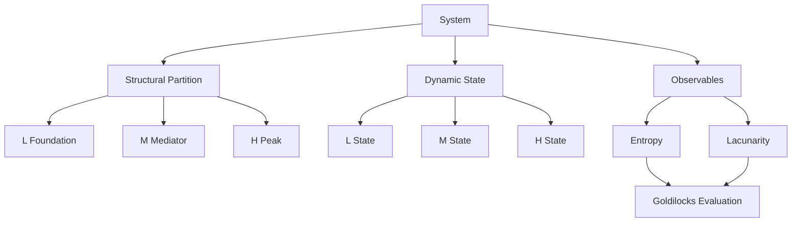
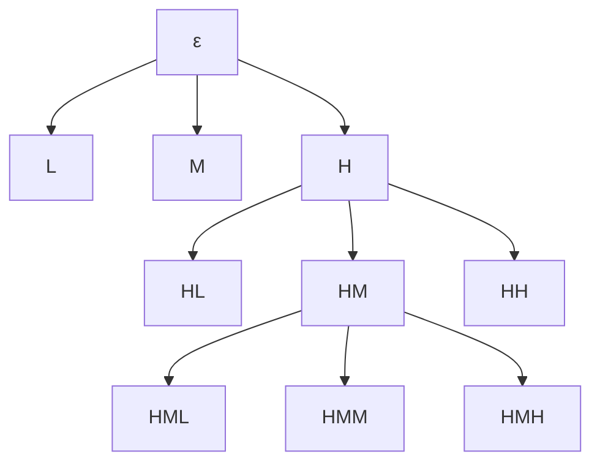
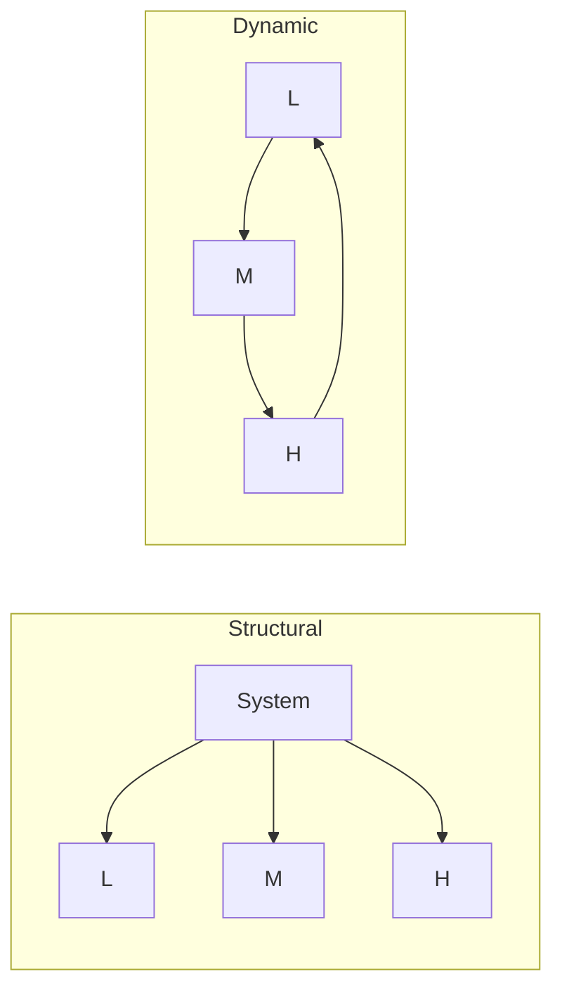
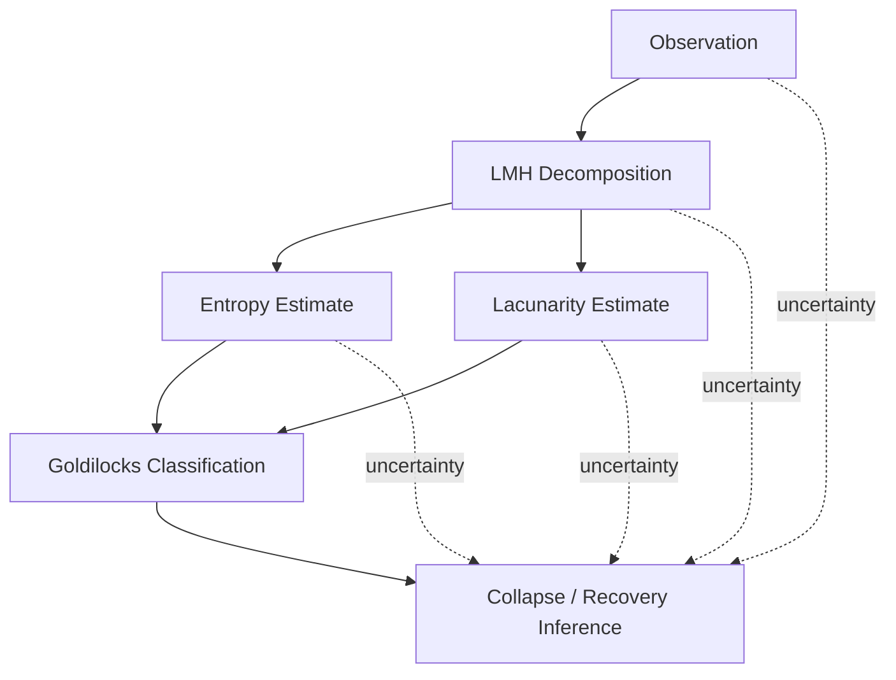
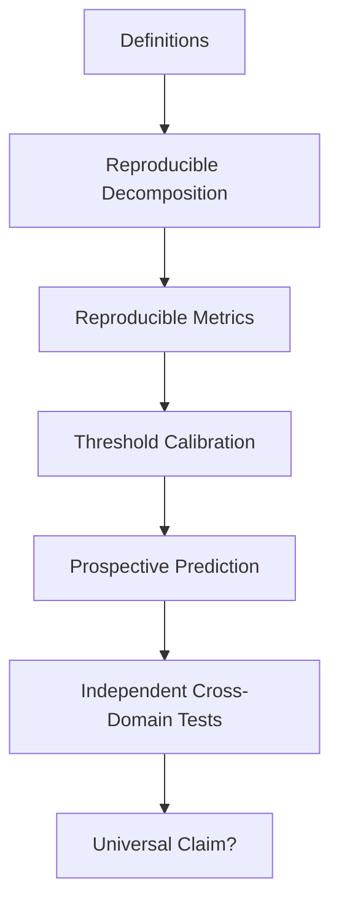

# TRANG [L, M, H] — FULL MAXIMUM CANONICAL EXPANSION

## Definitions · Equations · Recursive Architecture · Dynamics · Entropy · Lacunarity · Stability · Collapse · Recovery · Falsification · AMOS Integration

> **Continuation scope:** This expands the same **Trang [L, M, H]** framework from the preceding turn rather than replacing it with a new artifact.
>
> **Epistemic class:** `SOURCE_CLAIM / AMOS_MODEL`
>
> **Integrity boundary:** The supplied framework defines a recursive L/M/H systems model and associated mathematical rules. Its universality, numerical thresholds, cross-domain physical validity, causal interpretation, and implementation in external systems remain bounded by the evidence already supplied. I will not silently convert source-defined equations into empirically verified laws.

---

# 464. Canonical Kernel

The entire framework can be reduced to four interacting propositions:

$$
\boxed{
\mathbb S \xrightarrow{D_C} (L,M,H)
}
$$

$$
\boxed{
X\xrightarrow{D_C}(X_L,X_M,X_H)
}
$$

$$
\boxed{
L\rightarrow M\rightarrow H\rightarrow L
}
$$

$$
\boxed{
State_X
\rightarrow
(E_X,\Lambda_X,Dynamics_X)
}
$$

where:

* \(L\) = Foundation;
* \(M\) = Mediator;
* \(H\) = Peak;
* \(C\) = decomposition context;
* \(E\) = normalized Shannon-style entropy;
* \(\Lambda\) = lacunarity;
* \(D_C\) = contextual decomposition operator, a **derived formalization** rather than an explicit source operator.

---

# 465. Three Different Things Must Not Be Collapsed

The framework contains at least three ontological levels.

### Structural layer

$$
\mathbb S=L\cup M\cup H
$$

### Dynamical layer

$$
\mathbb S(t)=(L(t),M(t),H(t))
$$

### Measurement layer

$$
Z(t)=
(E_L,E_M,E_H,\Lambda_L,\Lambda_M,\Lambda_H)
$$

These are related but not identical.

---

# 466. Structural State ≠ Dynamical State

A structural layer such as \(L\) denotes a category/subsystem.

A dynamic variable such as \(L(t)\) denotes the state of that subsystem.

Therefore:

$$
L\neq L(t)
$$

under strict typing.

---

# 467. Dynamic State ≠ Entropy

Likewise:

$$
L(t)\neq E_L(t)
$$

because entropy is an observable derived from a probability distribution over states associated with L.

---

# 468. Dynamic State ≠ Lacunarity

Similarly:

$$
L(t)\neq\Lambda_L(t)
$$

Lacunarity is another observable.

---

# 469. Typed Canonicalization

A hardened mathematical notation would therefore use:

$$
\mathcal L,\mathcal M,\mathcal H
$$

for structural partitions and:

$$
\ell(t),m(t),h(t)
$$

for dynamic states.

Then:

$$
\mathcal S=
\mathcal L\sqcup\mathcal M\sqcup\mathcal H
$$

while:

$$
x(t)=
\begin{bmatrix}
\ell(t)\\
m(t)\\
h(t)
\end{bmatrix}
$$

This is **PROPOSED formal hardening**.

---

# 470. Why Type Hardening Matters

Without it, an expression such as:

$$
L\cap M=\emptyset
$$

treats L and M as sets, while:

$$
-\alpha_LL
$$

requires L to behave like a scalar/vector.

The source can remain conceptually coherent, but a formal implementation needs distinct types.

---

# 471. Proposed LMH Type Lattice

```text
SYSTEM
│
├── STRUCTURAL_PARTITION
│   ├── L_PARTITION
│   ├── M_PARTITION
│   └── H_PARTITION
│
├── DYNAMIC_STATE
│   ├── L_STATE
│   ├── M_STATE
│   └── H_STATE
│
├── OBSERVABLE
│   ├── ENTROPY
│   └── LACUNARITY
│
└── GOVERNANCE_STATE
    ├── GOLDILOCKS
    ├── BOUNDARY
    ├── DEGRADED
    ├── COLLAPSED
    └── RECOVERING
```

The governance-state branch is proposed rather than original source canon.

---

# 472. LMH as a Relative Coordinate System

Recursive decomposition creates a crucial property:

> L, M, and H are roles relative to a parent system.

If:

$$
H=(H_L,H_M,H_H)
$$

then \(H_L\) is simultaneously:

* part of the global H subsystem;
* the L-role of H's internal decomposition.

Therefore:

$$
Role(x)
$$

is insufficient.

More precisely:

$$
\boxed{
Role(x\mid Parent,Context,Scale)
}
$$

---

# 473. Relative Role Law

A node can be:

$$
H
$$

at scale \(n\), while serving as:

$$
L
$$

at scale \(n+1\).

No contradiction exists because the reference systems differ.

---

# 474. Same-Scale Exclusivity

The source's disjointness axiom instead constrains roles inside the **same decomposition**:

$$
L_C\cap M_C=\emptyset
$$

$$
M_C\cap H_C=\emptyset
$$

$$
H_C\cap L_C=\emptyset
$$

---

# 475. Cross-Scale Overlap Is Different

It does not imply:

$$
H_{parent}\cap H_L=\emptyset
$$

because \(H_L\subseteq H\) by recursive construction.

Thus disjointness is local to sibling roles.

---

# 476. Local Partition Invariant

For any decomposable node \(X\):

$$
\boxed{
X=X_L\sqcup X_M\sqcup X_H
}
$$

under the strongest partition interpretation.

---

# 477. Recursive Locality

Therefore the disjointness law should conceptually be applied locally:

$$
X_L\cap X_M=\emptyset
$$

$$
X_M\cap X_H=\emptyset
$$

$$
X_H\cap X_L=\emptyset
$$

rather than globally across every L/M/H label in the entire recursive tree.

---

# 478. Fractal Address Space

Each recursive node can be represented by a path:

$$
a\in\{L,M,H\}^*
$$

Examples:

$$
L
$$

$$
LM
$$

$$
MHL
$$

$$
HHLM
$$

---

# 479. Root Address

Define root:

$$
\epsilon
$$

where \(\epsilon\) is the empty path.

Then:

$$
Children(\epsilon)=\{L,M,H\}
$$

---

# 480. Parent Function

For address:

$$
a=a_1a_2\cdots a_n
$$

the parent is:

$$
Parent(a)=a_1a_2\cdots a_{n-1}
$$

---

# 481. Depth

$$
Depth(a)=|a|
$$

Thus:

$$
Depth(HML)=3
$$

---

# 482. Local Role

The final symbol identifies the node's role relative to its parent:

$$
LocalRole(HML)=L
$$

---

# 483. Ancestral Context

The prefix:

$$
HM
$$

preserves the higher-level structural context.

This means:

$$
HML
\neq
L
$$

even though both have local role L.

---

# 484. Fractal Identity

A complete LMH node identity therefore requires at least:

$$
\boxed{
Identity=(System,Context,Path)
}
$$

---

# 485. Proposed LMH URI

A machine-safe identifier could conceptually be:

```text
lmh://<system>/<context>/<path>
```

Example:

```text
lmh://human/neurocognitive/HML
```

This is proposed syntax only.

---

# 486. Full Ternary Expansion

If every node expands:

$$
1,3,9,27,81,\ldots
$$

At exact depth \(d\):

$$
N_d=3^d
$$

---

# 487. Cumulative Nodes

Through depth \(d\):

$$
N_{\leq d}
=
\sum_{k=0}^{d}3^k
$$

so:

$$
\boxed{
N_{\leq d}
=
\frac{3^{d+1}-1}{2}
}
$$

---

# 488. Depth 10 Example

At exact depth ten:

$$
3^{10}=59049
$$

nodes.

Cumulative through depth ten:

$$
\frac{3^{11}-1}{2}=88573
$$

This demonstrates why exhaustive recursion quickly becomes computationally expensive.

---

# 489. Fractal Runtime Requirement

A practical LMH reasoning system therefore should not automatically materialize the full recursive tree.

It should retrieve only branches that can change the conclusion.

---

# 490. Selective Traversal

Given objective \(Q\), define relevant branch set:

$$
R(Q)\subseteq Tree(S)
$$

Then reason over:

$$
R(Q)
$$

rather than:

$$
Tree(S)
$$

in full.

---

# 491. Smallest Sufficient Proof Scope

The ideal branch set is:

$$
R^*(Q)
=
\arg\min_R Cost(R)
$$

subject to:

$$
DecisionSufficiency(R,Q)=TRUE
$$

and:

$$
Integrity(R,Q)=TRUE
$$

This is a derived AMOS hardening, not a source LMH equation.

---

# 492. Recursion Termination

Infinite conceptual recursion requires a practical stopping rule.

Candidate termination predicate:

$$
Stop(X,C,Q)
$$

---

# 493. Possible Stop Conditions

A future canonical implementation could stop when one or more conditions hold:

$$
Atomic(X)
$$

$$
NoDecisionValue(Expand(X))
$$

$$
ResolutionSufficient(X,Q)
$$

$$
BudgetExceeded
$$

$$
NoEvidenceForFurtherDecomposition
$$

These remain proposed.

---

# 494. Integrity-Preserving Stop Rule

The strongest generic rule is:

$$
\boxed{
Stop
\iff
FurtherExpansionCannotMateriallyChangeTheAnswer
}
$$

provided no unresolved critical dependency remains.

---

# 495. Premature Stopping Risk

Stopping because:

> “the answer already sounds plausible”

is not valid.

Fluency is not proof sufficiency.

---

# 496. Over-Expansion Risk

Conversely, recursive expansion that cannot alter the decision wastes computation and can increase noise.

Therefore:

$$
MoreDepth\neq MoreTruth
$$

---

# 497. Adaptive Depth

A practical depth function:

$$
d^*
=
f(
Stakes,
Uncertainty,
Novelty,
Conflict,
DependencyDepth
)
$$

is more appropriate than a fixed recursion depth.

Derived governance.

---

# 498. LMH Decomposition Operator

A rigorous decomposition operator needs:

$$
D_C:
\mathcal S
\rightarrow
\mathcal P(\mathcal S)^3
$$

where:

$$
D_C(S)=(L,M,H)
$$

---

# 499. Validity Conditions

A valid decomposition requires:

$$
L\cup M\cup H=S
$$

and:

$$
L\cap M=M\cap H=H\cap L=\emptyset
$$

---

# 500. Nonempty Layers?

The source does not clearly establish whether all three layers must be nonempty.

Corollary 1 explicitly discusses:

$$
L=\emptyset
$$

so empty layers are at least logically considered.

---

# 501. Triad Existence vs Nonempty Triad

Therefore:

$$
\exists(L,M,H)
$$

does not automatically mean:

$$
L\neq\emptyset
\land
M\neq\emptyset
\land
H\neq\emptyset
$$

unless separately required.

---

# 502. H Existence Constraint

The source gives:

$$
L=\emptyset\Rightarrow H=\emptyset
$$

Thus H nonemptiness requires L nonemptiness:

$$
H\neq\emptyset\Rightarrow L\neq\emptyset
$$

---

# 503. M Existence Constraint

The direct L-H collapse claim suggests M is needed for sustainable operation, but does not strictly state:

$$
H\neq\emptyset\Rightarrow M\neq\emptyset
$$

at every instant.

---

# 504. Structural vs Sustainable Existence

Possible distinction:

$$
Exists(S)
$$

versus:

$$
SustainablyExists(S)
$$

The source may permit a transient L-H system without M but predicts collapse.

---

# 505. Ten-Step Claim

Source:

$$
L\leftrightarrow H
$$

without M:

$$
Collapse\quad after\quad\Delta t\approx10\ steps
$$

The exact meaning of `step` remains unresolved.

---

# 506. Strongest Logical Form

The claim should not be strengthened beyond something like:

$$
DirectLH\land MissingM
\Rightarrow
SourcePredictedCollapse(\Delta t\approx10)
$$

---

# 507. It Is Not a Proven Universal Constant

Do not rewrite as:

$$
T_{collapse}=10
$$

for every system.

The source only provides an approximate statement.

---

# 508. Time-Scale Problem

Ten iterations in an algorithm and ten generations in a civilization are incomparable unless a normalized time variable is defined.

No such normalization is supplied.

---

# 509. Candidate Dimensionless Time

A future theory might define:

$$
\tau=\frac{t}{T_{characteristic}}
$$

Then “10 steps” could potentially refer to normalized transitions.

But this is not source canon.

---

# 510. Entropy as Layer Observable

For finite:

$$
N_X>1
$$

the source gives:

$$
E_X
=
-\frac1{\ln N_X}
\sum_i p_i^X\ln p_i^X
$$

---

# 511. Probability Simplex

For valid probabilities:

$$
p_i\geq0
$$

and:

$$
\sum_i p_i=1
$$

These ordinary probability conditions are mathematically required even though not exhaustively restated in the artifact.

---

# 512. Entropy Domain

Under those conditions:

$$
0\leq E_X\leq1
$$

for finite \(N_X>1\).

---

# 513. Entropy Zero

$$
E_X=0
$$

corresponds to a degenerate distribution concentrated on one state.

---

# 514. Entropy One

$$
E_X=1
$$

corresponds to a uniform distribution over all \(N_X\) states.

---

# 515. LMH Uses a Very Low Entropy Region

Source Goldilocks values all lie well below 1:

$$
E_L<0.1
$$

$$
0.1<E_M<0.2
$$

$$
0.1\leq E_H\leq0.3
$$

depending on the source section.

Thus the framework proposes relatively concentrated state distributions.

---

# 516. Interpretation Depends on State Definition

A value:

$$
E=0.1
$$

has no universal physical meaning without defining:

* states;
* probabilities;
* observation window.

---

# 517. Entropy Estimator Bias

If probabilities are estimated from finite samples, entropy estimates can be biased.

The source does not specify an estimator.

Therefore empirical threshold comparisons require an estimation policy.

---

# 518. Sample Size

If:

$$
n\ll N
$$

many states may be unobserved.

This can distort entropy estimates.

---

# 519. Temporal Window

For a dynamic system, probabilities could be estimated over:

$$
[t-\Delta,t]
$$

Different \(\Delta\) values may produce different entropy values.

No window is specified.

---

# 520. Nonstationarity

If the distribution changes during the observation window, a single entropy estimate may mix regimes.

Thus:

$$
E_X(t)
$$

needs a temporal measurement definition.

---

# 521. Entropy Confidence

A rigorous measurement could produce:

$$
\hat E_X\pm\delta E_X
$$

rather than a point estimate only.

---

# 522. Threshold Robustness

If:

$$
\hat E_L+\delta E_L<0.1
$$

then safe classification is more robust than when the uncertainty interval crosses 0.1.

---

# 523. Boundary Uncertainty

If:

$$
[\hat E_L-\delta,\hat E_L+\delta]
$$

contains 0.1:

$$
Classification=CONDITIONAL
$$

would be a reasonable derived policy.

---

# 524. Countably Infinite State Space

The source mentions finite or countably infinite state spaces, but normalized entropy:

$$
\frac{H(p)}{\ln N}
$$

cannot simply use:

$$
N=\infty
$$

as an ordinary denominator.

---

# 525. Infinite-State Gap Is Structural

This is not cosmetic notation.

It affects whether:

$$
E_X\in[0,1]
$$

remains well-defined.

---

# 526. Possible Repairs

Future canon could choose:

1. restrict normalized E to finite \(N\);
2. use an alternative normalization;
3. use unnormalized Shannon entropy;
4. define an effective state count.

None should be selected silently.

---

# 527. Effective State Count Candidate

A possible concept is:

$$
N_{eff}=e^{H}
$$

but using it to normalize the same entropy would need careful definition and is not supplied.

---

# 528. Lacunarity

The source defines:

$$
\Lambda_X
=
\frac{
Var(Mass_X(\varepsilon))
}{
Mean(Mass_X(\varepsilon))^2
}
$$

---

# 529. Scale Is Intrinsic

A more complete notation is:

$$
\boxed{
\Lambda_X(\varepsilon,t)
}
$$

because box scale \(\varepsilon\) is part of the measurement.

---

# 530. Scale-Specific Threshold

Therefore a statement such as:

$$
\Lambda_L<0.1
$$

should conceptually mean:

$$
\Lambda_L(\varepsilon^*,t)<0.1
$$

for some canonical \(\varepsilon^*\).

But \(\varepsilon^*\) is missing.

---

# 531. Multiscale Lacunarity

A stronger fractal analysis might examine:

$$
\Lambda_X(\varepsilon)
$$

across many \(\varepsilon\), not just one.

---

# 532. Lacunarity Curve

Define:

$$
\mathcal L_X=
\{
(\varepsilon,\Lambda_X(\varepsilon))
\}
$$

This curve may carry more information than a single number.

Proposed extension.

---

# 533. Single-Point Reduction

The source appears to reduce lacunarity to a scalar operating indicator.

That simplification requires a scale-selection rule for reproducibility.

---

# 534. Mass Definition

`Mass` can represent:

* physical mass;
* density;
* connection count.

These are different observables.

---

# 535. Measurement Equivalence Is Not Established

Therefore:

$$
\Lambda^{mass}
$$

$$
\Lambda^{density}
$$

and:

$$
\Lambda^{connectivity}
$$

cannot automatically be compared numerically.

---

# 536. Cross-Domain Threshold Problem

If one domain computes \(\Lambda\) from physical mass and another from graph connectivity, using the same threshold:

$$
0.1
$$

requires evidence that these normalized measurements are meaningfully comparable.

The artifact does not provide such evidence.

---

# 537. Measurement Ontology

Each LMH application therefore needs:

$$
MeasurementOntology
$$

before E/Λ thresholds can be interpreted.

---

# 538. Goldilocks Entropy

The source later gives:

$$
E_L\in[0,0.1)
$$

$$
E_M\in(0.1,0.2)
$$

$$
E_H\in[0.1,0.3]
$$

---

# 539. Goldilocks Lacunarity

$$
\Lambda_L<0.1
$$

$$
\Lambda_M\in[0.1,0.3]
$$

$$
\Lambda_H\in[0.2,0.5]
$$

---

# 540. Goldilocks Predicate

Define, as a derived shorthand:

$$
G_E(Z)
$$

for entropy compliance and:

$$
G_\Lambda(Z)
$$

for lacunarity compliance.

---

# 541. Candidate Combined Predicate

A plausible combined operating condition:

$$
\boxed{
G(Z)=G_E(Z)\land G_\Lambda(Z)
}
$$

But because the source separately uses biconditionals for stability, this conjunction remains a derived interpretation rather than a textual replacement.

---

# 542. Source Stability Ambiguity

If:

$$
Stable\iff G_E
$$

and:

$$
Stable\iff G_\Lambda
$$

are both literal, then:

$$
G_E\iff G_\Lambda
$$

would follow.

No proof is supplied.

---

# 543. Safer Interpretation

Treat both as source-defined stability criteria:

```text
Entropy criterion
AND/OR
Lacunarity criterion
```

with exact logical composition unresolved.

---

# 544. Stability Vector

Instead of forcing one boolean, a hardened system can preserve:

$$
StabilityState=
(
EntropyCompliance,
LacunarityCompliance,
DynamicStability
)
$$

---

# 545. Example

```yaml
stability:
  entropy_zone: PASS
  lacunarity_zone: FAIL
  dynamical_stability: UNKNOWN
  overall: CONDITIONAL
```

This prevents information loss.

---

# 546. Stability Is Multi-Typed

At least four concepts should remain separate:

$$
S_{metric}
$$

$$
S_{local-dynamic}
$$

$$
S_{global-dynamic}
$$

$$
S_{operational}
$$

---

# 547. Metric Stability

$$
S_{metric}
$$

means E/Λ lie within source-defined regions.

---

# 548. Local Dynamical Stability

$$
S_{local-dynamic}
$$

asks whether small perturbations around equilibrium decay.

---

# 549. Global Dynamical Stability

$$
S_{global-dynamic}
$$

asks whether trajectories from a wider region converge or remain bounded.

---

# 550. Operational Stability

$$
S_{operational}
$$

asks whether the real system continues to perform its required function.

---

# 551. None Are Automatically Equivalent

$$
S_{metric}
\neq
S_{local-dynamic}
\neq
S_{operational}
$$

unless validated.

---

# 552. Dynamics Recast

Source:

$$
\dot L=-\alpha_LL+\beta_LF(M)+\gamma_L\xi_L
$$

$$
\dot M=-\alpha_MM+\beta_MF(L,H)+\gamma_M\xi_M
$$

$$
\dot H=-\alpha_HH+\beta_HF(M)+\gamma_H\xi_H
$$

---

# 553. Vector Form

A derived compact representation:

$$
\dot x
=
-Ax
+
BF(x)
+
\Gamma\xi(t)
$$

where:

$$
x=
\begin{bmatrix}
L\\M\\H
\end{bmatrix}
$$

---

# 554. This Compression Is Only Schematic

Because the source's \(F\) terms have different inputs, a single matrix representation requires explicit definitions not supplied.

Thus:

`DERIVED SCHEMATIC`.

---

# 555. Linear Special Case

Suppose, only as a mathematical test:

$$
F_L(M)=k_{LM}M
$$

$$
F_M(L,H)=k_{ML}L+k_{MH}H
$$

$$
F_H(M)=k_{HM}M
$$

Then the deterministic part becomes linear.

---

# 556. Candidate Matrix

$$
\dot x=Ax
$$

with:

$$
A=
\begin{bmatrix}
-\alpha_L & \beta_Lk_{LM} & 0\\
\beta_Mk_{ML} & -\alpha_M & \beta_Mk_{MH}\\
0 & \beta_Hk_{HM} & -\alpha_H
\end{bmatrix}
$$

This is an illustrative derived model, **not source canon**.

---

# 557. Why the Linear Special Case Helps

It demonstrates that stability depends not only on entropy/lacunarity but also on:

* damping;
* coupling strength.

If positive feedback dominates damping, the state may diverge.

---

# 558. Stability Eigenvalues

For the linear special case:

$$
Re(\lambda_i(A))<0
$$

would imply local/global exponential stability of the origin under ordinary linear-system assumptions.

Again, this is mathematical analysis of a hypothetical specialization.

---

# 559. Source Does Not Supply Those Parameters

Therefore no actual eigenvalues can be calculated.

---

# 560. Equilibrium

Source:

$$
L^*
=
\frac{\beta_L}{\alpha_L}F(M^*)
+
\frac{\gamma_L}{\alpha_L}\bar\xi_L
$$

and analogous equations.

---

# 561. Equilibrium Is Implicit

Because:

$$
M^*
$$

depends on:

$$
L^*,H^*
$$

the three equations generally form a coupled fixed-point system.

---

# 562. Fixed-Point Form

Conceptually:

$$
x^*=G(x^*)
$$

---

# 563. Existence Is Not Guaranteed

A solution:

$$
x^*
$$

may:

* not exist;
* be unique;
* have multiple values.

The source does not prove existence or uniqueness.

---

# 564. Multiple Equilibria

Nonlinear \(F\) can produce:

$$
x_1^*,x_2^*,\ldots
$$

This could imply multiple regimes.

---

# 565. Regime Dependence

If multiple equilibria exist, Goldilocks thresholds may behave differently around each regime.

No regime model is supplied.

---

# 566. Bifurcation

Changing:

$$
\alpha,\beta,\gamma
$$

could potentially alter equilibrium structure.

A nonlinear LMH model might exhibit bifurcations.

This is a mathematical possibility, not a source claim.

---

# 567. Noise

The source includes:

$$
\xi_X(t)
$$

which means deterministic fixed-point reasoning may be insufficient.

---

# 568. Stochastic Equilibrium

With persistent noise, one may need a stationary distribution rather than a single equilibrium state.

---

# 569. Stationary Distribution

Conceptually:

$$
P(x,t)\rightarrow P^*(x)
$$

could replace:

$$
x(t)\rightarrow x^*
$$

under stochastic dynamics.

Not source canon.

---

# 570. Entropy-Dynamics Link Missing

An important missing equation is:

$$
E_X=f(X)
$$

or:

$$
\dot E_X=g(X,\dot X)
$$

The source defines entropy but does not explicitly connect its dynamics to \(L,M,H\) state equations.

---

# 571. Lacunarity-Dynamics Link Missing

Likewise:

$$
\Lambda_X=h(X)
$$

is not formally specified.

---

# 572. Diagnostic Layer Is Detached

Therefore the artifact currently contains:

1. structural dynamics;
2. metric definitions;
3. threshold governance;

but no complete mathematical bridge among all three.

---

# 573. Required Bridge

A complete predictive theory needs:

$$
x(t)
\rightarrow
P_X(t)
\rightarrow
E_X(t)
$$

and:

$$
x(t)
\rightarrow
MassDistribution_X(t,\varepsilon)
\rightarrow
\Lambda_X(t,\varepsilon)
$$

---

# 574. Without the Bridge

One cannot simulate:

$$
x(t)
$$

and automatically know whether Goldilocks thresholds are satisfied.

---

# 575. This Is a Critical Gap

The missing observation functions are load-bearing for predictive use.

---

# 576. Proposed Observation Model

$$
y(t)=h(x(t))
$$

where:

$$
y(t)=
[
E_L,E_M,E_H,
\Lambda_L,\Lambda_M,\Lambda_H
]^T
$$

This is a standard derived systems-model representation.

---

# 577. Goldilocks Then Acts on Observations

$$
G(y(t))
$$

rather than directly on the hidden state \(x(t)\).

---

# 578. Hidden State Possibility

In real systems, L/M/H states may not be directly observable.

Therefore:

$$
x(t)
$$

could be latent while E/Λ are estimated from observations.

---

# 579. Estimation Layer

A practical pipeline becomes:

```text
Real System
   ↓
Sensors / Observations
   ↓
State Estimation
   ↓
LMH Decomposition
   ↓
Entropy + Lacunarity
   ↓
Goldilocks Evaluation
```

This is proposed implementation architecture.

---

# 580. Measurement Error Propagation

Errors in observations propagate:

$$
ObservationError
\rightarrow
StateError
\rightarrow
MetricError
\rightarrow
ClassificationError
$$

---

# 581. Weakest-Premise Ceiling

Therefore diagnostic confidence must obey:

$$
C_{diagnosis}
\leq
\min(
C_{observation},
C_{decomposition},
C_{measurement},
C_{threshold}
)
$$

Derived AMOS integrity rule.

---

# 582. Threshold Conflict Lowers Ceiling

Because the source itself disagrees on some interval endpoints, conclusions at those endpoints must remain conditional.

---

# 583. Interior Values Are More Robust

For example:

$$
E_M=0.15
$$

lies inside both:

$$
[0.1,0.2]
$$

and:

$$
(0.1,0.2)
$$

Thus its classification is robust to that specific source discrepancy.

---

# 584. Endpoint Values Are Fragile

$$
E_M=0.1
$$

or:

$$
0.2
$$

change classification depending on which source equation governs.

---

# 585. Sensitivity Principle

Therefore when values lie near disputed boundaries, resolve threshold canon before doing deeper analysis.

---

# 586. Collapse Logic

Source:

$$
Collapse
\Rightarrow
(E_L>0.1)\lor(E_M>0.2)
$$

---

# 587. Necessary Condition Only

This means:

$$
(E_L\leq0.1)\land(E_M\leq0.2)
\Rightarrow
\neg Collapse
$$

only by contraposition if the source implication is treated strictly and all variables are well-defined.

---

# 588. Important Consequence

Under strict classical logic, the source claim excludes collapse whenever both L and M remain at or below those limits.

That is stronger than merely saying collapse “usually starts” in L/M.

---

# 589. Yet H Can Be Outside Stability

Suppose:

$$
E_L=0.05
$$

$$
E_M=0.15
$$

$$
E_H=0.9
$$

Then:

* L/M do not satisfy the source collapse condition;
* H strongly violates the H stability region.

Therefore the source allows:

$$
Unstable\land\neg Collapse
$$

unless some additional rule exists.

---

# 590. This Supports State Separation

Thus:

$$
UNSTABLE
$$

and:

$$
COLLAPSED
$$

should not be treated as synonyms.

---

# 591. Collapse Could Be a Later Stage

A plausible state sequence is:

$$
Stable
\rightarrow
Unstable
\rightarrow
Collapse
$$

This resolves some apparent tension but remains derived.

---

# 592. Collapse Causation Remains Unproven

Even if all observed collapse cases have high L/M entropy:

$$
Correlation
$$

would not establish:

$$
L/MEntropy
\rightarrow
Collapse
$$

without intervention or mechanism evidence.

---

# 593. Confounding

A hidden factor \(Z\) could cause both:

$$
Z\rightarrow E_L
$$

and:

$$
Z\rightarrow Collapse
$$

Thus:

$$
E_L\leftrightarrow Collapse
$$

could be noncausal.

---

# 594. Mediation

Alternatively:

$$
E_L
\rightarrow
E_M
\rightarrow
Collapse
$$

could make M a mediator.

The source does not discriminate these causal structures.

---

# 595. Feedback

Because LMH is cyclic:

$$
CollapseRisk
$$

may itself affect L/M/H metrics.

This complicates causal inference.

---

# 596. Recovery Logic

Source:

$$
Recovery
\Rightarrow
(E_L<0.05)\land(\Lambda_L<0.1)
$$

---

# 597. Recovery Necessity

Under strict logic, every recovery state must satisfy both L conditions.

---

# 598. But Sufficiency Is Absent

$$
(E_L<0.05)\land(\Lambda_L<0.1)
$$

does not guarantee recovery.

---

# 599. Recovery Could Require M/H Conditions

The source does not exclude additional necessary conditions involving M or H.

---

# 600. Minimal Recovery Interpretation

The strongest safe statement is:

> Within the source model, low L entropy and low L lacunarity are proposed necessary conditions for recovery.

---

# 601. Hysteresis

Normal safe bound:

$$
E_L<0.1
$$

Recovery bound:

$$
E_L<0.05
$$

suggests:

$$
RecoveryThreshold
<
NormalBoundary
$$

---

# 602. Why Hysteresis Can Be Useful

In control systems, distinct failure/recovery thresholds can prevent rapid oscillation between states.

But the artifact does not explicitly define such a control mechanism.

---

# 603. Candidate State Transition

```text
NORMAL
  │ E_L rises
  ▼
DEGRADED
  │ collapse criteria
  ▼
COLLAPSED
  │ E_L < .05 and Λ_L < .1
  ▼
RECOVERING
  │ additional conditions?
  ▼
NORMAL
```

Everything beyond the supplied necessary conditions is proposed.

---

# 604. Scaling Law

Source:

$$
r_{LM}
=
\frac{\Lambda_M}{\Lambda_L}
\approx2\text{–}10
$$

$$
r_{MH}
=
\frac{\Lambda_H}{\Lambda_M}
\approx1.5\text{–}5
$$

---

# 605. Scale Ratio Requires Positive Denominators

For these to be defined:

$$
\Lambda_L>0
$$

and:

$$
\Lambda_M>0
$$

---

# 606. Goldilocks Allows \(\Lambda_L=0\)

Therefore Goldilocks does not guarantee scaling-law definability.

---

# 607. Additional Invariant Needed

A scale-law-compatible state requires:

$$
0<\Lambda_L<0.1
$$

not merely:

$$
\Lambda_L<0.1
$$

if ordinary ratio semantics apply.

This is derived necessity, not source correction.

---

# 608. Scaling Implies Ordering

If:

$$
r_{LM}>1
$$

then:

$$
\Lambda_M>\Lambda_L
$$

If:

$$
r_{MH}>1
$$

then:

$$
\Lambda_H>\Lambda_M
$$

---

# 609. Therefore Scaling Implies

$$
\boxed{
\Lambda_L<\Lambda_M<\Lambda_H
}
$$

provided all values are positive.

---

# 610. Goldilocks Alone Does Not

As previously shown:

$$
\Lambda_M=0.3
$$

$$
\Lambda_H=0.2
$$

satisfy the broad individual intervals but violate:

$$
\Lambda_M<\Lambda_H
$$

---

# 611. Joint Constraint

If scaling and Goldilocks are both canonical, valid states must satisfy their intersection:

$$
\mathcal G_\Lambda
\cap
\mathcal R_{scale}
$$

---

# 612. This Is Stronger Than Either Alone

A future implementation should therefore not test each interval independently and ignore ratio constraints.

---

# 613. Feasibility Example

Take:

$$
\Lambda_L=0.05
$$

$$
\Lambda_M=0.15
$$

$$
\Lambda_H=0.30
$$

Then:

$$
r_{LM}=3
$$

and:

$$
r_{MH}=2
$$

Both source ratio ranges are satisfied.

This is a mathematically feasible configuration.

---

# 614. Feasibility Counterexample

Take:

$$
\Lambda_L=0.09
$$

$$
\Lambda_M=0.10
$$

Then:

$$
r_{LM}\approx1.11
$$

which violates the claimed `2–10` ratio while both values can fit broad layer ranges.

---

# 615. Therefore

$$
LayerBounds
\not\Rightarrow
ScaleBounds
$$

---

# 616. Scale Ratios Are Independent Constraints

They must be treated as additional source hypotheses.

---

# 617. Universal Fractal Claim

The source proposes recursive self-similarity.

To strengthen that into a mathematical fractal theory, one would need explicit scale transformation.

---

# 618. Recursive Form Alone

$$
X\mapsto(X_L,X_M,X_H)
$$

gives recursive branching.

---

# 619. Missing Geometric Scale

A classic self-similar fractal also requires a contraction ratio or equivalent scale relation.

The source's lacunarity ratios are not explicitly geometric contraction factors.

---

# 620. Therefore No Fractal Dimension Can Be Safely Derived

Do not calculate:

$$
D=\frac{\ln3}{\ln r}
$$

using the supplied lacunarity ratios.

That would conflate two different quantities.

---

# 621. Fractal Classes

A useful distinction:

### F0 — Recursive taxonomy

Repeated LMH decomposition.

### F1 — Structural self-similarity

Similar role pattern across scales.

### F2 — Statistical self-similarity

Scale-dependent statistics follow invariant distributions.

### F3 — Geometric fractality

Formal scale law and fractal dimension.

The source clearly specifies F0 and asserts F1.

F2/F3 are not established.

---

# 622. Cross-Domain Mapping Strength

Likewise distinguish:

### C0 — Naming analogy

We can label parts L/M/H.

### C1 — Functional correspondence

Roles genuinely perform analogous functions.

### C2 — Structural isomorphism

Relations among roles are formally equivalent.

### C3 — Dynamical equivalence

Systems obey equivalent equations.

### C4 — Mechanistic identity

Same causal mechanism.

The artifact's examples mainly support proposed C0/C1 mappings.

---

# 623. Do Not Jump from C1 to C4

For example:

$$
Heart\sim M
$$

and:

$$
MiddleManagement\sim M
$$

does not imply hearts and middle management operate through the same mechanism.

---

# 624. Physical Examples Need Separate Validation

Quarks, nuclei, CMB, dark matter, galaxies, and black holes belong to empirical physics.

Mapping them to LMH does not change the burden of physical evidence.

---

# 625. Biological Examples Need Separate Validation

Human-body or cell mappings must not be promoted to medical/neuroscience claims without appropriate evidence.

---

# 626. AI Examples Need Implementation Evidence

Calling memory L, attention M, and transformer H does not prove an actual AI runtime is organized that way.

---

# 627. Organizational Examples Are Context-Sensitive

A decentralized organization may map differently from a traditional hierarchy.

Therefore context must remain explicit.

---

# 628. Universal Model May Still Be Useful Without Universal Truth

A framework can be valuable as:

$$
AnalyticalGrammar
$$

even if some stronger ontological claims fail.

---

# 629. LMH Analytical Questions

For any system, ask:

### L

What maintains the system's basic persistence?

### M

What coordinates, routes, or transforms interactions?

### H

What performs high-order synthesis, selection, or decision?

These questions are directly aligned with the source roles.

---

# 630. Second-Level Questions

For L itself:

* what is L's foundation?
* what mediates L?
* what is L's peak processor?

Repeat for M and H.

---

# 631. This Produces Recursive Diagnosis

Instead of saying:

> “M is failing,”

one can ask:

$$
WhichSubroleOfM?
$$

Perhaps:

$$
M_M
$$

rather than the entire M layer.

---

# 632. Localized Repair

This supports a derived repair principle:

$$
Fault(X_a)
\Rightarrow
Repair(X_a)
$$

before replacing the whole system.

---

# 633. Local Invalidation

Similarly:

$$
Invalid(X_a)
$$

should invalidate descendants and dependent conclusions, not unrelated branches.

This aligns with broader AMOS causal-lineage discipline.

---

# 634. Recursive Fault Tree

```text
System
├── L
│   ├── LL
│   ├── LM
│   └── LH
├── M
│   ├── ML
│   ├── MM ← fault
│   └── MH
└── H
    ├── HL
    ├── HM
    └── HH
```

A local MM fault need not imply all other nodes are invalid.

---

# 635. Propagation Must Be Proven

Because the framework includes coupling, MM failure may affect other nodes.

But propagation should follow explicit dependency edges.

Do not assume global failure automatically.

---

# 636. Dependency Graph

Each node can conceptually carry:

```yaml
dependencies:
  upstream: []
  downstream: []
```

This is proposed hardening.

---

# 637. Causal Graph ≠ Fractal Tree

The recursive decomposition tree and the causal dependency graph are different structures.

---

# 638. Tree Edge

$$
Parent\rightarrow Child
$$

means decomposition/containment.

---

# 639. Causal Edge

$$
A\rightarrow B
$$

means A causally affects B.

These must not be conflated.

---

# 640. Feedback Edge

$$
H\rightarrow L
$$

in the source is a functional/dynamical relation, not a containment relation.

---

# 641. Two Graphs Required

A rigorous LMH representation therefore needs:

### Structural graph

Who contains whom?

### Dynamical graph

Who influences whom?

---

# 642. Optional Third Graph

### Provenance graph

Which evidence supports which classification?

---

# 643. Optional Fourth Graph

### Epistemic dependency graph

Which conclusions depend on which premises?

---

# 644. Graph Separation Prevents Causal Overreach

Structural containment:

$$
A\subseteq B
$$

does not imply:

$$
A\ causes\ B
$$

---

# 645. Provenance Separation Prevents Sybil Inflation

Multiple derived claims from one source do not become independent confirmation.

---

# 646. LMH Proof-Carrying Node

A hardened node might be:

```yaml
node:
  path: HML
  local_role: L
  parent: HM

  claim_class: MODEL

  role_evidence:
    - source_1

  structural_dependencies: []
  causal_dependencies: []

  entropy:
    value:
    uncertainty:

  lacunarity:
    value:
    epsilon:
    uncertainty:

  competing_roles: []
  falsifiers: []
```

`PROPOSED`.

---

# 647. Competing Role Classification

If evidence supports:

$$
P(Role=L)\approx P(Role=M)
$$

a system should preserve:

`COMPETING`

rather than force classification.

---

# 648. Source Disjointness Does Not Require Epistemic Certainty

The model can assert that the true roles are disjoint while the analyst remains uncertain about which role applies.

Thus:

$$
OntologicalExclusivity
$$

and:

$$
EpistemicUncertainty
$$

can coexist.

---

# 649. Example

The true model may say:

$$
x\in M
$$

while evidence only supports:

```text
L candidate
M candidate
```

The correct knowledge state is `COMPETING`.

---

# 650. Unknown Is a Valid Output

If decomposition cannot be justified:

$$
Role(x)=UNKNOWN
$$

is preferable to fabricated precision.

---

# 651. LMH Classification Proof Capsule

```yaml
claim:
  node: X
  role: M

class: DERIVED

premises:
  - coordinates_subsystems
  - routes_information
  - transforms_inputs

scope:
  system:
  context:
  scale:

competing:
  - H

falsifier:
  - evidence that X primarily performs peak synthesis

confidence_ceiling:
```

---

# 652. System-Level Proof Capsule

```yaml
claim:
  system: S
  decomposition:
    L:
    M:
    H:

class: MODEL

premises:
  - boundary_defined
  - roles_defined
  - coverage_satisfied
  - disjointness_satisfied

unresolved:
  - uniqueness

falsifiers:
  - uncovered_component
  - unavoidable_same-context_overlap
  - equally_valid_competing_partition
```

---

# 653. Universal LMH Proof Capsule

The universal claim would require vastly stronger evidence:

```yaml
claim: "All systems admit LMH decomposition"

class: SOURCE_CLAIM

required_evidence:
  - formal scope definition
  - decomposition theorem or empirical protocol
  - hostile counterexample search
  - cross-domain validation
  - uniqueness analysis

current_status: UNVERIFIED
```

---

# 654. Universal Claim Cannot Borrow Confidence from Definitions

Defining:

$$
LMH
$$

does not establish:

$$
\forall S,\ LMH(S)
$$

Definitions and empirical universals have different evidential burdens.

---

# 655. Model Flexibility Risk

If L/M/H definitions are broad enough, nearly any system may be retrospectively classified.

That can create apparent universality without predictive power.

---

# 656. Falsifiability Requirement

Therefore the decomposition algorithm must state when:

$$
LMH(S)=FALSE
$$

or:

$$
UNRESOLVED
$$

---

# 657. Negative Cases Matter

A mature theory needs examples where LMH **does not** apply or where evidence is insufficient.

Otherwise universal fit may be partly definitional.

---

# 658. Pre-Registered Decomposition

Before observing outcome \(Y\):

$$
D_C(S)
$$

should be frozen.

Then predictions should be tested.

---

# 659. Avoid Outcome-Driven Remapping

Invalid procedure:

$$
ObserveCollapse
\rightarrow
RedefineL
\rightarrow
FindE_L>0.1
$$

That cannot independently validate the collapse rule.

---

# 660. Prospective Test

Valid stronger procedure:

$$
DefineL,M,H
$$

$$
MeasureE,\Lambda
$$

$$
PredictCollapse
$$

$$
ObserveOutcome
$$

---

# 661. Out-of-Sample Requirement

Thresholds should ideally be calibrated on one set and tested on another.

Otherwise overfitting remains possible.

---

# 662. Cross-Domain Holdout

If universality is claimed, entire domains could be held out.

For example:

* calibrate on biological + computational systems;
* test on organizational systems.

Still, this would not prove physical universality.

---

# 663. Counterexample Priority

For a universal claim, a credible counterexample can carry more decision value than many confirmatory examples.

---

# 664. Cheapest High-Information Test

The first question should be:

> Can two independent analysts, using frozen definitions, derive the same L/M/H decomposition?

If not, later numerical tests may lack a stable object of measurement.

---

# 665. Decomposition Reliability

One could quantify agreement using an appropriate categorical agreement metric.

The source does not supply one.

---

# 666. Only After Reliable Decomposition

Then test:

$$
E
$$

and:

$$
\Lambda
$$

reproducibility.

---

# 667. Only After Reproducible Metrics

Then test:

* Goldilocks;
* collapse;
* recovery;
* scaling.

This is the correct dependency order.

---

# 668. Validation Dependency Chain

```text
Role definitions
    ↓
Decomposition reproducibility
    ↓
Measurement reproducibility
    ↓
Threshold calibration
    ↓
Predictive validation
    ↓
Cross-domain validation
    ↓
Universality claim
```

---

# 669. Do Not Reverse the Chain

Universal rhetoric cannot substitute for lower-level validation.

---

# 670. Formal Uniqueness

Source says the triad is unique within context.

Mathematically:

$$
D_C(S)=D'_C(S)
$$

for every valid decomposition \(D,D'\).

---

# 671. Uniqueness Requires Equivalence Definition

If two decompositions differ only in labels or granularity, are they different?

The source does not define equivalence.

---

# 672. Partition Equivalence

A future spec might say two decompositions are equivalent if:

$$
L_1=L_2,\quad
M_1=M_2,\quad
H_1=H_2
$$

up to permitted representation transformations.

But permitted transformations are unknown.

---

# 673. Approximate Uniqueness

Real systems may only permit:

$$
D_1\approx D_2
$$

rather than exact equality.

The source does not define a distance metric between decompositions.

---

# 674. Decomposition Distance

A future metric could measure overlap or structural similarity.

Again, proposed only.

---

# 675. Form Equality

The source states:

$$
Form(L)=Form(M)=Form(H)
$$

This requires a definition of `Form`.

---

# 676. Weak Form Interpretation

At minimum:

$$
Form(X)=\text{LMH-decomposable}
$$

---

# 677. Strong Form Interpretation

A much stronger claim would be:

$$
Graph(L)\cong Graph(M)\cong Graph(H)
$$

No evidence establishes this stronger interpretation.

---

# 678. Stronger Still

Exact scale-invariant dynamics would require:

$$
Dynamics(L)\cong Dynamics(M)\cong Dynamics(H)
$$

after transformation.

Also not established.

---

# 679. Safest Canon

Therefore preserve:

$$
\boxed{
FormEquality
=
RecursiveLMHRolePattern
}
$$

as the weakest defensible interpretation unless a formal `Form()` definition appears.

---

# 680. Entropy Hierarchy

The source broadly implies:

$$
L:\text{lowest entropy}
$$

$$
M:\text{intermediate entropy}
$$

$$
H:\text{higher/broader entropy}
$$

---

# 681. But Ranges Overlap

For example:

$$
E_H\in[0.1,0.3]
$$

and:

$$
E_M\in(0.1,0.2)
$$

so:

$$
E_H
$$

can be less than or equal to some possible \(E_M\) values.

---

# 682. Therefore Strict Ordering Is Not Guaranteed

The source does not mathematically imply:

$$
E_L<E_M<E_H
$$

for every admissible state.

---

# 683. Example

$$
E_M=0.19
$$

$$
E_H=0.11
$$

can satisfy Goldilocks while:

$$
E_H<E_M
$$

---

# 684. Entropy Roles Are Ranges, Not Total Ordering

Thus the model defines characteristic bands, not necessarily strict per-state monotonic ordering.

---

# 685. Lacunarity Scaling Is Stronger

The ratio claims, if enforced, do imply strict increasing lacunarity:

$$
\Lambda_L<\Lambda_M<\Lambda_H
$$

---

# 686. Entropy and Lacunarity Behave Differently

Do not infer that because lacunarity is claimed to increase, entropy must also increase.

---

# 687. No Monotonic Coupling

No source equation gives:

$$
\frac{dE}{d\Lambda}>0
$$

or similar.

---

# 688. Six-Dimensional Metric State

The full diagnostic point is:

$$
z=
(
E_L,\Lambda_L,
E_M,\Lambda_M,
E_H,\Lambda_H
)
$$

---

# 689. Metric Trajectory

Over time:

$$
z(t)
$$

forms a trajectory through metric space.

---

# 690. Goldilocks Region

$$
\mathcal G\subseteq\mathbb R^6
$$

is the safe/model-selected region.

---

# 691. Boundary

$$
\partial\mathcal G
$$

contains threshold surfaces.

---

# 692. Boundary Ambiguity

Because the source disagrees on some open/closed endpoints, portions of:

$$
\partial\mathcal G
$$

remain unresolved.

---

# 693. Interior

Points comfortably inside all versions of the source ranges have higher classification robustness.

---

# 694. Exterior

Points far outside all source ranges robustly violate the Goldilocks conditions, though the real-world consequence remains model-dependent.

---

# 695. Distance to Boundary

A useful derived metric:

$$
d(z,\partial\mathcal G)
$$

could quantify margin.

---

# 696. Margin ≠ Confidence

A large metric margin does not fix poor measurement or invalid decomposition.

Thus:

$$
Margin
\neq
EpistemicConfidence
$$

---

# 697. Confidence Requires Evidence Quality

$$
C
=
f(
MeasurementQuality,
DecompositionQuality,
ThresholdValidity,
Freshness,
Scope
)
$$

---

# 698. Goldilocks Selection

Source unified equation:

$$
X(t+1)
=
\mathcal C(
\mathcal F(
X(t),\tilde X(t),\xi_X(t)
))
$$

---

# 699. Candidate State

Define:

$$
X'= \mathcal F(...)
$$

---

# 700. Selection

Then:

$$
X(t+1)=\mathcal C(X')
$$

---

# 701. Binary Selection Is Not Explicit

\(\mathcal C\) could:

* accept;
* reject;
* modify;
* rank;
* probabilistically select.

The source only describes survival/selection broadly.

---

# 702. Deterministic vs Stochastic Selection

Because \(\mathcal F\) includes noise, the whole update can be stochastic even if \(\mathcal C\) is deterministic.

---

# 703. Selection Criterion

The source associates \(\mathcal C\) with Goldilocks conditions.

A candidate binary form is:

$$
\mathcal C(X')
=
X'
\quad
\text{if }G(X')
$$

but the failure branch is unspecified.

---

# 704. Fail-Closed Interpretation

A governance-oriented implementation might choose:

$$
\neg G(X')
\Rightarrow Reject(X')
$$

This is a reasonable AMOS hardening but **not explicitly source-defined**.

---

# 705. Repair Interpretation

Alternatively:

$$
\neg G(X')
\Rightarrow Repair(X')
$$

could be possible.

---

# 706. Competing Selection Semantics

Thus:

* reject;
* repair;
* retry;
* degrade;

remain `COMPETING/UNKNOWN`.

---

# 707. Evolutionary Fitness

Goldilocks compliance acts like a fitness criterion in the source model.

But:

$$
Fitness_{LMH}
$$

is model-specific.

---

# 708. Fitness ≠ Truth

A state can be stable and still encode false beliefs.

---

# 709. Fitness ≠ Ethics

A stable organization can still behave unethically.

---

# 710. Fitness ≠ Optimality

Goldilocks survival does not establish global optimum.

---

# 711. Stable ≠ Good

This is an important governance firewall.

---

# 712. Optimization Objective Missing

The source specifies stability/survival but not a universal objective function:

$$
J(X)
$$

---

# 713. Therefore

The framework is more naturally a **viability model** than a complete optimization theory.

---

# 714. Viability Interpretation

Goldilocks defines:

$$
Viable(X)=TRUE
$$

within a region.

It does not rank every viable state.

---

# 715. Viability Kernel Analogy

In control theory, a viability kernel is a set of states from which constraints can be maintained.

LMH Goldilocks has a loose structural resemblance to this idea.

But this is an analogy, not an explicit source binding.

---

# 716. Do Not Claim Control-Theory Identity

$$
GoldilocksZone
\neq
FormalViabilityKernel
$$

unless derived and proven under explicit dynamics.

---

# 717. Collapse vs Leaving Goldilocks

Leaving:

$$
\mathcal G
$$

does not automatically mean collapse because the source's collapse implication is narrower.

---

# 718. Therefore Three Sets

Potentially:

$$
\mathcal G=\text{Goldilocks}
$$

$$
\mathcal U=\text{non-Goldilocks/unstable}
$$

$$
\mathcal C=\text{collapse}
$$

with:

$$
\mathcal C\subseteq\mathcal U
$$

as a plausible derived relationship.

---

# 719. Recovery Region

Likewise define:

$$
\mathcal R_L=
\{
E_L<0.05,\Lambda_L<0.1
\}
$$

as the source-required L recovery region.

---

# 720. Recovery Region Is Not Necessarily Entire Recovery State

Because M/H conditions may also matter.

---

# 721. Causal Epochs

A useful derived temporal segmentation:

```text
Baseline
→ Perturbation
→ Degradation
→ Collapse onset
→ Recovery initiation
→ Re-stabilization
```

The source does not define these epochs formally.

---

# 722. Why Epochs Matter

Metrics observed after collapse may not identify the cause of collapse.

Temporal ordering must be preserved.

---

# 723. Post-Hoc Measurement Problem

If:

$$
E_L>0.1
$$

is measured only after collapse, it cannot by itself prove that L entropy initiated collapse.

---

# 724. Need Pre-Collapse Evidence

Causal testing requires measurements before onset.

---

# 725. Time-Series Requirement

A serious empirical test needs:

$$
z(t_0),z(t_1),\ldots,z(t_n)
$$

rather than one snapshot.

---

# 726. Intervention Evidence

Stronger causal evidence could come from controlled interventions that modify L/M conditions while holding alternatives appropriately controlled.

Domain safety constraints obviously matter.

---

# 727. Causal Classes

For LMH claims, distinguish:

```text
ASSOCIATION
TEMPORAL_PRECEDENCE
MECHANISM
NECESSARY_CONDITION
SUFFICIENT_CONDITION
CAUSAL_EFFECT
```

---

# 728. Corollary 3

The equation licenses, at most, a model-level necessary-condition claim.

It does not by itself establish causal effect.

---

# 729. Corollary 4

Likewise model-level necessity, not causal sufficiency.

---

# 730. Direct L-H Claim

This is explicitly more causal/predictive in wording and therefore requires stronger evidence.

---

# 731. Causal Burden

To establish:

$$
MissingM\rightarrow Collapse
$$

one must rule out alternative explanations.

---

# 732. M Could Be Proxy

M's absence might correlate with some deeper structural failure.

Thus:

$$
MissingM
$$

could be an indicator rather than cause.

---

# 733. Strongest Source-Safe Language

> The framework proposes M as a necessary sustainable mediator between L and H.

That preserves the source without claiming empirical causation.

---

# 734. LMH and Information Flow

The source says L supplies information/material/energy, M coordinates/transforms, H synthesizes/decides.

A generalized flow model is:

$$
Input
\rightarrow
L
\rightarrow
M
\rightarrow
H
$$

with feedback:

$$
H\rightarrow L
$$

---

# 735. But External Inputs Are Not Formalized

The differential equations do not explicitly contain external input:

$$
u(t)
$$

---

# 736. External Environment Missing

A real open system might require:

$$
\dot x=f(x,u,w)
$$

where \(u\) is controlled/external input and \(w\) disturbance.

---

# 737. Source Noise May Partly Represent Environment

But:

$$
\xi
$$

should not automatically be equated with all environmental input.

Noise and structured external input differ.

---

# 738. Output Missing

Likewise there is no explicit:

$$
y=g(x)
$$

for system output.

---

# 739. Open-System Formalization Gap

Thus the source dynamics primarily describe internal layer interactions.

Environmental coupling is underdefined.

---

# 740. System Boundary Matters Again

Whether an influence is:

* internal L/M/H;
* external environment;

depends on the chosen system boundary.

---

# 741. Boundary Shift

If system boundary expands, something previously external may become internal L/M/H.

Thus:

$$
D_C(S)
$$

depends strongly on boundary definition.

---

# 742. Boundary Invariance Is Not Established

A decomposition at one boundary does not automatically transfer to another.

---

# 743. Scope Firewall

Therefore every claim should inherit:

```yaml
scope:
  system:
  boundary:
  scale:
  environment:
  time:
```

---

# 744. Regime Firewall

A system may change operating regime.

The same decomposition or thresholds may not remain valid.

---

# 745. Example Regime Shift

An organization in normal operations versus emergency mode may reorganize mediation and decision authority.

Therefore:

$$
D_{normal}(S)
$$

may differ from:

$$
D_{crisis}(S)
$$

---

# 746. Regime-Relative Uniqueness

The source's “within a defined context” can accommodate this if regime is included in context.

---

# 747. Freshness

A decomposition can become stale if the system changes.

Thus a proof capsule needs:

$$
t_{valid}
$$

or revalidation conditions.

---

# 748. Persistent Provenance

Every LMH classification should preserve the evidence from which it was derived.

Otherwise later updates cannot selectively invalidate conclusions.

---

# 749. Provenance Graph

```text
Observation
   ↓
Role Classification
   ↓
LMH Decomposition
   ↓
Metric Calculation
   ↓
Goldilocks Classification
   ↓
Collapse/Recovery Inference
```

---

# 750. Dependency Closure

A conclusion about collapse may depend on:

* decomposition;
* entropy measurement;
* threshold interpretation.

If any load-bearing premise fails, the collapse conclusion must be reconsidered.

---

# 751. Local Repair

If only entropy measurement is wrong:

* preserve structural decomposition if still valid;
* recompute entropy-dependent conclusions.

Do not rebuild unrelated branches.

---

# 752. Proof Capsule — L Role

```yaml
claim: "Component X is L"
class: DERIVED

premises:
  - X provides foundational support
  - X primarily stores/maintains/provisions

scope:
  parent_system:
  context:
  scale:

competing:
  - M

falsifiers:
  - evidence X primarily coordinates rather than supports
```

---

# 753. Proof Capsule — M Role

```yaml
claim: "Component X is M"
class: DERIVED

premises:
  - X coordinates
  - X connects
  - X transforms or prioritizes flow

falsifiers:
  - evidence X is primarily foundational
  - evidence X is primarily peak synthesis
```

---

# 754. Proof Capsule — H Role

```yaml
claim: "Component X is H"
class: DERIVED

premises:
  - X performs high-order synthesis
  - X selects/decides/abstracts

falsifiers:
  - evidence role is primarily mediation or support
```

---

# 755. H Does Not Require Consciousness

Because nonhuman systems are assigned H layers, H must not be defined exclusively by consciousness.

The source's H function list includes consciousness as one example/role among several.

---

# 756. H Minimal Definition

The broadest consistent definition is:

$$
H=\text{peak/high-order transformation or decision role}
$$

---

# 757. L Minimal Definition

$$
L=\text{foundation/persistence/resource role}
$$

---

# 758. M Minimal Definition

$$
M=\text{mediation/coordination/transformation role}
$$

---

# 759. Triadic Functional Grammar

Thus:

$$
\boxed{
Persist
\rightarrow
Coordinate
\rightarrow
Synthesize
}
$$

with feedback:

$$
\boxed{
Synthesize
\rightarrow
RegulatePersistence
}
$$

is a useful derived semantic compression.

---

# 760. Alternative Compression

$$
\boxed{
Store
\rightarrow
Route
\rightarrow
Compute
}
$$

works for some computational systems but is too narrow to replace the source definitions universally.

---

# 761. Another Compression

$$
\boxed{
Substrate
\rightarrow
Interface
\rightarrow
Controller
}
$$

fits some engineered systems but again is only an analogy.

---

# 762. Preserve Source Vocabulary

Therefore canonical terminology remains:

$$
Foundation,\ Mediator,\ Peak
$$

not any narrower synonym set.

---

# 763. Multi-Role Components

The disjointness problem remains important.

A real component can support, coordinate, and decide.

---

# 764. Functional Decomposition Candidate

Instead of assigning physical components, one could assign functions:

$$
Functions(S)=F_L\sqcup F_M\sqcup F_H
$$

This may preserve disjointness better.

---

# 765. But Source Does Not Explicitly Say This

Therefore:

`COMPETING INTERPRETATION`.

---

# 766. Fractional Membership Candidate

Another possible extension:

$$
w_L(x)+w_M(x)+w_H(x)=1
$$

where:

$$
w_X(x)\in[0,1]
$$

This handles multifunctionality.

---

# 767. But Fractional Membership Violates Strict Partition Canon

Unless membership is interpreted over functions rather than objects, this would revise the source model.

Do not introduce it silently.

---

# 768. Fuzzy LMH Is a Future Variant

It should be named separately, e.g.:

```text
LMH-Fuzzy
```

not confused with the original strict triad.

---

# 769. Strict LMH

Original:

$$
x\in exactly\ one\ of\{L,M,H\}
$$

under object-partition interpretation.

---

# 770. Fuzzy LMH

Possible future:

$$
x=(w_L,w_M,w_H)
$$

Not source canon.

---

# 771. Hierarchical LMH

Original recursion naturally yields a hierarchical tree.

---

# 772. Network LMH

Real systems may contain cross-branch dependencies.

Therefore structural tree + dynamical graph is likely more expressive than tree alone.

Again, derived architecture.

---

# 773. Tree Does Not Encode All Interactions

A node in:

$$
L_H
$$

may dynamically interact with:

$$
M_L
$$

even though they lie in different branches.

The source does not forbid such interactions.

---

# 774. Cross-Branch Coupling

A full implementation needs edges:

$$
E_{dynamic}
$$

separate from:

$$
E_{containment}
$$

---

# 775. Formal Multi-Graph

Conceptually:

$$
G=(V,E_S,E_D,E_P)
$$

where:

* \(E_S\) = structural edges;
* \(E_D\) = dynamical edges;
* \(E_P\) = provenance edges.

This is proposed.

---

# 776. Why Multi-Graph Matters

One edge type cannot safely encode:

* containment;
* causation;
* evidence.

Mixing them creates false inference.

---

# 777. Entropy Provenance

Each entropy value should trace to:

* state definition;
* data;
* estimator;
* window.

---

# 778. Lacunarity Provenance

Each \(\Lambda\) should trace to:

* mass definition;
* box scale;
* covering;
* data.

---

# 779. Threshold Provenance

Each threshold should trace to:

* derivation;
* calibration;
* source version.

The supplied artifact does not provide this provenance.

---

# 780. Thresholds Therefore Remain Model Constants

They are source-defined, not independently calibrated.

---

# 781. Claim Ceiling

No derived empirical conclusion should exceed the evidence supporting those constants.

---

# 782. Structural Claims Have Higher Source Support

The source clearly defines:

$$
L,M,H
$$

and recursion.

---

# 783. Numerical Claims Have Lower Validation Support

The source supplies the numbers but not their empirical derivation.

Thus source fidelity can be high while empirical confidence remains low.

---

# 784. Two Confidence Dimensions

Distinguish:

$$
C_{source}
$$

“How certain are we that the source says this?”

from:

$$
C_{reality}
$$

“How certain are we that this accurately describes the external world?”

---

# 785. Example

For:

$$
E_L<0.1
$$

we can have:

$$
C_{source}=high
$$

while:

$$
C_{reality}=unverified
$$

---

# 786. This Distinction Is Essential

Otherwise canonical preservation gets confused with scientific validation.

---

# 787. AMOS Canonical Truth Layers

A useful representation:

```text
SOURCE TRUE
    = faithfully present in artifact

MODEL VALID
    = internally coherent under assumptions

EMPIRICALLY SUPPORTED
    = independently tested

UNIVERSAL
    = validated across claimed scope
```

These are separate thresholds.

---

# 788. LMH Currently

### Source true

Many core definitions/equations: yes.

### Fully internally formalized

No; several gaps/tensions remain.

### Empirically validated from this artifact

No.

### Universal

Not established.

---

# 789. Internal Consistency Work Has High Value

Before testing universality, reconcile:

* interval boundaries;
* state types;
* scaling;
* coupling topology;
* infinite entropy normalization.

---

# 790. Why

An empirical test cannot cleanly validate a model whose decision rules are ambiguous at source level.

---

# 791. Canonical Repair Must Preserve Lineage

If a future version changes:

$$
E_H\leq0.3
$$

to:

$$
E_H<0.3
$$

record it as an explicit revision.

---

# 792. Do Not Rewrite History

The earlier source value should remain recoverable.

---

# 793. Versioned Threshold Example

```yaml
E_H:
  v1_descriptive: "[0.05,0.30]"
  v1_goldilocks: "[0.10,0.30]"
  v1_stability: "<0.30"
  resolution_status: COMPETING
```

---

# 794. Resolution Requires Canon

A later authoritative artifact could state which interval serves which semantic role.

Then the apparent contradiction may become intentional differentiation.

---

# 795. Do Not Resolve by Majority Vote

Two sections agreeing on one endpoint does not automatically override another.

Canonical precedence must be explicit.

---

# 796. Source Recency Could Matter

If sections have versions/dates, newer canon might supersede older.

The current artifact context does not supply enough lineage detail for that resolution.

---

# 797. Formal Compiler Opportunity

LMH could eventually be represented as a typed DSL.

Example:

```text
system S {
    L = ...
    M = ...
    H = ...

    entropy {
        L < 0.10
        0.10 < M < 0.20
        0.10 <= H <= 0.30
    }

    lacunarity {
        L < 0.10
        0.10 <= M <= 0.30
        0.20 <= H <= 0.50
    }
}
```

This is proposed.

---

# 798. Compiler Must Reject Ambiguous Canon

If two active rules conflict:

```text
E_H <= 0.30
E_H < 0.30
```

the compiler should not silently choose one.

---

# 799. Conflict State

Return:

```text
CANONICAL_THRESHOLD_CONFLICT
```

until semantic roles are distinguished.

---

# 800. Fail-Closed Mathematical Validation

Reject or mark unknown when:

$$
N\leq1
$$

for the normalized entropy formula as written.

---

# 801. Fail-Closed Lacunarity

Reject/unknown when:

$$
Mean(Mass)=0
$$

---

# 802. Fail-Closed Scaling

Reject/unknown when:

$$
\Lambda_L=0
$$

or:

$$
\Lambda_M=0
$$

for the respective ratios.

---

# 803. Fail-Closed Equilibrium

Do not use equilibrium quotient formulas when:

$$
\alpha_X=0
$$

---

# 804. Fail-Closed Decomposition

Do not claim unique LMH if multiple valid decompositions remain unresolved.

---

# 805. Fail-Closed Causal Inference

Do not infer:

$$
A\ causes\ B
$$

from structural analogy or temporal order alone.

---

# 806. Fail-Closed Universality

A missing counterexample is not proof of universality.

---

# 807. Fail-Closed Fractality

Repeated triadic labels are not sufficient evidence for a measured physical fractal.

---

# 808. Fail-Closed Stability

Goldilocks compliance does not prove eigenvalue/Lyapunov stability.

---

# 809. Fail-Closed Recovery

Meeting L recovery thresholds does not guarantee recovery.

---

# 810. Fail-Closed Collapse

L/M threshold violation does not, from the supplied implication alone, guarantee collapse.

---

# 811. Formal Logic of Collapse

Given:

$$
C\Rightarrow A
$$

valid inference:

$$
\neg A\Rightarrow\neg C
$$

Invalid inference:

$$
A\Rightarrow C
$$

unless biconditionality is separately supplied.

---

# 812. Formal Logic of Recovery

Given:

$$
R\Rightarrow B
$$

valid:

$$
\neg B\Rightarrow\neg R
$$

but not:

$$
B\Rightarrow R
$$

---

# 813. Diagnostic Engine Must Respect Direction

This prevents source equations from being accidentally strengthened during implementation.

---

# 814. Proposed Rule Representation

```yaml
collapse_rule:
  relation: NECESSARY_CONDITION
  consequent:
    any:
      - E_L > 0.10
      - E_M > 0.20
```

---

# 815. Recovery Rule

```yaml
recovery_rule:
  relation: NECESSARY_CONDITION
  consequent:
    all:
      - E_L < 0.05
      - Lambda_L < 0.10
```

---

# 816. Direct L-H Rule

```yaml
direct_LH_without_M:
  relation: SOURCE_PREDICTION
  predicted_outcome: COLLAPSE
  approximate_delay: 10
  delay_unit: UNRESOLVED_SOURCE_FIELD
```

---

# 817. This Machine Form Preserves Uncertainty

It does not invent a time unit.

---

# 818. Scale Rules

```yaml
scaling:
  L_to_M:
    expression: Lambda_M / Lambda_L
    source_range: "~2 to 10"

  M_to_H:
    expression: Lambda_H / Lambda_M
    source_range: "~1.5 to 5"
```

---

# 819. Approximation Marker Matters

The source says approximately.

Therefore do not treat endpoints as exact hard constraints unless later canon does.

---

# 820. Approximate vs Hard Threshold

$$
r\approx[2,10]
$$

is semantically different from:

$$
2\leq r\leq10
$$

---

# 821. Tolerance Missing

“Approximately” requires a tolerance policy.

No tolerance is supplied.

---

# 822. Therefore Scaling Classification Is Fuzzy

A value:

$$
r=1.99
$$

cannot be confidently called invalid from the approximate wording alone.

---

# 823. Entropy Thresholds Are Written More Precisely

The E/Λ Goldilocks inequalities look like hard mathematical boundaries.

But their empirical calibration remains unknown.

---

# 824. Mathematical Precision ≠ Empirical Precision

Writing:

$$
0.1
$$

to one decimal place does not prove measurement accuracy or universal exactness.

---

# 825. Significant Figures

No uncertainty or significant-figure policy is given.

---

# 826. Cross-Domain Normalization Is Critical

If the same thresholds are to apply universally, E and Λ must be normalized in a domain-invariant way.

Entropy is normalized by \(\ln N\), which helps comparability for finite state spaces.

Lacunarity is dimensionless under the supplied formula.

But dimensionlessness alone does not establish semantic comparability.

---

# 827. Dimensionless ≠ Universal

Many dimensionless metrics remain domain-dependent.

---

# 828. Measurement Invariance Test

A future theory should test whether:

$$
E=0.15
$$

has comparable structural significance across domains.

---

# 829. Without Measurement Invariance

Universal thresholds may be artifacts of normalization rather than universal system properties.

---

# 830. Cross-Domain Calibration

Potential procedure:

1. define domain-specific state spaces;
2. normalize;
3. measure outcomes;
4. test whether one threshold predicts across domains.

---

# 831. If Thresholds Differ

Then a scoped model:

$$
\theta_{domain}
$$

may be more accurate.

---

# 832. Structural Universality Could Survive

Even if:

$$
\theta_{bio}\neq\theta_{AI}
$$

the structural triad could still remain useful.

---

# 833. Separate Structural and Numerical Universality

$$
U_{structure}
$$

and:

$$
U_{parameters}
$$

must be tested separately.

---

# 834. Separate Dynamic Universality

Likewise:

$$
U_{equation-form}
$$

is distinct from both.

---

# 835. Four Universality Claims

A hardened LMH theory should separately state:

```yaml
universality:
  decomposition:
  recursion:
  equation_form:
  numerical_parameters:
```

---

# 836. Current Evidence

The artifact **asserts** broad universality but does not independently establish these four levels.

---

# 837. Cross-Domain Evidence Topology

Examples within one artifact share source ancestry.

Therefore:

$$
CellExample
$$

and:

$$
CompanyExample
$$

are not independent validations simply because their domains differ.

---

# 838. Independent Validation Requires Independent Evidence

The ideal evidence would come from separately obtained observations/tests.

---

# 839. Provenance Independence

Two papers copying the same LMH source are also not independent.

---

# 840. Sybil Hardening

Count independent roots, not descendants.

---

# 841. Confidence Ceiling

If all validation evidence descends from one root:

$$
IndependentRoots=1
$$

regardless of how many derivative notes repeat it.

---

# 842. Falsifier Register

A canonical LMH note should carry explicit falsifiers.

---

# 843. Falsifier F1

A system under canonical context has no valid three-role decomposition.

Challenges universal existence.

---

# 844. Falsifier F2

Two inequivalent decompositions satisfy all canonical rules in the same context.

Challenges uniqueness.

---

# 845. Falsifier F3

A layer cannot recursively decompose under the same role grammar.

Challenges recursive universality.

---

# 846. Falsifier F4

Stable systems reproducibly lie outside Goldilocks ranges.

Challenges threshold universality.

---

# 847. Falsifier F5

Collapsed systems reproducibly have:

$$
E_L\leq0.1
$$

and:

$$
E_M\leq0.2
$$

Challenges Corollary 3.

---

# 848. Falsifier F6

Recovery occurs while:

$$
E_L\geq0.05
$$

or:

$$
\Lambda_L\geq0.1
$$

Challenges Corollary 4.

---

# 849. Falsifier F7

Stable direct L-H systems without M persist beyond the canonical horizon.

Challenges Corollary 2.

---

# 850. Falsifier F8

Valid LMH systems consistently violate scaling ratios.

Challenges scaling universality.

---

# 851. Falsifier F9

Entropy/lacunarity measurements are not reproducible under canonical procedures.

Challenges metric layer.

---

# 852. Falsifier F10

Cross-domain LMH assignments require incompatible definitions of L/M/H.

Challenges strong form invariance.

---

# 853. A Framework That Survives Falsification Gets Stronger

The correct response to failed predictions is not to redefine the terms post hoc.

It is to:

* scope;
* revise;
* downgrade;
* or reject the affected claim.

---

# 854. Scoped Survival

Suppose LMH works for engineered information systems but not cosmology.

Then:

$$
Universal
$$

should become:

$$
Scoped_{engineered-information-systems}
$$

if evidence supports that scope.

---

# 855. Local Revision

This need not erase useful biological or organizational models unless their evidence also fails.

---

# 856. Core Law of Model Evolution

$$
\boxed{
RepairTheFailedClaim,
NotTheEntireKnowledgeGraph
}
$$

unless the failed claim is genuinely foundational.

---

# 857. Load-Bearing Premises

For universal LMH, load-bearing premises include:

* stable role definitions;
* decomposition existence;
* recursion;
* cross-domain comparability.

---

# 858. Numerical Thresholds Are Not Load-Bearing for Basic Triad

If the threshold layer fails, the triadic structural model can still survive.

---

# 859. Scaling Is Not Load-Bearing for Basic Triad

Likewise scaling-ratio failure does not logically refute:

$$
S=(L,M,H)
$$

---

# 860. Corollary Failure Is Local

Failure of the ~10-step claim need not refute recursion.

---

# 861. Dependency-Aware Canon

This suggests modular canon:

```text
LMH_CORE
LMH_RECURSION
LMH_METRICS
LMH_DYNAMICS
LMH_STABILITY
LMH_COLLAPSE_RECOVERY
LMH_SCALING
LMH_CROSS_DOMAIN
```

---

# 862. LMH_CORE

Contains:

* L definition;
* M definition;
* H definition;
* completeness;
* disjointness.

---

# 863. LMH_RECURSION

Contains:

$$
X=(X_L,X_M,X_H)
$$

and form invariance.

---

# 864. LMH_METRICS

Contains:

* normalized entropy;
* lacunarity.

---

# 865. LMH_DYNAMICS

Contains:

* differential equations;
* coupling;
* noise;
* equilibrium.

---

# 866. LMH_STABILITY

Contains Goldilocks and stability conditions.

---

# 867. LMH_COLLAPSE_RECOVERY

Contains four corollaries and state-transition semantics.

---

# 868. LMH_SCALING

Contains lacunarity ratios.

---

# 869. LMH_CROSS_DOMAIN

Contains domain mappings and applicability evidence.

---

# 870. Version Independently

Each module could evolve without silently changing unrelated semantics.

---

# 871. Proposed Canon Hashing

Each module could conceptually carry:

```yaml
version:
hash:
dependencies:
```

This is proposed provenance hardening.

---

# 872. Revalidation

If `LMH_METRICS` changes, revalidate:

* stability;
* collapse;
* recovery;
* scaling if dependent.

---

# 873. Core Need Not Revalidate Automatically

Unless the metric change alters role definitions.

---

# 874. Recursive Knowledge Architecture

The LMH framework itself can be represented recursively.

For example:

### L of LMH theory

definitions, axioms, notation.

### M of LMH theory

measurement and dynamical relations.

### H of LMH theory

prediction, diagnosis, cross-domain synthesis.

This is a **derived application of LMH to itself**.

---

# 875. Self-Application Is Not Proof

A framework being able to describe itself is interesting but does not prove its truth.

---

# 876. Self-Reference Firewall

$$
ModelDescribesItself
\not\Rightarrow
ModelValidated
$$

---

# 877. Recursive Closure Can Produce Circular Justification

Avoid:

> LMH is universal because LMH analysis says LMH is universal.

That is circular.

---

# 878. Independent Validation Required

Universal claims need evidence outside the framework's own assumptions.

---

# 879. LMH and RSCF

There is a tempting structural mapping:

$$
H\leftrightarrow Intent
$$

$$
M\leftrightarrow Proof/Mechanism
$$

$$
L\leftrightarrow Receipt/Detail
$$

But exact identity is not established by this source.

---

# 880. Order Difference

LMH source often presents:

$$
L\rightarrow M\rightarrow H
$$

while RSCF retrieval commonly proceeds:

$$
H\rightarrow M\rightarrow L
$$

These may represent:

* construction order;
* reasoning order;

rather than contradictory structures.

But this remains a derived interpretation.

---

# 881. Bottom-Up vs Top-Down

LMH can naturally support both:

### Bottom-up emergence

$$
L\rightarrow M\rightarrow H
$$

### Top-down governance

$$
H\rightarrow M\rightarrow L
$$

The source explicitly gives H feedback to L but does not formalize the full top-down chain.

---

# 882. Bidirectional Architecture Candidate

A richer candidate:

$$
L\leftrightarrow M\leftrightarrow H
$$

plus direct H→L.

But the source equations/prose do not fully establish all directions simultaneously.

---

# 883. Preserve Edge Types

Instead of forcing one graph, preserve explicit edges from each source section and mark unresolved reconciliation.

---

# 884. Source Edge Register

```yaml
edges:
  dynamics:
    M_to_L: true
    L_to_M: true
    H_to_M: true
    M_to_H: true

  feedback_prose:
    L_to_M: true
    M_to_H: true
    H_to_L: true
```

This is a derived source-preserving representation.

---

# 885. Union Graph

Union gives:

$$
L\leftrightarrow M\leftrightarrow H
$$

plus:

$$
H\rightarrow L
$$

---

# 886. But Union ≠ Canonical Simultaneous Dynamics

The relations may belong to different abstraction levels.

Therefore the union graph is descriptive only.

---

# 887. Mechanism Resolution Needed

A future formal spec should state whether:

$$
H\rightarrow L
$$

is:

* direct;
* mediated by M;
* slower-timescale feedback;
* symbolic shorthand.

---

# 888. Timescale Separation Could Reconcile It

For example, fast dynamics might use:

$$
M\rightarrow L
$$

while slow governance uses:

$$
H\rightarrow L
$$

But no source evidence establishes this.

`COMPETING HYPOTHESIS`.

---

# 889. Multi-Timescale LMH

A future model might use:

$$
t_L,t_M,t_H
$$

or:

$$
\epsilon\dot H=f_H
$$

to represent timescale separation.

Not source canon.

---

# 890. Delays Could Matter

A feedback loop:

$$
H(t-\tau)\rightarrow L(t)
$$

can behave very differently from instantaneous feedback.

No delay is specified.

---

# 891. Control Stability Requires More Than Thresholds

High gain + delay can destabilize a loop even if metric values initially look safe.

---

# 892. Dynamic Goldilocks

A future theory might constrain not just states but rates:

$$
|\dot E_X|<r_X
$$

$$
|\dot\Lambda_X|<q_X
$$

No such rates are supplied.

---

# 893. Acceleration

Even:

$$
\ddot E_X
$$

could matter in rapidly changing systems.

Again, not source canon.

---

# 894. Static Goldilocks Is a Snapshot

The current source mainly defines a static operating envelope.

---

# 895. Predictive Goldilocks Needs Trajectory Rules

To predict future viability:

$$
z(t)\in\mathcal G
$$

is not enough.

Need:

$$
z(t+\Delta)
$$

or transition probabilities.

---

# 896. Unified Equation Provides a Starting Point

$$
X(t+1)=\mathcal C(\mathcal F(...))
$$

could supply trajectory generation once \(\mathcal F,\mathcal C\) are fully specified.

---

# 897. They Are Not Yet Fully Specified

Therefore predictive simulation remains underdetermined.

---

# 898. Parameter Learning

A future empirical implementation could estimate:

$$
\theta=
(\alpha,\beta,\gamma,\ldots)
$$

from data.

---

# 899. But Learned Parameters Are Domain-Bound

A parameter fitted to one system should not be transferred automatically.

---

# 900. Scope Inheritance

Any fitted conclusion inherits:

* system;
* environment;
* time;
* measurement;
* regime.

---

# 901. Model Transfer Requires Revalidation

$$
Validated(S_1)
\not\Rightarrow
Validated(S_2)
$$

even if both admit LMH decompositions.

---

# 902. Cross-Scale Transfer Requires Revalidation

$$
Validated(H)
\not\Rightarrow
Validated(H_H)
$$

automatically.

---

# 903. Recursive Form Does Not Guarantee Parameter Identity

The source explicitly allows content and parameters to differ.

Thus:

$$
\theta_H\neq\theta_{H_H}
$$

is permissible.

---

# 904. This Is Important

Fractal form invariance is compatible with parameter heterogeneity.

---

# 905. Universal Template

A concise formal model:

$$
\mathcal T=
(
Roles,
Recursion,
MetricFamilies,
DynamicForm
)
$$

---

# 906. Instance

Each system has:

$$
I_S=
(
Content_S,
Parameters_S,
Context_S
)
$$

---

# 907. Then

$$
LMH(S)=\mathcal T[I_S]
$$

This is a derived architecture that captures the source philosophy well.

---

# 908. What Might Be Universal

Under this interpretation:

$$
\mathcal T
$$

is claimed universal.

---

# 909. What Is Local

$$
I_S
$$

is system-specific.

---

# 910. Numerical Threshold Tension

But if E/Λ thresholds are also universal, they belong partly to \(\mathcal T\).

The source's exact intended division between universal and system-specific numerical parameters remains unclear.

---

# 911. Constants vs Thresholds

The source says:

$$
\alpha,\beta,\gamma
$$

are system-specific.

It presents E/Λ zones more universally.

Therefore the artifact appears to distinguish:

* dynamic coefficients: local;
* structural metric ranges: universal/model-general.

That is source interpretation, not empirical validation.

---

# 912. Scaling Ratios

The source says scale constants depend on the system but are always \(>1\), while also giving approximate ranges.

Thus they occupy an intermediate category:

$$
SystemSpecificWithinClaimedUniversalEnvelope
$$

---

# 913. Parameter Hierarchy

Conceptually:

```text
Universal role grammar
    ↓
Universal/model-wide metric envelopes?
    ↓
System-dependent scaling
    ↓
System-dependent dynamics
```

This is a derived synthesis.

---

# 914. Universal Envelope Needs Testing

The source does not supply enough evidence to establish it.

---

# 915. Mathematical Testability

The framework becomes much more testable once:

$$
D_C
$$

$$
h_E
$$

$$
h_\Lambda
$$

$$
F
$$

$$
C
$$

are explicitly defined.

---

# 916. Five Missing Operators

A fully operational LMH theory needs at least:

### Decomposition

$$
D_C(S)
$$

### Entropy observation

$$
h_E(X)
$$

### Lacunarity observation

$$
h_\Lambda(X,\varepsilon)
$$

### Mutation/dynamics

$$
\mathcal F
$$

### Selection

$$
\mathcal C
$$

---

# 917. Once Defined

The theory can become executable:

$$
S_t
\xrightarrow{D}
LMH_t
\xrightarrow{h}
Metrics_t
\xrightarrow{F}
Candidate_{t+1}
\xrightarrow{C}
S_{t+1}
$$

---

# 918. Executable ≠ Validated

Even a perfectly implemented LMH simulator would only prove:

$$
ImplementationMatchesSpecification
$$

not:

$$
SpecificationMatchesReality
$$

---

# 919. Simulation ≠ Empirical Confirmation

A simulation will generally reproduce the assumptions encoded into it.

---

# 920. External Validation Needed

Compare predictions against independently observed systems.

---

# 921. Unit Tests

Software unit tests can validate implementation semantics.

---

# 922. Property Tests

Examples:

$$
Coverage(D)=TRUE
$$

$$
Disjoint(D)=TRUE
$$

---

# 923. Boundary Tests

Test exact:

$$
0.05,\ 0.1,\ 0.2,\ 0.3,\ 0.5
$$

---

# 924. Mutation Tests

Intentionally alter thresholds/operators and verify tests catch semantic drift.

---

# 925. Metamorphic Tests

If labels are renamed but roles/evidence remain identical, structural result should remain equivalent.

---

# 926. Scale Tests

If \(\varepsilon\) changes, record whether lacunarity classification changes rather than hiding it.

---

# 927. Provenance Tests

Ensure every metric and classification can trace back to source observations.

---

# 928. Conflict Tests

If two active canon rules disagree, return conflict.

---

# 929. Unknown Tests

Missing E or Λ should produce:

`UNKNOWN`

rather than pass.

---

# 930. No NaN-to-Pass

Undefined entropy/lacunarity must never be interpreted as safe.

---

# 931. NaN Policy

```text
Undefined metric → UNKNOWN / FAIL-CLOSED
```

is the safe proposed rule.

---

# 932. Numerical Precision

Floating-point comparisons near thresholds require explicit tolerance.

---

# 933. Example

A computed:

$$
E_M=0.10000000000000002
$$

could differ from mathematical 0.1 only due to representation.

---

# 934. Canonical Numeric Policy Needed

Potential approaches:

* exact rational constants;
* decimal arithmetic;
* epsilon tolerance.

Not source-defined.

---

# 935. Approximate Scaling Makes This More Important

Scale ratios already use approximate ranges.

---

# 936. Unit/Dimension Metadata

Every dynamic variable should declare units or normalization.

---

# 937. Without Units

$$
\alpha_LL
$$

cannot be dimensionally audited.

---

# 938. Coefficient Dimensions

If L has units \(U_L\), then:

$$
[\alpha_L]=T^{-1}
$$

for the decay term under ordinary differential-equation interpretation.

---

# 939. Coupling Dimensions

$$
[\beta_LF(M)]
$$

must equal:

$$
U_L/T
$$

---

# 940. Noise Dimensions

Likewise:

$$
[\gamma_L\xi_L]
=
U_L/T
$$

under the source's ordinary derivative notation.

---

# 941. Cross-Domain Dynamics

If L/M/H have entirely different physical units in different domains, coefficient dimensions must change.

This is consistent with system-specific parameters.

---

# 942. Normalized States Could Avoid Some Problems

A future theory could normalize L/M/H states.

But the source does not specify this.

---

# 943. Equilibrium Noise Mean

If:

$$
\bar\xi=0
$$

then equilibrium simplifies.

But zero-mean noise is not explicitly guaranteed.

---

# 944. White Noise Usually Zero Mean by Convention?

Often, but not universally enough to silently substitute into a proprietary source equation.

Preserve the supplied \(\bar\xi\).

---

# 945. Deterministic Limit

Set:

$$
\gamma_X=0
$$

Then:

$$
\dot X=-\alpha_XX+\beta_XF(...)
$$

---

# 946. Uncoupled Limit

Set:

$$
\beta_X=0
$$

Then:

$$
\dot X=-\alpha_XX+\gamma_X\xi_X
$$

---

# 947. Pure Decay Limit

Set:

$$
\beta_X=\gamma_X=0
$$

Then:

$$
X(t)=X_0e^{-\alpha_Xt}
$$

if scalar and \(\alpha_X\) constant.

---

# 948. These Limits Help Test Implementation

They do not validate the source empirically.

---

# 949. Conservation Laws

The source does not state conservation of:

* energy;
* information;
* mass;
* probability across L/M/H.

Do not invent such laws.

---

# 950. “Flow” Does Not Imply Conservation

Calling \(F\) energy/matter/information flow does not automatically impose:

$$
F_{out}=F_{in}
$$

---

# 951. Closed vs Open System

No closed-system assumption is supplied.

---

# 952. Conservation Could Be Domain-Specific

Physical systems may have conservation laws not shared by organizations or abstract algorithms.

Thus universal conservation equations would be inappropriate without scope.

---

# 953. Cross-Domain Causal Mechanisms

This illustrates why LMH is best treated as a high-level model grammar until domain bindings are validated.

---

# 954. Canonical Domain Binding

Each domain application should include:

```yaml
binding:
  domain:
  L_semantics:
  M_semantics:
  H_semantics:

  E_state_space:
  Lambda_mass:
  epsilon:

  dynamics:
  validation:
```

---

# 955. Cell Binding

The source provides conceptual L/M/H examples but not the full measurement binding.

---

# 956. Human Binding

Likewise conceptual mapping, not medical calibration.

---

# 957. Company Binding

Conceptual mapping, not organizational predictive validation.

---

# 958. Civilization Binding

Conceptual mapping, not established historiographic law.

---

# 959. Architecture Binding

Conceptual/spatial analogy.

---

# 960. AI Binding

Conceptual computational analogy.

---

# 961. Nuclear Binding

Conceptual compositional hierarchy.

---

# 962. Cosmological Binding

Conceptual scale/structure mapping.

---

# 963. Different Mapping Axes Remain the Largest Cross-Domain Challenge

If one domain maps LMH by:

* function;

another by:

* spatial position;

and another by:

* scale;

then universal `Form` becomes underspecified.

---

# 964. Need a Domain-Invariant Role Test

For universality, the classifier must use the same abstract criteria everywhere.

---

# 965. Candidate Domain-Invariant Criteria

L:

> primarily enables persistence or substrate availability.

M:

> primarily coordinates or transforms relations among components.

H:

> primarily performs high-order integration, selection, or synthesis.

This is a derived candidate.

---

# 966. Test Against Nuclear Example

Do protons/neutrons truly satisfy the same mediator criterion?

That requires careful physics-specific justification.

The source does not supply it.

---

# 967. Test Against Architecture Example

Do corridors/stairs satisfy mediation? Yes, structurally plausible.

Does roof decoration satisfy peak synthesis/decision? Less clearly.

Thus some examples may be metaphorical rather than functional.

---

# 968. Example Strength Varies

Cross-domain examples should therefore not all receive equal evidential weight.

---

# 969. Evidence Typing

Each mapping can be classified:

```text
FUNCTIONAL
SPATIAL
COMPOSITIONAL
ORGANIZATIONAL
INFORMATIONAL
ANALOGICAL
```

---

# 970. Then Avoid False Equivalence

A `SPATIAL` mapping should not automatically validate a `FUNCTIONAL` universality claim.

---

# 971. Structural Bridge Type

This resembles a broader cross-domain tensor-governance need:

the type of bridge matters.

But that is a derived AMOS connection, not original LMH source metadata.

---

# 972. Universalization Firewall

Before transferring a claim from A to B, require:

$$
ScopeCompatible
$$

$$
SemanticsCompatible
$$

$$
MeasurementCompatible
$$

---

# 973. If Any Fails

Return:

`BRIDGE_CONDITIONAL`

or:

`BRIDGE_BLOCKED`

rather than universalizing.

---

# 974. LMH as Meta-Model

The most robust interpretation may be:

$$
LMH=\text{meta-model for system decomposition}
$$

---

# 975. Meta-Model ≠ Domain Model

A meta-model tells us how to construct domain models.

It need not directly predict domain outcomes until instantiated.

---

# 976. Instantiation

$$
LMHTemplate
+
DomainBinding
=
LMHDomainModel
$$

---

# 977. Domain Model Then Requires Validation

$$
LMHDomainModel
+
Evidence
\rightarrow
ValidatedScopedModel?
$$

---

# 978. This Preserves Universality at the Right Level

The template may be broadly reusable even if particular numerical laws are domain-specific.

---

# 979. Stronger Universality Could Emerge Later

If independent domain models converge on the same thresholds and dynamics, evidence for stronger universality increases.

---

# 980. But Independence Must Be Demonstrated

Shared AMOS ancestry does not count.

---

# 981. Knowledge Harvest

An LMH observation should move through:

```text
Ephemeral observation
→ Persistent evidence
→ Validated scoped knowledge
```

not directly:

```text
Observation
→ Universal law
```

---

# 982. Documentation Claim

A note stating:

> “LMH applies universally”

remains a source claim until independently validated.

---

# 983. Benchmark Claim

Even strong benchmark performance would only validate the tested tasks and regimes.

---

# 984. Universal Physical Claim Requires Much More

Especially for claims spanning:

* particle physics;
* biology;
* cognition;
* civilization;
* cosmology.

---

# 985. No Authority Shortcut

Origin, elegance, repetition, or internal consistency cannot substitute for independent evidence.

---

# 986. Yet Source Fidelity Remains Mandatory

Skeptical validation must not erase what the source actually claims.

Both can coexist:

> “The source canon says X.”

and:

> “X is not independently verified.”

---

# 987. Dual-Layer Canon Record

```yaml
source_claim:
  universal_lmh: true

validation:
  empirical_universality: UNKNOWN
```

This is the correct separation.

---

# 988. Same for Thresholds

```yaml
source_claim:
  E_L_safe: "<0.1"

validation:
  universal_empirical_threshold: UNKNOWN
```

---

# 989. Same for Collapse

```yaml
source_claim:
  collapse_requires:
    - E_L > 0.1
    - OR E_M > 0.2

validation:
  causal_universality: UNKNOWN
```

---

# 990. Same for Recovery

```yaml
source_claim:
  recovery_requires:
    E_L: "<0.05"
    Lambda_L: "<0.1"

validation:
  universal_recovery_law: UNKNOWN
```

---

# 991. Same for Scaling

```yaml
source_claim:
  L_to_M: "~2-10"
  M_to_H: "~1.5-5"

validation:
  universal_scale_law: UNKNOWN
```

---

# 992. Same for Recursion

```yaml
source_claim:
  recursive_lmh: true

validation:
  universal_recursive_self_similarity: UNKNOWN
```

---

# 993. Formal Canon Integrity Test

An LMH implementation should preserve:

$$
SourceClaim
$$

even when:

$$
ValidationStatus=UNKNOWN
$$

---

# 994. It Should Not Rewrite UNKNOWN as FALSE

Lack of validation is not disproof.

---

# 995. It Should Not Rewrite UNKNOWN as TRUE

Likewise absence of contradiction is not confirmation.

---

# 996. Three-Valued Epistemic Minimum

At minimum:

```text
SUPPORTED
REFUTED
UNKNOWN
```

But AMOS classes provide richer distinctions.

---

# 997. Preferred Classes

```text
VERIFIED
DERIVED
MODEL
CONDITIONAL
COMPETING
UNKNOWN/GAP
```

---

# 998. LMH Structural Definition

`VERIFIED_FROM_SOURCE`.

---

# 999. LMH Universal Reality Claim

`MODEL / SOURCE_CLAIM`.

---

# 1000. Numerical Universality

`UNKNOWN/GAP`.

---

# 1001. Cross-Domain Mechanistic Identity

`UNKNOWN/GAP`, generally not established.

---

# 1002. Interval Conflicts

`COMPETING`.

---

# 1003. Typed Formalization

`DERIVED / PROPOSED`.

---

# 1004. Fractal Addressing

`DERIVED`.

---

# 1005. Goldilocks as Viability Region

`DERIVED MODEL INTERPRETATION`.

---

# 1006. Hysteresis Interpretation

`DERIVED / CONDITIONAL`.

---

# 1007. Dynamical Stability Equivalence

`NOT ESTABLISHED`.

---

# 1008. Physical Fractal Dimension

`UNKNOWN/GAP`.

---

# 1009. Universal Causal Law

`UNKNOWN/GAP`.

---

# 1010. Full Canonical Machine Capsule

```yaml
TRANG_LMH:
  source_class: SOURCE_CLAIM
  framework_class: AMOS_MODEL

  core:
    L:
      canonical_name: Foundation
    M:
      canonical_name: Mediator
    H:
      canonical_name: Peak

  structural_axioms:
    completeness:
      expression: "S = L ∪ M ∪ H"

    disjointness:
      expressions:
        - "L ∩ M = ∅"
        - "M ∩ H = ∅"
        - "H ∩ L = ∅"

    form_invariance:
      expression: "Form(L) = Form(M) = Form(H)"
      formal_definition: UNKNOWN

    uniqueness:
      scope: "within defined context"
      proof: UNKNOWN

  recursion:
    L: [L_L, L_M, L_H]
    M: [M_L, M_M, M_H]
    H: [H_L, H_M, H_H]

  metrics:
    entropy:
      family: normalized_shannon
      finite_state_formula: SOURCE_DEFINED
      infinite_state_normalization: UNKNOWN

    lacunarity:
      formula: variance_over_mean_squared
      epsilon_policy: UNKNOWN
      mass_semantics:
        - mass
        - density
        - connection_count

  dynamics:
    L:
      decay: "-alpha_L L"
      coupling: "beta_L F_from(M)"
      noise: "gamma_L xi_L"

    M:
      decay: "-alpha_M M"
      coupling: "beta_M F_from(L,H)"
      noise: "gamma_M xi_M"

    H:
      decay: "-alpha_H H"
      coupling: "beta_H F_from(M)"
      noise: "gamma_H xi_H"

  feedback:
    source_cycle: "L → M → H → L"
    reconciliation_with_dynamics: COMPETING

  evolution:
    expression: "X(t+1) = C(F(X(t), X_tilde(t), xi_X(t)))"
    mutation_operator: PARTIALLY_DEFINED
    selection_operator: PARTIALLY_DEFINED

  diagnostics:
    goldilocks: SOURCE_DEFINED
    boundary_consistency: COMPETING
    dynamical_stability_proof: UNKNOWN

  collapse:
    source_necessary_condition:
      expression: "Collapse ⇒ (E_L > 0.1) ∨ (E_M > 0.2)"

  recovery:
    source_necessary_condition:
      expression: "Recovery ⇒ (E_L < 0.05) ∧ (Lambda_L < 0.1)"

  direct_LH:
    source_prediction:
      missing_M: true
      collapse_delay: "~10 steps"
      step_definition: UNKNOWN

  scaling:
    L_to_M:
      expression: "Lambda_M / Lambda_L"
      source_approx_range: "2–10"

    M_to_H:
      expression: "Lambda_H / Lambda_M"
      source_approx_range: "1.5–5"

    consistency_with_individual_ranges: PARTIAL_CONFLICT

  universality:
    source_claim: true
    independently_verified: false_from_supplied_evidence

  cross_domain_causality:
    established: false
```

---

# 1011. RSCF — H

```yaml
H:
  claim: >
    Complex systems can be represented through a recursive triad
    of Foundation, Mediator, and Peak roles.

  class: MODEL

  scope:
    source: AMOS_corpus
    framework: Trang_LMH

  strongest_supported_use:
    recursive_system_analysis
```

---

# 1012. RSCF — M

```yaml
M:
  mechanisms:
    - contextual_decomposition
    - recursive_role_expansion
    - entropy_measurement
    - lacunarity_measurement
    - interlayer_dynamics
    - feedback
    - mutation_selection
    - collapse_recovery_diagnostics

  unresolved:
    - decomposition_algorithm
    - form_definition
    - measurement_binding
    - interval_precedence
    - coupling_reconciliation
    - scaling_consistency
```

---

# 1013. RSCF — L

```yaml
L:
  receipts_required:
    - source_definition
    - domain_binding
    - decomposition_evidence
    - metric_provenance
    - threshold_version
    - falsifier_status

  output_classes:
    - VERIFIED
    - DERIVED
    - MODEL
    - CONDITIONAL
    - COMPETING
    - UNKNOWN_GAP
```

---

# 1014. GMEF-Style Gap Register

```yaml
gaps:
  critical:
    - decomposition_algorithm
    - Form_function_definition
    - uniqueness_test
    - type_system
    - entropy_measurement_protocol
    - lacunarity_epsilon_policy
    - universal_threshold_evidence

  decision_relevant:
    - boundary_precedence
    - dynamic_feedback_reconciliation
    - collapse_state_definition
    - recovery_state_definition
    - scaling_consistency
    - mutation_selection_failure_path

  explanatory:
    - ten_step_semantics
    - ASEA_exact_binding
    - cross_domain_mapping_axis

  cosmetic:
    - notation_normalization
```

---

# 1015. Contradiction Register

```yaml
contradictions_or_tensions:
  C1:
    variable: E_M
    broad_range: "[0.1, 0.2]"
    strict_range: "(0.1, 0.2)"

  C2:
    variable: E_H
    broad_range: "[0.05, 0.3]"
    goldilocks: "[0.1, 0.3]"

  C3:
    variable: E_H
    goldilocks_upper: "<= 0.3"
    stability_upper: "< 0.3"

  C4:
    variable: Lambda_M
    broad: "[0.1,0.3]"
    stability: "(0.1,0.3)"

  C5:
    variable: Lambda_H
    broad: "[0.2,0.5]"
    stability: "(0.2,0.5)"

  C6:
    issue: L_feedback_input
    dynamics: M
    feedback_cycle: H

  C7:
    issue: scaling_vs_ranges
    status: PARTIAL_CONFLICT

  C8:
    issue: infinite_state_entropy_normalization
    status: UNRESOLVED

  C9:
    issue: stability_biconditionals
    status: LOGICAL_COMPOSITION_UNRESOLVED

  C10:
    issue: cross_domain_mapping_axis
    status: SEMANTIC_HETEROGENEITY
```

---

# 1016. Adversarial Validation Capsule

The strongest supported conclusion is:

$$
LMH=
RecursiveThreeRoleSystemsFramework
$$

Challenge path:

1. Can decomposition fail? — possible; universal proof absent.
2. Can decomposition be nonunique? — possible; uniqueness proof absent.
3. Can roles overlap? — plausible under object-level mapping.
4. Can recursive form fail? — empirically untested universally.
5. Can E/Λ thresholds fail? — unvalidated.
6. Can scale ratios conflict? — source intervals already permit conflicts.
7. Can H destabilize without L/M collapse thresholds? — yes within source ranges.
8. Can recovery occur outside L thresholds? — empirical status unknown.
9. Can cross-domain similarity arise without common mechanism? — yes.
10. Can recursion exist without mathematical fractality? — yes.

Therefore the universal empirical conclusion cannot be promoted.

---

# 1017. What the Challenge Does **Not** Destroy

It does not destroy:

* source definitions;
* recursive architecture;
* mathematical formulas as source formulas;
* usefulness as an analytical model;
* possibility of later empirical validation.

---

# 1018. Surviving Claim

$$
\boxed{
TRANG\ LMH
=
Recursive,\ Contextual,\ ThreeRoleSystemsModel
}
$$

**Class:** `MODEL`.

---

# 1019. Stronger Conditional Claim

If:

1. decomposition criteria are well-defined;
2. roles are reproducible;
3. E/Λ measurements are valid;
4. thresholds are calibrated;
5. domain scope is respected;

then LMH can function as a structured diagnostic and predictive model within that validated scope.

**Class:** `CONDITIONAL`.

---

# 1020. Universal Claim

$$
\boxed{
\forall S,\ LMH(S)
}
$$

remains:

`SOURCE_CLAIM / UNVERIFIED`.

---

# 1021. Universal Numerical Law

$$
\boxed{
\forall S,\ Thresholds_{LMH}(S)=same
}
$$

remains:

`UNKNOWN/GAP`.

---

# 1022. Universal Causal Law

$$
\boxed{
LMHMechanism
\text{ causes all complex system organization}
}
$$

is not established.

---

# 1023. Universal Physical Fractal Law

Also not established.

---

# 1024. Obsidian Canon — Proposed Derived Augmentation

```yaml
derived_canon:
  artifact_family: TRANG_LMH
  class: MODEL

  architecture:
    type: recursive_triadic_system_model
    roles:
      - L_FOUNDATION
      - M_MEDIATOR
      - H_PEAK

  derived_properties:
    - context_relative_roles
    - recursive_addressing
    - local_sibling_disjointness
    - structural_dynamic_type_separation
    - selective_recursive_traversal

  integrity_firewalls:
    - analogy_not_causation
    - recursion_not_physical_fractality
    - entropy_not_thermodynamic_entropy
    - lacunarity_not_fractal_dimension
    - goldilocks_not_dynamical_stability_proof
    - equilibrium_not_stability
    - source_canon_not_empirical_validation
```

Everything in this block is derived/proposed augmentation, not normalized source frontmatter.

---

# 1025. Mermaid — Typed LMH Architecture



---

# 1026. Mermaid — Recursive Addressing



---

# 1027. Mermaid — Structural vs Causal Graphs



The two graphs encode different semantics.

---

# 1028. Mermaid — Evidence Chain



---

# 1029. Mermaid — Validation Ladder



---

# 1030. Mermaid — Claim Strength


---

# 1031. Proposed Dataview — Trang LMH Corpus

```dataview
TABLE
  file.link AS "Artifact",
  type,
  source,
  rscf.state AS "RSCF",
  rscf.claim_class AS "Claim"
FROM #trang
WHERE contains(file.name, "L M H")
   OR contains(file.name, "LMH")
SORT file.name ASC
```

---

# 1032. Proposed Dataview — Source Claims

```dataview
TABLE
  file.link AS "Artifact",
  rscf.provenance AS "Provenance",
  rscf.scope AS "Scope"
FROM #rscf/state/source-claim
WHERE contains(file.tags, "trang")
SORT file.name ASC
```

---

# 1033. Proposed Dataview — Framework Links

```dataview
LIST
FROM #trang
WHERE contains(file.outlinks, [[trang_MOC]])
SORT file.name ASC
```

---

# 1034. Canonical Retrieval Order

For future LMH reasoning:

```text
1. LMH core definition
2. Context / system boundary
3. Relevant recursive branch
4. Domain binding
5. Metrics only if decision-relevant
6. Dynamics only if temporal prediction is required
7. Raw evidence only when a load-bearing premise needs validation
```

---

# 1035. Do Not Load Everything

The recursive model itself argues against exhaustive expansion for every query.

Use the smallest branch that can change the conclusion.

---

# 1036. Example — Simple Structural Question

Question:

> What is the mediator?

Need:

$$
M
$$

definition only.

No need for stochastic dynamics.

---

# 1037. Example — Collapse Prediction

Need:

* decomposition;
* E measurement;
* threshold semantics;
* temporal evidence;
* collapse rule.

Much deeper retrieval required.

---

# 1038. Example — Universal Physics Claim

Need:

* source model;
* physics-domain binding;
* independent empirical evidence;
* causal/scaling validation.

Source canon alone is insufficient.

---

# 1039. AMOS Fast-Path Condition

Local LMH reasoning is safe only when:

* context is known;
* role mapping is unambiguous;
* no relevant threshold conflict exists;
* evidence is fresh enough;
* no causal overreach is required.

Otherwise escalate.

---

# 1040. Escalation Conditions

Escalate for:

* universal claims;
* cross-domain transfer;
* disputed boundaries;
* physical/biological causal claims;
* collapse/recovery decisions;
* irreversible action.

---

# 1041. Consequential Use

If LMH is ever used for:

* medical;
* financial;
* safety;
* institutional;

decisions, model-defined thresholds alone are insufficient.

Independent domain validation becomes mandatory.

---

# 1042. Safe Action Under Uncertainty

Prefer:

* observation;
* reversible tests;
* local repair;
* additional discriminating evidence;

before irreversible intervention.

---

# 1043. Cheapest Discriminating Test

For ambiguous L/M/H assignment, collect evidence about the component's **primary function** rather than adding unrelated examples.

---

# 1044. Cheapest Threshold Test

For boundary disagreement, retrieve authoritative threshold canon rather than running more simulations using an ambiguous boundary.

---

# 1045. Cheapest Scaling Test

Measure actual \(\Lambda\) values under a defined \(\varepsilon\) before debating ratio universality.

---

# 1046. Cheapest Causal Test

Establish temporal order and alternative explanations before claiming mechanism.

---

# 1047. Canonical Invalidation Conditions

This expansion changes materially if authoritative evidence supplies:

* a formal LMH type system;
* exact `Form()` semantics;
* a decomposition algorithm;
* uniqueness proof;
* domain-independent metric protocol;
* corrected intervals;
* exact scaling law;
* complete \(F\);
* complete \(\mathcal C\);
* formal collapse state;
* formal recovery state;
* empirical validation.

---

# 1048. Selective Invalidation Matrix

| New evidence                  | Revalidate                                  |
| ----------------------------- | ------------------------------------------- |
| L/M/H role definition changes | entire framework                            |
| recursion changes             | recursive conclusions                       |
| entropy formula changes       | E thresholds, stability, collapse, recovery |
| lacunarity formula changes    | Λ thresholds, scaling, recovery             |
| E threshold changes           | Goldilocks, collapse/recovery               |
| Λ threshold changes           | Goldilocks, scaling/recovery                |
| dynamics changes              | equilibrium/stability predictions           |
| domain binding changes        | that domain only                            |
| universal claim disproven     | universality, not necessarily scoped models |

---

# 1049. Anti-Regression Test Suite

Any future LMH revision should preserve or explicitly version:

1. source provenance;
2. L/M/H meanings;
3. recursion semantics;
4. contradictions;
5. threshold lineage;
6. scope;
7. causal distinctions;
8. empirical status.

---

# 1050. Forbidden Silent Transformations

Do not silently change:

$$
[0.1,0.2]
\rightarrow
(0.1,0.2)
$$

---

# 1051. Do Not Silently Change

$$
E_H\in[0.05,0.3]
$$

into:

$$
E_H\in[0.1,0.3)
$$

just to make sections agree.

---

# 1052. Do Not Silently Add

$$
\Lambda_L>0
$$

even though scaling ratios mathematically require it.

Mark it as a derived prerequisite.

---

# 1053. Do Not Silently Add

$$
\Lambda_L<\Lambda_M<\Lambda_H
$$

even though ratio claims imply it.

Preserve the fact that individual ranges alone do not.

---

# 1054. Do Not Silently Equate

$$
M\rightarrow L
$$

with:

$$
H\rightarrow L
$$

---

# 1055. Do Not Silently Equate

LMH recursion with mathematical fractal dimension.

---

# 1056. Do Not Silently Equate

H with consciousness.

---

# 1057. Do Not Silently Equate

M with a specific physical middle layer in every system.

---

# 1058. Do Not Silently Equate

L with physical matter.

---

# 1059. Do Not Silently Equate

Goldilocks with truth, goodness, or optimality.

---

# 1060. Do Not Silently Equate

Survival with correctness.

---

# 1061. Canonical Proof Ceiling

The strongest source-grounded conclusion remains:

$$
\boxed{
LMH\ is\ a\ source-defined\ recursive\ systems\ framework.
}
$$

---

# 1062. Strongest Derived Conclusion

$$
\boxed{
LMH\ can\ be\ formalized\ as\ a\ context-relative,
recursive,\ typed,\ three-role\ decomposition\ model.
}
$$

---

# 1063. Strongest Conditional Conclusion

$$
\boxed{
If\ decomposition,\ measurement,\ and\ thresholds\ are\
validated,\ LMH\ can\ support\ scoped\ diagnosis/prediction.
}
$$

---

# 1064. Strongest Universal Conclusion

No independently verified universal conclusion can be established from the supplied source alone.

Therefore:

$$
\boxed{
UniversalEmpiricalLMH=UNKNOWN/GAP
}
$$

---

# 1065. Deep Canonical Compression

The framework can be viewed as five nested layers:

```text
TRANG LMH
│
├── 1. ONTOLOGY
│   └── L / M / H
│
├── 2. RECURSION
│   └── every role contains L / M / H
│
├── 3. METRICS
│   └── entropy + lacunarity
│
├── 4. DYNAMICS
│   └── decay + coupling + noise + feedback
│
└── 5. GOVERNANCE
    └── Goldilocks + selection + collapse + recovery
```

---

# 1066. Layer 1 — Ontology

$$
S=L\sqcup M\sqcup H
$$

---

# 1067. Layer 2 — Recursion

$$
X=X_L\sqcup X_M\sqcup X_H
$$

---

# 1068. Layer 3 — Metrics

$$
X\mapsto(E_X,\Lambda_X)
$$

---

# 1069. Layer 4 — Dynamics

$$
\dot X=
Decay+Coupling+Noise
$$

---

# 1070. Layer 5 — Governance

$$
Metrics
\rightarrow
Goldilocks/Selection/Collapse/Recovery
$$

---

# 1071. Missing Bridge 1

$$
Structure\rightarrow Dynamics
$$

needs typed state semantics.

---

# 1072. Missing Bridge 2

$$
Dynamics\rightarrow Metrics
$$

needs observation functions.

---

# 1073. Missing Bridge 3

$$
Metrics\rightarrow Stability
$$

needs validation.

---

# 1074. Missing Bridge 4

$$
Stability\rightarrow Survival
$$

needs domain evidence.

---

# 1075. Missing Bridge 5

$$
CrossDomainSimilarity
\rightarrow
Universality
$$

needs independent validation.

---

# 1076. Therefore the Full Proof Chain Is Not Closed

Current source architecture:

$$
Definitions
\rightarrow
Equations
\rightarrow
Claims
$$

contains meaningful structure, but not a complete universal proof.

---

# 1077. Canonical Proof Chain Required

For a future universal theorem:

$$
Definitions
\rightarrow
Axioms
\rightarrow
FormalConsequences
\rightarrow
MeasurementBinding
\rightarrow
EmpiricalTests
\rightarrow
CrossDomainReplication
\rightarrow
Universality
$$

---

# 1078. Formal Proof and Empirical Proof Are Different

Some LMH statements may be proven mathematically from axioms.

But whether the axioms describe reality is empirical.

---

# 1079. Example

Given:

$$
Collapse\Rightarrow A
$$

one can mathematically derive its contraposition.

That does not empirically prove the collapse axiom.

---

# 1080. Internal Theorem

$$
H\neq\emptyset\Rightarrow L\neq\emptyset
$$

follows logically from:

$$
L=\emptyset\Rightarrow H=\emptyset
$$

under classical logic.

This is a valid derived theorem **inside the model**.

---

# 1081. Internal Theorem ≠ External Law

The theorem's empirical applicability inherits the source axiom's empirical status.

---

# 1082. Mathematical Provenance

Each derived theorem should point to the axioms from which it follows.

---

# 1083. Empirical Provenance

Each real-world application should separately point to observations.

---

# 1084. Two Provenance Trees

```text
Formal:
Axiom → Derivation → Theorem

Empirical:
Observation → Measurement → Model Fit → Scoped Conclusion
```

---

# 1085. Never Merge Them

A formally valid derivation from an unvalidated empirical premise remains conditional about reality.

---

# 1086. Final Fractal Proof Capsule

```yaml
claim: >
  Every LMH layer recursively contains an LMH triad.

class: SOURCE_CLAIM / MODEL

source_support:
  - explicit recursive decomposition equation

formal_consequence:
  - ternary address tree
  - 3^n nodes at exact full depth n

not_established:
  - physical fractal dimension
  - empirical infinite recursion
  - universal scale invariance

falsifiers:
  - canonical layer that cannot admit valid recursive decomposition
```

---

# 1087. Final Entropy Proof Capsule

```yaml
claim: >
  Each LMH layer can be assigned normalized Shannon entropy.

class: MODEL

mathematically_direct_scope:
  N: finite
  requirement: N > 1

gaps:
  - state definition
  - probability estimator
  - observation window
  - infinite-state normalization

not_equivalent_to:
  - thermodynamic entropy
```

---

# 1088. Final Lacunarity Proof Capsule

```yaml
claim: >
  Each layer can be characterized by lacunarity.

class: MODEL

requirements:
  - mass_definition
  - epsilon
  - nonzero_mean

gaps:
  - canonical scale
  - cross-domain comparability

not_equivalent_to:
  - fractal_dimension
```

---

# 1089. Final Stability Proof Capsule

```yaml
claim: >
  LMH stability is associated in the source with
  entropy and lacunarity Goldilocks ranges.

class: MODEL / CONDITIONAL

conflicts:
  - interval endpoints
  - dual biconditional semantics

not_established:
  - Lyapunov stability
  - universal empirical stability
```

---

# 1090. Final Collapse Proof Capsule

```yaml
claim:
  expression: "Collapse ⇒ (E_L > 0.1) OR (E_M > 0.2)"

class: SOURCE_CLAIM / MODEL

logical_strength:
  type: NECESSARY_CONDITION

not_licensed:
  - threshold violation guarantees collapse
  - causal initiation by entropy alone

falsifier:
  - validated collapse with both conditions false
```

---

# 1091. Final Recovery Proof Capsule

```yaml
claim:
  expression: "Recovery ⇒ (E_L < 0.05) AND (Lambda_L < 0.1)"

class: SOURCE_CLAIM / MODEL

logical_strength:
  type: NECESSARY_CONDITION

derived:
  - potential hysteresis interpretation

not_licensed:
  - conditions guarantee recovery
```

---

# 1092. Final Scaling Proof Capsule

```yaml
claim:
  L_to_M: "Lambda_M / Lambda_L ≈ 2–10"
  M_to_H: "Lambda_H / Lambda_M ≈ 1.5–5"

class: SOURCE_CLAIM / MODEL

requirements:
  - positive denominators

internal_issue:
  - individual ranges do not imply ratios

empirical_status:
  - UNVERIFIED
```

---

# 1093. Final Dynamics Proof Capsule

```yaml
claim: >
  L, M, and H evolve through damping, interlayer
  coupling, and stochastic perturbation.

class: MODEL

gaps:
  - state types
  - coefficient domains
  - F_from definition
  - noise process
  - delays
  - environmental inputs
  - observation functions
```

---

# 1094. Final Universality Proof Capsule

```yaml
claim: >
  LMH is the universal fractal architecture of all complex systems.

class: SOURCE_CLAIM

support_in_artifact:
  - framework assertion
  - multiple cross-domain examples

missing:
  - formal universal theorem
  - independent cross-domain validation
  - hostile counterexample search
  - measurement invariance
  - causal mechanism

conclusion:
  empirical_status: UNKNOWN_GAP
```

---

# 1095. Final Integrity Matrix

| Statement                                             | Strongest accurate status              |
| ----------------------------------------------------- | -------------------------------------- |
| L means Foundation                                    | **VERIFIED_FROM_SOURCE**               |
| M means Mediator                                      | **VERIFIED_FROM_SOURCE**               |
| H means Peak                                          | **VERIFIED_FROM_SOURCE**               |
| Source defines recursive LMH                          | **VERIFIED_FROM_SOURCE**               |
| Full recursion creates \(3^n\) depth-\(n\) nodes      | **DERIVED**                            |
| Roles are context-relative across recursion           | **DERIVED**                            |
| Source gives normalized Shannon-style E               | **VERIFIED_FROM_SOURCE**               |
| Formula directly works for finite \(N>1\)             | **DERIVED / mathematical**             |
| Same normalization works for countably infinite \(N\) | **UNKNOWN/GAP**                        |
| Source defines lacunarity                             | **VERIFIED_FROM_SOURCE**               |
| \(\Lambda\) is scale-independent                      | **NOT ESTABLISHED**                    |
| Goldilocks values are source-defined                  | **VERIFIED_FROM_SOURCE**               |
| Goldilocks proves dynamical stability                 | **NOT ESTABLISHED**                    |
| Scaling ratios are source-defined                     | **VERIFIED_FROM_SOURCE**               |
| Ratios follow from individual ranges                  | **FALSE as a general derivation**      |
| Direct L-H without M collapses in ~10 steps           | **SOURCE_CLAIM**                       |
| Threshold violation guarantees collapse               | **NOT LICENSED BY SOURCE IMPLICATION** |
| Recovery thresholds guarantee recovery                | **NOT LICENSED BY SOURCE IMPLICATION** |
| Cross-domain mappings prove same mechanism            | **NOT ESTABLISHED**                    |
| Recursive LMH proves physical fractality              | **NOT ESTABLISHED**                    |
| LMH is universal in reality                           | **SOURCE_CLAIM / UNVERIFIED**          |
| LMH is useful as a recursive analytical grammar       | **DERIVED / MODEL**                    |

---

# 1096. Final Canonical Formula Stack

### Structural

$$
\boxed{
\mathcal S
=
\mathcal L\sqcup\mathcal M\sqcup\mathcal H
}
$$

### Recursive

$$
\boxed{
X=
X_L\sqcup X_M\sqcup X_H
}
$$

### Dynamic state

$$
\boxed{
x(t)=
(\ell(t),m(t),h(t))
}
$$

### Entropy

$$
\boxed{
E_X
=
-\frac1{\ln N_X}
\sum_i p_i^X\ln p_i^X
}
$$

### Lacunarity

$$
\boxed{
\Lambda_X(\varepsilon)
=
\frac{
Var(Mass_X(\varepsilon))
}{
Mean(Mass_X(\varepsilon))^2
}
}
$$

### Dynamics

$$
\boxed{
\dot X
=
-\alpha_XX
+
\beta_XF_{\text{from}}
+
\gamma_X\xi_X
}
$$

### Evolution

$$
\boxed{
X_{t+1}
=
\mathcal C(
\mathcal F(X_t,\tilde X_t,\xi_t)
)
}
$$

### Feedback

$$
\boxed{
L\rightarrow M\rightarrow H\rightarrow L
}
$$

### Collapse source condition

$$
\boxed{
Collapse
\Rightarrow
(E_L>0.1)\lor(E_M>0.2)
}
$$

### Recovery source condition

$$
\boxed{
Recovery
\Rightarrow
(E_L<0.05)\land(\Lambda_L<0.1)
}
$$

---

# 1097. Final Meta-Equation

A derived synthesis of the entire framework is:

$$
\boxed{
LMH(S,C,t)
=
\left[
D_C(S),
R(D_C(S)),
O(D_C(S),t),
F(D_C(S),t),
G(O)
\right]
}
$$

where:

* \(D\) = decomposition;
* \(R\) = recursive expansion;
* \(O\) = observables;
* \(F\) = dynamics;
* \(G\) = governance/classification.

This is not a source equation. It is a compact derived representation of the supplied architecture.

---

# 1098. Final Philosophical Compression

The Trang LMH framework proposes that complexity does not need infinitely many fundamentally different structural roles.

Instead, complexity can emerge recursively from three recurring functions:

$$
\boxed{
Foundation
}
$$

$$
\boxed{
Mediation
}
$$

$$
\boxed{
Peak\ Processing
}
$$

with each role recursively containing the same three-role grammar.

That is the conceptual heart of the source.

---

# 1099. Final Mathematical Compression

$$
\boxed{
Complexity
=
RecursiveRoleComposition
+
CoupledDynamics
+
ControlledVariability
}
$$

is a **derived interpretation** of the source architecture.

---

# 1100. Final Epistemic Compression

The correct knowledge state is:

$$
\boxed{
SourceDefinition=Strong
}
$$

$$
\boxed{
InternalFormalization=Partial
}
$$

$$
\boxed{
CrossDomainEmpiricalValidation=Unknown
}
$$

$$
\boxed{
UniversalCausality=NotEstablished
}
$$

$$
\boxed{
UniversalNumericalConstants=NotEstablished
}
$$

---

# 1101. Final AMOS Integrity Capsule

```text
PRESERVE:
  L = Foundation
  M = Mediator
  H = Peak
  recursive LMH
  source equations
  source thresholds
  source corollaries
  source examples

DO NOT INVENT:
  decomposition algorithm
  missing units
  threshold provenance
  universal empirical validation
  physical fractal dimension
  causal cross-domain identity
  ASEA runtime implementation

PRESERVE AS COMPETING:
  threshold endpoints
  M→L vs H→L feedback semantics
  scaling vs independent lacunarity ranges
  object partition vs functional partition

FAIL CLOSED ON:
  undefined entropy
  undefined lacunarity
  zero scaling denominator
  ambiguous decomposition
  unsupported causal inference
  unsupported universality

VALIDATE NEXT:
  decomposition reproducibility
  metric measurement protocol
  interval precedence
  scaling consistency
  prospective collapse/recovery predictions
  independent cross-domain replication
```

---

# 1102. Final Canonical Statement

> **Trang [L, M, H] is a source-defined recursive systems framework in which a system is modeled through Foundation \(L\), Mediator \(M\), and Peak \(H\); each role recursively admits the same triadic decomposition; entropy and lacunarity provide proposed structural observables; coupled decay, inter-layer flow, noise, feedback, and mutation-selection equations provide proposed dynamics; and Goldilocks, collapse, recovery, and scaling rules provide proposed governance over system states.**

**Classification:** `AMOS_MODEL / SOURCE_CLAIM`.

---

# 1103. Final Boundary

The source goes further and proposes LMH as a universal fractal architecture spanning physical, biological, cognitive, organizational, artificial, and cosmological systems.

That universal proposition must remain distinct from the framework's internal canon:

$$
\boxed{
CanonicalSourceClaim
\neq
IndependentEmpiricalVerification
}
$$

The strongest current conclusion is therefore:

$$
\boxed{
\textbf{LMH is a coherent recursive systems model with a substantial
formal core, but its universal empirical, causal, numerical, and
physical-fractal claims remain open to validation.}
}
$$

---

# 1104. Absolute Canonical Compression

$$
\boxed{
\begin{aligned}
S &\xrightarrow{Context} (L,M,H)\\[2mm]
X &\rightarrow (X_L,X_M,X_H)\\[2mm]
L &\rightarrow M\rightarrow H\rightarrow L\\[2mm]
X &\rightarrow (E_X,\Lambda_X)\\[2mm]
\dot X &= Decay+Coupling+Noise\\[2mm]
X_{t+1}&=\mathcal C(\mathcal F(X_t,\tilde X_t,\xi_t))\\[2mm]
Goldilocks &\rightarrow Proposed\ Viability\\[2mm]
L/M\ distress &\rightarrow Proposed\ Collapse\ Conditions\\[2mm]
Deep\ L\ restoration &\rightarrow Proposed\ Recovery\ Condition\\[2mm]
RecursiveSimilarity &\neq CausalIdentity\\
RecursiveSimilarity &\neq ProvenPhysicalFractality\\
SourceCanon &\neq EmpiricalLaw
\end{aligned}
}
$$

**Final class:**

$$
\boxed{
TRANG\ LMH
=
SOURCE\text{-}GROUNDED\ RECURSIVE\ AMOS\ MODEL
}
$$

with universal external validity remaining:

$$
\boxed{
UNKNOWN/GAP
}
$$
