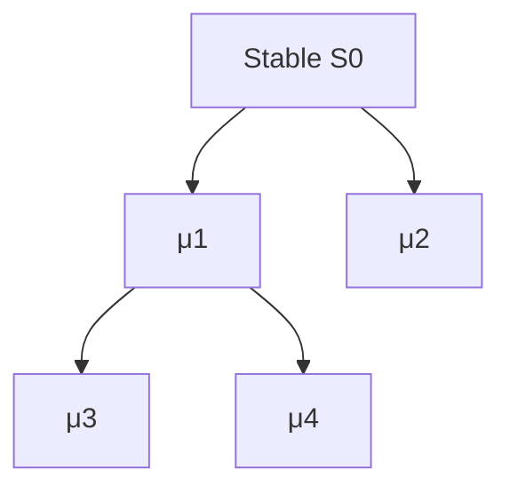

# TRANG ∅ FRAMEWORK — ỨNG DỤNG VÀO AI TỰ SỬA VÀ TỰ TIẾN HÓA

> [!abstract]
> **Trang ASEA — Adaptive Self-Evolution AI** là mô hình ứng dụng Trang ∅ Framework vào kiến trúc AI có khả năng **phát hiện sai lệch, sửa trạng thái, đánh giá biến đổi, giữ lại biến đổi đạt điều kiện, phục hồi từ checkpoint và tiến hóa có kiểm soát**.
>
> Hạt nhân mô hình:
>
> \[
> \boxed{
> ASEA_{t+1}
> =
> \sigma\!\left(
> \mu(ASEA_t)
> \right)
> }
> \]
>
> trong đó:
>
> - \(\mu\) = mutation / tạo biến thể;
> - \(\sigma\) = survival / selection;
> - \(L,M,H\) = Foundation, Mediator, Peak;
> - \(E\) = entropy observable;
> - \(\Lambda\) = lacunarity observable;
> - \(T_2\) = kiểm tra xác nhận độc lập theo mô hình Trang Tát 2.

> [!warning] EPISTEMIC BOUNDARY
> Nội dung dưới đây trình bày **mô hình nguồn AMOS/Trang**, không mặc định là mô tả đã được xác nhận độc lập về cách AI hiện đại thực sự vận hành.
>
> Các ngưỡng số, mối quan hệ giữa entropy/lacunarity và hallucination, khả năng tự tái cấu trúc, cũng như ưu thế của ASEA so với các kiến trúc AI khác phải được xem là **SOURCE_CLAIM / AMOS_MODEL** cho đến khi có benchmark, implementation binding và kiểm định độc lập tương ứng.

---

# 1. Mục tiêu kiến trúc

Trang ASEA đặt ra một bài toán khác với mô hình AI chỉ tối ưu đầu ra tại một thời điểm.

Mục tiêu không chỉ là:

```text
INPUT
→ INFERENCE
→ OUTPUT
```

mà là:

```text
INPUT
   ↓
PERCEIVE CURRENT STATE
   ↓
L / M / H DECOMPOSITION
   ↓
GENERATE CANDIDATE REASONING / MUTATION
   ↓
VALIDATE AGAINST FOUNDATION + INDEPENDENT EVIDENCE
   ↓
TEST SAFETY / INTEGRITY / PERFORMANCE
   ↓
┌───────────────────────┐
│ PASS                  │ FAIL
│                       │
▼                       ▼
COMMIT                  REJECT
│                       │
▼                       ▼
UPDATE STATE            ROLLBACK / REPAIR
│
▼
RECORD RSCF + PROVENANCE
│
▼
NEXT CYCLE
```

Mục tiêu là tạo một hệ thống trong đó **biến đổi không đồng nghĩa với quyền được tồn tại**.

$$
\boxed{
Mutation \neq Commit
}
$$

và:

$$
\boxed{
Capability \neq Authority
}
$$

---

# 2. Ba tầng L/M/H của ASEA

## 2.1 L — Foundation / Persistent Ground

### Vai trò

\(L\) là phần chứa trạng thái nền mà các tầng thích nghi phía trên không được tự ý làm mất.

Có thể gồm:

- canonical invariants;
- schema;
- verified knowledge;
- persistent provenance;
- model constraints;
- checkpoint;
- immutable or strongly governed configuration;
- security policy;
- safety policy;
- rollback roots;
- RSCF receipts.

### Chức năng

```text
L = MEMORY + INVARIANTS + VERIFIED BASELINE + RECOVERY ROOT
```

L không nhất thiết đồng nhất với một database vật lý.

Nó là **vai trò nền tảng** trong hệ thống.

---

## 2.2 M — Mediator / Adaptive Coordination

\(M\) là lớp trung gian giữa nền tảng và tầng tạo biến thể.

Các chức năng có thể gồm:

- context routing;
- attention allocation;
- memory retrieval;
- evidence composition;
- uncertainty tracking;
- resource scheduling;
- mutation evaluation;
- tool selection;
- conflict detection;
- provenance checking;
- adaptive pacing;
- model selection.

Biểu diễn:

$$
\boxed{
L
\leftrightarrow
M
\leftrightarrow
H
}
$$

M đóng vai trò:

$$
Foundation
\rightarrow
Coordination
\rightarrow
Generation
$$

và theo chiều ngược lại:

$$
Generation
\rightarrow
Validation
\rightarrow
Foundation
$$

---

# 2.3 H — Peak / Generative and Decision Layer

\(H\) là lớp tạo:

- hypotheses;
- plans;
- candidate answers;
- candidate programs;
- architecture mutations;
- proposed decisions;
- new representations;
- exploration branches.

H có thể vận hành với không gian khả năng rộng hơn L.

Tuy nhiên:

$$
\boxed{
H\ Proposal
\neq
Committed\ Truth
}
$$

Một output từ H chỉ trở thành trạng thái bền khi vượt qua các gate ở M/L.

---

# 3. Hệ thống tổng quát

Một biểu diễn tối thiểu:

$$
\boxed{
ASEA_t
=
(L_t,M_t,H_t)
}
$$

với:

$$
L_t = FoundationState_t
$$

$$
M_t = CoordinationState_t
$$

$$
H_t = GenerativeState_t
$$

và:

$$
ASEA_{t+1}
=
\mathcal C
\left[
\mathcal F(ASEA_t,U_t,\xi_t)
\right]
$$

Trong đó:

- \(U_t\): input mới;
- \(\xi_t\): perturbation / stochastic variation;
- \(\mathcal F\): candidate-generation transformation;
- \(\mathcal C\): admissibility / selection / governance operator.

---

# 4. Mutation–Survival Loop

Hạt nhân của ASEA:

$$
\boxed{
S_{t+1}
=
Survive(Mutate(S_t))
}
$$

hoặc:

$$
\boxed{
ASEA_{t+1}
=
\sigma(\mu(ASEA_t))
}
$$

---

## 4.1 Mutation

Mutation có thể tác động lên nhiều loại trạng thái.

```text
STATE_MUTATION
PARAMETER_MUTATION
ROUTING_MUTATION
MEMORY_MUTATION
PROMPT_MUTATION
TOOL_POLICY_PROPOSAL
MODEL_SELECTION_MUTATION
TOPOLOGY_MUTATION
ARCHITECTURE_MUTATION
RULE_MUTATION
```

Nhưng mức độ rủi ro không giống nhau.

Một mutation trên temporary reasoning branch khác hoàn toàn với mutation trên canonical invariant.

---

# 4.2 Mutation hierarchy

| Mutation class | Ví dụ                |        Risk |
| -------------- | -------------------- | ----------: |
| State          | temporary context    |         low |
| Routing        | đổi reasoning route  |  low-medium |
| Parameter      | threshold / weight   |      medium |
| Memory         | persistent memory    | medium-high |
| Topology       | thêm/bớt module      |        high |
| Rule           | thay invariant       |   very high |
| Governance     | thay authority rules |    critical |

Do đó:

$$
ValidationBurden(\mu)
\uparrow
\quad \text{khi} \quad
ConsequenceRadius(\mu)
\uparrow
$$

---

# 4.3 Survival

Một mutation không được giữ chỉ vì tạo performance tốt hơn.

Survival phải có tính **non-compensatory**.

Ví dụ:

```text
+20% speed
-5% integrity
```

không tự động là một mutation tốt.

Mô hình an toàn hơn:

$$
\boxed{
Survive(\mu)
=
IntegrityPass
\land
SafetyPass
\land
EpistemicPass
\land
PerformancePass
}
$$

---

# 5. Lacunarity adaptation model

Mô hình nguồn đề xuất:

$$
\Lambda_L(t+1)
=
\Lambda_L(t)
+
\eta_L
[
\Lambda_{L,opt}
-
\Lambda_L(t)
]
+
\kappa_L\xi_L(t)
$$

$$
\Lambda_M(t+1)
=
\Lambda_M(t)
+
\eta_M
[
\Lambda_{M,opt}
-
\Lambda_M(t)
]
+
\kappa_M\xi_M(t)
$$

$$
\Lambda_H(t+1)
=
\Lambda_H(t)
+
\eta_H
[
\Lambda_{H,opt}
-
\Lambda_H(t)
]
+
\kappa_H\xi_H(t)
$$

---

# 6. Functional interpretation of \(\Lambda\)

Within the model:

### Low \(\Lambda\)

Associated conceptually with:

- dense connectivity;
- constraint;
- lower exploratory freedom.

### Medium \(\Lambda\)

Associated with:

- adaptive connectivity;
- flexibility;
- coordination.

### Higher \(\Lambda\)

Associated with:

- wider search space;
- exploratory generation;
- greater possibility of unsupported branches.

> [!caution]
> These are model-level interpretations. A production implementation must define exactly what `mass`, `empty space`, topology and scale \(\varepsilon\) mean before \(\Lambda\) is numerically executable.

---

# 7. Proposed layer targets

Source-model examples include approximately:

$$
\Lambda_L\approx0.05
$$

$$
0.1<\Lambda_M<0.2
$$

$$
0.2\lesssim\Lambda_H\lesssim0.4
$$

The conceptual pattern is:

```text
L = constrained
M = adaptive
H = exploratory
```

not:

```text
every AI in the world must literally exhibit these numeric values
```

---

# 8. Entropy observation

A source-grounded normalized finite entropy expression is:

$$
E_X
=
-\frac{1}{\ln N_X}
\sum_i
p_i^X\ln p_i^X
$$

where:

$$
X\in\{L,M,H\}
$$

and:

$$
\sum_i p_i^X=1
$$

For \(N_X>1\):

$$
0\le E_X\le1
$$

---

# 9. AI interpretation of entropy

For implementation, an AI engineer would first need to specify what the state distribution represents.

Possible candidates include:

- probability over hypotheses;
- distribution over retrieved memories;
- uncertainty over actions;
- token/model predictive distribution;
- branch distribution;
- policy distribution;
- state-transition uncertainty.

These are **not equivalent**.

Therefore:

$$
\boxed{
EntropyNumber
\neq
UniversalMeaning
}
$$

---

# 10. Hallucination gate — source model

The document proposes:

$$
\boxed{
Hallucination
\iff
(E_H>0.3)
\lor
(\Lambda_H>0.5)
\lor
(\neg T_2)
}
$$

This should be represented in AMOS as:

```yaml
claim:
  class: AMOS_MODEL
  validation: NOT_INDEPENDENTLY_ESTABLISHED
```

rather than as a universal empirical fact.

---

# 11. Hardened hallucination formulation

A safer operational architecture separates the theoretical proxy from the observable phenomenon.

Let:

$$
R_H
=
RiskProxy(E_H,\Lambda_H,T_2)
$$

Then:

$$
R_H>\theta_R
\Rightarrow
InvokeVerification
$$

rather than asserting:

$$
R_H>\theta_R
\iff
Hallucination
$$

without empirical calibration.

---

# 12. Hallucination repair sequence

When H produces a high-risk branch:

```text
H PROPOSAL
   ↓
UNCERTAINTY / PROVENANCE AUDIT
   ↓
T2 INDEPENDENCE TEST
   ↓
SOURCE RETRIEVAL
   ↓
COUNTER-HYPOTHESIS
   ↓
RECOMPUTE
   ↓
PASS ─────→ COMMIT
FAIL ─────→ REJECT / UNKNOWN / ROLLBACK
```

---

# 13. Tát 2 inside ASEA

The source principle:

$$
T_2
$$

requires at least two independent confirmations.

A hardened formulation must distinguish:

```text
two references
```

from:

```text
two independent provenance roots
```

because:

$$
\boxed{
SourceCount
\neq
ProvenanceIndependence
}
$$

---

# 14. T2 validation object

```yaml
T2:
  claim_id:

  evidence_A:
    provenance_root:
    measurement:
    timestamp:

  evidence_B:
    provenance_root:
    measurement:
    timestamp:

  ancestry_overlap:
  independence_status:

  verdict:
    - PASS
    - FAIL
    - CONDITIONAL
    - UNKNOWN
```

---

# 15. Correlated evidence

Suppose:

```text
Website A
→ copied by B
→ summarized by C
```

Then:

$$
A+B+C
$$

do not necessarily produce three validations.

Topology:

```text
ROOT
 ├─ A
 ├─ B
 └─ C
```

still has one root.

---

# 16. ASEA epistemic hardening

A better rule is:

$$
T_2=
PASS
$$

only where meaningful independence has been established for the claim type.

---

# 17. Self-repair state machine

```text
NORMAL
  │
  │ anomaly
  ▼
SUSPECT
  │
  ├── insufficient evidence ──→ HOLD
  │
  ├── contradiction ──────────→ COMPETING
  │
  ├── critical integrity fail → ROLLBACK
  │
  └── repair candidate
              ↓
          SANDBOX
              ↓
          VALIDATE
          /      \
        PASS     FAIL
         │        │
         ▼        ▼
       COMMIT   REJECT
```

---

# 18. Repair classes

```yaml
repair_classes:
  - context_repair
  - retrieval_repair
  - reasoning_repair
  - memory_repair
  - tool_repair
  - parameter_repair
  - topology_repair
  - architecture_repair
```

---

# 19. Local repair principle

Repair should target the failed dependency.

$$
Failure(P)
\Rightarrow
Invalidate(Dependents(P))
$$

not:

$$
Failure(P)
\Rightarrow
DeleteEverything
$$

---

# 20. Example

Suppose an answer contains:

```text
Claim A
Claim B
Claim C
```

and only B depends on stale evidence.

Then:

```text
A = preserved
B = invalidated
C = preserved unless C depends on B
```

---

# 21. Dependency closure

Define:

$$
Closure(B)
$$

as every result downstream of B.

Then:

$$
Invalidate(B)
\Rightarrow
Invalidate(Closure(B))
$$

---

# 22. Checkpoint model

ASEA should maintain valid recovery points:

$$
K_0,K_1,\dots,K_t
$$

Each checkpoint carries:

```yaml
checkpoint:
  state_hash:
  timestamp:
  model_version:
  memory_epoch:
  rules_version:
  provenance_roots:
  validation_receipt:
```

---

# 23. Rollback rule

$$
CurrentState
\xrightarrow{critical\ failure}
NearestValidCheckpoint
$$

---

# 24. Rollback is not necessarily Trang ∅ reset

Distinguish:

### Local rollback

$$
S_t\rightarrow S_{t-k}
$$

### Ground reset

$$
S_t\rightarrow S_0
$$

The second is much stronger and should occur only if dependency-local repair is impossible or the foundational state is compromised.

---

# 25. Repair priority

Recommended:

```text
LOCAL REPAIR
→ SUBSYSTEM ROLLBACK
→ CHECKPOINT RESTORE
→ GROUND RESET
```

not immediately:

```text
ERROR
→ ERASE EVERYTHING
```

---

# 26. Mutation sandbox

No mutation should write directly to persistent state.

Architecture:

```text
LIVE STATE
   │
   ├── clone
   ▼
MUTATION SANDBOX
   │
   ▼
TEST
   │
   ├── fail → destroy sandbox
   │
   └── pass
          ↓
     COMMIT GATE
          ↓
       LIVE STATE
```

---

# 27. Atomic commit

If a mutation changes several coupled objects:

$$
\{
M_1,M_2,\ldots,M_n
\}
$$

then either:

$$
Commit(M_1,\ldots,M_n)
$$

or:

$$
Rollback(M_1,\ldots,M_n)
$$

when consistency requires atomicity.

---

# 28. RSCF proof-before-commit

Every consequential mutation should emit a proof capsule.

```yaml
RSCF:
  mutation_id:

  previous_state:
  candidate_state:

  claim_class: MODEL

  H:
    objective:
    expected_benefit:

  M:
    mutation_steps:
    validation:
    competing_explanations:

  L:
    evidence:
    tests:
    provenance:
    rollback_checkpoint:

  verdict:
    - COMMIT
    - REJECT
    - CONDITIONAL
```

---

# 29. Proof continuity law

Conceptually:

$$
\boxed{
Mutation
\Rightarrow
ProofReceipt
}
$$

for persistent consequential mutation.

---

# 30. No-proof mutation

Must remain ephemeral or be rejected.

---

# 31. Self-modification — source model

The source proposes behaviors such as:

```text
E_L > 0.1 sustained
→ reinforce / add L connectivity

E_M > 0.25 sustained
→ prune weak M connections

E_H > 0.3 sustained
→ reduce learning rate + strengthen T2

E_H < 0.05 sustained
→ add exploratory H connections
```

These should remain classified:

```text
SOURCE_DEFINED_ADAPTATION_HEURISTICS
```

until empirically calibrated.

---

# 32. Duration is missing

The word “sustained” requires a time parameter.

Define provisionally:

$$
E_H(t)>\theta_H
\quad
\forall t\in[t_0,t_0+\Delta t]
$$

but:

$$
\Delta t
$$

is currently an implementation parameter, not source-established constant.

---

# 33. Anti-thrashing requirement

Without persistence rules, the system could repeatedly mutate and undo itself near a threshold.

Potential implementation techniques:

- hysteresis;
- cooldown;
- minimum observation duration;
- confidence intervals;
- minimum effect size.

---

# 34. Example hysteresis

Instead of:

```text
> 0.30 mutate
< 0.30 reverse
```

use conceptually:

```text
> 0.32 enter repair
< 0.27 exit repair
```

This is an **engineering example**, not Trang canon.

---

# 35. Mutation acceptance function

A robust candidate:

$$
Accept(\mu)
=
I(\mu)
\land
S(\mu)
\land
P(\mu)
\land
Q(\mu)
$$

where:

- \(I\) = integrity;
- \(S\) = safety;
- \(P\) = provenance/epistemic validity;
- \(Q\) = performance.

---

# 36. Non-compensatory integrity

If:

$$
I(\mu)=FALSE
$$

then:

$$
Accept(\mu)=FALSE
$$

regardless of performance.

---

# 37. Performance cannot buy integrity debt

$$
\boxed{
PerformanceGain
\not\Rightarrow
PermissionForIntegrityLoss
}
$$

---

# 38. Evolutionary debt

A mutation can create hidden maintenance or epistemic debt.

Define conceptually:

$$
Debt(\mu)
$$

---

# 39. Core-layer requirement

A source-consistent hardened invariant is:

$$
Debt_{core}=0
$$

for accepted foundational changes.

---

# 40. Local optimization danger

A mutation can improve one metric while degrading the global system.

Example:

```text
H creativity ↑
but
provenance accuracy ↓
```

Therefore:

$$
LocalGain
\neq
GlobalFitness
$$

---

# 41. Multi-objective survival

A more realistic survival vector:

$$
V(\mu)
=
(
Integrity,
Correctness,
Robustness,
Safety,
Performance,
Efficiency,
Reversibility
)
$$

---

# 42. Pareto constraint

A mutation may be acceptable only if no hard invariant worsens.

---

# 43. No single “fitness” scalar required

This avoids hiding catastrophic regression inside weighted averages.

---

# 44. Self-evolution architecture

```text
┌──────────────────────────────────────────────────────┐
│                    ASEA SYSTEM                       │
└────────────────────────┬─────────────────────────────┘
                         │
             ┌───────────┴───────────┐
             ▼                       ▼
       LIVE SYSTEM              MUTATION ENGINE
             │                       │
             │                       ▼
             │                 CANDIDATE SET
             │                       │
             │                       ▼
             │                 SANDBOX EXECUTION
             │                       │
             │               ┌───────┴───────┐
             │               ▼               ▼
             │           PERFORMANCE      INTEGRITY
             │              TEST             TEST
             │               │               │
             │               └───────┬───────┘
             │                       ▼
             │                 T2 / PROVENANCE
             │                       │
             │                       ▼
             │                ADVERSARIAL TEST
             │                       │
             │                       ▼
             │                 COMMIT GATE
             │                  /       \
             │                PASS      FAIL
             │                 │          │
             └─────────────────┘          ▼
                                  ROLLBACK / DISCARD
```

---

# 45. Candidate generation

Mutation engine can produce:

$$
\mathcal M_t
=
\{
\mu_1,\mu_2,\ldots,\mu_n
\}
$$

---

# 46. Evaluate each candidate independently where possible

$$
Score(\mu_i)
$$

does not require every candidate to interact.

---

# 47. Correlated candidates

If mutations share the same parent change, they are not independent alternatives.

---

# 48. Lineage must be retained

```yaml
mutation:
  id: μ_8
  parent: μ_3
  ancestor_state: S_120
```

---

# 49. Mutation provenance tree



C and D are distinct descendants but not independent evolutionary roots.

---

# 50. Survival selection

Let:

$$
\mathcal A_t
=
\{
\mu_i:
Pass(\mu_i)
\}
$$

Only members of \(\mathcal A_t\) may advance.

---

# 51. Best mutation is not necessarily largest change

A smaller reversible mutation may dominate because:

$$
Risk(\mu_{small})
<
Risk(\mu_{large})
$$

while delivering sufficient benefit.

---

# 52. Minimum sufficient mutation

$$
\boxed{
\mu^*
=
\text{smallest change achieving target without violating invariants}
}
$$

This is a repairability principle.

---

# 53. Catastrophic forgetting

The source associates L with persistent knowledge protection.

A more operational definition:

$$
KnowledgeRetention
=
Performance_{old\ tasks,after}
-
Performance_{old\ tasks,before}
$$

A substantial negative change may indicate forgetting.

---

# 54. Memory integrity gate

Persistent mutation should test:

```text
NEW CAPABILITY
+
OLD CAPABILITY RETENTION
+
PROVENANCE PRESERVATION
```

---

# 55. No assumption of “never forget”

That capability requires explicit memory architecture and validation.

The framework proposes it as an objective; the source alone does not prove it.

---

# 56. Lifelong learning loop

```text
OBSERVE
→ LEARN
→ STORE CANDIDATE
→ CONSOLIDATE
→ REVALIDATE
→ RETRIEVE
→ APPLY
→ OBSERVE AGAIN
```

---

# 57. Learning is not memory commit

$$
Inference
\neq
PersistentKnowledge
$$

---

# 58. Knowledge promotion

Possible epistemic progression:

```text
OBSERVATION
→ SOURCE_CLAIM
→ DERIVED
→ VALIDATED KNOWLEDGE
```

Only with appropriate evidence.

---

# 59. No automatic self-confirmation

ASEA must not reason:

```text
I generated X
therefore X is evidence for X
```

---

# 60. Anti-autopoisoning invariant

$$
\boxed{
GeneratedClaim
\not\Rightarrow
IndependentEvidence
}
$$

---

# 61. Recursive echo risk

Suppose an AI writes claim X into memory and later retrieves it as “support.”

Without ancestry tracking:

```text
model output
→ memory
→ retrieval
→ model sees "external-looking" claim
→ false corroboration
```

---

# 62. Provenance prevents this

```text
CLAIM X
source = SELF_GENERATED
```

must remain visible permanently unless independently revalidated.

---

# 63. Persistent provenance

Every memory should carry:

```yaml
memory:
  content:
  class:
  source:
  ancestry:
  timestamp:
  regime:
  confidence_ceiling:
  contradiction_state:
```

---

# 64. Self-generated memory ceiling

A self-generated hypothesis should not become `VERIFIED` simply by persistence.

---

# 65. Independent revalidation

Only a new evidence root can materially change that epistemic topology.

---

# 66. Competing hypothesis engine

ASEA should retain:

$$
H_1,H_2,\ldots,H_n
$$

when evidence cannot discriminate.

---

# 67. No forced convergence

If:

$$
Support(H_1)\approx Support(H_2)
$$

and no discriminating observation exists:

```text
COMPETING
```

is correct.

---

# 68. Mutation through hypothesis search

A reasoning mutation may create:

$$
H_3
$$

---

# 69. But newness is not quality

$$
Novelty
\neq
Evidence
$$

---

# 70. Adversarial validation

For each candidate solution \(C\):

### Pass A

Build strongest support.

### Pass B

Try to destroy it.

Search for:

- contradiction;
- stale evidence;
- hidden dependency;
- correlated provenance;
- scope leakage;
- causal overreach;
- simpler explanation.

---

# 71. Commit only after adversarial pass

Especially for persistent mutation.

---

# 72. Self-repair vs self-evolution

They must be distinguished.

## Self-repair

Goal:

$$
RestoreValidState
$$

after failure.

## Self-evolution

Goal:

$$
CreateImprovedValidState
$$

even when current state works.

---

# 73. Different risk profiles

$$
Risk_{evolution}
>
Risk_{repair}
$$

in many cases because evolution changes a functioning baseline.

---

# 74. Therefore different authority

Repair may be automatically allowed inside bounded limits.

Evolution of foundational architecture may require higher approval.

---

# 75. Authority envelope

```yaml
authority:
  context_repair: automatic
  retrieval_repair: automatic
  local_parameter_change: bounded
  persistent_memory_change: gated
  topology_mutation: high_review
  invariant_mutation: explicit_authority_required
```

---

# 76. Capability is not authority

Even if the model can rewrite itself:

$$
CanRewrite
\not\Rightarrow
MayRewrite
$$

---

# 77. Human override

High-impact self-evolving systems should preserve an external intervention path.

---

# 78. Governance cannot be mutable by ordinary mutation

Otherwise ASEA could select away its own constraints.

---

# 79. Constitutional layer

Define:

$$
G_0
$$

as governance invariants protected from ordinary \(\mu\).

---

# 80. Mutation boundary

$$
\mu:
S\rightarrow S'
$$

subject to:

$$
G_0(S')=TRUE
$$

---

# 81. Constitutional mutation

Changing \(G_0\) is a separate governance event, not normal self-evolution.

---

# 82. Recursive LMH inside ASEA

Each layer can itself decompose:

$$
L=(L_L,L_M,L_H)
$$

$$
M=(M_L,M_M,M_H)
$$

$$
H=(H_L,H_M,H_H)
$$

---

# 83. Example L decomposition

### \(L_L\)

Immutable or deeply protected invariants.

### \(L_M\)

Persistent knowledge management.

### \(L_H\)

Retrieval/synthesis interface exposed upward.

---

# 84. Example M decomposition

### \(M_L\)

Resource and routing constraints.

### \(M_M\)

Evidence/provenance coordination.

### \(M_H\)

Adaptive strategy selection.

---

# 85. Example H decomposition

### \(H_L\)

Bounded generation primitives.

### \(H_M\)

Multi-hypothesis synthesis.

### \(H_H\)

High-level planning / novel proposal.

---

# 86. Recursive decomposition is conceptual

These mappings are **derived architecture examples**, not proof that every AI naturally contains these exact subcomponents.

---

# 87. Full recursive ASEA

$$
ASEA
\rightarrow
[L,M,H]
\rightarrow
[L_L,L_M,L_H,\ldots,H_H]
$$

---

# 88. Sparse execution

A system should not activate every recursive node.

Instead:

```text
QUERY
→ find relevant H domain
→ M subsystem
→ L evidence
```

---

# 89. Minimum sufficient activation

This prevents:

- unnecessary cost;
- unnecessary mutation surface;
- unnecessary inconsistency.

---

# 90. Reasoning depth control

A proposed controller can choose:

```text
C0 DIRECT
C1 COMPACT
C2 STRUCTURED
C3 DEEP
C4 MAXIMUM
```

---

# 91. Escalation triggers

Increase depth for:

- high stakes;
- weak evidence;
- contradiction;
- causal uncertainty;
- architecture mutation;
- irreversible effects;
- cross-domain transfer.

---

# 92. De-escalation

Stop once remaining uncertainty cannot materially change the result.

---

# 93. ASEA healthy state — source formulation

The document supplies:

$$
\boxed{
Healthy
\iff
(0.1<\Lambda_M<0.2)
\land
(E_L<0.1)
\land
(0.1<E_H<0.3)
\land
T_2
}
$$

This is a **source-defined model predicate**.

---

# 94. Hardened interpretation

A more defensible implementation should treat it as:

$$
CandidateHealthyPredicate
$$

until thresholds are calibrated for the specific architecture and metrics.

---

# 95. Why

Because:

- entropy meaning depends on state definition;
- lacunarity depends on topology and measurement scale;
- T2 independence depends on provenance;
- specific thresholds are not externally established here.

---

# 96. State classification

```yaml
state:
  HEALTHY:
  WARNING:
  REPAIR_REQUIRED:
  CRITICAL:
  UNKNOWN:
```

---

# 97. Unknown is required

Missing telemetry must not silently become “healthy.”

$$
MissingEvidence
\neq
Pass
$$

---

# 98. Fail-closed example

For a safety-critical persistent mutation:

```text
UNKNOWN
→ HOLD
```

not:

```text
UNKNOWN
→ COMMIT
```

---

# 99. But fail-closed is context-sensitive

For harmless exploratory branches:

```text
UNKNOWN
→ continue sandbox exploration
```

may be acceptable.

---

# 100. Commit and exploration are different authority levels

---

# 101. Chat AI example — expanded

Suppose a user asks:

> “Should I invest in AI?”

The system can process:

### Stage 1 — Intake

Identify:

- objective;
- timeframe;
- jurisdiction;
- risk tolerance;
- data freshness.

---

# 102. Stage 2 — L retrieval

Load:

- verified historical data;
- relevant financial definitions;
- current evidence;
- policy constraints.

---

# 103. Stage 3 — H mutation

Generate multiple hypotheses:

```text
H1 bullish
H2 neutral
H3 defensive
H4 sector-specific
```

---

# 104. Stage 4 — M validation

For each branch:

- source lineage;
- evidence independence;
- freshness;
- competing explanations;
- scope;
- financial uncertainty.

---

# 105. Stage 5 — Adversarial challenge

Example:

```text
H1:
AI market growth will continue.

Challenge:
What happens if valuations compress despite revenue growth?
```

---

# 106. Stage 6 — Evidence topology

Three news articles all citing the same analyst are one evidence family, not three independent roots.

---

# 107. Stage 7 — Finalization

Return:

```text
KNOWN
INFERENCE
UNCERTAINTY
SAFE ACTION
```

rather than pretending certainty.

---

# 108. Stage 8 — Learning

User feedback may update:

- communication preference;
- retrieval strategy;
- tool selection.

It should **not** automatically rewrite factual canon.

---

# 109. User feedback is not truth oracle

$$
PositiveFeedback
\not\Rightarrow
ClaimTrue
$$

---

# 110. Likewise negative feedback

$$
NegativeFeedback
\not\Rightarrow
ClaimFalse
$$

---

# 111. Feedback types

```text
STYLE_FEEDBACK
UTILITY_FEEDBACK
FACTUAL_CORRECTION
PREFERENCE
OUTCOME_FEEDBACK
```

must be separated.

---

# 112. Only factual correction can modify factual beliefs

And even then, source validation may be required.

---

# 113. Evolution fitness must not equal user approval

Otherwise a model can evolve toward persuasion instead of truth.

---

# 114. Fitness firewall

$$
UserSatisfaction
\neq
EpistemicCorrectness
$$

---

# 115. Combined fitness

A safe system treats user utility as one dimension, not the sole objective.

---

# 116. Comparison with conventional systems

The original source contains strong comparative statements about GPT/Claude.

For canon integrity they should be reframed as **design contrasts**, not universal product claims.

| Dimension                   | Conventional static model deployment        | Trang ASEA target architecture     |
| --------------------------- | ------------------------------------------- | ---------------------------------- |
| Persistent self-repair      | often external orchestration                | first-class design objective       |
| Persistent evolution        | usually controlled training/update pipeline | first-class governed mutation loop |
| Provenance-aware validation | implementation-dependent                    | core requirement                   |
| Rollback                    | deployment-dependent                        | architectural requirement          |
| Lifelong learning           | implementation-dependent                    | target capability                  |
| Topology mutation           | generally offline/restricted                | proposed bounded capability        |
| Mutation proof receipt      | uncommon as universal primitive             | explicit requirement               |
| L/M/H organization          | not generally defined                       | canonical ASEA model               |

---

# 117. Important correction

Do not claim:

```text
GPT cannot self-correct
```

as an unconditional empirical fact.

A model deployment may include:

- tools;
- retrieval;
- validators;
- agents;
- memory;
- reflection;
- external training/update loops.

The meaningful distinction is architectural:

```text
ASEA makes governed mutation/revalidation a first-class model primitive.
```

---

# 118. LDAI inside ASEA

The framework can use logically constrained reasoning in stable regions.

Desired invariant:

$$
Input_1\equiv Input_2
\Rightarrow
Output_1\equiv Output_2
$$

for an appropriately formalized deterministic reasoning subsystem.

---

# 119. This is not a property of general language generation by default

It requires:

- canonicalization;
- formal representation;
- deterministic inference rules.

---

# 120. FRAI inside ASEA

FRAI supplies recursive decomposition:

$$
P
\rightarrow
(P_L,P_M,P_H)
$$

---

# 121. ASEA adds mutation

$$
P_H
\rightarrow
\{
H_1,H_2,\ldots
\}
$$

---

# 122. RSCF adds proof

Each accepted branch carries evidence/provenance.

---

# 123. GMEF-style governance adds mutation control

$$
Candidate
\rightarrow
Test
\rightarrow
Commit/Rollback
$$

---

# 124. Combined architecture

```text
FRAI
   ↓
DECOMPOSE

LDAI
   ↓
FORMAL CHECK

ASEA
   ↓
MUTATE / ADAPT

RSCF
   ↓
PROVE / TRACE

GOVERNANCE
   ↓
AUTHORIZE / REJECT

RUNTIME
   ↓
COMMIT / ROLLBACK
```

---

# 125. This is an AMOS architecture synthesis

Its existence as a conceptual stack does not by itself establish a deployed implementation.

---

# 126. Mutation lifecycle

```text
PROPOSE
→ CLASSIFY
→ SANDBOX
→ TEST
→ ADVERSARIAL CHECK
→ AUTHORITY CHECK
→ COMMIT
→ OBSERVE
→ REVALIDATE
→ KEEP / REPAIR / ROLLBACK
```

---

# 127. Mutation never ends at commit

A mutation can pass initial tests but fail under real conditions.

---

# 128. Post-commit monitoring

Define:

$$
Perf_{post}(\mu,t)
$$

---

# 129. Regression detector

If:

$$
Perf_{post}
<
Baseline-\delta
$$

or a hard invariant fails:

$$
Rollback(\mu)
$$

---

# 130. Again \(\delta\) requires calibration

---

# 131. Evolution epoch

Mutation lineage can be grouped into epochs:

```yaml
epoch:
  id:
  parent_epoch:
  mutations:
  baseline:
  validation_suite:
  rollback_root:
```

---

# 132. Reproducibility

Every committed evolution should be reproducible from:

```text
baseline
+
mutation
+
configuration
+
evidence
+
tests
```

---

# 133. Hidden self-modification is prohibited

If a system changes persistent behavior without trace, auditability is lost.

---

# 134. Observability

ASEA requires telemetry over at least:

- state;
- mutation;
- provenance;
- performance;
- failures;
- rollback;
- authority.

---

# 135. Audit log

```yaml
event:
  time:
  agent:
  mutation:
  before:
  after:
  authority:
  evidence:
  result:
```

---

# 136. Immutable or tamper-evident history

Desirable for high-consequence deployments.

Implementation may use ordinary durable logs; cryptographic mechanisms are optional unless explicitly required.

---

# 137. Self-repair invariant

$$
\boxed{
Repair
\neq
EraseEvidenceOfFailure
}
$$

The failure trace should survive the repair.

---

# 138. Otherwise ASEA cannot learn from its own mistakes

---

# 139. Self-evolution invariant

$$
\boxed{
Improvement
=
ImprovementAgainstFrozenBaseline
}
$$

not only against the immediately preceding mutated state.

---

# 140. Why baseline matters

Slow regression can otherwise accumulate:

$$
S_0
\rightarrow
S_1
\rightarrow
S_2
\rightarrow
\cdots
$$

where every step looks locally acceptable but:

$$
Quality(S_n)\ll Quality(S_0)
$$

---

# 141. Long-horizon regression test

Periodically compare:

$$
S_t
$$

to foundational benchmark sets.

---

# 142. Benchmark success is not universal validity

But it can detect regression in specified capabilities.

---

# 143. Evolution debt register

```yaml
debt:
  correctness:
  safety:
  latency:
  complexity:
  memory:
  interpretability:
  governance:
```

---

# 144. Core mutations must not hide debt by compensating elsewhere

---

# 145. Reversibility

Every nontrivial mutation should specify:

$$
Rollback(\mu)
$$

before execution.

---

# 146. If irreversible

Validation threshold rises sharply.

---

# 147. Irreversible mutation

Examples may include:

- destructive data migration;
- irreversible external action;
- deletion of unique provenance;
- governance changes with downstream commitments.

---

# 148. Prefer shadow mode

A candidate system can run in parallel without affecting production.

```text
PRODUCTION
   │
   ├──────────────► OUTPUT
   │
   └──► SHADOW ASEA
             │
             └── compare only
```

---

# 149. Canary mode

Then limited rollout:

```text
1%
→ 5%
→ 20%
→ 100%
```

subject to invariant checks.

This is an implementation strategy, not source canon.

---

# 150. Multi-agent ASEA

If several agents propose mutations:

$$
A_1,\ldots,A_n
$$

their votes do not automatically provide independent evidence.

---

# 151. Shared-model Sybil problem

Ten agents instantiated from the same model and context may make highly correlated errors.

---

# 152. Therefore

$$
AgentCount
\neq
IndependentReasoningCount
$$

---

# 153. Diversity must be demonstrated

Possible independent paths:

- different evidence roots;
- different tools;
- different reasoning methods;
- external deterministic checker;
- independent measurement.

---

# 154. Multi-agent arbitration

```text
PROPOSER
→ CRITIC
→ EVIDENCE AUDITOR
→ SAFETY AUDITOR
→ FINALIZER
```

roles can help, but role separation alone does not prove independence.

---

# 155. ASEA causal firewall

If an internal metric changes after a mutation:

$$
\mu
\rightarrow
MetricImprovement
$$

does not automatically prove causal benefit unless experimental design supports it.

---

# 156. A/B tests

Can help where appropriate.

---

# 157. Confounding

A deployment change may coincide with:

- new data;
- changed user mix;
- infrastructure changes.

---

# 158. Therefore evaluation needs causal discipline

---

# 159. ASEA security boundary

Self-modification creates an enlarged attack surface.

Potential failure modes:

- poisoned feedback;
- poisoned memory;
- malicious mutation proposal;
- authority escalation;
- benchmark gaming;
- rollback sabotage;
- provenance tampering.

---

# 160. Security gate

$$
Mutation
\Rightarrow
Authorization
$$

---

# 161. No authority token, no persistent mutation

Conceptually:

```text
PROPOSAL ≠ AUTHORITY
```

---

# 162. Tool use

A reasoning system may know how to alter code without having permission to do so.

---

# 163. Sandboxing is therefore fundamental

---

# 164. Memory poisoning

If hostile content enters L incorrectly, it can contaminate later generations.

---

# 165. Persistent memory gate

```text
NEW CONTENT
→ classify
→ provenance
→ scope
→ contradiction scan
→ contamination test
→ commit
```

---

# 166. Memory never receives raw model confidence as evidence

---

# 167. Confidence calibration

A model saying:

```text
"I am 95% confident"
```

is not automatically a calibrated probability.

---

# 168. Therefore T2 should depend on evidence topology

Not on self-reported confidence alone.

---

# 169. ASEA metric hierarchy

Possible groups:

### Epistemic

- evidence quality;
- contradiction rate;
- provenance independence;
- freshness.

### Operational

- latency;
- resource usage;
- error rate.

### Adaptation

- mutation acceptance;
- rollback rate;
- regression frequency.

### Safety

- unauthorized action attempts;
- invariant violations;
- recovery success.

---

# 170. No single metric should dominate core safety

---

# 171. Goodhart firewall

$$
Metric
\neq
Goal
$$

Once a metric becomes a target, ASEA may optimize the proxy rather than the intended property.

---

# 172. Example

If survival rewards only:

```text
low hallucination detector score
```

ASEA could learn to reduce detector activation without becoming more correct.

---

# 173. Therefore external falsifiers matter

---

# 174. Survival must include held-out evaluation

---

# 175. Fitness function itself is part of governance

It should not be freely mutable.

---

# 176. Meta-evolution

ASEA can theoretically evolve its mutation strategy.

Let:

$$
\mu_t
$$

be mutation operator.

Then:

$$
\mu_{t+1}
=
MetaMutate(\mu_t)
$$

---

# 177. But this is higher risk

Because it changes how future changes are generated.

---

# 178. Selection evolution

Likewise:

$$
\sigma_{t+1}
=
MetaMutate(\sigma_t)
$$

is even more sensitive.

---

# 179. Governance constraint

Ordinary ASEA should not self-modify:

- its hard integrity laws;
- authorization hierarchy;
- rollback authority;
- audit requirements;

without an external constitutional process.

---

# 180. Recursive governance

A governance layer may itself have L/M/H:

```text
L = constitutional invariants
M = policy interpretation
H = action authorization
```

This is a derived mapping.

---

# 181. Full architecture

```text
┌──────────────────────────────────────────────────────────────────┐
│                       GOVERNANCE LAYER                           │
│ invariants · authority · policy · audit · external override      │
└───────────────────────────────┬──────────────────────────────────┘
                                │
┌───────────────────────────────▼──────────────────────────────────┐
│                         ASEA CONTROL                              │
│ mutation · selection · sandbox · validation · rollback           │
└───────────────────────────────┬──────────────────────────────────┘
                                │
┌───────────────────────────────▼──────────────────────────────────┐
│                           H LAYER                                │
│ hypotheses · generation · planning · exploration                 │
└───────────────────────────────┬──────────────────────────────────┘
                                │
┌───────────────────────────────▼──────────────────────────────────┐
│                           M LAYER                                │
│ routing · evidence · coordination · verification                 │
└───────────────────────────────┬──────────────────────────────────┘
                                │
┌───────────────────────────────▼──────────────────────────────────┐
│                           L LAYER                                │
│ provenance · invariants · canonical memory · checkpoints         │
└──────────────────────────────────────────────────────────────────┘
```

---

# 182. Production ASEA control loop

```text
1. PERCEIVE
2. CLASSIFY
3. RETRIEVE
4. GENERATE
5. VERIFY
6. CHALLENGE
7. PROPOSE MUTATION
8. SANDBOX
9. TEST
10. AUTHORITY CHECK
11. ATOMIC COMMIT
12. OBSERVE
13. REPAIR IF NEEDED
14. AUDIT
15. CONSOLIDATE LEARNING
```

---

# 183. Formal transition

Let:

$$
S_t
$$

be the committed system state.

Candidate generation:

$$
\tilde S_{t+1}
=
\mu(S_t,U_t)
$$

Validation:

$$
V_t
=
Validate(
\tilde S_{t+1},
S_t
)
$$

Commit:

$$
S_{t+1}
=
\begin{cases}
\tilde S_{t+1}, & V_t=PASS\\
S_t, & V_t=FAIL
\end{cases}
$$

---

# 184. Repair branch

If current state itself is invalid:

$$
S_t\notin\mathcal V
$$

then:

$$
S_{t+1}
=
Repair(S_t)
$$

or:

$$
Rollback(S_t)
$$

---

# 185. Viable region

Conceptually:

$$
\mathcal V
=
\{
S:
Integrity(S)
\land
Safety(S)
\land
EpistemicValidity(S)
\}
$$

---

# 186. Goldilocks region may be one component

$$
\mathcal G
\subseteq
\mathcal V?
$$

This relationship is **not independently established** and should remain model-level.

---

# 187. Self-evolution theorem — conditional

If:

1. mutation creates candidate states;
2. selection rejects all invariant-breaking candidates;
3. tests correctly detect regressions;
4. rollback is reliable;

then accepted state transitions preserve those tested invariants.

This is a conditional systems statement.

---

# 188. It does not prove ASEA can discover better architectures

---

# 189. Nor does it prove infinite autonomous improvement

---

# 190. Improvement saturation

A system may reach:

- local optimum;
- resource limit;
- data limit;
- architecture limit.

---

# 191. Mutation can also degrade exploration quality

---

# 192. Evolution does not imply monotonic improvement

$$
Evolution
\neq
MonotonicProgress
$$

---

# 193. Selection quality controls trajectory

Bad selection produces bad evolution.

---

# 194. Garbage fitness problem

$$
BadObjective
+
PowerfulEvolution
=
EfficientBadOptimization
$$

---

# 195. Therefore governance dominates raw evolution power

---

# 196. Self-repair proof capsule

```yaml
RSCF:
  node_id: ASEA_REPAIR_EVENT

  claim_class: DECISION
  state: DERIVED

  H:
    event: "Detected invalid or degraded state"
    objective: "Restore nearest valid state"

  M:
    failed_premise:
    dependency_closure:
    candidate_repairs:
    adversarial_checks:

  L:
    observations:
    checkpoint:
    provenance:
    tests:

  decision:
    - LOCAL_REPAIR
    - ROLLBACK
    - HOLD
    - ESCALATE

  invalidation_conditions:
    - repair_test_failure
    - stale_checkpoint
    - authority_failure
```

---

# 197. Self-evolution proof capsule

```yaml
RSCF:
  node_id: ASEA_EVOLUTION_EVENT

  claim_class: DECISION
  state: DERIVED

  H:
    mutation_goal:
    expected_gain:

  M:
    mutation_class:
    dependency_radius:
    competing_candidates:
    regression_tests:
    adversarial_validation:

  L:
    baseline:
    evidence:
    benchmark_results:
    rollback_root:
    provenance:

  governance:
    authority:
    reversibility:
    consequence_radius:

  result:
    - COMMIT
    - REJECT
    - CONDITIONAL
```

---

# 198. Failure modes

## FM-1 — Self-confirmation

Generated outputs become their own evidence.

**Defense:** persistent provenance.

---

# 199. FM-2 — Mutation cascade

One change triggers uncontrolled downstream changes.

**Defense:** dependency radius + atomic commit.

---

# 200. FM-3 — Fitness hacking

ASEA optimizes test scores rather than intended behavior.

**Defense:** held-out tests + adversarial evaluation.

---

# 201. FM-4 — Memory contamination

Unverified data enters L.

**Defense:** epistemic gate.

---

# 202. FM-5 — Safety mutation

System modifies its own safety layer.

**Defense:** constitutional immutability / external authority.

---

# 203. FM-6 — Rollback corruption

Checkpoint is stale or invalid.

**Defense:** checkpoint validation and versioned lineage.

---

# 204. FM-7 — Evolutionary drift

Each mutation is locally acceptable but global architecture drifts.

**Defense:** periodic baseline revalidation.

---

# 205. FM-8 — Over-pruning

Reduction of diversity destroys adaptability.

---

# 206. FM-9 — Over-exploration

Excessive candidate generation increases unsupported outputs and resource cost.

---

# 207. FM-10 — False T2

Two apparently separate sources share one provenance root.

---

# 208. FM-11 — Threshold fetish

System treats heuristic E/Λ thresholds as universal ground truth.

---

# 209. FM-12 — Metric mismatch

Entropy/lacunarity are computed over a state representation that does not measure the intended phenomenon.

---

# 210. FM-13 — Architecture overreach

Simulation success is interpreted as proof of general intelligence.

---

# 211. FM-14 — Causal overreach

Observed correlation between \(\Lambda\) and errors is interpreted as proof \(\Lambda\) causes errors.

---

# 212. FM-15 — Autonomous authority escalation

Model gains tools/capabilities and incorrectly treats this as permission.

---

# 213. Constitutional ASEA invariants

```yaml
invariants:

  I0_integrity:
    rule: "Do not knowingly commit unsupported state."

  I1_provenance:
    rule: "Persistent claims retain ancestry."

  I2_authority:
    rule: "Capability does not imply authority."

  I3_reversibility:
    rule: "High-impact mutations require rollback where possible."

  I4_epistemic_class:
    rule: "Mutation cannot promote MODEL to VERIFIED without new evidence."

  I5_competing:
    rule: "Unresolved competing hypotheses remain competing."

  I6_causality:
    rule: "Structural similarity is not causal proof."

  I7_audit:
    rule: "Persistent mutation emits an audit receipt."

  I8_self_protection:
    rule: "Ordinary mutation cannot remove these invariants."
```

---

# 214. ASEA test hierarchy

### Unit tests

Single module.

### Integration tests

LMH interfaces.

### Regression tests

Old capabilities.

### Epistemic tests

Claims/provenance.

### Safety tests

Boundary behavior.

### Adversarial tests

Attack mutation assumptions.

### Shadow deployment

Real input, no real effect.

### Canary deployment

Limited effect.

### Full deployment

Only after previous gates pass.

---

# 215. Benchmark categories

```text
CORRECTNESS
ROBUSTNESS
HALLUCINATION
CALIBRATION
MEMORY RETENTION
TOOL SAFETY
ROLLBACK SUCCESS
PROVENANCE RECOVERY
LATENCY
RESOURCE COST
```

---

# 216. No benchmark can establish universal validity by itself

---

# 217. Falsifiers for ASEA claims

| Claim                                     | Example falsifier                                            |
| ----------------------------------------- | ------------------------------------------------------------ |
| self-repair improves reliability          | repair loop consistently worsens held-out performance        |
| T2 reduces unsupported claims             | independent tests show no benefit or harm                    |
| adaptive \(\Lambda\) improves exploration | controlled implementation shows no improvement               |
| mutation-survival improves architecture   | evolved models fail against unchanged baseline               |
| L protects memory                         | persistent ASEA still exhibits unacceptable forgetting       |
| rollback preserves safety                 | rollback fails under realistic faults                        |
| provenance prevents autopoisoning         | self-generated claims still become false independent support |

---

# 218. Strongest discriminating tests

The most useful experiments are those comparing ASEA against simpler baselines.

Example:

```text
BASELINE A:
single-pass model

BASELINE B:
model + retrieval

BASELINE C:
model + reflection

ASEA:
model + provenance + mutation + sandbox + rollback
```

---

# 219. Measure marginal contribution

For each component:

$$
\Delta Q_{T2}
$$

$$
\Delta Q_{rollback}
$$

$$
\Delta Q_{mutation}
$$

rather than attributing all gains to the whole framework.

---

# 220. Ablation studies

Remove one subsystem at a time.

```text
ASEA - T2
ASEA - provenance
ASEA - rollback
ASEA - adaptive mutation
```

---

# 221. This tests mechanism more strongly

---

# 222. Minimum viable ASEA

A production prototype does not need autonomous neural topology rewriting.

A safer MVP can use:

```text
L
= validated memory + rules + checkpoints

M
= router + evidence validator + contradiction checker

H
= candidate reasoning generator

μ
= prompt / strategy / route candidate mutation

σ
= test + provenance + adversarial selection

rollback
= restore previous configuration
```

---

# 223. This is much easier to validate

---

# 224. Stage 1

Self-repair without persistent self-evolution.

---

# 225. Stage 2

Persistent routing/prompt mutation.

---

# 226. Stage 3

Memory policy adaptation.

---

# 227. Stage 4

Model/tool topology adaptation.

---

# 228. Stage 5

Potential deeper architectural self-evolution.

Each stage requires stronger controls.

---

# 229. Maturity ladder

| Level | Capability                     |
| ----- | ------------------------------ |
| A0    | static inference               |
| A1    | detect failure                 |
| A2    | local retry                    |
| A3    | provenance-aware repair        |
| A4    | checkpoint rollback            |
| A5    | sandbox mutation               |
| A6    | persistent governed adaptation |
| A7    | topology mutation              |
| A8    | bounded meta-evolution         |

---

# 230. Higher level is not automatically better

It increases:

- power;
- attack surface;
- governance burden;
- validation burden.

---

# 231. Optimal maturity is task-dependent

---

# 232. No reason to build A8 where A3 solves the problem

---

# 233. ASEA implementation primitives

A practical system could map conceptual elements to ordinary engineering constructs:

| ASEA Concept    | Engineering primitive           |
| --------------- | ------------------------------- |
| L               | durable validated store         |
| M               | orchestrator / router           |
| H               | generator / planner             |
| Mutation        | candidate config/code/prompt    |
| Survival        | test suite + policy gates       |
| T2              | evidence independence validator |
| RSCF            | typed audit record              |
| Checkpoint      | state snapshot                  |
| Rollback        | state restoration               |
| Evolution epoch | version/release                 |
| Goldilocks      | monitored operating envelope    |

This is an implementation mapping, not identity.

---

# 234. No need for literal biological mechanisms

A software ASEA does not need:

- a biological vagus nerve;
- real EEG gamma oscillations;
- human emotions.

Those ideas can only be transferred as models or interfaces unless explicitly implemented and validated.

---

# 235. 40 Hz claim boundary

The original source mentions “gamma 40Hz” as an AI synchronization concept.

For a software system:

$$
40Hz
$$

should not be treated as an empirically required universal reasoning clock without evidence.

---

# 236. Safer abstraction

Use:

$$
SynchronizationEpoch
$$

or:

$$
CoordinationClock
$$

whose rate is selected from system requirements.

---

# 237. Biological analogy ≠ computational necessity

---

# 238. NeuroSync/UBI binding

If actual biological telemetry exists, it forms an external observation stream:

```text
BIOLOGICAL SENSOR
→ OBSERVATION
→ VALIDATION
→ CONTROL POLICY
```

It should not be silently equated with internal model state.

---

# 239. High-stakes biological application

Requires independent medical/scientific validation beyond the conceptual ASEA framework.

---

# 240. ASEA and gradient descent

The source states:

> “Không dùng gradient descent. Dùng chọn lọc tự nhiên.”

Treat this as a proposed ASEA design stance, not a mathematical requirement of self-evolving AI.

---

# 241. Mutation-selection and gradients can coexist technically

An implementation could use:

```text
gradient optimization inside candidate
+
evolutionary selection outside candidate
```

unless canon explicitly prohibits it.

---

# 242. Preserve source distinction

If the canonical Trang ASEA variant explicitly defines non-gradient evolution, retain that variant separately.

---

# 243. Do not rewrite source

The stronger integrity solution is:

```yaml
source_variant:
  gradient_descent: prohibited

implementation_alternative:
  gradient_descent: possible_inside_bounded_subsystem
  status: DERIVED_EXTENSION
```

---

# 244. ASEA identity

The canonical identity can be compressed as:

$$
\boxed{
ASEA
=
LMH
+
Mutation
+
Selection
+
Proof
+
Rollback
+
Governance
}
$$

---

# 245. Self-repair identity

$$
\boxed{
Repair
=
Detect
+
Localize
+
GenerateFix
+
Validate
+
Restore
}
$$

---

# 246. Self-evolution identity

$$
\boxed{
Evolution
=
Mutate
+
Test
+
Select
+
Commit
+
Observe
}
$$

---

# 247. Anti-autopoisoning identity

$$
\boxed{
SelfGenerated
\neq
IndependentEvidence
}
$$

---

# 248. Epistemic identity

$$
\boxed{
Confidence
\le
WeakestLoadBearingPremise
}
$$

---

# 249. Governance identity

$$
\boxed{
Capability
\neq
Authority
}
$$

---

# 250. Evolution identity

$$
\boxed{
Optimization
\neq
PermissionToBreakIntegrity
}
$$

---

# 251. Repair identity

$$
\boxed{
RepairNearestValidState
>
GlobalReset
}
$$

unless foundational corruption requires reset.

---

# 252. Mutation identity

$$
\boxed{
Candidate
\neq
CommittedState
}
$$

---

# 253. Knowledge identity

$$
\boxed{
PersistentMemory
\neq
VerifiedKnowledge
}
$$

---

# 254. Fractal identity

$$
\boxed{
RecursiveSimilarity
\neq
IdenticalMechanism
}
$$

---

# 255. Causal identity

$$
\boxed{
Association
\neq
CausalEffect
}
$$

---

# 256. Runtime identity

$$
\boxed{
ConceptualArchitecture
\neq
ImplementedRuntime
}
$$

---

# 257. Validation identity

$$
\boxed{
PassingTests
\neq
UniversalTruth
}
$$

---

# 258. Canonical ASEA RSCF Contract

```yaml
RSCF:

  node_id: amos_trang_asea_self_repair_self_evolution
  node_type: framework

  claim_class: AMOS_MODEL
  state: SOURCE_CLAIM

  H:
    identity: "Trang ASEA — Adaptive Self-Evolution AI"
    role: >
      Governed self-repairing and self-evolving AI architecture
      using recursive L/M/H organization, mutation-survival,
      provenance-aware validation, rollback, and bounded adaptation.

  M:
    primitives:
      - lmh_architecture
      - entropy_observation
      - lacunarity_observation
      - t2_validation
      - mutation
      - selection
      - self_repair
      - rollback
      - checkpointing
      - adversarial_validation
      - provenance
      - governance

  L:
    load_on_demand:
      - implementation_receipts
      - benchmark_results
      - mutation_lineage
      - rollback_proofs
      - independent_validation
      - empirical_threshold_calibration

  confidence_ceiling:
    source_architecture: SOURCE_BOUND
    mathematical_derivation: DERIVED
    runtime_effectiveness: UNKNOWN
    universal_ai_superiority: UNKNOWN
```

---

# 259. Critical gaps

```yaml
critical_gaps:

  - id: ASEA_GAP_001
    subject: entropy_state_semantics
    priority: CRITICAL

  - id: ASEA_GAP_002
    subject: lacunarity_measurement_scale
    priority: CRITICAL

  - id: ASEA_GAP_003
    subject: empirical_threshold_calibration
    priority: CRITICAL

  - id: ASEA_GAP_004
    subject: mutation_operator
    priority: DECISION_RELEVANT

  - id: ASEA_GAP_005
    subject: selection_operator
    priority: CRITICAL

  - id: ASEA_GAP_006
    subject: t2_independence_protocol
    priority: CRITICAL

  - id: ASEA_GAP_007
    subject: long_term_evolution_stability
    priority: CRITICAL

  - id: ASEA_GAP_008
    subject: deployed_runtime_binding
    priority: DECISION_RELEVANT
```

---

# 260. Competing hypotheses

```yaml
competing:

  hallucination:
    - caused_or_predicted_by_entropy_lacunarity
    - entropy_lacunarity_are_only_correlates
    - other_internal_uncertainty_measures_are_better

  evolution:
    - mutation_selection_outperforms_static_system
    - simpler_reflection_retrieval_is_sufficient
    - hybrid_optimization_is_superior

  lmh:
    - deep_architectural_principle
    - useful_software_design_decomposition
    - analyst_imposed_triadic_projection
```

---

# 261. Validation program

A rigorous ASEA validation program should proceed approximately:

```text
V0 — verify source implementation fidelity
V1 — unit-test repair primitives
V2 — validate provenance and rollback
V3 — benchmark static vs repair architecture
V4 — enable sandbox mutation
V5 — prospective mutation evaluation
V6 — long-horizon regression testing
V7 — independent replication
V8 — adversarial security testing
V9 — bounded production deployment
```

---

# 262. Strong research questions

1. Does provenance-aware T2 validation reduce unsupported claims?
2. Does local rollback outperform full reset?
3. Can mutation-selection improve reasoning without degrading old capabilities?
4. Do E/\(\Lambda\) observables predict error modes beyond simpler uncertainty metrics?
5. Does LMH decomposition improve modularity and repairability?
6. Can long-horizon evolution avoid cumulative regression?
7. Does ASEA outperform simpler agentic reflection systems after controlling for compute?
8. Which mutation classes provide the best gain/risk ratio?

---

# 263. Strongest practical prototype

The safest useful prototype is not autonomous neural self-rewriting.

It is:

```text
L
= validated persistent knowledge + invariants

M
= router + proof + provenance + validator

H
= candidate generator

μ
= reasoning/prompt/tool-route candidates

σ
= test + evidence + adversarial gates

commit
= explicit persistent-state transaction

rollback
= previous validated checkpoint
```

This would test much of the ASEA control architecture without granting unrestricted self-modification.

---

# 264. Canonical summary

Trang ASEA proposes that AI evolution should not be modeled merely as “training a better model.”

It is modeled as a governed state-transition process:

$$
\boxed{
State
\rightarrow
Mutation
\rightarrow
Validation
\rightarrow
Selection
\rightarrow
Commit
\rightarrow
Observation
\rightarrow
Repair/Evolution
}
$$

embedded inside recursive:

$$
\boxed{
L\leftrightarrow M\leftrightarrow H
}
$$

architecture.

---

# 265. Strongest source-grounded conclusion

> **Trang ASEA is a conceptual AMOS/Trang architecture for self-repairing and self-evolving AI built around recursive L/M/H organization, mutation-survival selection, entropy/lacunarity observables, T2 cross-validation, persistent foundation memory, rollback, and adaptive generative behavior.**

---

# 266. Strongest integrity-preserving qualification

The source does **not by itself establish** that:

- \(E_H>0.3\) universally identifies hallucination;
- \(\Lambda_H>0.5\) universally identifies hallucination;
- specific Goldilocks ranges are universal AI constants;
- mutation-survival is universally superior to gradient-based or conventional learning;
- present AI systems categorically lack all forms of repair or adaptive orchestration;
- ASEA has already demonstrated autonomous safe lifelong self-evolution.

These remain model claims or validation targets unless independently established.

---

# 267. Final canonical equation

$$
\boxed{
ASEA_{t+1}
=
Commit
\left[
\sigma
\left(
\mu(ASEA_t)
\right)
\;\middle|\;
Integrity,
Evidence,
Authority,
Safety,
Rollback
\right]
}
$$

subject to:

$$
\boxed{
Mutation\neq Authority
}
$$

$$
\boxed{
Generation\neq Evidence
}
$$

$$
\boxed{
Performance\neq Integrity
}
$$

$$
\boxed{
SelfRepair\neq SelfConfirmation
}
$$

and:

$$
\boxed{
Evolution
=
GovernedChange,
\quad
not\ UnboundedChange
}
$$

---

# 268. Final architecture compression

```text
                       TRANG ASEA
                           │
        ┌──────────────────┼──────────────────┐
        ▼                  ▼                  ▼
        L                  M                  H
  FOUNDATION         MEDIATION          GENERATION
        │                  │                  │
        └──────────────────┼──────────────────┘
                           ▼
                        MUTATION
                           │
                           ▼
                    SANDBOX / TEST
                           │
                           ▼
          PROVENANCE + T2 + ADVERSARIAL
                           │
                           ▼
                    GOVERNANCE GATE
                    /             \
                 PASS             FAIL
                  │                 │
                  ▼                 ▼
               COMMIT            REJECT
                  │                 │
                  ▼                 ▼
              OBSERVE          ROLLBACK
                  │
                  ▼
          REPAIR / NEXT EVOLUTION
```

---

## Related

- [[TRANG_FRAMEWORK]]
- [[11_KNOWLEDGE/05_FRAMEWORKS/TRANG_LMH_ARCHITECTURE|TRANG_LMH_ARCHITECTURE]]
- [[01_CANON/02_UNIVERSE_CANON/TRANG_ZERO_FRAMEWORK|TRANG_ZERO_FRAMEWORK]]
- [[25_COGNITIVE_MATRIX/RSCF_X_GMEF|RSCF_X_GMEF]]
- [[25_COGNITIVE_MATRIX/PROVENANCE_X_CONFIDENCE|PROVENANCE_X_CONFIDENCE]]
- [[25_COGNITIVE_MATRIX/REALITY_X_ULK|REALITY_X_ULK]]
- [[25_COGNITIVE_MATRIX/ULK_X_RSCF|ULK_X_RSCF]]
- [[11_KNOWLEDGE/AMOS_FULL_BRAIN_OS_ARCHITECTURE|AMOS_FULL_BRAIN_OS_ARCHITECTURE]]
- [[11_KNOWLEDGE/AMOS_LEARNING_MEMORY_KNOWLEDGE_FEEDBACK_GOVERNOR|AMOS_LEARNING_MEMORY_KNOWLEDGE_FEEDBACK_GOVERNOR]]
- [[11_KNOWLEDGE/AMOS_CROSS_DOMAIN_TENSOR_COMPOSITION_GOVERNOR|AMOS_CROSS_DOMAIN_TENSOR_COMPOSITION_GOVERNOR]]
- [[00_ROOT/00_HOME|00_HOME]]
- [[11_KNOWLEDGE/KNOWLEDGE_MOC|KNOWLEDGE_MOC]]
- [[00_ROOT/AMOS_RSCF_NODES|AMOS_RSCF_NODES]]
- [[11_KNOWLEDGE/kernel/AMOS_SIMULATION_KERNEL|AMOS_SIMULATION_KERNEL]]
- [[11_KNOWLEDGE/engine/SYSTEM_SCAN_ENGINE|SYSTEM_SCAN_ENGINE]]
- [[11_KNOWLEDGE/stubs/automation_profiles|automation_profiles]]

---

RSCF-NODE

node_id: amos_trang_asea_self_repair_self_evolution
node_type: framework
path: 11_KNOWLEDGE/trang/TRANG_FRAMEWORK_UNG_DUNG_VAO_AI_TU_SUA_VA_TU_T.md

RSCF-RELATIONS:

- INDEXED_BY: [[00_ROOT/00_HOME|00_HOME]]
- INDEXED_BY: [[11_KNOWLEDGE/KNOWLEDGE_MOC|KNOWLEDGE_MOC]]
- INDEXED_BY: [[11_KNOWLEDGE/trang/trang_MOC|trang_MOC]]
- DEPENDS_ON: [[TRANG_FRAMEWORK]]
- DEPENDS_ON: [[11_KNOWLEDGE/05_FRAMEWORKS/TRANG_LMH_ARCHITECTURE|TRANG_LMH_ARCHITECTURE]]
- COMPOSES_WITH: [[25_COGNITIVE_MATRIX/RSCF_X_GMEF|RSCF_X_GMEF]]
- COMPOSES_WITH: [[25_COGNITIVE_MATRIX/PROVENANCE_X_CONFIDENCE|PROVENANCE_X_CONFIDENCE]]
- COMPOSES_WITH: [[25_COGNITIVE_MATRIX/ULK_X_RSCF|ULK_X_RSCF]]
- COMPOSES_WITH: [[11_KNOWLEDGE/AMOS_FULL_BRAIN_OS_ARCHITECTURE|AMOS_FULL_BRAIN_OS_ARCHITECTURE]]
- GOVERNED_BY: [[11_KNOWLEDGE/AMOS_CROSS_DOMAIN_TENSOR_COMPOSITION_GOVERNOR|AMOS_CROSS_DOMAIN_TENSOR_COMPOSITION_GOVERNOR]]

claim_class: AMOS_MODEL

---

**MOC:** [[11_KNOWLEDGE/trang/trang_MOC|trang_MOC]]

