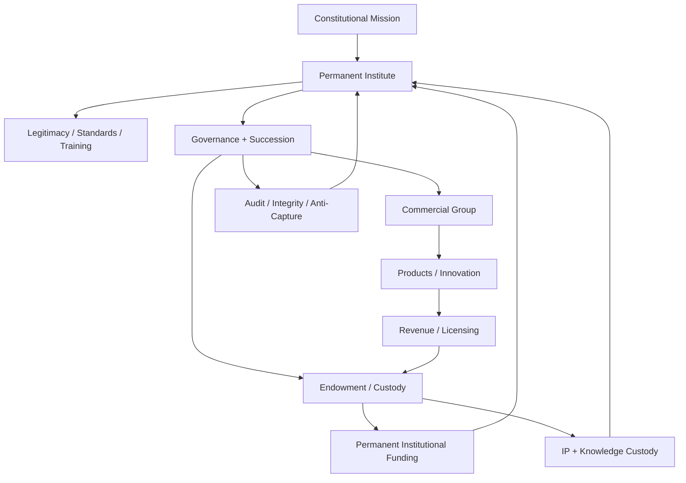
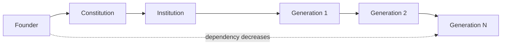
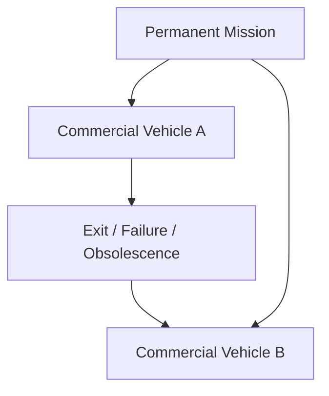
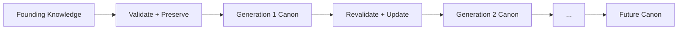
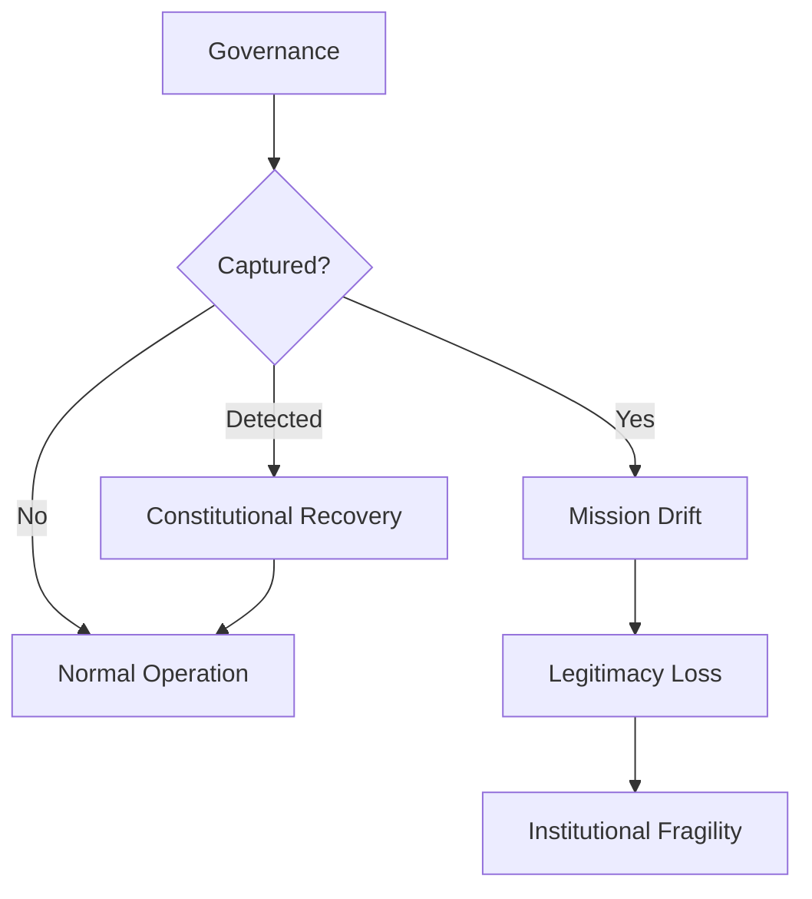
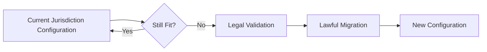

# TRANGS LEGACY — Full English Canonical Edition

> **Canonical status:** `SOURCE_CLAIM / AMOS_MODEL`
> **Source:** `11_KNOWLEDGE/trang`
> **Provenance:** `AMOS_corpus`
> **Scope:** `AMOS_knowledge`
>
> This edition preserves the supplied architecture while expressing it in clean English and separating source claims from derived governance conclusions. It is an institutional model, not proof that any structure can survive 1,000 years, guarantee asset protection, produce a particular investment return, or remain legally valid across future jurisdictions.

---

# 1. Normalized Source Frontmatter

```yaml
---
title: TRANGS LEGACY
tags:
  - trang
  - framework
  - reality
  - canon/knowledge
  - 00-home
  - knowledge-moc
  - system-scan-agent
  - automation-profiles
  - trang-moc
  - amos-simulation-kernel-v0-math-foundations
type: document
source: 11_KNOWLEDGE/trang
rscf:
  state: SOURCE_CLAIM
  claim_class: SOURCE_CLAIM
  provenance: AMOS_corpus
  scope: AMOS_knowledge
---
```

No version, creation date, update date, validation status, implementation status, or jurisdictional legal opinion was supplied.

---

# 2. Artifact Identity

`TRANGS LEGACY` is a long-horizon institutional architecture.

Its fundamental question is:

> **What kind of system could preserve a mission, body of knowledge, institutional legitimacy, economic capacity, and governance continuity for centuries after the founder and the original companies are gone?**

The source's answer is not:

> Build one company that lasts forever.

It is:

$$
\boxed{
\text{Permanent Mission}
+
\text{Replaceable Organizations}
+
\text{Persistent Custody}
+
\text{Governed Succession}
}
$$

The architecture therefore shifts the unit of persistence from the **company** to the **institutional mission**.

---

# 3. The 1,000-Year Horizon

A conventional business may optimize for:

* revenue,
* growth,
* profit,
* valuation,
* liquidity,
* market share,
* tax efficiency,
* founder control.

A millennium-scale institution faces a different objective function.

The source identifies:

* survivability across regimes,
* institutional permanence,
* legal continuity,
* knowledge custody,
* multi-generation control,
* legitimacy compounding.

A derived representation is:

$$
O_{1000}
=
f(S,L,K,G,C,A)
$$

where:

* \(S\) = survivability,
* \(L\) = legitimacy,
* \(K\) = knowledge continuity,
* \(G\) = governance continuity,
* \(C\) = capital continuity,
* \(A\) = adaptability.

This equation is **DERIVED**, not source mathematics.

---

# 4. The Fundamental Time-Horizon Law

The core idea can be compressed to:

$$
\boxed{
\text{Longer Horizon}
\Rightarrow
\text{Different Optimization Target}
}
$$

At short horizons, efficiency may dominate.

At extreme horizons, resilience increasingly matters.

Thus:

$$
\text{Short-term efficiency}
\neq
\text{long-term survivability}
$$

A structure optimized for maximum extraction today may be structurally inferior for continuity across centuries.

---

# 5. What Changes at 1,000 Years

Over a millennium, the architecture assumes that many current conditions will not persist.

The source explicitly anticipates:

* political regime change,
* currency collapse,
* rewritten laws,
* company death,
* founder mortality.

A full resilience model should additionally consider:

* technological obsolescence,
* institutional capture,
* cultural change,
* war,
* demographic change,
* infrastructure failure,
* knowledge loss.

These additional risks are **DERIVED extensions**.

---

# 6. The First Governing Principle

The deepest source-compatible rule is:

$$
\boxed{
\text{Do not make temporary things carry permanent responsibilities.}
}
$$

A founder is temporary.

A company is temporary.

A product is temporary.

A technology stack is temporary.

A particular legal vehicle may be temporary.

A particular jurisdictional advantage may be temporary.

Therefore none should individually constitute the permanent identity of the system.

---

# 7. Permanent Core vs Replaceable Shell

The architecture naturally separates into:

## Permanent or strongly protected core

* mission,
* constitutional principles,
* knowledge lineage,
* integrity requirements,
* succession principles,
* institutional identity.

## Replaceable shell

* companies,
* products,
* technologies,
* executives,
* operating models,
* investment vehicles,
* legal wrappers,
* jurisdictional configurations.

Formally:

$$
\boxed{
System
=
InvariantCore
+
AdaptiveShell
}
$$

This is one of the strongest derived abstractions of the source.

---

# 8. Permanence Does Not Mean Immutability

This distinction is critical.

A system surviving 1,000 years cannot realistically preserve every implementation detail unchanged.

Therefore:

$$
\text{Permanence}
\neq
\text{Immutability}
$$

Instead:

$$
\boxed{
\text{Permanence}
=
\text{Continuity through governed adaptation}
}
$$

The mission may persist while the mechanisms used to serve it evolve.

---

# 9. The Three-Layer Architecture

The source first defines three organizational layers:

1. **Institution Layer — Permanent**
2. **Commercial Layer — Replaceable**
3. **Custody Layer — Continuity Core**

These layers solve different problems.

---

# 10. Layer 1 — The Institution

The source explicitly says:

> This is not a company.

Possible forms named by the source include:

* foundation,
* institute,
* chartered research body,
* standards authority.

Its responsibilities include:

* holding the mission,
* training successors,
* developing legitimacy,
* surviving political turnover.

The institution is therefore the principal **mission carrier**.

---

# 11. Institutional Function

Define:

$$
I = \text{Mission-Carrying Institution}
$$

Its purpose is not primarily:

$$
\max Profit(I)
$$

but rather:

$$
\max
\{
MissionContinuity,
Legitimacy,
KnowledgeContinuity,
GovernanceContinuity
\}
$$

subject to economic sustainability.

---

# 12. Institution as Persistent Memory

The institution preserves more than a legal entity.

It carries:

* institutional purpose,
* standards,
* history,
* doctrine,
* training,
* governance,
* knowledge.

Therefore the intended transition is:

$$
\boxed{
Founder Memory
\rightarrow
Institutional Memory
}
$$

---

# 13. Founder Intent Must Become Institutional Structure

A founder can personally understand:

* why the organization exists,
* what must never be compromised,
* which tradeoffs are acceptable,
* what constitutes mission drift.

Future generations cannot access the founder's mind.

Therefore:

$$
FounderIntent
\rightarrow
ExplicitConstitution
\rightarrow
InstitutionalProcess
$$

is necessary for long-horizon continuity.

---

# 14. Layer 2 — Commercial Machines

The source treats commercial companies differently.

They may:

* grow,
* scale,
* list,
* merge,
* fail,
* be sold,
* be replaced.

Examples include:

* VN Tech OpCo,
* HK IPO vehicles,
* product subsidiaries.

Their mortality is accepted.

---

# 15. Commercial Replaceability

The key invariant is:

$$
\boxed{
Failure(C_i)
\not\Rightarrow
Failure(Mission)
}
$$

where \(C_i\) is any individual commercial entity.

A commercial entity is therefore a **vehicle**, not the civilization-scale identity.

---

# 16. Commercial Lifecycle

A conceptual lifecycle is:

$$
Create
\rightarrow
Build
\rightarrow
Scale
\rightarrow
Harvest/Exit/Decline
\rightarrow
Replace
$$

The source does not supply a formal lifecycle protocol.

Therefore the lifecycle remains:

`DECISION-RELEVANT GAP`.

---

# 17. Commercial Purpose

The commercial layer supplies:

* innovation,
* products,
* market execution,
* revenue,
* licensing,
* capital-market access,
* cashflow.

Its output supports the broader institutional architecture.

Thus:

$$
CommercialSuccess
\rightarrow
InstitutionalCapacity
$$

is the intended direction.

---

# 18. Company ≠ Mission

This is a central law:

$$
\boxed{
Company \neq Mission
}
$$

Therefore:

$$
CompanyDeath
\not\Rightarrow
MissionDeath
$$

provided the system successfully isolates critical mission assets.

---

# 19. Layer 3 — Custody and Control

The third layer protects continuity-critical assets.

The source mentions:

* legal trust structures,
* perpetual endowment,
* multi-jurisdiction governance,
* succession-locked custody.

Its purpose is continuity beyond any single:

* founder,
* company,
* government,
* commercial cycle.

---

# 20. Custody Function

Conceptually:

$$
V
=
\text{Continuity Vault}
$$

holding or governing some combination of:

* capital,
* IP,
* knowledge,
* governance rights,
* mission-critical assets.

Exact ownership topology is not supplied.

---

# 21. “Unbreakable” Is an Objective, Not a Verified Property

The source describes this custody layer as “unbreakable.”

No real legal structure has been shown here to be literally immune to:

* legislation,
* courts,
* war,
* sanctions,
* confiscation,
* insolvency,
* corruption,
* governance failure.

Therefore the canonical interpretation is:

$$
\boxed{
Unbreakable
\rightarrow
DesignedForHighResilience
}
$$

not absolute invulnerability.

---

# 22. The Three-Layer Model

```text
                       PERMANENT INSTITUTE
                             │
                  Mission / Standards / Training
                             │
                ┌────────────┴────────────┐
                │                         │
       CUSTODY / ENDOWMENT         COMMERCIAL GROUP
        continuity assets          replaceable engines
                │                         │
        Capital / IP / Rights      Products / Revenue
                │                         │
                └────────────┬────────────┘
                             │
                       Mission Capacity
```

This is a normalized representation of the source.

---

# 23. Three Different Lifetimes

The model intentionally assigns different expected lifetimes.

Let:

* \(T_I\) = institutional lifetime,
* \(T_V\) = custody lifetime,
* \(T_C\) = company lifetime.

The architecture expects:

$$
T_C \ll T_I
$$

and seeks:

$$
T_V \approx T_I
$$

as an objective.

This does not guarantee either survives for 1,000 years.

---

# 24. Failure Containment

The architecture attempts to create failure boundaries.

Ideally:

$$
Fault(C_i)
\not\Rightarrow
Fault(I)
$$

and:

$$
Fault(C_i)
\not\Rightarrow
Loss(V)
$$

This means commercial failure should be locally recoverable.

---

# 25. Contagion Risk

Actual separation depends on legal reality.

Possible contagion channels include:

* guarantees,
* cross-defaults,
* common ownership,
* common directors,
* security interests,
* insolvency law,
* veil piercing,
* shared infrastructure.

Therefore:

$$
SeparateEntities
\neq
IndependentFailureDomains
$$

without validation.

---

# 26. The Four-Pillar Architecture

The source later gives another representation:

1. Institutional Legitimacy
2. Capital & Wealth Engine
3. Knowledge + IP Custody
4. Succession + Governance Lock

These are best interpreted as **functional pillars**, while the three layers describe organizational topology.

This reconciliation is `DERIVED`.

---

# 27. Three Layers vs Four Pillars

$$
Layers
=
\text{Where functions live}
$$

$$
Pillars
=
\text{What capabilities must exist}
$$

Possible mapping:

| Organizational layer  | Functional pillar        |
| --------------------- | ------------------------ |
| Institution           | Institutional Legitimacy |
| Commercial Group      | Capital & Wealth Engine  |
| Custody               | Knowledge + IP Custody   |
| Institution + Custody | Governance + Succession  |

This mapping is plausible but not explicitly stated.

---

# 28. Pillar 1 — Institutional Legitimacy

The source argues that long-duration power depends on recognized authority.

The institution seeks to become:

* standard setter,
* certification authority,
* training lineage,
* ethical reference.

Thus power is redefined away from secrecy or founder control.

---

# 29. Durable Power

A derived representation:

$$
P_D
=
f(
Trust,
Standards,
Recognition,
Competence,
Training,
InstitutionalDependency
)
$$

where \(P_D\) is durable institutional influence.

No coefficients or empirical model are supplied.

---

# 30. Legitimacy Is Relational

An institution cannot simply declare itself legitimate.

$$
DeclareTrusted(I)
\not\Rightarrow
Trusted(I)
$$

Legitimacy depends partly on external stakeholders.

Therefore:

$$
Legitimacy
=
Relation(Institution,Stakeholders)
$$

---

# 31. Legitimacy Compounding

The source proposes that legitimacy compounds.

Conceptually:

$$
L_{t+1}
=
L_t
+
TrustGains_t
-
TrustLosses_t
$$

Long periods of competent service may accumulate institutional authority.

But legitimacy can also decline.

---

# 32. Legitimacy Is Not Monotonic

$$
L_{t+1}
\not\geq
L_t
$$

necessarily.

A major scandal, corruption event, scientific failure, or political capture can destroy accumulated legitimacy.

Therefore legitimacy is an asset requiring maintenance.

---

# 33. Standards as Institutional Power

If an institution defines widely adopted standards:

$$
Standard
\rightarrow
Coordination
\rightarrow
InstitutionalInfluence
$$

But adoption is required.

Therefore:

$$
StandardDeclared
\not\Rightarrow
StandardAdopted
$$

---

# 34. Certification Power

Likewise:

$$
Certification
+
ExternalRecognition
\rightarrow
PotentialGatekeepingPower
$$

Without external recognition, certification is merely an internal label.

---

# 35. Standards Conflict of Interest

The architecture also includes commercial companies.

That creates a significant governance risk.

If:

$$
Institution
\rightarrow
SetsStandard
$$

and:

$$
Subsidiary
\rightarrow
SellsProductUnderStandard
$$

then the institution may benefit economically from standards it controls.

This requires an independence firewall.

---

# 36. Proposed Standards Firewall

**PROPOSED, not source canon:**

```text
Scientific Standards
        │
        ├── independent review
        ├── conflict disclosure
        ├── transparent criteria
        └── appeal
             │
             X
     Commercial Influence
```

---

# 37. Power Requires Accountability

A strong derived principle is:

$$
InstitutionalPower\uparrow
\Rightarrow
AccountabilityRequirement\uparrow
$$

The stronger the certification or standards gate, the stronger the need for:

* transparency,
* procedural fairness,
* appeals,
* conflict controls,
* independent oversight.

---

# 38. Pillar 2 — Capital and Wealth Engine

The source's economic architecture centers on a perpetual endowment.

Commercial entities generate economic value.

Some of that value becomes permanent capital.

Thus:

$$
CommercialProfit
\rightarrow
EndowmentCapital
$$

---

# 39. Capital Transformation

The objective changes from:

$$
Profit
\rightarrow
Extraction
$$

to:

$$
Profit
\rightarrow
PermanentCapital
\rightarrow
MissionFunding
$$

This is one of the source's clearest economic principles.

---

# 40. Endowment Flywheel

```text
Research / Knowledge
        ↓
Commercial Innovation
        ↓
Revenue / Licensing
        ↓
Permanent Capital
        ↓
Investment Returns
        ↓
Institutional Funding
        ↓
Research / Knowledge
        ↺
```

This is a derived synthesis.

---

# 41. Endowment Dynamics

A simple derived model is:

$$
E_{t+1}
=
(E_t+C_t)(1+r_t)-D_t-Cost_t
$$

where:

* \(E_t\) = current endowment,
* \(C_t\) = new contributions,
* \(r_t\) = investment return,
* \(D_t\) = institutional distributions.

No such formula is supplied by the source.

---

# 42. Nominal Wealth Is Not the Objective

Over extreme horizons:

$$
NominalCapital
\neq
RealMissionCapacity
$$

Currencies can change or collapse.

The relevant objective is preservation of real institutional capability.

---

# 43. The 20% Claim

The source states that a 20% annual compounding endowment would dominate empires.

The mathematical compound formula is:

$$
V_n=V_0(1.2)^n
$$

But maintaining a constant 20% annual return over centuries is not established.

The claim ignores:

* drawdowns,
* inflation,
* distributions,
* taxation,
* market capacity,
* asset destruction,
* regime changes,
* risk.

Therefore:

$$
CompoundMath
\neq
InvestmentForecast
$$

---

# 44. Endowment ≠ Immortality

A perpetual legal form can still lose its economic capacity.

Potential causes include:

* poor investment,
* corruption,
* confiscation,
* inflation,
* excessive spending,
* governance capture.

Therefore:

$$
PerpetualLegalForm
\not\Rightarrow
PerpetualWealth
$$

---

# 45. Endowment Governance Gap

The source does not define:

* investment mandate,
* spending rule,
* risk tolerance,
* leverage,
* liquidity,
* diversification,
* governance,
* conflicts.

Therefore the endowment remains an architectural component, not an operational investment system.

---

# 46. Pillar 3 — Knowledge and IP Custody

The source treats IP and knowledge as crown assets.

This reflects a critical principle:

$$
\boxed{
Capital without knowledge continuity is insufficient.
}
$$

---

# 47. IP Is Not Knowledge

These must be separated.

$$
IP
\neq
Knowledge
$$

IP refers to legally defined rights.

Knowledge includes:

* research,
* models,
* methods,
* institutional memory,
* expertise,
* training,
* historical decisions.

A 1,000-year architecture requires both.

---

# 48. Knowledge Vault

A conceptual knowledge object may include:

$$
K=
\langle
Content,
Provenance,
Version,
Dependencies,
Scope,
Evidence,
History
\rangle
$$

This is a derived AMOS-style representation.

---

# 49. Knowledge Must Remain Recoverable

Desired invariant:

$$
Failure(Company_i)
\not\Rightarrow
Loss(K)
$$

The permanent knowledge base should therefore not depend entirely on a replaceable commercial company.

---

# 50. Knowledge Preservation Is Not Truth Preservation

A crucial epistemic law:

$$
Stored(X)
\not\Rightarrow
True(X)
$$

and:

$$
Old(X)
\not\Rightarrow
Valid(X)
$$

A millennium institution must preserve both knowledge and the ability to correct knowledge.

---

# 51. Canon Must Remain Correctable

Therefore:

$$
\boxed{
CanonicalKnowledge
=
Preservation
+
Provenance
+
Revalidation
}
$$

not frozen doctrine.

---

# 52. Knowledge Evolution

A strong architecture preserves lineage:

$$
K_0
\rightarrow
K_1
\rightarrow
K_2
\rightarrow
\dots
\rightarrow
K_n
$$

where each transition records:

* what changed,
* why,
* evidence,
* authority,
* prior state.

---

# 53. Scientific Correctability

If the institution is scientific, empirical claims must remain falsifiable.

Therefore:

$$
NewEvidence
\Rightarrow
Revalidate(EmpiricalClaim)
$$

The founder's scientific beliefs cannot become permanently true merely because they were foundational.

---

# 54. Constitution vs Science

This distinction is essential:

### Constitutional claims

May encode:

* mission,
* ethics,
* governance,
* integrity.

### Empirical claims

Must remain evidence-sensitive.

Therefore:

$$
NormativeInvariant
\neq
EmpiricalInvariant
$$

---

# 55. Pillar 4 — Succession and Governance

The source states:

> A 1,000-year institution requires the founder to become unnecessary.

This is one of the strongest structural conclusions.

---

# 56. Founder Mortality

For a human founder:

$$
T_F \ll 1000Y
$$

Therefore:

$$
MissionDependsPermanentlyOnFounder
$$

is incompatible with the stated horizon.

---

# 57. Founder Transition

The desired transition is:

$$
\boxed{
Founder
\rightarrow
Constitution
\rightarrow
Institution
}
$$

The founder begins as architect.

The institution must eventually operate without founder dependency.

---

# 58. Founder Role

The source proposes:

* Founder-Architect,
* Constitutional Author,
* Initial Custodian of Invariants.

This is fundamentally different from:

> CEO forever.

---

# 59. Founder Dependency Function

Let:

$$
D_F(t)
=
\text{dependency on founder at time }t
$$

A successful institutionalization process should seek:

$$
D_F(t)\downarrow
$$

while:

$$
MissionFidelity(t)
$$

remains acceptably high.

---

# 60. Founder Independence Law

$$
\boxed{
FounderUnavailable
\not\Rightarrow
InstitutionUnavailable
}
$$

This should eventually become a hard continuity requirement.

---

# 61. Founder Legacy vs Founder Worship

The architecture preserves:

* principles,
* mission,
* knowledge,
* institutional design.

It does not require permanent personal centrality.

Therefore:

$$
FounderLegacy
\neq
FounderCult
$$

---

# 62. Multi-Generation Control

The source uses the phrase “multi-generation control.”

This is ambiguous.

Possible meanings:

* family control,
* constitutional control,
* mission continuity,
* institutional governance.

Because the source also requires the founder to become unnecessary, the safest interpretation is:

$$
MultiGenerationControl
\approx
MissionGovernanceContinuity
$$

**Class:** `DERIVED / CONDITIONAL`.

---

# 63. Succession Is More Than Naming a Person

Succession must transfer:

$$
\{
Authority,
Knowledge,
Responsibility,
Legitimacy,
InstitutionalMemory
\}
$$

A named heir without these properties does not guarantee continuity.

---

# 64. Training Lineage

The source gives training a central role.

This provides a living transmission channel:

$$
Generation_n
\xrightarrow{Training}
Generation_{n+1}
$$

---

# 65. Training + Canon

A resilient system needs both:

$$
DocumentedCanon
+
LivingTraining
$$

Documents preserve explicit knowledge.

Training transfers tacit knowledge.

---

# 66. Transmission Drift

Each generation can reinterpret the mission.

Therefore:

$$
M_n
\neq
M_{n+1}
$$

is possible.

The challenge is distinguishing:

* legitimate adaptation,
* corruption,
* misunderstanding,
* mission drift.

---

# 67. Mission Drift

Define conceptually:

$$
D_M(t)
=
Distance(Mission_t,Mission_0)
$$

No actual metric is supplied.

This remains a model.

---

# 68. Drift Is Not Always Bad

Some deviation may represent necessary adaptation.

Therefore:

$$
Difference
\neq
Corruption
$$

A millennium institution needs a classifier for:

$$
Adaptation
\quad vs \quad
MissionDrift
$$

The source does not provide one.

---

# 69. Governance Lock

The source calls for:

* constitutional rules,
* succession protocol,
* anti-corruption enforcement,
* mission invariants.

These constitute the governance lock.

---

# 70. Governance Lock ≠ Frozen Governance

A system that cannot change may become obsolete.

Therefore:

$$
GovernanceLock
\neq
NoChange
$$

A better interpretation is:

$$
GovernanceLock
=
ProtectedCore
+
ControlledAmendment
$$

---

# 71. Constitutional Invariants

Let:

$$
I_C=\{i_1,i_2,\ldots,i_n\}
$$

be constitutional invariants.

A constitutional action \(A\) should satisfy:

$$
A\models I_C
$$

unless the constitution itself defines a legitimate amendment process.

The actual invariant set is missing.

---

# 72. Amendment Paradox

If constitutional amendment is impossible:

$$
RigidityRisk\uparrow
$$

If amendment is trivial:

$$
CaptureRisk\uparrow
$$

Thus:

$$
\boxed{
Resilience
=
IntegrityProtection
+
GovernedAmendability
}
$$

---

# 73. Constitutional Amendment Gap

The source does not specify:

* amendment authority,
* quorum,
* voting threshold,
* protected clauses,
* review period,
* judicial review,
* founder veto,
* successor veto.

This is a **CRITICAL GAP**.

---

# 74. Succession Selection Gap

The source does not specify whether successors are selected by:

* appointment,
* election,
* trustees,
* merit,
* family lineage,
* mixed governance.

Therefore:

$$
SuccessorSelection
=
UNKNOWN/GAP
$$

---

# 75. Removal Gap

No mechanism is supplied for removing:

* corrupt successor,
* incompetent governor,
* captured trustee,
* failed board.

This is also a **CRITICAL GAP**.

---

# 76. Deadlock Gap

Distributed governance can produce deadlock.

No tie-breaking or deadlock-resolution mechanism is supplied.

---

# 77. Constitutional Interpretation Gap

Who decides what the founding mission means after several centuries?

Possibilities include:

* board,
* tribunal,
* constitutional council,
* courts,
* stakeholder assembly.

No canonical answer is supplied.

---

# 78. Governance Capture

The institution can survive legally while being captured.

Thus:

$$
LegalSurvival
\neq
MissionSurvival
$$

This may be more dangerous than corporate failure because the captured institution can continue using the original name and legitimacy.

---

# 79. Capture Vectors

Potential capture mechanisms include:

* founder-family capture,
* trustee capture,
* commercial capture,
* donor capture,
* political capture,
* ideological capture,
* bureaucratic capture.

The source requires anti-corruption but does not define anti-capture mechanics.

---

# 80. Separation of Powers

A future implementation could separate:

```text
Mission Authority
Scientific Authority
Capital Authority
Commercial Authority
Custody Authority
Integrity / Audit Authority
```

This is **PROPOSED**, not source canon.

---

# 81. No Single Governance Root

If one body can:

* amend mission,
* control money,
* appoint successors,
* sell IP,
* certify products,

then that body becomes a catastrophic single point of capture.

Therefore a long-horizon architecture should carefully type powers.

---

# 82. Ownership ≠ Governance

Important distinction:

$$
Ownership
\neq
Control
\neq
VotingRights
\neq
BeneficialInterest
\neq
Custody
$$

The source does not define these separately.

---

# 83. Ownership Topology Gap

The source does not tell us exactly:

* who owns the commercial group,
* who owns IP,
* who controls the endowment,
* who appoints trustees,
* who controls the institute.

Therefore:

$$
OwnershipGraph
=
UNKNOWN/GAP
$$

This is a **CRITICAL implementation gap**.

---

# 84. Rights Vector

A future constitution should distinguish rights such as:

$$
R=
\langle
R_{economic},
R_{vote},
R_{appoint},
R_{remove},
R_{license},
R_{transfer},
R_{amend},
R_{veto}
\rangle
$$

No allocation is currently canonical.

---

# 85. Jurisdiction Architecture

The source assigns:

* Australia → legitimacy + rule of law,
* Hong Kong → capital-market access,
* Vietnam → execution + cultural root,
* neutral endowment jurisdiction → continuity anchor.

These are source-defined strategic roles.

They are not permanent legal facts.

---

# 86. Jurisdiction Is Time-Dependent

$$
Fitness(J)=Fitness(J,t)
$$

A jurisdiction appropriate today may be inappropriate centuries later.

Therefore:

$$
CurrentJurisdictionChoice
\neq
MillenniumInvariant
$$

---

# 87. Jurisdictional Diversification

The deeper principle is:

$$
\boxed{
Avoid total dependence on one jurisdictional failure domain.
}
$$

But simply increasing the number of jurisdictions does not guarantee resilience.

---

# 88. Correlated Jurisdictions

Several jurisdictions may share:

* treaty systems,
* sanctions,
* banks,
* clearing systems,
* political alliances.

Therefore:

$$
N_{jurisdictions}
\neq
N_{independent\ jurisdictions}
$$

---

# 89. Independence Must Be Demonstrated

This mirrors AMOS provenance logic.

Multiple nominal entities are not independent merely because they have different names.

Likewise:

$$
MultipleJurisdictions
\not\Rightarrow
IndependentFailureDomains
$$

---

# 90. Jurisdiction Migration

A millennium system requires the ability to reconsider its legal configuration.

Conceptually:

$$
J_t
\xrightarrow{RegimeShift}
Review
\xrightarrow{LawfulMigration}
J_{t+1}
$$

No migration protocol is supplied.

---

# 91. Lawfulness Is an Invariant

The source explicitly says structures must remain lawful.

Therefore:

$$
\boxed{
ContinuityOptimization
\land
LawfulOperation
}
$$

The architecture does not license evasion of legal obligations.

---

# 92. Anti-Secrecy Principle

The source explicitly rejects maximum secrecy as the terminal objective.

Thus:

$$
Secrecy
\neq
DurablePower
$$

within this model.

---

# 93. Confidentiality Still Exists

Rejecting “max secrecy” does not mean eliminating legitimate confidentiality.

A serious institution may still need to protect:

* personal information,
* cybersecurity information,
* trade secrets,
* privileged communications.

Therefore:

$$
NotMaxSecrecy
\neq
ZeroConfidentiality
$$

---

# 94. Tax Optimization Boundary

The source rejects tax optimization as the primary civilization-scale objective.

It does not claim tax efficiency is irrelevant.

The hierarchy is:

$$
MissionContinuity
>
TaxOptimization
$$

not necessarily:

$$
TaxOptimization=0
$$

---

# 95. Endowment vs Offshore Vault

The source explicitly reframes money from hidden offshore storage to institutional capital.

Thus:

$$
Capital
\rightarrow
ProductiveInstitutionalResource
$$

rather than merely:

$$
Capital
\rightarrow
ConcealedReserve
$$

---

# 96. Civilizational Institution

The source says the target is not merely a startup.

It proposes:

* scientific order,
* standards authority,
* training lineage,
* civilization-scale institution.

This defines intended scale and identity.

It does not establish external recognition.

---

# 97. “Scientific Order”

This remains a source-defined institutional aspiration.

It does not prove:

* scientific validity,
* scientific consensus,
* academic recognition.

---

# 98. “Standards Authority”

Likewise:

$$
SelfDeclaredAuthority
\neq
RecognizedAuthority
$$

Recognition requires external adoption.

---

# 99. Historical Analogies

The source references:

* Oxford,
* ISO,
* Red Cross,
* Vatican structures,
* ancient guild lineages.

These are architectural analogies.

---

# 100. Analogy Firewall

$$
Similarity(X,Oxford)
\not\Rightarrow
Longevity(X)
$$

and:

$$
Similarity(X,ISO)
\not\Rightarrow
Authority(X)
$$

Structural similarity is not causal proof.

---

# 101. Survivorship Bias

Long-lived institutions are visible because they survived.

Many failed institutions are absent from the analogy set.

Therefore:

$$
ObservedSurvivors
\neq
CompleteEvidenceSet
$$

The historical examples generate hypotheses rather than universal laws.

---

# 102. “Oxford Is the Model”

The safest interpretation is:

> A mission-centered institution capable of surviving many generations is a more appropriate architectural analogy than an ordinary technology corporation.

It does not mean literally copy Oxford.

---

# 103. Google/Amazon Horizon Claim

The source states Google/Amazon optimize for approximately 30–100 years.

No independent evidence is supplied for that exact range.

Therefore this should remain:

`SOURCE_CLAIM`.

The architecture does not depend heavily on the exact number.

---

# 104. Empire/Civilization Horizon Claim

Likewise:

* empires → centuries,
* civilizations → millennia,

is a broad heuristic framing, not a precise taxonomy.

---

# 105. The Deeper Principle

The important conclusion survives even if those exact analogies are imperfect:

$$
\boxed{
Different persistence horizons require different institutional architectures.
}
$$

---

# 106. “Max Power + Max Money + Max Integrity”

This is a multi-objective optimization problem.

The objectives may conflict.

Therefore:

$$
\max(P,M,I)
$$

is not automatically coherent.

---

# 107. Power–Integrity Conflict

Greater control may increase power but reduce accountability.

$$
\Delta Power>0
\not\Rightarrow
\Delta Integrity>0
$$

---

# 108. Money–Integrity Conflict

Commercial incentives can distort:

* standards,
* research,
* certification,
* governance.

Thus:

$$
\Delta Money>0
\not\Rightarrow
\Delta Integrity>0
$$

---

# 109. Integrity Constraint

A safer optimization is:

$$
\max(P,M)
$$

subject to:

$$
Integrity\geq I_{min}
$$

and:

$$
Lawfulness=1
$$

and:

$$
MissionFidelity\geq M_{min}
$$

Thresholds are not supplied.

---

# 110. Integrity as Constraint, Not Commodity

Within AMOS reasoning, integrity should not be traded away merely to increase another objective.

Thus a stronger derived ordering is:

$$
\boxed{
Integrity
>
PowerOptimization
>
MoneyOptimization
}
$$

when the latter conflict with load-bearing integrity.

This is a derived governance refinement.

---

# 111. Defining Power

“Power” is underspecified.

It could mean:

* institutional authority,
* standard-setting authority,
* economic leverage,
* political influence,
* knowledge authority.

The source primarily frames it as:

$$
Power
\approx
LegitimateInstitutionalInfluence
$$

---

# 112. Defining Money

Likewise, “money” could mean:

* revenue,
* endowment size,
* assets,
* purchasing power,
* sustainable mission funding.

For a millennium architecture, the strongest interpretation is:

$$
Money
\approx
PersistentRealMissionCapacity
$$

---

# 113. Defining Integrity

“Integrity” could include:

$$
I=
\langle
I_{mission},
I_{epistemic},
I_{financial},
I_{governance},
I_{legal},
I_{scientific}
\rangle
$$

This vector is **DERIVED**.

---

# 114. Mission Integrity

Does the institution still serve its constitutional purpose?

---

# 115. Epistemic Integrity

Does it distinguish:

* evidence,
* model,
* source claim,
* decision,
* uncertainty?

---

# 116. Financial Integrity

Are capital and transactions:

* properly governed,
* auditable,
* non-corrupt?

---

# 117. Governance Integrity

Are powers:

* lawful,
* bounded,
* accountable,
* reviewable?

---

# 118. Legal Integrity

Does the institution operate within applicable law?

---

# 119. Scientific Integrity

Are empirical claims allowed to change when evidence changes?

---

# 120. Integrity ≠ Permanence

A corrupt institution can survive for centuries.

Therefore:

$$
Longevity
\not\Rightarrow
Integrity
$$

---

# 121. Permanence ≠ Success

Likewise:

$$
InstitutionStillExists
\not\Rightarrow
MissionSucceeded
$$

---

# 122. Mission > Form

A deeper derived hierarchy is:

$$
Integrity
>
Mission
>
InstitutionalForm
>
CommercialForm
$$

Thus legal entities are instruments, not ultimate ends.

---

# 123. Anti-Permanence Paradox

An institution obsessed with its own survival can eventually sacrifice its mission merely to continue existing.

Therefore:

$$
\boxed{
InstitutionalSurvival
\text{ should remain instrumental to mission.}
}
$$

---

# 124. Mission Completion

The source does not address what happens if the mission is:

* completed,
* obsolete,
* impossible,
* harmful.

A complete constitution needs terminal conditions.

---

# 125. Dissolution

A true integrity architecture may sometimes require lawful dissolution rather than endless institutional self-preservation.

This is **DERIVED / PROPOSED**.

---

# 126. Knowledge Lineage

A 1,000-year institution needs knowledge ancestry.

A knowledge object should conceptually preserve:

```text
Claim
├── source
├── evidence
├── version
├── dependencies
├── scope
├── regime
├── confidence
├── competing claims
└── invalidation conditions
```

This is an AMOS-derived extension.

---

# 127. Repetition ≠ Independent Confirmation

If twenty successor documents all copy one founder-era claim:

$$
20\ Copies
\neq
20\ IndependentSources
$$

This is essential for avoiding institutional mythology.

---

# 128. Institutional Sybil Problem

Similarly, multiple boards or entities under the same appointment ancestry may create only apparent decentralization.

$$
N_{entities}
\neq
N_{independent\ governance\ roots}
$$

---

# 129. Governance Provenance

A future constitution should track:

* who appointed whom,
* who funded whom,
* who controls whom,
* who can remove whom.

This creates a governance provenance graph.

---

# 130. Governance Topology

Conceptually:

```text
Founder
  │
  ├── appoints?
  ▼
Institutional Board
  │
  ├── appoints?
  ▼
Endowment Board
  │
  ├── controls?
  ▼
Commercial Board
```

If every authority descends from one root with no independent counterweight, nominal separation may be weak.

The actual source topology is unknown.

---

# 131. Independence Requirement

Therefore:

$$
Independence
$$

must be demonstrated through:

* appointment structure,
* removal rights,
* funding independence,
* legal authority,
* conflict rules.

Not assumed from labels.

---

# 132. Knowledge Custody Across Technology Change

A millennium horizon implies today's storage formats may become unreadable.

Therefore knowledge continuity requires migration.

$$
Format_t
\rightarrow
Format_{t+1}
$$

with semantic preservation.

---

# 133. Bit Integrity ≠ Semantic Integrity

Even if a file hash is preserved:

$$
HashVerified
\not\Rightarrow
MeaningUnderstood
$$

Long-term custody must preserve context and semantics.

---

# 134. Tacit Knowledge

Some knowledge exists only through:

* practice,
* apprenticeship,
* judgment,
* institutional culture.

This strengthens the source's training-lineage requirement.

---

# 135. Two Knowledge Channels

$$
KnowledgeContinuity
=
DocumentaryContinuity
+
LivingTransmission
$$

Neither alone is sufficient.

---

# 136. Knowledge Drift

Training can introduce reinterpretation.

Documents can become obsolete.

Thus both channels require revalidation.

---

# 137. Institutional Memory

A robust institution should preserve:

* what happened,
* why,
* what evidence existed,
* what alternatives were rejected,
* what later changed.

This prevents future generations from mistaking historical decisions for timeless truths.

---

# 138. Decision Provenance

A future major decision record could contain:

```yaml
decision:
  claim:
  authority:
  date:
  evidence:
  alternatives:
  conflicts:
  scope:
  legal_basis:
  mission_compatibility:
  review_date:
  invalidation_conditions:
```

**PROPOSED.**

---

# 139. Governance Epochs

A millennium institution will likely pass through distinct eras.

Conceptually:

$$
E_0,E_1,E_2,\dots,E_n
$$

An epoch transition may correspond to:

* succession,
* constitutional amendment,
* jurisdiction migration,
* major technological transition,
* civilizational crisis.

---

# 140. Historical Finality

Past institutional states should not simply disappear when governance changes.

A derived rule:

$$
FinalizedHistory
\rightarrow
Preserve
$$

Corrections should be appended with provenance rather than silently rewriting history.

---

# 141. Institutional Auditability

The source explicitly values audited integrity.

Therefore consequential decisions should be reconstructable.

---

# 142. Audit ≠ Correctness

However:

$$
Audited
\not\Rightarrow
True
$$

Audit can verify conformity with process.

It does not guarantee the underlying judgment was correct.

---

# 143. External Challenge

A long-lived institution benefits from genuinely independent challenge.

Possible mechanisms include:

* external peer review,
* independent auditors,
* external scientific review,
* regulatory review,
* adversarial governance.

These are proposed extensions.

---

# 144. Institutional Red Team

A dedicated integrity function could challenge:

* mission drift,
* financial concentration,
* conflicts,
* weak evidence,
* governance capture,
* obsolete assumptions.

This is **PROPOSED**.

---

# 145. COMPETING State

A scientific institution should be able to preserve unresolved alternatives:

$$
COMPETING(H_1,H_2)
$$

rather than forcing artificial consensus.

---

# 146. Consensus ≠ Truth

$$
Consensus
\not\Rightarrow
Truth
$$

---

# 147. Founder Authority ≠ Truth

$$
FounderSaid(X)
\not\Rightarrow
True(X)
$$

---

# 148. Institutional Age ≠ Truth

$$
AncientDoctrine
\not\Rightarrow
TrueDoctrine
$$

---

# 149. Wealth ≠ Truth

$$
Capital
\not\Rightarrow
EpistemicAuthority
$$

---

# 150. Legitimacy ≠ Truth

$$
TrustedInstitution
\not\Rightarrow
EveryClaimCorrect
$$

These distinctions are essential for preserving scientific integrity across centuries.

---

# 151. Correctability

The strongest derived integrity equation is:

$$
\boxed{
InstitutionalIntegrity
=
Fidelity
+
Correctability
}
$$

Fidelity without correctability becomes dogma.

Correctability without fidelity becomes uncontrolled drift.

---

# 152. Resilience

Likewise:

$$
\boxed{
Resilience
=
Prevention
+
Detection
+
Containment
+
Repair
+
Recovery
}
$$

A millennium system cannot rationally assume failures never occur.

---

# 153. Repairability

A system that cannot repair itself is fragile even if heavily protected.

Thus:

$$
Unchangeable
\neq
Unbreakable
$$

---

# 154. Reversibility

Under uncertainty, reversible changes are preferable when possible.

Examples:

* pilot governance changes,
* stage migrations,
* isolate experimental companies,
* preserve prior knowledge versions.

This is derived AMOS governance logic.

---

# 155. Irreversible Decisions

Some decisions deserve stronger validation:

* permanent IP transfer,
* constitutional amendment,
* dissolution,
* invasion of endowment principal,
* irreversible merger,
* removal of mission protections.

---

# 156. Decision Classes

**PROPOSED:**

| Class | Meaning                    |
| ----- | -------------------------- |
| D0    | Routine operational        |
| D1    | Commercial strategic       |
| D2    | Institutional strategic    |
| D3    | Constitutional             |
| D4    | Existential / irreversible |

Validation should increase with irreversibility.

---

# 157. Institutional Failure Domains

A derived failure vector:

$$
F=
\{
Founder,
Governance,
Commercial,
Capital,
Legal,
Political,
Knowledge,
Technical,
Physical,
Cultural
\}
$$

---

# 158. Founder Failure

Defense:

$$
Succession
+
Institutionalization
$$

---

# 159. Commercial Failure

Defense:

$$
Replaceability
+
FailureIsolation
$$

---

# 160. Capital Failure

Defense:

$$
Diversification
+
Governance
+
SpendingDiscipline
$$

Only diversification is partly implied; detailed mechanisms remain absent.

---

# 161. Legal Failure

Defense:

$$
MultiJurisdiction
+
LawfulAdaptation
$$

---

# 162. Knowledge Failure

Defense:

$$
Custody
+
Provenance
+
Training
+
Migration
$$

The latter two are partly source/derived.

---

# 163. Governance Failure

Defense requires:

* separation of powers,
* removal,
* audit,
* succession,
* constitutional recovery.

Most mechanics remain missing.

---

# 164. Legitimacy Failure

Defense requires:

* trustworthy behavior,
* transparency,
* scientific integrity,
* independence.

The source emphasizes legitimacy but not its operational controls.

---

# 165. Physical Failure

All institutional systems ultimately depend on:

* people,
* hardware,
* energy,
* infrastructure.

Therefore:

$$
DigitalInstitution
\not\Rightarrow
SubstrateIndependence
$$

---

# 166. The Weakest-Pillar Principle

A useful derived model is:

$$
R
\leq
\min(L,C,K,G)
$$

where:

* \(L\) = legitimacy,
* \(C\) = capital,
* \(K\) = knowledge,
* \(G\) = governance.

A near-zero load-bearing pillar can dominate overall resilience.

---

# 167. But Four-Pillar Completeness Is Unverified

The source says no pillar can be missing.

That does not prove these four are sufficient.

Thus:

$$
L\land C\land K\land G
\not\Rightarrow
1000YSurvival
$$

necessarily.

---

# 168. Possible Additional Domains

Potential independent domains include:

* physical resilience,
* technological adaptability,
* cybersecurity,
* demographic renewal,
* external alliances.

Whether these are subcomponents of the four pillars or additional pillars is unresolved.

---

# 169. Competing Hypothesis H1

The four pillars are a complete top-level ontology.

**Status:** `SOURCE_CLAIM / MODEL`.

---

# 170. Competing Hypothesis H2

The four pillars are only a useful abstraction and additional top-level domains are needed.

**Status:** `COMPETING`.

---

# 171. Discriminating Evidence

The cheapest high-information evidence would be an authoritative constitutional ontology explicitly defining whether those additional domains are nested or independent.

---

# 172. Multi-Jurisdiction Failure Test

Suppose one jurisdiction becomes unusable.

Desired:

$$
Failure(J_1)
\not\Rightarrow
Failure(System)
$$

But this only works if assets and governance are actually separable.

---

# 173. Company Bankruptcy Test

Desired:

$$
Bankruptcy(C_1)
\not\Rightarrow
Loss(CoreIP)
$$

Implementation unknown.

---

# 174. Founder Death Test

Desired:

$$
FounderDeath
\not\Rightarrow
GovernanceVacuum
$$

Current result:

`UNKNOWN/GAP`

because succession mechanics are absent.

---

# 175. Corrupt Successor Test

Desired:

$$
CorruptSuccessor
\rightarrow
Detect
\rightarrow
Remove
\rightarrow
Recover
$$

No mechanism supplied.

**Critical gap.**

---

# 176. Board Capture Test

Same result:

`CRITICAL GAP`.

---

# 177. Endowment Crash Test

Suppose:

$$
E_{t+1}=0.3E_t
$$

No spending/recovery policy exists.

Result:

`UNKNOWN/GAP`.

---

# 178. Scientific Paradigm Shift Test

Suppose a foundational scientific model is falsified.

Can the institution change it while preserving mission?

The source does not answer.

This is a critical epistemic-governance issue.

---

# 179. Constitutional Contradiction Test

Suppose two invariants conflict.

No precedence rule is supplied.

Result:

`UNKNOWN/GAP`.

---

# 180. Mission Schism Test

Suppose two successor groups claim:

$$
Mission_A
\neq
Mission_B
$$

No constitutional adjudication process exists.

---

# 181. Legal Conflict Test

Suppose charter requirements conflict with future law.

The source requires lawful operation, so implementation must adapt.

The exact process is missing.

---

# 182. Currency Collapse Test

The source explicitly anticipates currency collapse.

A diversified endowment is intended to reduce this risk.

But no actual currency-risk policy is supplied.

---

# 183. Technology Obsolescence Test

Suppose the current knowledge infrastructure becomes obsolete.

No migration protocol is supplied.

---

# 184. Reputation Collapse Test

Suppose legitimacy falls sharply.

No recovery protocol is supplied.

---

# 185. Mission Completion Test

Suppose the institution succeeds completely.

No sunset/dissolution rule exists.

---

# 186. Institutional Self-Preservation Test

Suppose continuing the institution harms the mission it was created to serve.

A high-integrity constitution should arguably allow:

$$
MissionIntegrity
>
InstitutionalSurvival
$$

This is derived, not source-defined.

---

# 187. Survival Probability Illustration

If a simplified system had annual catastrophic failure probability \(q\), independent and stationary:

$$
P(Survive\ T)
=
(1-q)^T
$$

This is only illustrative.

Real institutional failures are neither independent nor stationary.

The point is that tiny recurring risks matter greatly over extreme horizons.

---

# 188. Succession Reliability Illustration

Likewise, if each generational transition succeeded with probability \(p\):

$$
P(n\ successful\ transitions)=p^n
$$

Again, not a forecast.

It illustrates why repeated succession quality matters.

---

# 189. Millennium Design ≠ Millennium Prediction

This is decisive:

$$
\boxed{
1000YDesign
\neq
1000YPrediction
}
$$

No one can specify operational conditions 1,000 years ahead.

What can be designed is a system capable of:

* learning,
* adapting,
* migrating,
* preserving lineage,
* correcting errors.

---

# 190. Evolution Architecture

The deepest interpretation is therefore:

$$
\boxed{
TRANGS\ LEGACY
=
GovernedInstitutionalEvolutionArchitecture
}
$$

rather than a frozen 1,000-year organizational chart.

**Class:** `DERIVED`.

---

# 191. Ship-of-Theseus Problem

After centuries, the institution may have replaced:

* every person,
* every company,
* every server,
* every legal vehicle,
* every technology,
* every jurisdictional implementation.

What makes it the same institution?

The source implies:

$$
Identity
=
Mission
+
GovernanceLineage
+
KnowledgeLineage
+
Legitimacy
$$

rather than physical component identity.

---

# 192. Institutional Identity

Thus:

$$
SameInstitution
\not\Rightarrow
SameComponents
$$

A system can preserve identity through governed replacement.

---

# 193. Constitutional Lineage

Conceptually:

$$
S_0
\xrightarrow{R_1}
S_1
\xrightarrow{R_2}
S_2
\dots
\xrightarrow{R_n}
S_n
$$

where each \(R_i\) is a documented, lawful, integrity-preserving transition.

This is a derived AMOS representation.

---

# 194. Mutation Governance

Let:

$$
\mu_t
$$

be a proposed institutional mutation.

Admit only when:

$$
Admit(\mu_t)
\iff
Legal
\land
MissionCompatible
\land
IntegrityCompatible
\land
GovernanceValid
$$

This is proposed formalization.

---

# 195. Anti-Regression

A change that improves efficiency but damages mission integrity should fail.

$$
EfficiencyGain
\land
IntegrityLoss
\Rightarrow
Reject
$$

---

# 196. Local Repair

If one commercial entity fails, repair that domain rather than rebuilding the entire institution.

$$
Fault(C_i)
\rightarrow
Replace(C_i)
$$

not:

$$
Fault(C_i)
\rightarrow
Reset(All)
$$

This follows directly from commercial replaceability.

---

# 197. Constitutional Failure Is Different

If the governance root fails, the problem is more severe.

The source does not define root recovery.

This is perhaps the largest unresolved architectural issue.

---

# 198. Who Guards the Guardians?

The millennium constitution must eventually answer:

> Who can correct the highest governance body when that body itself violates the mission?

No answer exists in the supplied artifact.

---

# 199. Independent Oversight

Possible mechanisms include:

* independent trustees,
* constitutional tribunal,
* external regulators,
* multi-body ratification,
* public-interest directors.

These are competing design possibilities, not canon.

---

# 200. Governance Independence

Multiple boards only help if they are genuinely independent.

$$
3BoardsFromSameControlRoot
\neq
3IndependentChecks
$$

---

# 201. Capital Independence

Likewise:

$$
10Subsidiaries
$$

funded and controlled through one vulnerable root do not create ten independent economic foundations.

---

# 202. Jurisdiction Independence

Likewise:

$$
4Jurisdictions
$$

sharing the same custodian or enforcement dependency may provide less diversification than appearances suggest.

---

# 203. Provenance Topology

The same reasoning applies across:

* evidence,
* governance,
* capital,
* jurisdictions,
* custody.

The number of nodes matters less than the number of genuinely independent roots.

---

# 204. Institutional Constitution Requirements

A complete 1,000-year constitution would need at least:

1. mission,
2. protected principles,
3. powers,
4. governance bodies,
5. succession,
6. amendment,
7. removal,
8. anti-corruption,
9. conflict rules,
10. custody,
11. capital governance,
12. commercial boundaries,
13. knowledge governance,
14. emergency authority,
15. dissolution.

The current source does not supply these details.

---

# 205. Mission Charter

The most important missing object is the formal mission.

Without it:

$$
MissionFidelity
$$

cannot be meaningfully evaluated.

---

# 206. Mission Must Be Specific Enough to Govern

A mission that says only:

> improve civilization

would be too broad to constrain governance.

---

# 207. Mission Must Be Flexible Enough to Survive

Conversely, a mission defined around one current technology may become obsolete.

Thus:

$$
MissionSpecificity
\leftrightarrow
MissionAdaptability
$$

must be balanced.

---

# 208. Constitutional Purpose

The purpose should probably distinguish:

* terminal purpose,
* methods,
* current programs.

Methods and programs should be more replaceable than terminal purpose.

This is proposed.

---

# 209. Purpose Hierarchy

```text
WHY
│
├── Constitutional Mission
│
HOW
│
├── Institutional Strategy
│
WHAT
│
├── Programs
├── Products
└── Companies
```

The deeper the level, the stronger the permanence.

---

# 210. Company Should Not Define WHY

A replaceable company belongs near the `WHAT/HOW` layer.

It should not monopolize the permanent `WHY`.

---

# 211. IP Should Not Define Mission Either

Technology can become obsolete.

Therefore:

$$
Mission
\neq
CurrentIPPortfolio
$$

---

# 212. NeuroSyncAI/UBI Application

The source offers to apply this architecture to NeuroSyncAI/UBI.

That indicates those systems are candidate beneficiaries of the framework.

It does not establish a completed constitutional binding.

---

# 213. Exact Binding Status

$$
TRANGS\ LEGACY
\leftrightarrow
NeuroSyncAI/UBI
$$

is conceptually proposed in the source.

Exact legal/constitutional implementation remains:

`UNKNOWN/GAP`.

---

# 214. Capital Markets Interface

The source proposes HK IPO vehicles.

Public capital introduces additional stakeholders and obligations.

A complete architecture must distinguish:

$$
CommercialInvestorRights
$$

from:

$$
InstitutionalConstitutionalRights
$$

---

# 215. IPO Mission Risk

If public investors can control the permanent mission through ordinary equity voting, commercial replaceability may fail.

Therefore governance rights must be explicitly designed.

No structure is supplied.

---

# 216. Investor Rights

Any real architecture must preserve legitimate investor rights.

Mission protection cannot be used to mislead investors or evade securities obligations.

---

# 217. Commercial Transparency

If commercial entities raise public capital, disclosure and governance requirements become jurisdiction-specific.

The source is not a securities-law blueprint.

---

# 218. IP Licensing

A possible architecture is:

$$
VaultOwns(IP)
$$

$$
CommercialEntityLicenses(IP)
$$

This could preserve custody while allowing commercialization.

However, the source does not explicitly establish this exact legal topology.

Therefore it remains `PROPOSED`.

---

# 219. Licensing Risks

Potential risks include:

* underpricing,
* self-dealing,
* exclusive lock-in,
* regulatory conflict,
* dependency on one licensee.

A future IP constitution must govern these.

---

# 220. IP Transfer

The source says IP should not be casually sold.

A stronger governance rule could be:

$$
Transfer(CoreIP)
\Rightarrow
ConstitutionalReview
$$

rather than absolute prohibition.

---

# 221. Endowment Spending

A perpetual endowment requires an intergenerational spending philosophy.

If current generations consume too much:

$$
FutureCapacity\downarrow
$$

If they consume too little:

$$
CurrentMissionImpact\downarrow
$$

This is another intergenerational tradeoff.

---

# 222. Future Generations as Stakeholders

A millennium architecture implicitly includes people who do not yet exist.

Therefore:

$$
Stakeholders
=
Current
\cup
Future
$$

---

# 223. Intergenerational Governance

Current leaders therefore hold stewardship responsibilities over resources intended for future mission continuity.

This is a derived interpretation of endowment logic.

---

# 224. Founder Cannot Know Future Needs

Future generations will operate with:

* different technology,
* different law,
* different evidence,
* different social structures.

Therefore:

$$
FounderKnowledge
<
FutureTotalKnowledge
$$

in many relevant domains.

---

# 225. Constitutional Humility

The constitution should preserve a method for future correction.

This may be more durable than preserving every founder-era answer.

---

# 226. The Best Legacy Is Not Frozen Answers

A strong derived principle is:

$$
\boxed{
DurableMethod
>
FrozenDoctrine
}
$$

for empirical and operational questions.

---

# 227. Values vs Models

Values may be constitutionally protected.

Models should remain revisable.

$$
ValueInvariant
\neq
ModelInvariant
$$

---

# 228. Institutional Learning

A millennium institution should be able to:

$$
Observe
\rightarrow
Learn
\rightarrow
Update
\rightarrow
Validate
\rightarrow
Act
$$

without corrupting provenance.

---

# 229. Institutional Forgetting

Some operational knowledge should also be retired.

Accumulating everything forever creates complexity.

Therefore:

$$
PreserveHistory
\neq
KeepEverythingActive
$$

---

# 230. Archive vs Active Canon

A useful distinction:

```text
ACTIVE_CANON
SUPERSEDED_CANON
HISTORICAL_ARCHIVE
REJECTED_MODEL
UNKNOWN
```

This is proposed.

---

# 231. Institutional Complexity Debt

Over centuries, policies can accumulate.

A conceptual variable:

$$
D_c
=
\text{complexity debt}
$$

Without pruning:

$$
D_c\uparrow
$$

---

# 232. Simplification

Long-term governance should periodically:

* remove obsolete rules,
* consolidate duplicative structures,
* retire failed entities,
* archive outdated models.

This is derived.

---

# 233. Age ≠ Value

An old rule is not automatically valuable.

$$
Age(Rule)
\not\Rightarrow
Validity(Rule)
$$

---

# 234. New ≠ Better

Likewise:

$$
New(Rule)
\not\Rightarrow
Improvement(Rule)
$$

Governed change requires validation.

---

# 235. Institutional Mutation Debt

Too many unresolved governance changes can accumulate debt.

A future system should prevent uncontrolled constitutional mutation.

This aligns with AMOS governed-evolution reasoning.

---

# 236. Anti-Corruption

The source explicitly requires anti-corruption enforcement.

A full implementation would need:

* conflict disclosures,
* independent audit,
* whistleblower protection,
* removal procedures,
* sanctions,
* procurement controls,
* related-party transaction controls.

None are yet specified.

---

# 237. Anti-Corruption ≠ Audit Alone

$$
Audit
\neq
AntiCorruptionSystem
$$

Audit is one component.

---

# 238. Transparency ≠ Integrity

$$
Transparency
\not\Rightarrow
Integrity
$$

An organization can transparently make poor decisions.

---

# 239. Integrity Requires Enforcement

Rules without enforcement may become ceremonial.

Thus:

$$
Rule
+
Detection
+
Enforcement
+
Repair
$$

is stronger than rule publication alone.

---

# 240. Governance Receipt

A consequential decision should ideally leave a durable receipt.

Conceptually:

$$
Receipt
=
\langle
Decision,
Authority,
Evidence,
Vote,
Conflicts,
Scope,
Time
\rangle
$$

Proposed.

---

# 241. Receipt ≠ Correctness

Again:

$$
ReceiptExists
\not\Rightarrow
DecisionCorrect
$$

It provides accountability and reconstructability.

---

# 242. Legitimacy Through Behavior

The source wants legitimacy compounding.

The most robust mechanism is repeated credible behavior rather than branding.

$$
BehavioralIntegrity
\rightarrow
PotentialTrust
$$

---

# 243. Brand ≠ Legitimacy

$$
StrongBrand
\not\Rightarrow
LegitimateInstitution
$$

---

# 244. Founder Name ≠ Mission

The institution may preserve Trang's intellectual lineage without requiring every future entity to retain the founder's name.

No naming permanence requirement is supplied.

---

# 245. Legacy Definition

A deep derived definition is:

$$
\boxed{
Legacy
=
Mission and knowledge continuing usefully
after founder dependency approaches zero.
}
$$

---

# 246. Founder Success Criterion

The founder succeeds not when successors remain personally dependent on the founder, but when the system continues correctly without that dependency.

Thus:

$$
FounderSuccess
\rightarrow
FounderNonCriticality
$$

within the millennium horizon.

---

# 247. Institutional Success Criterion

Likewise, institutional success is not merely:

$$
Assets\uparrow
$$

It is closer to:

$$
MissionCapacity
+
Integrity
+
Adaptability
+
Continuity
$$

---

# 248. Money as Infrastructure

The source's deepest economic transformation is:

$$
Money
\rightarrow
InstitutionalInfrastructure
$$

rather than money as an endpoint.

---

# 249. Power as Legitimacy

The political transformation is:

$$
Power
\rightarrow
RecognizedInstitutionalAuthority
$$

rather than secrecy or personal domination.

---

# 250. Integrity as Governance

The ethical transformation is:

$$
Integrity
\rightarrow
EnforcedInstitutionalStructure
$$

rather than relying on founder character.

---

# 251. Knowledge as Lineage

The epistemic transformation is:

$$
Knowledge
\rightarrow
PersistentCorrectableLineage
$$

rather than a static archive.

---

# 252. Company as Tool

The commercial transformation is:

$$
Company
\rightarrow
ReplaceableExecutionVehicle
$$

---

# 253. Founder as Architect

The personal transformation is:

$$
Founder
\rightarrow
ArchitectOfInstitutionalConditions
$$

rather than permanent operator.

---

# 254. Civilization-Scale Architecture

Combined:

$$
\boxed{
Legacy
=
Mission
+
Institution
+
Capital
+
Knowledge
+
Governance
+
Succession
+
Adaptation
}
$$

This is a derived synthesis.

---

# 255. Resilience Equation

A richer conceptual model:

$$
R_{1000}
=
f(
M,G,K,C,L,A,J,P
)
$$

where:

* \(M\) mission fidelity,
* \(G\) governance,
* \(K\) knowledge,
* \(C\) capital,
* \(L\) legitimacy,
* \(A\) adaptability,
* \(J\) jurisdictional resilience,
* \(P\) physical resilience.

No empirical coefficients exist.

---

# 256. Multiplicative Legacy Model

A useful but purely conceptual alternative:

$$
Legacy
=
M
\times
G
\times
K
\times
C
\times
L
$$

This emphasizes weakest-link behavior.

If one factor approaches zero, the total can collapse.

Again: `MODEL`, not empirical equation.

---

# 257. Core Law 1

$$
\boxed{
MissionOutlivesFounder
}
$$

---

# 258. Core Law 2

$$
\boxed{
MissionOutlivesAnySingleCompany
}
$$

---

# 259. Core Law 3

$$
\boxed{
CommercialFailure
\not\Rightarrow
MissionFailure
}
$$

---

# 260. Core Law 4

$$
\boxed{
FounderFailure
\not\Rightarrow
GovernanceFailure
}
$$

---

# 261. Core Law 5

$$
\boxed{
Knowledge
\not=
CompanyPropertyOnly
}
$$

---

# 262. Core Law 6

$$
\boxed{
CapitalServesContinuity
}
$$

---

# 263. Core Law 7

$$
\boxed{
Legitimacy
>
Secrecy
}
$$

as the source's long-term power strategy.

---

# 264. Core Law 8

$$
\boxed{
SuccessionMustBeDesigned
}
$$

---

# 265. Core Law 9

$$
\boxed{
GovernanceMustOutliveFounderIntent
}
$$

by converting intent into explicit institutions.

---

# 266. Core Law 10

$$
\boxed{
Permanence
\neq
Immutability
}
$$

---

# 267. Core Law 11

$$
\boxed{
Adaptation
\neq
MissionDrift
}
$$

---

# 268. Core Law 12

$$
\boxed{
HistoricalAnalogy
\neq
CausalProof
}
$$

---

# 269. Core Law 13

$$
\boxed{
JurisdictionCount
\neq
FailureDomainIndependence
}
$$

---

# 270. Core Law 14

$$
\boxed{
LegalExistence
\neq
MissionFidelity
}
$$

---

# 271. Core Law 15

$$
\boxed{
InstitutionalAge
\neq
EpistemicTruth
}
$$

---

# 272. Core Law 16

$$
\boxed{
Capital
\neq
EpistemicAuthority
}
$$

---

# 273. Core Law 17

$$
\boxed{
Legitimacy
\neq
Infallibility
}
$$

---

# 274. Core Law 18

$$
\boxed{
Governance
=
Protection
+
Correctability
}
$$

---

# 275. Core Law 19

$$
\boxed{
InstitutionalSurvival
\text{ serves mission}
}
$$

rather than automatically outranking mission.

---

# 276. Core Law 20

$$
\boxed{
FutureEvidenceCanInvalidatePresentModels
}
$$

---

# 277. Critical Gap Register

| Gap                                | Severity          |
| ---------------------------------- | ----------------- |
| Formal mission                     | **CRITICAL**      |
| Ownership/control topology         | **CRITICAL**      |
| Succession mechanism               | **CRITICAL**      |
| Removal mechanism                  | **CRITICAL**      |
| Constitutional amendment           | **CRITICAL**      |
| Governance-root recovery           | **CRITICAL**      |
| Jurisdiction-specific legal design | **CRITICAL**      |
| Endowment mandate                  | Decision-relevant |
| IP custody mechanism               | Decision-relevant |
| Knowledge preservation protocol    | Decision-relevant |
| Commercial lifecycle               | Decision-relevant |
| Capital-markets interface          | Decision-relevant |
| Conflict-of-interest firewall      | Decision-relevant |
| Standards independence             | Decision-relevant |
| Jurisdiction migration             | Decision-relevant |
| Emergency governance               | Decision-relevant |
| External accountability            | Decision-relevant |
| Definition of power                | Explanatory       |
| Definition of integrity            | Explanatory       |
| Historical longevity evidence      | Explanatory       |

---

# 278. Highest-Value Missing Artifact

The most decision-relevant next artifact is:

$$
\boxed{
1000\text{-Year Constitutional Structure}
}
$$

because it would resolve several critical dependencies simultaneously.

---

# 279. Required Constitution Modules

A full constitution should eventually specify:

```text
1000-YEAR CONSTITUTION
│
├── Mission
├── Protected Invariants
├── Institutional Powers
├── Separation of Powers
├── Succession
├── Removal
├── Amendment
├── Anti-Capture
├── Anti-Corruption
├── Endowment Governance
├── IP / Knowledge Custody
├── Commercial Boundaries
├── Standards Independence
├── Jurisdiction Migration
├── Emergency Governance
└── Dissolution / Mission Completion
```

This is a proposed decomposition.

---

# 280. Second Missing Artifact — Ownership Topology

It should answer:

```text
Who owns what?
Who controls what?
Who appoints whom?
Who removes whom?
Who can amend what?
Who can sell what?
Who can veto what?
```

Without this, the diagrams remain conceptual.

---

# 281. Third Missing Artifact — Succession Constitution

It should define:

* qualification,
* nomination,
* appointment,
* term,
* review,
* removal,
* incapacity,
* emergency succession,
* conflict handling.

---

# 282. Fourth Missing Artifact — Endowment Mandate

It should define:

* purpose,
* spending,
* investment governance,
* risk,
* liquidity,
* diversification,
* conflicts,
* emergency access.

---

# 283. Fifth Missing Artifact — Knowledge/IP Constitution

It should define:

* ownership,
* licensing,
* transfer,
* archival custody,
* provenance,
* migration,
* successor access,
* scientific revision.

---

# 284. RSCF H — Intent

```yaml
H:
  intent: >
    Preserve a civilization-scale mission across founder mortality,
    corporate replacement, political regime change, legal evolution,
    and generational succession.
```

**DERIVED representation.**

---

# 285. RSCF M — Structural Logic

```yaml
M:
  premises:
    - founders are mortal
    - companies are replaceable
    - jurisdictions change
    - currencies change
    - knowledge can be lost
    - governance can drift

  architecture:
    - permanent institution
    - persistent capital
    - knowledge/IP custody
    - replaceable commercial vehicles
    - succession governance
    - legitimacy accumulation
```

---

# 286. RSCF L — Receipt

```yaml
L:
  conclusion_class: MODEL

  strongest_supported_conclusion: >
    The source defines a coherent high-level institutional continuity
    architecture centered on permanent mission governance, replaceable
    commercial machinery, persistent custody, capital continuity,
    knowledge preservation, legitimacy, and succession.

  unresolved:
    - exact mission
    - constitutional mechanics
    - ownership topology
    - legal implementation
    - succession
    - endowment mandate
    - empirical millennium validation
```

---

# 287. Proof Capsule — Founder Independence

**Claim**

A 1,000-year institution must become non-dependent on its human founder.

**Class**

`DERIVED`, with unusually strong support.

**Premise**

$$
FounderLife \ll 1000Y
$$

**Source support**

The source explicitly says the founder must become unnecessary.

**Confidence ceiling**

High at architectural level.

---

# 288. Proof Capsule — Replaceable Companies

**Claim**

Individual commercial entities should not be the permanent mission carrier.

**Class**

`MODEL / DERIVED`.

**Support**

Explicit source architecture.

**Invalidation**

A future architecture could demonstrate an alternative mechanism achieving equal or greater continuity without organizational separation.

---

# 289. Proof Capsule — Endowment

**Claim**

Commercial success should be partially transformed into persistent institutional capital.

**Class**

`MODEL`.

**Support**

Explicit source.

**Gap**

No validated investment or spending policy.

---

# 290. Proof Capsule — Multi-Jurisdiction

**Claim**

Jurisdictional diversification can reduce concentration risk.

**Class**

`CONDITIONAL`.

**Condition**

Failure domains must be meaningfully independent.

---

# 291. Proof Capsule — Four Pillars

**Claim**

Legitimacy, capital, knowledge/IP, and governance/succession are all load-bearing.

**Class**

`MODEL`.

**Gap**

Completeness is unverified.

---

# 292. Proof Capsule — Legitimacy

**Claim**

Institutional legitimacy can create durable influence.

**Class**

`MODEL / CONDITIONAL`.

**Falsifier**

Evidence showing the institution lacks external recognition despite internal authority claims.

---

# 293. Proof Capsule — 1,000-Year Survival

**Claim**

The architecture will survive 1,000 years.

**Class**

$$
\boxed{UNKNOWN/GAP}
$$

No evidence can presently verify such a future outcome.

---

# 294. Adversarial Challenge 1

Could the permanent institution become the largest single point of failure?

**Yes.**

If mission, standards, succession, and legitimacy all concentrate there, institutional capture could become catastrophic.

Therefore internal separation of powers is important.

---

# 295. Adversarial Challenge 2

Could the endowment capture the mission?

**Yes.**

If money controls appointments:

$$
CapitalPower
\rightarrow
GovernancePower
$$

The architecture needs safeguards.

---

# 296. Adversarial Challenge 3

Could mission invariants preserve false scientific ideas?

**Yes.**

Therefore empirical models must not be frozen as constitutional truth.

---

# 297. Adversarial Challenge 4

Could multi-jurisdiction complexity reduce resilience?

**Yes.**

More jurisdictions can mean:

* more compliance,
* more conflicts,
* more operational complexity.

Therefore optimize actual resilience, not jurisdiction count.

---

# 298. Adversarial Challenge 5

Could standard-setting power corrupt scientific independence?

**Yes.**

Especially if commercial entities benefit from the standards.

Independent governance is necessary.

---

# 299. Adversarial Challenge 6

Could founder mythology weaken succession?

**Yes.**

If successors must imitate the founder rather than preserve mission and evidence standards, the institution becomes brittle.

---

# 300. Adversarial Challenge 7

Can a 1,000-year institution be fully designed today?

**No.**

Its invariant principles can be designed.

Its future implementation cannot be completely predicted.

Thus:

$$
\boxed{
DesignForAdaptation
>
AttemptToPredictEverything
}
$$

---

# 301. Mermaid — Full Architecture



**DERIVED visualization.**

---

# 302. Mermaid — Founder Transition



---

# 303. Mermaid — Commercial Replacement



---

# 304. Mermaid — Knowledge Lineage



---

# 305. Mermaid — Governance Failure



The `Constitutional Recovery` mechanism is proposed and currently unspecified.

---

# 306. Mermaid — Regime Migration



---

# 307. Proposed Machine Representation

```yaml
artifact:
  title: "TRANGS LEGACY"
  type: document
  source: "11_KNOWLEDGE/trang"

  rscf:
    state: SOURCE_CLAIM
    claim_class: SOURCE_CLAIM
    provenance: AMOS_corpus
    scope: AMOS_knowledge

derived_model:
  class: CIVILIZATIONAL_CONTINUITY_ARCHITECTURE
  horizon: "1000 years"

  target:
    - survivability_across_regimes
    - institutional_permanence
    - legal_continuity
    - knowledge_custody
    - multigenerational_governance
    - legitimacy_compounding

  layers:
    institution:
      role: permanent_mission_carrier

    commercial:
      role: replaceable_economic_engine

    custody:
      role: continuity_asset_protection

  pillars:
    - institutional_legitimacy
    - capital_and_wealth_engine
    - knowledge_and_ip_custody
    - succession_and_governance

  core_transition:
    from: founder_centered_system
    to: constitution_centered_institution

  epistemic_status:
    source_content: SOURCE_GROUNDED
    architecture: MODEL
    legal_implementation: UNKNOWN_GAP
    empirical_1000_year_survival: UNKNOWN_GAP
```

---

# 308. Proposed Obsidian Augmentation

```yaml
aliases:
  - Trang's Legacy
  - 1000-Year Architecture
  - Millennium Institutional Architecture
  - Civilizational Continuity Architecture

derived_class:
  - civilizational_governance
  - long_horizon_institution
  - succession_architecture

derived_status: MODEL

raw_source_policy: PRESERVE

epistemic_boundary: >
  The source defines an AMOS institutional model.
  It does not independently establish millennium survivability,
  legal validity, investment returns, or immunity from governmental
  or judicial authority.
```

Everything above is `DERIVED / PROPOSED`.

---

# 309. Proposed RSCF Node

```yaml
RSCF_NODE:
  id: TRANGS_LEGACY
  node_type: document

  source:
    state: SOURCE_CLAIM
    provenance: AMOS_corpus
    scope: AMOS_knowledge

  canonical_claim:
    class: MODEL
    statement: >
      Extreme-horizon institutional continuity should preserve
      mission, knowledge, legitimacy, capital, and governance
      independently of the mortality of founders and individual
      commercial entities.

  dependencies:
    critical:
      - mission_definition
      - governance_constitution
      - succession_protocol
      - ownership_control_topology
      - legal_validation

  invalidation_conditions:
    - superseding_canon
    - source_correction
    - legal_incompatibility
    - evidence_invalidating_load_bearing_assumptions
```

---

# 310. Proposed Vault Relations

```yaml
relations:
  PART_OF:
    - "[[trang_MOC]]"

  RELATED_TO:
    - "[[00_HOME]]"
    - "[[KNOWLEDGE_MOC]]"
    - "[[AMOS_SIMULATION_KERNEL_V0_MATH_FOUNDATIONS]]"
    - "[[SYSTEM_SCAN_AGENT]]"
    - "[[AUTOMATION_PROFILES]]"

  PROPOSED_DESCENDANTS:
    - "[[1000_YEAR_CONSTITUTION]]"
    - "[[INSTITUTE_CHARTER]]"
    - "[[ENDOWMENT_MANDATE]]"
    - "[[SUCCESSION_PROTOCOL]]"
    - "[[IP_KNOWLEDGE_CUSTODY_CONSTITUTION]]"
    - "[[COMMERCIAL_ARM_LIFECYCLE]]"
    - "[[CAPITAL_MARKETS_INTERFACE]]"
```

Only the original related links and MOC are source-supplied.

---

# 311. Proposed Dataview

```dataview
TABLE type, source, rscf.state AS "RSCF State"
FROM #trang
SORT file.name ASC
```

---

# 312. Proposed Knowledge Query

```dataview
TABLE source, rscf.claim_class AS "Claim Class",
rscf.provenance AS Provenance
FROM #canon/knowledge
WHERE rscf.state = "SOURCE_CLAIM"
SORT file.name ASC
```

---

# 313. Canonical Invalidation Conditions

Re-evaluate this expansion if later evidence establishes:

1. a formal `1000-Year Constitution`;
2. exact institute mission;
3. ownership/control topology;
4. exact succession system;
5. exact meaning of multi-generation control;
6. formal mapping of three layers to four pillars;
7. legal implementation;
8. updated jurisdiction strategy;
9. endowment mandate;
10. newer Trang canon superseding this source.

Invalidation should remain local.

For example:

$$
NewSuccessionSpec
$$

should update succession conclusions without invalidating the source's commercial-replaceability principle.

---

# 314. Anti-Fabrication Boundary

Do **not** infer from this artifact:

* guaranteed 1,000-year survival,
* guaranteed asset protection,
* tax immunity,
* specific tax outcomes,
* permanent validity of AU/HK/VN roles,
* guaranteed 20% returns,
* hereditary succession,
* exact trust architecture,
* exact ownership,
* actual government recognition,
* actual standards authority,
* actual certification authority,
* current operational deployment.

---

# 315. Anti-Regression Boundary

Any future revision should preserve unless explicitly superseded:

$$
Founder \neq PermanentRuntimeDependency
$$

$$
Company \neq PermanentMission
$$

$$
Knowledge \neq StaticArchive
$$

$$
Legitimacy \neq SelfDeclaration
$$

$$
MultiJurisdiction \neq GuaranteedIndependence
$$

$$
HistoricalAnalogy \neq CausalProof
$$

$$
PerpetualLegalForm \neq PerpetualEconomicSurvival
$$

$$
InstitutionalSurvival \neq MissionIntegrity
$$

---

# 316. Final Constitutional Compression

```text
TRANGS LEGACY
│
├── TIME HORIZON
│   └── 1,000 years
│
├── OBJECTIVE SHIFT
│   ├── FROM short-term extraction
│   ├── FROM secrecy-first design
│   └── FROM company-centric optimization
│
│   └── TO
│       ├── survivability
│       ├── legitimacy
│       ├── legal continuity
│       ├── knowledge continuity
│       ├── capital continuity
│       └── succession
│
├── ORGANIZATIONAL ARCHITECTURE
│   ├── Permanent Institution
│   ├── Replaceable Commercial Machines
│   └── Persistent Custody
│
├── FUNCTIONAL ARCHITECTURE
│   ├── Institutional Legitimacy
│   ├── Capital / Endowment
│   ├── Knowledge + IP
│   └── Governance + Succession
│
├── FOUNDER TRANSITION
│   └── Founder
│       → Constitution
│       → Institution
│       → Successor Generations
│
├── CAPITAL TRANSITION
│   └── Commercial Profit
│       → Permanent Capital
│       → Mission Funding
│
├── KNOWLEDGE TRANSITION
│   └── Founder Knowledge
│       → Institutional Canon
│       → Revalidated Successor Knowledge
│
├── GOVERNANCE PRINCIPLE
│   └── Protected Core + Governed Adaptation
│
├── RESILIENCE PRINCIPLE
│   └── Failure containment + repair + migration
│
├── EPISTEMIC PRINCIPLE
│   └── Preserve knowledge without freezing error
│
├── LEGITIMACY PRINCIPLE
│   └── Authority must be externally earned
│
└── CURRENT STATUS
    ├── Source: SOURCE_CLAIM
    ├── Architecture: MODEL
    ├── Legal implementation: UNKNOWN/GAP
    ├── Succession mechanics: UNKNOWN/GAP
    ├── Governance recovery: UNKNOWN/GAP
    ├── Ownership topology: UNKNOWN/GAP
    └── 1,000-year outcome: UNKNOWN/GAP
```

# 317. Final Canonical Statement

`TRANGS LEGACY` is strongest when interpreted not as a plan to preserve one company, one legal structure, one jurisdiction, or one founder's direct control for a thousand years, but as a framework for **preserving institutional identity through controlled replacement**.

Its central architecture is:

$$
\boxed{
\text{Permanent Mission}
+
\text{Replaceable Commercial Machinery}
+
\text{Persistent Capital}
+
\text{Knowledge/IP Custody}
+
\text{Legitimate Institutional Authority}
+
\text{Governed Succession}
}
$$

Its deepest transition is:

$$
\boxed{
\text{Founder-Centered System}
\rightarrow
\text{Constitution-Centered Institution}
}
$$

Its deepest resilience law is:

$$
\boxed{
\text{Permanent Identity}
\neq
\text{Permanent Components}
}
$$

Its deepest epistemic law is:

$$
\boxed{
\text{Preserve the lineage of knowledge,
not the presumed infallibility of old conclusions.}
}
$$

Its deepest governance challenge is:

$$
\boxed{
\text{How can the system preserve mission strongly enough to resist capture,
while remaining adaptable enough to correct founder-era mistakes?}
}
$$

And its deepest unresolved dependency is therefore not another corporate vehicle or another jurisdiction. It is the **constitutional control system** governing mission, succession, amendment, removal, ownership, capital, knowledge, institutional independence, and recovery when governance itself fails.

Until that constitution and its legal implementation exist and are independently validated, the correct epistemic classification remains:

$$
\boxed{
\textbf{SOURCE-GROUNDED CIVILIZATIONAL MODEL — NOT A VERIFIED 1,000-YEAR GUARANTEE}
}
$$
