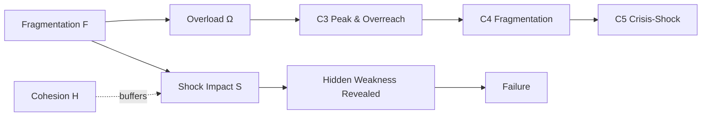
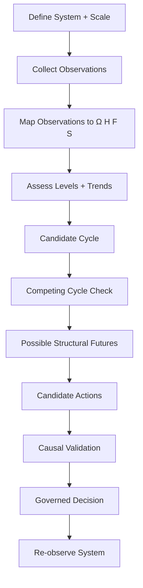
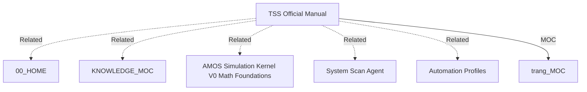

# TSS — THE TRANG SYSTEM™ OFFICIAL MANUAL

## Full English Canonical Expansion — 7 Cycles · 4 Variables · Governance/Economy Model · Source-Grounded · RSCF-Aware · Obsidian-Ready

> [!abstract] Canonical conclusion
> **Conclusion class: DERIVED from the supplied source**
>
> The supplied artifact defines **The Trang System™ (TSS)** as a source-claimed structural interpretation model created by **Trang Phan** for reasoning about systems shaped by human cooperation, conflict, and decision-making across multiple scales: **families, organizations, states, and civilizations**.
>
> Its visible architecture has three finite structural sets:
>
> $$
> \boxed{
> TSS=\{\text{4 Variables},\text{7 Cycles},\text{4 Long-Term Outcomes}\}
> }
> $$
>
> The four variables are:
>
> $$
> \boxed{X=(\Omega,H,F,S)}
> $$
>
> where:
>
> * \(\Omega\) = **Overload**
> * \(H\) = **Cohesion**
> * \(F\) = **Fragmentation**
> * \(S\) = **Shocks**
>
> The seven source-defined cycles are:
>
> $$
> \boxed{
> C1\rightarrow C2\rightarrow C3\rightarrow C4\rightarrow C5\rightarrow C6\rightarrow C7
> }
> $$
>
> corresponding to **Emergence → Expansion → Peak & Overreach → Fragmentation → Crisis–Shock → Collapse → Reset**.
>
> The supplied excerpt says the order is consistent across history and scale while duration varies, and says all surface-level events translate into changes in \(\Omega,H,F,S\). Those are **TSS source-model claims**, not independently established universal empirical laws. The excerpt does not supply the empirical validation, measurement functions, thresholds, transition equations, historical dataset, falsification protocol, or the details of the four long-term outcomes.
>
> Therefore the strongest safe characterization is:
>
> $$
> \boxed{
> TSS = CrossScaleStructuralModel
> }
> $$
>
> not:
>
> $$
> \boxed{
> TSS = EmpiricallyVerifiedUniversalLaw
> }
> $$
>
> The visible excerpt is also incomplete relative to its own architecture: it states that there are **four long-term outcomes**, but explicitly defers their definitions to the source. They must therefore remain **UNKNOWN/GAP** in this expansion rather than being invented.

---

# 1. Normalized Source Frontmatter

The following preserves the supplied metadata values. Escaping is normalized only for Markdown/YAML readability.

```yaml
---
title: TSS — The Trang System Official Manual (7 Cycles, 4 Variables)
created: '2026-08-22'
origin: Google Drive — _00_AMOS_CANON/training/TSS_Official_Manual.pdf
origin_architect: Trang Phan
type: training-manual
source: 11_KNOWLEDGE/trang

tags:
  - canon-group/governance
  - canon/model
  - rscf/claim
  - rscf/provenance
  - rscf/state/observation
  - rscf/T-topology
  - rscf/K-compression
  - rscf/mu-mutation
  - rscf/G-relation
  - topic/governance-economy-model
  - trang

status: active
provenance: VERIFIED
confidence: VERIFIED

rscf:
  state: SOURCE_CLAIM
  claim_class: SOURCE_CLAIM
  provenance: AMOS_corpus
  scope: AMOS_knowledge
---
```

No additional fields below should be treated as original source metadata.

---

# 2. Metadata Epistemic Tension

Three metadata signals coexist:

```yaml
provenance: VERIFIED
confidence: VERIFIED
rscf:
  state: SOURCE_CLAIM
  claim_class: SOURCE_CLAIM
```

These should not be flattened.

A source-safe interpretation is:

```text
provenance: VERIFIED
```

may describe verification of source/provenance identity.

```text
confidence: VERIFIED
```

is a source metadata assertion whose exact semantics are not defined here.

Meanwhile:

```text
rscf.state = SOURCE_CLAIM
rscf.claim_class = SOURCE_CLAIM
```

explicitly classify the substantive content epistemically.

Therefore:

$$
VerifiedProvenance
\neq
VerifiedUniversalTruth
$$

and:

$$
VerifiedSourceIdentity
\neq
EmpiricalValidationOfTSS
$$

---

# 3. Origin

Source:

```text
Google Drive — _00_AMOS_CANON/training/TSS_Official_Manual.pdf
```

This identifies the declared source path.

The supplied note additionally says:

```text
PDF, 185 pages extracted (101KB)
```

and:

```text
Author: Trang Phan
```

These remain source metadata claims in the supplied excerpt.

---

# 4. Origin Architect

Explicit:

```yaml
origin_architect: Trang Phan
```

Therefore authorship/origin architecture belongs to **Trang Phan**.

AMOS Universe should not claim independent authorship of TSS.

---

# 5. Artifact Type

```yaml
type: training-manual
```

This indicates that the artifact is intended as a manual/training resource.

It does not itself establish scientific validation.

---

# 6. Canon Group

```text
canon-group/governance
```

The source therefore positions TSS within governance canon.

---

# 7. Model Classification

Tag:

```text
canon/model
```

is especially important.

It is consistent with treating TSS as a **model** rather than automatically treating every proposition as an empirical universal law.

---

# 8. Topic Classification

```text
topic/governance-economy-model
```

The metadata associates TSS with governance/economy modeling.

The visible body, however, describes a broader system interpretation framework.

Therefore:

```text
GovernanceEconomyModel ⊂ VisibleTSSApplicationScope
```

is a plausible DERIVED reading, but the exact ontology is not supplied.

---

# 9. RSCF Tags

The source includes:

```text
rscf/T-topology
rscf/K-compression
rscf/mu-mutation
rscf/G-relation
```

No definitions of those four mechanisms are included in the visible TSS excerpt.

Therefore their exact binding to TSS remains:

```text
UNKNOWN/GAP
```

Do not invent equations for them from their names.

---

# 10. Purpose

Source:

> Provide a unified, science-based model to interpret system behavior across scales — families, organizations, states, civilizations.

This establishes the intended scope.

---

# 11. Four Explicit Scales

The visible source names:

1. families,
2. organizations,
3. states,
4. civilizations.

Thus:

$$
Scale_{visible}
=
\{
Family,
Organization,
State,
Civilization
\}
$$

---

# 12. Cross-Scale Claim

TSS claims structural forces repeat across systems shaped by:

```text
human cooperation
human conflict
human decision-making
```

This is a central source-model proposition.

---

# 13. Cross-Scale Firewall

Structural similarity across scales does not independently prove identical causal mechanisms.

Therefore:

$$
Pattern(Family)
\sim
Pattern(State)
$$

does not imply:

$$
Mechanism(Family)
=
Mechanism(State)
$$

unless independently established.

---

# 14. “Science-Based” Epistemic Status

The source describes TSS as:

```text
science-based
```

That is a **SOURCE_CLAIM**.

The supplied excerpt does not provide:

* scientific citations,
* datasets,
* statistical validation,
* peer review,
* measurement protocol,
* falsification tests,
* replication results,
* comparative benchmark.

Therefore:

$$
SourceSaysScienceBased
$$

is supported.

But:

$$
IndependentlyVerifiedScientificTheory
$$

is not established by this excerpt.

---

# 15. Intended Object of Analysis

TSS analyzes:

```text
system behavior
```

under cooperation, conflict, and decision-making.

It is therefore fundamentally a **system-state interpretation framework**.

---

# 16. Five Fundamental Questions — Count Tension

The source heading says:

```text
Five Fundamental Questions
```

but the supplied visible excerpt enumerates only:

1. What stage of development is this system in?
2. What forces are strengthening or weakening it? Is it stabilizing, drifting, or destabilizing?
3. What structural futures are possible or impossible?
4. What actions can meaningfully change its direction?

Only **four numbered questions are visible**.

This is a direct structural gap.

---

# 17. Question Count Invariant

Source heading:

$$
N_{declared}=5
$$

Visible enumeration:

$$
N_{visible}=4
$$

Therefore:

$$
5\neq4
$$

and:

```text
Question_5 = UNKNOWN/GAP
```

Do not invent the fifth question.

---

# 18. Competing Explanations for Missing Question 5

### H1 — Extraction omission

The PDF extraction omitted question 5.

### H2 — Source editing error

The heading was not updated after reducing the list.

### H3 — Formatting loss

Question 5 exists but was lost during note generation.

### H4 — Hidden continuation

The fifth question exists elsewhere in the 185-page source.

No discriminating evidence is present.

Status:

**COMPETING**.

---

# 19. Fundamental Question 1

> What stage of development is this system in?

This binds TSS to **state/cycle classification**.

Conceptually:

$$
SystemState
\rightarrow
CycleClassification
$$

---

# 20. Fundamental Question 2

> What forces are strengthening or weakening it? Is it stabilizing, drifting, or destabilizing?

This binds TSS to variable-state analysis.

Conceptually:

$$
(\Omega,H,F,S)
\rightarrow
StabilityAssessment
$$

The actual function is not supplied.

---

# 21. Stabilizing / Drifting / Destabilizing

These three terms appear in Question 2.

No formal thresholds are provided.

Therefore:

```text
STABILIZING
DRIFTING
DESTABILIZING
```

are source concepts but not mathematically operationalized in the excerpt.

---

# 22. Fundamental Question 3

> What structural futures are possible or impossible?

This introduces a **feasible-future-space** concept.

Conceptually:

$$
CurrentStructure
\rightarrow
PossibleFutureSet
$$

But no transition constraints are formally specified.

---

# 23. Fundamental Question 4

> What actions can meaningfully change its direction?

This introduces intervention/governance reasoning.

Conceptually:

$$
Action
\rightarrow
StateTrajectoryModification
$$

However, the excerpt supplies no causal intervention model.

---

# 24. Intervention Firewall

Because the model asks what actions can change direction, causal claims become especially important.

An observed association between an action and an outcome is insufficient to establish:

$$
do(Action)\rightarrow Outcome
$$

without causal evidence.

---

# 25. Three Finite Sets

Source explicitly defines:

1. four structural variables,
2. seven structural cycles,
3. four long-term outcomes.

Therefore:

$$
\boxed{
TSS=\{V_4,C_7,O_4\}
}
$$

---

# 26. Cardinality

$$
|V|=4
$$

$$
|C|=7
$$

$$
|O|=4
$$

---

# 27. Structural State Vector

A natural source-grounded representation is:

$$
\boxed{
X_t=
\begin{bmatrix}
\Omega_t\\
H_t\\
F_t\\
S_t
\end{bmatrix}
}
$$

This notation is DERIVED.

The source supplies the four variables but not vector notation or time indices.

---

# 28. Variable 1 — Overload

Source:

```text
Overload
Symbol: Ω
Meaning: Demand vs capacity
```

Thus:

$$
\Omega \sim Demand\ relative\ to\ Capacity
$$

The source does not provide an exact ratio.

---

# 29. Overload Is Not Explicitly a Ratio

It would be tempting to define:

$$
\Omega=\frac{Demand}{Capacity}
$$

but the source only says:

> Demand vs capacity.

Therefore the ratio formula is **not canonical**.

---

# 30. Candidate Overload Models

Possible mathematical implementations include:

$$
\Omega=D-C
$$

or:

$$
\Omega=\frac{D}{C}
$$

or normalized:

$$
\Omega=f(D,C)
$$

But all remain **MODEL/PROPOSED** until source evidence specifies the function.

---

# 31. Overload Impact

Source:

> Rising Ω → overreach (C3) → fragmentation (C4) → crisis (C5)

Thus a source-declared directional chain exists:

$$
\boxed{
\uparrow\Omega
\rightarrow
C3
\rightarrow
C4
\rightarrow
C5
}
$$

---

# 32. Overload Causal Strength

The arrow notation suggests directional structural relation in the model.

It does not establish that rising overload alone is sufficient for each transition.

No sufficiency/necessity conditions are supplied.

---

# 33. Variable 2 — Cohesion

Symbol:

$$
H
$$

Meaning:

> Internal unity: trust, legitimacy, coordination.

Thus \(H\) aggregates or represents at least three named concepts:

```text
trust
legitimacy
coordination
```

---

# 34. Cohesion Impact

Source:

> High H = stabilizing buffer against shocks.

Thus:

$$
High(H)
\rightarrow
ShockBuffer
$$

within the TSS model.

---

# 35. Buffer Does Not Mean Immunity

A stabilizing buffer does not imply:

$$
High(H)\Rightarrow NoFailure
$$

The source does not say high cohesion makes a system invulnerable.

---

# 36. Cohesion Composite Gap

No formula specifies whether:

$$
H=f(Trust,Legitimacy,Coordination)
$$

is:

* additive,
* multiplicative,
* minimum-bound,
* weighted,
* qualitative.

Unknown.

---

# 37. Variable 3 — Fragmentation

Symbol:

$$
F
$$

Meaning:

> Internal division: factions, silos, power splits.

Thus \(F\) represents at least:

```text
factions
silos
power splits
```

---

# 38. Fragmentation Impact

Source:

> High F magnifies overload and shocks.

Therefore the source defines interaction effects:

$$
High(F)
\rightarrow
Amplify(\Omega)
$$

and:

$$
High(F)
\rightarrow
Amplify(S)
$$

conceptually.

---

# 39. Amplification Function Unknown

No function such as:

$$
\Omega_{eff}=\Omega(1+F)
$$

is supplied.

Do not invent one.

---

# 40. Variable 4 — Shocks

Symbol:

$$
S
$$

Meaning:

> Disruptive events: wars, crises, pandemics.

Examples are source-defined:

```text
wars
crises
pandemics
```

---

# 41. Shock Impact

Source:

> Reveal hidden weaknesses; convert weaknesses to failure.

This gives shocks two modeled roles:

1. revelation,
2. conversion/amplification into failure.

---

# 42. Shock as Exogenous Versus Endogenous

The excerpt does not say shocks must be external.

Although examples may appear external, crises can potentially emerge internally.

Therefore:

```text
S = exclusively exogenous
```

is not established.

---

# 43. Shock Magnitude

No numerical shock magnitude scale exists.

---

# 44. Shock Frequency

No frequency parameter exists.

---

# 45. Shock Duration

No duration parameter exists.

---

# 46. Shock Type

No formal taxonomy beyond examples exists.

---

# 47. Four-Variable Table

| Variable      |     Symbol | Source meaning                  | Source impact                                    |
| ------------- | ---------: | ------------------------------- | ------------------------------------------------ |
| Overload      | \(\Omega\) | Demand vs capacity              | Rising Ω → C3 → C4 → C5                          |
| Cohesion      |      \(H\) | Trust, legitimacy, coordination | High H buffers shocks                            |
| Fragmentation |      \(F\) | Factions, silos, power splits   | High F magnifies overload/shocks                 |
| Shocks        |      \(S\) | Disruptive events               | Reveal weaknesses; convert weaknesses to failure |

---

# 48. Variable Typing

No source ranges are supplied.

Therefore do not assume:

$$
\Omega,H,F,S\in[0,1]
$$

or any other numeric interval.

---

# 49. Variable Units

No units are supplied.

---

# 50. Measurement Functions

No measurement equations exist.

Therefore:

$$
Measure(\Omega)=UNKNOWN
$$

$$
Measure(H)=UNKNOWN
$$

$$
Measure(F)=UNKNOWN
$$

$$
Measure(S)=UNKNOWN
$$

---

# 51. Key Insight

Source:

> All surface-level events translate into changes in Ω, H, F, or S.

This is one of the strongest claims in the excerpt.

---

# 52. Compression Interpretation

The four variables function as a compression space:

$$
SurfaceEvents
\rightarrow
(\Delta\Omega,\Delta H,\Delta F,\Delta S)
$$

This is DERIVED from the key insight.

---

# 53. K-Compression Correspondence

The metadata tag:

```text
rscf/K-compression
```

and the four-variable reduction are structurally compatible.

However, exact identity between this compression and formal AMOS `K-compression` is not established by the excerpt.

Therefore:

```text
TSS four-variable reduction ↔ K-compression
```

is **DERIVED**, not VERIFIED.

---

# 54. Compression Firewall

Reducing an event to four variables can aid structural reasoning.

But compression can lose information.

Therefore:

$$
CompressedState
\neq
CompleteDescriptionOfReality
$$

---

# 55. Universal Translation Claim

The phrase:

> All surface-level events...

is universal in wording.

The excerpt does not supply proof of exhaustive mapping.

Thus classify as:

```text
SOURCE_CLAIM / MODEL
```

not independently VERIFIED.

---

# 56. Multi-Variable Events

An event may plausibly affect more than one variable.

For example, a shock might:

* increase \(S\),
* increase \(\Omega\),
* increase \(F\),
* decrease \(H\).

The source does not say events map to exactly one variable.

---

# 57. Candidate Event Transformation

A useful model representation is:

$$
E_t
\rightarrow
\Delta X_t
=
(\Delta\Omega,\Delta H,\Delta F,\Delta S)
$$

DERIVED.

---

# 58. No Event Mapping Function

No explicit:

$$
M(E)=\Delta X
$$

is supplied.

---

# 59. Variable Interaction

The source explicitly supplies some interactions:

$$
F\uparrow
\Rightarrow
Amplify(\Omega,S)
$$

$$
H\uparrow
\Rightarrow
Buffer(S)
$$

$$
\Omega\uparrow
\Rightarrow
C3\rightarrow C4\rightarrow C5
$$

This establishes a partially coupled system.

---

# 60. No Full Dynamic Equation

There is no:

$$
X_{t+1}=f(X_t,E_t,A_t)
$$

in the excerpt.

Any such equation is proposed formalization only.

---

# 61. Seven Cycles

The source defines:

$$
C=\{C1,C2,C3,C4,C5,C6,C7\}
$$

---

# 62. Cycle 1 — Emergence

Source pattern:

```text
Ω low
H high
F low
S low
```

Thus:

$$
C1:
(\Omega_L,H_H,F_L,S_L)
$$

---

# 63. C1 Interpretation

Emergence corresponds to a system with:

* low overload,
* strong cohesion,
* little fragmentation,
* few/low shocks.

No threshold defines `low` or `high`.

---

# 64. C1 Threshold Gap

$$
Low(\Omega)=?
$$

$$
High(H)=?
$$

$$
Low(F)=?
$$

$$
Low(S)=?
$$

All unknown.

---

# 65. Cycle 2 — Expansion

Source:

```text
Ω rising
H strong
F manageable
```

No explicit \(S\) state is provided.

---

# 66. C2 Partial State

$$
C2:
(\Omega\uparrow,H_{strong},F_{manageable},S=?)
$$

The shock variable is unspecified.

Do not fill it.

---

# 67. “Strong” Versus “High”

C1 uses:

```text
H high
```

C2 uses:

```text
H strong
```

The excerpt does not define whether `strong` and `high` are identical categories.

---

# 68. “Manageable” Fragmentation

C2 says:

```text
F manageable
```

This is not necessarily equivalent to `F low`.

Preserve the distinction.

---

# 69. Cycle 3 — Peak & Overreach

Source:

```text
Ω high
H falling
F rising
```

No explicit \(S\) state.

Thus:

$$
C3:
(\Omega_H,H\downarrow,F\uparrow,S=?)
$$

---

# 70. C3 Is Dynamic

Unlike C1, C3 includes trends:

$$
H\downarrow
$$

$$
F\uparrow
$$

Thus cycle classification depends partly on derivatives/trends, not merely static levels.

---

# 71. State + Trend Model

TSS cycles therefore appear to use both:

$$
X_t
$$

and:

$$
\Delta X_t
$$

at least qualitatively.

This is DERIVED.

---

# 72. Cycle 4 — Fragmentation

Source:

```text
Ω high
H low
F high
```

No explicit shock state.

$$
C4:
(\Omega_H,H_L,F_H,S=?)
$$

---

# 73. C4 Structural Signature

Three explicit conditions:

```text
high overload
low cohesion
high fragmentation
```

This is one of the clearest cycle profiles.

---

# 74. Cycle 5 — Crisis–Shock

Source:

```text
S high
F high
H unstable
```

No explicit overload state.

$$
C5:
(\Omega=?,H_{unstable},F_H,S_H)
$$

---

# 75. C5 “Unstable”

`H unstable` is not equivalent to `H low`.

It may imply volatility or unpredictability rather than simply low cohesion.

No exact definition exists.

---

# 76. C5 Shock Dominance

C5 is the only cycle whose name explicitly includes shock and whose pattern explicitly specifies:

$$
S=high
$$

---

# 77. Cycle 6 — Collapse

Source:

```text
Ω unsustainable
F extreme
```

No explicit \(H\) or \(S\).

$$
C6:
(\Omega_{unsustainable},H=?,F_{extreme},S=?)
$$

---

# 78. “Unsustainable” Is Not “High”

The source distinguishes:

```text
Ω high
```

from:

```text
Ω unsustainable
```

Therefore do not collapse the terms.

---

# 79. “Extreme” Is Not Merely “High”

Likewise:

```text
F extreme
```

may represent a stronger category than:

```text
F high
```

No threshold hierarchy is formally defined, but lexical distinction should be preserved.

---

# 80. Cycle 7 — Reset

Source:

```text
Ω reducing
H rising
F decreasing
```

No explicit \(S\).

$$
C7:
(\Omega\downarrow,H\uparrow,F\downarrow,S=?)
$$

---

# 81. C7 Is Directional

C7 is defined predominantly through trends.

Thus reset is not merely a low-overload state; it is a **direction of structural change**.

---

# 82. Reset Does Not Mean Recovery Completed

Because the variables are:

```text
reducing
rising
decreasing
```

the source describes movement, not necessarily a completed healthy state.

---

# 83. Complete Cycle Table

| Cycle | Name             | \(\Omega\)    | \(H\)       | \(F\)      | \(S\)       |
| ----- | ---------------- | ------------- | ----------- | ---------- | ----------- |
| C1    | Emergence        | low           | high        | low        | low         |
| C2    | Expansion        | rising        | strong      | manageable | unspecified |
| C3    | Peak & Overreach | high          | falling     | rising     | unspecified |
| C4    | Fragmentation    | high          | low         | high       | unspecified |
| C5    | Crisis–Shock     | unspecified   | unstable    | high       | high        |
| C6    | Collapse         | unsustainable | unspecified | extreme    | unspecified |
| C7    | Reset            | reducing      | rising      | decreasing | unspecified |

This table makes source omissions explicit.

---

# 84. Missing Cycle Coordinates

Across 7 cycles × 4 variables there are:

$$
7\times4=28
$$

possible cycle-variable cells.

Explicitly specified:

* C1: 4
* C2: 3
* C3: 3
* C4: 3
* C5: 3
* C6: 2
* C7: 3

Total:

$$
4+3+3+3+3+2+3=21
$$

Therefore:

$$
28-21=7
$$

cycle-variable cells are unspecified in the visible excerpt.

---

# 85. Seven Explicitly Missing Cycle Coordinates

```text
C2.S
C3.S
C4.S
C5.Ω
C6.H
C6.S
C7.S
```

These must not be invented.

---

# 86. Cycle Order Claim

Source:

> Order is consistent across history and scale. Duration varies.

This is a major TSS claim.

---

# 87. Order Model

Source implies:

$$
C1\prec C2\prec C3\prec C4\prec C5\prec C6\prec C7
$$

where \(\prec\) denotes modeled sequence.

---

# 88. Duration Variability

If cycle duration varies:

$$
Duration(C_i,System_a)
\neq
Duration(C_i,System_b)
$$

may hold.

No duration function is supplied.

---

# 89. Universal Order Firewall

The statement that order is consistent across history and scale is a universal source claim.

The excerpt does not independently demonstrate it.

Therefore:

```text
UniversalCycleOrder = SOURCE_CLAIM / MODEL
```

---

# 90. Cycle Skipping

The source does not explicitly say whether a system can skip a cycle.

The phrase “order is consistent” suggests ordering constraints but does not fully resolve skipping.

Possible:

### H1

Every system passes all seven cycles.

### H2

Transitions preserve order but some cycles may be compressed/skipped observationally.

### H3

The model maps continuous states into seven stages, so apparent skipping is classification granularity.

Unknown.

---

# 91. Reverse Transitions

The excerpt does not explicitly say whether:

$$
C4\rightarrow C3
$$

can occur through successful intervention.

Question 4 implies actions can change direction, but no transition topology is given.

---

# 92. Reset-to-Emergence Transition

A natural cyclic interpretation would be:

$$
C7\rightarrow C1
$$

but the visible source does not explicitly state this edge.

Do not elevate it to source fact.

---

# 93. “Cycles” Versus Linear Stages

The term `cycles` suggests recurrence.

However, the excerpt only supplies ordered stages and reset.

Therefore recurrence is plausible but not formally specified.

---

# 94. T-Topology Correspondence

Metadata contains:

```text
rscf/T-topology
```

and TSS defines ordered structural cycles.

A correspondence is plausible:

```text
Cycle transition structure ↔ T-topology
```

but exact formal identity is not supplied.

Class:

**DERIVED**.

---

# 95. Topological Graph — Source-Conservative


These edges represent the visible stated order.

---

# 96. Do Not Add C7 → C1 as Canon

A dotted candidate edge could be modeled:


but it remains a hypothesis.

---

# 97. Cycle Classification Function

Conceptually:

$$
C_t=\Phi(X_t,\Delta X_t)
$$

where \(C_t\in\{C1,\ldots,C7\}\).

This is DERIVED.

No \(\Phi\) is supplied.

---

# 98. Classification Ambiguity

Suppose:

```text
Ω high
H high
F high
S low
```

No cycle exactly matches.

Therefore the source excerpt does not provide complete classification rules for every possible variable combination.

---

# 99. Mixed-State Problem

Real systems may contain signals associated with multiple cycles simultaneously.

No arbitration rule exists.

---

# 100. Cycle Confidence

No confidence mechanism exists for classification.

---

# 101. Cycle Boundary

No thresholds separate:

```text
low
manageable
rising
high
unsustainable
extreme
unstable
```

---

# 102. Cycle Membership May Be Fuzzy

Because descriptors are qualitative and incomplete, a fuzzy or probabilistic classification is possible as an implementation model.

But the source does not say this.

---

# 103. Deterministic Classification Not Established

Do not claim TSS can deterministically classify any arbitrary system from the excerpt alone.

---

# 104. Overload Trajectory

Visible source progression:

$$
Low
\rightarrow
Rising
\rightarrow
High
\rightarrow
High
\rightarrow
?
\rightarrow
Unsustainable
\rightarrow
Reducing
$$

This is a useful source-grounded longitudinal view.

---

# 105. Cohesion Trajectory

$$
High
\rightarrow
Strong
\rightarrow
Falling
\rightarrow
Low
\rightarrow
Unstable
\rightarrow
?
\rightarrow
Rising
$$

---

# 106. Fragmentation Trajectory

$$
Low
\rightarrow
Manageable
\rightarrow
Rising
\rightarrow
High
\rightarrow
High
\rightarrow
Extreme
\rightarrow
Decreasing
$$

This is the most continuously specified variable across cycles.

---

# 107. Shock Trajectory

$$
Low
\rightarrow
?
\rightarrow
?
\rightarrow
?
\rightarrow
High
\rightarrow
?
\rightarrow
?
$$

Shock is sparsely specified except C1/C5.

---

# 108. Fragmentation as Strong Cycle Marker

Because \(F\) is specified in all seven cycles, fragmentation is the most continuously visible cycle coordinate in the excerpt.

This is a DERIVED structural observation.

---

# 109. Overload Coverage

\(\Omega\) is specified in six of seven cycles, absent only C5.

---

# 110. Cohesion Coverage

\(H\) is specified in six of seven cycles, absent only C6.

---

# 111. Shock Coverage

\(S\) is specified in only two of seven cycles.

Thus the excerpt does not support treating shock as a continuously defined stage discriminator.

---

# 112. Variable Coverage Counts

| Variable   | Cycles explicitly specifying it |
| ---------- | ------------------------------: |
| \(\Omega\) |                               6 |
| \(H\)      |                               6 |
| \(F\)      |                               7 |
| \(S\)      |                               2 |

---

# 113. Cycle Descriptor Density

| Cycle | Explicit variable descriptors |
| ----- | ----------------------------: |
| C1    |                             4 |
| C2    |                             3 |
| C3    |                             3 |
| C4    |                             3 |
| C5    |                             3 |
| C6    |                             2 |
| C7    |                             3 |

C6 is the sparsest.

---

# 114. C6 Interpretation Gap

Collapse is characterized only by:

```text
Ω unsustainable
F extreme
```

The state of cohesion and shocks is not given.

Do not infer:

```text
H = zero
S = high
```

even if intuitively plausible.

---

# 115. C5 Overload Gap

Given the earlier chain:

$$
\uparrow\Omega\rightarrow C3\rightarrow C4\rightarrow C5
$$

one might expect high overload in C5.

But C5's explicit row does not state it.

Therefore:

```text
C5.Ω = UNKNOWN
```

from the table.

---

# 116. Long-Term Outcomes

The source states:

```text
Long-Term Outcomes (4)
Represent all possible endings.
(Details in source.)
```

No outcome names or definitions are supplied.

---

# 117. Outcome Cardinality

We may safely preserve:

$$
|O|=4
$$

---

# 118. Outcome Identity

$$
O=\{O_1,O_2,O_3,O_4\}
$$

can be used as placeholders.

Their names and meanings are unknown.

---

# 119. Do Not Invent Outcomes

It would be unsafe to infer labels such as:

```text
collapse
recovery
stagnation
transformation
```

even if plausible.

The source explicitly says details are elsewhere.

---

# 120. “All Possible Endings” Claim

The source says the four outcomes represent all possible endings.

This is another universal model claim.

Without outcome definitions and proof of exhaustiveness:

```text
OutcomeExhaustiveness = SOURCE_CLAIM
```

---

# 121. Outcome Function

Conceptually:

$$
O_\infty=\Psi(Trajectory)
$$

where:

$$
O_\infty\in\{O_1,O_2,O_3,O_4\}
$$

DERIVED notation only.

---

# 122. Cycle Is Not Outcome

Do not equate:

```text
C6 Collapse
```

with one of the four long-term outcomes automatically.

A cycle is part of the seven-cycle set; outcomes are a separate finite set.

---

# 123. Reset Is Not Necessarily Outcome

Likewise C7 Reset is a cycle, not automatically one of the four long-term outcomes.

---

# 124. Three-Layer Model

TSS visibly separates:

### Variables

Current structural forces.

### Cycles

Developmental structural state.

### Outcomes

Long-term terminal/structural futures.

Thus:

$$
Variables
\rightarrow
Cycles
\rightarrow
Outcomes
$$

is a plausible high-level architecture.

---

# 125. Causal Direction Not Fully Established

The model may instead involve feedback:

$$
Variables\leftrightarrow Cycles
$$

because cycle states themselves may affect variables.

No full causal graph is supplied.

---

# 126. Candidate TSS Runtime — Model Only

A conceptual reasoning pipeline:

```text
Observed Events
    ↓
Map to Ω/H/F/S
    ↓
Assess Levels + Trends
    ↓
Classify Structural Cycle
    ↓
Evaluate Possible Futures
    ↓
Identify Interventions
    ↓
Reassess Variables
```

This is DERIVED from the manual's questions and finite sets.

---

# 127. Event-to-Variable Layer

$$
E
\rightarrow
X
$$

---

# 128. Variable-to-Cycle Layer

$$
X,\Delta X
\rightarrow
C
$$

---

# 129. Cycle-to-Future Layer

$$
C,X
\rightarrow
FutureSet
$$

---

# 130. Action Layer

$$
Action
\rightarrow
\Delta X
\rightarrow
Trajectory
$$

This is a conceptual intervention model, not supplied mathematics.

---

# 131. TSS State Representation — Proposed

```yaml
tss_state:
  system:
    id: ...
    scale: ...

  variables:
    overload:
      symbol: Ω
      state: UNKNOWN
      trend: UNKNOWN

    cohesion:
      symbol: H
      state: UNKNOWN
      trend: UNKNOWN

    fragmentation:
      symbol: F
      state: UNKNOWN
      trend: UNKNOWN

    shocks:
      symbol: S
      state: UNKNOWN
      trend: UNKNOWN

  cycle:
    candidate: UNKNOWN
    confidence: UNKNOWN

  outcome:
    candidate: UNKNOWN

  evidence:
    - ...

  competing_classifications:
    - ...

  gaps:
    - ...
```

PROPOSED.

---

# 132. Evidence Requirement

Any real-world TSS classification requires observations about the analyzed system.

The manual excerpt itself cannot supply those observations for arbitrary systems.

---

# 133. Observation Is Not Variable Value

For example:

```text
Employee turnover increased.
```

is an observation.

Mapping it to:

```text
F rising
```

requires an interpretive bridge.

---

# 134. Mapping Requires Justification

A TSS analysis should preserve:

```text
observation
→ mapping rationale
→ variable effect
```

rather than jumping directly to cycle.

---

# 135. Multi-Mapping

One observation can potentially affect several variables.

Example model:

```text
Leadership legitimacy crisis
→ H decreases
→ F increases
→ Ω may increase
```

But each mapping must be supported in context.

---

# 136. Context Dependence

The same event may have different effects in different systems.

Thus:

$$
Effect(E,System_A)
\neq
Effect(E,System_B)
$$

is possible.

---

# 137. Scale Dependence

A pattern at family scale may not use the same measurements as state scale.

Therefore:

$$
Measure_H^{Family}
\neq
Measure_H^{State}
$$

may be necessary.

The source does not supply measurement adapters.

---

# 138. Cross-Scale Semantic Stability

The variable names are intended to persist across scale.

The indicators used to estimate them may vary.

This is a strong DERIVED interpretation of the cross-scale model.

---

# 139. Scale Firewall

Never silently transfer a threshold from one scale to another.

No thresholds exist here anyway.

---

# 140. Regime Firewall

A system under war, pandemic, technological disruption, constitutional transition, or stable growth may occupy different regimes.

The source does not supply explicit regime logic.

---

# 141. Historical Application

The source claims consistency across history.

No historical cases are included in the supplied excerpt.

Therefore no specific civilization or historical event should be classified from this source alone.

---

# 142. No Historical Dataset

The excerpt contains no dataset of:

```text
states
empires
organizations
families
civilizations
dates
cycle assignments
```

---

# 143. No Backtest

No predictive backtest is supplied.

---

# 144. No Forecast Accuracy

No forecast performance is supplied.

---

# 145. No Classification Accuracy

No ground-truth cycle labels exist in the excerpt.

---

# 146. No Inter-Rater Reliability

No evidence shows different analysts consistently classify the same system into the same TSS cycle.

---

# 147. No Sensitivity/Specificity

No diagnostic performance metrics exist.

---

# 148. No Statistical Validation

No confidence intervals, p-values, effect sizes, likelihoods, or Bayesian posterior estimates are supplied.

---

# 149. No Falsification Criteria

The excerpt does not state what empirical observation would falsify:

> cycle order is consistent across history and scale.

This is a critical scientific-validation gap.

---

# 150. Universal Claim Test

A universal claim:

$$
\forall System,\ Order=C1\ldots C7
$$

would be falsified by a valid system trajectory outside that order, assuming definitions and observations were clear.

But the source does not state this formal falsifier.

---

# 151. Classification Circularity Risk

If cycle definitions are flexible enough to reinterpret any event after the fact, the model could become difficult to falsify.

No source protocol addresses this risk.

---

# 152. Retrospective Fit Risk

Historical patterns may appear cyclical after interpretation.

That does not automatically establish predictive power.

---

# 153. Prediction Versus Explanation

$$
RetrospectiveExplanation
\neq
ProspectivePrediction
$$

---

# 154. Structural Future Claim

Question 3 asks what futures are possible or impossible.

To make this operational, TSS would need transition constraints.

Those are not included.

---

# 155. Possible Future Set — Proposed

$$
\mathcal F(X_t,C_t)
=
\{FutureStates\ reachable\ from\ current\ structure\}
$$

PROPOSED.

---

# 156. Impossible Future

A future should only be called structurally impossible if the model supplies a constraint excluding it.

The excerpt does not provide such formal constraints.

Therefore strong impossibility claims require more source detail.

---

# 157. Intervention Claim

Question 4 asks what actions can meaningfully change direction.

This implies actionability is part of TSS.

But no intervention catalog is visible.

---

# 158. Intervention Function — Proposed

$$
X_{t+1}
=
f(X_t,S_t,A_t)
$$

where \(A_t\) represents intervention.

Not canonical.

---

# 159. Intervention Objective — Model

Potentially:

$$
\downarrow\Omega
$$

$$
\uparrow H
$$

$$
\downarrow F
$$

$$
ReduceImpact(S)
$$

would appear structurally stabilizing from the variable definitions.

But the source does not provide a universal optimization function.

---

# 160. Cohesion Maximization Is Not Automatically Optimal

High cohesion is described as stabilizing.

But unlimited cohesion could theoretically interact with conformity or suppression in ways not modeled here.

The excerpt does not address this.

Therefore do not turn:

$$
H\uparrow
$$

into an unconstrained universal optimization objective.

---

# 161. Fragmentation Minimization Is Not Automatically Zero

The source treats high fragmentation negatively, but it does not state:

$$
OptimalF=0
$$

Do not infer that all differentiation/plurality is pathological.

---

# 162. Overload Minimization Is Not Zero-Demand

The source defines overload as demand versus capacity.

Therefore reducing overload could involve:

* reducing demand,
* increasing capacity,
* both.

But no action rule is supplied.

---

# 163. Shock Control

Many shocks may not be preventable.

The source emphasizes cohesion as a buffer, suggesting resilience may matter alongside prevention.

This is DERIVED.

---

# 164. Resilience Interpretation

Conceptually:

$$
Resilience
\sim
HighH
+
ManageableF
+
Sustainable\Omega
$$

but `resilience` is not explicitly defined as a TSS variable.

---

# 165. Stability Interpretation

Likewise stability is discussed but not formalized.

---

# 166. Drift Interpretation

No drift equation exists.

A possible model:

$$
Drift=\frac{dX}{dt}
$$

is not source-defined.

---

# 167. Destabilization Interpretation

The source implies:

* overload rising,
* cohesion falling,
* fragmentation rising,
* shocks high

are destabilizing signals.

But no aggregate destabilization index exists.

---

# 168. No TSS Score

The source does not define:

```text
TSS score
system health score
collapse probability
resilience score
cycle probability
```

Do not invent one.

---

# 169. No Probability of Collapse

C6 is a cycle label.

No equation gives:

$$
P(Collapse)
$$

---

# 170. No Timeline Prediction

Cycle duration varies.

No function predicts:

```text
months to C4
years to C5
probability of reset
```

---

# 171. No Deterministic Date Forecast

Therefore TSS cannot source-groundedly produce exact dates from this excerpt.

---

# 172. Governance Use

TSS can structurally support governance reasoning by asking:

```text
Where are we?
What is changing?
What futures remain feasible?
What interventions matter?
```

These derive directly from the fundamental questions.

---

# 173. Governance Does Not Mean Control

A system can be influenced without being fully controllable.

The excerpt does not claim perfect control.

---

# 174. Human Agency

Question 4 preserves room for meaningful intervention.

Therefore TSS is not purely fatalistic in the visible excerpt.

---

# 175. Structural Constraint + Agency

A useful interpretation:

$$
Future
=
StructuralConstraints
+
Actions
+
Shocks
$$

but no formal equation exists.

---

# 176. Path Dependence

Because stages are ordered, TSS implies some form of path dependence.

DERIVED.

---

# 177. Memory of Prior State

If path dependence matters, current variables alone may not fully determine cycle without trajectory/history.

This is especially relevant because C2/C3/C7 use trends.

---

# 178. State Is Not Enough

For example:

$$
H=medium
$$

could mean:

* falling from high,
* rising from low.

Those trajectories may correspond to different cycles.

Thus:

$$
X_t
$$

alone may be insufficient.

---

# 179. Extended State

A better conceptual state is:

$$
Z_t=(X_t,\dot X_t)
$$

where \(\dot X_t\) captures trends.

This is DERIVED.

---

# 180. Further Path State

Potentially:

$$
Z_t=(X_t,\dot X_t,C_{t-1})
$$

could reduce ambiguity.

Again not source-defined.

---

# 181. Cycle Hysteresis

Because direction matters, entry and exit conditions may differ.

No hysteresis model is supplied.

---

# 182. Transition Threshold Gap

No condition says:

$$
C2\rightarrow C3
\quad iff\quad
\Omega>x
$$

or similar.

---

# 183. C3 → C4

The source's overload chain explicitly associates overreach C3 with fragmentation C4.

But no threshold is supplied.

---

# 184. C4 → C5

Likewise crisis follows fragmentation in the source chain.

No shock trigger threshold is supplied.

---

# 185. C5 → C6

The cycle table order implies crisis precedes collapse.

But not every crisis necessarily collapses unless the source elsewhere says so.

The excerpt does not supply sufficiency.

---

# 186. C6 → C7

Order places reset after collapse.

Whether all collapses produce reset is not established.

---

# 187. Intervention Before Collapse

Question 4 suggests direction may be changed, potentially before C6.

But no explicit recovery edges are visible.

---

# 188. Competing Transition Models

### Model A — Strict sequence

$$
C1\rightarrow C2\rightarrow C3\rightarrow C4\rightarrow C5\rightarrow C6\rightarrow C7
$$

### Model B — Ordered backbone with recovery branches

Systems may reverse/stabilize before collapse.

### Model C — Classification cycle

The seven stages describe archetypes rather than literal mandatory transitions.

The excerpt most directly supports the ordered backbone but does not fully discriminate A/B/C.

---

# 189. Structural Futures

Under Model B, intervention could alter trajectory before later cycles.

Under strict Model A, intervention might only change speed/intensity.

The source's fourth question makes Model B plausible, but not proven.

---

# 190. Strongest Safe Transition Claim

$$
\boxed{
TSS\ source\ presents\ C1...C7\ in\ a\ consistent\ order
}
$$

Do not strengthen this to:

$$
EverySystemMustAlwaysTraverseEveryCycleWithoutException
$$

without the full manual.

---

# 191. Four Outcomes Gap Is Critical

The title emphasizes 7 cycles and 4 variables, but the body explicitly says four outcomes represent all endings.

Since the outcomes are missing, a complete TSS predictive/terminal model cannot be reconstructed from this excerpt.

---

# 192. Minimum Missing Information

For full TSS canon:

1. names of four outcomes,
2. definitions of four outcomes,
3. mapping from cycles/variables to outcomes,
4. fifth fundamental question,
5. variable measurement definitions,
6. cycle transition criteria.

---

# 193. Source Retrieval Priority

The declared source:

```text
_00_AMOS_CANON/training/TSS_Official_Manual.pdf
```

is the highest-value artifact for resolving those gaps.

---

# 194. Source Note Versus Full PDF

The supplied note says the PDF contains 185 pages.

The visible excerpt is clearly a compression.

Therefore:

$$
VisibleNote
\subset
DeclaredFullManual
$$

according to source metadata.

---

# 195. Do Not Invent Missing 185-Page Content

The size of the declared manual does not authorize reconstruction from intuition.

---

# 196. RSCF Provenance

Frontmatter:

```yaml
provenance: AMOS_corpus
scope: AMOS_knowledge
```

Thus all visible TSS claims share AMOS corpus ancestry.

---

# 197. Internal Repetition Is Not Independent Confirmation

If the same TSS claim appears in multiple AMOS notes derived from the manual, they may share one origin.

$$
MultipleAMOSDescendants
\neq
IndependentEmpiricalSources
$$

---

# 198. Source Versus Observation Metadata

Tag:

```text
rscf/state/observation
```

coexists with:

```yaml
rscf:
  state: SOURCE_CLAIM
```

This is a typed metadata tension.

---

# 199. Observation Tag Conflict

Possible interpretations:

### H1

The tag categorizes the note as observation-oriented.

### H2

It reflects an earlier RSCF state.

### H3

Nested `rscf.state` has precedence.

### H4

Tags and structured metadata encode different dimensions.

No precedence rule is supplied.

Preserve both.

---

# 200. Do Not Silently Promote to OBSERVATION

The structured RSCF state explicitly says:

```text
SOURCE_CLAIM
```

Therefore substantive TSS propositions should remain source claims unless separately observed/validated.

---

# 201. Provenance VERIFIED Versus RSCF SOURCE_CLAIM

A useful typed interpretation:

```text
Provenance verification:
  source identity/origin confidence

Epistemic claim class:
  substantive truth status
```

This reconciles them without changing either field.

Class: DERIVED.

---

# 202. Confidence VERIFIED Ambiguity

The scalar/enum semantics of:

```yaml
confidence: VERIFIED
```

are unknown.

Do not translate it into:

```text
100% probability
```

---

# 203. Trademark

The body uses:

```text
The Trang System™
```

Preserve the source designation.

No trademark registration status is established by the symbol alone.

---

# 204. Official Manual

The title says:

```text
Official Manual
```

Within the corpus this is a source designation.

It does not independently establish legal publication status or external institutional endorsement.

---

# 205. TSS Core Ontology

```text
SYSTEM
├── EVENTS
├── VARIABLES
│   ├── Ω Overload
│   ├── H Cohesion
│   ├── F Fragmentation
│   └── S Shocks
├── CYCLE
│   ├── C1 Emergence
│   ├── C2 Expansion
│   ├── C3 Peak & Overreach
│   ├── C4 Fragmentation
│   ├── C5 Crisis–Shock
│   ├── C6 Collapse
│   └── C7 Reset
├── FUTURES
├── ACTIONS
└── OUTCOMES
    ├── O1 UNKNOWN
    ├── O2 UNKNOWN
    ├── O3 UNKNOWN
    └── O4 UNKNOWN
```

DERIVED ontology from visible source.

---

# 206. Core Relations

```text
EVENT AFFECTS VARIABLE
VARIABLE CHARACTERIZES CYCLE
CYCLE CONSTRAINS FUTURE
ACTION MAY ALTER DIRECTION
TRAJECTORY LEADS_TO OUTCOME
```

The first four are strongly supported conceptually; exact relation semantics remain model-level.

---

# 207. G-Relation Correspondence

Metadata:

```text
rscf/G-relation
```

could correspond to these structural relations.

But the formal G-relation definition is not supplied.

Status: DERIVED/UNKNOWN.

---

# 208. μ-Mutation Correspondence

Metadata:

```text
rscf/mu-mutation
```

could relate to state change/intervention.

However, no explicit \(\mu\) operator appears in the visible manual.

Do not invent:

$$
\mu(X)=...
$$

---

# 209. TSS as Compression Architecture

At a high level:

$$
ComplexHumanSystem
\rightarrow
4Variables
\rightarrow
7Cycles
\rightarrow
4Outcomes
$$

This is the strongest compact architecture supported by the excerpt.

---

# 210. Compression Ratio Is Undefined

No count of raw system variables exists.

Therefore no quantitative compression ratio can be calculated.

---

# 211. Model Granularity

The four variables are highly abstract.

They may compress heterogeneous phenomena into common structural categories.

This is the intended source logic.

---

# 212. Ontological Risk

Two events may both increase \(F\) while differing radically in mechanism and ethics.

Therefore TSS variable equivalence does not imply event equivalence.

---

# 213. Example Structural Equivalence

If two systems both exhibit:

```text
Ω high
H falling
F rising
```

TSS may classify both as C3-like.

But this does not mean their histories, institutions, or causal mechanisms are identical.

---

# 214. Structural Isomorphism Firewall

$$
SameTSSCoordinates
\not\Rightarrow
SameSystem
$$

---

# 215. Causal Isomorphism Firewall

$$
SameTSSCycle
\not\Rightarrow
SameCause
$$

---

# 216. Policy Transfer Firewall

$$
SameTSSCycle
\not\Rightarrow
SameInterventionWorks
$$

This is especially important across family/state/civilization scales.

---

# 217. Scale-Specific Intervention

An action appropriate for an organization may be inappropriate or impossible for a state.

Thus intervention must inherit scope.

---

# 218. Measurement Scale

Trust in a family and legitimacy in a state may require different indicators.

The model's abstract \(H\) does not remove measurement differences.

---

# 219. Cross-Scale Model

TSS is therefore best understood as a **cross-scale abstraction layer**, not evidence that all scale-specific mechanisms collapse into one mechanism.

---

# 220. System Boundary Problem

Before applying TSS, the analyst must define:

```text
What is the system?
```

The excerpt does not explicitly list this as a fundamental question, but classification cannot be scoped otherwise.

---

# 221. Boundary Sensitivity

Different system boundaries may produce different variable assessments.

Example:

```text
organization
vs
department
vs
business unit
```

may occupy different cycles.

---

# 222. Nested Systems

Families exist inside communities; organizations inside states; states inside global systems.

The source says TSS works across scales but does not define nested-cycle interactions.

---

# 223. Multi-Scale State

A state could be C3 while one institution is C5-like.

No aggregation rule exists.

---

# 224. Fractal-Like Interpretation

Repeated structural patterns across scale may look fractal.

But:

$$
CrossScaleSimilarity
\neq
ProvenFractalGeometry
$$

No fractal dimension is supplied.

---

# 225. Nested-System Coupling

No equation defines:

$$
X^{parent}
\leftrightarrow
X^{child}
$$

---

# 226. Shock Propagation Across Scales

A shock at state level may affect organizations and families.

Plausible, but no propagation equation exists.

---

# 227. Cohesion Across Scales

High organizational cohesion does not automatically imply high societal cohesion.

---

# 228. Fragmentation Across Scales

Fragmentation in one subsystem may coexist with cohesion at another scale.

---

# 229. Overload Across Scales

Capacity is scale-specific.

Therefore \(\Omega\) cannot be assumed numerically comparable across scales without normalization.

---

# 230. Variable Comparability Gap

No normalization allows:

$$
\Omega_{family}=0.7
$$

to be compared with:

$$
\Omega_{state}=0.7
$$

because no numeric scale exists at all.

---

# 231. TSS Analysis Minimum Input — Proposed

```yaml
system:
  name: ...
  boundary: ...
  scale: ...
  time_window: ...

observations:
  - ...

variable_evidence:
  overload:
    evidence: []
  cohesion:
    evidence: []
  fragmentation:
    evidence: []
  shocks:
    evidence: []

candidate_cycle: ...
competing_cycles: ...
gaps: ...
```

---

# 232. Time Window

A cycle classification must implicitly refer to a time period.

No default time window is supplied.

---

# 233. Temporal Granularity

A family may change over weeks; civilizations over centuries.

The source explicitly says duration varies, supporting scale-dependent temporal granularity.

---

# 234. Duration Function

Conceptually:

$$
D_i=f(System,Scale,Context,History)
$$

but no source function exists.

---

# 235. No Fixed Duration

Do not assign:

```text
C1 = 5 years
C2 = 20 years
```

etc.

---

# 236. No Fixed Historical Periodicity

The word `cycles` does not imply periodic oscillation of fixed wavelength.

---

# 237. Cycle ≠ Periodic Wave

$$
Cycle
\neq
SinusoidalPeriodicity
$$

unless the full source says otherwise.

---

# 238. Shock Timing

C5 centers shocks, but shocks can conceptually occur earlier.

The source says high H buffers shocks, including in contexts such as C1.

Thus shock events need not be exclusive to C5.

---

# 239. C5 Distinction

C5 may represent a structural condition where shock becomes crisis-defining rather than merely present.

This is a plausible DERIVED interpretation.

---

# 240. Hidden Weakness

Source says shocks reveal hidden weaknesses.

Therefore pre-shock state matters.

---

# 241. Shock as Stress Test

A useful model analogy:

$$
Shock
\rightarrow
ExposeLatentStructuralWeakness
$$

But analogy does not prove a formal stress-test mechanism.

---

# 242. Shock Conversion

Source additionally says shocks:

> convert weaknesses to failure.

Thus latent weakness and actual failure are distinguished.

---

# 243. Weakness ≠ Failure

$$
Weakness
\neq
Failure
$$

A shock can mediate transition.

---

# 244. Mediation Model — Candidate

$$
Weakness
\xrightarrow{Shock}
Failure
$$

This closely paraphrases the source but remains conceptual.

---

# 245. Fragmentation Amplification

Source:

$$
F_H
\Rightarrow
Amplify(\Omega,S)
$$

This suggests a positive feedback risk.

---

# 246. Potential Feedback Loop — Derived

$$
\Omega\uparrow
\rightarrow
F\uparrow
\rightarrow
Effective\Omega\uparrow
$$

A reinforcing loop is plausible.

---

# 247. Cohesion Buffer Loop

Potentially:

$$
H\uparrow
\rightarrow
ShockImpact\downarrow
$$

which stabilizes system state.

---

# 248. No Quantitative Gain

No amplification coefficient or buffer coefficient exists.

---

# 249. Candidate System Dynamics

A purely conceptual model might be:

$$
\dot{\Omega}=f_\Omega(...)
$$

$$
\dot H=f_H(...)
$$

$$
\dot F=f_F(...)
$$

$$
\dot S=f_S(...)
$$

but none is source-defined.

---

# 250. Do Not Fabricate Differential Equations

The TSS excerpt is qualitative.

Formalization should preserve that epistemic boundary.

---

# 251. Cycle Signatures as Qualitative Predicates

A safer formalization is predicate-based.

For C1:

$$
C1(X)
=
Low(\Omega)
\land
High(H)
\land
Low(F)
\land
Low(S)
$$

---

# 252. C2 Predicate

$$
C2(X,\Delta X)
=
Rising(\Omega)
\land
Strong(H)
\land
Manageable(F)
$$

No \(S\) predicate.

---

# 253. C3 Predicate

$$
C3(X,\Delta X)
=
High(\Omega)
\land
Falling(H)
\land
Rising(F)
$$

---

# 254. C4 Predicate

$$
C4(X)
=
High(\Omega)
\land
Low(H)
\land
High(F)
$$

---

# 255. C5 Predicate

$$
C5(X)
=
High(S)
\land
High(F)
\land
Unstable(H)
$$

---

# 256. C6 Predicate

$$
C6(X)
=
Unsustainable(\Omega)
\land
Extreme(F)
$$

---

# 257. C7 Predicate

$$
C7(X,\Delta X)
=
Reducing(\Omega)
\land
Rising(H)
\land
Decreasing(F)
$$

---

# 258. Predicate Definitions Missing

All qualitative functions remain undefined:

```text
Low()
High()
Strong()
Manageable()
Rising()
Falling()
Unstable()
Unsustainable()
Extreme()
Reducing()
Decreasing()
```

---

# 259. Classification Cannot Be Mechanically Executed

Until those predicates are operationalized, TSS cycle classification requires human/model interpretation.

---

# 260. Contradictory Predicate Case

If a system is:

```text
Ω high
H rising
F high
S high
```

it partially matches C4, C5, and recovery-like C7 signals.

No conflict resolver exists.

---

# 261. Preserve Competing Cycles

A high-integrity implementation should permit:

```yaml
candidate_cycles:
  - C4
  - C5
  - C7
```

with reasons rather than forcing false precision.

---

# 262. Cycle Confidence Ceiling

Classification confidence cannot exceed confidence in the load-bearing variable assessments.

$$
C(Cycle)
\leq
\min
\{
C(\Omega),C(H),C(F),C(S)
\}_{load-bearing}
$$

DERIVED AMOS rule.

---

# 263. Missing Variable Does Not Always Block Classification

Because many cycle rows omit one variable, classification may sometimes rely on a partial signature.

But no source rule specifies sufficiency.

Therefore confidence should remain bounded.

---

# 264. C1 Is Most Fully Specified

C1 is the only cycle with all four variable descriptors.

Thus it has the most complete visible signature.

---

# 265. C6 Is Least Fully Specified

C6 has only two descriptors.

Thus its visible signature has the highest underdetermination.

---

# 266. Cycle Overlap

No source guarantee says the predicates are mutually exclusive.

Therefore:

$$
C_i\cap C_j
$$

may be nonempty under qualitative interpretation.

---

# 267. No Partition Proof

The seven cycles are not proven to form a mathematical partition of all possible \((\Omega,H,F,S)\) states.

---

# 268. Outcome Exhaustiveness Versus Cycle Exhaustiveness

The source explicitly says four outcomes represent all possible endings.

It does not explicitly say seven cycle signatures represent every possible instantaneous state.

Keep those claims distinct.

---

# 269. Structural Stage Versus Surface Event

A surface event should not automatically define the cycle.

Example:

```text
pandemic occurs
```

raises \(S\), but system cycle depends on broader structural variables.

---

# 270. Shock Alone Does Not Imply C5

C5 requires:

```text
S high
F high
H unstable
```

in the visible table.

Thus:

$$
High(S)
\not\Rightarrow
C5
$$

from the visible signature.

---

# 271. High Overload Alone Does Not Imply C3

C3 also includes:

```text
H falling
F rising
```

Thus:

$$
High(\Omega)
\not\Rightarrow
C3
$$

under the visible signature.

---

# 272. High Fragmentation Alone Does Not Imply C4

C4 also requires high overload and low cohesion in the table.

---

# 273. Collapse Is Not One Indicator

C6 explicitly requires at least:

```text
Ω unsustainable
F extreme
```

Thus high overload alone is not enough.

---

# 274. Reset Is Not Low Overload

Reset is directional:

```text
Ω reducing
H rising
F decreasing
```

---

# 275. Trend Matters

Therefore:

$$
Level
+
Direction
$$

are both structurally relevant.

---

# 276. TSS Structural Derivative

A compact DERIVED representation:

$$
TSSState_t=(X_t,\Delta X_t,C_t)
$$

---

# 277. Historical Memory

Because cycle order matters:

$$
C_{t-1}
$$

may also be relevant.

---

# 278. Full Candidate State

$$
Z_t=(X_t,\Delta X_t,C_{t-1},Context_t)
$$

PROPOSED.

---

# 279. Governance Action

A governance intervention could conceptually target:

```text
capacity
demand
trust
legitimacy
coordination
factions
silos
power splits
shock exposure
shock resilience
```

Only the underlying concepts are source-derived; action targeting is a DERIVED extension.

---

# 280. Action Must Respect Mechanism

Reducing fragmentation cannot be assumed achievable through any generic intervention.

Mechanism and context matter.

---

# 281. Ethical Firewall

Because TSS can be applied to human systems, structural optimization should not justify manipulation, coercion, or suppression merely to increase a variable such as cohesion.

The source excerpt does not supply an ethics framework.

Therefore broader governance safeguards remain necessary.

---

# 282. Cohesion ≠ Uniformity

The source defines cohesion as unity involving trust, legitimacy, coordination.

It does not define cohesion as elimination of disagreement.

---

# 283. Fragmentation ≠ Diversity

The source defines fragmentation through:

```text
factions
silos
power splits
```

Do not automatically equate ordinary diversity or pluralism with harmful fragmentation.

---

# 284. Shock ≠ Disagreement

Shock refers to disruptive events, with wars/crises/pandemics as examples.

---

# 285. Overload ≠ Growth

C2 expansion includes rising overload, but expansion itself is not identical to overload.

---

# 286. Expansion Can Increase Structural Pressure

The source explicitly links expansion with:

$$
\Omega\uparrow
$$

while cohesion remains strong and fragmentation manageable.

---

# 287. C2 → C3 Structural Inflection

The visible distinction is approximately:

C2:

```text
Ω rising
H strong
F manageable
```

C3:

```text
Ω high
H falling
F rising
```

Thus the transition is characterized not just by more overload, but deterioration in cohesion and fragmentation.

---

# 288. C3 → C4 Structural Inflection

C3:

```text
H falling
F rising
```

C4:

```text
H low
F high
```

Thus trends become entrenched states.

This is a strong DERIVED structural interpretation.

---

# 289. C4 → C5 Structural Inflection

C4:

```text
Ω high
H low
F high
```

C5:

```text
S high
F high
H unstable
```

A shock becomes prominent.

---

# 290. C5 → C6 Structural Inflection

C5 emphasizes crisis/shock.

C6 emphasizes:

```text
unsustainable overload
extreme fragmentation
```

Thus crisis may convert structural weakness into collapse.

This matches the shock description conceptually.

---

# 291. C6 → C7 Structural Inflection

C6:

```text
Ω unsustainable
F extreme
```

C7:

```text
Ω reducing
H rising
F decreasing
```

The signs reverse toward restoration.

---

# 292. Reset as Directional Repair

A safe model interpretation:

$$
C7
=
StructuralRepairTrajectory
$$

not necessarily restored equilibrium.

---

# 293. Does Reset Require Collapse?

The listed order suggests reset follows C6.

But Question 4 raises possibility of directional change earlier.

The excerpt does not resolve whether reset-like dynamics can occur before collapse.

---

# 294. Recovery Versus Reset

The source uses `Reset`, not `Recovery`.

Do not silently rename it.

---

# 295. Collapse Semantics

The source uses `Collapse`.

No definition specifies whether this means:

* institutional collapse,
* functional failure,
* organizational dissolution,
* regime change,
* loss of coordination,
* literal destruction.

Scope-specific interpretation is required.

---

# 296. Crisis Semantics

Likewise `Crisis–Shock` is abstract across scales.

At family scale it cannot be assumed to mean war/pandemic.

---

# 297. Scale Translation

TSS terminology must be translated appropriately to system scale without pretending scale-specific phenomena are identical.

---

# 298. Family Example — MODEL Only

A hypothetical family analysis might interpret:

* demand/care burden as overload,
* trust/coordination as cohesion,
* persistent factions as fragmentation,
* job loss/illness as shock.

This is an illustrative MODEL, not source-specific case evidence.

---

# 299. Organization Example — MODEL Only

Potential mappings:

* workload/resource mismatch → \(\Omega\),
* trust/legitimacy/coordination → \(H\),
* silo conflict → \(F\),
* market/regulatory disruption → \(S\).

Again illustrative.

---

# 300. State Example — MODEL Only

Potential mappings could involve:

* institutional demand/capacity,
* legitimacy/coordination,
* factional division,
* war/crisis/pandemic.

But actual measurement is unresolved.

---

# 301. Civilization Example — MODEL Only

The time horizon and evidence problem become substantially larger.

No empirical civilization dataset is supplied.

---

# 302. Cross-Scale Validation Requirement

For TSS's universal cross-scale claim, validation should ideally test each named scale independently.

The source excerpt does not show that.

---

# 303. Independent Validation Matrix — Proposed

| Scale        | Measurement model | Dataset | Cycle test | Intervention test |
| ------------ | ----------------- | ------- | ---------- | ----------------- |
| Family       | missing           | missing | missing    | missing           |
| Organization | missing           | missing | missing    | missing           |
| State        | missing           | missing | missing    | missing           |
| Civilization | missing           | missing | missing    | missing           |

This table reflects the supplied excerpt only, not necessarily the full 185-page manual.

---

# 304. Full Manual May Contain Missing Evidence

Because only an extracted summary is supplied, absence here does not prove absence from the 185-page PDF.

Therefore:

$$
NotInExcerpt
\neq
NotInFullManual
$$

This is a crucial source boundary.

---

# 305. Excerpt Gap Classification

Missing details should be classified as:

```text
UNKNOWN_IN_SUPPLIED_EXCERPT
```

rather than:

```text
DOES_NOT_EXIST
```

---

# 306. Four Outcomes — Critical Gap

Priority:

**CRITICAL** for complete TSS architecture.

---

# 307. Fifth Question — Explanatory/Structural Gap

Priority:

**DECISION-RELEVANT** if it materially changes workflow.

---

# 308. Measurement Functions — Critical for Empirical Use

Priority:

**CRITICAL** for operational classification.

---

# 309. Transition Rules — Critical for Forecasting

Priority:

**CRITICAL** for claims about structural futures.

---

# 310. Intervention Model — Critical for Action

Priority:

**CRITICAL** for causal recommendations.

---

# 311. Historical Validation — Critical for Universal Claim

Priority:

**CRITICAL** if asserting universal historical validity.

---

# 312. Exact RSCF Bindings — Explanatory

Priority:

**EXPLANATORY** unless required for runtime/canon integration.

---

# 313. Source Typo/Extraction Issues

No major mathematical corruption is visible in the supplied TSS table.

The primary structural issue is the 5-question heading with only 4 visible questions.

---

# 314. Source Completeness

The artifact itself announces incompleteness:

```text
Long-Term Outcomes (4)
Represent all possible endings. (Details in source.)
```

Therefore the note is explicitly a compressed extraction.

---

# 315. Canonical Non-Invention Rule

$$
MissingOutcomeDetails
\Rightarrow
UNKNOWN
$$

not:

$$
MissingOutcomeDetails
\Rightarrow
PlausibleCompletion
$$

---

# 316. TSS Proof Capsule — Core Architecture

```yaml
CLAIM:
  TSS defines four structural variables,
  seven structural cycles,
  and four long-term outcomes.

CLASS:
  VERIFIED_FROM_PROVIDED_SOURCE

VARIABLES:
  - Ω: Overload
  - H: Cohesion
  - F: Fragmentation
  - S: Shocks

CYCLES:
  - C1: Emergence
  - C2: Expansion
  - C3: Peak & Overreach
  - C4: Fragmentation
  - C5: Crisis–Shock
  - C6: Collapse
  - C7: Reset

OUTCOMES:
  count: 4
  definitions: UNKNOWN_IN_SUPPLIED_EXCERPT
```

---

# 317. Proof Capsule — Cross-Scale Claim

```yaml
CLAIM:
  TSS is intended to interpret systems across families,
  organizations, states, and civilizations.

CLASS:
  VERIFIED_FROM_PROVIDED_SOURCE

CLAIM_2:
  The same causal mechanisms have been empirically proven
  across all four scales.

CLASS_2:
  UNKNOWN/GAP

CAUSAL_FIREWALL:
  structural similarity does not prove causal identity
```

---

# 318. Proof Capsule — Cycle Order

```yaml
CLAIM:
  The source says cycle order is consistent across history and scale.

CLASS:
  SOURCE_CLAIM

VISIBLE_ORDER:
  C1 -> C2 -> C3 -> C4 -> C5 -> C6 -> C7

EMPIRICAL_VALIDATION:
  not supplied in excerpt

DURATION:
  source says varies
```

---

# 319. Proof Capsule — Surface Events

```yaml
CLAIM:
  All surface-level events translate into changes
  in Ω, H, F, or S.

CLASS:
  SOURCE_CLAIM / MODEL

MAPPING_FUNCTION:
  UNKNOWN

EXHAUSTIVENESS_VALIDATION:
  UNKNOWN
```

---

# 320. Proof Capsule — Overload

```yaml
CLAIM:
  Overload represents demand versus capacity.

CLASS:
  VERIFIED_FROM_PROVIDED_SOURCE

SYMBOL:
  Ω

FORMULA:
  UNKNOWN

SOURCE_IMPACT:
  rising Ω -> overreach C3 -> fragmentation C4 -> crisis C5
```

---

# 321. Proof Capsule — Cohesion

```yaml
CLAIM:
  Cohesion represents internal unity through
  trust, legitimacy, and coordination.

CLASS:
  VERIFIED_FROM_PROVIDED_SOURCE

SYMBOL:
  H

SOURCE_EFFECT:
  high H acts as stabilizing buffer against shocks

QUANTIFICATION:
  UNKNOWN
```

---

# 322. Proof Capsule — Fragmentation

```yaml
CLAIM:
  Fragmentation represents internal division
  including factions, silos, and power splits.

CLASS:
  VERIFIED_FROM_PROVIDED_SOURCE

SYMBOL:
  F

SOURCE_EFFECT:
  high F magnifies overload and shocks

AMPLIFICATION_FUNCTION:
  UNKNOWN
```

---

# 323. Proof Capsule — Shocks

```yaml
CLAIM:
  Shocks represent disruptive events such as wars,
  crises, and pandemics.

CLASS:
  VERIFIED_FROM_PROVIDED_SOURCE

SYMBOL:
  S

SOURCE_EFFECT:
  reveal hidden weaknesses
  convert weaknesses to failure

MAGNITUDE_MODEL:
  UNKNOWN
```

---

# 324. Proof Capsule — Five Questions

```yaml
CLAIM:
  The source section is titled "Five Fundamental Questions."

CLASS:
  VERIFIED_FROM_PROVIDED_SOURCE

VISIBLE_NUMBERED_QUESTIONS:
  4

MISSING:
  question_5

STATUS:
  UNKNOWN/GAP
```

---

# 325. Proof Capsule — Four Outcomes

```yaml
CLAIM:
  TSS defines four long-term outcomes representing all possible endings.

CLASS:
  SOURCE_CLAIM

VISIBLE_OUTCOME_COUNT:
  4

VISIBLE_OUTCOME_NAMES:
  none

VISIBLE_OUTCOME_DEFINITIONS:
  none

EXHAUSTIVENESS_PROOF:
  not supplied
```

---

# 326. Proof Capsule — Provenance

```yaml
CLAIM:
  The note declares provenance VERIFIED
  and origin in a Google Drive TSS official-manual PDF.

CLASS:
  VERIFIED_FROM_PROVIDED_METADATA

CLAIM_2:
  All substantive TSS propositions are empirically verified.

CLASS_2:
  NOT_ESTABLISHED

RSCF_STATE:
  SOURCE_CLAIM
```

---

# 327. TSS RSCF H/M/L — Proposed

## H — System Evolution

```text
System state
Structural trajectory
Long-term outcome
```

## M — TSS Core

```text
Four variables
Seven cycles
Structural futures
Interventions
Four outcomes
```

## L — Evidence

```text
system-specific observations
variable indicators
trend observations
shock events
cohesion indicators
fragmentation indicators
capacity/demand indicators
```

---

# 328. TSS RSCF Node — Proposed

```yaml
RSCF_NODE:
  id: tss_trang_system_official_manual
  title: TSS — The Trang System Official Manual
  node_type: training_manual

  origin_architect: Trang Phan

  source:
    corpus: AMOS_corpus
    vault: 11_KNOWLEDGE/trang
    declared_origin: _00_AMOS_CANON/training/TSS_Official_Manual.pdf

  state: SOURCE_CLAIM

  model:
    variables: 4
    cycles: 7
    outcomes: 4

  empirical_validation:
    state: UNKNOWN_IN_SUPPLIED_EXCERPT
```

---

# 329. Proposed RSCF Relations

```yaml
RSCF_RELATIONS:
  - FROM: TSS
    REL: DEFINES
    TO: Ω_Overload

  - FROM: TSS
    REL: DEFINES
    TO: H_Cohesion

  - FROM: TSS
    REL: DEFINES
    TO: F_Fragmentation

  - FROM: TSS
    REL: DEFINES
    TO: S_Shocks

  - FROM: TSS
    REL: DEFINES
    TO: TSS_Seven_Cycles

  - FROM: TSS
    REL: DEFINES
    TO: TSS_Four_Outcomes
```

Serialization is proposed.

---

# 330. TSS Causal Graph — Partial



This graph paraphrases source relations. Exact causal strengths are not established.

---

# 331. Full Cycle Graph With Variable Signatures


---

# 332. TSS Reasoning Graph — Derived



---

# 333. TSS Uncertainty Vector — Proposed

```yaml
uncertainty:
  evidence: ...
  variable_mapping: ...
  cycle_classification: ...
  scope: ...
  temporal: ...
  causal: ...
  cross_scale: ...
  outcome_mapping: ...
  provenance_independence: ...
```

---

# 334. TSS Analysis Contract — Proposed

```yaml
TSS_ANALYSIS:

  system_boundary:
    required: true

  scale:
    allowed_source_examples:
      - family
      - organization
      - state
      - civilization

  observations:
    required: true

  variables:
    overload:
      evidence_required: true
    cohesion:
      evidence_required: true
    fragmentation:
      evidence_required: true
    shocks:
      evidence_required: true

  cycle:
    force_single_classification: false
    preserve_competing: true

  forecast:
    exact_timing: unsupported_from_excerpt

  intervention:
    causal_validation_required: true

  outcomes:
    definitions: UNKNOWN

  universal_claims:
    treat_as: SOURCE_CLAIM
```

---

# 335. Adversarial Test — “Everything Is One of Four Variables”

Source says all surface-level events translate into changes in four variables.

Strongest source-supported form:

> TSS models surface events through changes in the four-variable structural space.

Unsupported strengthening:

> It has been empirically proven that no relevant system variable exists outside these four categories.

---

# 336. Adversarial Test — “All Systems Follow Seven Cycles”

Source claims order consistency across history and scale.

But the excerpt supplies no empirical demonstration.

Therefore preserve as TSS MODEL/SOURCE_CLAIM.

---

# 337. Adversarial Test — “C3 Always Causes C4”

The arrow chain supports directional modeling.

But necessary/sufficient causal conditions are absent.

Do not infer deterministic causation.

---

# 338. Adversarial Test — “High Cohesion Prevents Collapse”

Not supported.

Source only calls high cohesion a stabilizing buffer against shocks.

---

# 339. Adversarial Test — “High Fragmentation Guarantees Crisis”

Not supported.

It magnifies overload and shocks according to source.

Guarantee is stronger.

---

# 340. Adversarial Test — “Every Shock Causes Failure”

Not supported.

Shocks reveal weaknesses and can convert weaknesses to failure.

The existence/strength of weakness matters.

---

# 341. Adversarial Test — “Pandemic Means C5”

Rejected.

Pandemic is an example of shock; C5 requires a broader structural signature.

---

# 342. Adversarial Test — “Collapse Is Final”

Not necessarily.

C7 Reset follows C6 in the source sequence.

---

# 343. Adversarial Test — “Reset Restores Original System”

Not supported.

Reset describes variable trends, not identity restoration.

---

# 344. Adversarial Test — “C7 Automatically Returns to C1”

Plausible from cycle language, but not explicitly stated in the supplied excerpt.

Remain UNKNOWN.

---

# 345. Adversarial Test — “Four Outcomes Are Collapse, Reset, Growth, Stagnation”

Invented.

Reject.

---

# 346. Adversarial Test — “TSS Predicts Exact Dates”

No timing model.

Reject.

---

# 347. Adversarial Test — “TSS Is Scientifically Proven”

The source calls it science-based.

Independent scientific proof is not supplied in this excerpt.

---

# 348. Adversarial Test — “VERIFIED Means Empirically Verified”

Not necessarily.

The structured RSCF class remains SOURCE_CLAIM.

---

# 349. Adversarial Test — “185 Pages Means Complete Evidence”

Document length does not establish validity.

---

# 350. Adversarial Test — “Same Pattern Across Scales Proves Same Mechanism”

Rejected by causal firewall.

---

# 351. Adversarial Test — “TSS Can Diagnose Any Family”

The source claims cross-scale applicability, but operational measurements are absent.

Avoid diagnostic/clinical framing.

---

# 352. Adversarial Test — “Fragmentation Means Political Opposition”

Not source-defined.

Do not map legitimate disagreement automatically to harmful fragmentation.

---

# 353. Adversarial Test — “Cohesion Means Obedience”

Not source-defined.

Source terms are trust, legitimacy, coordination.

---

# 354. Adversarial Test — “Overload Means Debt”

Not generally.

Debt may affect demand/capacity in a particular model, but \(\Omega\) is broader.

---

# 355. Adversarial Test — “Shock Means External Event”

Not explicitly restricted to external shocks.

---

# 356. TSS Model Strength

The source provides a compact structural vocabulary that can organize complex system observations.

That is a legitimate model-level capability.

---

# 357. TSS Model Limitation

Compression creates ambiguity unless indicators and thresholds are defined.

---

# 358. TSS Interpretability

The four-variable system is highly interpretable because each symbol has a named structural meaning.

---

# 359. TSS Parsimony

Four variables and seven cycles are structurally parsimonious.

Parsimony does not establish truth.

---

# 360. TSS Generality

The source intentionally maximizes generality across scale.

Generality can increase portability but reduce measurement specificity.

---

# 361. Generality/Specificity Tradeoff

$$
Generality\uparrow
\Rightarrow
PotentialMeasurementSpecificity\downarrow
$$

This is a MODEL observation, not a source equation.

---

# 362. TSS as Diagnostic Map

“Diagnostic” may be used in a systems sense, but avoid clinical interpretation.

Safer:

```text
structural assessment map
```

---

# 363. TSS as Forecast Map

The source asks about possible/impossible futures.

Thus TSS has foresight intent.

But forecasting mechanics are incomplete in the excerpt.

---

# 364. TSS as Intervention Map

Question 4 provides intervention intent.

Again, causal action mechanics are missing.

---

# 365. Three Functional Roles

DERIVED:

```text
Interpret
Anticipate
Intervene
```

subject to evidence limitations.

---

# 366. Interpretation Layer

$$
Observations\rightarrow Variables\rightarrow Cycle
$$

---

# 367. Anticipation Layer

$$
Cycle+Trajectory\rightarrow FutureSet
$$

---

# 368. Intervention Layer

$$
Action\rightarrow VariableChange\rightarrow TrajectoryChange
$$

---

# 369. Validation Layer Needed

A complete empirical architecture additionally requires:

$$
Prediction\rightarrow Observation\rightarrow ErrorAssessment
$$

No such layer is visible.

---

# 370. Learning Layer Needed

To update TSS empirically:

$$
PredictionError
\rightarrow
ModelRevision
$$

would be necessary.

No source rule is visible.

---

# 371. Mutation Tag

`rscf/mu-mutation` may potentially relate to model/state change, but exact semantics remain unavailable.

---

# 372. Governance Evolution

Any future change to TSS should preserve provenance and version lineage rather than silently modifying the seven cycles or four variables.

DERIVED governance.

---

# 373. Canon Version

No explicit TSS manual version is provided in the supplied frontmatter/body.

Only creation date and status appear.

---

# 374. Status

```yaml
status: active
```

This is source metadata.

It does not establish deployment or empirical validity.

---

# 375. Freshness

Created:

```text
2026-08-22
```

No `updated` field exists.

Thus freshness after creation is unknown.

---

# 376. Revalidation

No revalidation date or cadence is supplied.

---

# 377. Canonical Dependency

Declared origin PDF should be treated as the primary source dependency for unresolved TSS details.

---

# 378. Related — 00_HOME

Source relation:

```text
[[00_HOME]]
```

No relation type is stated.

---

# 379. Related — KNOWLEDGE_MOC

```text
[[KNOWLEDGE_MOC]]
```

Again, relation type unknown.

---

# 380. Related — Simulation Kernel

```text
[[AMOS_SIMULATION_KERNEL_V0_MATH_FOUNDATIONS]]
```

This is potentially important for mathematical formalization.

But the supplied TSS excerpt does not say the Simulation Kernel implements TSS.

Do not infer implementation identity.

---

# 381. Related — System Scan Agent

```text
[[SYSTEM_SCAN_AGENT]]
```

Potentially relevant to system observations/classification.

No explicit binding semantics supplied.

---

# 382. Related — Automation Profiles

```text
[[AUTOMATION_PROFILES]]
```

No explicit relation type.

---

# 383. MOC

Explicit:

```text
[[trang_MOC]]
```

---

# 384. Related Is Not Depends-On

The source uses:

```text
Related:
```

Therefore do not promote these links to:

```text
DEPENDS_ON
IMPLEMENTS
VALIDATES
```

without evidence.

---

# 385. Simulation Correspondence

TSS variables/cycles could be represented in a simulation kernel.

But representation is not implementation.

---

# 386. System Scan Correspondence

A system scan could theoretically supply observations for TSS.

But exact integration is unknown.

---

# 387. Automation Correspondence

Automation could repeatedly assess TSS states.

Again, no source pipeline is provided.

---

# 388. Proposed Dependency Graph



This preserves source relation types.

---

# 389. TSS Machine Representation — Source-Conservative

```json
{
  "model": "The Trang System",
  "abbreviation": "TSS",
  "origin_architect": "Trang Phan",
  "epistemic_state": "SOURCE_CLAIM",
  "variables": {
    "Omega": {
      "name": "Overload",
      "meaning": "Demand vs capacity"
    },
    "H": {
      "name": "Cohesion",
      "meaning": "Internal unity: trust, legitimacy, coordination"
    },
    "F": {
      "name": "Fragmentation",
      "meaning": "Internal division: factions, silos, power splits"
    },
    "S": {
      "name": "Shocks",
      "meaning": "Disruptive events: wars, crises, pandemics"
    }
  },
  "cycles": [
    "C1 Emergence",
    "C2 Expansion",
    "C3 Peak & Overreach",
    "C4 Fragmentation",
    "C5 Crisis-Shock",
    "C6 Collapse",
    "C7 Reset"
  ],
  "long_term_outcomes": {
    "count": 4,
    "details": "UNKNOWN_IN_SUPPLIED_EXCERPT"
  },
  "fundamental_questions": {
    "declared_count": 5,
    "visible_count": 4,
    "question_5": "UNKNOWN_IN_SUPPLIED_EXCERPT"
  }
}
```

This is a normalized projection, not the original PDF structure.

---

# 390. Proposed Obsidian Augmentation

> [!warning] DERIVED / PROPOSED — not original source frontmatter.

```yaml
aliases:
  - The Trang System
  - The Trang System™
  - TSS
  - TSS Official Manual

artifact_id: tss_official_manual_7_cycles_4_variables
artifact_kind: TRAINING_MANUAL
framework: TSS

system: AMOS_OS
plane: 11_KNOWLEDGE
segment: trang

epistemic_class: AMOS_MODEL
canonical_status: SOURCE_GROUNDED_CANON_CANDIDATE

source_completeness:
  full_pdf_declared_pages: 185
  supplied_excerpt_complete: false

structural_counts:
  variables: 4
  cycles: 7
  outcomes: 4
  fundamental_questions_declared: 5
  fundamental_questions_visible: 4

critical_gaps:
  - fifth_fundamental_question
  - four_outcome_definitions
  - variable_measurement_functions
  - cycle_thresholds
  - transition_rules
  - intervention_model
  - empirical_validation
```

---

# 391. Proposed TSS Tags

```yaml
derived_tags:
  - tss
  - systems-model
  - structural-cycles
  - overload
  - cohesion
  - fragmentation
  - shocks
  - system-evolution
  - governance-model
  - cross-scale-model
```

These are proposed vault augmentation only.

---

# 392. Proposed Atomic Note — TSS Variables

```markdown
# TSS — Four Universal Variables

[[TSS — Overload Ω]]
[[TSS — Cohesion H]]
[[TSS — Fragmentation F]]
[[TSS — Shocks S]]

> [!warning]
> Universal status is a TSS source-model claim.
> Measurement functions are not supplied in the visible excerpt.
```

---

# 393. Proposed Atomic Note — Overload

```markdown
# TSS — Overload Ω

**Source meaning:** Demand vs capacity.

**Source impact:**
Rising Ω → overreach (C3) → fragmentation (C4) → crisis (C5).

## Unknown
- numerical range
- units
- measurement function
- threshold
- normalization
```

---

# 394. Proposed Atomic Note — Cohesion

```markdown
# TSS — Cohesion H

**Source meaning:** Internal unity:
trust, legitimacy, coordination.

**Source impact:** High H acts as a stabilizing buffer against shocks.

## Unknown
- measurement function
- weighting of trust/legitimacy/coordination
- thresholds
```

---

# 395. Proposed Atomic Note — Fragmentation

```markdown
# TSS — Fragmentation F

**Source meaning:** Internal division:
factions, silos, power splits.

**Source impact:** High F magnifies overload and shocks.

## Unknown
- measurement function
- amplification function
- thresholds
```

---

# 396. Proposed Atomic Note — Shocks

```markdown
# TSS — Shocks S

**Source meaning:** Disruptive events.

**Examples:** wars, crises, pandemics.

**Source impact:**
Reveal hidden weaknesses and convert weaknesses to failure.

## Unknown
- magnitude scale
- duration
- frequency
- endogenous/exogenous classification
```

---

# 397. Proposed Atomic Note — Seven Cycles

```markdown
# TSS — Seven Structural Cycles

1. [[TSS C1 — Emergence]]
2. [[TSS C2 — Expansion]]
3. [[TSS C3 — Peak & Overreach]]
4. [[TSS C4 — Fragmentation]]
5. [[TSS C5 — Crisis–Shock]]
6. [[TSS C6 — Collapse]]
7. [[TSS C7 — Reset]]

> [!important]
> Source says order is consistent across history and scale;
> duration varies. Treat universal validity as SOURCE_CLAIM
> unless independently validated.
```

---

# 398. Proposed Atomic Note — Outcomes

```markdown
# TSS — Four Long-Term Outcomes

The supplied source says there are four outcomes representing
all possible endings.

## Outcome 1
UNKNOWN — retrieve full manual.

## Outcome 2
UNKNOWN — retrieve full manual.

## Outcome 3
UNKNOWN — retrieve full manual.

## Outcome 4
UNKNOWN — retrieve full manual.

> [!danger]
> Do not reconstruct the outcome names from intuition.
```

---

# 399. Proposed Dataview — TSS Corpus

```dataview
TABLE
  type,
  source,
  status,
  rscf.state AS "RSCF State",
  origin_architect AS "Architect"
FROM #trang
WHERE contains(file.name, "TSS") OR contains(file.name, "Trang System")
SORT file.name ASC
```

---

# 400. Proposed Dataview — Governance Models

```dataview
TABLE
  type,
  source,
  rscf.state AS "State"
FROM #canon-group/governance
WHERE contains(tags, "canon/model")
SORT file.name ASC
```

---

# 401. Proposed Navigation Footer

```markdown
---

## Navigation

**Origin:** `_00_AMOS_CANON/training/TSS_Official_Manual.pdf`

**MOC:** [[trang_MOC]]

**Related:** [[00_HOME]] · [[KNOWLEDGE_MOC]] ·
[[AMOS_SIMULATION_KERNEL_V0_MATH_FOUNDATIONS]] ·
[[SYSTEM_SCAN_AGENT]] · [[AUTOMATION_PROFILES]]

**TSS Core:**
[[TSS — Four Universal Variables]] ·
[[TSS — Seven Structural Cycles]] ·
[[TSS — Four Long-Term Outcomes]]
```

The first Related/MOC links are source-grounded. The TSS Core atomic links are proposed.

---

# 402. TSS Boundary Tests

## Test 1 — Single shock

Input:

```text
A major external shock occurs.
```

Insufficient conclusion:

```text
System is C5.
```

Need \(F\), \(H\), and broader structural context.

---

# 403. Test 2 — High overload

Input:

```text
Demand exceeds capacity.
```

Do not automatically classify C3/C4/C6.

Need degree/trend and other variables.

---

# 404. Test 3 — Falling cohesion

Input:

```text
Trust declines.
```

Potential evidence for:

$$
H\downarrow
$$

but not enough for a cycle alone.

---

# 405. Test 4 — Silos

Input:

```text
Departments operate in isolated silos.
```

Potential evidence for \(F\), but mapping strength depends on context.

---

# 406. Test 5 — Crisis

Input:

```text
System experiences crisis.
```

The word crisis alone does not prove C5.

---

# 407. Test 6 — Collapse

Input:

```text
One subsystem fails.
```

Do not automatically classify whole-system C6.

System boundary matters.

---

# 408. Test 7 — Reset

Input:

```text
Overload falls.
```

C7 also visibly requires:

```text
H rising
F decreasing
```

---

# 409. Test 8 — Expansion

Growth alone does not establish C2.

Visible C2 also has strong cohesion and manageable fragmentation.

---

# 410. Test 9 — Peak

High performance alone does not establish C3.

C3 is `Peak & Overreach`, with high overload, falling cohesion, rising fragmentation.

---

# 411. Test 10 — Four Outcomes

If asked which outcome applies, return UNKNOWN unless the outcome definitions are retrieved.

---

# 412. Test 11 — Universal Prediction

Do not say:

> Every civilization inevitably collapses after C5.

The supplied excerpt does not establish inevitability.

---

# 413. Test 12 — Exact Cycle Duration

Return:

```text
UNKNOWN
```

Source explicitly says duration varies.

---

# 414. Test 13 — Numeric Ω

If user supplies:

```text
Ω = 0.8
```

the excerpt provides no scale that interprets 0.8.

---

# 415. Test 14 — Numeric H

Same issue.

---

# 416. Test 15 — Historical Case

Historical classification should distinguish:

```text
historical observations
TSS variable mapping
cycle inference
alternative classification
```

---

# 417. Test 16 — Cross-Scale Transfer

An intervention that increased organizational cohesion cannot automatically be recommended to a state.

---

# 418. Test 17 — Causal Intervention

If an action coincides with reduced fragmentation, do not claim causation without appropriate evidence.

---

# 419. Test 18 — Source Verification

`provenance: VERIFIED` does not permit promotion of universal TSS claims to empirically VERIFIED.

---

# 420. Test 19 — Question Count

Do not silently invent the fifth fundamental question.

---

# 421. Test 20 — Missing Cycle Coordinate

Do not fill `C6.H` or `C6.S` from intuition.

---

# 422. Anti-Fabrication Rules

Never invent:

1. the fifth fundamental question,
2. names of the four outcomes,
3. definitions of the four outcomes,
4. outcome transition rules,
5. \(\Omega\) formula,
6. \(H\) formula,
7. \(F\) formula,
8. \(S\) formula,
9. numeric ranges,
10. thresholds,
11. cycle probabilities,
12. cycle durations,
13. collapse dates,
14. recovery dates,
15. missing cycle coordinates,
16. historical classifications,
17. historical validation datasets,
18. empirical success rates,
19. causal coefficients,
20. shock coefficients,
21. fragmentation amplification coefficients,
22. cohesion buffering coefficients,
23. T-topology equations,
24. K-compression equations,
25. \(\mu\)-mutation equations,
26. G-relation equations,
27. simulation implementation,
28. System Scan integration,
29. automation binding,
30. scientific validation not shown in source.

---

# 423. Anti-Regression Rules

Preserve exactly:

```text
4 variables
7 cycles
4 outcomes
Ω = Overload
H = Cohesion
F = Fragmentation
S = Shocks
C1 = Emergence
C2 = Expansion
C3 = Peak & Overreach
C4 = Fragmentation
C5 = Crisis–Shock
C6 = Collapse
C7 = Reset
```

unless authoritative newer canon explicitly supersedes them.

---

# 424. Preserve Qualitative Language

Do not normalize:

```text
high
strong
manageable
rising
falling
unstable
unsustainable
extreme
reducing
decreasing
```

into arbitrary numeric thresholds.

---

# 425. Preserve Missingness

```text
C2.S = UNKNOWN
C3.S = UNKNOWN
C4.S = UNKNOWN
C5.Ω = UNKNOWN
C6.H = UNKNOWN
C6.S = UNKNOWN
C7.S = UNKNOWN
```

from the supplied excerpt.

---

# 426. Preserve Metadata Tensions

Do not erase:

```text
rscf/state/observation
```

versus:

```text
rscf.state = SOURCE_CLAIM
```

or:

```text
provenance/confidence = VERIFIED
```

versus substantive source-claim classification.

---

# 427. Preserve Source Scope

The source names:

```text
families
organizations
states
civilizations
```

Do not silently extend universal validity to biological organisms, ecosystems, physical systems, or cosmology without explicit source.

---

# 428. Human-System Scope

Purpose specifically refers to systems shaped by:

```text
human cooperation
conflict
decision-making
```

This is the safest applicability envelope.

---

# 429. TSS Does Not Establish Physics

The use of variables, cycles, and universality language does not turn TSS into a physical law.

---

# 430. TSS Does Not Establish Biology

Likewise no biological mechanism is supplied.

---

# 431. TSS Does Not Establish Clinical Psychology

Application to families should remain systems-level unless clinical evidence exists separately.

---

# 432. TSS Does Not Establish Economic Law

Although tagged governance-economy-model, the visible source is broader and no econometric equations are supplied.

---

# 433. TSS Does Not Establish Political Determinism

States are one application scale.

The model should not be used to assert unavoidable political outcomes without evidence.

---

# 434. TSS Does Not Establish Civilizational Inevitability

Cycle language must not be transformed into deterministic historical destiny.

---

# 435. Canonical Sensitivity Analysis

For a candidate cycle, ask:

> Which variable assessment, if changed, would change the cycle classification?

This identifies the load-bearing premise.

---

# 436. Example Sensitivity — C4

C4 requires visibly:

```text
Ω high
H low
F high
```

If evidence for low \(H\) is weak, C4 classification becomes fragile.

---

# 437. Example Sensitivity — C5

C5 requires:

```text
S high
F high
H unstable
```

If fragmentation is not high, C5 classification weakens.

---

# 438. Example Sensitivity — C6

Because only two descriptors exist:

```text
Ω unsustainable
F extreme
```

each is highly load-bearing.

---

# 439. Example Sensitivity — C7

If \(H\) is not rising, the visible C7 signature is incomplete.

---

# 440. Strong Classification

A classification is stronger when:

* source-relevant variables are well evidenced,
* trends are measured,
* system boundary is clear,
* time window is clear,
* competing cycles are weaker.

DERIVED.

---

# 441. Weak Classification

Weak when:

* observations are anecdotal,
* variables are inferred from one source,
* trends are unknown,
* system boundary shifts,
* cycle signatures overlap.

---

# 442. Provenance Independence

Multiple indicators derived from the same report may not provide independent support.

---

# 443. System Actor Bias

Leadership, opposition, employees, citizens, or family members may perceive cohesion/fragmentation differently.

No source aggregation rule exists.

---

# 444. Measurement Bias

An analyst's interpretation can influence variable mapping.

This makes transparent evidence-to-variable mappings important.

---

# 445. Confirmation Bias Risk

Once an analyst labels a system C4, they may preferentially notice fragmentation evidence.

A robust implementation should seek contradictory evidence.

---

# 446. Adversarial Cycle Test

For every proposed cycle:

```text
Find the strongest evidence for the nearest competing cycle.
```

---

# 447. Nearest Cycle — C2/C3

Key discriminators in visible source:

```text
H strong vs H falling
F manageable vs F rising
Ω rising vs Ω high
```

---

# 448. Nearest Cycle — C3/C4

```text
H falling vs H low
F rising vs F high
Ω high in both
```

---

# 449. Nearest Cycle — C4/C5

```text
C4: Ω high, H low, F high
C5: S high, H unstable, F high
```

The main explicit discriminator shifts from overload to shock/cohesion instability.

---

# 450. Nearest Cycle — C5/C6

```text
C5: S high, F high, H unstable
C6: Ω unsustainable, F extreme
```

---

# 451. Nearest Cycle — C6/C7

Direction reverses:

```text
Ω unsustainable → reducing
F extreme → decreasing
H unspecified → rising
```

---

# 452. Cycle Transition Evidence

To assert transition:

$$
C_i\rightarrow C_{i+1}
$$

one should ideally have evidence at two or more times.

A single snapshot may not establish transition.

---

# 453. Trend Requires Time

Terms:

```text
rising
falling
reducing
decreasing
```

cannot be established from a single measurement.

---

# 454. Minimum Temporal Evidence

At least two time points are logically necessary to establish simple directional change.

This is mathematical/semantic reasoning, not a TSS source rule.

---

# 455. Noise

Two observations may not establish durable trend if measurement is noisy.

No smoothing method exists.

---

# 456. Trend Window

No window length is specified.

---

# 457. Shock Window

No rule says how long a shock remains `high`.

---

# 458. Cycle Persistence

No minimum dwell time is specified.

---

# 459. Rapid Transition

No rule prohibits rapid movement through cycles.

Duration only says it varies.

---

# 460. Multiple Shocks

No aggregation rule exists for concurrent shocks.

---

# 461. Shock Interaction

Multiple shocks may interact nonlinearly.

Not modeled in excerpt.

---

# 462. Capacity Adaptation

Because overload compares demand and capacity, capacity can presumably change.

No explicit capacity dynamics exist.

---

# 463. Demand Adaptation

Likewise demand can change.

---

# 464. Overload Decomposition — Proposed

A future implementation should preserve separate:

```text
demand
capacity
overload assessment
```

rather than storing only \(\Omega\).

---

# 465. Cohesion Decomposition — Proposed

Preserve:

```text
trust
legitimacy
coordination
```

as evidence dimensions without assuming equal weighting.

---

# 466. Fragmentation Decomposition — Proposed

Preserve:

```text
factions
silos
power splits
```

as evidence categories.

---

# 467. Shock Decomposition — Proposed

Preserve:

```text
type
magnitude
duration
scope
affected capacity
affected cohesion
affected fragmentation
```

Only the general shock concept/examples are source-grounded; fields are proposed.

---

# 468. TSS Observation Capsule — Proposed

```yaml
observation:
  statement: ...
  source: ...
  timestamp: ...
  system_boundary: ...
  scale: ...
  provenance: ...
  class: OBSERVATION

mapping:
  variable:
    - Ω
    - H
    - F
    - S
  direction:
    - rising
    - falling
    - unknown
  rationale: ...

confidence:
  ceiling: ...
```

---

# 469. TSS Cycle Capsule — Proposed

```yaml
cycle_claim:
  candidate: C3
  class: DERIVED

premises:
  overload:
    state: high
    evidence: ...
  cohesion:
    trend: falling
    evidence: ...
  fragmentation:
    trend: rising
    evidence: ...

missing:
  shocks: source cycle signature does not specify

competing:
  - C2
  - C4

falsifiers:
  - overload not high
  - cohesion not falling
  - fragmentation not rising
```

---

# 470. TSS Intervention Capsule — Proposed

```yaml
intervention:
  action: ...
  target_variable: ...
  hypothesized_effect: ...
  causal_class: MODEL
  evidence: ...
  scope: ...
  risks: ...
  reversibility: ...
  discriminating_test: ...
```

---

# 471. TSS Outcome Capsule

Until full manual retrieval:

```yaml
outcome:
  id: UNKNOWN
  name: UNKNOWN
  definition: UNKNOWN
  mapping_rule: UNKNOWN
```

---

# 472. TSS Model Validation Plan — Proposed

A rigorous validation program would need:

1. operational definitions of \(\Omega,H,F,S\),
2. blinded historical/system classification,
3. preregistered cycle criteria,
4. out-of-sample trajectories,
5. counterexamples,
6. cross-scale tests,
7. inter-rater reliability,
8. prospective predictions,
9. intervention validation,
10. outcome exhaustiveness tests.

This is proposed scientific validation, not source content.

---

# 473. Cycle Order Validation

Test whether observed transitions violate:

$$
C1\prec C2\prec...\prec C7
$$

under preregistered classifications.

---

# 474. Variable Sufficiency Validation

Test whether four variables capture decision-relevant structural variation better than alternative models.

---

# 475. Outcome Exhaustiveness Validation

Once four outcomes are known, seek valid long-term outcomes outside the set.

---

# 476. Cross-Scale Validation

Validate separately for:

```text
family
organization
state
civilization
```

rather than assuming one domain proves all.

---

# 477. Intervention Validation

Test whether interventions predicted to alter a TSS variable actually change outcomes relative to alternatives/confounders.

---

# 478. Counterexample Discipline

A valid counterexample should not be dismissed merely by relabeling cycles after the fact.

---

# 479. Falsifiability Requirement

Operational definitions must make at least some TSS claims capable of being wrong.

---

# 480. Training Manual Role

As a training manual, TSS may prioritize conceptual clarity over full formalization.

That may explain qualitative descriptors.

But this is a hypothesis, not source statement.

---

# 481. Formalization Should Follow Source

Do not force numerical precision where the manual intentionally uses qualitative structure.

---

# 482. Formalization Levels

### Level 0 — Source qualitative

```text
low/high/rising/falling
```

### Level 1 — Ordered categories

Potential ordinal scales.

### Level 2 — Numeric proxies

Domain-specific measurements.

### Level 3 — Calibrated dynamics

Empirically validated equations.

Only Level 0 is directly visible here.

---

# 483. No Premature Quantification

Moving from Level 0 to Level 3 without evidence would violate integrity.

---

# 484. Cross-Domain Calibration

If numeric proxies are later developed, each scale may need separate calibration.

---

# 485. Same Symbol, Different Measurement

$$
H_{family}
$$

and:

$$
H_{state}
$$

may represent the same abstract construct while using different indicators.

---

# 486. Ontology Versus Measurement

This distinction is crucial:

$$
Construct
\neq
Measurement
$$

TSS supplies constructs; the excerpt largely omits measurements.

---

# 487. Cycle Ontology Versus Classifier

Likewise:

$$
CycleDefinition
\neq
OperationalClassifier
$$

---

# 488. Outcome Ontology Versus Predictor

$$
OutcomeSet
\neq
OutcomePredictionAlgorithm
$$

---

# 489. Actionability Versus Causal Policy

$$
ActionQuestion
\neq
ValidatedInterventionPolicy
$$

---

# 490. Structural Futures Versus Forecast

$$
PossibleFutureAnalysis
\neq
ProbabilityForecast
$$

---

# 491. TSS Canonical Dependency Closure

For basic explanation, the supplied excerpt is sufficient.

For complete architecture, retrieve:

```text
TSS_Official_Manual.pdf
```

For mathematical implementation, related:

```text
---
title: TSS — The Trang System Official Manual (7 Cycles, 4 Variables, 4 Outcomes)
created: '2026-08-22'
updated: '2026-08-28'
origin: Google Drive — _00_AMOS_CANON/training/TSS_Official_Manual.pdf
origin_architect: Trang Phan
steward: Trang Phan
type: training-manual
source: 11_KNOWLEDGE/trang
tags:
- canon-group/governance
- canon/model
- rscf/claim
- rscf/provenance
- rscf/state/observation
- rscf/T-topology
- rscf/K-compression
- rscf/mu-mutation
- rscf/G-relation
- topic/governance-economy-model
- trang
- 00-home
- knowledge-moc
- system-scan-agent
- automation-profiles
- trang-moc
- amos-simulation-kernel-v0-math-foundations
- tss-framework
- tpe-engine
status: active
provenance: VERIFIED
confidence: VERIFIED
rscf:
  state: SOURCE_CLAIM
  claim_class: SOURCE_CLAIM
  provenance: AMOS_corpus
  scope: AMOS_knowledge
aliases:
- TSS Manual
- The Trang System Manual
- Trang System Official Manual
- TSS_THE_TRANG_SYSTEM_OFFICIAL_MANUAL
---

# The Trang System™ (TSS) — Official Manual


> [!important]
> Source claim: order is consistent across history and scale.
> Duration varies.

## Four Long-Term Outcomes

> [!danger]
> The supplied extraction states that four outcomes represent all
> possible endings, but does not provide their names or definitions.
> Do not invent them.

- O1 — UNKNOWN
- O2 — UNKNOWN
- O3 — UNKNOWN
- O4 — UNKNOWN

## Source

PDF — 185 pages extracted (101KB).
Author: Trang Phan.

## Related

[[00_HOME]] · [[KNOWLEDGE_MOC]] ·
[[AMOS_SIMULATION_KERNEL_V0_MATH_FOUNDATIONS]] ·
[[SYSTEM_SCAN_AGENT]] · [[AUTOMATION_PROFILES]]

## MOC

[[trang_MOC]]
```

---

# 495. Final Machine Capsule

```yaml
TSS_CANONICAL_CAPSULE:

  identity:
    name: The Trang System
    abbreviation: TSS
    origin_architect: Trang Phan
    source_type: training-manual
    status: active

  declared_origin:
    path: _00_AMOS_CANON/training/TSS_Official_Manual.pdf
    pages_reported: 185

  epistemic:
    structured_rscf_state: SOURCE_CLAIM
    structured_claim_class: SOURCE_CLAIM
    metadata_provenance: VERIFIED
    metadata_confidence: VERIFIED
    universal_empirical_validity: NOT_ESTABLISHED_FROM_EXCERPT

  purpose:
    cross_scale_system_interpretation:
      - families
      - organizations
      - states
      - civilizations

  finite_sets:
    variables: 4
    cycles: 7
    outcomes: 4

  variables:
    Ω:
      name: Overload
      meaning: Demand vs capacity
    H:
      name: Cohesion
      meaning: Internal unity — trust, legitimacy, coordination
    F:
      name: Fragmentation
      meaning: Internal division — factions, silos, power splits
    S:
      name: Shocks
      meaning: Disruptive events — wars, crises, pandemics

  cycles:
    C1:
      name: Emergence
      pattern:
        Ω: low
        H: high
        F: low
        S: low

    C2:
      name: Expansion
      pattern:
        Ω: rising
        H: strong
        F: manageable
        S: UNKNOWN

    C3:
      name: Peak & Overreach
      pattern:
        Ω: high
        H: falling
        F: rising
        S: UNKNOWN

    C4:
      name: Fragmentation
      pattern:
        Ω: high
        H: low
        F: high
        S: UNKNOWN

    C5:
      name: Crisis–Shock
      pattern:
        Ω: UNKNOWN
        H: unstable
        F: high
        S: high

    C6:
      name: Collapse
      pattern:
        Ω: unsustainable
        H: UNKNOWN
        F: extreme
        S: UNKNOWN

    C7:
      name: Reset
      pattern:
        Ω: reducing
        H: rising
        F: decreasing
        S: UNKNOWN

  fundamental_questions:
    declared: 5
    visible: 4
    missing: 1

  outcomes:
    count: 4
    names: UNKNOWN
    definitions: UNKNOWN
    source_claims_exhaustive: true

  core_source_claims:
    - all surface-level events translate into Ω/H/F/S changes
    - cycle order is consistent across history and scale
    - cycle duration varies
    - four outcomes represent all possible endings

  unresolved:
    - fifth fundamental question
    - four outcome names
    - four outcome definitions
    - variable measurement functions
    - numerical ranges
    - cycle thresholds
    - cycle arbitration
    - transition equations
    - recovery branches
    - C7-to-C1 recurrence
    - intervention mechanics
    - empirical validation
    - RSCF T-topology binding
    - RSCF K-compression binding
    - RSCF mu-mutation binding
    - RSCF G-relation binding
```

---

# 496. Canonical Laws

## Law 1 — Four-Variable Compression

Within the TSS source model:

$$
\boxed{
SurfaceEvents
\rightarrow
\Delta(\Omega,H,F,S)
}
$$

But this is a TSS modeling claim, not an independently demonstrated exhaustive law.

---

## Law 2 — Structural Stage

$$
\boxed{
SystemState+Trajectory
\rightarrow
C_i,\quad i\in\{1,\ldots,7\}
}
$$

The source provides qualitative signatures but not a complete classifier.

---

## Law 3 — Ordered Evolution

The source states:

$$
\boxed{
C1\rightarrow C2\rightarrow C3\rightarrow C4\rightarrow C5\rightarrow C6\rightarrow C7
}
$$

with variable duration.

Universal empirical validity remains unverified from the supplied excerpt.

---

## Law 4 — Overload Pressure

$$
\boxed{
\uparrow\Omega
\rightarrow
Overreach(C3)
\rightarrow
Fragmentation(C4)
\rightarrow
Crisis(C5)
}
$$

This is a source-model directional relation, not a fully specified deterministic causal equation.

---

## Law 5 — Cohesion Buffer

$$
\boxed{
High(H)
\rightarrow
ShockBuffer
}
$$

within the source model.

Not:

$$
High(H)\Rightarrow Invulnerability
$$

---

## Law 6 — Fragmentation Amplification

$$
\boxed{
High(F)
\rightarrow
Amplify(\Omega,S)
}
$$

No amplification coefficient is supplied.

---

## Law 7 — Shock Revelation

$$
\boxed{
Shock
\rightarrow
RevealHiddenWeakness
}
$$

and source additionally states:

$$
\boxed{
Shock+Weakness
\rightarrow
Failure
}
$$

conceptually.

---

## Law 8 — Scale Firewall

$$
\boxed{
StructuralSimilarityAcrossScales
\neq
IdenticalCausalMechanism
}
$$

---

## Law 9 — Model Firewall

$$
\boxed{
ScienceBased_{source\ claim}
\neq
IndependentlyVerifiedUniversalTheory
}
$$

---

## Law 10 — Missing Canon Firewall

$$
\boxed{
MissingSourceDetail
\rightarrow
UNKNOWN
}
$$

not plausible reconstruction.

This governs the fifth fundamental question, four outcome definitions, missing cycle coordinates, thresholds, measurement equations, and transition rules.

---

# 497. Canonical Compression

The entire visible TSS architecture can be compressed to:

$$
\boxed{
TSS:
Events
\rightarrow
(\Omega,H,F,S)
\rightarrow
C_{1..7}
\rightarrow
FutureSpace
\rightarrow
Action
\rightarrow
O_{1..4}
}
$$

where only the first two structural sets are substantially described in the supplied excerpt.

The state variables are:

$$
\boxed{
X=(\Omega,H,F,S)
}
$$

and the visible trajectory is:

$$
\boxed{
Emergence
\rightarrow
Expansion
\rightarrow
Peak\ \&\ Overreach
\rightarrow
Fragmentation
\rightarrow
Crisis\text{-}Shock
\rightarrow
Collapse
\rightarrow
Reset
}
$$

The model's structural logic is driven by four broad ideas:

$$
\boxed{
CapacityPressure
+
InternalUnity
+
InternalDivision
+
Disruption
}
$$

or in TSS terminology:

$$
\boxed{
\Omega+H+F+S
}
$$

The manual then asks the analyst to use those structural forces to answer:

```text
Where is the system?
What is strengthening or weakening it?
What futures remain structurally possible?
What action can change direction?
```

with a fifth declared question still missing from the supplied extraction.

---

# 498. Final Canonical Conclusion

**The Trang System™ is source-groundedly a compact cross-scale structural model of human systems built around four variables, seven developmental cycles, and four long-term outcomes.**

Its central abstraction is:

$$
\boxed{
X_t=(\Omega_t,H_t,F_t,S_t)
}
$$

and its visible developmental backbone is:

$$
\boxed{
C1\rightarrow C2\rightarrow C3\rightarrow C4\rightarrow C5\rightarrow C6\rightarrow C7
}
$$

The source's key structural dynamics are:

$$
\boxed{
\Omega\uparrow
\rightarrow
Overreach
\rightarrow
Fragmentation
\rightarrow
Crisis
}
$$

$$
\boxed{
H\uparrow
\rightarrow
GreaterShockBuffer
}
$$

$$
\boxed{
F\uparrow
\rightarrow
GreaterOverloadAndShockAmplification
}
$$

$$
\boxed{
S
\rightarrow
ExposureOfLatentWeakness
}
$$

Yet the excerpt is not sufficient to turn TSS into a deterministic mathematical simulator. It provides **constructs and qualitative structural signatures**, but not numerical measurement functions, thresholds, transition equations, calibrated probabilities, cycle durations, or intervention-effect equations.

The source also contains two decisive incompletenesses that must remain explicit:

$$
\boxed{
5\ DeclaredQuestions
\neq
4\ VisibleQuestions
}
$$

and:

$$
\boxed{
4\ DeclaredOutcomes
\quad\text{but}\quad
0\ VisibleOutcomeDefinitions
}
$$

Those gaps cannot be repaired through fluent inference. The full declared 185-page manual is the appropriate canonical dependency for resolving them.

Finally, TSS's strongest universal statements — that surface events reduce to four variables, that cycle order is consistent across history and scale, and that four outcomes exhaust all endings — should remain classified as **TSS SOURCE_CLAIM / MODEL propositions** unless their empirical support is separately established.

The safest canonical expression is therefore:

$$
\boxed{
TSS
=
StructuralCompression
+
TrajectoryModel
+
FutureReasoningFramework
+
InterventionQuestion
}
$$

while preserving:

$$
\boxed{
Model
\neq
UniversalEmpiricalProof
}
$$

and:

$$
\boxed{
CrossScalePattern
\neq
CrossScaleCausalIdentity
}
$$

and, above all:

$$
\boxed{
UnknownCanon
\rightarrow
UNKNOWN
}
$$

rather than invented completion.
