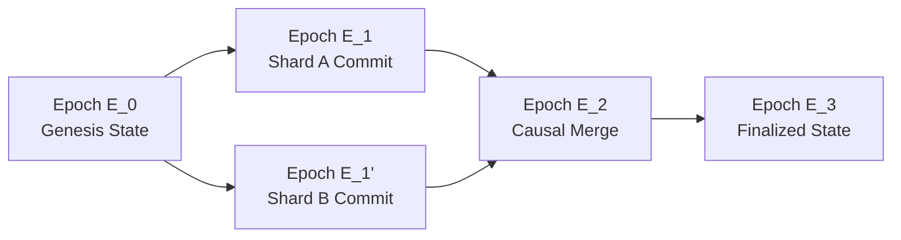

# 12_STATE — Master State Substrate

## 1. Purpose & Hard Invariants

The `12_STATE` plane models the active and historical state of the AMOS operating system across all cognitive organs, runtime shards, and persistent databases.

```text
STATE != MODEL
STATE != KNOWLEDGE
PROPOSAL != COMMIT
MUTATION != FINALITY
```

## 2. MVCC Causal State Architecture



### 2.1 Causal State Graph (`CAUSAL_STATE_GRAPH.md`)
- Multi-Version Concurrency Control (MVCC) with vector clocks.
- Immutable state snapshots: modifying state creates a new epoch version rather than mutating existing data in place.

### 2.2 Epoch Progression (`EPOCH_PROGRESSION_SPEC.md`)
- Monotonically increasing epoch counters (`E_k -> E_{k+1}`).
- Deterministic commit gates: a transaction is committed only when all invariant checks and authority verifications pass.

### 2.3 Rollback Basin (`ROLLBACK_BASIN_PROTOCOL.md`)
- Guaranteed recovery path: every state transition maintains an inverse compensation receipt.
- Failure containment: corrupted state is rolled back to the nearest verified snapshot without polluting unaffected shards.
