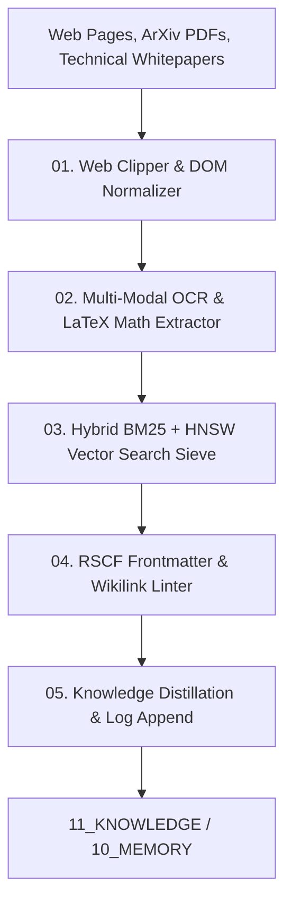

# AMOS LLM Wiki Tooling Suite — Ingestion, Hybrid BM25/Vector Search & Knowledge Distillation Specification

> **Origin Architect / Steward:** Trang Phan
> **AMOS_CORE Target:** `v4.4`
> **Domain Alignment:** Domain E (Interaction, Security & Effect Adapters)
> **Conclusion Class:** `DERIVED` (RSCF Validated)
> **Status:** `ACTIVE_SPECIFICATION`

---

## 1. Architectural Scope & Tooling Mandate

The **AMOS LLM Wiki Tooling Suite** provides automated web document capture, PDF/LaTeX extraction, hybrid lexical (BM25) and dense vector graph search, and continuous knowledge distillation across the `11_KNOWLEDGE/LLM_WIKI` knowledge base.

```text
RAW_CLIPPING != SYNTHESIZED_KNOWLEDGE
LEXICAL_MATCH != SEMANTIC_COMPREHENSION
BULK_INGESTION_WITHOUT_LINTING == REPOSITORY_ENTROPY
DISTILLATION == LOSSLESS_INVARIANT_EXTRACTION
```



---

## 2. Core Tool Modules

### 2.1 Web Clipper & DOM Normalizer (`wiki-clip`)
- Converts DOM trees to clean, sanitized GitHub Flavored Markdown.
- Automatically isolates figures, mathematical formulae, and tables.
- Writes raw incoming clippings to `11_KNOWLEDGE/LLM_WIKI/raw/`.

### 2.2 Hybrid BM25 + Dense Vector Search Engine (`wiki-search`)
Calculates composite relevance score $S_{\text{hybrid}}(q, d)$:

$$S_{\text{hybrid}}(q, d) = \alpha \cdot \text{BM25}(q, d) + (1 - \alpha) \cdot \cos(\mathbf{e}_q, \mathbf{e}_d)$$

$$\text{BM25}(q, d) = \sum_{t \in q} \text{IDF}(t) \cdot \frac{f(t, d) \cdot (k_1 + 1)}{f(t, d) + k_1 \cdot \left( 1 - b + b \cdot \frac{|d|}{\text{avgdl}} \right)}$$

Where $k_1 = 1.2, b = 0.75, \alpha = 0.40$.

### 2.3 Knowledge Graph Linting & Dead-Link Sieve (`wiki-lint`)
- Validates 100% bidirectional wikilink integrity across the wiki substrate.
- Enforces frontmatter YAML schemas and flags ungrounded assertions.

---

## 3. Tool Invariants & Performance SLA

| Pipeline Stage | Processing Throughput | Max Latency | Error Handling |
| :--- | :--- | :--- | :--- |
| **Markdown Conversion** | $\ge 250\text{ pages/min}$ | $\le 200\text{ ms}$ | Strip malicious JS/CSS payloads |
| **Hybrid Search Query** | $\ge 500\text{ queries/s}$ | $\le 12\text{ ms}$ | Graceful fallback to pure BM25 |
| **Graph Linting** | $\ge 15,000\text{ files/s}$ | $\le 1.0\text{ s}$ | Quarantine malformed notes to `/stubs/` |

---

## 4. Lineage & Cross-Plane References

- **Parent MOC:** [[14_TOOLS/14_TOOLS_MOC|14_TOOLS_MOC]]
- **Tools Contract:** [[14_TOOLS/TOOLS_TOOL_CONTRACT|TOOLS_TOOL_CONTRACT]]
- **Knowledge MOC:** [[11_KNOWLEDGE/11_KNOWLEDGE_MOC|11_KNOWLEDGE_MOC]]
- **Memory Substrate:** [[10_MEMORY/EPISODIC_MEMORY_SUBSTRATE|10_MEMORY]]
