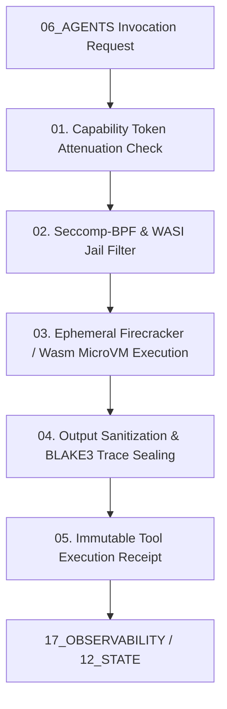

# Tools Tool Contract — Master Tool Governance & Capability Isolation Specification

> **Origin Architect / Steward:** Trang Phan
> **AMOS_CORE Target:** `v4.4`
> **Domain Alignment:** Domain E (Interaction, Security & Effect Adapters)
> **Conclusion Class:** `DERIVED` (RSCF Validated)
> **Status:** `ACTIVE_GOVERNING_CONTRACT`

---

## 1. Architectural Scope & Core Principle

`14_TOOLS` governs the registration, capability attenuation, sandboxed execution, and cryptographic receipt emission for all physical, computational, and external tool invocations in AMOS OS.

```text
TOOL_ACCESS != TOOL_PERMISSION
CAPABILITY != AUTHORITY
EXECUTION != DURABLE_STATE_MUTATION
INVOCATION != SUCCESSFUL_OUTCOME
```



---

## 2. 5-Tier Sandboxed Execution Lattice

| Tier | Isolation Level | Permitted Operations | Seccomp System Call Mask | Audit Overhead |
| :--- | :--- | :--- | :--- | :--- |
| **Tier 0** | Pure Inference | Math, string parsing, AST analysis | No syscalls ($\text{SyscallMask} = \emptyset$) | Minimal |
| **Tier 1** | Read-Only Substrate | `read_file`, `view_file`, `grep_search` | `read`, `openat`, `close`, `fstat` | Event Logged |
| **Tier 2** | Bounded Workspace | `replace_file_content`, `write_to_file` | `write`, `rename`, `unlink` (chroot only) | Pre/Post Snapshot |
| **Tier 3** | System Runtime | `run_command` (isolated child processes) | Filtered whitelist (12 syscalls max) | Full Telemetry |
| **Tier 4** | High-Stakes Authority | Key rotation, canonical law mutations | Multi-sig required ($\ge 2$ keys) | Epoch-Gated Multi-Sig |

---

## 3. Mathematical Capability Attenuation

Let $T_{\text{agent}}$ be the capability token of the calling agent, and $T_{\text{tool}}$ be the requested tool permissions. Execution is permitted if and only if $T_{\text{tool}}$ is a sub-element in the capability lattice $\mathcal{L}_{\text{caps}}$:

$$T_{\text{tool}} \sqsubseteq T_{\text{agent}} \wedge \text{Hash}(T_{\text{agent}}) == \text{SignatureVerification}(\text{StewardKey})$$

$$\text{Timeout}(t) \le T_{\max} = 30.0\text{ s}$$

---

## 4. Failure Containment & Rollback Basin

1. **Ephemeral Sandboxes:** Tool processes execute in disposable, memory-capped Firecracker microVMs or WebAssembly sandboxes that are immediately destroyed upon completion.
2. **Blast Radius Isolation:** A crashed tool or unhandled panic cannot corrupt host OS memory or adjacent running agent containers.
3. **Deterministic Failure Translation:** Unhandled runtime errors emit structured `TOOL_FAILURE` JSON-LD receipts with exit codes, signal captures, and memory snapshots.

---

## 5. Lineage & Cross-Plane References

- **Parent MOC:** [[14_TOOLS/14_TOOLS_MOC|14_TOOLS_MOC]]
- **Sandbox Protocol:** [[14_TOOLS/SANDBOX_TOOL_EXECUTION_PROTOCOL|SANDBOX_TOOL_EXECUTION_PROTOCOL]]
- **Security Master:** [[18_SECURITY/SECURITY_SECURITY_CONTRACT|18_SECURITY]]
- **Agent Governance:** [[06_AGENTS/AGENTS_AGENT_CONTRACT|06_AGENTS]]
- **Observability Logging:** [[17_OBSERVABILITY/OBSERVABILITY_OBSERVABILITY_CONTRACT|17_OBSERVABILITY]]
