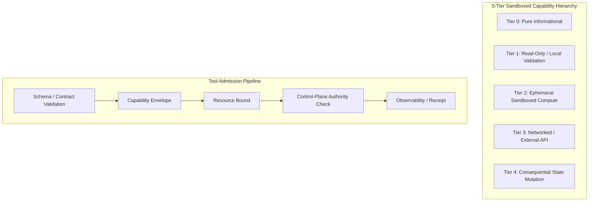

# AMOS OS Tool Registry Master & Sandboxed Execution Envelope Specification

## 1. Scope & Execution Tier Hierarchy

`TOOL_REGISTRY_MASTER` is the governed registry of declared AMOS computational tools, interpreters, and external adapters. Registry presence describes the intended capability envelope; it does **not** by itself prove that a tool is deployed, production-ready, authorized for the current caller, or backed by a cryptographic receipt. Executability and evidence status are row-specific.



`CAPABILITY != AUTHORITY` and `REGISTRY_ENTRY != DEPLOYMENT` are non-compensatory invariants.

## 2. Master Admitted Tool Registry Table

| Tool ID | Entry File | Tier | Capability Mask | Resource Bound | Executed Evidence |
| :--- | :--- | :--- | :--- | :--- | :--- |
| **`amos-llm-wiki`** | [[14_TOOLS/AMOS_LLM_WIKI_TOOL]] | T1 | `FS_READ_VAULT` | declared local bound | row-specific evidence required |
| **`amos-obsidian-linking`** | [[14_TOOLS/AMOS_OBSIDIAN_LINKING_PLUGINS]] | T1 | `FS_READ_VAULT | AST_PARSE` | declared local bound | row-specific evidence required |
| **`amos-agent-interop-compiler`** | [[14_TOOLS/AMOS_AGENT_INTEROPERABILITY_COMPILER]] | T1 | `FS_READ_AGENT_METADATA | MANIFEST_VALIDATE | MANIFEST_COMPILE` | bounded local process | local positive/negative fixtures + CI on active branch |
| **`amos-agent-evaluation-review`** | [[14_TOOLS/AGENT_EVALUATION_REVIEW_GATE]] | T1 | `EVAL_RUN_VALIDATE | REVIEW_RECORD_VALIDATE | JUDGE_DISAGREEMENT_AUDIT | SAMPLING_COVERAGE_AUDIT | BASELINE_CANDIDATE_COMPARE | HARNESS_MUTATION_VERDICT` | bounded local SQLite/reference validation | local 20-test regression suite + receipt validator; external judge validity remains separately governed |
| **`amos-evaluator-calibration`** | [[14_TOOLS/EVALUATOR_CALIBRATION_VERIFIER]] | T1 | `EVALUATOR_CALIBRATION_RECORD_VALIDATE | HELD_OUT_VALIDATION_LINEAGE_AUDIT | ABSTENTION_COVERAGE_AUDIT | WILSON_INTERVAL_CALCULATE | BRIER_SCORE_CALCULATE | ECE_CALCULATE | EVALUATOR_RELIABILITY_GATE | EVALUATOR_DRIFT_COMPARE | CALIBRATION_RECEIPT_VALIDATE` | bounded local SQLite/reference validation | local 37-test regression suite + runtime/receipt self-tests; external judge/reference validity remains separately governed |
| **`amos-harness-evolution-control`** | [[14_TOOLS/HARNESS_EVOLUTION_CONTROL_GATE]] | T1 | `HARNESS_SURFACE_INVENTORY_VALIDATE | MUTATION_MANIFEST_VALIDATE | BASELINE_HASH_BIND_VALIDATE | EVALUATION_ISOLATION_AUDIT | EVALUATION_RECEIPT_BIND | EVALUATOR_RELIABILITY_BIND | HARNESS_MUTATION_VERDICT | ROLLBACK_RECEIPT_VALIDATE | RECONCILIATION_AUDIT | HARNESS_EVOLUTION_LEDGER_VERIFY` | bounded local SQLite/reference validation | local 50-test regression suite + runtime/receipt self-tests; no file-write/rollback/merge authority |
| **`amos-aibom-provenance`** | [[14_TOOLS/AIBOM_PROVENANCE_VERIFIER]] | T1 | `AIBOM_NORMALIZE_LOCAL | CYCLONEDX_JSON_IMPORT_LOCAL | SPDX_JSON_IMPORT_LOCAL | IN_TOTO_SUBJECT_BIND_VALIDATE | AIBOM_STRUCTURAL_VERIFY | AIBOM_POLICY_GAP_AUDIT | VULNERABILITY_APPLICABILITY_CLASSIFY | OUTPUT_BINDING_VALIDATE | AIBOM_DRIFT_COMPARE | AIBOM_LEDGER_VERIFY` | bounded local SQLite/reference validation | local 26-test regression suite + receipt validator; external signature/scanner/network evidence remains separately governed |
| **`amos-wasi-micro-sandbox`** | [[14_TOOLS/AMOS_SELF_HEALING_AUTONOMOUS_WASI_MICRO_SANDBOX_GUIDE]] | T2 | `WASI_EPHEMERAL | NO_NET` | declared contract | deployment/runtime proof remains row-specific |
| **`amos-sandbox-execution`** | [[14_TOOLS/SANDBOX_TOOL_EXECUTION_PROTOCOL]] | T2 | `WASI_CORE_COMPUTE` | declared contract | deployment/runtime proof remains row-specific |
| **`amos-simulation-kernel`** | [[14_TOOLS/SIMULATION_KERNEL_DISCRETE_SYSTEM_DYNAMICS]] | T2 | `ODE_SOLVE | NUMPY_SIMD` | declared contract | benchmark/runtime proof remains row-specific |
| **`amos-github-research`** | [[14_TOOLS/GITHUB_REPOSITORY_RESEARCH_ADAPTER]] | T3 | `GITHUB_REPO_DISCOVERY | GITHUB_SOURCE_READ | GITHUB_COMMIT_READ | GITHUB_PR_READ` | connector-bounded | connector execution observed; durable AMOS receipt remains `UNKNOWN/GAP` unless persisted |
| **`amos-agent-trace-transport`** | [[14_TOOLS/AGENT_TRACE_TRANSPORT_VERIFIER]] | T3* | `TRACE_READ | OTLP_PROJECT | LOCAL_OUTBOX | TRANSPORT_VALIDATE | BACKEND_READBACK` | local deterministic operations plus separately authorized network call | 19 local regression tests before branch push; real external backend round-trip `UNKNOWN/GAP` until executed |
| **`amos-fix-zeromq`** | [[15_INTERFACES/FOREX_FIX44_ZEROMQ_SOCKET_ADAPTER]] | T3 | `SOCKET_DMA | L3_FEED` | declared continuous bound | referenced integration evidence; current deployment status must be revalidated |
| **`amos-bci-decoder`** | [[15_INTERFACES/BCI_EXPRESSION_GATEWAY_ADAPTER]] | T3 | `SHM_ATTACH | BCI_10KHZ` | declared continuous bound | referenced ledger; current deployment status must be revalidated |
| **`amos-cas-epoch-engine`** | [[12_STATE/DISTRIBUTED_SNAPSHOT_AND_CAS_EPOCH_ENGINE]] | T4 | `CAS_COMMIT | EPOCH_BUMP` | declared contract | state-freshness evidence is version/regime bound |

`T3*`: the trace transport tool is T1-like for local read/encode/validate operations, but any actual export or backend query crosses an external network boundary and must be governed as T3.

The GitHub research adapter is read-only by contract. Repository mutation is a distinct T4 effect class and requires separate authority; read access must never be promoted into write authority by convenience.

The interoperability compiler is T1 only when checking metadata or writing projections to stdout/ephemeral scratch. Persisting generated output into authoritative repository state remains a separately authorized write effect.

The trace transport tool never stores transport credentials in its durable outbox or receipts. A network endpoint/header supplied by a caller does not become durable AMOS authority.

The evaluation-review tool is local/read-oriented. `CONTINUE|TERMINATE|ESCALATE`, `KEEP|ROLLBACK|INCONCLUSIVE`, scores, and judge outputs are evaluation evidence only. External model judges or hosted evaluation runners are separate T3 operations and do not inherit authority from this T1 validator.

The evaluator-calibration tool is local/read-oriented. Calibration and reliability evidence are T1. Executing external judges, collecting hosted human labels, or querying hosted experiment backends are separate T3 operations. `CALIBRATED != CORRECT`, `REFERENCE_LABEL != GROUND_TRUTH`, and a reliability gate never grants deployment authority.

The harness-evolution control tool is local/read-oriented. It validates mutation manifests, isolation evidence, exact evaluation/calibration receipts, bounded recommendations, and reconciliation evidence. It never edits harness files or applies a KEEP/ROLLBACK recommendation. Any actual repository write, rollback, merge, deployment, or canon promotion remains a separately authorized consequential effect.

The AIBOM provenance tool is local/read-oriented. Local parsing, normalization, digest/lineage checks, evidence classification and drift comparison are T1. Hosted SBOM generation, vulnerability-database queries, registry access, transparency-log queries, GitHub artifact-attestation services and cryptographic signature verification are separate T3 operations. Their outputs remain evidence and do not inherit deployment, merge or canonical-promotion authority.

## 3. Tool Descriptor Model

```protobuf
syntax = "proto3";
package amos.tools.registry;

enum ExecutionTier {
  TIER_UNSPECIFIED = 0;
  TIER_0_INFORMATIONAL = 1;
  TIER_1_READ_ONLY_VAULT = 2;
  TIER_2_WASI_EPHEMERAL = 3;
  TIER_3_EXTERNAL_NETWORK = 4;
  TIER_4_CONSEQUENTIAL_STATE_MUTATION = 5;
}

message ToolDescriptor {
  string tool_id = 1;
  string display_name = 2;
  string version_semver = 3;
  ExecutionTier tier = 4;
  uint64 capability_mask = 5;
  uint64 max_memory_bytes = 6;
  int64 timeout_nanos = 7;
  string json_schema_parameters = 8;
  string json_schema_return = 9;
  string implementation_hash = 10;
}

message ToolExecutionRequest {
  string execution_id = 1;
  string tool_id = 2;
  string invoking_agent_role = 3;
  string input_reference = 4;
  string authority_reference = 5;
  int64 timestamp_utc_nanos = 6;
}

message ToolExecutionReceipt {
  string execution_id = 1;
  string tool_id = 2;
  string outcome_state = 3;
  int64 duration_micros = 4;
  string output_hash = 5;
  string error_class = 6;
  string provenance_reference = 7;
  string authority_semantics = 8;
}
```

This descriptor is an AMOS model schema. It does not assert that every listed tool currently emits every field or that signatures exist unless the row-specific implementation proves it.

## 4. Operational Invariants & Governance Rules

1. **Least privilege**: no tool may execute beyond the authority actually available to the current operation. Missing authority fails closed.
2. **Tier separation**: local validation does not inherit network or mutation authority merely because the same tool family also supports T3/T4 actions.
3. **Receipt truthfulness**: receipt type and strength are row-specific. `LOGGED != CRYPTOGRAPHICALLY_VERIFIED` and `TESTED != DEPLOYED`.
4. **Fail closed**: malformed critical input, unknown tool binding, stale evidence, or unresolved authority is `UNKNOWN/GAP` or rejection rather than silent promotion.
5. **Read/write separation**: discovery/read capability does not imply branch, file, PR, issue, backend-data, release, merge, or workflow-dispatch mutation authority.
6. **Projection separation**: A2A/MCP/OTLP candidate projections do not imply protocol conformance or deployed endpoints unless independently executed and verified.
7. **Transport separation**: `HTTP_ACK != BACKEND_READBACK_VERIFIED`; `IN_DOUBT != SAFE_TO_BLIND_RETRY`.
8. **Authority-context separation**: persistent telemetry queues do not establish persistence of authorization context or caller permission.
9. **Evaluation separation**: `REVIEW_DECISION != RUNTIME_AUTHORITY`; `MODEL_JUDGE_SCORE != GROUND_TRUTH`; `SAMPLED_PASS != COMPLETE_PASS`; `SCORE_DELTA != CAUSAL_ATTRIBUTION`; `EVAL_RESULT != DEPLOYMENT_AUTHORITY`.
10. **Supply-chain evidence separation**: `BOM_PRESENT != COMPLETE_INVENTORY`; `DIGEST_MATCH != SIGNATURE_VERIFIED`; `SIGNATURE_VERIFIED != SEMANTIC_CORRECTNESS`; `VULNERABILITY_ID_MATCH != VULNERABILITY_APPLICABLE`; `AIBOM_SEALED != POLICY_COMPLETE`; `POLICY_COMPLETE != DEPLOYMENT_VALIDITY`; `AIBOM_EVIDENCE != AUTHORITY`.
11. **Evaluator calibration separation**: `CALIBRATED != CORRECT`; `REFERENCE_LABEL != GROUND_TRUTH`; `AGREEMENT != TRUTH`; `SCORE != PROBABILITY`; `CALIBRATION_COHORT != VALIDATION_COHORT`; `RELIABILITY_GATE_PASS != DEPLOYMENT_VALIDITY`; `DRIFT_DELTA != CAUSAL_ATTRIBUTION`.
12. **Harness evolution separation**: `MUTATION_MANIFEST != FILE_WRITE`; `KEEP_RECOMMENDATION != MERGE_AUTHORITY`; `ROLLBACK_RECOMMENDATION != ROLLBACK_EXECUTION`; `NEXT_ROUND_DELTA != CAUSAL_PROOF`; `VERIFIER_OR_REWARD_LEAKAGE != VALID_COMPARATIVE_EVIDENCE`; `RECONCILIATION_OBSERVED != ACTION_AUTHORIZED`.

## 5. Cross-Plane Architectural Bindings

- **Master Tools MOC**: [[14_TOOLS/14_TOOLS_MOC]]
- **Tool Contract Specification**: [[14_TOOLS/TOOLS_TOOL_CONTRACT]]
- **GitHub Research Adapter**: [[14_TOOLS/GITHUB_REPOSITORY_RESEARCH_ADAPTER]]
- **Agent Interoperability Compiler**: [[14_TOOLS/AMOS_AGENT_INTEROPERABILITY_COMPILER]]
- **Agent Evaluation Review Gate**: [[14_TOOLS/AGENT_EVALUATION_REVIEW_GATE]]
- **Evaluator Calibration Verifier**: [[14_TOOLS/EVALUATOR_CALIBRATION_VERIFIER]]
- **Harness Evolution Control Gate**: [[14_TOOLS/HARNESS_EVOLUTION_CONTROL_GATE]]
- **AIBOM Provenance Verifier**: [[14_TOOLS/AIBOM_PROVENANCE_VERIFIER]]
- **Agent Trace Transport Verifier**: [[14_TOOLS/AGENT_TRACE_TRANSPORT_VERIFIER]]
- **WASM Sandbox Capability Ledger**: [[14_TOOLS/WASM_SANDBOX_CAPABILITY_LEDGER]]
- **Agent Mesh Protocol**: [[06_AGENTS/AGENT_ROLE_REGISTRY]]
- **Security Control Access Bridge**: [[18_SECURITY/SECURITY_CONTROL_ACCESS_BRIDGE_GOVERNOR]]
- **Distributed Epistemic Tracing**: [[17_OBSERVABILITY/DISTRIBUTED_EPISTEMIC_TRACING_FRAMEWORK]]
