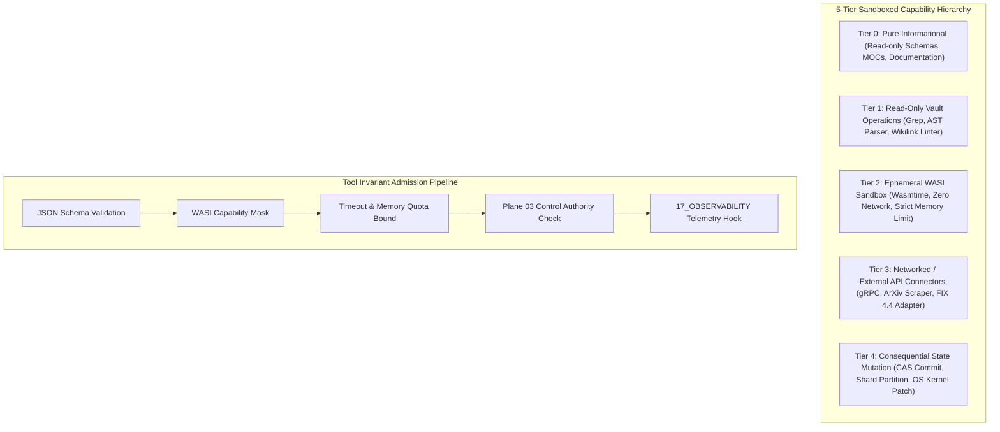

# AMOS OS Tool Registry Master & Sandboxed Execution Envelope Specification

## 1. Scope & Execution Tier Hierarchy

`TOOL_REGISTRY_MASTER` is the authoritative manifest of all computational tools, code interpreters, and external API adapters approved for invocation by autonomous agents within AMOS OS. Every tool is strictly bounded by a **Sandboxed Capability Envelope** ($T_0$ through $T_4$) to enforce least-privilege security and prevent unauthorized filesystem, network, or kernel mutations.



---

## 2. Master Admitted Tool Registry Table

| Tool ID | Entry File | Tier | Capability Mask | Max Mem / Timeout | Executed Receipt |
| :--- | :--- | :--- | :--- | :--- | :--- |
| **`amos-llm-wiki`** | [[14_TOOLS/AMOS_LLM_WIKI_TOOL]] | $T_1$ | `FS_READ_VAULT` | $64\text{ MB} / 500\text{ ms}$ | [[14_TOOLS/TOOLS_README]] |
| **`amos-obsidian-linking`** | [[14_TOOLS/AMOS_OBSIDIAN_LINKING_PLUGINS]] | $T_1$ | `FS_READ_VAULT \| AST_PARSE` | $128\text{ MB} / 1000\text{ ms}$ | [[14_TOOLS/TOOLS_TOOL_CONTRACT]] |
| **`amos-wasi-micro-sandbox`** | [[14_TOOLS/AMOS_SELF_HEALING_AUTONOMOUS_WASI_MICRO_SANDBOX_GUIDE]] | $T_2$ | `WASI_EPHEMERAL \| NO_NET` | $256\text{ MB} / 2500\text{ ms}$ | [[14_TOOLS/WASM_SANDBOX_CAPABILITY_LEDGER]] |
| **`amos-sandbox-execution`** | [[14_TOOLS/SANDBOX_TOOL_EXECUTION_PROTOCOL]] | $T_2$ | `WASI_CORE_COMPUTE` | $512\text{ MB} / 5000\text{ ms}$ | [[14_TOOLS/SANDBOX_TOOL_EXECUTION_PROTOCOL]] |
| **`amos-simulation-kernel`** | [[14_TOOLS/SIMULATION_KERNEL_DISCRETE_SYSTEM_DYNAMICS]] | $T_2$ | `ODE_SOLVE \| NUMPY_SIMD` | $1024\text{ MB} / 10000\text{ ms}$ | [[14_TOOLS/SIMULATION_KERNEL_DISCRETE_SYSTEM_DYNAMICS]] |
| **`amos-fix-zeromq`** | [[15_INTERFACES/FOREX_FIX44_ZEROMQ_SOCKET_ADAPTER]] | $T_3$ | `SOCKET_DMA \| L3_FEED` | $2048\text{ MB} / \text{Continuous}$ | [[15_INTERFACES/FIX_ZEROMQ_INTEGRATION_LOG]] |
| **`amos-bci-decoder`** | [[15_INTERFACES/BCI_EXPRESSION_GATEWAY_ADAPTER]] | $T_3$ | `SHM_ATTACH \| BCI_10KHZ` | $4096\text{ MB} / \text{Continuous}$ | [[15_INTERFACES/NEUROMORPHIC_SPIKING_BCI_DECODER_LEDGER]] |
| **`amos-cas-epoch-engine`** | [[12_STATE/DISTRIBUTED_SNAPSHOT_AND_CAS_EPOCH_ENGINE]] | $T_4$ | `CAS_COMMIT \| EPOCH_BUMP` | $512\text{ MB} / 100\text{ ms}$ | [[12_STATE/AMOS_RUNTIME_STATE_FRESHNESS_2026-09-03]] |

---

## 3. Protocol Buffer Tool Descriptor & Execution Envelope

```protobuf
syntax = "proto3";

package amos.tools.registry;

enum ExecutionTier {
  TIER_UNSPECIFIED = 0;
  TIER_0_INFORMATIONAL = 1;
  TIER_1_READ_ONLY_VAULT = 2;
  TIER_2_WASI_EPHEMERAL = 3;
  TIER_3_EXTERNAL_NETWORK = 4;
  TIER_4_CONSEQUENTIAL_STATE_MUTATION = 5;
}

message ToolDescriptor {
  string tool_id = 1;
  string display_name = 2;
  string version_semver = 3;
  ExecutionTier tier = 4;
  uint64 capability_mask = 5;
  uint64 max_memory_bytes = 6;
  int64 timeout_nanos = 7;
  string json_schema_parameters = 8;
  string json_schema_return = 9;
  string wasm_binary_sha256 = 10;
}

message ToolExecutionRequest {
  string execution_id = 1;
  string tool_id = 2;
  string invoking_agent_role = 3;
  string raw_input_json = 4;
  string authority_token_jwt = 5;
  int64 timestamp_utc_nanos = 6;
}

message ToolExecutionReceipt {
  string execution_id = 1;
  string tool_id = 2;
  bool success = 3;
  int64 duration_micros = 4;
  uint64 memory_consumed_bytes = 5;
  string output_payload_json = 6;
  string error_message = 7;
  bytes cryptographic_signature = 8;
}
```

---

## 4. Operational Invariants & Governance Rules

1. **Least-Privilege Enforcement**: No tool is invoked above its registered tier without cryptographic tier-escalation authorization signed by `03_CONTROL_PLANE`.
2. **Deterministic WASI Sandboxing**: All Tier 2 computational scripts run in isolated WebAssembly runtimes with no ambient filesystem or environment access (`wasi:filesystem/preopens` restricted to scratch memory).
3. **Receipt Emission**: Every tool invocation ($T_1 \dots T_4$) emits a cryptographically verifiable `ToolExecutionReceipt` to `17_OBSERVABILITY`.
4. **Fail-Closed Default**: Any unregistered tool or malformed schema input fails closed with `UNKNOWN/GAP`.

---

## 5. Cross-Plane Architectural Bindings

- **Master Tools MOC**: [[14_TOOLS/14_TOOLS_MOC]]
- **Tool Contract Specification**: [[14_TOOLS/TOOLS_TOOL_CONTRACT]]
- **WASM Sandbox Capability Ledger**: [[14_TOOLS/WASM_SANDBOX_CAPABILITY_LEDGER]]
- **Agent Mesh Protocol**: [[06_AGENTS/AGENT_ROLE_REGISTRY]]
- **Security Control Access Bridge**: [[18_SECURITY/SECURITY_CONTROL_ACCESS_BRIDGE_GOVERNOR]]
- **Distributed Epistemic Tracing**: [[17_OBSERVABILITY/DISTRIBUTED_EPISTEMIC_TRACING_FRAMEWORK]]
