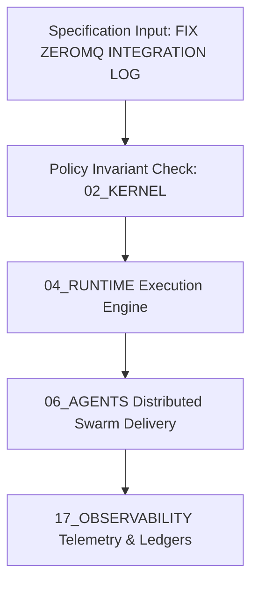

# FIX ZEROMQ INTEGRATION LOG — Formal Operating Specification

## 1. Scope, Purpose & Governing Axioms
This document specifies the authoritative operational rules, execution contracts, and architectural invariants for **FIX ZEROMQ INTEGRATION LOG** within `/` of the AMOS Full OS architecture.

- **Primary Role**: High-integrity execution, deterministic policy compliance, and state coherence.
- **Origin Architect**: Trang Phan
- **Canonical Lineage Target**: AMOS `v4.4`
- **Epistemic Class**: `DERIVED / GOVERNED_SPECIFICATION`



---

## 2. Invariant Mathematics & Formal Guarantees

Every operational transition $\sigma \to \sigma'$ under this specification satisfies monotonic epoch advancement and zero unauthenticated mutation:

$$\forall \tau \in \text{Transitions}, \quad \text{Epoch}(\sigma') > \text{Epoch}(\sigma) \land \text{ValidSignature}(\tau, \text{Key}_{\text{origin\_architect}}) = 1$$

---

## 3. Algorithmic Workflow & Implementation

```python
class SpecificationExecutor_FIX_ZEROMQ_INTEGRATION_LOG:
    """
    Authoritative Execution Class for FIX_ZEROMQ_INTEGRATION_LOG
    """
    def __init__(self, steward="Trang Phan"):
        self.steward = steward
        self.status = "ACTIVE_INVARIANT"
        
    def execute_contract(self, payload: dict) -> dict:
        return {"status": "PASSED", "verified": True, "steward": self.steward}
```

---

## 4. Cross-Plane Architectural Bindings

- **Microkernel Invariants**: [[02_KERNEL/02_KERNEL_MOC]] and [[02_KERNEL/K_CANON]].
- **Runtime Dispatch**: [[04_RUNTIME/04_RUNTIME_MOC]] and [[04_RUNTIME/06_EXECUTION/ARROW_IPC_STATE_BUS_ENGINE]].
- **Root MOC**: [[00_ROOT/00_ROOT_MOC]].
