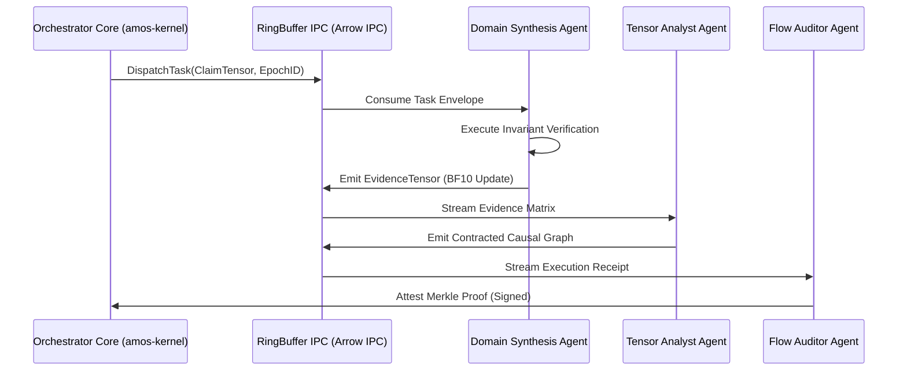

# Multi-Agent Orchestration & IPC Interface Specification

## 1. Architectural Topology

The AMOS multi-agent orchestration bus utilizes zero-copy shared memory Apache Arrow IPC for intra-node agent communication and mTLS gRPC / Protocol Buffers v3 for inter-node communication.



## 2. Wire Protocol Schema (Protobuf v3)

```protobuf
syntax = "proto3";
package amos.interfaces.orchestration;

message AgentTaskEnvelope {
  string task_id = 1;
  string session_id = 2;
  uint64 causal_epoch = 3;
  string calling_agent = 4;
  string target_agent = 5;
  bytes input_tensor = 6;
  uint32 priority_level = 7;
  int64 deadline_utc_ns = 8;
  map<string, string> tracing_baggage = 9;
}

message AgentTaskResultEnvelope {
  string task_id = 1;
  uint64 causal_epoch = 2;
  enum ExecutionStatus {
    SUCCESS = 0;
    INVARIANT_BREACH = 1;
    TIMEOUT = 2;
    AUTHORITY_DENIED = 3;
    DEGRADED_PARTIAL = 4;
  }
  ExecutionStatus status = 3;
  bytes output_tensor = 4;
  double confidence_score = 5;
  string cryptographic_receipt = 6;
  repeated string downstream_action_requests = 7;
}

service AgentOrchestratorService {
  rpc DispatchTask (AgentTaskEnvelope) returns (AgentTaskResultEnvelope);
  rpc StreamTaskUpdates (AgentTaskEnvelope) returns (stream AgentTaskResultEnvelope);
  rpc BroadcastEpochTransition (EpochTransitionNotice) returns (EpochTransitionAck);
}

message EpochTransitionNotice {
  uint64 new_epoch_id = 1;
  string state_root_hash = 2;
  uint64 timestamp_utc_ns = 3;
}

message EpochTransitionAck {
  string agent_id = 1;
  bool synchronized = 2;
}
```

## 3. High-Throughput Ring Buffer Invariants
1. **Zero-Copy Serialization**: Memory buffers allocated in hugepages (`2MB` / `1GB` pages), aligned to 64-byte cache-line boundaries.
2. **Lockless Ring Buffer**: Single-Producer Multi-Consumer (SPMC) atomic head/tail pointers using C11/C++20 atomic acquire-release semantics.
3. **Backpressure Regulation**: Dynamic token bucket throttling when queue depth exceeds 85% capacity.

## 4. Navigation
- Governed by: [[15_INTERFACES/INTERFACES_INTERFACE_CONTRACT.md|INTERFACES_INTERFACE_CONTRACT]]
- Agent Role Registry: [[06_AGENTS/AGENT_ROLE_REGISTRY.md|AGENT_ROLE_REGISTRY]]
- Return to: [[15_INTERFACES/15_INTERFACES_MOC.md|15_INTERFACES MOC]]
