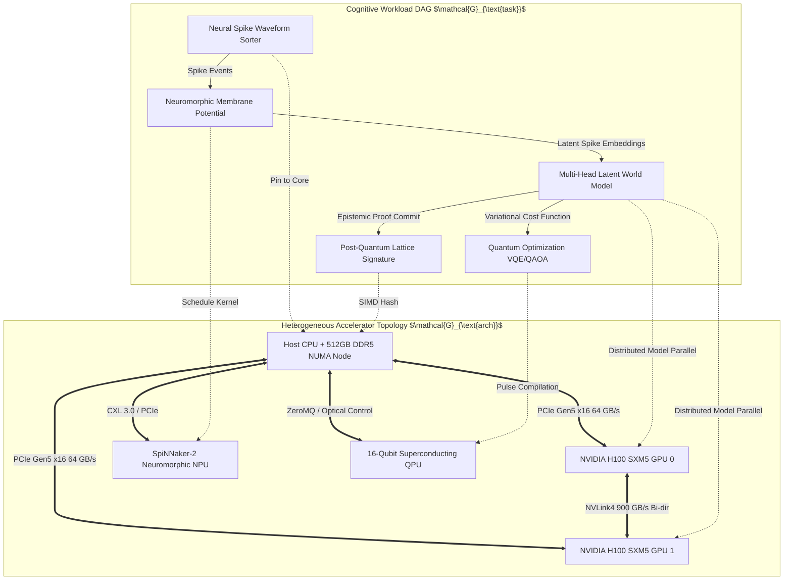

# Heterogeneous XPU Topology-Aware Scheduler Schema & Protocol Ledger

## 1. Mathematical Architecture & Interconnect Graph Optimization

Modern AMOS OS cognitive compute kernels span heterogeneous accelerator tiers:
- **GPU Tier**: NVIDIA H100/B200 SXM5 ($900\text{ GB/s} - 1.8\text{ TB/s}$ NVLink4/5) for dense transformer attention and continuous-time flow matching.
- **NPU Tier**: SpiNNaker-2 / Intel Loihi 2 neuromorphic cores for asynchronous, event-driven Leaky Integrate-and-Fire (LIF) spike propagation ($< 50\ \mu\text{W}$ per synaptic event).
- **QPU Tier**: Neutral Atom (Rydberg) & Superconducting Transmon arrays for parameter-efficient parameterized quantum circuits (PQCs) and qLDPC decoders.
- **CPU / Host Memory**: Cache-coherent NVLink-C2C and PCIe Gen5 x16 host interconnects.



---

## 2. Latency-Constrained Mixed-Integer Scheduling Formulation

Let the task workload be represented by DAG $\mathcal{G}_{\text{task}} = (\mathcal{V}, \mathcal{E})$, where each vertex $v \in \mathcal{V}$ specifies execution requirements $(\text{Flops}(v), \text{Memory}(v), \text{TargetArch}(v))$, and each edge $(u, v) \in \mathcal{E}$ represents data volume $\text{Vol}(u, v)$ in bytes.

Let the accelerator cluster topology be modeled as a weighted graph $\mathcal{G}_{\text{arch}} = (\mathcal{P}, \mathbf{B}, \mathbf{L})$, where:
- $\mathcal{P} = \{p_1, \dots, p_M\}$ is the set of processing units.
- $\mathbf{B} \in \mathbb{R}_{+}^{M \times M}$ is the inter-device bandwidth matrix ($\text{GB/s}$).
- $\mathbf{L} \in \mathbb{R}_{+}^{M \times M}$ is the inter-device link latency tensor ($\mu\text{s}$).

### Objective Function: Makespan & Comm Energy Minimization
$$\min_{\mathbf{X}} \left( \max_{v \in \mathcal{V}} C_v + \lambda \sum_{(u, v) \in \mathcal{E}} \sum_{p=1}^M \sum_{q=1}^M X_{u, p} X_{v, q} \cdot \mathcal{E}_{\text{transfer}}(p, q, \text{Vol}(u, v)) \right)$$

Subject to:
$$\sum_{p=1}^M X_{v, p} = 1 \quad \forall v \in \mathcal{V} \quad (\text{Unique Assignment})$$
$$C_v \ge C_u + \sum_{p=1}^M X_{v, p} \frac{\text{Flops}(v)}{\text{TFLOPS}(p)} + \sum_{p=1}^M \sum_{q=1}^M X_{u, p} X_{v, q} \left( \frac{\text{Vol}(u, v)}{\mathbf{B}_{p, q}} + \mathbf{L}_{p, q} \right) \quad \forall (u, v) \in \mathcal{E}$$
$$\sum_{v \in \mathcal{V}: t \in [S_v, C_v]} X_{v, p} \cdot \text{Memory}(v) \le \text{MaxVRAM}(p) \quad \forall p \in \mathcal{P}, \forall t$$

---

## 3. Formal Protocol Buffer Schema Specification

```protobuf
syntax = "proto3";

package amos.schemas.xpu_scheduler;

enum DeviceArchitecture {
  ARCH_UNSPECIFIED = 0;
  ARCH_CPU_X86_64 = 1;
  ARCH_CPU_ARM64 = 2;
  ARCH_GPU_NVIDIA_CUDA = 3;
  ARCH_NPU_NEUROMORPHIC_SPINNAKER = 4;
  ARCH_QPU_SUPERCONDUCTING = 5;
  ARCH_QPU_NEUTRAL_ATOM = 6;
  ARCH_OPTICAL_PHOTONIC = 7;
}

enum InterconnectType {
  INTERCONNECT_UNSPECIFIED = 0;
  INTERCONNECT_SHARED_HOST_DDR = 1;
  INTERCONNECT_PCIE_GEN5 = 2;
  INTERCONNECT_NVLINK_C2C = 3;
  INTERCONNECT_CXL_3_0 = 4;
  INTERCONNECT_INFINIBAND_NDR = 5;
  INTERCONNECT_OPTICAL_FIBER = 6;
}

message DeviceDescriptor {
  uint32 device_id = 1;
  DeviceArchitecture arch = 2;
  string hardware_name = 3;
  uint64 total_memory_bytes = 4;
  double peak_tflops_fp16 = 5;
  double static_power_watts = 6;
  double dynamic_energy_per_flop_joules = 7;
}

message InterconnectLink {
  uint32 source_device_id = 1;
  uint32 target_device_id = 2;
  InterconnectType interconnect = 3;
  double bandwidth_gbytes_per_sec = 4;
  double latency_micros = 5;
}

message TaskNode {
  uint64 task_id = 1;
  string kernel_symbol = 2;
  DeviceArchitecture required_arch = 3;
  uint64 estimated_flops = 4;
  uint64 required_vram_bytes = 5;
  repeated uint64 predecessor_task_ids = 6;
  repeated uint64 transfer_bytes = 7;
}

message ScheduledPlanReceipt {
  uint64 schedule_epoch = 1;
  int64 planned_makespan_nanos = 2;
  double total_energy_joules = 3;
  map<uint64, uint32> task_device_mapping = 4;
  map<uint64, int64> task_start_times_nanos = 5;
  bytes cryptographic_attestation = 6;
}
```

---

## 4. Invariants & Governance Bounds

1. **Topology Awareness**: All tensor partitions and neural spike routing must minimize off-package PCIe traversal; high-bandwidth communication pairs must resolve to direct NVLink or shared CXL coherent memory domains.
2. **Deterministic Fallback**: In the event of QPU/NPU accelerator unresponsiveness ($> 5.0\text{ ms}$ timeout), the scheduler automatically remaps tasks to SIMD CPU / GPU emulator kernels without halting operating plane workflows.
3. **Receipt Issuance**: Every executed heterogeneous schedule commits a `ScheduledPlanReceipt` containing execution timing, device mapping, and cryptographic hash to `17_OBSERVABILITY`.

---

## 5. Cross-Plane Architectural Bindings

- **Runtime Execution Plane**: [[04_RUNTIME/04_RUNTIME_MOC]]
- **Shared Memory Telemetry Engine**: [[04_RUNTIME/06_EXECUTION/ARROW_IPC_STATE_BUS_ENGINE]]
- **Hardware Interface Gateway**: [[15_INTERFACES/15_INTERFACES_MOC]]
- **Quantum Systems Domain Spec**: [[21_DOMAINS/41_QUANTUM_SYSTEMS/41_QUANTUM_SYSTEMS_MOC]]
- **Distributed Epistemic Tracing**: [[17_OBSERVABILITY/DISTRIBUTED_EPISTEMIC_TRACING_FRAMEWORK]]
