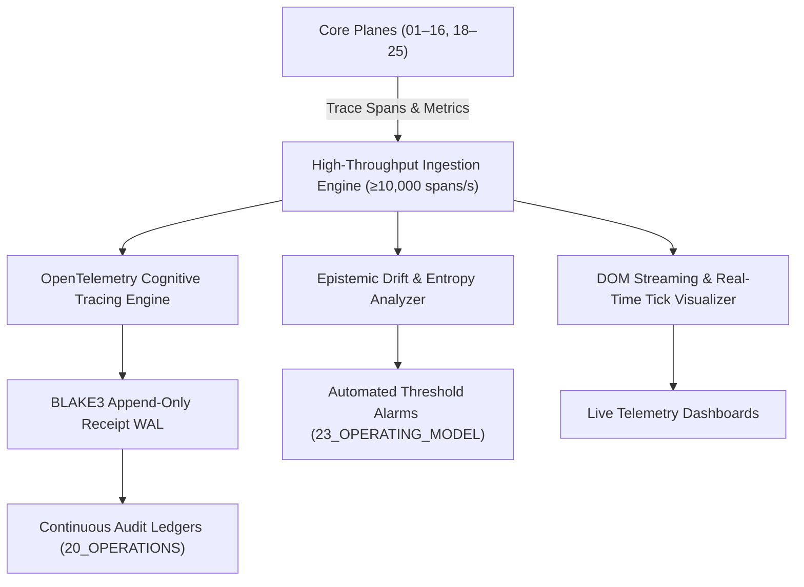

# 17_OBSERVABILITY — Master Telemetry & Epistemic Health Architecture

> **Origin Architect / Steward:** Trang Phan  
> **AMOS_CORE Target:** `v4.4`  
> **Epistemic Class:** `AMOS_MODEL`  
> **Conclusion Class:** `DERIVED`  
> **Status:** `ACTIVE_SPECIFICATION`

---

## 1. Executive Architectural Mandate

`17_OBSERVABILITY` provides continuous, non-intrusive, distributed epistemic tracing, real-time metrics telemetry, cryptographic execution logging, and cognitive graph health profiling across all 26 planes of the AMOS Full Brain OS. It operationalizes high-resolution telemetry for neural BCI decoders, quantitative finance risk engines, distributed multi-agent workflows, and persistent memory substrates without adding more than $0.5\%$ latency overhead.

---

## 2. The 4 Pillars of AMOS Observability

### Pillar 1: Distributed Epistemic Tracing (OpenTelemetry Extension)
- **Cognitive Context Propagation:** Extends W3C Trace Context (`traceparent`, `tracestate`) with epistemic metadata (`rscf.state`, `confidence.score`, `origin.steward`, `premises.hashes`).
- **Causal Span Graphs:** Generates strict Directed Acyclic Graph (DAG) traces representing reasoning paths across multi-agent pipelines.
- **Sub-Millisecond Overhead:** Lock-free ring buffer telemetry buffers guaranteeing $\Delta t_{\text{trace}} \le 20\,\mu\text{s}$ per span.

### Pillar 2: Quantitative Telemetry Metrics
- **Real-Time SLI Sampling:** Samples high-frequency counters, gauges, and histograms:
  - Neural BCI end-to-end decoding latency ($p_{99} < 5.0\text{ ms}$).
  - Quantitative Forex order execution and kill-switch roundtrip ($p_{99} < 25.0\text{ ms}$).
  - MicroVM tool spawn cold/warm start times ($p_{95} < 15.0\text{ ms}$).
  - Memory cache hit/miss ratios and HNSW vector search latencies ($p_{95} < 2.0\text{ ms}$).

### Pillar 3: Epistemic Drift & Entropy Monitoring
- **Confidence Inflation Detector:** Compares conclusion confidence $C(\text{conclusion})$ against premise confidence $\min_i C(p_i)$; flags violations where $C_{\text{conc}} > \min_i C_{p_i}$.
- **Semantic Drift Tracker:** Computes Wasserstein distance $\mathcal{W}_1(P_t, P_0)$ on embedding clusters; triggers quarantine when drift $\Delta > 0.08$.
- **Premise Staleness Checker:** Re-validates TTL expiration on active working memory traces.

### Pillar 4: Cryptographic Execution Receipts & Ledger Sealing
- **BLAKE3 Merkle Sealing:** State transitions and workflow step completions are hashed and chained into append-only cryptographic receipts.
- **Non-Repudiation:** Every receipt contains caller ID, capability nonce, execution duration, and parent state root hash.

---

## 3. Observability Invariants & Hard Boundaries

$$\begin{aligned}
\text{OBS-INV-01} &: \quad \text{OBSERVATION} \neq \text{AUTHORITY} \\
\text{OBS-INV-02} &: \quad \text{METRIC} \neq \text{GOAL} \\
\text{OBS-INV-03} &: \quad \text{MONITORING} \neq \text{REPAIR} \\
\text{OBS-INV-04} &: \quad \text{TELEMETRY} \neq \text{TRUTH} \\
\text{OBS-INV-05} &: \quad \text{Telemetry Overhead: } \frac{\text{Overhead}(\text{Trace})}{\text{Runtime}(\text{Task})} \le 0.005 \quad (0.5\%)
\end{aligned}$$

---

## 4. Key Subsystem Artifacts & Specifications

- **[[17_OBSERVABILITY/OBSERVABILITY_OBSERVABILITY_CONTRACT|OBSERVABILITY_OBSERVABILITY_CONTRACT.md]]**: Master plane contract formalizing telemetry standards and compliance invariants.
- **[[17_OBSERVABILITY/DISTRIBUTED_EPISTEMIC_TRACING_FRAMEWORK|DISTRIBUTED_EPISTEMIC_TRACING_FRAMEWORK.md]]**: OpenTelemetry cognitive tracing schema and causal span models.
- **[[17_OBSERVABILITY/REALTIME_ORDERBOOK_DOM_STREAMING_VISUALIZER|REALTIME_ORDERBOOK_DOM_STREAMING_VISUALIZER.md]]**: High-frequency market Depth-of-Market (DOM) visualizer and microsecond orderbook streaming.
- **[[17_OBSERVABILITY/EXECUTED_VALIDATION_LEDGER_2026-09-03|EXECUTED_VALIDATION_LEDGER_2026-09-03.md]]**: Historical execution validation ledger.

---

## 5. Cross-Plane Bindings

- **`00_ROOT`**: Master navigation anchored in [[00_ROOT/00_ROOT_MOC|00_ROOT_MOC]].
- **`02_KERNEL`**: Ingests low-level execution trace hashes.
- **`20_OPERATIONS`**: Ingests audit ledgers and incident alert feeds.
- **`23_OPERATING_MODEL`**: Evaluates SLO error budget burn rates.

---

> **Epistemic Attestation:** Governed under AMOS v4.4. Origin Architect & Steward: **Trang Phan**.
