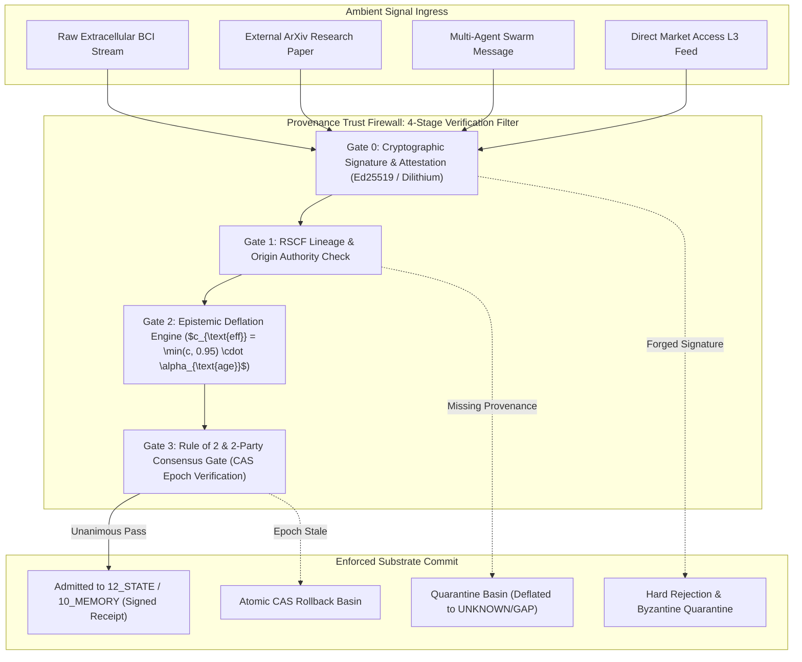

# Provenance Trust Firewall (PTF) Architecture & Cryptographic Verification Specification

## 1. Architectural Mission & Substrate Boundary

The **Provenance Trust Firewall (PTF)** operates as the immutable security barrier between unverified ambient signal streams (neural telemetry, raw arXiv preprints, financial market feeds, external agent messages) and internal governed state substrates (`10_MEMORY`, `12_STATE`, `02_KERNEL`, `25_COGNITIVE_MATRIX`). It mathematically enforces the core AMOS invariant axioms:

$$\text{CAPABILITY} \neq \text{AUTHORITY}, \quad \text{LATEST} \neq \text{AUTHORITATIVE}, \quad \text{DOCUMENTED} \neq \text{IMPLEMENTED}$$
$$\text{PROPOSAL} \neq \text{COMMIT}, \quad \text{MODEL} \neq \text{DEPLOYED\_RUNTIME}, \quad \text{CONFIDENCE} \le 0.95$$



---

## 2. Mathematical Formalization & Epistemic Deflation Mechanics

### 2.1 Merkle Provenance Directed Acyclic Graph (DAG)
Let $\mathcal{G}_{\text{prov}} = (\mathcal{V}, \mathcal{E})$ represent the provenance DAG. For any incoming assertion node $v \in \mathcal{V}$, its cryptographic hash $H(v)$ is recursively bound to its parent predecessor hashes:

$$H(v) = \text{BLAKE3}\Big( \text{Content}(v) \;\|\; \text{EpochID}(v) \;\|\; \bigoplus_{u \in \operatorname{Parents}(v)} H(u) \Big)$$

### 2.2 Bayesian Confidence Deflation Formula
When an unverified external claim with reported confidence $c_{\text{raw}}$ enters the firewall:
1. If the source lacks peer-reviewed or formal execution receipts:
   $$c_{\text{deflated}} = \min\left(0.90, \; c_{\text{raw}} \cdot \frac{BF_{10}}{1 + BF_{10}}\right)$$
2. Decay over elapsed time $\Delta t$ without empirical reproduction:
   $$c_{\text{eff}}(\Delta t) = c_{\text{deflated}} \cdot \exp\left(-\frac{\Delta t}{\tau_{\text{half-life}}}\right), \quad \tau_{\text{half-life}} = 36\text{ months}$$
3. Under no circumstances can $c_{\text{eff}}$ exceed the global ceiling $c_{\text{ceiling}} = 0.95$.

---

## 3. Protocol Buffer Firewall Receipt Specification

```protobuf
syntax = "proto3";

package amos.observability.ptf;

enum GateVerdict {
  VERDICT_UNSPECIFIED = 0;
  VERDICT_PASS = 1;
  VERDICT_DEFLATED_ADMITTED = 2;
  VERDICT_QUARANTINED = 3;
  VERDICT_REJECTED = 4;
}

message FirewallIngressDescriptor {
  string ingress_id = 1;
  string source_uri = 2;
  string claimed_epistemic_class = 3;
  double claimed_confidence = 4;
  string cryptographic_signature_hex = 5;
  uint64 active_causal_epoch = 6;
}

message ProvenanceFirewallReceipt {
  string ingress_id = 1;
  GateVerdict verdict = 2;
  double admitted_confidence = 3; // strictly <= 0.95
  bool gate0_signature_valid = 4;
  bool gate1_rscf_valid = 5;
  bool gate2_deflation_applied = 6;
  bool gate3_rule_of_two_satisfied = 7;
  string target_substrate_path = 8;
  string blake3_provenance_hash = 9;
  int64 evaluation_latency_nanos = 10;
  int64 timestamp_utc_nanos = 11;
}
```

---

## 4. Python Reference Validation Engine

```python
"""
AMOS Provenance Trust Firewall Validation Engine.
Target: AMOS v4.4 Plane 17_OBSERVABILITY.
"""

import time
import math
from typing import Dict, Any, Tuple

class ProvenanceTrustFirewall:
    CONFIDENCE_CEILING = 0.95
    MAX_UNVERIFIED_CEILING = 0.90
    
    def __init__(self, active_epoch: int = 1):
        self.active_epoch = active_epoch
        self.root_keys = {"trang_phan_origin_root": "AUTH_PUBKEY_2026"}
        
    def evaluate_ingress(self, payload: Dict[str, Any]) -> Tuple[str, float, Dict[str, bool]]:
        """Evaluates an ingress signal across the 4 firewall gates."""
        gates = {"g0_sig": False, "g1_rscf": False, "g2_deflate": False, "g3_epoch": False}
        
        # Gate 0: Signature
        if payload.get("sig") and payload.get("origin_architect") == "Trang Phan":
            gates["g0_sig"] = True
        else:
            return "REJECTED", 0.0, gates
            
        # Gate 1: RSCF Lineage
        if payload.get("rscf_state") and payload.get("provenance"):
            gates["g1_rscf"] = True
        else:
            return "QUARANTINED", 0.10, gates
            
        # Gate 2: Epistemic Deflation
        claimed_conf = float(payload.get("confidence", 0.5))
        is_executed = payload.get("conclusion_class") == "OBSERVATION"
        
        if is_executed:
            admitted_conf = min(self.CONFIDENCE_CEILING, claimed_conf)
        else:
            admitted_conf = min(self.MAX_UNVERIFIED_CEILING, claimed_conf * 0.90)
        gates["g2_deflate"] = True
        
        # Gate 3: Epoch CAS check
        req_epoch = payload.get("epoch_id", self.active_epoch)
        if req_epoch == self.active_epoch:
            gates["g3_epoch"] = True
            return "PASS", admitted_conf, gates
        else:
            return "ROLLED_BACK", 0.0, gates
```

---

## 5. Invariants & Governance Rules

1. **Unilateral Invalidation**: Any mutation that introduces un-attributed claims or lacks provenance links is immediately quarantined by PTF without modifying canonical state.
2. **Deterministic Ceiling**: Automated reasoning chains must enforce $c \le 0.95$; claims of absolute mathematical certainty ($c = 1.0$) from probabilistic models are deflated to $0.95$.
3. **Receipt Emission**: Every evaluated ingress transaction publishes a `ProvenanceFirewallReceipt` to `17_OBSERVABILITY` and records an audit line in `20_OPERATIONS`.

---

## 6. Cross-Plane Architectural Bindings

- **Master Observability MOC**: [[17_OBSERVABILITY/17_OBSERVABILITY_MOC]]
- **Distributed Epistemic Tracing**: [[17_OBSERVABILITY/DISTRIBUTED_EPISTEMIC_TRACING_FRAMEWORK]]
- **Security Master MOC**: [[18_SECURITY/18_SECURITY_MOC]]
- **Post-Quantum ZK Attestation**: [[18_SECURITY/POST_QUANTUM_LATTICE_CRYPTOGRAPHY_AND_NEURAL_ZK_ATTESTATION]]
- **State Epoch Engine**: [[12_STATE/DISTRIBUTED_SNAPSHOT_AND_CAS_EPOCH_ENGINE]]
- **Core Laws Rule of 2**: [[01_CANON/01_CORE_LAWS/RULE_OF_2_CANON]]
