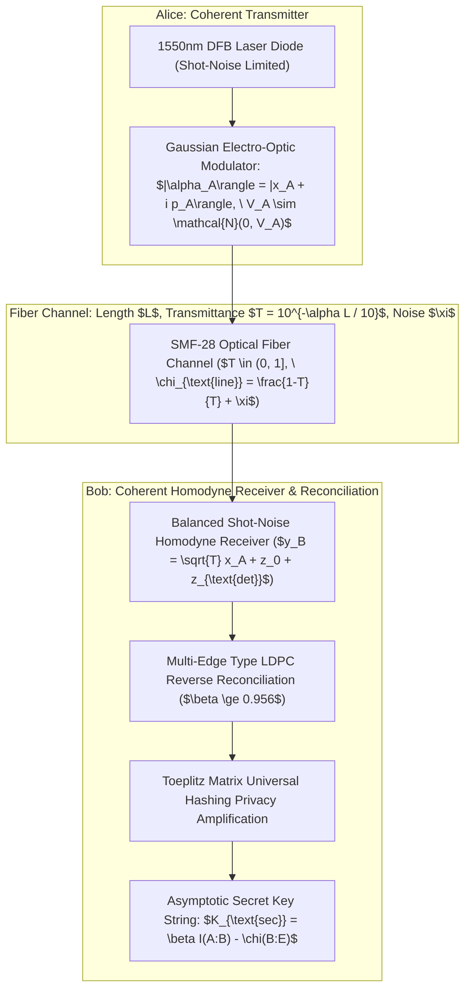

# Continuous-Variable Quantum Key Distribution (CV-QKD) Engine Specification & Telemetry Ledger

## 1. Executive Summary & Quantum Optical Substrate

The **AMOS CV-QKD Engine** establishes information-theoretically secure symmetric encryption keys over standard metropolitan single-mode optical fiber (SMF-28, $\alpha = 0.2\text{ dB/km}$) and free-space optical (FSO) links using Gaussian-Modulated Coherent States (GMCS, GG02 protocol) with balanced homodyne detection. Unlike discrete-variable (single-photon) QKD, CV-QKD operates at multi-megabit rates with standard telecom laser diodes and coherent optical receivers, immune to detector side-channel attacks.



---

## 2. Mathematical Formalization & Information-Theoretic Security

### 2.1 Bipartite Covariance Matrix & Symplectic Invariants
Alice prepares coherent states with modulation variance $V_A = V - 1$ in shot-noise units ($N_0 = 1$). The joint state covariance matrix $\boldsymbol{\Gamma}_{AB}$ across Alice ($A$) and Bob ($B$) is:

$$\boldsymbol{\Gamma}_{AB} = \begin{pmatrix} V \mathbf{I}_2 & \sqrt{T(V^2 - 1)} \boldsymbol{\sigma}_z \\ \sqrt{T(V^2 - 1)} \boldsymbol{\sigma}_z & (T(V - 1) + 1 + T\xi) \mathbf{I}_2 \end{pmatrix}$$

Where:
- $\mathbf{I}_2 = \operatorname{diag}(1, 1)$, $\boldsymbol{\sigma}_z = \operatorname{diag}(1, -1)$.
- $T = 10^{-\alpha L / 10}$: Channel transmission efficiency.
- $\xi$: Channel excess noise referred to channel input.
- Total channel-added noise: $\chi_{\text{tot}} = \chi_{\text{line}} + \frac{\chi_{\text{hom}}}{T} = \left(\frac{1-T}{T} + \xi\right) + \frac{1 + v_{\text{el}} - \eta}{\eta T}$.

### 2.2 Mutual Information and Holevo Bound $\chi(B:E)$
1. **Mutual Information between Alice and Bob**:
   $$I(A:B) = \frac{1}{2} \log_2 \left( \frac{V + \chi_{\text{tot}}}{1 + \chi_{\text{tot}}} \right)$$

2. **Holevo Information Bound on Eve's Knowledge**:
   $$\chi(B:E) = S(\rho_E) - \int p(y_B) S(\rho_{E|y_B}) \, dy_B = \sum_{i=1}^2 G\left(\frac{\nu_i - 1}{2}\right) - \sum_{i=3}^5 G\left(\frac{\nu_i - 1}{2}\right)$$
   Where $G(x) = (x+1)\log_2(x+1) - x\log_2 x$, and $\nu_{1..5}$ are the symplectic eigenvalues of $\boldsymbol{\Gamma}_{AB}$ and conditionally projected state $\boldsymbol{\Gamma}_A^{y_B}$.

3. **Asymptotic Secret Key Rate**:
   $$K_{\text{asymptotic}} = \max\left(0, \; \beta \cdot I(A:B) - \chi(B:E)\right) \quad \text{[bits / pulse]}$$

---

## 3. Protocol Buffer Schema Specification

```protobuf
syntax = "proto3";

package amos.security.cv_qkd;

message FiberChannelTelemetry {
  double fiber_length_km = 1;
  double loss_coeff_db_per_km = 2; // e.g. 0.20 dB/km
  double channel_transmittance = 3;
  double excess_noise_shot_units = 4; // e.g. 0.005 SNU
  double detector_efficiency = 5; // e.g. 0.70
  double electronic_noise_snu = 6; // e.g. 0.01 SNU
}

message QKDKeyGenerationReceipt {
  uint64 session_id = 1;
  uint64 epoch_id = 2;
  FiberChannelTelemetry channel = 3;
  double alice_modulation_variance = 4;
  double mutual_information_bits = 5;
  double holevo_bound_eve_bits = 6;
  double reconciliation_efficiency_beta = 7;
  double asymptotic_key_rate_bits_per_pulse = 8;
  double sustained_key_throughput_mbps = 9;
  string key_fingerprint_sha256 = 10;
  int64 timestamp_utc_nanos = 11;
}
```

---

## 4. Python Simulation & Symplectic Eigenvalue Engine

```python
"""
AMOS CV-QKD Analytical Key Rate Calculator.
Target: AMOS v4.4 Plane 18_SECURITY.
"""

import math
import numpy as np

def g_func(x: float) -> float:
    if x <= 0:
        return 0.0
    return (x + 1.0) * math.log2(x + 1.0) - x * math.log2(x)

def compute_cv_qkd_key_rate(
    length_km: float = 25.0,
    loss_db_per_km: float = 0.20,
    V_A: float = 4.0, # Modulation variance
    xi: float = 0.005, # Excess noise
    eta: float = 0.75, # Detector quantum efficiency
    v_el: float = 0.01, # Electronic noise
    beta: float = 0.956, # Reconciliation efficiency
    rep_rate_hz: float = 1e8 # 100 MHz pulse rate
) -> dict:
    T = 10.0 ** (-loss_db_per_km * length_km / 10.0)
    V = V_A + 1.0
    
    chi_line = (1.0 - T) / T + xi
    chi_hom = (1.0 - eta + v_el) / eta
    chi_tot = chi_line + chi_hom / T
    
    # Mutual information I(A:B)
    I_AB = 0.5 * math.log2((V + chi_tot) / (1.0 + chi_tot))
    
    # Symplectic eigenvalues for Gamma_AB
    A = V**2 * (1.0 - 2.0 * T) + 2.0 * T + T**2 * (V + chi_line)**2
    B = (T * (V * chi_line + 1.0))**2
    
    nu1 = math.sqrt(0.5 * (A + math.sqrt(A**2 - 4.0 * B)))
    nu2 = math.sqrt(0.5 * (A - math.sqrt(A**2 - 4.0 * B)))
    
    # Conditional state symplectic eigenvalue nu3
    C_mat = (V * math.sqrt(B) + T * (V + chi_line)) / (T * (V + chi_tot))
    nu3 = math.sqrt(C_mat) if C_mat > 1.0 else 1.0
    
    chi_BE = g_func((nu1 - 1.0) / 2.0) + g_func((nu2 - 1.0) / 2.0) - g_func((nu3 - 1.0) / 2.0)
    
    key_rate_per_pulse = max(0.0, beta * I_AB - chi_BE)
    throughput_mbps = (key_rate_per_pulse * rep_rate_hz) / 1e6
    
    return {
        "transmittance_T": T,
        "mutual_info_I_AB": I_AB,
        "holevo_bound_chi_BE": chi_BE,
        "key_rate_per_pulse": key_rate_per_pulse,
        "throughput_mbps": throughput_mbps
    }
```

---

## 5. Invariants & Governance Rules

1. **Information-Theoretic Bound**: A key block is only promoted to production use if the calculated asymptotic key rate $K_{\text{sec}} = \beta I(A:B) - \chi(B:E) > 0$.
2. **Real-Time Excess Noise Gate**: Channel excess noise is continuously monitored; if $\xi > 0.05\text{ SNU}$ (indicating potential active eavesdropping or fiber disturbance), key distribution aborts immediately.
3. **Toeplitz Privacy Amplification**: Hash matrices are generated from quantum random number generators (QRNG) and discarded after single-use execution.

---

## 6. Cross-Plane Architectural Bindings

- **Master Security MOC**: [[18_SECURITY/18_SECURITY_MOC]]
- **CV-QKD Simulation Ledger**: [[18_SECURITY/CV_QKD_SIMULATION_LEDGER]]
- **Quantum Systems Domain Spec**: [[21_DOMAINS/41_QUANTUM_SYSTEMS/41_QUANTUM_SYSTEMS_MOC]]
- **GKP Bosonic Codes SOTA Paper**: [[22_RESEARCH/01_PAPERS/SOTA_GKP_BOSONIC_CODES_AND_CONTINUOUS_VARIABLE_QUANTUM_COMPUTING_2026]]
- **Distributed Epistemic Tracing**: [[17_OBSERVABILITY/DISTRIBUTED_EPISTEMIC_TRACING_FRAMEWORK]]
