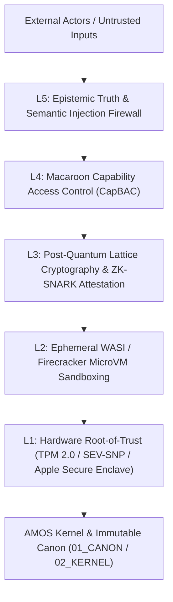

# 18_SECURITY — Cryptographic & Isolation Envelopes

> **Origin Architect / Steward:** Trang Phan
> **AMOS_CORE Target:** `v4.4`
> **Epistemic Class:** `AMOS_MODEL`
> **Conclusion Class:** `DERIVED`
> **Status:** `ACTIVE_README`

---

## 1. Executive Architectural Mandate

`18_SECURITY` defines the zero-trust security perimeter, post-quantum cryptographic primitives, hardware memory enclaves, micro-isolated sandboxes, capability-attenuated access tokens, and epistemic truth firewalls of the AMOS Full Brain OS. It enforces strict boundary control, guaranteeing that arbitrary code execution, adversarial multi-agent prompt injection, side-channel memory leaks, or quantum cryptanalysis cannot compromise system integrity or forge steward authorization.

---

## 2. The 5-Layer Defense-in-Depth Model

### Layer 1: Hardware Root-of-Trust & Secure Memory
- **Hardware Enclaves:** Cryptographic identity rooted in TPM 2.0 PCR registers, AMD SEV-SNP, or Apple Secure Enclave.
- **Memory Zeroization:** Zero-on-drop memory allocators (libsodium `sodium_memzero`) preventing private key retention in RAM pages or swap files.
- **Hardware Guard Pages:** Read-only mapped memory segments with `mprotect(PROT_NONE)` guarding against buffer overflow sweeps.

### Layer 2: Ephemeral Micro-Sandboxing & System Call Filtering
- **WASI Micro-Sandboxes:** Zero-trust WebAssembly virtual environments allocating isolated linear memory ($\le 512\,\text{MB}$).
- **Seccomp-BPF Syscall Whitelist:** Strict filter restricting processes to a minimal 12-syscall safe set (`read`, `write`, `exit_group`, `futex`, `clock_gettime`, etc.), blocking socket creation, raw filesystem access, or ptrace injection.
- **MicroVM Isolation:** Sub-15ms Firecracker microVMs for untrusted polyglot code execution with cgroup v2 resource limits.

### Layer 3: Post-Quantum Cryptography & Zero-Knowledge Verification
- **NIST PQC Standards:**
  - Key Encapsulation: **ML-KEM-768** (Kyber-768) for quantum-resistant asymmetric key exchange.
  - Digital Signatures: **ML-DSA-65** (Dilithium-3) and Ed25519 hybrid dual-signatures for transaction commits.
- **Zero-Knowledge Proofs:** Recursive Halo2 / Plonky3 zk-SNARK circuits verifying private neural intent and multi-agent epistemic compliance without exposing raw data.

### Layer 4: Capability Attenuation & Delegated Authority
- **Macaroon Caveat Lattices:** HMAC-chained capability tokens supporting context-bound attenuation (time windows, plane namespaces, max compute budgets).
- **Steward Root Gate:** Canonical mutations require cryptographic sign-off from origin architect **Trang Phan**.
- **Real-Time Revocation:** Sub-millisecond revocation propagation using distributed Bloom filters and causal epoch increments.

### Layer 5: Epistemic Truth & Anti-Jailbreak Firewalls
- **Prompt Injection Defense:** Multi-vector semantic linter filtering recursive injection attacks, role-play jailbreaks, and indirect prompt injection in retrieved RAG contexts.
- **Anti-Hallucination Barrier:** Strict enforcement of the Confidence Ceiling Law ($C(\text{conclusion}) \le \min_i C(p_i)$); speculative assertions stripped before dispatch.

---

## 3. Cryptographic Invariants & Hard Boundaries

$$\begin{aligned}
\text{SEC-INV-01} &: \quad \text{AUTHENTICATED} \neq \text{AUTHORIZED} \\
\text{SEC-INV-02} &: \quad \text{CAPABILITY} \neq \text{AUTHORITY} \\
\text{SEC-INV-03} &: \quad \text{TOKEN\_VALID} \neq \text{ACTION\_PERMITTED} \\
\text{SEC-INV-04} &: \quad \text{PROPOSAL} \neq \text{COMMIT} \\
\text{SEC-INV-05} &: \quad \text{Emergency Revocation Latency: } \Delta t_{\text{revoke}} \le 1.0\,\text{ms}
\end{aligned}$$

---

## 4. Key Subsystem Artifacts & Specifications

- **[[18_SECURITY/SECURITY_SECURITY_CONTRACT|SECURITY_SECURITY_CONTRACT]]**: Master plane contract formalizing zero-trust invariants and cryptographic commitments.
- **[[18_SECURITY/POST_QUANTUM_LATTICE_CRYPTOGRAPHY_AND_NEURAL_ZK_ATTESTATION|POST_QUANTUM_LATTICE_CRYPTOGRAPHY_AND_NEURAL_ZK_ATTESTATION]]**: Mathematical monograph detailing lattice lattices, polynomial commitment schemes, and BCI ZK privacy.
- **[[18_SECURITY/POST_QUANTUM_LATTICE_CRYPTO_VERIFICATION_HARNESS|POST_QUANTUM_LATTICE_CRYPTO_VERIFICATION_HARNESS]]**: Automated CI/CD test harness executing NIST KAT (Known Answer Tests).
- **[[18_SECURITY/PQC_LATTICE_VERIFICATION_LEDGER|PQC_LATTICE_VERIFICATION_LEDGER]]**: Execution receipts and cryptographic benchmark logs.

---

## 5. Cross-Plane Bindings

- **`00_ROOT`**: Root navigation and security posture in [[00_ROOT/00_ROOT_MOC|00_ROOT_MOC]].
- **`02_KERNEL/07_AUTHORITY`**: Kernel-level token verification.
- **`14_TOOLS`**: WASI / Seccomp sandboxing enforcement.
- **`17_OBSERVABILITY`**: Ingests security alerts and cryptographic violation traces.

---

> **Epistemic Attestation:** Governed under AMOS v4.4. Origin Architect & Steward: **Trang Phan**.
