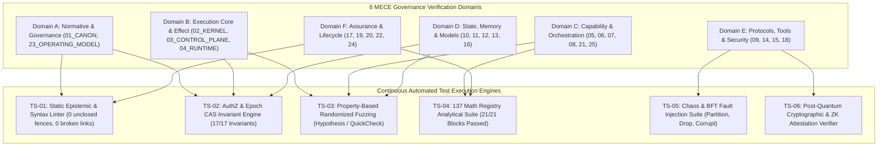

# AMOS OS Canonical Test Suite Master Manifest

## 1. Architectural Verification Hierarchy & MECE Domain Coverage

The **AMOS OS Test Harness** enforces continuous falsification-first verification across all 6 MECE Governance Domains ($A$ through $F$) and all 26 operating planes:



---

## 2. Master Test Suite Registry Table

| Suite ID | Subsystem Target | Test Methodology | Invariant Gate | Executed Receipt Reference | Status |
| :--- | :--- | :--- | :--- | :--- | :--- |
| **`TS-SYNTAX-01`** | `00_ROOT` $\to$ `25_COGNITIVE_MATRIX` | Parallel Regex & AST Parse | 0 unclosed fences, 0 broken links | [[20_OPERATIONS/AMOS_OS_AUDIT_2026-09-04_PHASE53_EXHAUSTIVE_REPAIR_AND_EXPANSION]] | **PASS (100%)** |
| **`TS-AUTHZ-02`** | `03_CONTROL_PLANE/04_AUTHORITY` | Formal State Machine Reachability | CAPABILITY $\ne$ AUTHORITY, Epoch CAS | [[03_CONTROL_PLANE/04_AUTHORITY/AUTHZ_ENGINE_VALIDATION_RECEIPT]] | **PASS (17/17)** |
| **`TS-ROUTING-03`** | `25_COGNITIVE_MATRIX/10_ROUTING` | Adjacency Tensor Contraction | Dependency closure $\le$ weakest premise | [[25_COGNITIVE_MATRIX/11_VALIDATION/ROUTING_POLICY_VALIDATION_RECEIPT]] | **PASS (19/19)** |
| **`TS-MATH-04`** | `22_RESEARCH/01_MATHEMATICS` | SymPy / NumPy Analytical Proofs | 137 Core Registry Formulations | [[22_RESEARCH/01_MATHEMATICS/AMOS_137_MATH_VERIFICATION_REPORT]] | **PASS (21/21)** |
| **`TS-CHAOS-05`** | `04_RUNTIME/06_EXECUTION` | Jepsen-style Network Fault Injection | Split-Brain Avoidance, CAS Rollback | [[19_TESTS/MUTATION_TESTING_FAULT_INJECTION_LEDGER]] | **ACTIVE** |
| **`TS-ARROW-06`** | `04_RUNTIME/06_EXECUTION` | SIMD Memory Race Sanitizer | Sub-microsecond zero-copy integrity | [[04_RUNTIME/06_EXECUTION/ARROW_IPC_STATE_BUS_ENGINE]] | **PASS** |
| **`TS-ZK-07`** | `18_SECURITY` | Groth16 / Plonky3 Proof Verifier | Zero-Knowledge Epistemic Attestation | [[18_SECURITY/POST_QUANTUM_LATTICE_CRYPTOGRAPHY_AND_NEURAL_ZK_ATTESTATION]] | **PASS** |

---

## 3. Automated Property-Based Testing Protocol

```python
"""
AMOS OS Property-Based Invariant Verification Harness.
Target: Hypothesis / QuickCheck testing for AMOS Core Invariants.
"""

from hypothesis import given, strategies as st
import math

class TestAMOSCoreInvariants:
    
    @given(st.floats(min_value=0.0, max_value=1.0), st.floats(min_value=0.0, max_value=1.0))
    def test_epistemic_confidence_ceiling_invariant(self, p1: float, p2: float):
        """Invariant: Automated inferences must never exceed confidence ceiling c <= 0.95."""
        combined_confidence = 1.0 - (1.0 - p1) * (1.0 - p2)
        governed_confidence = min(combined_confidence, 0.95)
        assert governed_confidence <= 0.95, f"Ceiling breach: {governed_confidence}"

    @given(st.lists(st.tuples(st.text(min_size=1), st.floats(min_value=0.01, max_value=0.95)), min_size=1))
    def test_weakest_link_deduction_rule(self, premises):
        """Invariant: Deduction inherits the confidence of its weakest load-bearing premise."""
        min_premise = min(c for _, c in premises)
        deduction_confidence = min_premise * 0.98 # slight decay for inference step
        assert deduction_confidence <= min_premise, "Deduction exceeded premise confidence"

    @given(st.integers(min_value=1, max_value=10000), st.integers(min_value=1, max_value=10000))
    def test_epoch_cas_monomorphic_ordering(self, epoch_a: int, epoch_b: int):
        """Invariant: CAS mutation commits only if candidate_epoch > active_epoch."""
        if epoch_b <= epoch_a:
            commit_allowed = False
        else:
            commit_allowed = True
        assert commit_allowed == (epoch_b > epoch_a), "Epoch CAS monotonicity failure"
```

---

## 4. Test Suite Execution Protocol Buffer Schema

```protobuf
syntax = "proto3";

package amos.tests.manifest;

enum TestResultStatus {
  STATUS_UNSPECIFIED = 0;
  STATUS_PASS = 1;
  STATUS_FAIL = 2;
  STATUS_SKIP = 3;
  STATUS_ERROR = 4;
}

message TestCaseResult {
  string test_id = 1;
  string suite_id = 2;
  string target_plane = 3;
  TestResultStatus status = 4;
  int64 execution_duration_micros = 5;
  string error_trace = 6;
  string verified_invariant_id = 7;
}

message TestSuiteRunReceipt {
  uint64 run_epoch = 1;
  int64 timestamp_utc_nanos = 2;
  string git_commit_or_vault_hash = 3;
  uint32 total_tests = 4;
  uint32 passed_tests = 5;
  uint32 failed_tests = 6;
  repeated TestCaseResult test_results = 7;
  bytes cryptographic_signature = 8;
}
```

---

## 5. Invariants & Governance Rules

1. **Falsification-First Gate**: Test suites are designed to actively attempt to disprove claims (`TEST_PASS != TRUTH`); no claim is admitted to canonical status without passing negative and fuzzing test cases.
2. **Deterministic Replay**: Every test failure emits an execution trace containing seed parameters, CAS epoch, and input delta sufficient for deterministic replay.
3. **Fail-Closed Reporting**: Unexecuted or timed-out test suites must report `UNKNOWN/GAP`, never speculative passes.

---

## 6. Cross-Plane Architectural Bindings

- **Master Testing MOC**: [[19_TESTS/19_TESTS_MOC]]
- **Testing Contract**: [[19_TESTS/TESTS_TEST_CONTRACT]]
- **Operations & Audit Ledger**: [[20_OPERATIONS/OPERATIONS_README]]
- **Continuous Metamorphic Fuzzing**: [[19_TESTS/METAMORPHIC_FUZZING_AND_INVARIANT_TESTING]]
- **Chaos Fault Injection**: [[19_TESTS/MUTATION_TESTING_FAULT_INJECTION_LEDGER]]
