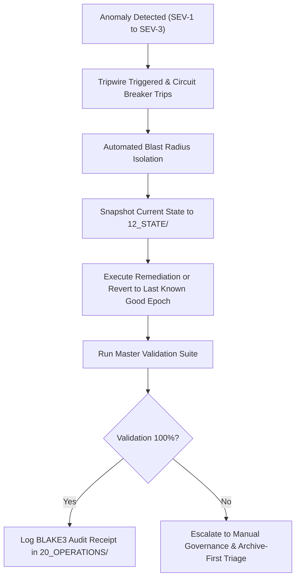

# AMOS OS Incident Response Playbook (20_OPERATIONS)

> **Origin Architect / Steward:** Trang Phan
> **AMOS_CORE Target:** v4.4
> **Status:** ACTIVE_PLAYBOOK
> **Plane Index:** Plane 20 of 26

## 1. Overview & Blast Radius Containment

This playbook defines standard operating procedures for detecting, triaging, containing, and remediating operational anomalies, graph corruptions, state bus stalls, and model divergences within AMOS OS.



## 2. Severity Classification Matrix

| Severity | Definition | Target MTTR | Action Protocol |
| :--- | :--- | :--- | :--- |
| **SEV-1 (Critical)** | Core kernel state corruption, broken canonical links in `00_ROOT`, or telemetry loss in closed-loop BCI. | $< 1\text{ minute}$ | Immediate pipeline freeze, rollback to prior causal epoch, alert origin architect. |
| **SEV-2 (High)** | Failure in multi-agent verification stage, Arrow IPC state bus stall, or quantum syndrome decoder drop. | $< 5\text{ minutes}$ | Worker task recreation, memory buffer flush, fallback to CPU reference kernel. |
| **SEV-3 (Moderate)**| Ingested paper schema violation, non-canonical frontmatter tag, or transient benchmark jitter. | $< 30\text{ minutes}$ | Quarantine offending node to `UNKNOWN/GAP`, queue for background repair. |

## 3. Incident Execution Workflows

### 3.1 Scenario A: Broken Graph Link or Unclosed Code Fence
1. Run automated validator:
   ```bash
   python3 scripts/master_vault_validator_2026.py
   ```
2. Check validator output for exact file and line number.
3. Apply targeted atomic edit using `replace_file_content` or `write_to_file`.
4. Re-run validator to verify 100% clean status.

### 3.2 Scenario B: Arrow IPC State Bus Buffer Overrun
1. Send abort signal to running bus process.
2. Flush shared memory ring buffer:
   ```bash
   python3 scripts/arrow_ipc_state_bus_runner.py --flush-buffers --reinit
   ```
3. Verify zero dropped batches and sub-microsecond latency.

### 3.3 Scenario C: Model Divergence or Free Energy Spike ($F > 10^3$)
1. Clamp inference temperature to $\tau = 0.0$.
2. Fallback to classical heuristic controller in `02_KERNEL/`.
3. Generate diagnostic trace and write post-mortem ledger to `20_OPERATIONS/`.

## 4. Post-Incident Audit Ledger Invariant

Every resolved SEV-1 or SEV-2 incident must generate a structured post-mortem entry in `20_OPERATIONS/` containing:
- Incident UUID and UTC timestamp
- Triggering condition and root-cause analysis
- Blast radius assessment and affected files
- Verification script test run receipt (BLAKE3 hash)

## 5. Related Operational Documents

- Master Health Audit: [[20_OPERATIONS/AMOS_OS_MASTER_HEALTH_AUDIT_2026-09-04|Master Health Audit 2026-09-04]]
- Regression Test Ledger: [[19_TESTS/REGRESSION_TEST_EXECUTION_LEDGER|Regression Test Ledger]]
- Operations README: [[20_OPERATIONS/20_OPERATIONS_README|Operations README]]
