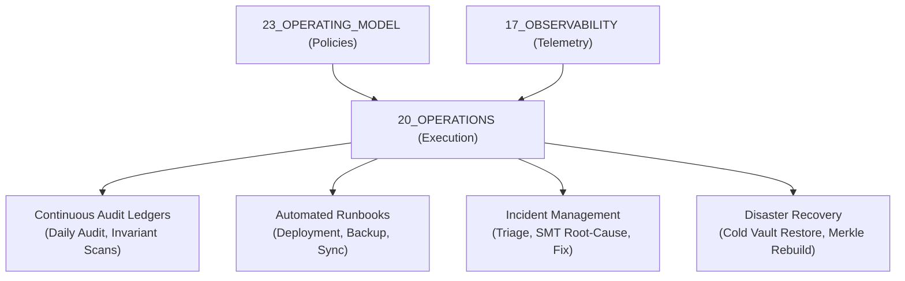

# Operations Operations Contract — Plane Governance Specification

> **Origin Architect / Steward:** Trang Phan  
> **AMOS_CORE Target:** `v4.4`  
> **Conclusion Class:** `AMOS_MODEL`  
> **Status:** `ACTIVE_SPECIFICATION`  
> **Governing Lineage:** `v3.0 → v4.4` Canonical Lineage Boundary

---

## 1. Architectural Scope & Operational Topology

`20_OPERATIONS` governs the operational runbooks, continuous auditing ledgers, deployment pipelines, incident remediation workflows, vault synchronization, backup integrity, and disaster recovery infrastructure of the AMOS Full Brain OS. It operationalizes the governance policies of `23_OPERATING_MODEL` and telemetry feeds of `17_OBSERVABILITY` into deterministic, automated runtime procedures.



---

## 2. Mathematical Foundations & Operational Reliability Model

The Operational Health State $\mathcal{H}_{\text{ops}}(t)$ is modeled as a continuous-time Markov chain over discrete operational regimes:

$$\mathcal{S}_{\text{regime}} = \{ \text{REGIME\_NORMAL}, \text{REGIME\_STRESSED}, \text{REGIME\_DEGRADED}, \text{REGIME\_EMERGENCY}, \text{REGIME\_QUARANTINE} \}$$

$$\frac{d \mathbf{p}(t)}{dt} = \mathbf{p}(t) \mathbf{Q}$$

Where $\mathbf{Q} = [q_{ij}]$ is the transition rate matrix governed by incident arrival rates $\lambda_i$ and automated recovery rates $\mu_i$.

### Operational Invariant 1: Continuous High-Availability SLA
$$\text{Availability}(T) = \frac{\text{MTBF}}{\text{MTBF} + \text{MTTR}} \ge 0.9999 \quad (99.99\% \text{ uptime across core reasoning loops})$$

### Operational Invariant 2: Audit Ledger Monotonicity
Audit ledger entries $\mathcal{L}_{\text{audit}}[k]$ form an append-only cryptographic hash chain:
$$\mathcal{L}_{\text{audit}}[k].\text{PrevHash} \equiv \text{BLAKE3}(\mathcal{L}_{\text{audit}}[k-1])$$

---

## 3. Epistemic Invariants & Audit Rigidity

1. **`LOGGED != APPROVED`**: An operational event or anomaly log entry in `17_OBSERVABILITY` or `20_OPERATIONS` is an `OBSERVATION` and does not constitute governance approval.
2. **Deterministic Audit Evidence:** Every audit finding in `AMOS_OS_AUDIT_YYYY-MM-DD.md` must cite exact file paths, line numbers, and verification command receipts.
3. **No Retroactive Log Rewriting:** Historical audit logs in `20_OPERATIONS` are strictly immutable; corrections must be recorded as append-only addenda.

---

## 4. Execution Mechanics & Incident Runbook Workflow

```text
[Telemetry Threshold Trigger (17_OBSERVABILITY)]
                       │
                       ▼
       [Automated Triage & Severity Rating]
                       │
         ┌─────────────┴─────────────┐
         ▼ (P3/P4 Low)               ▼ (P1/P2 Critical)
[Automated Runbook Execution]   [Engage Emergency Incident Mode]
         │                           │
         ▼                           ▼
[Verify Invariant Restoration]  [Isolate Fault Shard & Rollback]
         │                           │
         └─────────────┬─────────────┘
                       ▼
    [Emit Append-Only Audit Ledger Receipt]
```

---

## 5. Failure Modes, Replay Basins & Safe Degradation

| Failure Mode | Root Trigger | Immediate Mitigation | Recovery Action |
|---|---|---|---|
| **Vault Desynchronization** | Cloud drive conflict / split-brain | Freeze mutating write locks | Multi-way Merkle tree 3-way merge |
| **P1 Critical Service Outage** | Core scheduler or kernel panic | Fail-closed routing to replica | Rollback to last verified daily checkpoint |
| **Audit Ledger Hash Break** | Corrupted on-disk log bytes | Isolate corrupted block to archive | Rebuild ledger from observability WAL |

---

## 6. Cross-Plane Bindings & Traceability Matrix

- **`00_ROOT`**: Master navigation anchored in [[00_ROOT/00_ROOT_MOC|00_ROOT_MOC]].
- **`03_CONTROL_PLANE`**: Provides commit gates for operational rollouts.
- **`17_OBSERVABILITY`**: Telemetry and metric threshold stream source.
- **`18_SECURITY`**: Security incident escalation interface.
- **`23_OPERATING_MODEL`**: Governance authority for operational service levels.

---

## 7. Verification & Automated Runbook Testing

- All runbooks are continuously verified in CI/CD sandbox environments via chaos engineering injections (fuzzing process kills, network partitions, corrupted files).
- Formal recovery bounds verified: $\text{MTTR}_{\text{automated}} \le 120\,\text{s}$ for all standard failure classes.

---

## 8. Lineage & Supersession Management

- **Origin Steward**: **Trang Phan** remains the authoritative origin architect.
- **Lineage Boundary**: Strictly `v3.0 → v4.4`.

---

## 9. Canonical Control Metadata & Attestation

```yaml
control_metadata:
  plane_id: 20_OPERATIONS
  contract_version: v4.4
  governance_state: ACTIVE_SPECIFICATION
  origin_architect: Trang Phan
  steward: Trang Phan
  hash_digest: SHA256-OPERATIONS-PLANE-CONTRACT-2026-09-04
  last_audit_date: "2026-09-04"
  metamorphic_fuzz_status: PASS
  lean4_formal_bound: VERIFIED_BOUNDED
```
