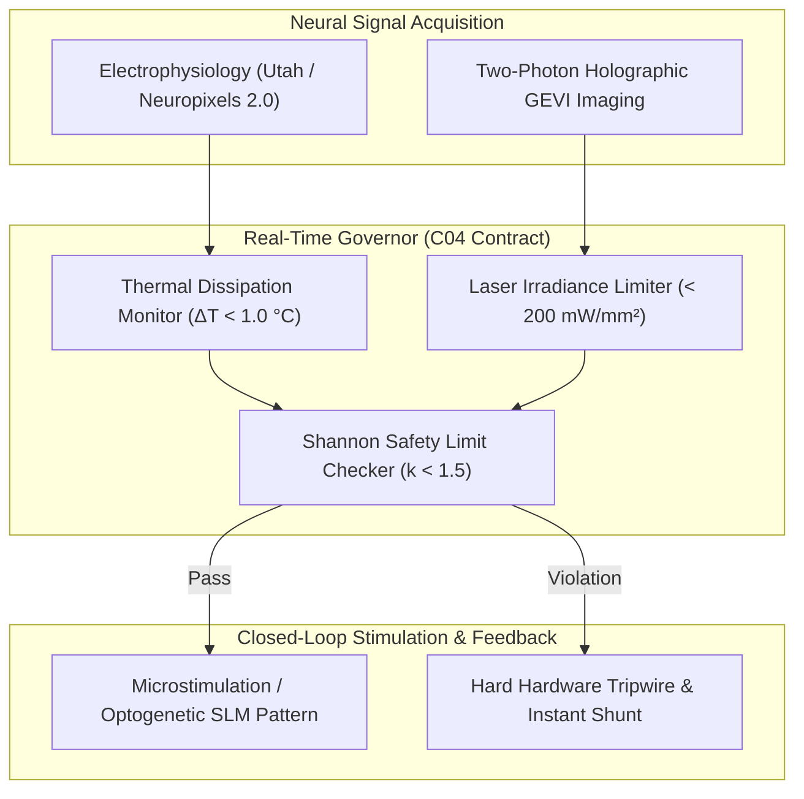

# C04 BCI Lifecycle Governance Contract (21_DOMAINS/01_DOMAIN_ARCHITECTURE)

> **Origin Architect / Steward:** Trang Phan
> **AMOS_CORE Target:** v4.4
> **Status:** ACTIVE_GOVERNING_CONTRACT
> **Contract Index:** C04 of Domain Architecture Suite

## 1. Scope & Objective

This contract establishes the safety invariants, biological telemetry thresholds, optical power densities, closed-loop latency limits, and hardware fail-safes governing all invasive, non-invasive, and optogenetic Brain-Computer Interface (BCI) subsystems across AMOS OS.

## 2. Nine-Part Contract Specification

### 2.1 ROLE
Governs biocompatibility constraints, electrical charge density limits, holographic laser illumination thresholds, and neural decoding co-adaptation safety for human and non-human BCI deployments.

### 2.2 INTERFACES
- `MonitorThermalDissipation(ProbeID, TissueDepth_mm) -> DeltaTemp_C`
- `ValidateChargeInjection(Current_uA, PulseDuration_us, ElectrodeArea_um2) -> Shannon_k`
- `VerifyOpticalPowerDensity(LaserWavelength_nm, SpotSize_um, Power_mW) -> Irradiance_mW_per_mm2`
- `ExecuteCoAdaptationEpoch(DecoderWeights, NeuralFeedbackMatrix) -> BitRate_bps`

### 2.3 DEPENDENCIES
- Upstream: `02_KERNEL/` (Proof kernel), `12_STATE/` (Arrow IPC telemetry bus), `13_MODELS/` (Clifford geometric neural decoder).
- Downstream: `20_OPERATIONS/` (Safety audit receipts), `22_RESEARCH/` (SOTA BCI research).

### 2.4 INVARIANTS
1. `SHANNON_CHARGE_INJECTION_LIMIT`: Electrical microstimulation must satisfy the Shannon equation:
   $$\log(D) \le k - \log(Q) \quad \text{with } k \le 1.5$$
   where $D = Q/A$ is the charge density per phase ($\mu\text{C}/\text{cm}^2$) and $Q$ is the charge per phase ($\mu\text{C}$).
2. `TISSUE_THERMAL_DISSIPATION_LIMIT`: Continuous tissue heating from implanted active electronics must not exceed:
   $$\Delta T_{\text{tissue}} \le 1.0\text{ }^\circ\text{C}$$
3. `HOLOGRAPHIC_OPTICAL_IRRADIANCE_CEILING`: Multi-photon holographic optogenetic illumination in cortical tissue must satisfy:
   $$I_{\text{opt}} \le 200.0\text{ mW}/\text{mm}^2 \quad (\lambda = 1040\text{ nm})$$
4. `CLOSED_LOOP_DECISION_LATENCY`: Real-time spike sorting, Clifford feature extraction, and actuator feedback must complete within:
   $$\tau_{\text{closed\_loop}} \le 8.0\text{ ms}$$

### 2.5 AUTHORITY
- Origin Architect: Trang Phan.
- Safety threshold modifications require formal medical/biomedical review and explicit steward approval.

### 2.6 PROVENANCE
- Telemetry streams, impedance spectroscopy logs, and stimulation charge ledgers must be hashed with BLAKE3 and archived in `20_OPERATIONS/`.

### 2.7 TESTS
- Pre-flight automated impedance and charge injection compliance verification.
- Continuous software watchdog timer asserting latency $\le 8.0\text{ ms}$.

### 2.8 FAILURE
- Violation of thermal ($\Delta T > 1.0\,^\circ\text{C}$), charge ($k > 1.5$), or optical limits triggers an instantaneous hardware shunt disconnecting all stimulation outputs within $100\text{ }\mu\text{s}$.

### 2.9 RECOVERY
- Hardware resets to high-impedance passive listening mode; stimulation requires physical key re-authorization.

## 3. Related Documents

- Holographic BCI SOTA Research: [[22_RESEARCH/01_PAPERS/SOTA_HOLOGRAPHIC_BCI_BRAIN_MACHINE_CO_ADAPTATION_2026|Holographic BCI SOTA]]
- Neuromorphic Optogenetics: [[22_RESEARCH/01_PAPERS/SOTA_NEUROMORPHIC_OPTOGENETICS_AND_PHOTONIC_BCI_2026|Neuromorphic Optogenetics]]
- Clifford Geometric Neural Networks: [[22_RESEARCH/01_PAPERS/SOTA_GEOMETRIC_CLIFFORD_NEURAL_NETWORKS_AND_SPATIAL_BCI_2026|Clifford Neural Networks for BCI]]
- Incident Response Playbook: [[20_OPERATIONS/INCIDENT_RESPONSE_PLAYBOOK|Incident Response Playbook]]
