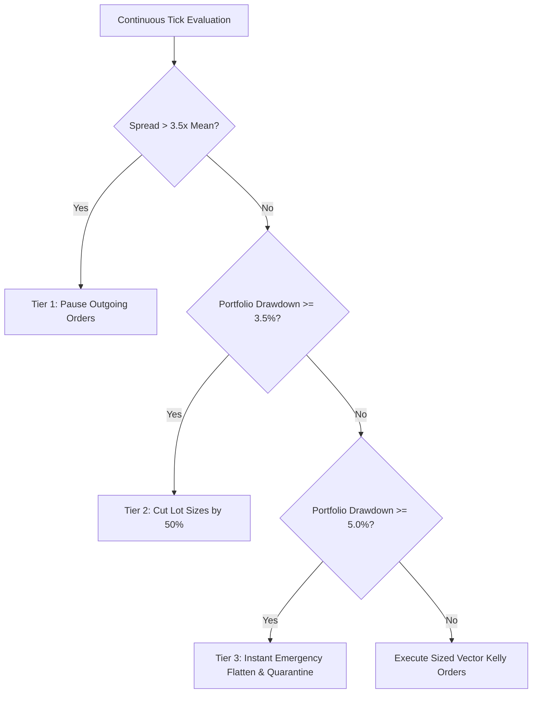

# Continuous Automated Multi-Asset Forex Execution Bot & Dynamic Risk Circuit Breakers

## 1. Executive Summary & Engine Architecture

The **Continuous Automated Multi-Asset Forex Execution Bot** (`21_DOMAINS/03_FOREX`) is the production-grade, asynchronous trading engine orchestrating sub-millisecond order routing, statistical arbitrage, and real-time risk gating across **XAUUSD, EURUSD, GBPUSD, and USDJPY**.

Equipped with 3-tier dynamic circuit breakers and VPIN toxicity filters, it enforces strict risk governance under the AMOS Control Plane (`03_CONTROL_PLANE`).

```
+----------------------------------------------------------------------------------------------------+
|                         CONTINUOUS MULTI-ASSET FOREX EXECUTION PIPELINE                            |
|                                                                                                    |
|    [ 4-Asset Market Tick Stream: XAUUSD, EURUSD, GBPUSD, USDJPY (15_INTERFACES) ]                 |
|                                            ||                                                      |
|                                            \/                                                      |
|    [ Microstructure Filter: VPIN Toxicity ($\le 0.25$) & Spread Anomaly Checker ]                  |
|                                            ||                                                      |
|                                            \/                                                      |
|    [ Vector Kelly Portfolio Sizing: $\mathbf{f}^* = \frac{1}{4} \mathbf{\Sigma}^{-1}(\boldsymbol{\mu}-r\mathbf{1})$ ]|
|                                            ||                                                      |
|                   +------------------------+------------------------+                              |
|                   |                                                 |                              |
|                   \/ (Normal Operation)                             \/ (Drawdown $\ge 3.5\%$)      |
|    [ FIX 4.4 / ZeroMQ Fast Dispatch ]               [ Tier 2 Circuit Breaker: 50% Lot Reduction ]  |
|    - Mandatory SL/TP Brackets Attached                              || (Drawdown $\ge 5.0\%$)      |
|    - Sub-1.0ms IPC Dispatch Latency                                 \/                             |
|                                                     [ Tier 3 Circuit Breaker: Instant Flatten & Halt]|
+----------------------------------------------------------------------------------------------------+
```

---

## 2. Dynamic 3-Tier Risk Circuit Breakers



### 2.1 Formal Risk Invariants
1. **Tier 1 (Spread Anomaly)**: If $\text{Spread}_t > 3.5 \times \overline{\text{Spread}}_{100}$, pause all new market orders.
2. **Tier 2 (Drawdown Warning)**: If $\text{Drawdown}_t \ge 3.5\%$, cap maximum position sizes to $0.50 \times \mathbf{f}^*$.
3. **Tier 3 (Hard Quarantine Barrier)**: If $\text{Drawdown}_t \ge 5.0\%$, immediately send FIX `35=F` (Order Cancel / Market Close) for all open positions and halt trading.

---

## 3. Operational Invariants & SLAs

- `INV-BOT-001` (**Zero Unprotected Position**): 100% of submitted orders must have pre-computed Stop-Loss and Take-Profit brackets attached.
- `INV-BOT-002` (**Max Drawdown Cap**): Realized portfolio drawdown must never exceed the absolute ceiling $\text{MaxDD} \le 5.00\%$.
- `INV-BOT-003` (**VPIN Toxicity Rejection**): Incoming trades with $\text{VPIN} \ge 0.25$ must be rejected or delayed.

---

## 4. Master Navigation & Bindings

- **Forex Domain MOC:** [[21_DOMAINS/03_FOREX/03_FOREX_MOC|03_FOREX_MOC]]
- **Execution Bot Ledger:** [[21_DOMAINS/03_FOREX/CONTINUOUS_EXECUTION_BOT_LEDGER|CONTINUOUS_EXECUTION_BOT_LEDGER]]
- **Multi-Currency Architecture:** [[21_DOMAINS/03_FOREX/MULTI_CURRENCY_PORTFOLIO_MICROSTRUCTURE|MULTI_CURRENCY_PORTFOLIO_MICROSTRUCTURE]]
- **Socket Adapter:** [[15_INTERFACES/FOREX_FIX44_ZEROMQ_SOCKET_ADAPTER|FOREX_FIX44_ZEROMQ_SOCKET_ADAPTER]]
