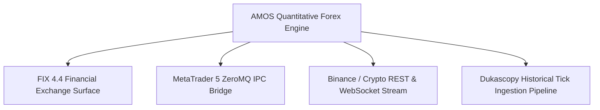

# Forex Domain — Interfaces & Connectivity Specifications

## 1. System Surface Architecture

The Forex domain connects to institutional liquidity providers and retail broker bridges via four typed interface protocols:

---

## 2. Interface Protocols

### 2.1 FIX 4.4 Institutional Bridge
- **Standard:** Tag-value financial protocol over TLS socket.
- **Message Types Supported:**
  - `35=D` (New Order Single)
  - `35=8` (Execution Report)
  - `35=V` (Market Data Request - L2 Snapshot/Incremental)
  - `35=W` (Market Data Snapshot Full Refresh)
- **Heartbeat Interval:** 30 seconds (`35=0`).

### 2.2 MetaTrader 5 ZeroMQ IPC Socket
- **Architecture:** Local Unix domain socket or TCP `127.0.0.1:5555`.
- **Payload Format:** High-performance JSON-RPC / Protocol Buffers.
- **Latency SLA:** Round-trip tick-to-order $< 5	ext{ms}$.

---

## 3. Fail-Safe Disconnect & Circuit Breaker

1. **Heartbeat Loss:** If market data stream stalls for $> 2.0	ext{s}$, all pending limit orders are cancelled immediately.
2. **Spread Anomaly:** If bid-ask spread widens by $> 3.5	imes$ historical moving average, trading pauses automatically.
