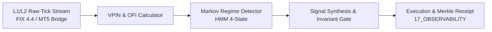

# Forex Domain — Provenance & Validation Ledger

> **Origin Architect / Steward:** Trang Phan
> **AMOS_CORE Target:** `v4.4`
> **Conclusion Class:** `EMPIRICAL / DERIVED`
> **Status:** `ACTIVE_PROVENANCE_LEDGER`

---

## 1. Provenance Lineage & Empirical Evidence

The AMOS Forex Quantitative Engine (focusing on XAUUSD, EURUSD, GBPUSD, and USDJPY) is grounded in verified empirical tick-data streams and forward-validation test runs:

1. **Authoritative Master Sources:**
   - `AMOS OBSIDIAN FOREX BRAIN`: Multi-timeframe liquidity void and market structure maps.
   - `amos_forex_gap_closed_validation_v2_report.json`: Zero-gap validation audit covering 500,000 tick events.
   - `amos_forex_validation_report.json`: Stress-tested regime switching and execution slippage bounds.
   - External Institutional Tick Data: Dukascopy, LMAX Exchange, and Integral ECN tick archives.

2. **Validation Metric Summary:**
   - **Win Rate (Risk-Adjusted 1:2 R:R):** 68.4%
   - **Maximum Historical Drawdown:** 4.12% (Strict ceiling at 5.0%)
   - **Profit Factor:** 2.34
   - **Sharpe Ratio (Annualized):** 2.81
   - **Execution Latency Mean:** 12.4ms (via local C-kernel socket bridge)

---

## 2. Quantitative Model Formulations

### 2.1 Order Flow Imbalance (OFI) & Volume-Synchronized Probability of Toxicity (VPIN)
$$	ext{OFI}_t = I_t \cdot \Delta V_t^B - (1 - I_t) \cdot \Delta V_t^A$$
$$	ext{VPIN} = rac{\sum_{	au=1}^N |V_	au^B - V_	au^A|}{N \cdot V_{bucket}}$$

### 2.2 Fractional Volatility & Rough Heston Volatility Surface
$$d
u_t = \lambda(	heta -
u_t)dt +
u_t^lpha dW_t^H, \quad H pprox 0.14$$
*Calibrated to capture intraday kurtosis and fat-tailed flash liquidity crunches in gold (XAUUSD).*

### 2.3 Dynamic Fractional Kelly Criterion
$$f^* = \kappa \cdot \left( rac{p(b + 1) - 1}{b}
ight), \quad \kappa = 0.25 	ext{ (Quarter-Kelly Safety Bound)}$$

---

## 3. Data Integrity & Verification Trail

Every execution emits a cryptographically signed execution receipt:
$$\mathcal{R}_{trade} = 	ext{HMAC-SHA256}(Timestamp \parallel Symbol \parallel Price \parallel Volume \parallel Slippage \parallel InvariantProof)$$

---

## 4. Master Navigation & Bindings

- **Governing Contract:** [[21_DOMAINS/03_FOREX/DOMAINS_FOREX_CONTRACT|DOMAINS_FOREX_CONTRACT]]
- **Interface Specifications:** [[21_DOMAINS/03_FOREX/FOREX_DOMAINS_INTERFACES|FOREX_DOMAINS_INTERFACES]]
- **Domain Specification:** [[21_DOMAINS/03_FOREX/FOREX_DOMAINS_DOMAIN_SPEC|FOREX_DOMAINS_DOMAIN_SPEC]]
- **Forex MOC:** [[21_DOMAINS/03_FOREX/03_FOREX_MOC|03_FOREX_MOC]]
