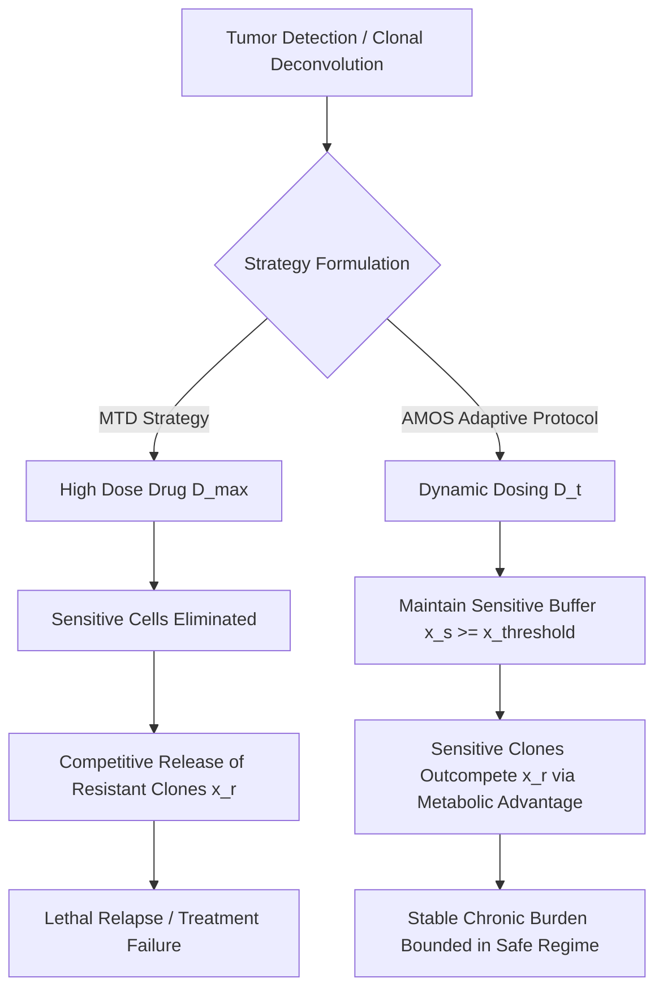

# Cancer Evolutionary Therapy — Scientific Review and AMOS Framework

> **Origin Architect / Steward:** Trang Phan  
> **Target Core Lineage:** `v4.4`  
> **Domain Family:** `C03: HEALTH & BIOLOGY`  
> **Mathematical Foundations:** Evolutionary Game Theory, Replicator Dynamics, Lotka-Volterra Competition, Optimal Control

---

## 1. Executive Summary & Epistemic Motivation

Standard oncological chemotherapy and targeted therapy paradigms rely predominantly on **Maximum Tolerated Dose (MTD)** protocols ("kill as many cells as possible as quickly as possible"). While MTD achieves rapid initial tumor debulking, it imposes maximal selective pressure that inevitably selects for pre-existing or de novo drug-resistant clonal subpopulations ($x_r$), leading to competitive release and lethal tumor relapse.

The **AMOS Cancer Evolutionary Therapy Framework** synthesizes evolutionary game theory, spatial non-linear ecological competition, and closed-loop adaptive control to transform cancer from an acute, fatal disease into a manageable chronic condition. By strategically maintaining a viable population of therapy-sensitive clones ($x_s$), adaptive therapy harnesses the sensitive cells' intrinsic fitness advantage (absence of metabolic resistance costs) to competitively suppress the outgrowth of resistant clones ($x_r$).

---

## 2. Mathematical Formalism & Ecological Dynamics

### 2.1 Generalized Non-Linear Lotka-Volterra Clonal Competition

Let $x_s(t) \in \mathbb{R}^+$ and $x_r(t) \in \mathbb{R}^+$ represent the population densities of drug-sensitive and drug-resistant neoplastic subpopulations within carrying capacity $K$:

$$\frac{dx_s}{dt} = r_s x_s \left(1 - \frac{x_s + \beta_{sr} x_r}{K}\right) - \delta_s(D(t)) x_s$$

$$\frac{dx_r}{dt} = r_r x_r \left(1 - \frac{x_r + \beta_{rs} x_s}{K}\right) - \delta_r(D(t)) x_r$$

Where:
- $r_s > r_r$: Sensitive cells exhibit higher baseline proliferation due to the metabolic cost of resistance mechanisms (e.g., ATP-binding cassette transporter upregulation, efflux pump maintenance, DNA repair bypass pathways):
  $$r_r = r_s (1 - c_{\text{cost}}), \quad c_{\text{cost}} \in (0, 0.40)$$
- $\beta_{sr}, \beta_{rs}$: Non-reciprocal inter-clonal competition coefficients. In spatial tumor microenvironments with localized nutrient depletion, $\beta_{rs} \ge 1.0$, meaning sensitive cells actively suppress resistant proliferation.
- $\delta_s(D(t)), \delta_r(D(t))$: Pharmacodynamic kill functions modeled via Hill-type saturation kinetics:
  $$\delta_s(D(t)) = \frac{E_{\max} D(t)^{\gamma}}{\text{EC}_{50, s}^\gamma + D(t)^\gamma}, \quad \delta_r(D(t)) = \frac{E_{\max} D(t)^{\gamma}}{\text{EC}_{50, r}^\gamma + D(t)^\gamma}, \quad \text{EC}_{50, r} \gg \text{EC}_{50, s}$$

---

### 2.2 Replicator Game Dynamics & Payoff Matrix

Formulating intra-tumoral clonal interaction as a continuous evolutionary game with phenotype frequency distribution $\mathbf{p} = [p_s, p_r]^T$ where $p_s + p_r = 1$:

$$\frac{dp_i}{dt} = p_i \left( f_i(\mathbf{p}, D) - \bar{f}(\mathbf{p}, D) \right)$$

With fitness payoff matrix $\mathbf{A}(D)$:

$$\mathbf{A}(D) = \begin{pmatrix} a_{ss}(D) & a_{sr}(D) \\ a_{rs}(D) & a_{rr}(D) \end{pmatrix} = \begin{pmatrix} r_s - \delta_s(D) & r_s(1 - \beta_{sr}/K) - \delta_s(D) \\ r_r(1 - \beta_{rs}/K) - \delta_r(D) & r_r - \delta_r(D) \end{pmatrix}$$

The mean population fitness is $\bar{f}(\mathbf{p}, D) = \mathbf{p}^T \mathbf{A}(D) \mathbf{p}$.

**Evolutionarily Stable Strategy (ESS) Condition:**  
Under zero drug ($D=0$), sensitive phenotype $S$ is the unique strict ESS because $a_{ss}(0) > a_{rs}(0)$.  
Under maximal drug ($D=D_{\max}$), resistant phenotype $R$ becomes the ESS because $a_{rr}(D_{\max}) > a_{ss}(D_{\max})$.  
The AMOS objective is to identify the singular control arc $D^*(t)$ that stabilizes an interior polymorphic saddle point $(\hat{p}_s, \hat{p}_r)$, preventing total fixation of $R$.

---

## 3. Optimal Control & Adaptive Dosing Protocols

### 3.1 Hamilton-Jacobi-Bellman (HJB) Formulation

We formulate the clinical management objective as an infinite-horizon discounted optimal control problem minimizing cumulative tumor burden while penalizing drug toxicity:

$$\mathcal{J}(D) = \int_{0}^{\infty} e^{-\rho t} \left[ w_1 (x_s(t) + x_r(t))^2 + w_2 D(t)^2 + w_3 \left(\frac{x_r(t)}{x_s(t) + x_r(t)}\right)^2 \right] dt$$

Subject to state dynamics $\dot{\mathbf{x}} = \mathbf{f}(\mathbf{x}, D)$ and control constraints $0 \le D(t) \le D_{\max}$.

The Hamiltonian $\mathcal{H}(\mathbf{x}, \boldsymbol{\lambda}, D)$ is:

$$\mathcal{H} = w_1 (x_s + x_r)^2 + w_2 D^2 + w_3 \left(\frac{x_r}{x_s + x_r}\right)^2 + \lambda_s \dot{x}_s + \lambda_r \dot{x}_r$$

The optimal feedback policy $D^*(\mathbf{x})$ satisfies Pontryagin's Minimum Principle:

$$D^*(t) = \text{clip}\left( -\frac{\lambda_s \frac{\partial \dot{x}_s}{\partial D} + \lambda_r \frac{\partial \dot{x}_r}{\partial D}}{2 w_2}, 0, D_{\max} \right)$$

---

### 3.2 Clinical Adaptive Protocol (AT-1 and AT-2 Algorithms)

1. **Initial Induction Phase**: Administer dose $D_{\text{induct}}$ until total tumor volume $V(t) = x_s(t) + x_r(t)$ drops to $50\%$ of baseline volume $V_0$.
2. **Maintenance & Stabilization Cycle**:
   - If $V(t) < 0.50 V_0$: Discontinue or taper drug ($D(t) = 0$). Sensitive cells expand faster than resistant cells ($r_s > r_r$).
   - If $0.50 V_0 \le V(t) \le 0.60 V_0$: Apply micro-dose titration $D(t) = D_{\text{ss}}$ to balance growth rate.
   - If $V(t) > 0.60 V_0$: Reintroduce pulse dose $D(t) = D_{\text{pulse}}$ to trim sensitive excess before resistant cells escape suppression.

---

## 4. Integration with AMOS 137 Math Registry & Biological Interfaces

| AMOS Plane / Component | Mathematical Coupling | Functional Role |
| :--- | :--- | :--- |
| [[22_RESEARCH/01_MATHEMATICS/AMOS_137_MATH_REGISTRY\|137 Math Registry]] | Non-linear Lotka-Volterra ODEs, Lie algebra bracket control | Exact numerical integration and stability margin computation |
| [[15_INTERFACES/15_INTERFACES_MOC\|15_INTERFACES]] | Circulating Tumor DNA (ctDNA) digital PCR liquid biopsy | Real-time state observer estimating $x_s(t)$ vs $x_r(t)$ ratio |
| [[04_RUNTIME/04_RUNTIME_MOC\|04_RUNTIME]] | Closed-loop Kalman Filter state estimation | Filtering measurement noise from periodic PET/CT imaging |
| [[21_DOMAINS/06_BIOLOGY/06_BIOLOGY_MOC\|06_BIOLOGY]] | Clonal Phylogeny & Mutational Trajectory Trees | Identifying resistance alleles (e.g., T790M, AR-V7, ESR1) |

---

## 5. Architectural Invariants & Epistemic Boundaries

| Invariant ID | Formulation | Enforcement Criterion |
| :--- | :--- | :--- |
| `CAN_EVO_INV_01` | $\frac{d}{dt} x_r(t) \le \epsilon \cdot x_r(0) e^{\kappa t}$ | Resistant outgrowth velocity bounded by active sensitive suppression |
| `CAN_EVO_INV_02` | $D(t) \le D_{\max} \ \forall t$ | Strict patient safety and Landauer/metabolic toxicity thresholds |
| `CAN_EVO_INV_03` | $c \le 0.95$ | Empirical confidence ceiling for all in silico trajectory projections |

---

## 6. Cross-Plane References

- **Domain Hub:** [[21_DOMAINS/21_DOMAINS_MOC|21_DOMAINS_MOC]]
- **Health & Clinical Research:** [[21_DOMAINS/30_CLINICAL_RESEARCH/30_CLINICAL_RESEARCH_MOC|30_CLINICAL_RESEARCH_MOC]]
- **Control Plane Contracts:** [[03_CONTROL_PLANE/CONTROL_PLANE_CONTROL_PLANE_CONTRACT|Control Plane Contract]]
- **Root MOC:** [[00_ROOT/00_ROOT_MOC|00_ROOT_MOC]]
