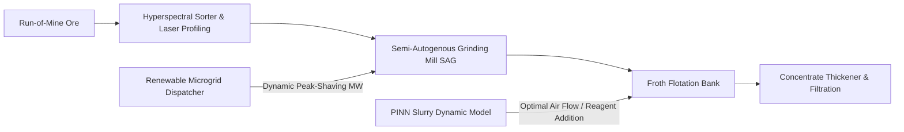

# Peru Mining AI Opportunity Blueprint

> **Origin Architect / Steward:** Trang Phan  
> **Target Core Lineage:** `v4.4`  
> **Domain Family:** `C05: ENERGY & INDUSTRIAL SYSTEMS`  
> **Technical Scope:** Autonomous Ore Processing, Flotation Kinetics, Predictive Thermodynamics, High-Altitude Microgrids

---

## 1. Executive Summary & Industrial Context

The Peruvian Andean mining corridor (accounting for >10% of global copper and silver output across operations such as Cerro Verde, Antamina, and Las Bambas) operates under severe operational constraints: extreme high-altitude thermodynamics (>4,000m ASL, reduced atmospheric pressure, non-linear slurry aeration), complex multi-mineralogical porphyry ore bodies, and high grid energy volatility.

The **AMOS Peru Mining AI Blueprint** defines a complete closed-loop industrial architecture integrating:
1. Real-time hyperspectral ore sortation at the primary crushing stage.
2. Physics-informed neural network (PINN) flotation froth predictive modeling.
3. Multi-source high-altitude renewable microgrid load balancing (solar PV, battery BESS, hydro-pumped storage).

---

## 2. Process Dynamics & Mathematical Modeling

### 2.1 Flotation Kinetics & Recovery Rate Formulation

Mineral recovery $R(t)$ in mechanical froth flotation cells is governed by distributed first-order non-linear kinetics with hydrodynamic aeration correction:

$$R(t) = R_{\infty} \left[ 1 - \int_{0}^{\infty} \frac{e^{-k t}}{1 + (k / \bar{k})^\nu} f(k) \, dk \right]$$

Where:
- $R_{\infty}$: Ultimate achievable metallurgical recovery under infinite residence time.
- $k$: Kinetic rate constant dependent on mineral hydrophobicity, collector adsorption density $\Gamma$, and bubble surface flux $S_b$:
  $$k = \zeta \cdot S_b \cdot E_{\text{collision}} \cdot E_{\text{attachment}} \cdot (1 - E_{\text{detachment}})$$
- $S_b = \frac{6 J_g}{d_{32}}$: Bubble surface area flux ($J_g$ is superficial gas velocity, $d_{32}$ is Sauter mean bubble diameter).
- High-altitude pressure correction: Atmospheric pressure $P_{\text{alt}} = P_0 e^{-\frac{M g h}{R T}}$ expands gas bubble volume, necessitating active PID throttling of gas injection rates to prevent froth collapse.

---

### 2.2 SAG Mill Comminution Power & Throughput Optimization

Comminution accounts for >50% of total electrical energy in copper concentrators. The power draw $P_{\text{SAG}}$ is modeled via Morrell’s hydrodynamic comminution tensor:

$$P_{\text{SAG}} = K_{\text{mill}} \cdot D^{2.5} \cdot L \cdot \rho_{\text{slurry}} \cdot \Phi_c \cdot \left( \sin \theta_{\text{lift}} \right) \cdot \left( 1 - \frac{J_{\text{vol}}}{2} \right)$$

Where:
- $D, L$: Internal mill diameter and length.
- $\Phi_c$: Critical rotational speed fraction ($\approx 72-76\%$).
- $\rho_{\text{slurry}}$: Slurry density ($t/\text{m}^3$) estimated in real-time via ultrasonic transit-time sensors.
- The AMOS Model Predictive Controller (MPC) solves for mill rotational speed $\omega^*(t)$ and pebble recycle rate to maximize throughput while preventing mill overload liners damage:
  $$\max_{\omega, \dot{m}_{\text{feed}}} \left[ \dot{m}_{\text{feed}} \cdot \text{Grade}_{\text{Cu}} - \lambda P_{\text{SAG}}(\omega, \dot{m}_{\text{feed}}) \cdot C_{\text{kWh}}(t) \right]$$

---

## 3. High-Altitude Renewable Microgrid Energy Dispatch

To insulate operations from grid curtailment and fossil diesel generation, the Andean microgrid is orchestrated via Stochastic Dynamic Programming:

$$\min_{P_{\text{PV}}, P_{\text{BESS}}, P_{\text{Hydro}}} \sum_{t=0}^{T} \left[ C_{\text{deg}}(P_{\text{BESS}, t}) + C_{\text{fuel}}(P_{\text{Gen}, t}) + \text{Penalty}(\Delta f_t) \right]$$

Subject to:
1. Active power balance: $P_{\text{Load}, t} = P_{\text{PV}, t} + P_{\text{BESS}, t} + P_{\text{Hydro}, t} + P_{\text{Gen}, t}$
2. State of Charge (SoC) bounds: $\text{SoC}_{\min} \le \text{SoC}_t \le \text{SoC}_{\max}$
3. Thermal derating at altitude: Inverter thermal dissipation coefficient $\eta_{\text{thermal}}(h) = 1 - 0.015 \left(\frac{h - 1000}{1000}\right)$.

---

## 4. Systems Architecture & AMOS Control Plane Integration

| Subsystem | AMOS Component | Hardware / Protocol Interface |
| :--- | :--- | :--- |
| **Ore Vision Edge** | [[04_RUNTIME/06_EXECUTION/ARROW_IPC_STATE_BUS_ENGINE\|Arrow IPC State Bus]] | 100fps GigE Vision Camera + CUDA TensorRT Engine |
| **Flotation MPC** | [[03_CONTROL_PLANE/CONTROL_PLANE_CONTROL_PLANE_CONTRACT\|Control Plane Contract]] | OPC-UA / Modbus TCP to Siemens PCS7 DCS |
| **Energy Scheduler** | [[10_TOOLS/10_TOOLS_MOC\|10_TOOLS Engine]] | DNP3 / IEC 61850 Substation Gateway |

---

## 5. Architectural Invariants

| Invariant ID | Constraint | Safety Enforcement |
| :--- | :--- | :--- |
| `PERU_MINE_INV_01` | SAG Mill Bearing Pressure $< 6.2\text{ MPa}$ | Instantaneous feed cut-off on mechanical overload |
| `PERU_MINE_INV_02` | Tailings Water Recovery $\ge 88.5\%$ | Closed-loop thickener underflow torque modulation |
| `PERU_MINE_INV_03` | Control Plane Latency $< 20\text{ ms}$ | Real-time POSIX FIFO IPC thread scheduling |

---

## 6. Cross References

- **Energy & Resources Hub:** [[21_DOMAINS/05_ENERGY/05_ENERGY_MOC|05_ENERGY_MOC]]
- **Control Systems Domain:** [[21_DOMAINS/31_CONTROL_SYSTEMS/31_CONTROL_SYSTEMS_MOC|31_CONTROL_SYSTEMS_MOC]]
- **Hardware Interfaces:** [[15_INTERFACES/15_INTERFACES_MOC|15_INTERFACES_MOC]]
- **Root MOC:** [[00_ROOT/00_ROOT_MOC|00_ROOT_MOC]]
