# Case Study: SME Banking Transformation via AMOS Bio-Logical Architecture

> **Origin Architect / Steward:** Trang Phan
> **Target Core Lineage:** `v4.4`
> **Domain Family:** `C01: FINANCE & MARKETS`

---

## 1. Executive Summary

This case study documents the enterprise transformation of an SME commercial banking infrastructure using the AMOS OS Bio-Logical Computing paradigm.

By replacing disconnected legacy underwriting rules and siloed risk engines with an integrated **Organism Credit Substrate**, the bank achieved:
- 85% reduction in credit decision latency (from 5 business days to 45 minutes).
- Zero-drift regulatory compliance across multi-jurisdictional lending portfolios.
- Deterministic auditability of every algorithmic credit score via immutable provenance traces.

---

## 2. Architectural Transformation: Legacy vs. AMOS Organism

```mermaid
graph TD
    subgraph "Legacy Siloed Architecture"
        L1[Loan Application] --> L2[Credit Bureau Scrape]
        L2 --> L3[Manual Underwriting Review]
        L3 --> L4[Fragmented Risk Silo]
        L4 --> L5[Disbursal Bottleneck]
    end

    subgraph "AMOS Bio-Logical Banking Substrate"
        A1[Multi-Modal Application Ingestion] --> A2[Perception & Balance Sheet Parser]
        A2 --> A3[Real-Time Cash Flow Dynamics Model]
        A3 --> A4[Invariant & Solvency Gating Engine]
        A4 --> A5[Deterministic Disbursal & Rollback Basin]
    end
```

---

## 3. Core Domain Formulations & Solvency Invariants

1. **Continuous Working Capital Coverage Ratio:**
   $$WCCR(t) = rac{\mathbb{E}[	ext{CashInflow}(t, t+\Delta)] - 	ext{FixedObligations}(t, t+\Delta)}{	ext{DebtService}(t, t+\Delta)} \ge 1.25$$

2. **Supply Chain Shock Transmission Invariant:**
   $$\Delta 	ext{Risk}_{SME} = \sum_{k \in Suppliers} w_k \cdot 	ext{Shock}(k) \cdot \exp(-\lambda \cdot 	ext{BufferDays})$$

---

## 4. Integration

- **Domain Hub:** [[21_DOMAINS/21_DOMAINS_MOC|21_DOMAINS_MOC]]
- **Legal Kernel Gate:** [[02_KERNEL/AMOS_LEGAL_ENGINE_KERNEL|AMOS_LEGAL_ENGINE_KERNEL]]
- **Workflow Pipeline:** [[08_WORKFLOWS/08_WORKFLOWS_MOC|08_WORKFLOWS_MOC]]
