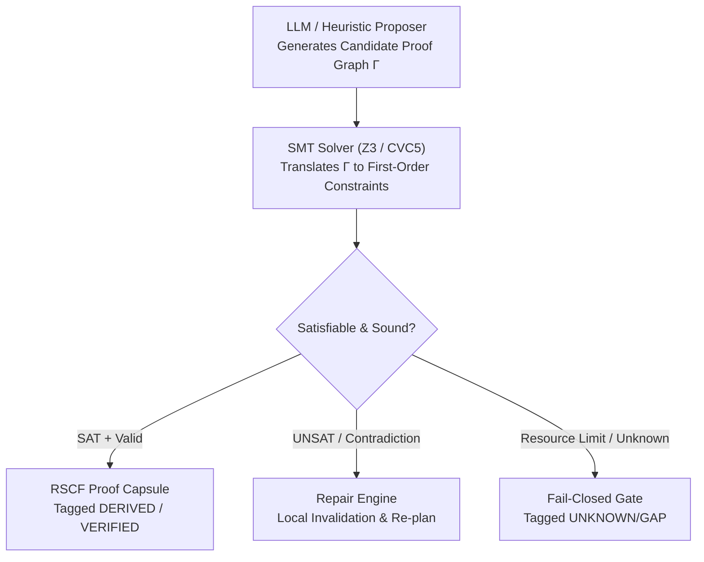

---
---

# C01 Formal Verification & Neuro-Symbolic Logic Architecture

> [!ABSTRACT] Domain Executive Specification
> **Domain Engine:** `C01_meta_logic` (Meta-Logic & Formal Reasoning Kernel).
> **Role:** Owns axiomatic formal verification, SMT constraint solving, Datalog relational inference, and neuro-symbolic alignment in the AMOS Full Brain OS.
> **Universal Invariant:** Replaces ungrounded LLM probabilistic token generation with provably sound deductive and inductive proof verification.

---

## 1. Dual-Process Neuro-Symbolic Pipeline

AMOS C01 couples stochastic proposal generation (System 1) with deterministic formal proof verification (System 2):

$$\text{User / Task Goal} \xrightarrow{\text{Propose}} \text{Candidate Premise DAG } (\Gamma) \xrightarrow{\text{SMT Check}} \text{Solver Verdict } \in \{\text{SAT}, \text{UNSAT}, \text{UNKNOWN}\}$$

---

## 2. Formal Logic Engines & Inference Modalities

| Engine / Layer | Substrate | Theoretical Foundation | Operational Use Case |
| :--- | :--- | :--- | :--- |
| **SMT Solver Core** | Z3 / CVC5 | Satisfiability Modulo Theories (QFBV, LIA, EUF) | Type checking, arithmetic constraints, invariant verification |
| **Interactive Theorem Prover** | Lean 4 / Coq | Dependent Type Theory (Calculus of Inductive Const.) | Canonical law formalization, constitutional invariants |
| **Relational Datalog** | Soufflé / Differential Datalog | Horn-Clause Logic Programming | High-speed static provenance traversal, reachability analysis |
| **Non-Monotonic Logic** | Defeasible & Modal Logic | Default Logic / Belief Revision (AGM Postulates) | Epistemic state transitions, hypothesis retraction |

---

## 3. The CORE-19 Axiomatic Invariants

All inferences admitted into `04_RUNTIME` must satisfy the CORE-19 Meta-Logic laws:
1. **Law of Non-Contradiction:** $\neg(P \land \neg P)$ across any active epoch.
2. **Epistemic Monotonicity of Verification:** A claim once marked `FALSIFIED` cannot be re-promoted without explicit revocation of the falsifier receipt.
3. **Weakest-Premise Bounding:** $C(\text{Conclusion}) \le \min_{i} C(\text{Premise}_i)$.
4. **No-Proof-No-Claim:** Unproven conjectures remain strictly typed as `AMOS_MODEL` or `UNKNOWN/GAP`.

---

## 4. Cross-Vault References

- [[21_DOMAINS/11_C01_META_LOGIC/11_C01_META_LOGIC_MOC|11_C01_META_LOGIC_MOC]]
- [[11_KNOWLEDGE/AMOS_C01_META_LOGIC_MASTER_KNOWLEDGE|AMOS_C01_META_LOGIC_MASTER_KNOWLEDGE]]
- [[26_WORKFLOWS/amos-c01-meta-logic-master-workflow|amos-c01-meta-logic-master-workflow]]
- [[02_KERNEL/01_META_LOGIC/K_CORE19_LOGIC|K_CORE19_LOGIC]]
