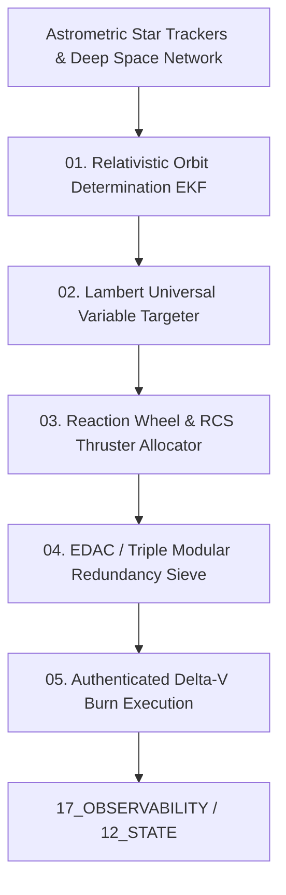

# Space Exploration Domain Contract — Orbital Mechanics, Autonomous Flight Software & Deep-Space Telemetry Specification

> **Origin Architect / Steward:** Trang Phan
> **AMOS_CORE Target:** `v4.4`
> **Domain Alignment:** Domain C (Cognitive Capability / Orchestration)
> **Conclusion Class:** `DERIVED` (RSCF Validated)
> **Status:** `ACTIVE_CONTROL_SURFACE`

---

## 1. Architectural Scope & Subsystem Role

`21_DOMAINS/15_SPACE_EXPLORATION` governs the orbital trajectory optimization, deep-space optical communication link budgets, radiation-tolerant fault recovery, and autonomous spacecraft maneuver planning within AMOS OS.

```text
TRAJECTORY_SIMULATION != EXECUTED_DELTA_V_BURN
GRAVITATIONAL_MODEL != PHYSICAL_PERTURBATION_FIELD
TELEMETRY_LINK_BUDGET != NOISELESS_COMMUNICATION
REACTION_WHEEL_DESATURATION != ZERO_ANGULAR_MOMENTUM
```



---

## 2. Core Astrodynamic Formulations

### 2.1 Universal Variable Lambert Targeter
Solves for the transfer orbit between position vectors $\mathbf{r}_1, \mathbf{r}_2$ over flight duration $\Delta t$:

$$\sqrt{\mu} \Delta t = \chi^3 S(z) + A \sqrt{y(z)}$$

$$z = \alpha \chi^2, \quad y(z) = r_1 + r_2 + A \frac{z S(z) - 1}{\sqrt{C(z)}}$$

Where $C(z), S(z)$ are the Stumpff transcendental series functions, and $\chi$ is the universal anomaly.

### 2.2 Deep-Space Optical Comm Link Budget ($P_{\text{rx}}$)
Calculates received photon energy for laser communication across interplanetary distances:

$$P_{\text{rx}} = P_{\text{tx}} \cdot \eta_{\text{tx}} \cdot G_{\text{tx}} \cdot \left( \frac{\lambda}{4\pi R} \right)^2 \cdot L_{\text{atm}} \cdot G_{\text{rx}} \cdot \eta_{\text{rx}} \cdot e^{-\tau_{\text{dust}}}$$

Subject to pointing jitter bound $\sigma_\theta \le 1.2\ \mu\text{rad}$.

---

## 3. Mandatory Flight Domain Invariants

1. **`CTR-SPACE-01` Periapsis Clearance Constraint:** All orbital solutions must satisfy $r_p \ge r_{\text{surface}} + h_{\text{safety}}$ with zero violation tolerance.
2. **`CTR-SPACE-02` Delta-V Fuel Reserve Margin:** Delta-V budget must maintain $\Delta v_{\text{reserve}} \ge 0.15 \times \Delta v_{\text{nominal}}$ across all burn stages.
3. **`CTR-SPACE-03` Radiation EDAC Scrubbing:** Single Event Upsets (SEU) detected via Triple Modular Redundancy (TMR) trigger automatic register correction and state journaling.

---

## 4. Lineage & Cross-Plane References

- **Parent Contract:** [[21_DOMAINS/DOMAINS_DOMAIN_ALIAS_CONTRACT|DOMAINS_DOMAIN_ALIAS_CONTRACT]]
- **Physics Master Knowledge:** [[11_KNOWLEDGE/AMOS_C03_PHYSICS_COSMOS_MASTER_KNOWLEDGE|AMOS_C03_PHYSICS_COSMOS_MASTER_KNOWLEDGE]]
- **State Storage:** [[12_STATE/STATE_STATE_CONTRACT|12_STATE]]
- **Security Protocols:** [[18_SECURITY/SECURITY_SECURITY_CONTRACT|18_SECURITY]]
