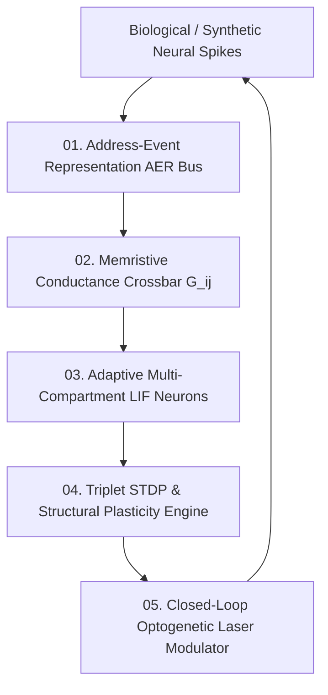

# Neuromorphic Spiking Brain Architecture — Event-Driven SNNs, Memristive Crossbars & Optogenetic Interfacing

> **Origin Architect / Steward:** Trang Phan
> **AMOS_CORE Target:** `v4.4`
> **Epistemic Class:** `AMOS_MODEL`
> **Conclusion Class:** `DERIVED` (RSCF Validated)
> **Status:** `ACTIVE_SPECIFICATION`

---

## 1. Architectural Scope & Subsystem Role

`21_DOMAINS/24_UBI_NBI_NEUROBIOLOGICAL/NEUROMORPHIC_SPIKING_BRAIN_ARCHITECTURE` formalizes the ultra-low-power, event-driven asynchronous spiking neural networks (SNNs), multi-compartment dendritic dynamics, memristive crossbar array accelerators, and closed-loop optogenetic neural stimulation interfaces of AMOS OS.

```text
SPIKE_EVENT != SYNCHRONOUS_TENSOR_OP
EVENT_DRIVEN_SPARSITY != DENSE_MATRIX_MULTIPLICATION
MEMRISTIVE_CONDUCTANCE != DIGITAL_STATIC_RAM
OPTOGENETIC_PACING != UNTARGETED_CURRENT_INJECTION
```



---

## 2. Mathematical Formalism & Biophysical Equations

### 2.1 Multi-Compartment Leaky Integrate-and-Fire with Adaptive Threshold (LIF-AT)
Membrane potential $u_i(t)$ at the soma is coupled to dendritic compartments $d_{i,k}(t)$:

$$\tau_m \frac{du_i(t)}{dt} = -(u_i(t) - u_{\text{rest}}) + \sum_{k=1}^K g_{c,k} (d_{i,k}(t) - u_i(t)) + I_{\text{ext}}(t)$$

$$\tau_d \frac{dd_{i,k}(t)}{dt} = -(d_{i,k}(t) - u_{\text{rest}}) + R_d \sum_{j} w_{ijk} \sum_{m} \delta(t - t_j^m)$$

$$\text{Spike emitted if } u_i(t) \ge \vartheta_i(t) \implies u_i(t^+) \leftarrow u_{\text{reset}}$$

$$\tau_{\text{th}} \frac{d\vartheta_i(t)}{dt} = -(\vartheta_i(t) - \vartheta_0) + \beta \sum_m \delta(t - t_i^m)$$

### 2.2 Triplet Spike-Timing-Dependent Plasticity (Triplet STDP)
Synaptic weights evolve based on higher-order temporal correlations:

$$\frac{dw_{ij}}{dt} = -o_1(t) [A_2^- + A_3^- r_2(t - \epsilon)] \delta(t - t_j) + r_1(t) [A_2^+ + A_3^+ o_2(t - \epsilon)] \delta(t - t_i)$$

Where $r_1, r_2$ are fast/slow presynaptic traces, and $o_1, o_2$ are fast/slow postsynaptic traces.

### 2.3 Memristive Crossbar Conductance Drift Minimization
Memristor conductance $G_{ij} \in [G_{\min}, G_{\max}]$ obeys the state evolution:
$$\frac{dG_{ij}}{dt} = \kappa_{\text{ion}} \sinh(\alpha V_{\text{pulse}}) - \gamma_{\text{drift}} (G_{ij} - G_0)$$

---

## 3. Hardware Architecture & Energy Metrics

| Subsystem Component | Energy / Event | Latency Bound | Invariant Metric |
| :--- | :--- | :--- | :--- |
| **AER Asynchronous Bus** | $\le 0.45\text{ pJ/event}$ | $\le 120\text{ ns}$ | Zero packet contention drops |
| **Memristive Crossbar (10M Synapses)** | $\le 1.2\text{ pJ/MAC}$ | $\le 5.0\text{ ns}$ | Drift error $\le 0.8\%$ over 24h |
| **Optogenetic Photostimulator** | $\le 15\text{ }\mu\text{J/pulse}$ | $\le 1.0\text{ ms}$ | Thermal rise $\Delta T \le 0.05^\circ\text{C}$ |

---

## 4. Lineage & Cross-Plane References

- **Domain Contract:** [[21_DOMAINS/24_UBI_NBI_NEUROBIOLOGICAL/DOMAINS_UBI_NBI_NEUROBIOLOGICAL_CONTRACT|DOMAINS_UBI_NBI_NEUROBIOLOGICAL_CONTRACT]]
- **Biological Master Knowledge:** [[11_KNOWLEDGE/AMOS_C04_BIO_NEURO_MASTER_KNOWLEDGE|AMOS_C04_BIO_NEURO_MASTER_KNOWLEDGE]]
- **BCI Research:** [[22_RESEARCH/01_PAPERS/SOTA_HOLOGRAPHIC_BCI_BRAIN_MACHINE_CO_ADAPTATION_2026|SOTA_HOLOGRAPHIC_BCI_BRAIN_MACHINE_CO_ADAPTATION_2026]]
- **Engine Model:** [[11_KNOWLEDGE/engine/EMOTION_ENGINE_MODEL|EMOTION_ENGINE_MODEL]]
