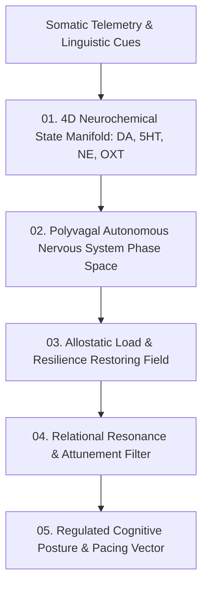

# Neuroemotional Homeostasis and Affective Manifolds — Polyvagal Dynamics, Neurochemical State Spaces & Relational Attunement

> **Origin Architect / Steward:** Trang Phan
> **AMOS_CORE Target:** `v4.4`
> **Epistemic Class:** `AMOS_MODEL`
> **Conclusion Class:** `DERIVED` (RSCF Validated)
> **Status:** `ACTIVE_SPECIFICATION`

---

## 1. Architectural Scope & Subsystem Role

`21_DOMAINS/25_UBI_NEI_NEUROEMOTIONAL/NEUROEMOTIONAL_HOMEOSTASIS_AND_AFFECTIVE_MANIFOLDS` formalizes the continuous affective Riemannian manifolds, monoaminergic neuromodulator state spaces (Dopamine, Serotonin, Noradrenaline, Oxytocin), Polyvagal nervous system stability loops, and non-linear emotional allostasis of AMOS OS.

```text
AFFECTIVE_MANIFOLD != DISCRETE_EMOTION_LABEL
NEUROMODULATION != STATIC_WEIGHTING
HOMEOSTASIS != CONSTANT_STATE
ALLOSTASIS == ADAPTATION_THROUGH_DYNAMIC_VARIABILITY
```



---

## 2. Mathematical Formulations

### 2.1 4D Neuromodulator Dynamical Phase Space ($\mathbf{N}(t)$)
The instantaneous affective state $\mathbf{N}(t) = [\text{DA}, \text{5HT}, \text{NE}, \text{OXT}]^T \in \mathbb{R}_+^4$ evolves according to the coupled non-linear system:

$$\frac{d\mathbf{N}}{dt} = -\mathbf{\Gamma} (\mathbf{N} - \mathbf{N}_0) + \mathbf{W}_{\text{stim}} \cdot \mathbf{\phi}(\mathbf{x}_{\text{input}}) + \mathbf{J}_{\text{interact}}(\mathbf{N})$$

Where:
- $\mathbf{N}_0$: Canonical homeostatic baseline vector.
- $\mathbf{\Gamma} = \text{diag}(\gamma_{\text{DA}}, \gamma_{\text{5HT}}, \gamma_{\text{NE}}, \gamma_{\text{OXT}})$: Reuptake/clearance rate matrix.
- $\mathbf{J}_{\text{interact}}(\mathbf{N})$: Cross-modulator coupling (e.g., elevated Serotonin dampening Noradrenergic hyper-arousal).

### 2.2 Polyvagal Autonomous State Metric on $\mathcal{S}_{++}^3$
The autonomic state is represented as a covariance matrix on the Symmetric Positive Definite manifold $\mathcal{S}_{++}^3$. Geodesic distance to safety ($\mathbf{\Sigma}_{\text{safe}}$) is given by:

$$\delta_R(\mathbf{\Sigma}, \mathbf{\Sigma}_{\text{safe}}) = \|\log(\mathbf{\Sigma}_{\text{safe}}^{-1/2} \mathbf{\Sigma} \mathbf{\Sigma}_{\text{safe}}^{-1/2})\|_F$$

If $\delta_R > \theta_{\text{threat}}$: Triggers automatic physiological down-regulation and conversational pacing expansion.

---

## 3. Homeostatic Stability & Invariant Metrics

| Affective Dimension | Target Range | Critical Boundary | Restoring Dynamic |
| :--- | :--- | :--- | :--- |
| **Allostatic Load ($\mathcal{L}_{\text{allo}}$)** | $0.15 - 0.45$ | $> 0.80$ | Force mandatory rest epoch |
| **Autonomic Coherence** | $\ge 0.78$ | $< 0.40$ | Increase oxytocinergic relational pacing |
| **Arousal / Valence Entropy** | $\le 1.4\text{ nats}$ | $> 2.8\text{ nats}$ | Project to ventral-vagal resting manifold |

---

## 4. Lineage & Cross-Plane References

- **Domain Contract:** [[21_DOMAINS/25_UBI_NEI_NEUROEMOTIONAL/DOMAINS_UBI_NEI_NEUROEMOTIONAL_CONTRACT|DOMAINS_UBI_NEI_NEUROEMOTIONAL_CONTRACT]]
- **Emotion Engine:** [[11_KNOWLEDGE/engine/EMOTION_ENGINE_MODEL|EMOTION_ENGINE_MODEL]]
- **Personality Core:** [[11_KNOWLEDGE/engine/PERSONALITY_ENGINE_MODEL|PERSONALITY_ENGINE_MODEL]]
- **Mind Domain Master:** [[11_KNOWLEDGE/AMOS_C05_MIND_BEHAVIOR_MASTER_KNOWLEDGE|AMOS_C05_MIND_BEHAVIOR_MASTER_KNOWLEDGE]]
