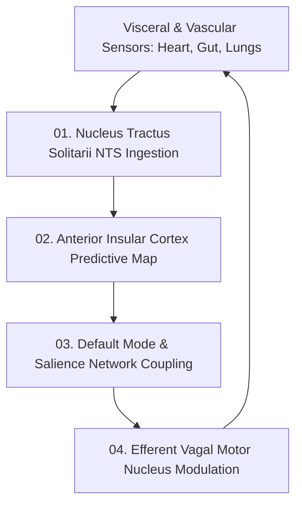

# Somatic Homeostasis and Interoceptive Neural Circuits — Vagal Signaling, Baroreceptor Loops & Visceral State Estimation

> **Origin Architect / Steward:** Trang Phan
> **AMOS_CORE Target:** `v4.4`
> **Epistemic Class:** `AMOS_MODEL`
> **Conclusion Class:** `DERIVED` (RSCF Validated)
> **Status:** `ACTIVE_SPECIFICATION`

---

## 1. Architectural Scope & Subsystem Role

`21_DOMAINS/26_UBI_SI_SOMATIC/SOMATIC_HOMEOSTASIS_AND_INTEROCEPTIVE_NEURAL_CIRCUITS` formalizes the afferent/efferent vagal signaling pathways, insular cortex visceral mapping, baroreceptor blood-pressure feedback loops, and predictive somatic allostasis of AMOS OS.

```text
INTEROCEPTION != EXCEPTION_HANDLING
VISCERAL_STATE != DISCRETE_ERROR_CODE
BAROREFLEX != STATIC_PULSE_ESTIMATE
SOMATIC_SAFETY == NEUROLOGICAL_PREREQUISITE_FOR_COGNITION
```



---

## 2. Mathematical Formalism of Interoceptive Predictive Coding

The anterior insular cortex estimates latent visceral states $\mathbf{x}_{\text{soma}}$ by minimizing interoceptive free energy $\mathcal{F}_{\text{soma}}$:

$$\mathcal{F}_{\text{soma}}(\mathbf{s}, \mathbf{\mu}) = \frac{1}{2} \sum_k \left( \mathbf{s}_k - g(\mathbf{\mu}_k) \right)^T \mathbf{\Pi}_{\text{obs}} \left( \mathbf{s}_k - g(\mathbf{\mu}_k) \right) + \frac{1}{2} \left( \mathbf{\mu} - f(\mathbf{\mu}) \right)^T \mathbf{\Pi}_{\text{prior}} \left( \mathbf{\mu} - f(\mathbf{\mu}) \right)$$

Where:
- $\mathbf{s}_k$: Raw interoceptive sensory signals (HRV, respiratory rate, gastric rhythm).
- $\mathbf{\Pi}_{\text{obs}}, \mathbf{\Pi}_{\text{prior}}$: Precision matrices encoding signal reliability.

### 2.1 Baroreflex Non-Linear Differential System
Heart rate interval $R(t)$ and arterial pressure $P(t)$ obey the windkessel baroreflex coupling:

$$\tau_B \frac{dR(t)}{dt} = -(R(t) - R_0) + K_B \cdot \frac{1}{1 + \exp\left( -\alpha (P(t) - P_{\text{set}}) \right)}$$

---

## 3. Somatic Telemetry Invariants & Stability Bounds

| Physiological Metric | Nominal Band | Emergency Threshold | Autonomous Regulatory Action |
| :--- | :--- | :--- | :--- |
| **Heart Rate Variability (RMSSD)** | $45 - 95\text{ ms}$ | $< 18\text{ ms}$ | Trigger parasympathetic vagal pacing |
| **Vagal Tone Index ($\nu_{\text{vagal}}$)** | $0.65 - 0.90$ | $< 0.35$ | Expand conversational latency & pause |
| **Visceral Precision ($\mathbf{\Pi}_{\text{obs}}$)** | $\ge 2.50\text{ nats}$ | $< 0.80\text{ nats}$ | Suppress high-cognitive load reasoning |

---

## 4. Lineage & Cross-Plane References

- **Parent MOC:** [[21_DOMAINS/26_UBI_SI_SOMATIC/26_UBI_SI_SOMATIC_MOC|26_UBI_SI_SOMATIC_MOC]]
- **Domain Contract:** [[21_DOMAINS/26_UBI_SI_SOMATIC/DOMAINS_UBI_SI_SOMATIC_CONTRACT|DOMAINS_UBI_SI_SOMATIC_CONTRACT]]
- **Emotion Engine:** [[11_KNOWLEDGE/engine/EMOTION_ENGINE_MODEL|EMOTION_ENGINE_MODEL]]
- **Neurobiological Substrate:** [[21_DOMAINS/24_UBI_NBI_NEUROBIOLOGICAL/NEUROMORPHIC_SPIKING_BRAIN_ARCHITECTURE|NEUROMORPHIC_SPIKING_BRAIN_ARCHITECTURE]]
