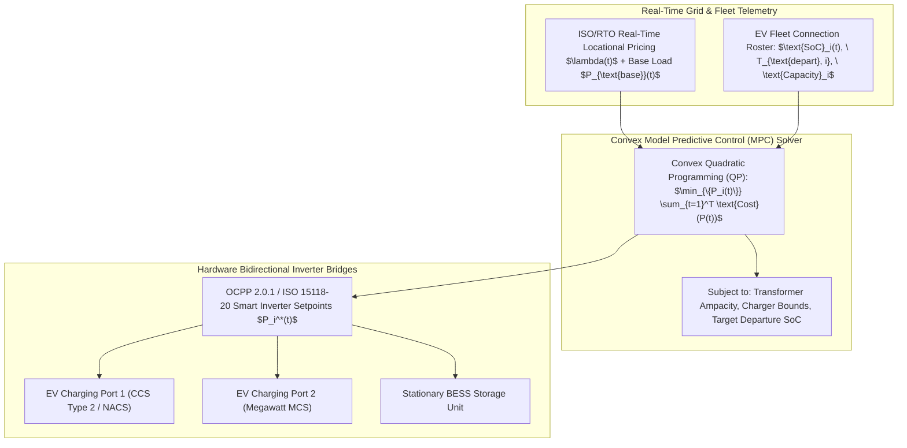

# Autonomous V2G Microgrid Optimization Engine & Model Predictive Control Specification

## 1. Executive Summary & Grid-Edge Energy Substrate

Electric Vehicles (EVs) integrated into distribution microgrids constitute high-capacity distributed energy storage systems (BESS). The **Autonomous V2G Microgrid Optimization Engine** executes continuous Model Predictive Control (MPC) over rolling $24\text{-hour}$ horizons to coordinate bidirectional power flow (V2G discharge and smart charging). It balances locational marginal pricing (LMP), transformer thermal limits, and battery electrochemical degradation while guaranteeing driver departure State-of-Charge ($\text{SoC}$) requirements under ISO 15118-20 and OCPP 2.0.1 protocols.



---

## 2. Mathematical Formalization & Convex MPC Formulation

### 2.1 Optimization Objective Function
Let $N$ denote the number of connected EVs and $T = 96$ time steps ($\Delta t = 15\text{ minutes}$ over a $24\text{-hour}$ rolling horizon). The objective minimizes total electricity procurement costs, battery electrochemical cyclic degradation, and peak demand charges:

$$\min_{\{P_i(t)\}_{i=1, t=1}^{N, T}} \sum_{t=1}^T \left( \lambda(t) \left( P_{\text{base}}(t) + \sum_{i=1}^N P_i(t) \right) \Delta t + \sum_{i=1}^N c_{\text{deg}, i} \cdot P_i(t)^2 \Delta t \right) + \mu_{\text{peak}} \max_{t} \left( P_{\text{base}}(t) + \sum_{i=1}^N P_i(t) \right)^2$$

Where:
- $P_i(t) > 0$: Charging power (grid to vehicle).
- $P_i(t) < 0$: Discharging power (vehicle to grid).
- $\lambda(t)$: Dynamic time-of-use or real-time electricity tariff ($\$/\text{kWh}$).
- $c_{\text{deg}, i}$: Semi-empirical battery capacity fade cost coefficient ($\$/\text{kW}^2\text{h}$).

### 2.2 Operational & Physics Constraints
1. **Substation Transformer Capacity Limit**:
   $$-P_{\text{feed-in\_max}} \le P_{\text{base}}(t) + \sum_{i=1}^N P_i(t) \le P_{\text{transformer\_max}} \quad \forall t \in \{1, \dots, T\}$$

2. **Bidirectional Inverter Power Limits**:
   $$-P_{\text{discharge\_max}, i} \le P_i(t) \le P_{\text{charge\_max}, i} \quad \forall i, t$$

3. **Battery Energy Storage Dynamics**:
   $$\text{SoC}_i(t+1) = \text{SoC}_i(t) + \frac{\eta_i(P_i(t)) \cdot P_i(t) \cdot \Delta t}{E_{\text{nom}, i}}$$
   $$\text{SoC}_{\text{min}, i} \le \text{SoC}_i(t) \le \text{SoC}_{\text{max}, i} \quad \forall i, t$$

4. **Guaranteed Departure Mobility Constraint**:
   $$\text{SoC}_i(T_{\text{depart}, i}) \ge \text{SoC}_{\text{target}, i} \quad \forall i$$

---

## 3. Protocol Buffer Schema Specification

```protobuf
syntax = "proto3";

package amos.energy.v2g;

message EVNodeState {
  string vehicle_id = 1;
  uint32 charger_port_id = 2;
  double current_soc_pct = 3;
  double target_soc_pct = 4;
  double battery_capacity_kwh = 5;
  double max_charge_kw = 6;
  double max_discharge_kw = 7;
  int64 departure_time_utc_nanos = 8;
  double degradation_cost_per_kwh2 = 9;
}

message V2GDispatchSchedule {
  uint64 schedule_epoch = 1;
  int64 horizon_start_utc_nanos = 2;
  uint32 time_steps_count = 3;
  double time_step_duration_minutes = 4;
  map<string, double> instant_power_dispatch_kw = 5; // vehicle_id -> power_kw
  double total_expected_cost_usd = 6;
  double peak_grid_load_kw = 7;
  int64 computation_time_micros = 8;
  bytes cryptographic_attestation = 9;
}
```

---

## 4. Python Reference Implementation

```python
"""
AMOS V2G Microgrid Model Predictive Control Engine.
Target: AMOS v4.4 Plane 21_DOMAINS/44_EV_INFRASTRUCTURE.
"""

import numpy as np
import cvxpy as cp
from typing import List, Dict, Any

class V2GMicrogridOptimizer:
    def __init__(self, time_steps: int = 96, dt_hours: float = 0.25, transformer_max_kw: float = 1000.0):
        self.T = time_steps
        self.dt = dt_hours
        self.transformer_max = transformer_max_kw
        
    def solve_dispatch(
        self,
        prices: np.ndarray, # (T,)
        base_load: np.ndarray, # (T,)
        ev_fleet: List[Dict[str, Any]]
    ) -> Dict[str, Any]:
        N = len(ev_fleet)
        if N == 0:
            return {"status": "NO_EVS", "net_cost": 0.0}
            
        P = cp.Variable((N, self.T))
        
        cost_terms = []
        constraints = []
        
        for i, ev in enumerate(ev_fleet):
            cap = ev["capacity_kwh"]
            soc_init = ev["soc_init"]
            soc_target = ev["soc_target"]
            t_dep = min(self.T - 1, int(ev["t_depart_steps"]))
            p_max = ev["max_charge_kw"]
            p_min = -ev["max_discharge_kw"]
            c_deg = ev.get("c_deg", 0.001)
            
            # Power limits
            constraints += [P[i, :] >= p_min, P[i, :] <= p_max]
            
            # Energy balance & SoC constraints
            soc_trajectory = soc_init + (cp.cumsum(P[i, :]) * self.dt) / cap
            constraints += [soc_trajectory >= 0.15, soc_trajectory <= 0.95]
            constraints += [soc_trajectory[t_dep] >= soc_target]
            
            # If departed, power is 0
            if t_dep < self.T - 1:
                constraints += [P[i, t_dep+1:] == 0]
                
            # Degradation cost
            cost_terms.append(c_deg * cp.sum_squares(P[i, :]) * self.dt)
            
        # Grid total load & transformer constraints
        total_ev_power = cp.sum(P, axis=0)
        net_load = base_load + total_ev_power
        constraints += [net_load <= self.transformer_max, net_load >= -self.transformer_max]
        
        # Electricity procurement cost
        grid_cost = cp.sum(cp.multiply(prices, net_load)) * self.dt
        
        objective = cp.Minimize(grid_cost + cp.sum(cost_terms))
        prob = cp.Problem(objective, constraints)
        prob.solve(solver=cp.CLARABEL)
        
        return {
            "status": prob.status,
            "optimal_power_matrix": P.value,
            "total_cost_usd": prob.value,
            "net_grid_profile_kw": net_load.value
        }
```

---

## 5. Invariants & Governance Rules

1. **Transformer Thermal Protection**: Aggregate microgrid load $\sum P_i(t) + P_{\text{base}}(t)$ must never exceed transformer rated ampacity under any market price incentive.
2. **Departure Mobility Guarantee**: Driver target SoC $\text{SoC}_i(T_{\text{depart}})$ takes absolute priority over grid discharge revenue.
3. **Receipt Emission**: Dispatch setpoints are cryptographically signed and published to `17_OBSERVABILITY` every $15\text{ minutes}$.

---

## 6. Cross-Plane Architectural Bindings

- **EV Infrastructure Master MOC**: [[21_DOMAINS/44_EV_INFRASTRUCTURE/44_EV_INFRASTRUCTURE_MOC]]
- **Domain Specification**: [[21_DOMAINS/44_EV_INFRASTRUCTURE/EV_INFRASTRUCTURE_DOMAINS_DOMAIN_SPEC]]
- **Megawatt Charging Grid Topology**: [[21_DOMAINS/44_EV_INFRASTRUCTURE/MEGAVATT_CHARGING_GRID_TOPOLOGY_AND_THERMAL_MANAGEMENT]]
- **Heterogeneous XPU Scheduling**: [[16_SCHEMAS/HETEROGENEOUS_XPU_SCHEDULER_SCHEMA]]
- **Distributed Epistemic Tracing**: [[17_OBSERVABILITY/DISTRIBUTED_EPISTEMIC_TRACING_FRAMEWORK]]
