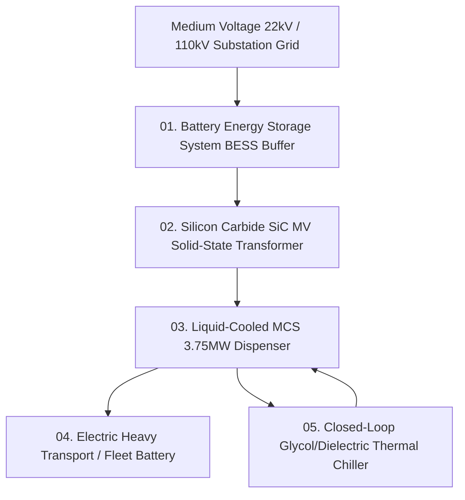

# Megawatt Charging Grid Topology and Thermal Management — Liquid-Cooled Dispenser Physics, Transformer Sizing & Substation Load Arbitrage

> **Origin Architect / Steward:** Trang Phan
> **AMOS_CORE Target:** `v4.4`
> **Epistemic Class:** `AMOS_MODEL`
> **Conclusion Class:** `DERIVED` (RSCF Validated)
> **Status:** `ACTIVE_SPECIFICATION`

---

## 1. Architectural Scope & Subsystem Role

`21_DOMAINS/44_EV_INFRASTRUCTURE/MEGAVATT_CHARGING_GRID_TOPOLOGY_AND_THERMAL_MANAGEMENT` formalizes the Megawatt Charging System (MCS, up to $3.75\text{ MW}$, $1250\text{ V}$, $3000\text{ A}$), dielectric liquid cooling thermodynamics, medium-voltage (MV) substation grid interconnection, and battery energy storage system (BESS) peak-shaving of AMOS OS.

```text
PEAK_POWER_DEMAND != STATIC_GRID_CAPACITY
FAST_CHARGING != THERMAL_RUNAWAY_RISK
COOLING_FLOW != LAMINAR_HEAT_ACCUMULATION
GRID_BUFFERING == TRANSFORMER_LONGEVITY_INSURANCE
```



---

## 2. Thermodynamic & Electrical Formulations

### 2.1 Liquid-Cooled Cable Heat Dissipation
Heat generation rate $q_{\text{gen}}$ in the 3000A copper busbar is balanced by forced convection cooling:

$$q_{\text{gen}} = I^2 \frac{\rho_{\text{Cu}}(T)}{A_{\text{csa}}} = \dot{m} C_p (T_{\text{fluid,out}} - T_{\text{fluid,in}}) + h A_{\text{surface}} (T_{\text{cable}} - T_{\text{fluid}})$$

Where $h = \frac{k}{D} \text{Nu}$ is calculated using the Gnielinski correlation for turbulent pipe flow ($\text{Re} > 10^4$).

### 2.2 BESS Buffer Peak-Shaving Dynamic Optimization
Minimizes peak grid demand charges $C_{\text{peak}}$ subject to transformer thermal limit $P_{\text{xfmr}}^{\max}$:

$$\min_{\mathbf{p}_{\text{bess}}} \left( \lambda_{\text{demand}} \cdot \max_{t} P_{\text{grid}}(t) + \sum_{t=1}^H \lambda_{\text{energy}}(t) P_{\text{grid}}(t) \Delta t \right)$$

$$\text{subject to } P_{\text{grid}}(t) = P_{\text{dispenser}}(t) - p_{\text{bess}}(t) \le P_{\text{xfmr}}^{\max}$$

---

## 3. Infrastructure SLA & Safety Invariants

| Infrastructure Metric | Engineering Limit | Invariant Guardrail |
| :--- | :--- | :--- |
| **Max Pin Contact Temperature** | $\le 85.0^\circ\text{C}$ at $3000\text{ A}$ | Auto-derate current if $T > 90.0^\circ\text{C}$ |
| **Coolant Pressure Drop** | $\Delta P \le 2.2\text{ bar}$ | Differential pressure alarm with fail-safe pump bypass |
| **Grid Power Factor ($\cos\phi$)** | $\ge 0.98$ (Active PFC) | SiC inverter harmonic distortion $\text{THD} \le 3.0\%$ |

---

## 4. Lineage & Cross-Plane References

- **Parent MOC:** [[21_DOMAINS/44_EV_INFRASTRUCTURE/44_EV_INFRASTRUCTURE_MOC|44_EV_INFRASTRUCTURE_MOC]]
- **Domain Contract:** [[21_DOMAINS/44_EV_INFRASTRUCTURE/DOMAINS_EV_INFRASTRUCTURE_CONTRACT|DOMAINS_EV_INFRASTRUCTURE_CONTRACT]]
- **EV Engine Specification:** [[11_KNOWLEDGE/engine/EV_ENGINE|EV_ENGINE]]
- **Energy Domain:** [[21_DOMAINS/44_EV_INFRASTRUCTURE/44_EV_INFRASTRUCTURE_MOC|44_EV_INFRASTRUCTURE_MOC]]
