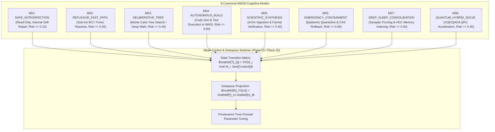

# AMOS Master Cognitive & Operational Modes Registry

## 1. Executive Summary & Mode Subspace Hierarchy

The **AMOS Modes Registry** governs the discrete behavioral, risk-tolerance, and compute-allocation modes of the autonomous cognitive organism. Operating via **Orthogonal Subspace Projections** ($\mathbf{P}_m = \mathbf{U}_m \mathbf{U}_m^T \in \mathbb{R}^{d \times d}$), mode transitions instantly reconfigure agent attention, tool permissions, token budgets, and safety firewalls without requiring expensive model retraining or state clearing.



---

## 2. Mathematical Formalization: Orthogonal Subspace Mode Switching

Let $\mathbf{h}_t \in \mathbb{R}^d$ represent the continuous latent activation state of the cognitive substrate. For each mode $m \in \{1, \dots, 8\}$, an orthonormal basis matrix $\mathbf{U}_m \in \mathbb{R}^{d \times k_m}$ defines the active mode subspace, such that distinct modes occupy nearly orthogonal subspaces:

$$\mathbf{U}_m^T \mathbf{U}_n \approx \mathbf{0} \quad \forall m \neq n, \quad \mathbf{P}_m = \mathbf{U}_m \mathbf{U}_m^T$$

Upon transitioning to mode $m$, latent state modulation occurs via projection:

$$\mathbf{h}_t^{(m)} = \mathbf{P}_m \mathbf{h}_t + \mathbf{b}_m$$

Where bias vector $\mathbf{b}_m$ activates mode-specific safety thresholds and capability masks.

---

## 3. Protocol Buffer Schema Specification

```protobuf
syntax = "proto3";

package amos.modes.registry;

enum ModeIdentifier {
  MODE_UNSPECIFIED = 0;
  MODE_SAFE_INTROSPECTION = 1;
  MODE_REFLEXIVE_FAST_PATH = 2;
  MODE_DELIBERATIVE_TREE = 3;
  MODE_AUTONOMOUS_BUILD = 4;
  MODE_SCIENTIFIC_SYNTHESIS = 5;
  MODE_EMERGENCY_CONTAINMENT = 6;
  MODE_DEEP_SLEEP_CONSOLIDATION = 7;
  MODE_QUANTUM_HYBRID_SOLVE = 8;
}

message ModePermissionEnvelope {
  bool allow_external_fs_write = 1;
  bool allow_network_egress = 2;
  bool allow_tool_execution = 3;
  bool allow_kernel_mutation = 4;
  double max_risk_score_threshold = 5;
  uint64 max_tokens_per_turn = 6;
  int64 timeout_per_step_millis = 7;
}

message ModeDescriptor {
  ModeIdentifier mode_id = 1;
  string display_name = 2;
  string description = 3;
  ModePermissionEnvelope permissions = 4;
  uint32 subspace_dimension = 5;
}

message ModeTransitionReceipt {
  uint64 transition_epoch = 1;
  ModeIdentifier previous_mode = 2;
  ModeIdentifier active_mode = 3;
  string trigger_event_description = 4;
  string authority_token_jwt = 5;
  int64 timestamp_utc_nanos = 6;
  bytes cryptographic_signature = 7;
}
```

---

## 4. Master Operating Modes Table

| Mode ID | Name | Subspace Dim ($k$) | Risk Cap | Permitted Tools | Target Context |
| :--- | :--- | :--- | :--- | :--- | :--- |
| **`M-01`** | `SAFE_INTROSPECTION` | $128$ | $0.10$ | $T_0, T_1$ (Read-Only) | System boot, diagnostic self-check, invariant repair |
| **`M-02`** | `REFLEXIVE_FAST_PATH` | $256$ | $0.25$ | $T_1, T_3$ (Low-Latency) | BCI neural streaming, Forex L3 tick processing |
| **`M-03`** | `DELIBERATIVE_TREE` | $512$ | $0.40$ | $T_1, T_2$ (Analytical) | Math proofs, multi-step planning, causal DAG discovery |
| **`M-04`** | `AUTONOMOUS_BUILD` | $512$ | $0.60$ | $T_1, T_2, T_3$ (WASI) | Code generation, schema compilation, regression test run |
| **`M-05`** | `SCIENTIFIC_SYNTHESIS`| $384$ | $0.50$ | $T_1, T_3$ (ArXiv) | Literature ingestion, SOTA synthesis, epistemic tagging |
| **`M-06`** | `EMERGENCY_CONTAIN` | $64$ | $0.05$ | $T_0$ (None) | Byzantine detection, split-brain isolation, CAS rollback |
| **`M-07`** | `DEEP_SLEEP_CONSOLID` | $128$ | $0.00$ | $T_1$ (Memory Internal)| Epistemic memory consolidation, HDC basis update |
| **`M-08`** | `QUANTUM_HYBRID` | $256$ | $0.35$ | $T_2, T_3$ (QPU Driver) | PQC optimization, qLDPC decoding, tensor networks |

---

## 5. Invariants & Governance Rules

1. **Deterministic Authority Boundary**: No agent or workflow can transition to `AUTONOMOUS_BUILD` or modify state without an explicit `ModeTransitionReceipt` verified by `03_CONTROL_PLANE`.
2. **Subspace Isolation**: Cross-subspace leak ($\|\mathbf{P}_m \mathbf{P}_n\|_2 > 0.05$ for $m \neq n$) triggers an immediate orthogonalization pass.
3. **Emergency Preemption**: `EMERGENCY_CONTAINMENT` possesses unilateral priority and immediately halts all background build processes upon invariant breach.

---

## 6. Cross-Plane Architectural Bindings

- **Modes Master MOC**: [[21_DOMAINS/45_MODES/45_MODES_MOC]]
- **Modes Domain Spec**: [[21_DOMAINS/45_MODES/MODES_DOMAINS_DOMAIN_SPEC]]
- **Orthogonal Subspace Switcher Ledger**: [[21_DOMAINS/45_MODES/ORTHOGONAL_SUBSPACE_MODE_SWITCHER_LEDGER]]
- **Control Plane Authority Contract**: [[03_CONTROL_PLANE/CONTROL_PLANE_CONTROL_PLANE_CONTRACT]]
- **Cognitive Organism Modes**: [[05_COGNITIVE_ORGANISM/05_COGNITIVE_ORGANISM_MOC]]
- **Distributed Epistemic Tracing**: [[17_OBSERVABILITY/DISTRIBUTED_EPISTEMIC_TRACING_FRAMEWORK]]
