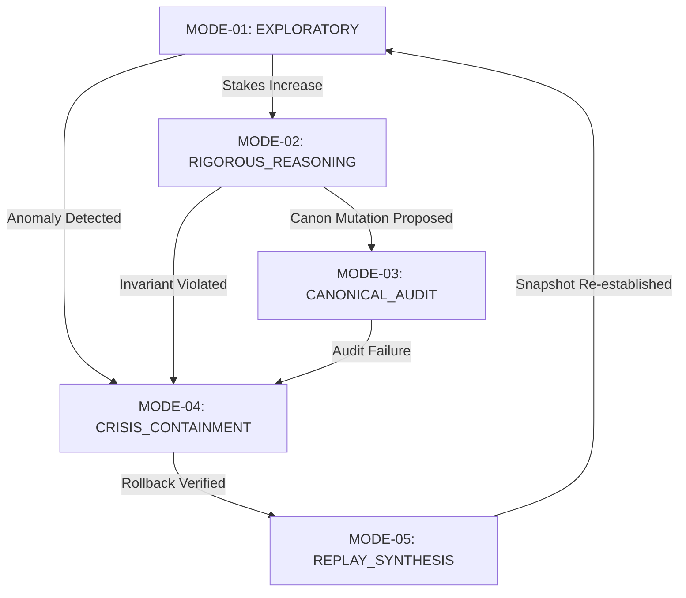

# AMOS Modes Master Registry

> **Origin Architect / Steward:** Trang Phan
> **AMOS_CORE Target:** `v4.4`
> **Conclusion Class:** `AMOS_MODEL`
> **Status:** `ACTIVE_REGISTRY`

---

## 1. Operating Modes Taxonomy

The AMOS operating system transitions dynamically across five fundamental operating modes depending on task stakes, epistemic certainty, and environmental feedback:

| Mode ID | Mode Name | Primary Focus | Invariant Stringency | Latency Profile |
| :--- | :--- | :--- | :--- | :--- |
| **MODE-01** | `EXPLORATORY` | Broad ideation, abductive hypothesis generation | Permissive ($\mathcal{C} \ge 0.50$) | Real-time interactive |
| **MODE-02** | `RIGOROUS_REASONING` | Formal deductive proofs, mathematical derivation | Strict ($\mathcal{C} \ge 0.90$) | Deliberate compute scaling |
| **MODE-03** | `CANONICAL_AUDIT` | Law compliance, axiom verification, code-fence checks | Absolute ($\mathcal{C} = 1.00$) | Barrier synchronized |
| **MODE-04** | `CRISIS_CONTAINMENT` | Fault isolation, quarantine enforcement, rollback | Fail-Closed Override | Immediate preemptive |
| **MODE-05** | `REPLAY_SYNTHESIS` | Deterministic event trace replay, historical audit | Deterministic Zero-Delta | Batch offline |

---

## 2. Mode State Machine Transitions

---

## 3. Integration

- **Domain Extension:** [[21_DOMAINS/00_INDEX/DOMAIN_EXTENSION_PROTOCOL|DOMAIN_EXTENSION_PROTOCOL]]
- **Cognitive Organism:** [[05_COGNITIVE_ORGANISM/05_COGNITIVE_ORGANISM_MOC|05_COGNITIVE_ORGANISM_MOC]]
- **Control Plane:** [[03_CONTROL_PLANE/03_CONTROL_PLANE_MOC|03_CONTROL_PLANE_MOC]]
