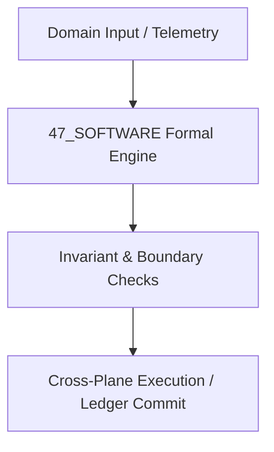

# 01 Software Systems & Distributed Architecture Master Domain Specification

## 1. Domain Scope & Mission
The 01 Software domain governs distributed consensus (Raft/BFT), actor runtime engines, zero-copy memory transport, and metamorphic self-healing systems.



## 2. Mathematical Formalization & Core Invariants
Distributed consensus state machine replication satisfies linearizable state transitions:
$$\forall e_1, e_2 \in \mathcal{E}, \quad e_1 \prec_{\text{real-time}} e_2 \implies e_1 \prec_{\text{log-order}} e_2$$
Fault tolerance withstands $f < \lfloor (N-1)/3 \rfloor$ Byzantine nodes or $f < \lfloor N/2 \rfloor$ crash faults.

## 3. Typed Interfaces & Capability Registry
```python
def replicate_state_machine_entry(command: ByteString) -> CommitIndex: ...
def trigger_metamorphic_self_heal(fault: ComponentFault) -> RepairReceipt: ...
```

## 4. Cross-Plane Dependencies & Bindings
- [[02_KERNEL/02_KERNEL_MOC|02_KERNEL MOC]]
- [[04_RUNTIME/04_RUNTIME_MOC|04_RUNTIME MOC]]
- [[09_PROTOCOLS/09_PROTOCOLS_MOC|09_PROTOCOLS MOC]]
- [[00_ROOT/00_ROOT_MOC|Root Navigation MOC]]
- [[21_DOMAINS/21_DOMAINS_MOC|Domains Plane MOC]]

## Scope

This domain specification defines the `47_SOFTWARE` domain within `21_DOMAINS`. It is one of the specialist or canonical knowledge domains and is governed by the `21_DOMAINS` cross-walk and `01_CANON` canonical constraints.

## Invariants

| ID | Invariant |
|----|-----------|
| 47_SOFTWARE_DOMAIN_SPEC_INV_01 | Domain-specific claims are scoped to `47_SOFTWARE` and do not universalize without cross-domain evidence. |
| 47_SOFTWARE_DOMAIN_SPEC_INV_02 | All domain models are classified as `AMOS_MODEL` or `DERIVED` unless externally validated. |
| 47_SOFTWARE_DOMAIN_SPEC_INV_03 | Domain MOC is the authoritative index for this directory. |

## Integration

- **Canonical binding:** `01_CANON/01_CORE_LAWS/LAW_HIERARCHY`
- **Cross-domain router:** `21_DOMAINS/00_INDEX/150_DOMAIN_CANON_MASTER_CROSSWALK`
- **Research input:** `22_RESEARCH/22_RESEARCH_MOC`
- **Runtime execution:** `04_RUNTIME/04_RUNTIME_MOC`

Domain models may inform `05_COGNITIVE_ORGANISM` engines but are not themselves cognitive primitives.

## Cross References
- [[{rel.parent}/47_SOFTWARE_MOC|47_SOFTWARE_MOC]]
- [[21_DOMAINS/21_DOMAINS_MOC|21_DOMAINS_MOC]]
- [[00_ROOT/00_ROOT_MOC|00_ROOT_MOC]]
