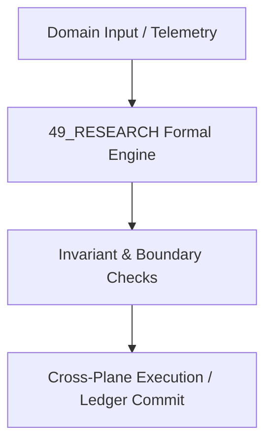

# 02 Scientific Research, Hypothesis Generation & Falsification Master Domain Specification

## 1. Domain Scope & Mission
The 02 Research domain governs automated scientific paper parsing, hypothesis synthesis, bibliometric citation graph analysis, and Popperian falsification protocols.



## 2. Mathematical Formalization & Core Invariants
Hypothesis confirmation metric under Bayesian inductive logic:
$$C(H, E) = P(E \mid H) - P(E \mid \neg H)$$
Falsification barrier rejects hypotheses if empirical error exceeds significance threshold $\alpha = 0.05$.

## 3. Typed Interfaces & Capability Registry
```python
def generate_falsifiable_hypothesis(corpus: LiteratureCorpus) -> HypothesisDescriptor: ...
def evaluate_empirical_falsifier(experiment_results: TrialData) -> ValidationStatus: ...
```

## 4. Cross-Plane Dependencies & Bindings
- [[22_RESEARCH/22_RESEARCH_MOC|22_RESEARCH MOC]]
- [[11_KNOWLEDGE/11_KNOWLEDGE_MOC|11_KNOWLEDGE MOC]]
- [[19_TESTS/19_TESTS_MOC|19_TESTS MOC]]
- [[00_ROOT/00_ROOT_MOC|Root Navigation MOC]]
- [[21_DOMAINS/21_DOMAINS_MOC|Domains Plane MOC]]

## Scope

This domain specification defines the `49_RESEARCH` domain within `21_DOMAINS`. It is one of the specialist or canonical knowledge domains and is governed by the `21_DOMAINS` cross-walk and `01_CANON` canonical constraints.

## Invariants

| ID | Invariant |
|----|-----------|
| 49_RESEARCH_DOMAIN_SPEC_INV_01 | Domain-specific claims are scoped to `49_RESEARCH` and do not universalize without cross-domain evidence. |
| 49_RESEARCH_DOMAIN_SPEC_INV_02 | All domain models are classified as `AMOS_MODEL` or `DERIVED` unless externally validated. |
| 49_RESEARCH_DOMAIN_SPEC_INV_03 | Domain MOC is the authoritative index for this directory. |

## Integration

- **Canonical binding:** `01_CANON/01_CORE_LAWS/LAW_HIERARCHY`
- **Cross-domain router:** `21_DOMAINS/00_INDEX/150_DOMAIN_CANON_MASTER_CROSSWALK`
- **Research input:** `22_RESEARCH/22_RESEARCH_MOC`
- **Runtime execution:** `04_RUNTIME/04_RUNTIME_MOC`

Domain models may inform `05_COGNITIVE_ORGANISM` engines but are not themselves cognitive primitives.

## Cross References
- [[{rel.parent}/49_RESEARCH_MOC|49_RESEARCH_MOC]]
- [[21_DOMAINS/21_DOMAINS_MOC|21_DOMAINS_MOC]]
- [[00_ROOT/00_ROOT_MOC|00_ROOT_MOC]]
