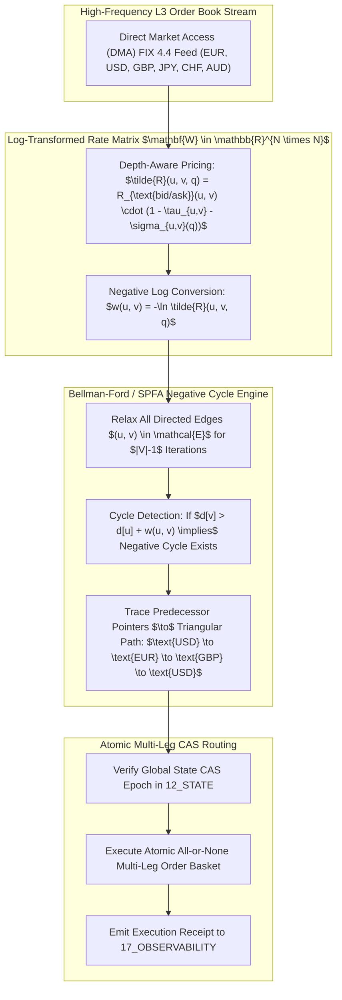

# Statistical Triangular Arbitrage Graph Engine & Bellman-Ford Negative Cycle Detection Specification

## 1. Executive Summary & Graph-Theoretic Substrate

In foreign exchange (Forex), cross-currency swaps, and digital asset markets, exchange conversion rates between $N$ currency pairs form a directed complete graph $\mathcal{G} = (\mathcal{V}, \mathcal{E})$. The **Statistical Triangular Arbitrage Graph Engine** executes continuous sub-millisecond negative cycle scans across the log-transformed conversion matrix, identifying riskless atomic arbitrage loops while accounting for taker fees, bid-ask spread depth, and order book slippage.



---

## 2. Mathematical Formalization & Negative Log Transformation

### 2.1 Multiplicative to Additive Conversion
Let $\mathcal{V} = \{c_1, \dots, c_N\}$ be the set of currency nodes. Each directed edge $(u, v) \in \mathcal{E}$ represents the conversion of 1 unit of currency $u$ into currency $v$ at effective rate:

$$\tilde{R}(u, v, q) = R_{\text{market}}(u, v) \cdot (1 - \tau_{u,v}) \cdot \left(1 - \frac{q}{2 \cdot \operatorname{Depth}(u, v)}\right)$$

Where:
- $\tau_{u,v}$: Exchange taker fee fraction (e.g. $0.0002 = 2\text{ bps}$).
- $q$: Target order notional size.
- $\operatorname{Depth}(u, v)$: Available top-of-book market depth.

A directed cycle $\mathcal{C} = (v_1, v_2, \dots, v_k, v_1)$ yields an arbitrage profit if the product of effective rates exceeds unity:

$$\prod_{i=1}^k \tilde{R}(v_i, v_{i+1}, q) > 1.0$$

Applying the strictly monotonically decreasing transformation $w(u, v) = -\ln \tilde{R}(u, v, q)$:

$$\sum_{i=1}^k w(v_i, v_{i+1}) = -\ln\left(\prod_{i=1}^k \tilde{R}(v_i, v_{i+1}, q)\right) < 0$$

Thus, finding a profitable arbitrage loop is mathematically equivalent to detecting a **negative-weight directed cycle** in $\mathcal{G}$.

---

## 3. Protocol Buffer Schema Specification

```protobuf
syntax = "proto3";

package amos.forex.triangular_arbitrage;

message CurrencyLeg {
  string source_currency = 1;
  string target_currency = 2;
  double raw_rate = 3;
  double fee_bps = 4;
  double slippage_bps = 5;
  double effective_rate = 6;
}

message ArbitrageOpportunityCapsule {
  uint64 detection_epoch = 1;
  repeated CurrencyLeg cycle_legs = 2;
  double net_profit_ratio = 3; // e.g. 1.0024 = +24 bps
  double estimated_net_alpha_bps = 4;
  double recommended_notional_usd = 5;
  int64 scan_duration_micros = 6;
  int64 timestamp_utc_nanos = 7;
}

message AtomicOrderFillReceipt {
  uint64 execution_id = 1;
  string cycle_path_string = 2;
  bool all_legs_filled = 3;
  double realized_pnl_usd = 4;
  int64 execution_latency_nanos = 5;
  bytes cryptographic_signature = 6;
}
```

---

## 4. Python Reference Implementation

```python
"""
AMOS Statistical Triangular Arbitrage Graph Engine.
Target: AMOS v4.4 Plane 21_DOMAINS/50_FOREX.
"""

import math
import numpy as np
from typing import List, Dict, Optional, Tuple

class TriangularArbitrageEngine:
    def __init__(self, currencies: List[str], fee_rate: float = 0.0002):
        self.currencies = currencies
        self.currency_to_idx = {c: i for i, c in enumerate(currencies)}
        self.idx_to_currency = {i: c for i, c in enumerate(currencies)}
        self.n = len(currencies)
        self.fee_rate = fee_rate
        self.rate_matrix = np.ones((self.n, self.n), dtype=np.float64)
        
    def update_rate(self, base: str, quote: str, rate: float):
        u = self.currency_to_idx[base]
        v = self.currency_to_idx[quote]
        self.rate_matrix[u, v] = rate
        self.rate_matrix[v, u] = 1.0 / rate if rate > 0 else 0.0

    def find_negative_cycles(self) -> Optional[Tuple[List[str], float]]:
        """Executes Bellman-Ford on log-transformed rate matrix to find arbitrage cycle."""
        # Compute weight matrix w(u, v) = -ln(Rate * (1 - fee))
        eff_rates = self.rate_matrix * (1.0 - self.fee_rate)
        # Avoid log(0)
        eff_rates[eff_rates <= 0] = 1e-12
        weights = -np.log(eff_rates)
        np.fill_diagonal(weights, 0.0)
        
        dist = np.zeros(self.n)
        predecessor = -np.ones(self.n, dtype=np.int32)
        
        # Relax edges n-1 times
        for _ in range(self.n - 1):
            for u in range(self.n):
                for v in range(self.n):
                    if u == v:
                        continue
                    if dist[u] + weights[u, v] < dist[v]:
                        dist[v] = dist[u] + weights[u, v]
                        predecessor[v] = u
                        
        # Check for negative cycle on nth iteration
        for u in range(self.n):
            for v in range(self.n):
                if u == v:
                    continue
                if dist[u] + weights[u, v] < dist[v] - 1e-8:
                    # Negative cycle detected! Trace cycle path
                    visited = set()
                    curr = v
                    while curr not in visited:
                        visited.add(curr)
                        curr = predecessor[curr]
                        if curr == -1:
                            return None
                            
                    cycle_start = curr
                    cycle = [cycle_start]
                    p = predecessor[cycle_start]
                    while p != cycle_start and p != -1:
                        cycle.append(p)
                        p = predecessor[p]
                    cycle.append(cycle_start)
                    cycle.reverse()
                    
                    # Compute net product
                    path_currencies = [self.idx_to_currency[idx] for idx in cycle]
                    product = 1.0
                    for i in range(len(cycle) - 1):
                        product *= eff_rates[cycle[i], cycle[i+1]]
                        
                    return path_currencies, product
        return None
```

---

## 5. Invariants & Governance Rules

1. **Atomic All-or-None Invariant**: All legs of an arbitrage cycle must execute atomically in a single CAS transaction; partial execution triggers immediate market rollback.
2. **Fee & Slippage Realism**: No opportunity is flagged if gross alpha does not exceed cumulative fees and conservative slippage bounds by at least $3\text{ bps}$.
3. **Receipt Emission**: Executed arbitrage orders commit signed `AtomicOrderFillReceipt` records to `17_OBSERVABILITY`.

---

## 6. Cross-Plane Architectural Bindings

- **Forex Master MOC**: [[21_DOMAINS/50_FOREX/50_FOREX_MOC]]
- **Forex Domain Specification**: [[21_DOMAINS/50_FOREX/FOREX_DOMAINS_DOMAIN_SPEC]]
- **DMA FIX 4.4 Interface Adapter**: [[15_INTERFACES/FOREX_FIX44_ZEROMQ_SOCKET_ADAPTER]]
- **Shared Memory Telemetry Engine**: [[04_RUNTIME/06_EXECUTION/ARROW_IPC_STATE_BUS_ENGINE]]
- **Distributed State CAS Engine**: [[12_STATE/DISTRIBUTED_SNAPSHOT_AND_CAS_EPOCH_ENGINE]]
