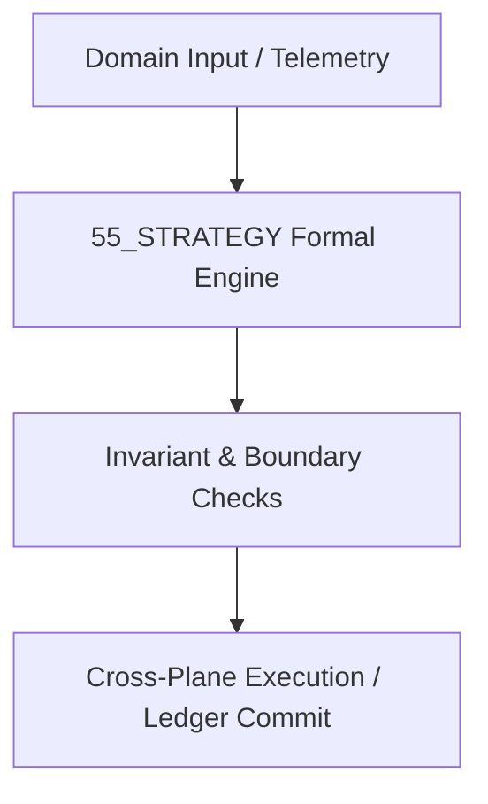

# 04 Strategy & Strategic Advantage Master Domain Specification

## 1. Domain Scope & Mission
The 04 Strategy domain governs competitive dynamics, extensive-form game theoretic analysis, Counterfactual Regret Minimization (CFR), and multi-horizon market positioning.



## 2. Mathematical Formalization & Core Invariants
In extensive games with imperfect information, counterfactual regret for action $a$ at information set $I$ is:
$$R^T(I, a) = \sum_{t=1}^T \left( v^{\sigma^t}(I, a) - v^{\sigma^t}(I) \right)$$
Regret matching strategy updates:
$$\sigma^{T+1}(I, a) = \frac{R^{T,+}(I, a)}{\sum_{b \in A(I)} R^{T,+}(I, b)}$$
Converges to $\epsilon$-Nash equilibrium at rate $\mathcal{O}(1/\sqrt{T})$.

## 3. Typed Interfaces & Capability Registry
```python
def compute_nash_equilibrium(game: ExtensiveGame) -> StrategyProfile: ...
def step_cfr_solver(tree: GameTree, iterations: Int) -> RegretTensor: ...
```

## 4. Cross-Plane Dependencies & Bindings
- [[06_AGENTS/06_AGENTS_MOC|06_AGENTS MOC]]
- [[08_WORKFLOWS/08_WORKFLOWS_MOC|08_WORKFLOWS MOC]]
- [[13_MODELS/13_MODELS_MOC|13_MODELS MOC]]
- [[00_ROOT/00_ROOT_MOC|Root Navigation MOC]]
- [[21_DOMAINS/21_DOMAINS_MOC|Domains Plane MOC]]

## Scope

This domain specification defines the `55_STRATEGY` domain within `21_DOMAINS`. It is one of the specialist or canonical knowledge domains and is governed by the `21_DOMAINS` cross-walk and `01_CANON` canonical constraints.

## Invariants

| ID | Invariant |
|----|-----------|
| 55_STRATEGY_DOMAIN_SPEC_INV_01 | Domain-specific claims are scoped to `55_STRATEGY` and do not universalize without cross-domain evidence. |
| 55_STRATEGY_DOMAIN_SPEC_INV_02 | All domain models are classified as `AMOS_MODEL` or `DERIVED` unless externally validated. |
| 55_STRATEGY_DOMAIN_SPEC_INV_03 | Domain MOC is the authoritative index for this directory. |

## Integration

- **Canonical binding:** `01_CANON/01_CORE_LAWS/LAW_HIERARCHY`
- **Cross-domain router:** `21_DOMAINS/00_INDEX/150_DOMAIN_CANON_MASTER_CROSSWALK`
- **Research input:** `22_RESEARCH/22_RESEARCH_MOC`
- **Runtime execution:** `04_RUNTIME/04_RUNTIME_MOC`

Domain models may inform `05_COGNITIVE_ORGANISM` engines but are not themselves cognitive primitives.

## Cross References
- [[{rel.parent}/55_STRATEGY_MOC|55_STRATEGY_MOC]]
- [[21_DOMAINS/21_DOMAINS_MOC|21_DOMAINS_MOC]]
- [[00_ROOT/00_ROOT_MOC|00_ROOT_MOC]]
