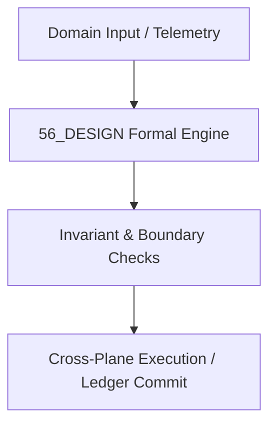

# 05 Design, Spatial Computing & Cognitive Aesthetics Master Domain Specification

## 1. Domain Scope & Mission
The 05 Design domain governs multimodal human-computer interfaces, generative UI layouts, cognitive ergonomics, tactile token systems, and spatial compute shaders.



## 2. Mathematical Formalization & Core Invariants
Cognitive visual entropy minimization balances visual salience $S(\mathbf{x})$ and information density $D(\mathbf{x})$:
$$\mathcal{L}_{\text{design}} = \int_{\Omega} \left( \|\nabla S(\mathbf{x})\|^2 + \lambda |D(\mathbf{x}) - D_{\text{optimal}}|^2 \right) d\mathbf{x}$$

## 3. Typed Interfaces & Capability Registry
```python
def generate_responsive_layout(tokens: DesignTokens, viewport: Viewport) -> LayoutTree: ...
def evaluate_cognitive_load(ui: ComponentHierarchy) -> LoadScore: ...
```

## 4. Cross-Plane Dependencies & Bindings
- [[15_INTERFACES/15_INTERFACES_MOC|15_INTERFACES MOC]]
- [[21_DOMAINS/21_C11_DESIGN_LANGUAGE/21_C11_DESIGN_LANGUAGE_MOC|21_C11_DESIGN_LANGUAGE MOC]]
- [[13_MODELS/13_MODELS_MOC|13_MODELS MOC]]
- [[00_ROOT/00_ROOT_MOC|Root Navigation MOC]]
- [[21_DOMAINS/21_DOMAINS_MOC|Domains Plane MOC]]

## Scope

This domain specification defines the `56_DESIGN` domain within `21_DOMAINS`. It is one of the specialist or canonical knowledge domains and is governed by the `21_DOMAINS` cross-walk and `01_CANON` canonical constraints.

## Invariants

| ID | Invariant |
|----|-----------|
| 56_DESIGN_DOMAIN_SPEC_INV_01 | Domain-specific claims are scoped to `56_DESIGN` and do not universalize without cross-domain evidence. |
| 56_DESIGN_DOMAIN_SPEC_INV_02 | All domain models are classified as `AMOS_MODEL` or `DERIVED` unless externally validated. |
| 56_DESIGN_DOMAIN_SPEC_INV_03 | Domain MOC is the authoritative index for this directory. |

## Integration

- **Canonical binding:** `01_CANON/01_CORE_LAWS/LAW_HIERARCHY`
- **Cross-domain router:** `21_DOMAINS/00_INDEX/150_DOMAIN_CANON_MASTER_CROSSWALK`
- **Research input:** `22_RESEARCH/22_RESEARCH_MOC`
- **Runtime execution:** `04_RUNTIME/04_RUNTIME_MOC`

Domain models may inform `05_COGNITIVE_ORGANISM` engines but are not themselves cognitive primitives.

## Cross References
- [[{rel.parent}/56_DESIGN_MOC|56_DESIGN_MOC]]
- [[21_DOMAINS/21_DOMAINS_MOC|21_DOMAINS_MOC]]
- [[00_ROOT/00_ROOT_MOC|00_ROOT_MOC]]
