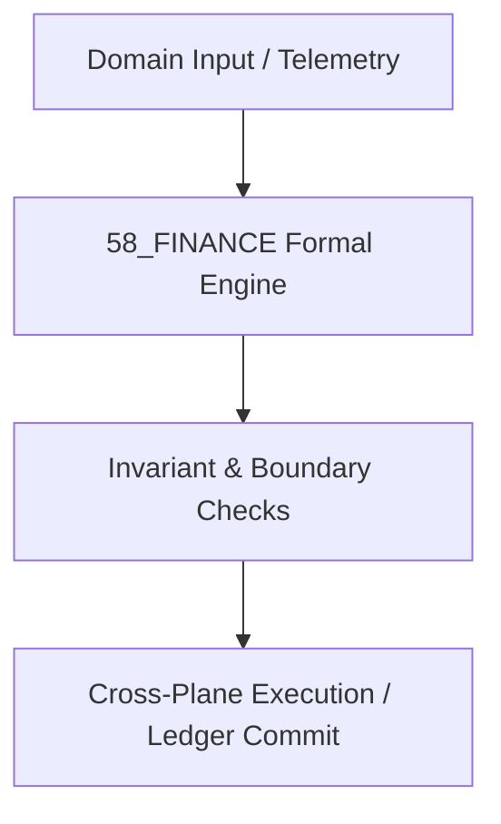

# 09 Quantitative Finance, Asset Pricing & Macro Markets Master Domain Specification

## 1. Domain Scope & Mission
The 09 Finance domain models continuous asset pricing, Black-Scholes-Merton and rough volatility surfaces, multi-asset portfolio optimization, and solvency risk management.



## 2. Mathematical Formalization & Core Invariants
Rough volatility modeling specifies log-volatility driven by fractional Brownian motion with Hurst parameter $H < 1/2$:
$$d\ln \sigma_t = \alpha(m - \ln \sigma_t) dt + \nu dW_t^H, \quad H \approx 0.1$$

## 3. Typed Interfaces & Capability Registry
```python
def calibrate_rough_heston_surface(market_quotes: QuoteTensor) -> CalibratedParameters: ...
def optimize_markowitz_portfolio(returns: Vector, cov: Matrix, risk_aversion: Float) -> AssetWeights: ...
```

## 4. Cross-Plane Dependencies & Bindings
- [[50_FOREX/50_FOREX_MOC|50_FOREX MOC]]
- [[17_C07_ECON_FINANCE/17_C07_ECON_FINANCE_MOC|17_C07_ECON_FINANCE MOC]]
- [[13_MODELS/13_MODELS_MOC|13_MODELS MOC]]
- [[00_ROOT/00_ROOT_MOC|Root Navigation MOC]]
- [[21_DOMAINS/21_DOMAINS_MOC|Domains Plane MOC]]

## Scope

This domain specification defines the `58_FINANCE` domain within `21_DOMAINS`. It is one of the specialist or canonical knowledge domains and is governed by the `21_DOMAINS` cross-walk and `01_CANON` canonical constraints.

## Invariants

| ID | Invariant |
|----|-----------|
| 58_FINANCE_DOMAIN_SPEC_INV_01 | Domain-specific claims are scoped to `58_FINANCE` and do not universalize without cross-domain evidence. |
| 58_FINANCE_DOMAIN_SPEC_INV_02 | All domain models are classified as `AMOS_MODEL` or `DERIVED` unless externally validated. |
| 58_FINANCE_DOMAIN_SPEC_INV_03 | Domain MOC is the authoritative index for this directory. |

## Integration

- **Canonical binding:** `01_CANON/01_CORE_LAWS/LAW_HIERARCHY`
- **Cross-domain router:** `21_DOMAINS/00_INDEX/150_DOMAIN_CANON_MASTER_CROSSWALK`
- **Research input:** `22_RESEARCH/22_RESEARCH_MOC`
- **Runtime execution:** `04_RUNTIME/04_RUNTIME_MOC`

Domain models may inform `05_COGNITIVE_ORGANISM` engines but are not themselves cognitive primitives.

## Cross References
- [[{rel.parent}/58_FINANCE_MOC|58_FINANCE_MOC]]
- [[21_DOMAINS/21_DOMAINS_MOC|21_DOMAINS_MOC]]
- [[00_ROOT/00_ROOT_MOC|00_ROOT_MOC]]
