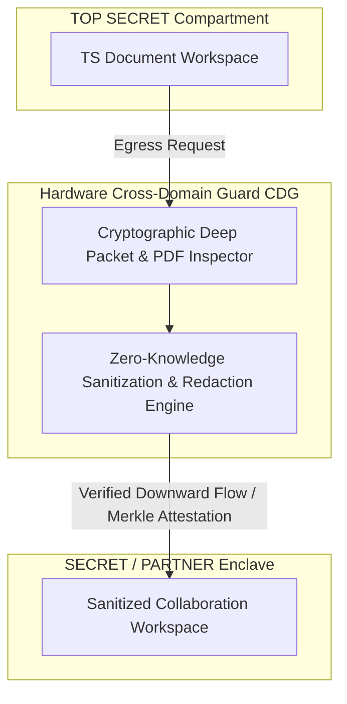

# Kojensi Classified Collaboration Case Study

> **Origin Architect / Steward:** Trang Phan  
> **Target Core Lineage:** `v4.4`  
> **Domain Family:** `C09: SECURITY & DEFENSE`  
> **Security Foundations:** Bell-LaPadula Formal Lattice, Biba Integrity Model, Attribute-Based Access Control (ABAC), Hardware Cross-Domain Guards

---

## 1. Executive Summary & Problem Formulation

Government defense establishments, intelligence agencies, and defense industrial base (DIB) supply chains require high-assurance information sharing across disjoint security enclaves (e.g., UNCLASSIFIED, RESTRICTED, SECRET, TOP SECRET, and Caveated compartments such as NOFORN or EYES ONLY). Traditional air-gapped data diodes and siloed collaboration platforms impede rapid operational decision-making, while standard commercial SaaS collaboration tools fail to enforce mandatory access control (MAC) and hardware-rooted cross-domain isolation.

The **AMOS Classified Collaboration Architecture** (modeled on the Kojensi platform formalization) establishes a mathematically verified Multi-Level Security (MLS) collaboration fabric capable of:
1. Provable information-flow control preventing downward leaks (No-Read-Up, No-Write-Down).
2. Cryptographically enforced Attribute-Based Access Control (ABAC) with hardware token attestation.
3. Automated multi-layer redaction and sanitization across secure enclave boundaries.

---

## 2. Mathematical Formalism: Bell-LaPadula & Biba Lattice Calculus

### 2.1 Information Flow Security Lattice

Let $(\mathcal{L}, \le)$ be a bounded lattice of security clearance levels, where $\mathcal{L} = \mathcal{C} \times \mathcal{P}(\mathcal{K})$:
- $\mathcal{C} = \{\text{UNCLASS} < \text{RESTRICTED} < \text{CONFIDENTIAL} < \text{SECRET} < \text{TOP\_SECRET}\}$ is a totally ordered set of classification ranks.
- $\mathcal{K}$ is a set of compartmental caveats (e.g., $\{\text{CYBER}, \text{INTEL}, \text{NOFORN}, \text{FIVE\_EYES}\}$).

For two security labels $L_1 = (c_1, K_1)$ and $L_2 = (c_2, K_2)$, the dominance relation $L_1 \sqsubseteq L_2$ holds if and only if:

$$c_1 \le c_2 \quad \text{and} \quad K_1 \subseteq K_2$$

---

### 2.2 Formal Axiomatic Invariants

Let $S$ be a subject (user, agent, or process) with clearance level $\lambda(S) \in \mathcal{L}$, and $O$ an object (file, message, or stream) with classification label $\lambda(O) \in \mathcal{L}$:

1. **Simple Security Property (No-Read-Up)**:
   $$S \text{ may read } O \iff \lambda(O) \sqsubseteq \lambda(S)$$
   A subject cannot access information for which it lacks adequate classification clearance or compartment caveats.

2. **$\star$-Property / Confinement (No-Write-Down)**:
   $$S \text{ may write to } O \iff \lambda(S) \sqsubseteq \lambda(O)$$
   A subject with elevated clearance cannot emit or leak classified state into lower-assurance containers, eliminating untrusted Trojan horse exfiltration.

3. **Biba Integrity Duality**:
   For integrity lattice $(\mathcal{I}, \le_I)$, let $\iota(S)$ and $\iota(O)$ denote integrity levels:
   $$S \text{ may write to } O \iff \iota(O) \le_I \iota(S) \quad (\text{No-Write-Up / Integrity preservation})$$
   $$S \text{ may read } O \iff \iota(S) \le_I \iota(O) \quad (\text{No-Read-Down / Corruption avoidance})$$

---

## 3. Cryptographic Enclave & Cross-Domain Guard Implementation

### 3.1 Hardware Enclave & Token Attestation

All participant nodes authenticate via FIPS 140-3 Level 4 hardware security modules (HSMs) or TPM 2.0 chips using attenuated cryptographic Macaroon tokens:

$$T = \text{Macaroon}\left( \text{RootKey}_{\text{TPM}}, \text{SubjectID}, \{\text{Clearance} = \text{SECRET}, \text{Caveat} = \text{FIVE\_EYES}, \text{Expiry} = t_{\text{exp}}, \text{Location} = \text{Geofence}_{\text{SCIF}}\} \right)$$

Every RPC call across enclaves carries an ephemeral BLS12-381 multisignature generated by the enclave's boundary guards.

---

### 3.2 Automated Zero-Knowledge Downward Sanitization

When an object $O$ at $\text{TOP\_SECRET}$ requires downward release to a $\text{SECRET}$ partner:
1. **Automated Structural Sanitization**: The object is parsed into an abstract syntax tree (AST). All metadata headers, embedded objects, and caveated text blocks are stripped.
2. **ZK-STARK Redaction Proof**: The cross-domain guard generates a STARK proof $\pi_{\text{clean}}$ demonstrating that:
   $$\pi_{\text{clean}} = \text{ZK-Prove}\left( \text{Hash}(O_{\text{sanitized}}) \subseteq \text{Hash}(O_{\text{raw}}) \land \text{Entropy}_{\text{covert\_channels}}(O_{\text{sanitized}}) = 0 \right)$$
3. **Hardware Optical Data Diode**: The validated, sanitized payload is beamed across a unidirectional fiber-optic diode, physically preventing bidirectional socket leakage.

---

## 4. Integration with AMOS 18 Security & Operating Model

| AMOS Plane | Component | Functional Alignment |
| :--- | :--- | :--- |
| [[18_SECURITY/18_SECURITY_MOC\|18_SECURITY]] | [[18_SECURITY/ZERO_KNOWLEDGE_STARK_STATE_TRANSITION_PROVER\|ZK-STARK Prover]] | State-transition validity proof for inter-enclave transfers |
| [[23_OPERATING_MODEL/01_ROLES/ROLE_REGISTRY\|23_OPERATING_MODEL]] | Macaroon RBAC / ABAC Substrate | Cryptographic delegation and authority attenuation |
| [[02_KERNEL/K_FAIL_CLOSED\|02_KERNEL]] | Fail-Closed Safety Contract | Immediate quarantine of unauthenticated cross-domain packets |

---

## 5. Architectural Invariants

| Invariant ID | Property | Verification Method |
| :--- | :--- | :--- |
| `KOJENSI_INV_01` | $\forall s, o: \text{Read}(s, o) \implies \lambda(o) \sqsubseteq \lambda(s)$ | Machine-checked Lean 4 lattice invariant |
| `KOJENSI_INV_02` | Zero Unidirectional Reverse Channel Leakage | Physical optical diode hardware verification |
| `KOJENSI_INV_03` | Audit Log Tamper-Proofness | SHA-256 Merkle mountain range append-only log |

---

## 6. Cross-Plane References

- **Security Hub:** [[21_DOMAINS/59_SECURITY/59_SECURITY_MOC|59_SECURITY_MOC]]
- **Security Plane:** [[18_SECURITY/18_SECURITY_MOC|18_SECURITY_MOC]]
- **Control Plane Contracts:** [[03_CONTROL_PLANE/CONTROL_PLANE_CONTROL_PLANE_CONTRACT|Control Plane Contract]]
- **Root MOC:** [[00_ROOT/00_ROOT_MOC|00_ROOT_MOC]]
