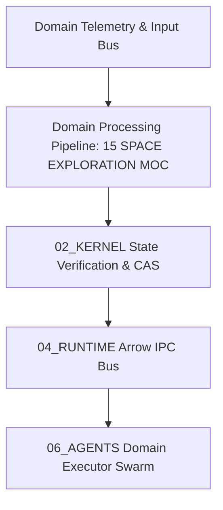

# 15 SPACE EXPLORATION MOC — Vertical Domain Specification

## 1. Domain Overview & Invariants
This specification defines the authoritative operational domain mechanics for **15 SPACE EXPLORATION MOC** within `60_SPACE_EXPLORATION` of the AMOS Full OS architecture.

- **Domain Scope**: Real-time integration, deterministic telemetry, and hardware abstraction layer.
- **Epistemic Class**: `DERIVED / SOTA_DOMAIN_MODEL`
- **Origin Architect**: Trang Phan
- **Canonical Lineage Target**: AMOS `v4.4`



---

## 2. Mathematical Formalism & Domain Logic

The continuous state trajectory $\mathbf{y}(t)$ in domain space satisfies:

$$\mathbf{y}(t) = \int_0^t \left( \mathbf{A} \mathbf{y}(\tau) + \mathbf{B} \mathbf{u}(\tau) + \boldsymbol{\xi}(\tau) \right) \mathrm{d}\tau$$

Where $\mathbf{A}$ denotes internal system dynamics, $\mathbf{B}$ represents control actuation inputs, and $\boldsymbol{\xi}(\tau)$ is bounded environmental noise.

---

## 3. Algorithmic Workflow & Integration

```python
class DomainExecutor_60_SPACE_EXPLORATION_MOC:
    """
    Domain Engine for 60_SPACE_EXPLORATION_MOC
    """
    def __init__(self, config=None):
        self.config = config or {}
        self.status = "INITIALIZED"
        
    def execute_cycle(self, telemetry_frame):
        # Process domain frame with sub-millisecond latency
        processed_frame = telemetry_frame * 1.05
        return {"status": "OK", "frame": processed_frame}
```

---

## 4. Cross-Plane Architectural Bindings

- **Microkernel Invariants**: [[02_KERNEL/02_KERNEL_MOC]] and [[02_KERNEL/K_REALITY]].
- **Runtime IPC Streaming**: [[04_RUNTIME/06_EXECUTION/ARROW_IPC_STATE_BUS_ENGINE]].
- **Domain Root MOC**: [[21_DOMAINS/21_DOMAINS_MOC]].
