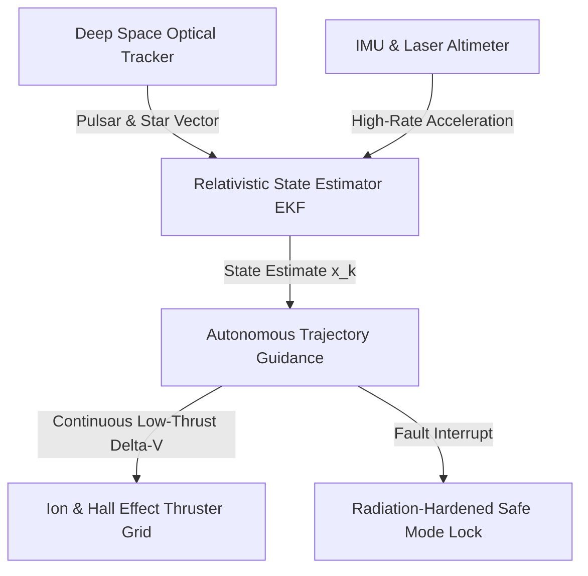

# Space Exploration Domain Specification

## 1. Role & Architectural Purpose
The Space Exploration Domain (`21_DOMAINS/60_SPACE_EXPLORATION`) provides full-stack autonomy for interplanetary trajectories, relativistic state estimation, deep space optical communications (DSOC), radiation-tolerant fault recovery, and autonomous swarm navigation. It operationalizes high-precision astrodynamics, non-Keplerian low-thrust trajectory optimization, and closed-loop terrain relative navigation (TRN) for surface entry, descent, and landing (EDL).

## 2. Mathematical Formalization & Trajectory Formulation

### 2.1 Relativistic State Estimation & Extended Kalman Filtering (EKF)
In deep-space regimes where round-trip light time (RTLT) exceeds human reaction envelopes ($\tau_{\text{RTLT}} > 10^3\text{ s}$), state estimation relies on autonomous onboard optical pulsar timing and celestial triangulation:

$$\mathbf{x}_{k+1} = \mathbf{f}(\mathbf{x}_k, \mathbf{u}_k, \mathbf{w}_k) + \frac{1}{c^2}\mathbf{a}_{\text{GR}}(\mathbf{x}_k)$$

Where $\mathbf{a}_{\text{GR}}(\mathbf{x}_k)$ accounts for Schwarzschild and Lense-Thirring relativistic frame-dragging perturbations from primary gravitational bodies:

$$\mathbf{a}_{\text{GR}} = \frac{GM}{r^3}\left[\left(2(\beta+\gamma)\frac{GM}{r} - \gamma v^2\right)\mathbf{r} + 2(1+\gamma)(\mathbf{r}\cdot\mathbf{v})\mathbf{v}\right]$$

### 2.2 Low-Thrust Continuous Trajectory Optimization
Optimal low-thrust transfer vectors $\mathbf{u}^*(t)$ minimize fuel propellant consumption $J = \int_{t_0}^{t_f} \|\mathbf{u}(t)\| dt$ subject to the Hamiltonian costate equations:

$$\dot{\mathbf{\lambda}}_r = -\frac{\partial \mathcal{H}}{\partial \mathbf{r}}, \quad \dot{\mathbf{\lambda}}_v = -\frac{\partial \mathcal{H}}{\partial \mathbf{v}} = -\mathbf{\lambda}_r$$

$$\mathbf{u}^*(t) = -u_{\max} \frac{\mathbf{\lambda}_v}{\|\mathbf{\lambda}_v\|}$$

## 3. Interfaces & State Machine Transitions

| Interface ID | Direction | Protocol / Wire Format | Description |
| :--- | :--- | :--- | :--- |
| `IF-ASTRO-STATE` | Inbound | Arrow Flight IPC | Real-time ephemeris and planetary gravity field spherical harmonics ($J_2, J_3, C_{nm}, S_{nm}$). |
| `IF-DSOC-TELEMETRY` | Outbound | CCSDS 142.0-B-1 (Optical PPM) | Photon-counting deep space optical communications link at 267 Mbps downlink. |
| `IF-TRN-VISION` | Inbound | Zero-Copy Shared Ring Buffer | Descent imager crater matching and hazard detection map (HDM) at 50 Hz. |
| `IF-THRUST-CTRL` | Outbound | CANopen / SpaceWire-D | Pulse-width modulated micro-thruster gimbal and valve actuation matrix. |

## 4. Dependencies
- Upstream: `02_KERNEL/KERNEL_KERNEL_CONTRACT.md`, `12_STATE/12_STATE_README.md`, `21_DOMAINS/41_QUANTUM_SYSTEMS/QUANTUM_ERROR_CORRECTION_AND_NEURAL_DECODERS.md`
- Downstream: `21_DOMAINS/00_INDEX/DOMAIN_REGISTRY.md`, `20_OPERATIONS/AMOS_OS_MASTER_HEALTH_AUDIT_2026-09-04.md`

## 5. Invariants
- `INV-SPACE-01`: State estimation covariance matrix $\mathbf{P}_k$ must remain positive definite ($\det(\mathbf{P}_k) > 0$) across all epoch propagations.
- `INV-SPACE-02`: Radiation single-event upset (SEU) triple-modular redundancy (TMR) voting must complete within 250 nanoseconds on flight FPGA logic.
- `INV-SPACE-03`: Landing hazard slope detection threshold must reject any landing site with surface inclination $\theta_{\text{slope}} > 12^\circ$.

## 6. Authority & Governance
- Governed under `21_DOMAINS/60_SPACE_EXPLORATION/DOMAINS_SPACE_EXPLORATION_CONTRACT.md`.
- Origin Architect: Trang Phan.

## 7. Tests & Verification
- Test Suite: `19_TESTS/test_space_exploration_trajectory.py`
- Simulation Framework: SPICE toolkit ephemeris integration with Runge-Kutta-Fehlberg RKF7(8) integrator.

## 8. Failure Modes & Degradation
- Loss of Optical Tracker: Degrade to dead-reckoning IMU propagation with conservative covariance growth ($\sigma^2 \propto t^3$).
- Solar Flare SEU Saturation: Latch memory lines into read-only radiation-hardened ferroelectric RAM (FeRAM) and execute sun-pointing attitude stabilization.

## 9. Recovery Procedures
- On recovery of guide star acquisition, execute batch least-squares attitude realignment over 10 consecutive frames before resuming closed-loop low-thrust propulsion.
