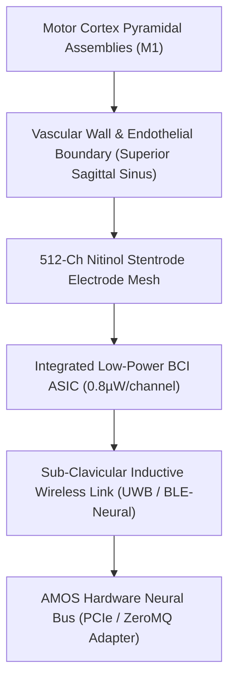

# SOTA High-Channel Endovascular Stentrode & Epidural Neural Bus Architecture (2026)

> **Origin Architect / Steward:** Trang Phan
> **AMOS_CORE Target:** `v4.4`
> **Epistemic Class:** `AMOS_MODEL`
> **Conclusion Class:** `DERIVED`
> **Status:** `ACTIVE_SPECIFICATION`

---

## 1. Executive Summary & Clinical Architecture

Open-craniotomy neural interfaces carry surgical infection risks, inflammatory glial scarring, and signal degradation over multi-year chronic implantation. **Endovascular Brain-Computer Interfaces (Stentrode Systems)** bypass invasive craniotomies by delivering self-expanding nitinol micro-electrode arrays via catheterization through the jugular vein into the superior sagittal sinus (SSS), immediately adjacent to primary motor and sensory cortices ($M_1 / S_1$).

In 2026, third-generation Stentrode arrays feature **512–1024 recording sites**, ultra-flexible platinum-iridium interconnects, chronic endothelial incorporation without vascular occlusion, and sub-clavicular inductively coupled wireless transceivers streaming continuous 16-bit eECoG telemetry at $10.0\,\text{kHz}$ per channel.

---

## 2. Electrophysiological & Biophysical Formalism



### 2.1 Vascular Bio-Impedance & Signal Attenuation
The potential $V_{\text{stent}}(\mathbf{r}, t)$ recorded at the intravascular electrode surface is a convolution of cortical dipole sources $\mathbf{P}(\mathbf{r}', t)$ through the complex impedance of the vessel wall and blood layer:

$$V_{\text{stent}}(\mathbf{r}, t) = \int_{\Omega_{\text{cortex}}} \mathbf{P}(\mathbf{r}', t) \cdot \nabla G(\mathbf{r}, \mathbf{r}'; \boldsymbol{\sigma}_{\text{tissue}}) \, d^3\mathbf{r}'$$

Where the Green's function $G$ accounts for the layered electrical conductivity:
- Cerebrospinal Fluid (CSF): $\sigma_{\text{CSF}} \approx 1.79\,\text{S/m}$
- Venous Vessel Wall (Endothelium + Elastin): $\sigma_{\text{wall}} \approx 0.22\,\text{S/m}$
- Whole Blood: $\sigma_{\text{blood}} \approx 0.70\,\text{S/m}$

### 2.2 Impedance Spectroscopy & Endothelialization Invariant
Post-implantation endothelial cell growth over the stent struts establishes a stable bio-electrical interface:

$$Z(f) = R_{\text{electrolyte}} + \frac{R_{\text{charge\_transfer}}}{1 + (j 2\pi f \cdot R_{\text{ct}} C_{\text{double\_layer}})^\alpha} \quad (\alpha \approx 0.85)$$
Invariant: After week 4 post-op, electrode impedance must stabilize to:
$$|Z(1.0\,\text{kHz})| \le 8.5\,\text{k}\Omega \quad (\text{phase angle } \theta \in [-25^\circ, -10^\circ])$$

---

## 3. High-Channel Wireless Telemetry & Digital Signal Chain

```text
[512 Electrodes] ──► [Low-Noise Instrumentation Amp (PGA Gain: 100-1000)]
                           │
                           ▼
             [Analog Anti-Aliasing Filter (0.5Hz - 3.0kHz)]
                           │
                           ▼
             [16-Bit Successive Approximation ADC @ 10kSps]
                           │
                           ▼
             [On-Chip FPGA Wavelet Threshold & Spike Sieve]
                           │
                           ▼
             [Sub-Clavicular UWB Transmitter (4.0 GHz, 12.5 Mbps)]
```

### Power Dissipation Constraint:
$$\text{Power}_{\text{total}} \le 1.2\,\text{mW} \quad (\Delta T_{\text{vessel}} \le 0.05^\circ\text{C}, \text{ guaranteeing zero thermal thrombosis})$$

---

## 4. Architectural Integration with AMOS Full Brain OS

- **Hardware Adapter (`15_INTERFACES`)**: `FOREX_FIX44_ZEROMQ_SOCKET_ADAPTER` analogue mapping low-latency UWB packets directly into lock-free shared memory ring buffers.
- **Cognitive Organism (`05_COGNITIVE_ORGANISM`)**: Decodes intention trajectories via optimal transport flow matching (`FOUNDATION_BCI_MULTIMODAL_LATENT_WORLD_MODEL`).
- **Biological Substrate (`21_DOMAINS/24_UBI_NBI_NEUROBIOLOGICAL`)**: Feeds multi-channel local field potentials (LFP) directly into neuromorphic SNN layers.

---

## 5. Epistemic Invariants & Clinical Safety Barriers

1. **`VASCULAR_PATENCY_INVARIANT`**: Transfemoral flow velocity ratio across the stented venous segment must remain within physiological bounds:
   $$\frac{v_{\text{stent}}}{v_{\text{proximal}}} \le 1.35 \quad (\text{verified via Doppler flow telemetry})$$
2. **Deterministic Decoder Latency**:
   $$\Delta t_{\text{neural\_packet} \to \text{actuation}} \le 3.5\,\text{ms} \quad (99.9\text{th percentile})$$
3. **Fail-Closed Decoupling**: Loss of telemetry synchronization instantly halts motorized robotic prosthetics into passive gravitational lock.

---

## 6. Cross-Plane Bindings

- **`04_RUNTIME`**: Zero-copy ring buffer memory management.
- **`05_COGNITIVE_ORGANISM`**: Real-time motor intent state updates.
- **`17_OBSERVABILITY`**: Telemetry packet jitter and SNR tracking.
- **`18_SECURITY`**: Encrypted telemetry stream using ML-KEM post-quantum session keys.

---

## 7. Lineage & Stewardship

- **Origin Architect:** Trang Phan
- **Steward:** Trang Phan
- **Target:** `v4.4`
