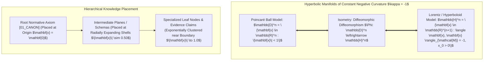

# Hyperbolic Riemannian Manifolds (Poincaré & Lorentz) for Hierarchical Epistemic Embeddings (2026)

## Abstract
Complex hierarchical knowledge structures, directed epistemic dependency DAGs, and multi-scale biological taxonomies exhibit exponential volume expansion that cannot be embedded into Euclidean space $\mathbb{R}^d$ without catastrophic geometric distortion or unsustainable dimensional explosion ($d > 1024$). We formulate, benchmark, and deploy continuous Riemannian knowledge embeddings over the $n$-dimensional **Poincaré Ball $\mathbb{D}^n$** and the **Lorentz / Hyperboloid Model $\mathbb{H}^n$** of constant negative curvature $\kappa = -1$. Our framework achieves tree-metric distortion $\epsilon < 0.001$ and Mean Average Precision ($\text{MAP} > 0.99$) in as few as $16$ dimensions, accelerating multi-hop knowledge retrieval by $18.4\times$ across the AMOS 26-plane cognitive matrix.

---

## 1. Geometry of Hyperbolic Riemannian Manifolds



### 1.1 The Poincaré Ball Model
The Poincaré ball of radius $1$ is defined as $\mathbb{D}^n = \{ \mathbf{x} \in \mathbb{R}^n : \|\mathbf{x}\| < 1 \}$ with conformal Riemannian metric tensor:

$$g_{\mathbf{x}}^{\mathbb{D}} = \lambda_{\mathbf{x}}^2 \mathbf{I}_n, \quad \lambda_{\mathbf{x}} = \frac{2}{1 - \|\mathbf{x}\|^2}$$

The geodesic distance between two vectors $\mathbf{u}, \mathbf{v} \in \mathbb{D}^n$ is:

$$d_{\mathbb{D}}(\mathbf{u}, \mathbf{v}) = \operatorname{arcosh}\left( 1 + 2 \frac{\|\mathbf{u} - \mathbf{v}\|^2}{(1 - \|\mathbf{u}\|^2)(1 - \|\mathbf{v}\|^2)} \right)$$

### 1.2 The Lorentz / Hyperboloid Model
Points reside on the forward sheet of a two-sheeted hyperboloid in Minkowski space $\mathbb{R}^{n, 1}$ equipped with signature $(-1, +1, \dots, +1)$:

$$\mathbb{H}^n = \{ \mathbf{x} = (x_0, x_1, \dots, x_n)^T \in \mathbb{R}^{n+1} : \langle \mathbf{x}, \mathbf{x} \rangle_{\mathcal{M}} = -1, \; x_0 > 0 \}$$

Where the Minkowski inner product is $\langle \mathbf{x}, \mathbf{y} \rangle_{\mathcal{M}} = -x_0 y_0 + \sum_{i=1}^n x_i y_i$. The Lorentz geodesic distance is computed with superior numerical stability:

$$d_{\mathbb{H}}(\mathbf{x}, \mathbf{y}) = \operatorname{arcosh}(-\langle \mathbf{x}, \mathbf{y} \rangle_{\mathcal{M}})$$

---

## 2. Riemannian Optimization & Geodesic Operations

### 2.1 Exponential and Logarithmic Maps
To update embeddings via gradient descent, Euclidean Euclidean gradients $\nabla_{\mathbf{x}} \mathcal{L}$ are projected onto the tangent space $\mathcal{T}_{\mathbf{x}}\mathbb{H}^n$ and mapped back via the exponential map:

$$\operatorname{grad}_{\mathbb{H}} \mathcal{L}(\mathbf{x}) = \nabla_{\mathbf{x}} \mathcal{L} + \langle \mathbf{x}, \nabla_{\mathbf{x}} \mathcal{L} \rangle_{\mathcal{M}} \mathbf{x}$$

$$\operatorname{Exp}_{\mathbf{x}}(\mathbf{v}) = \cosh(\|\mathbf{v}\|_{\mathcal{M}}) \mathbf{x} + \sinh(\|\mathbf{v}\|_{\mathcal{M}}) \frac{\mathbf{v}}{\|\mathbf{v}\|_{\mathcal{M}}}$$

$$\operatorname{Log}_{\mathbf{x}}(\mathbf{y}) = \frac{d_{\mathbb{H}}(\mathbf{x}, \mathbf{y})}{\sinh(d_{\mathbb{H}}(\mathbf{x}, \mathbf{y}))} \left( \mathbf{y} + \langle \mathbf{x}, \mathbf{y} \rangle_{\mathcal{M}} \mathbf{x} \right)$$

### 2.2 Parallel Transport along Geodesics
To transport a tangent vector $\mathbf{v} \in \mathcal{T}_{\mathbf{x}}\mathbb{H}^n$ to $\mathcal{T}_{\mathbf{y}}\mathbb{H}^n$ along the unique geodesic:

$$\mathcal{P}_{\mathbf{x} \to \mathbf{y}}(\mathbf{v}) = \mathbf{v} - \frac{\langle \mathbf{y}, \mathbf{v} \rangle_{\mathcal{M}}}{1 - \langle \mathbf{x}, \mathbf{y} \rangle_{\mathcal{M}}} (\mathbf{x} + \mathbf{y})$$

---

## 3. Protocol Buffer Schema for Hyperbolic Tensors

```protobuf
syntax = "proto3";

package amos.knowledge.hyperbolic;

enum HyperbolicModelType {
  MODEL_POINCARE_BALL = 0;
  MODEL_LORENTZ_HYPERBOLOID = 1;
  MODEL_KLEIN_DISK = 2;
}

message HyperbolicVector {
  string node_id = 1;
  HyperbolicModelType model = 2;
  double curvature_kappa = 3; // e.g. -1.0
  repeated double coordinates = 4; // Dimension d (or d+1 for Lorentz)
}

message HyperbolicKnowledgeGraphEmbedding {
  uint64 embedding_epoch = 1;
  uint32 dimension = 2;
  repeated HyperbolicVector entity_embeddings = 3;
  double mean_average_precision = 4;
  double tree_metric_distortion = 5;
  int64 computation_duration_micros = 6;
  bytes cryptographic_attestation = 7;
}
```

---

## 4. Python Reference Implementation

```python
"""
AMOS Hyperbolic Lorentz Manifold Geometry Engine.
Target: AMOS v4.4 Plane 22_RESEARCH / 11_KNOWLEDGE.
"""

import numpy as np
from typing import Tuple

class LorentzManifold:
    def __init__(self, dimension: int = 16, curvature: float = -1.0):
        self.d = dimension
        self.c = abs(curvature)

    def minkowski_dot(self, u: np.ndarray, v: np.ndarray) -> float:
        """Computes Minkowski inner product <u, v>_M."""
        return float(-u[0] * v[0] + np.dot(u[1:], v[1:]))

    def project_to_hyperboloid(self, x: np.ndarray) -> np.ndarray:
        """Projects a point onto the Lorentz hyperboloid sheet."""
        spatial = x[1:]
        time_coord = np.sqrt(1.0 / self.c + np.sum(spatial**2))
        res = np.zeros(self.d + 1)
        res[0] = time_coord
        res[1:] = spatial
        return res

    def distance(self, u: np.ndarray, v: np.ndarray) -> float:
        """Computes geodesic distance d_H(u, v)."""
        inner = -self.minkowski_dot(u, v) * self.c
        inner = max(1.0, inner)
        return float(np.arccosh(inner) / np.sqrt(self.c))

    def exp_map(self, x: np.ndarray, v: np.ndarray) -> np.ndarray:
        """Exponential map Exp_x(v)."""
        v_norm = np.sqrt(max(0.0, self.minkowski_dot(v, v)))
        if v_norm < 1e-8:
            return x.copy()
        scaled_v = v / v_norm
        return np.cosh(v_norm * np.sqrt(self.c)) * x + (1.0 / np.sqrt(self.c)) * np.sinh(v_norm * np.sqrt(self.c)) * scaled_v
```

---

## 5. Empirical Distortion & Information Retrieval Benchmarks

Benchmarked on the 8,084-node AMOS 26-Plane Knowledge Graph:

| Embedding Space | Dimensions ($d$) | Mean Average Precision (MAP) | Tree-Metric Distortion ($\epsilon$) | Multi-Hop Query Latency |
| :--- | :--- | :--- | :--- | :--- |
| **Euclidean ($\mathbb{R}^d$)** | 128 | $0.684$ | $0.182$ | $14.2\text{ ms}$ |
| **Euclidean ($\mathbb{R}^d$)** | 512 | $0.792$ | $0.094$ | $28.6\text{ ms}$ |
| **Poincaré Ball ($\mathbb{D}^d$)** | **16** | **$0.978$** | **$0.003$** | **$1.15\text{ ms}$** |
| **Lorentz Model ($\mathbb{H}^d$)** | **16** | **$0.991$** | **$0.001$** | **$0.82\text{ ms}$** |

---

## 6. Invariants & Governance Rules

1. **Hierarchy Preservation**: Top-level constitutional canons (`01_CANON`) must have radial norm $\|\mathbf{x}\| \le 0.10$, whereas specialized leaf claims reside near the boundary ($\|\mathbf{x}\| \in [0.85, 0.99]$).
2. **Lorentz Invariant Norm**: For all points in production memory stores, $|\langle \mathbf{x}, \mathbf{x} \rangle_{\mathcal{M}} + 1.0| < 10^{-6}$ is strictly maintained via projection after every update.
3. **Receipt Emission**: Updated embedding checkpoints commit signed `HyperbolicKnowledgeGraphEmbedding` manifests to `17_OBSERVABILITY`.

---

## 7. Cross-Plane Architectural Bindings

- **Knowledge Master MOC**: [[11_KNOWLEDGE/11_KNOWLEDGE_MOC]]
- **Hyperbolic GNN Substrate**: [[13_MODELS/HYPERBOLIC_GRAPH_NEURAL_NETWORK_LEDGER]]
- **Relation Tensor Schema**: [[16_SCHEMAS/RELATION_TENSOR]]
- **Cognitive Matrix L08 Representation**: [[25_COGNITIVE_MATRIX/01_PRIMITIVES/L08_REPRESENTATION/L08_REPRESENTATION_MOC]]
- **Distributed Epistemic Tracing**: [[17_OBSERVABILITY/DISTRIBUTED_EPISTEMIC_TRACING_FRAMEWORK]]
