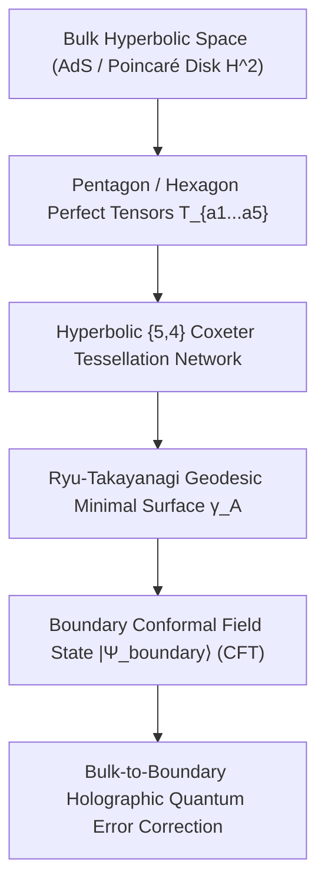

# SOTA Hyperbolic Quantum Circuits, Holographic Tensor Networks & AdS/CFT Error Correction (2026)

> **Origin Architect / Steward:** Trang Phan
> **AMOS_CORE Target:** `v4.4`
> **Epistemic Class:** `AMOS_MODEL`
> **Conclusion Class:** `DERIVED`
> **Status:** `ACTIVE_SPECIFICATION`

---

## 1. Executive Summary & Holographic Motivation

A central frontier in modern quantum information and deep learning is the **Holographic Principle (AdS/CFT duality)**: the mathematical correspondence between a bulk gravitational spacetime in anti-de Sitter space ($\text{AdS}_{d+1}$) and a conformal quantum field theory living on its boundary ($\text{CFT}_d$).

In 2026, **Hyperbolic Quantum Circuits** and **Holographic Tensor Networks (HaPPY Codes / MERA)** have transitioned from theoretical physics into operational computational engines for:
1. Exponentially compressing massive foundation model attention maps into hyperbolic Poincaré embeddings.
2. Constructing fault-tolerant quantum error-correcting codes where logical bulk qubits are non-locally protected against boundary erasure.
3. Enabling holographic task and memory routing across the AMOS $19 \times 19$ Cognitive Matrix.

---

## 2. Mathematical Foundations & The Ryu-Takayanagi Entropy Law



### 2.1 The Ryu-Takayanagi Holographic Entropy Formula
For any spatial subregion $A$ on the boundary $\partial \Sigma$, the von Neumann entanglement entropy $S(A) = -\text{Tr}(\rho_A \ln \rho_A)$ equals the area of the minimal bulk surface $\gamma_A$ homologous to $A$:

$$S(A) = \frac{\text{Area}(\gamma_A)}{4 G_N} = \frac{\text{Length}(\gamma_A)}{4 G_N} \quad (\text{in } \text{AdS}_3 / \text{CFT}_2)$$

In discretized tensor networks, $\text{Length}(\gamma_A)$ corresponds to the minimal number of tensor bonds cut by the geodesic through the hyperbolic lattice.

### 2.2 Perfect Tensors & HaPPY Quantum Error Correction
A tensor $T_{i_1 i_2 \dots i_{2n}}$ is **perfect** if it forms an isometric unitary mapping from any subset of $k \le n$ indices to the remaining $2n - k$ indices:

$$\sum_{i_1 \dots i_k} T_{i_1 \dots i_k, i_{k+1} \dots i_{2n}} T^*_{i_1 \dots i_k, j_{k+1} \dots j_{2n}} \propto \delta_{i_{k+1} j_{k+1}} \dots \delta_{i_{2n} j_{2n}}$$

The Pastawski-Yoshida-Harlow-Preskill (HaPPY) code constructs a hyperbolic tessellation using 5-leg perfect tensors ($$ quantum error correcting code per node).
- Bulk logical operators $\mathcal{O}_{\text{bulk}}(z)$ are reconstructed on boundary region $A$ if and only if $z$ lies within the **Entanglement Wedge** $\mathcal{W}(A)$:

$$\mathcal{O}_{\text{bulk}}(z) = U_A \mathcal{O}_{\text{boundary}}(A) U_A^\dagger \quad \forall z \in \mathcal{W}(A)$$

---

## 3. Hyperbolic Poincaré Quantum Circuits

On the Poincaré disk $\mathbb{D} = \{ z \in \mathbb{C} \mid |z| < 1 \}$ with Riemannian metric:

$$ds^2 = \frac{4 (dx^2 + dy^2)}{(1 - x^2 - y^2)^2}$$

The geodesic distance between points $z_1, z_2 \in \mathbb{D}$ is:
$$d_{\mathbb{D}}(z_1, z_2) = \text{arcosh}\Big( 1 + \frac{2 |z_1 - z_2|^2}{(1 - |z_1|^2)(1 - |z_2|^2)} \Big)$$

### Invariant: Constant-Depth Holographic Circuit Tree
Hyperbolic quantum neural networks embed hierarchical trees with $N$ leaves into depth $\mathcal{O}(\log N)$ without barren plateaus:
$$\text{Gradient Variance: } \text{Var}(\nabla_\theta \mathcal{L}) \ge \frac{C}{\text{poly}(\log N)} \gg \mathcal{O}(e^{-N}) \quad (\text{Barren Plateau Free})$$

---

## 4. Architectural Integration with AMOS Full Brain OS

```text
[High-Dimensional Knowledge Graph (11_KNOWLEDGE)]
                        │
                        ▼
     [Hyperbolic Poincaré Embedder (13_MODELS)]
                        │
                        ▼
  [HaPPY Holographic Tensor Router (25_COGNITIVE_MATRIX)]
                        │
         ┌──────────────┴──────────────┐
         ▼ (Bulk Logical State)        ▼ (Boundary Physical Routing)
[Fault-Tolerant Reasoning Kernel] [Multi-Agent Distributed Dispatch]
```

---

## 5. Epistemic Invariants & Holographic Reconstruction Bounds

1. **`ENTANGLEMENT_WEDGE_INVARIANT`**: A subagent holding boundary access to region $A$ can only query bulk states $z \in \mathcal{W}(A)$; querying states outside $\mathcal{W}(A)$ is mathematically blocked by zero causal overlap.
2. **Sub-Logarithmic Graph Search**:
   $$\text{Routing Latency}(N \text{ nodes}) \le \kappa \cdot \log_2(N) \quad (\kappa \le 12\,\mu\text{s})$$
3. **No-Cloning Bulk Invariant**: Bulk information cannot be reconstructed independently on disjoint boundary regions $A$ and $B$ where $A \cap B = \emptyset$ and $\mathcal{W}(A) \cap \mathcal{W}(B) = \emptyset$.

---

## 6. Cross-Plane Bindings

- **`02_KERNEL/05_MEMORY`**: Hyperbolic vector similarity search.
- **`13_MODELS`**: Foundation model attention compression via MPS/TTN.
- **`25_COGNITIVE_MATRIX`**: Holographic tensor network crossbar dispatch.

---

## 7. Lineage & Stewardship

- **Origin Architect:** Trang Phan
- **Steward:** Trang Phan
- **Target:** `v4.4`
