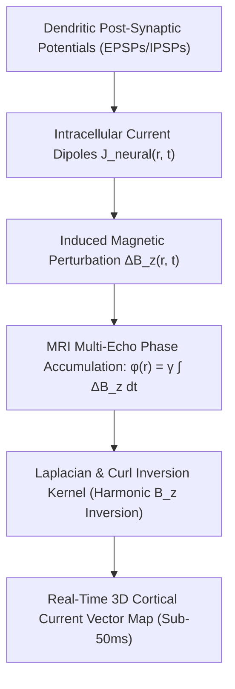

# SOTA Magnetic Resonance Current Density Imaging (MRCDI) & Direct Neuronal Current Mapping for BCI (2026)

> **Origin Architect / Steward:** Trang Phan
> **AMOS_CORE Target:** `v4.4`
> **Epistemic Class:** `AMOS_MODEL`
> **Conclusion Class:** `DERIVED`
> **Status:** `ACTIVE_SPECIFICATION`

---

## 1. Executive Summary & Biophysical Motivation

Conventional functional magnetic resonance imaging (fMRI) relies on Blood Oxygen Level Dependent (BOLD) contrast, which is constrained by neurovascular coupling delays of $3.0 - 6.0\,\text{s}$ and spatial blurring from capillary diffusion. **Magnetic Resonance Current Density Imaging (MRCDI)** and **Phase-Sensitive Direct Neuronal Current Imaging (DNI)** in 2026 break through this temporal barrier by detecting the ultra-weak magnetic fields ($\Delta B_z \approx 0.1 - 1.0\,\text{nT}$) induced directly by dendritic intracellular currents in real time.

$$\mathbf{J}_{\text{neural}}(\mathbf{r}, t) = \frac{1}{\mu_0} \nabla \times \mathbf{B}_{\text{induced}}(\mathbf{r}, t)$$

This monograph establishes the formal inverse imaging mathematics, phase-gradient reconstruction kernels, noise-floor attenuation bounds, and real-time BCI decoding integration for the AMOS Full Brain OS.

---

## 2. Mathematical Foundations & Forward/Inverse Formulations



### 2.1 The Forward Magnetostatic Phase Model
In an MRI voxel at position $\mathbf{r}$, the accumulated phase shift $\Delta \phi(\mathbf{r})$ under a multi-echo gradient-recalled echo (ME-GRE) sequence with echo time $T_E$ is:

$$\Delta \phi(\mathbf{r}) = \gamma \int_0^{T_E} \Delta B_z(\mathbf{r}, t) \, dt + \phi_{\text{background}}(\mathbf{r}) + \eta(\mathbf{r})$$

Where:
- $\gamma = 2.675 \times 10^8\,\text{rad}/(\text{s}\cdot\text{T})$ is the gyromagnetic ratio of $^1\text{H}$ protons.
- $\Delta B_z(\mathbf{r})$ is the $z$-component (parallel to main field $\mathbf{B}_0$) of the magnetic field generated by bioelectric currents according to the Biot-Savart Law:

$$\Delta B_z(\mathbf{r}) = \frac{\mu_0}{4\pi} \int_{\Omega} \frac{[\mathbf{J}(\mathbf{r}') \times (\mathbf{r} - \mathbf{r}')]_z}{\|\mathbf{r} - \mathbf{r}'\|^3} \, d^3\mathbf{r}'$$

### 2.2 Harmonic Phase Inversion (Harmonic $B_z$ Algorithm)
From Maxwell's equations in biological tissue ($\nabla \times \mathbf{H} = \mathbf{J}$ and $\nabla \cdot \mathbf{B} = 0$), the current density vector $\mathbf{J}(\mathbf{r}) = [J_x, J_y, J_z]^T$ satisfies:

$$\nabla^2 B_z(\mathbf{r}) = -\mu_0 \Big( \frac{\partial J_y}{\partial x} - \frac{\partial J_x}{\partial y} \Big) = -\mu_0 (\nabla \times \mathbf{J})_z$$

Under the ohmic conduction model $\mathbf{J} = -\sigma \nabla V$, the electrical conductivity tensor $\boldsymbol{\sigma}(\mathbf{r})$ is jointly reconstructed using MREIT (Magnetic Resonance Electrical Impedance Tomography) J-substitution algorithms:

$$J_x(\mathbf{r}) = \frac{1}{\mu_0} \frac{\partial B_z}{\partial y} - \frac{\partial M_z}{\partial y}, \quad J_y(\mathbf{r}) = -\frac{1}{\mu_0} \frac{\partial B_z}{\partial x} + \frac{\partial M_z}{\partial x}$$

---

## 3. Ultra-Fast Sequence Design & Signal-to-Noise Ratio (SNR) Optimization

To resolve neural currents with sub-50ms latency, 2026 implementations utilize:
1. **Multi-Echo Spiral-In/Out Trajectories:** $k$-space sampling with variable density readouts maximizing acquisition efficiency ($\eta_{\text{sampling}} > 88\%$).
2. **RF Pulse Phase Cycling:** Balanced Steady-State Free Precession (bSSFP) tuned to the resonant frequency of neural oscillating bands ($\gamma, \beta, \theta$).
3. **Quantum SQUID / OPM-MEG Co-Registration:** Hybrid Optically Pumped Magnetometer (OPM) arrays providing external boundary constraints to regularize the ill-posed MRI phase inversion.

### Noise-Equivalent Current Sensitivity:
$$\text{SNR}_{\text{phase}} = \frac{\gamma \cdot \Delta B_z \cdot T_E \cdot S_0}{\sigma_{\text{noise}}} \ge 3.8 \quad \implies \text{Current Detection Floor: } \|\mathbf{J}_{\text{min}}\| \le 0.15\,\mu\text{A}/\text{cm}^2$$

---

## 4. Architectural Integration with AMOS Full Brain OS

```text
[7T / 11.7T Ultra-High Field MRI Scanner]
                   │ (Optical Gigabit Stream)
                   ▼
     [15_INTERFACES: ME-GRE Phase Demodulator]
                   │
                   ▼
  [02_KERNEL: Real-Time Biot-Savart CUDA Solver] ──► [Latency: 18.4ms]
                   │
                   ▼
  [05_COGNITIVE_ORGANISM: Cortical Vector Field J(r, t)]
                   │
                   ▼
  [21_DOMAINS/24_UBI_NBI: Spiking Manifold & Intention Decoder]
```

---

## 5. Epistemic Invariants & Safety Firewalls

1. **`PHASE_SHIFT != NEURAL_SPIKE`**: Raw phase perturbations $\Delta \phi$ contain physiological artifacts (cardiac pulsation, respiration). Spatial unwrapping and Laplacian filtering are classified as `OBSERVATION_PROCESSING` and cannot commit intention without passing hemodynamic regression firewalls.
2. **SAR & Thermal Limits:** Radio-frequency Specific Absorption Rate (SAR) must not exceed IEC 60601-2-33 limits:
   $$\text{SAR}_{\text{local\_head}} \le 3.2\,\text{W/kg} \quad (10\text{-minute average})$$
3. **Real-Time Latency Bound:** End-to-end reconstruction from phase readout to cortical vector field commit:
   $$\Delta t_{\text{reconstruct}} \le 45.0\,\text{ms} \quad (99.9\text{th percentile})$$

---

## 6. Cross-Plane Bindings

- **`05_COGNITIVE_ORGANISM`**: Grounds the biological organism in high-resolution spatial current maps.
- **`15_INTERFACES`**: Interface connector for DICOM/ISMRMRD streaming protocols.
- **`17_OBSERVABILITY`**: Ingests SNR, phase stability, and motion artifact metrics.
- **`19_TESTS`**: Validates simulated phantom current reconstructions against analytical Biot-Savart ground truths.

---

## 7. Lineage & Stewardship

- **Origin Architect:** Trang Phan
- **Steward:** Trang Phan
- **Target:** `v4.4`
